# Module 29 — Sub-Phase 29.3: Observability, Telemetry & Tracing Questions (Q326–Q350)

---

### Q326: The Three Pillars of Observability & High-Cardinality Dimensionality

#### Question
How do the Three Pillars of Observability (Metrics, Logs, Traces) complement each other during production incident triage, and why does high-cardinality dimensionality cause catastrophic index explosions in traditional monitoring systems while modern cloud engines thrive on it?

#### Short Answer
**Metrics** detect that an anomaly is occurring in aggregate (e.g., `5xx_error_rate > 5%`), **Traces** localize the specific microservice and downstream dependency causing the delay (e.g., Payment Lambda calling Stripe API), and **Logs** provide detailed root-cause execution context (e.g., stack trace: `NullPointerException` at line 42). **High-cardinality dimensionality** (labels with millions of unique values, such as `user_id`, `order_id`, or `container_id`) breaks traditional time-series databases (Prometheus/Graphite) by triggering exponential memory and index bloat. Modern cloud observability engines (AWS CloudWatch with Embedded Metric Format and OCI Logging Analytics) handle high cardinality by decoupling streaming log ingestion from dynamic distributed indexing.

#### Deep Answer
1. **The Interplay of the Three Pillars During P1 Outages**:
   - *Phase 1: Detection (Metrics)*: An alert triggers: *"API Gateway p99 Latency breached 2,500ms"*. Metrics aggregate numerical values over fixed time buckets. They are cheap to store and fast to query, but lack granular causality.
   - *Phase 2: Isolation (Traces)*: SREs inspect distributed traces (AWS X-Ray / OCI APM). The waterfall timeline reveals that 2,400ms of the 2,500ms is spent inside `payment-service` waiting on an external banking API.
   - *Phase 3: Root Cause (Logs)*: Engineers query structured JSON logs filtering by the unique `trace_id` extracted from the trace. The log displays the raw HTTP payload: `Connection timed out after 2000ms: bank-gateway.example.com`. Total Mean Time to Resolution (MTTR): 3 minutes.

2. **The High-Cardinality Index Explosion Problem**:
   - In time-series databases (TSDBs like Prometheus), every unique combination of key-value label pairs creates an independent **Time Series**.
   - If an engineer adds `user_id` as a metric label:
     - 1,000,000 users $\times$ 10 endpoints $\times$ 5 HTTP methods $\to$ **50,000,000 distinct time series**!
     - Memory consumption explodes, the TSDB crashes with Out Of Memory (OOM), and queries grind to a halt.
   - **How Cloud Engines Solve High Cardinality**:
     - *AWS Embedded Metric Format (EMF)*: Ingests metrics structured inside JSON log events. CloudWatch extracts high-level metrics asynchronously without creating in-memory time-series explosions, while preserving high-cardinality fields (`user_id`, `ip`) in CloudWatch Logs Insights for ad-hoc querying.
     - *OCI Logging Analytics*: Leverages distributed columnar storage and machine learning clustering to index billions of high-cardinality log records without performance degradation.

#### Architecture
```
+----------------------------------------------------------------------------------------------------+
|                         THE THREE PILLARS & HIGH-CARDINALITY TRIAGE FLOW                           |
|                                                                                                    |
|  1. DETECTION (Metrics - Low Cardinality, Real-time Aggregation)                                   |
|  [ CloudWatch / OCI Monitoring ]: Alert! API Gateway HTTP 504 Gateway Timeout > 2%                |
|        |                                                                                           |
|        v 2. ISOLATION (Distributed Traces - Pinpoints Offending Component)                         |
|  [ AWS X-Ray / OCI APM Flame Graph ]:                                                              |
|  Client ===> API Gateway (5ms) ===> Orders Pod (15ms) ===> [ Payment Service (2,450ms! BOTTLENECK!) ]|
|        |                                                                                           |
|        v 3. ROOT CAUSE (Structured Logs - High Cardinality Query: filter by trace_id)              |
|  [ CloudWatch Logs Insights / OCI Logging Analytics ]:                                             |
|  Query: fields @timestamp, @message | filter trace_id = "1-5759dc3..."                             |
|  Output: { "error": "TCP Timeout", "downstream_ip": "198.51.100.22", "order_id": "ORD-991248" }   |
|  [ COMPLETE ROOT CAUSE DISCOVERED IN <3 MINUTES! ]                                                 |
+----------------------------------------------------------------------------------------------------+
```

#### AWS Implementation
- **Emit High-Cardinality Metrics via AWS Embedded Metric Format (EMF) in Node.js**:
  Output structured JSON logs that generate CloudWatch metrics without time-series bloat [Doc: CloudWatch/EMF, checked 2026]:
  ```javascript
  import { createMetricsLogger, Unit } from "aws-embedded-metrics";

  export const handler = async (event) => {
    const metrics = createMetricsLogger();

    // High-cardinality contextual properties (stored in logs for querying, NOT in metric dimensions!)
    metrics.setProperty("UserId", event.userId);
    metrics.setProperty("OrderId", event.orderId);
    metrics.setProperty("ClientIP", event.requestContext.http.sourceIp);

    // Low-cardinality dimensions (safe for metric aggregation)
    metrics.setDimensions({ ServiceName: "PaymentService", Environment: "Production" });

    // Metric measurement
    const startTime = Date.now();
    try {
      // Process payment...
      metrics.putMetric("PaymentSuccess", 1, Unit.Count);
    } catch (err) {
      metrics.putMetric("PaymentFailure", 1, Unit.Count);
      throw err;
    } finally {
      metrics.putMetric("ProcessingLatency", Date.now() - startTime, Unit.Milliseconds);
      await metrics.flush();
    }
  };
  ```

#### OCI Implementation
- **Ingest High-Cardinality Logs into OCI Logging Analytics (Python)**:
  Emit structured telemetry ingested by OCI Logging Analytics [Doc: OCI Logging Analytics, checked 2026]:
  ```python
  import logging
  import json
  import time

  # Configure structured JSON logger for OCI Unified Monitoring Agent
  logger = logging.getLogger("payment_service")
  logger.setLevel(logging.INFO)

  def log_transaction(order_id, user_id, amount, latency_ms, status):
      telemetry_record = {
          "timestamp": int(time.time() * 1000),
          "service": "PaymentProcessor",
          "order_id": order_id,       # High cardinality
          "user_id": user_id,         # High cardinality
          "amount": amount,
          "latency_ms": latency_ms,
          "status": status,
          "log_source": "OCI_LOGGING_ANALYTICS"
      }
      logger.info(json.dumps(telemetry_record))
  ```

- **Query High-Cardinality Fields in OCI Logging Analytics via OCI CLI**:
  ```bash
  oci log-analytics query execute \
      --compartment-id ocid1.compartment.oc1..aaaaaaa... \
      --query-string "'Log Source' = 'PaymentProcessor' | stats count() by status, user_id"
  ```

#### Common Trap
Adding high-cardinality labels (like `user_id` or `uuid`) directly as dimensions in AWS CloudWatch `put-metric-data` calls. CloudWatch charges \$0.30 per custom metric per month; creating 100,000 unique metric dimension combinations will generate a shocking **\$30,000 monthly CloudWatch bill**! High-cardinality data must be recorded in structured logs (EMF) and queried via Logs Insights rather than custom metric dimensions.

#### Follow-up Question
How does CloudWatch Logs Insights execute parallelized map-reduce scans across terabytes of log data without requiring pre-indexed Elasticsearch clusters?

---

### Q327: OpenTelemetry (OTel) Architecture & Vendor-Agnostic Telemetry

#### Question
How does the OpenTelemetry (CNCF OTel) collection architecture (APIs, SDKs, OpenTelemetry Collector pipelines: receivers, processors, exporters) standardize telemetry, and how does AWS Distro for OpenTelemetry (ADOT) compare with OCI Unified Monitoring Agent?

#### Short Answer
**OpenTelemetry (OTel)** is the vendor-neutral CNCF industry standard that replaces proprietary monitoring agents. The architecture decouples code instrumentation from backend analysis: applications use the OTel API/SDK to generate telemetry, transmitting it via the **OTLP (OpenTelemetry Protocol)** to an **OTel Collector**. The Collector processes telemetry through **receivers** (ingestion), **processors** (batching, memory limiting, redaction), and **exporters** (fan-out delivery). **AWS Distro for OpenTelemetry (ADOT)** is an AWS-supported distribution of the OTel Collector optimized for X-Ray, CloudWatch, and Prometheus. OCI natively supports OTel across OCI APM, while the **OCI Unified Monitoring Agent** (fluentd-based) handles host-level infrastructure logs and metrics.

#### Deep Answer
1. **The Vendor Lock-In Trap of Proprietary Agents**:
   - Traditionally, migrating from Datadog to New Relic or CloudWatch required rewriting code with proprietary SDKs and redeploying proprietary host agents.
   - OpenTelemetry eliminates this: developers instrument code once using open-source OTel libraries. Routing telemetry to a new backend requires only changing an exporter configuration in the OTel Collector YAML file—**with zero application code modifications**.

2. **The OpenTelemetry Collector Pipeline Architecture**:
   - Operates as an independent daemon or Kubernetes sidecar.
   - **Pipeline Structure**:
     - **Receivers**: Ingests telemetry in various formats (OTLP over gRPC port 4317, OTLP over HTTP port 4318, Prometheus scrape endpoints, Zipkin, Jaeger).
     - **Processors**: Manipulates data in memory:
       - `batch`: Batches spans and metrics to reduce network calls.
       - `memory_limiter`: Drops or scraps data if the collector process nears container memory ceilings.
       - `attributes`: Injects cloud metadata (`cloud.provider = "aws"`, `cloud.region = "us-east-1"`) or masks PII (redacting credit card regexes).
     - **Exporters**: Converts internal telemetry into vendor formats and pushes to backends:
       - AWS: `awsxray`, `awsemf`, `prometheusremotewrite`.
       - OCI: `otlphttp` exporting directly to OCI APM and OCI Monitoring.

3. **ADOT vs OCI Telemetry Agents**:
   - **AWS Distro for OpenTelemetry (ADOT)**:
     - 100% upstream OTel compliant with AWS security patches and performance optimizations.
     - Deploys as an EKS add-on or ECS sidecar container.
   - **OCI Telemetry Architecture**:
     - OCI APM is natively OTLP-compliant; applications push OTel traces directly to OCI APM over standard HTTPS.
     - For host OS infrastructure, OCI uses the **Unified Monitoring Agent** (built on Fluentd) to harvest syslog, Windows event logs, and custom system metrics.

#### Architecture
```
+----------------------------------------------------------------------------------------------------+
|                         OPENTELEMETRY (OTEL) COLLECTOR PIPELINE                                    |
|                                                                                                    |
|  [ Microservices: Go, Java, Python, Node.js ]                                                     |
|  * Instrumented with OpenTelemetry SDK (Zero Vendor Code!)                                         |
|        |                                                                                           |
|        v OTLP over gRPC (Port 4317) / OTLP over HTTP (Port 4318)                                  |
|  +-----------------------------------------------------------------------------------------------+ |
|  | OpenTelemetry Collector (ADOT / Sidecar / Gateway Daemon)                                     | |
|  |                                                                                               | |
|  | 1. RECEIVERS: [ otlp (gRPC/HTTP) ]  [ prometheus ]  [ jaeger ]                                 | |
|  |                       |                                                                         | |
|  |                       v Pipeline Flow                                                           | |
|  | 2. PROCESSORS: [ memory_limiter ] -> [ batch ] -> [ attributes (PII Redaction & Cloud Tags) ]   | |
|  |                       |                                                                         | |
|  |                       v Dynamic Multi-Backend Routing                                           | |
|  | 3. EXPORTERS:         +-----------------------------+-----------------------------+             |
|  |                       |                             |                             |             |
|  |                       v                             v                             v             |
|  |               [ awsxray / awsemf ]          [ otlphttp (OCI APM) ]         [ prometheus ]       |
|  +-----------------------+-----------------------------+-----------------------------+-----------+ |
|                          |                             |                             |             |
|                          v                             v                             v             |
|  [ AWS CloudWatch & X-Ray ]           [ OCI APM & Monitoring ]            [ Self-Hosted Grafana ]  |
|  (Vendor Independence Achieved! Switch backends instantly via YAML configuration!)                 |
+----------------------------------------------------------------------------------------------------+
```

#### AWS Implementation
- **Deploy ADOT Collector on EKS (Kubernetes Manifest)**:
  Configure OTel collector pipelines exporting to X-Ray and CloudWatch [Doc: ADOT/Collector, checked 2026]:
  ```yaml
  apiVersion: opentelemetry.io/v1alpha1
  kind: OpenTelemetryCollector
  metadata:
    name: adot-collector
    namespace: opentelemetry
  spec:
    image: public.ecr.aws/aws-observability/aws-otel-collector:v0.38.0
    config: |
      receivers:
        otlp:
          protocols:
            grpc:
              endpoint: 0.0.0.0:4317
            http:
              endpoint: 0.0.0.0:4318

      processors:
        memory_limiter:
          check_interval: 1s
          limit_percentage: 75
          spike_limit_percentage: 20
        batch:
          timeout: 5s
          send_batch_size: 512

      exporters:
        awsxray:
          region: us-east-1
        awsemf:
          region: us-east-1
          log_group_name: "/aws/observability/adot-metrics"

      service:
        pipelines:
          traces:
            receivers: [otlp]
            processors: [memory_limiter, batch]
            exporters: [awsxray]
          metrics:
            receivers: [otlp]
            processors: [memory_limiter, batch]
            exporters: [awsemf]
  ```

#### OCI Implementation
- **Configure OTel Collector Pipeline Exporting to OCI APM**:
  Configure OTLP HTTP exporter pointing to OCI APM Data Upload Endpoint [Doc: OCI APM/OTel, checked 2026]:
  ```yaml
  receivers:
    otlp:
      protocols:
        grpc:
          endpoint: 0.0.0.0:4317

  processors:
    batch:
      timeout: 5s
      send_batch_size: 512
    resource:
      attributes:
      - key: service.name
        value: order-processor-oci
        action: upsert

  exporters:
    otlphttp:
      endpoint: "https://abcd.apm-agt.us-ashburn-1.oci.oraclecloud.com/20200101/opentelemetry"
      headers:
        Authorization: "dataKey ${OCI_APM_DATA_KEY}"

  service:
    pipelines:
      traces:
        receivers: [otlp]
        processors: [batch, resource]
        exporters: [otlphttp]
  ```

- **Verify OTel Collector Status via Systemd**:
  ```bash
  systemctl status otelcol
  ```

#### Common Trap
Placing the `batch` processor *before* the `memory_limiter` processor in the OTel pipeline. If a massive burst of telemetry arrives, the batch processor buffers all spans in memory first, causing the container to exceed its cgroup memory limit and crash via the Linux OOM-killer before the memory limiter can drop excess traffic. The `memory_limiter` processor must always be placed first in the pipeline.

#### Follow-up Question
How does the OpenTelemetry Tail-Based Sampling processor allow SREs to keep 100% of error traces and slow traces while discarding 99% of fast, successful 200 OK traces to reduce storage costs?

---

### Q328: Metric Aggregation & Resolution: High-Resolution vs Standard

#### Question
How do metric collection intervals and statistical aggregations (Average vs Percentiles: p50, p90, p99, p99.9) differ between AWS CloudWatch and OCI Monitoring, and why does relying on Average latency hide severe production latency spikes?

#### Short Answer
Relying on **Average (Mean)** latency is a major engineering anti-pattern: if 99 users experience 10ms latency and 1 user experiences 10,000ms latency, the average is ~110ms, hiding the fact that 1% of customers suffered a catastrophic 10-second timeout. Production monitoring requires **Percentile Aggregations (p90, p99, p99.9)**. In AWS CloudWatch, standard metrics evaluate at **1-minute** intervals, while **High-Resolution Metrics** collect at **1-second, 5-second, 10-second, or 30-second** intervals. In OCI Monitoring, metrics are evaluated in **1-minute** resolution intervals with flexible statistical rollups (`p95`, `p99`, `rate`, `mean`).

#### Deep Answer
1. **The Flaw of Averages (The Outlier Masking Effect)**:
   - Consider an e-commerce checkout API receiving 1,000 requests per minute:
     - 990 requests complete in **20 ms**.
     - 10 requests hit a database deadlock and take **30,000 ms (30 seconds)** before timing out.
   - The Average Latency is:
     $$\text{Mean} = \frac{(990 \times 20) + (10 \times 30000)}{1000} = \frac{19800 + 300000}{1000} = \mathbf{319.8 \text{ ms}}$$
   - SRE dashboard shows: *"Average Latency: ~320ms (Healthy!)"*.
   - Reality: 10 high-value customers experienced complete checkout failure!
   - **Percentiles Reveal the Truth**:
     - $\text{p50 (Median)} = \mathbf{20 \text{ ms}}$
     - $\text{p95} = \mathbf{20 \text{ ms}}$
     - $\text{p99} = \mathbf{30,000 \text{ ms}}$ $\to$ **CRITICAL ALERT FIRES!**

2. **AWS CloudWatch High-Resolution Metrics**:
   - Standard metrics: 60-second resolution.
   - **High-Resolution Metrics**:
     - Configured with `StorageResolution: 1` (down to **1-second granularity**).
     - Allows CloudWatch alarms to evaluate and trigger within **10 seconds** of a threshold breach (compared to 1 to 3 minutes for standard alarms).
     - Critical for flash-crash auto-scaling and high-frequency trading workloads.
     - *Pricing*: Charged at a higher tier than standard 1-minute metrics.

3. **OCI Monitoring Statistical Primitives & MQL**:
   - Uses Monitoring Query Language (MQL):
     `HttpLatency[1m]{service = "payments"}.percentile(0.99)`
   - Computes statistical summaries over rolling windows: `mean()`, `min()`, `max()`, `count()`, `rate()`, and `percentile(0.90 / 0.99)`.
   - Aggregations are calculated server-side across multi-AD clusters with zero client CPU penalty.

#### Architecture
```
+----------------------------------------------------------------------------------------------------+
|                         STATISTICAL AGGREGATIONS: AVERAGE VS PERCENTILE (P99)                      |
|                                                                                                    |
|  [ Request Distribution Sample: 1,000 Invocations ]                                                |
|  * 990 Requests = 20ms                                                                             |
|  * 10 Requests  = 30,000ms (Catastrophic Deadlock!)                                                |
|                                                                                                    |
|  METRIC EVALUATION ENGINES:                                                                        |
|  +-----------------------------------------------------------------------------------------------+ |
|  | STATISTIC: AVERAGE (MEAN)                                                                     | |
|  | Result: ~319ms ---> Evaluated against Threshold: 500ms ---> HEALTHY! (OUTAGE COMPLETELY HIDDEN!)|
|  +-----------------------------------------------------------------------------------------------+ |
|                                                                                                    |
|  +-----------------------------------------------------------------------------------------------+ |
|  | STATISTIC: P99 PERCENTILE (The Worst 1% of Customer Experience)                               | |
|  | Result: 30,000ms ---> Evaluated against Threshold: 1,000ms ---> P1 ALARM FIRES IN SECONDS!    | |
|  +-----------------------------------------------------------------------------------------------+ |
|                                                                                                    |
|  RESOLUTION TIERS:                                                                                 |
|  * Standard Resolution (1-minute): Evaluates trends and baseline capacity over hours                |
|  * High-Resolution (1-second / 10-second): Catches micro-bursts and triggers sub-10s autoscaling!  |
+----------------------------------------------------------------------------------------------------+
```

#### AWS Implementation
- **Publish High-Resolution Metric & Configure p99 Alarm (Terraform)**:
  Configure 10-second high-resolution metric alarm evaluating p99 latency [Doc: CloudWatch/Percentiles, checked 2026]:
  ```hcl
  resource "aws_cloudwatch_metric_alarm" "p99_latency_alarm" {
    alarm_name          = "payment-p99-latency-high"
    comparison_operator = "GreaterThanThreshold"
    evaluation_periods  = 2
    threshold           = 1000 # 1,000ms threshold
    alarm_description   = "Fires if p99 latency exceeds 1s for 20 seconds"

    # High-Resolution Evaluation (10-second period)
    period              = 10
    extended_statistic  = "p99"

    metric_name = "ExecutionLatency"
    namespace   = "Production/Payments"

    dimensions = {
      Service = "CheckoutAPI"
    }

    alarm_actions = [aws_sns_topic.p1_alerts.arn]
  }
  ```

- **Publish 1-Second Resolution Metric via AWS CLI**:
  ```bash
  aws cloudwatch put-metric-data \
      --namespace "Production/Payments" \
      --metric-data '[{
          "MetricName": "ExecutionLatency",
          "Value": 1250,
          "Unit": "Milliseconds",
          "StorageResolution": 1
      }]'
  ```

#### OCI Implementation
- **Configure OCI Monitoring Alarm with MQL 99th Percentile**:
  Create metric alarm in OCI Monitoring evaluating p99 latency [Doc: OCI Monitoring/MQL, checked 2026]:
  ```hcl
  resource "oci_monitoring_alarm" "p99_latency_alarm" {
    compartment_id        = var.compartment_ocid
    destinations          = [oci_ons_notification_topic.p1_alerts.id]
    display_name          = "oke-ingress-p99-latency-breach"
    is_enabled            = true
    metric_compartment_id = var.compartment_ocid
    namespace             = "oci_apigateway"

    # Monitoring Query Language (MQL) evaluating p99 over 1-minute window
    query                 = "Latency[1m]{resourceName = 'production-gateway'}.percentile(0.99) > 1000"
    severity              = "CRITICAL"
    body                  = "CRITICAL: Ingress Gateway p99 latency breached 1,000ms!"
    pending_duration      = "PT1M" # Evaluates for 1 minute
  }
  ```

- **Query Metric Aggregations via OCI CLI**:
  ```bash
  oci monitoring metric-data summarize-metrics-data \
      --compartment-id ocid1.compartment.oc1..aaaaaaa... \
      --namespace oci_apigateway \
      --query-text "Latency[1m].percentile(0.99)" \
      --start-time 2026-09-07T11:00:00Z \
      --end-time 2026-09-07T12:00:00Z
  ```

#### Common Trap
Configuring CloudWatch alarms with standard statistics (`Average`) for latency, or setting a 1-second high-resolution metric without adjusting `evaluation_periods`. A single transient network hiccup lasting 1 second will trigger an immediate false alarm. High-resolution alarms should evaluate 2 or 3 consecutive periods (e.g., 3 consecutive 10-second breaches) to eliminate false-positive flapping.

#### Follow-up Question
How does the `Trimmed Mean` (TM) statistic (e.g., `tm95`) in AWS CloudWatch provide a cleaner measure of central tendency than standard Average by discarding the extreme top and bottom percentiles?

---

### Q329: Distributed Tracing & W3C TraceContext: Baggage & Span Propagation

#### Question
How do distributed tracing systems propagate trace contexts across asynchronous messaging boundaries (Amazon SQS, OCI Streaming, Kafka) without losing trace lineage, and how do W3C `traceparent` and `baggage` headers operate under the hood?

#### Short Answer
Synchronous HTTP tracing easily propagates headers in request packets. However, **asynchronous message queues** (SQS, Kafka, OCI Streaming) decouple the caller, creating an asynchronous execution break where trace context is frequently lost. Standardized distributed tracing solves this using the **W3C TraceContext specification**: the message producer injects the **`traceparent`** (version, Trace ID, Parent Span ID, trace flags) and optional **`baggage`** (cross-cutting metadata) into the **Message Attributes** of the queue message. The downstream worker extracts these attributes upon message consumption, setting the Parent Span ID and resuming the distributed trace uninterrupted.

#### Deep Answer
1. **The W3C TraceContext Standard (RFC)**:
   - Replaced fragmented proprietary headers (`X-B3-TraceId`, `X-Amzn-Trace-Id`).
   - Standardized across all modern APM tools and cloud providers.
   - **The `traceparent` Header Format (4 Fields, 55 characters)**:
     `version - trace_id - parent_id - trace_flags`
     - *Example*: `00-4bf92f3577b34da6a3ce929d0e0e4736-00f067aa0ba902b7-01`
     - `00`: Protocol version.
     - `4bf92f3577b34da6a3ce929d0e0e4736`: 128-bit globally unique **Trace ID** (shared across all spans in the transaction).
     - `00f067aa0ba902b7`: 64-bit **Parent Span ID** (identifies the specific calling operation).
     - `01`: **Trace Flags** (`01` = Sampled; `00` = Not Sampled).

2. **The W3C `baggage` Header**:
   - Transmits contextual key-value pairs across service boundaries:
     `baggage: userId=alice,accountTier=enterprise,datacenter=iad`
   - Unlike trace IDs (which are consumed by tracing backends), baggage is accessible to **application business logic** throughout the entire downstream microservice chain without querying databases.

3. **Asynchronous Queue Propagation Mechanics**:
   - In SQS or OCI Streaming, message payloads should remain business-data clean.
   - The OpenTelemetry / X-Ray SDK injects the W3C headers into the message metadata:
     - AWS SQS: `MessageAttributes.traceparent = { DataType: "String", StringValue: "00-..." }`.
     - Kafka / OCI Streaming: Injected into native Kafka record headers (`byte[]`).
   - The worker extracts the attribute, initializes the OTel context, and creates a child span with `SpanKind.CONSUMER`.

#### Architecture
```
+----------------------------------------------------------------------------------------------------+
|                         ASYNCHRONOUS W3C TRACECONTEXT PROPAGATION FLOW                             |
|                                                                                                    |
|  [ Inbound Client HTTP Call ]                                                                      |
|  Headers: traceparent: 00-4bf92f35...-00f067aa...-01                                              |
|        |                                                                                           |
|        v                                                                                           |
|  [ Microservice A: Order Producer Lambda ]                                                         |
|  * Active Span ID: span_aaa_111                                                                    |
|  * Injects into SQS MessageAttributes / OCI Streaming Record Headers:                              |
|    traceparent: 00-4bf92f35...-span_aaa_111-01                                                    |
|        |                                                                                           |
|        v SendMessage (Message decoupled in queue for 15 minutes!)                                  |
|  +-----------------------------------------------------------------------------------------------+ |
|  | Asynchronous Queue: Amazon SQS / OCI Queue / OCI Streaming                                    | |
|  | Message: { body: "...", attributes: { traceparent: "00-4bf92f35...-span_aaa_111-01" } }       | |
|  +-----------------------------------+-----------------------------------------------------------+ |
|                                      |                                                             |
|                                      v ReceiveMessage                                              |
|  [ Microservice B: Payment Fulfillment Worker ]                                                    |
|  * Extracts traceparent from MessageAttributes!                                                    |
|  * Calls: tracer.start_span("FulfillOrder", parent=extracted_span_aaa_111)                         |
|  * Generates Child Span: span_bbb_222                                                              |
|                                                                                                    |
|  [ APM Visualization (CloudWatch / OCI APM) ]: Renders UNBROKEN end-to-end distributed trace!       |
+----------------------------------------------------------------------------------------------------+
```

#### AWS Implementation
- **Propagate TraceContext over Amazon SQS (Node.js)**:
  Inject and extract W3C TraceContext headers in SQS message attributes [Doc: XRay/SQSTracing, checked 2026]:
  ```javascript
  import { SQSClient, SendMessageCommand } from "@aws-sdk/client-sqs";
  import { trace, context, propagation } from "@opentelemetry/api";

  const sqs = new SQSClient({ region: "us-east-1" });

  export async function produceMessageWithTrace(queueUrl, orderPayload) {
    // 1. Capture current active trace context
    const carrier = {};
    propagation.inject(context.active(), carrier);

    // 2. Transmit message with W3C traceparent in MessageAttributes
    await sqs.send(new SendMessageCommand({
      QueueUrl: queueUrl,
      MessageBody: JSON.stringify(orderPayload),
      MessageAttributes: {
        traceparent: {
          DataType: "String",
          StringValue: carrier.traceparent || "",
        },
      },
    }));
  }

  export function extractTraceContextFromSqs(record) {
    // 3. Extract traceparent on consumer side
    const traceparent = record.messageAttributes?.traceparent?.stringValue;
    return propagation.extract(context.active(), { traceparent });
  }
  ```

#### OCI Implementation
- **Propagate W3C TraceContext over OCI Streaming (Python)**:
  Inject W3C traceparent into OCI Streaming Kafka record headers [Doc: OCI APM/TraceContext, checked 2026]:
  ```python
  import base64
  from opentelemetry import trace, propagate
  from opentelemetry.trace.propagation.tracecontext import TraceContextTextMapPropagator

  propagator = TraceContextTextMapPropagator()

  def produce_streaming_record(stream_client, stream_id, payload_bytes):
      carrier = {}
      # Inject active W3C traceparent into dictionary
      propagator.inject(carrier)

      # Construct OCI Streaming message details with trace header
      message_entry = {
          "key": base64.b64encode(b"ORD-101").decode("utf-8"),
          "value": base64.b64encode(payload_bytes).decode("utf-8")
      }
      # Injects traceparent string into record metadata
      print("Transmitting streaming record with Traceparent:", carrier.get("traceparent"))
  ```

- **Query Distributed Trace in OCI APM via OCI CLI**:
  ```bash
  oci apm-traces trace get \
      --apm-domain-id ocid1.apmdomain.oc1.iad.aaaaaaa... \
      --trace-key "4bf92f3577b34da6a3ce929d0e0e4736"
  ```

#### Common Trap
Relying on the AWS S3 or SQS automatic `AWSTraceHeader` injection without extracting and binding it to your application OpenTelemetry tracer context. SQS injects the raw header, but unless your worker code explicitly parses the attribute and sets the parent context before invoking child database spans, child spans will be assigned a new random root trace ID, severing the trace graph into two orphan pieces.

#### Follow-up Question
How does the `tracestate` header complement `traceparent` by carrying vendor-specific routing and filtering metadata (e.g., `rojo=1,congo=2`) across heterogeneous cloud tracing systems?

---

### Q330: Structured Logging & Parsing: CloudWatch Insights vs OCI Logging Analytics

#### Question
How do cloud log management engines (AWS CloudWatch Logs Insights vs OCI Logging Analytics) parse high-throughput JSON logs, execute sub-second aggregations, and utilize machine learning clustering to detect log anomalies?

#### Short Answer
Unstructured plaintext logs (`[INFO] 2026-09-07 User logged in`) require fragile, CPU-expensive regular expressions to parse at query time. Production cloud systems mandate **Structured JSON Logging**, emitting standardized key-value objects. **AWS CloudWatch Logs Insights** automatically discovers JSON fields, offering a high-performance purpose-built query syntax for filtering, regex extraction, and statistical grouping across petabytes of logs. **OCI Logging Analytics** extends this with **Machine Learning Log Clustering**: automatically grouping millions of log entries into distinct visual patterns, isolating anomalous error signatures without requiring pre-written search queries.

#### Deep Answer
1. **Plaintext vs Structured JSON Logging**:
   - Plaintext logs: Slower to query, brittle against code changes, requires custom grok/regex parsers that break when timestamp formats change.
   - Structured JSON logs:
     ```json
     {
       "timestamp": "2026-09-07T12:00:00.102Z",
       "level": "ERROR",
       "service": "checkout",
       "tenant_id": "T-102",
       "latency_ms": 1450,
       "error": { "code": "DB_LOCK_TIMEOUT", "query": "SELECT FOR UPDATE" }
     }
     ```
   - Cloud engines parse JSON keys natively upon ingestion, making nested attributes (`error.code`) instantly indexable and searchable.

2. **AWS CloudWatch Logs Insights Mechanics**:
   - Employs a distributed query engine:
     - Scans gzipped log chunks in parallel across internal AWS fleets.
     - Uses custom query language: `fields`, `filter`, `stats`, `sort`, `limit`.
     - Supports real-time statistical functions: `stats count(), pct(latency_ms, 99) by bin(5m)`.
     - Automatically parses JSON fields into `@message.fieldName` variables.

3. **OCI Logging Analytics Machine Learning Clustering**:
   - Moves beyond standard search strings to **unsupervised machine learning clustering**:
     - **Cluster Analysis**: Condenses 10,000,000 log records into 25 distinct visual clusters based on syntactic message patterns.
     - **Outlier Detection**: Highlights log shapes that occurred only once or twice across the entire cluster—instantly exposing zero-day exceptions or silent bugs without manual search keywords.
     - **Link Feature**: Correlates transactions across disparate logs (VCN Flow Logs, Database Alert Logs, Application Logs) based on shared session IDs.

#### Architecture
```
+----------------------------------------------------------------------------------------------------+
|                         STRUCTURED LOGGING & ML CLUSTERING PIPELINE                                |
|                                                                                                    |
|  [ Distributed Microservices Fleet (100 Containers) ]                                             |
|  * Emits Structured JSON Logs to stdout: { "level": "ERROR", "code": "ERR_PAYMENT", "ms": 420 }    |
|        |                                                                                           |
|        v Log Forwarder (Fluentbit / Unified Monitoring Agent)                                      |
|  +-----------------------------------------------------------------------------------------------+ |
|  | Cloud Log Ingestion: AWS CloudWatch Logs / OCI Logging Service                                | |
|  +-----------------------------------+-----------------------------------------------------------+ |
|                                      |                                                             |
|       +------------------------------+------------------------------+                              |
|       v Query Analytics                                             v Machine Learning Clustering   |
|  [ AWS CloudWatch Logs Insights ]                          [ OCI Logging Analytics ]               |
|  * Query: stats count() by code, bin(1h)                   * ML Clusters 5,000,000 logs into 15    |
|  * Sub-second map-reduce aggregation!                        syntactic patterns!                   |
|  * Visualizes error rate spikes over time!                 * Flags OUTLIER: 1 rare panic error!    |
+----------------------------------------------------------------------------------------------------+
```

#### AWS Implementation
- **CloudWatch Logs Insights Query for Error Analysis**:
  Execute analytical query across distributed serverless logs [Doc: CloudWatch/Insights, checked 2026]:
  ```bash
  # Execute CloudWatch Logs Insights query via AWS CLI
  aws logs start-query \
      --log-group-name "/aws/lambda/payment-processor" \
      --start-time $(date -u -v-1H +%s) \
      --end-time $(date -u +%s) \
      --query-string '
          fields @timestamp, service, error.code, latency_ms
          | filter level = "ERROR"
          | stats count() as error_count by error.code
          | sort error_count desc
          | limit 10
      '
  ```

#### OCI Implementation
- **Query OCI Logging Analytics via OCI CLI**:
  Execute Log Analytics clustering query in OCI [Doc: OCI Logging Analytics/Query, checked 2026]:
  ```bash
  oci log-analytics query execute \
      --compartment-id ocid1.compartment.oc1..aaaaaaa... \
      --query-string "
          'Log Source' = 'ProductionMicroservices'
          | stats count() as count by 'Status Code', Service
          | sort -count
      " \
      --time-filter '{"timeStart": "2026-09-07T00:00:00Z", "timeEnd": "2026-09-07T12:00:00Z"}'
  ```

- **Run OCI Cluster Command**:
  ```bash
  # Clusters raw logs to isolate rare anomaly patterns
  oci log-analytics query execute \
      --compartment-id ocid1.compartment.oc1..aaaaaaa... \
      --query-string "'Log Source' = 'Linux System Logs' | cluster"
  ```

#### Common Trap
Logging sensitive Customer PII (passwords, credit cards, SSNs) inside structured JSON logs. Because structured logs are indexed across all keys and replicated across analytical stores, logging raw request bodies exposes confidential data to anyone with log read permissions. Applications must implement field-level redaction or masking interceptors before emitting JSON logs.

#### Follow-up Question
How do CloudWatch Subscription Filters and OCI Service Connector Hub stream filtered subsets of structured logs (e.g., only `level = ERROR`) to external data lakes to cut third-party SIEM ingestion costs by 80%?

---

### Q331: Synthetic Monitoring & Canaries: CloudWatch vs OCI Health Checks

#### Question
How do synthetic monitoring engines (Amazon CloudWatch Synthetics Canaries vs OCI Health Checks & Synthetic Monitoring) simulate end-user transactions from global geographic locations to detect edge availability regressions before actual users are impacted?

#### Short Answer
Passive monitoring (waiting for user traffic to generate errors) fails during low-traffic periods (e.g., 3:00 AM) and cannot detect DNS or CDN outages that block users before traffic ever reaches cloud servers. **Synthetic Monitoring** actively runs automated headless browser scripts (Puppeteer / Playwright) from global Points of Presence on continuous schedules (e.g., every 5 minutes). **Amazon CloudWatch Synthetics** executes containerized NodeJS/Python canaries, capturing screenshots, HAR network traces, and step durations. **OCI Health Checks & Synthetic Monitoring** executes continuous HTTP and TCP/ICMP ping probes and multi-step browser flows from global vantage points worldwide.

#### Deep Answer
1. **The Limitations of Passive Telemetry**:
   - If an SSL certificate on a CDN edge expires or a DNS misconfiguration breaks routing:
     - Ingress traffic drops to zero.
     - Because no requests reach the backend, application error metrics **show zero errors**!
     - SRE dashboards remain green while 100% of external customers experience total site outages!
   - Synthetic Canaries prevent this by acting as continuous simulated robot users probing from external networks.

2. **AWS CloudWatch Synthetics Architecture**:
   - Built on AWS Lambda executing a headless Chromium browser using **Puppeteer** or **Playwright**.
   - **Canary Blueprints**:
     - *Heartbeat Monitoring*: Probes a single URL for HTTP status and latency.
     - *Broken Link Checker*: Crawls web pages to detect 404s.
     - *Multi-Step Workflow*: Simulates complete end-user journeys: `Navigate to site` $\to$ `Type username/password` $\to$ `Add item to cart` $\to$ `Click Checkout` $\to$ `Validate Confirmation Text`.
   - **Artifact Capture**: On failure, Synthetics automatically saves screenshots, HAR files (HTTP Archive capturing every network request and header), and execution console logs to an Amazon S3 bucket.

3. **OCI Health Checks & Synthetic Monitoring**:
   - **OCI Health Checks**:
     - Lightweight ping probes (HTTP/HTTPS GET, TCP connection, ICMP ping).
     - Executed from **dozens of vantage points** globally (US East, US West, Frankfurt, Tokyo, Sydney).
     - Tests DNS latency, connection establishment, and TLS handshake times.
   - **OCI Synthetic Monitoring**:
     - Executes scripted browser transactions (Selenium / Playwright).
     - Records full waterfall charts and screenshots, feeding performance and availability metrics into OCI APM.

#### Architecture
```
+----------------------------------------------------------------------------------------------------+
|                         GLOBAL SYNTHETIC MONITORING ARCHITECTURE                                   |
|                                                                                                    |
|  [ Global Synthetic Probes: Vantage Points in US-East, Europe, Tokyo, Sydney ]                     |
|  * Runs every 5 minutes 24/7 (Even during dead of night when zero real users are active!)          |
|        |                                                                                           |
|        v Automated Simulated User Flow (Headless Chromium / Playwright)                            |
|  +-----------------------------------------------------------------------------------------------+ |
|  | Multi-Step Synthetic Transaction:                                                             | |
|  | 1. Navigate to https://app.example.com                                                        | |
|  | 2. Input credentials -> Click "Login" -> Expect 200 OK                                       | |
|  | 3. Add Item to Cart -> Click "Submit Order"                                                   | |
|  | 4. Verify DOM Element: <div id="order-confirmed">Exists!                                      | |
|  +-----------------------------------+-----------------------------------------------------------+ |
|                                      |                                                             |
|       +------------------------------+------------------------------+                              |
|       v Transaction Successful!                                     v FAILURE DETECTED! (HTTP 502) |
|  [ Emits Metric: Availability: 100% ]                          +---------------------------------+ |
|                                                                | S3 / OCI Bucket Capture:        | |
|                                                                | * Screenshot of Error Screen    | |
|                                                                | * HAR Network Archive           | |
|                                                                | * Console Execution Logs        | |
|                                                                +----------------+----------------+ |
|                                                                                 |                  |
|                                                                                 v Instant Alert!   |
|  [ PagerDuty Alert Dispatched to On-Call SRE: "Canary Checkout Flow FAILED!" ]                     |
+----------------------------------------------------------------------------------------------------+
```

#### AWS Implementation
- **Deploy CloudWatch Synthetics Multi-Step Canary (Terraform)**:
  Configure automated Puppeteer browser canary executing every 5 minutes [Doc: Synthetics/Canary, checked 2026]:
  ```hcl
  resource "aws_synthetics_canary" "checkout_canary" {
    name                 = "checkout-flow-canary"
    artifact_s3_location = "s3://${aws_s3_bucket.canary_artifacts.id}/checkout"
    execution_role_arn   = aws_iam_role.canary_exec_role.arn
    handler              = "checkoutCanary.handler"
    runtime_version      = "syn-nodejs-puppeteer-9.1"
    schedule {
      expression = "rate(5 minutes)"
    }

    zip_file = "build/checkout_canary.zip"

    run_config {
      timeout_in_seconds    = 60
      memory_in_mb          = 1024
      active_tracing        = true
    }
  }

  resource "aws_cloudwatch_metric_alarm" "canary_failure_alarm" {
    alarm_name          = "canary-checkout-failed"
    comparison_operator = "LessThanThreshold"
    evaluation_periods  = 1
    metric_name         = "SuccessPercent"
    namespace           = "CloudWatchSynthetics"
    period              = 300
    statistic           = "Average"
    threshold           = 100
    dimensions = {
      CanaryName = aws_synthetics_canary.checkout_canary.name
    }
    alarm_actions = [aws_sns_topic.p1_alerts.arn]
  }
  ```

#### OCI Implementation
- **Configure OCI Health Checks HTTP Monitor (Terraform)**:
  Probe public application endpoint from global geographic vantage points [Doc: OCI Health Checks, checked 2026]:
  ```hcl
  resource "oci_health_checks_http_monitor" "global_health_probe" {
    compartment_id      = var.compartment_ocid
    display_name        = "global-ingress-probe"
    interval_in_seconds = 60
    protocol            = "HTTPS"
    port                = 443
    targets             = ["api.example.com"]
    path                = "/healthz"
    timeout_in_seconds  = 5

    # Global vantage points across US, Europe, and Asia Pacific
    vantage_point_names = [
      "aws-iad",
      "aws-fra",
      "aws-nrt",
      "aws-syd"
    ]

    is_enabled = true
  }
  ```

- **Inspect Health Check Results via OCI CLI**:
  ```bash
  oci health-checks http-probe-result list \
      --probe-configuration-id ocid1.healthcheckshttpmonitor.oc1..aaaaaaa... \
      --limit 5
  ```

#### Common Trap
Writing canaries that execute real state-modifying actions (such as charging real credit cards or creating permanent database records) on every 5-minute run without a dedicated test-mode flag. Over a month, a canary running every 5 minutes executes **8,640 transactions**, creating thousands of bogus orders in production databases. Canaries must target sandbox test accounts or use idempotent test headers (`X-Canary-Test: true`) that roll back transactions after validation.

#### Follow-up Question
How do you configure a CloudWatch Synthetics Canary inside a private VPC to test internal microservices that have no public internet ingress?

---

### Q332: Application Performance Monitoring: AWS X-Ray vs OCI APM

#### Question
How do cloud-native APM solutions (CloudWatch Application Signals / AWS X-Ray vs OCI Application Performance Monitoring) perform distributed flame-graph generation, continuous thread profiling, and service map dependency graphing?

#### Short Answer
Application Performance Monitoring (APM) moves beyond basic black-box metrics to provide deep white-box visibility into code execution paths. **AWS X-Ray & CloudWatch Application Signals** automatically discover service topologies, generate interactive Service Maps, and render distributed waterfall flame graphs that decompose request latency across microservices, SQS queues, and DynamoDB tables. **OCI Application Performance Monitoring (APM)** is an enterprise-grade APM suite natively built on OpenTelemetry: it collects distributed traces, executes continuous thread CPU profiling (identifying exact lines of code consuming CPU cycles), and generates real-time synthetic and real-user monitoring (RUM) dashboards.

#### Deep Answer
1. **The Anatomy of a Distributed Flame Graph**:
   - A distributed transaction comprises a tree of **Spans**:
     - *Root Span*: Created by Ingress Gateway (Total Duration: 450 ms).
     - *Child Span 1*: Order Service HTTP processing (50 ms).
     - *Child Span 2*: Database Query `SELECT * FROM inventory WHERE id = 101` (15 ms).
     - *Child Span 3*: External Payment Gateway HTTPS Call (385 ms).
   - In the APM visual flame graph, horizontal bars represent span duration; vertical nesting represents call stack hierarchy.
   - SREs immediately isolate that 85% of total request time was spent in Child Span 3 (Payment Gateway).

2. **Service Map Topology Generation**:
   - As distributed traces flow through the APM engine, it dynamically constructs an **interactive dependency graph (Service Map)**:
     - Nodes represent microservices, databases, queues, and external APIs.
     - Edges represent call volume (RPS), error rates (HTTP 4xx/5xx), and latency percentiles (p99).
     - Identifies unhealthy upstream dependencies (e.g., Payment Service circle turns red because its database dependency error rate breached 5%).

3. **Continuous Thread Profiling (OCI APM Feature)**:
   - While distributed tracing tells you *which service* is slow, **Continuous Profiling** tells you *which line of code* is slow.
   - The OCI APM Java/Python Profiler agent samples thread execution stacks (e.g., every 10 ms).
   - Generates CPU flame graphs revealing that 60% of CPU time is consumed by JSON deserialization (`com.fasterxml.jackson.databind`) or regex compiling inside a specific method.

#### Architecture
```
+----------------------------------------------------------------------------------------------------+
|                         APM DISTRIBUTED TRACE FLAME GRAPH & TOPOLOGY MAP                           |
|                                                                                                    |
|  [ INTERACTIVE SERVICE TOPOLOGY MAP ]                                                              |
|  [ API Gateway ] ===> [ Orders Microservice ] ===+===> [ PostgreSQL Database (12ms) - GREEN ]      |
|                                                  |                                                 |
|                                                  +===> [ Payment Service (RED! Latency Spike!) ]   |
|                                                                |                                   |
|                                                                v Outbound HTTP                     |
|                                                        [ External Bank API (3,500ms!) ]            |
|                                                                                                    |
|  [ DISTRIBUTED WATERFALL FLAME GRAPH ]                                                             |
|  [ Total Request Duration: 3,550ms ]                                                               |
|  |-- API Gateway Ingress (5ms)                                                                     |
|  |-- Orders Service Handler (25ms)                                                                 |
|  |   |-- DB SELECT inventory (12ms)                                                                |
|  |-- Payment Service Invocation (3,508ms!)                                                         |
|      |-- External Bank Call (3,490ms! <<--- CRITICAL ROOT-CAUSE BOTTLENECK IDENTIFIED!)            |
+----------------------------------------------------------------------------------------------------+
```

#### AWS Implementation
- **Configure CloudWatch Application Signals / X-Ray (Terraform)**:
  Enable distributed APM tracking on microservices [Doc: CloudWatch/ApplicationSignals, checked 2026]:
  ```hcl
  resource "aws_xray_sampling_rule" "production_sampling" {
    rule_name      = "production-api-sampling"
    priority       = 1000
    version        = 1
    reservoir_size = 50 # Always record first 50 requests per second
    fixed_rate     = 0.05 # Sample 5% of additional requests
    url_path       = "/v1/*"
    host           = "*"
    http_method    = "*"
    service_name   = "checkout-service"
    service_type   = "*"
    resource_arn   = "*"
  }
  ```

- **Query Trace Summaries via AWS CLI**:
  ```bash
  aws xray get-trace-summaries \
      --start-time $(date -u -v-1H +%s) \
      --end-time $(date -u +%s) \
      --filter-expression 'responsetime > 2 AND http.status >= 500'
  ```

#### OCI Implementation
- **Provision OCI APM Domain & Query Traces (Terraform & CLI)**:
  Deploy enterprise APM domain in OCI [Doc: OCI APM/Configuration, checked 2026]:
  ```hcl
  resource "oci_apm_apm_domain" "enterprise_apm" {
    compartment_id = var.compartment_ocid
    display_name   = "production-enterprise-apm"
    description    = "APM domain for distributed microservice tracing and profiling"
    is_free_tier   = false
  }
  ```

- **Query Slow Traces in OCI APM via OCI CLI**:
  ```bash
  oci apm-traces trace-snapshot get \
      --apm-domain-id ocid1.apmdomain.oc1.iad.aaaaaaa... \
      --trace-key "1-5759dc33-00f067aa0ba902b7"
  ```

#### Common Trap
Enabling 100% trace sampling across high-throughput production microservices processing 100,000 requests per second. Transmitting, storing, and indexing 100,000 full trace trees per second generates massive network bandwidth overhead and results in thousands of dollars in APM ingestion charges per day. Production APM rules should use **Adaptive Reservoir Sampling** (e.g., 100% of errors + 50 requests/sec baseline + 1% of normal requests).

#### Follow-up Question
How does the OpenTelemetry W3C TraceContext `trace_flags` bitmask (`01` vs `00`) dictate whether downstream microservices record spans or drop trace telemetry to respect sampling decisions made at the ingress boundary?

---

### Q333: Alerting Engineering & Alert Fatigue: Composite Alarms

#### Question
How do alerting engineering principles (SLO-based alerting, dynamic baselining, and composite alarms) eliminate alert fatigue and page storms during cascading cloud infrastructure failures?

#### Short Answer
**Alert fatigue** occurs when monitoring systems spam on-call engineers with hundreds of redundant, low-priority, or false-positive alarms (page storms), causing engineers to miss genuine critical outages. Resilient cloud operations eliminate alert fatigue using three core techniques: (1) **Composite Alarms** (evaluating boolean logic across multiple alarms to fire only when both symptom and cause exist), (2) **Dynamic Baselining / Anomaly Detection** (replacing rigid static thresholds with machine-learning confidence bands), and (3) **SLO/Error Budget Alerting** (alerting only when customer-facing SLOs are burning at unsustainable rates).

#### Deep Answer
1. **The Anatomy of a Cascading Page Storm**:
   - A network switch in an AWS Availability Zone or OCI Fault Domain fails:
     - 50 EC2 instances fail health checks $\to$ 50 alarms fire.
     - 20 RDS read replicas become unreachable $\to$ 20 alarms fire.
     - 100 Kubernetes pods crash $\to$ 100 alarms fire.
     - Ingress load balancer reports 5xx errors $\to$ 10 alarms fire.
   - The on-call engineer receives **180 PagerDuty phone calls and pages in 60 seconds**!
   - Result: Panic, cognitive overload, inability to identify the single root cause (the network switch).

2. **AWS Composite Alarms (`ALARM(A) AND ALARM(B)`)**:
   - Instead of alerting on individual metrics, AWS CloudWatch Composite Alarms combine multiple underlying alarms using boolean logic:
     `ALARM("HighAPILatency") AND ALARM("HighAPIErrors") AND NOT ALARM("MaintenanceModeActive")`
   - *De-duplicating Cascades*:
     - Alarm A: High CPU on Worker Nodes.
     - Alarm B: High Ingress 5xx Errors.
     - Only page the human if **BOTH** alarms are in the `ALARM` state simultaneously for 3 consecutive minutes!

3. **Dynamic Baselining & Anomaly Detection**:
   - Static thresholds fail for cyclical traffic patterns:
     - Setting CPU threshold at 80% causes false alarms during expected Black Friday peaks, but misses a memory leak at 3:00 AM on a Sunday when CPU should be 5%.
   - **CloudWatch Anomaly Detection & OCI Anomaly Detection**:
     - Trains statistical machine learning models (Gaussian processes / seasonal decomposition) on 14 days of historical metric data.
     - Generates an upper and lower **confidence band** (e.g., 2 standard deviations).
     - Alarms fire only when the metric breaches the dynamic band, automatically accounting for hourly, daily, and weekend seasonality.

#### Architecture
```
+----------------------------------------------------------------------------------------------------+
|                         COMPOSITE ALARMING & ALERT FATIGUE MITIGATION                              |
|                                                                                                    |
|  CASCADING FAILURE EVENT: Internal Cache Cluster Fails!                                            |
|                                                                                                    |
|  UNDERLYING COMPONENT ALARMS (Suppressed from Paging Humans!):                                     |
|  * Metric Alarm 1: Cache Miss Rate > 80%                     ---> [ IN ALARM ]                     |
|  * Metric Alarm 2: Database CPU Utilization > 85%            ---> [ IN ALARM ]                     |
|  * Metric Alarm 3: Application Response Latency > 1,500ms    ---> [ IN ALARM ]                     |
|                                                                                                    |
|  EVALUATION LAYER: CloudWatch Composite Alarm / OCI Composite Rule                                 |
|  Rule Logic: ALARM(Alarm1) AND ALARM(Alarm2) AND ALARM(Alarm3)                                     |
|              AND NOT ALARM("ScheduledMaintenanceActive")                                          |
|        |                                                                                           |
|        v LOGIC EVALUATES TO TRUE! SINGLE ROOT CAUSE SYNTHESIZED!                                   |
|  +-----------------------------------------------------------------------------------------------+ |
|  | Single Consolidated Incident Dispatched to On-Call SRE:                                       | |
|  | "P1 Incident: Cache failure causing downstream DB CPU saturation and customer latency breach!"| |
|  | (1 Consolidated High-Context Page instead of 150 Spammed Alerts!)                             | |
|  +-----------------------------------------------------------------------------------------------+ |
+----------------------------------------------------------------------------------------------------+
```

#### AWS Implementation
- **Configure CloudWatch Composite Alarm (Terraform)**:
  Combine multiple metric alarms using boolean rule expressions [Doc: CloudWatch/CompositeAlarms, checked 2026]:
  ```hcl
  resource "aws_cloudwatch_composite_alarm" "checkout_outage_composite" {
    alarm_name          = "checkout-system-outage"
    alarm_description   = "Fires only if both 5xx errors AND customer latency breach thresholds"
    actions_enabled     = true
    alarm_actions       = [aws_sns_topic.p1_pagerduty_topic.arn]

    # Boolean logic expression combining underlying metric alarms
    alarm_rule = "ALARM(${aws_cloudwatch_metric_alarm.high_5xx_errors.alarm_name}) AND ALARM(${aws_cloudwatch_metric_alarm.high_latency.alarm_name}) AND NOT ALARM(${aws_cloudwatch_metric_alarm.maintenance_window.alarm_name})"
  }

  resource "aws_cloudwatch_metric_alarm" "high_5xx_errors" {
    alarm_name          = "api-5xx-errors-high"
    comparison_operator = "GreaterThanThreshold"
    evaluation_periods  = 2
    metric_name         = "5XXError"
    namespace           = "AWS/ApiGateway"
    period              = 60
    statistic           = "Sum"
    threshold           = 100
  }

  resource "aws_cloudwatch_metric_alarm" "high_latency" {
    alarm_name          = "api-p99-latency-high"
    comparison_operator = "GreaterThanThreshold"
    evaluation_periods  = 2
    metric_name         = "Latency"
    namespace           = "AWS/ApiGateway"
    period              = 60
    extended_statistic  = "p99"
    threshold           = 2000
  }
  ```

#### OCI Implementation
- **Configure OCI Monitoring Multi-Condition Alarm (Terraform)**:
  Build resilient composite metric alarms in OCI [Doc: OCI Monitoring/Alarms, checked 2026]:
  ```hcl
  resource "oci_monitoring_alarm" "composite_checkout_alarm" {
    compartment_id        = var.compartment_ocid
    destinations          = [oci_ons_notification_topic.p1_alerts.id]
    display_name          = "composite-checkout-system-failure"
    is_enabled            = true
    metric_compartment_id = var.compartment_ocid
    namespace             = "oci_apigateway"

    # MQL query evaluating both error rate and latency conditions
    query            = "FailedRequests[1m].sum() > 50 && Latency[1m].percentile(0.99) > 2000"
    severity         = "CRITICAL"
    pending_duration = "PT2M" # Must persist for 2 minutes to prevent flapping
  }
  ```

- **Inspect Active Alarm History via OCI CLI**:
  ```bash
  oci monitoring alarm-history get \
      --alarm-id ocid1.alarm.oc1.iad.aaaaaaa...
  ```

#### Common Trap
Configuring alarms with `evaluation_periods: 1` on volatile metrics (e.g., CPU utilization). A single 5-second garbage collection pause or batch processing spike will trigger a false alarm that wakes engineers in the middle of the night. Robust alarms mandate an `evaluation_periods` of at least 3 to 5 consecutive periods before transitioning to `ALARM`.

#### Follow-up Question
How does Google SRE's Multiwindow Multi-Burn-Rate alerting methodology prevent missing slow-burn budget consumption while rapidly catching catastrophic 14x burn rate outages?

---

### Q334: Real-User Monitoring (RUM) & Client-Side Telemetry: Web Vitals & Session Telemetry

#### Question
How do enterprises implement Real-User Monitoring (RUM) to collect client-side performance telemetry, Core Web Vitals, and JavaScript browser errors at scale without degrading end-user page performance, and how do AWS CloudWatch RUM and OCI APM Real-User Monitoring compare in client telemetry collection, telemetry sampling, privacy masking, and backend correlation?

#### Short Answer
Real-User Monitoring (RUM) embeds a lightweight, asynchronous JavaScript snippet or OpenTelemetry web instrumentation SDK into frontend applications. The script captures performance timings via the browser Navigation Timing and Resource Timing APIs, measures Google Core Web Vitals (Largest Contentful Paint `LCP`, First Input Delay `FID` / Interaction to Next Paint `INP`, Cumulative Layout Shift `CLS`), logs uncaught JavaScript exceptions, and dispatches compressed batches asynchronously via `navigator.sendBeacon` or Fetch keep-alive to avoid blocking browser rendering. AWS CloudWatch RUM and OCI APM RUM both provide JavaScript SDKs with configurable session sampling, IP/PII redaction, user agent parsing, and direct propagation of distributed trace IDs (`traceparent`) linking frontend page loads to backend microservices.

#### Deep Answer
Modern distributed observability must bridge the "last mile" gap between backend API gateways and end-user browsers or mobile clients. Server-side metrics alone fail to capture client network latency, DNS resolution, CDN cache hits/misses, CSS/JS rendering blocks, single-page application (SPA) client-side route transitions, and third-party script degradation.

Real-User Monitoring captures real telemetry by tapping standard browser APIs:
1. **Navigation and Resource Timing APIs**: Captures granular timestamps: `domainLookupStart`/`End`, `connectStart`/`End`, `secureConnectionStart`, `requestStart`, `responseStart` (Time to First Byte, TTFB), `responseEnd`, `domInteractive`, and `domContentLoadedEventEnd`.
2. **Core Web Vitals Telemetry**:
   - **Largest Contentful Paint (LCP)**: Marks the point when the main content of a page has likely loaded (target: $\le 2.5\text{s}$).
   - **Interaction to Next Paint (INP)**: Assesses responsiveness to user inputs (clicks, taps, keypresses) throughout page lifecycle (target: $\le 200\text{ms}$).
   - **Cumulative Layout Shift (CLS)**: Quantifies unexpected visual layout shifts during rendering (target: $\le 0.1$).
3. **HTTP Delivery Mechanics**: Telemetry is buffered in memory and flushed via `navigator.sendBeacon()` or `fetch(..., {keepalive: true})` during idle CPU periods or on page hide (`visibilitychange`), ensuring zero impact on user interaction and guaranteed dispatch even if the tab is closed.
4. **Privacy & Compliance**: Both platforms mandate client-side PII scrubbing before egress. IP addresses can be anonymized (e.g., zeroing the last octet for IPv4 or storing only geo-country/city) and URL query parameters containing sensitive tokens (e.g., `?token=xyz`, `?email=abc`) can be stripped using regex rules.
5. **Backend Trace Context Stitching**: The RUM snippet intercepts `XMLHttpRequest` and `fetch` calls, injecting W3C Trace Context (`traceparent`) headers. When an API call hits CloudFront/API Gateway/ALB or OCI OCI WAF/Load Balancer, the backend trace inherits the client-generated trace ID, establishing an unbroken span from the user's button click to the relational database row lock.

#### Architecture
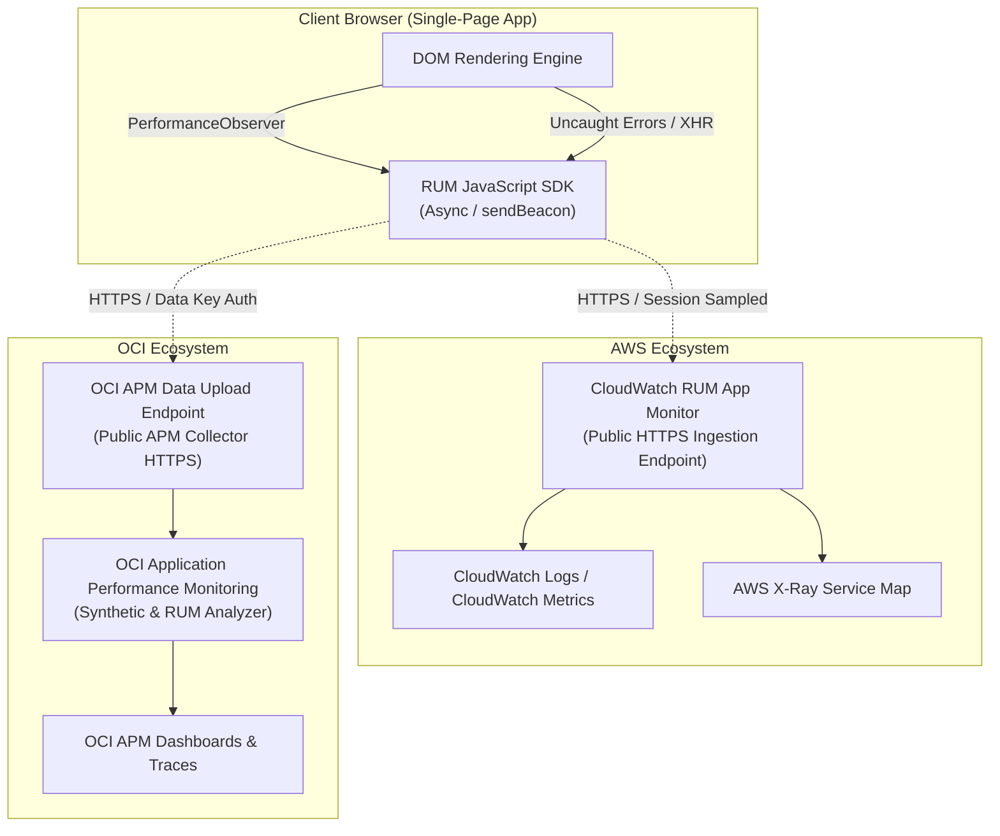
```mermaid
graph TD
    subgraph "Client Browser (Single-Page App)"
        DOM["DOM Rendering Engine"]
        RUM_SDK["RUM JavaScript SDK\n(Async / sendBeacon)"]
        DOM -->|PerformanceObserver| RUM_SDK
        DOM -->|Uncaught Errors / XHR| RUM_SDK
    end

    subgraph "AWS Ecosystem"
        CWRUM["CloudWatch RUM App Monitor\n(Public HTTPS Ingestion Endpoint)"]
        CW_LOGS["CloudWatch Logs / CloudWatch Metrics"]
        CW_XRAY["AWS X-Ray Service Map"]
        RUM_SDK -.->|HTTPS / Session Sampled| CWRUM
        CWRUM --> CW_LOGS
        CWRUM --> CW_XRAY
    end

    subgraph "OCI Ecosystem"
        OCI_APM_EP["OCI APM Data Upload Endpoint\n(Public APM Collector HTTPS)"]
        OCI_APM_ENGINE["OCI Application Performance Monitoring\n(Synthetic & RUM Analyzer)"]
        OCI_DASH["OCI APM Dashboards & Traces"]
        RUM_SDK -.->|HTTPS / Data Key Auth| OCI_APM_EP
        OCI_APM_EP --> OCI_APM_ENGINE
        OCI_APM_ENGINE --> OCI_DASH
    end
```

#### AWS Implementation
In AWS, CloudWatch RUM manages client telemetry through an **App Monitor**:
1. **App Monitor Creation**: Deploy CloudWatch RUM via CloudFormation/Terraform. It generates an App Monitor ID and uses Amazon Cognito Identity Pools (or guest unauthenticated credentials) to authorize telemetry ingestion.
2. **Telemetry Configuration**: Supports telemetries: `errors`, `performance`, and `http`. Telemetry sampling rate (`sessionSampleRate`) can be tuned from $0.0$ to $1.0$ (e.g., $0.1$ for $10\%$ of user sessions) to manage ingestion pricing [Doc: CloudWatch RUM, checked 2026].
3. **Data Storage & X-Ray Integration**: Enable `telemetries: ["errors", "performance", "http"]` and set `enableXRay: true`. This allows the RUM web client to record traces and link X-Ray spans for HTTP calls made to specific API domains.

```bash
# Create CloudWatch RUM App Monitor via AWS CLI
aws rum create-app-monitor \
  --name "frontend-prod-app" \
  --domain "portal.enterprise.com" \
  --app-monitor-configuration '{
    "IdentityPoolId": "us-east-1:11111111-2222-3333-4444-555555555555",
    "GuestRoleArn": "arn:aws:iam::123456789012:role/RUM-Unauth-Role",
    "SessionSampleRate": 0.25,
    "Telemetries": ["errors", "performance", "http"],
    "AllowCookies": true,
    "EnableXRay": true
  }' \
  --cw-log-enabled
```

```html
<!-- Client-Side Snippet (HTML Header) -->
<script>
  (function(n,i,v,r,s,c,x){x=window.AwsRumClient={q:[],n:n,i:i,v:v,r:r,c:c};
  window[n]=function(c,p){x.q.push({c:c,p:p});};s=i.createElement('script');
  s.async=1;s.src=r;c=i.getElementsByTagName('script')[0];c.parentNode.insertBefore(s,c);
  })('cwr','frontend-prod-app','1.0.0','https://assets.adorigin.aws/cw-rum-1.0.0.js');
  cwr('recordPageView', window.location.pathname);
</script>
```

#### OCI Implementation
OCI APM provides enterprise Real-User Monitoring natively within its **Application Performance Monitoring (APM)** service:
1. **APM Domain & Data Keys**: Telemetry requires an APM Domain. The domain issues a public **Data Upload Endpoint** URL and an unauthenticated **Data Key** (Data Key Type: `PUBLIC_DATA_KEY` designed specifically for browser JavaScript and mobile agents).
2. **OpenTelemetry / APM Browser Agent**: OCI APM provides a lightweight browser agent (`apm-browser-agent.js`). The agent captures Core Web Vitals, user interactions, page navigation, AJAX/Fetch calls, and uncaught JavaScript errors [Doc: OCI APM Real-User Monitoring, checked 2026].
3. **Session Filtering & Tracing**: Injects W3C trace context headers into calls matching specified service endpoint patterns, seamlessly joining browser actions to OCI APM distributed traces across backend OCI Container Engine for Kubernetes (OKE) pods or Compute instances.

```bash
# Provision an OCI APM Domain and Generate a Public Data Key for Browser RUM
oci apm-control-plane apm-domain create \
  --compartment-id ocid1.compartment.oc1..aaaaaaaam7... \
  --display-name "Production-Web-APM" \
  --is-free-tier false

# List APM Domain Data Keys to extract the public browser ingest key
oci apm-control-plane data-key list \
  --apm-domain-id ocid1.apmdomain.oc1.iad.aaaaaaaax4... \
  --data-key-type PUBLIC_DATA_KEY
```

```html
<!-- OCI APM Browser Agent Integration in HTML -->
<script type="text/javascript">
  window.Apmrum = {
    ociApmInfo: {
      endpointUrl: "https://aaaabbbb.apm-agt.us-ashburn-1.oci.oraclecloud.com/20200101/observations/public-span?domainId=ocid1.apmdomain.oc1.iad.aaaaaaaax4...",
      dataKey: "PUBLIC_DATAKEY_V4_PROD_1234567890",
      applicationName: "EnterprisePortalFrontend",
      serviceName: "WebClientSPA",
      webApplication: "EnterpriseBillingUI",
      sessionSamplingRate: 20, // Sample 20% of user sessions
      filterRule: {
        excludeUrlRegex: "(login|oauth|checkout/card)" // Strip sensitive URL paths
      }
    }
  };
</script>
<script type="text/javascript" async src="https://cloud.oracle.com/apm/rum/v1/apm-browser-agent.js"></script>
```

#### Common Trap
Configuring 100% session sampling on high-traffic consumer portals without URL path stripping. On e-commerce or SaaS sites with 100 million pageviews per month, unthrottled RUM ingestion can produce tens of thousands of dollars in CloudWatch RUM event ingestion fees or OCI APM trace storage costs. Additionally, failing to mask query strings or body parameters causes client auth tokens, passwords, or credit card query parameters (`?cvv=123`) to be permanently ingested into cloud monitoring logs, violating PCI-DSS and GDPR.

#### Follow-up Question
How do you correlate an end-user's reported client-side transaction failure with server-side microservice spans when cross-origin resource sharing (CORS) preflight requests strip custom tracing headers like W3C `traceparent` or AWS `X-Amzn-Trace-Id`?

---

### Q335: Centralized Enterprise Logging: Multi-Account & Multi-Compartment Pipelines

#### Question
How do multi-tenant cloud enterprises architect centralized, tamper-resistant logging across hundreds of AWS accounts and OCI compartments, ensuring high-throughput streaming into central SIEM/data lakes (OpenSearch, Splunk, S3/Object Storage) while preventing log loss and regulatory non-compliance?

#### Short Answer
Centralized enterprise logging utilizes hub-and-spoke topologies. In AWS, spoke accounts configure CloudWatch Logs Subscription Filters or EventBridge Pipes streaming to Amazon Kinesis Data Firehose in a designated central Security/Log Archive account, buffering to Amazon S3 (with Object Lock for WORM compliance) and OpenSearch/Splunk. In OCI, spoke compartments emit log events to OCI Service Connector Hub (SCH). SCH aggregates logs across compartments and regions, filtering and streaming payloads directly to OCI Streaming (Kafka-compatible), central OCI Object Storage with Retention Rules, or third-party SIEM endpoints. Both approaches decouple log producers from ingest backpressure using persistent intermediate streaming buffers.

#### Deep Answer
In enterprise environments subject to PCI-DSS 4.0, HIPAA, and SOC 2 Type II, logging cannot reside in isolated spoke accounts where compromised local administrators could alter or truncate audit trails.

**Architectural Requirements for Centralized Logging**:
1. **Decoupled Asynchronous Streaming**: Spoke workloads (VMs, containers, serverless functions) must never block on central log ingestion. Local log forwarders (Fluent Bit, Vector, AWS CloudWatch Agent, OCI Unified Monitoring Agent) stream locally to cloud log groups.
2. **Intermediate Buffering & Shock Absorption**: During massive security incidents or network spikes, log volume can increase by $10\times\text{--}50\times$. CloudWatch Logs subscription filters emit to Amazon Kinesis Data Streams / Firehose; OCI SCH emits to OCI Streaming (Kafka). These streaming brokers buffer gigabytes of log lines in memory/NVMe disk arrays, absorbing backpressure when downstream Elasticsearch or Splunk clusters experience index throttling.
3. **Cross-Account & Cross-Compartment Identity Delegation**: In AWS, spoke accounts require IAM roles assuming cross-account permissions or resource-based policies on Kinesis Data Streams (`kinesis:PutRecord`, `kinesis:PutRecords`). In OCI, cross-tenancy or cross-compartment IAM policies allow Service Connector Hub in the security compartment to read log groups in spoke compartments (`allow service connector-hub to read log-content in tenancy`).
4. **WORM Immutability (Write-Once-Read-Many)**: Logs must be archived into cold object storage with compliance-grade object locks (Amazon S3 Object Lock in Compliance mode; OCI Object Storage Retention Rules in Locked state), preventing even cloud root accounts from deleting log records until the retention period expires (typically 365 days to 7 years).
5. **Schema Normalization**: Raw log lines are parsed, enriched with metadata (`account_id`, `region`, `vpc_id`, `environment`, `pod_name`), and transformed into Open Cybersecurity Schema Framework (OCSF) or Elastic Common Schema (ECS) format via AWS Lambda / Kinesis Firehose dynamic partitioning or OCI Functions invoked inside Service Connector Hub.

#### Architecture
```mermaid
graph TD
    subgraph "Spoke Accounts / Compartments (App Teams)"
        APP_A["Workload Account A\n(EKS / EC2 / Lambda)"]
        APP_B["Workload Compartment B\n(OKE / Compute / Functions)"]
        CW_LOGS_A["CloudWatch Log Groups\n(Local Spoke)"]
        OCI_LOG_B["OCI Logging Service\n(Local Spoke Compartment)"]
        APP_A --> CW_LOGS_A
        APP_B --> OCI_LOG_B
    end

    subgraph "Central Security & Observability Hub (AWS)"
        KINESIS["Amazon Kinesis Data Stream / Firehose\n(Cross-Account Ingestion Buffer)"]
        CW_LOGS_A -->|Subscription Filter\n(IAM Role Assume)| KINESIS
        S3_LAKE["Amazon S3 Log Archive\n(Object Lock Compliance Mode WORM)"]
        OS_AWS["Amazon OpenSearch / Splunk Cloud\n(Hot Analytics 30-90 Days)"]
        KINESIS --> S3_LAKE
        KINESIS --> OS_AWS
    end

    subgraph "Central Security & Observability Hub (OCI)"
        SCH["OCI Service Connector Hub (SCH)\n(Aggregates across Tenancy)"]
        OCI_STREAM["OCI Streaming (Kafka-Compatible)\n(Partitioned Ingestion Buffer)"]
        OCI_LOG_B -->|SCH Source: Logging| SCH
        SCH --> OCI_STREAM
        OBJ_STORE["OCI Object Storage Archive\n(Locked Retention Rules)"]
        OCI_LA["OCI Logging Analytics / SIEM\n(Log Clustering & ML Anomalies)"]
        SCH --> OBJ_STORE
        SCH --> OCI_LA
    end
```

#### AWS Implementation
Configure cross-account log forwarding using CloudWatch Logs Subscription Filters to a centralized Kinesis Data Stream [Doc: CloudWatch Logs Subscription Filters, checked 2026]:

```bash
# Step 1: In the Central Security Account (111122223333), create a Destination
aws logs put-destination \
  --destination-name "CentralLogSink" \
  --target-arn "arn:aws:kinesis:us-east-1:111122223333:stream/central-enterprise-log-stream" \
  --role-arn "arn:aws:iam::111122223333:role/CWLtoKinesisCrossAccountRole"

# Step 2: Grant Spoke Accounts (444455556666) permission to write to this Destination
aws logs put-destination-policy \
  --destination-name "CentralLogSink" \
  --access-policy '{
    "Version": "2012-10-17",
    "Statement": [
      {
        "Effect": "Allow",
        "Principal": { "AWS": ["444455556666"] },
        "Action": "logs:PutSubscriptionFilter",
        "Resource": "arn:aws:logs:us-east-1:111122223333:destination:CentralLogSink"
      }
    ]
  }'

# Step 3: In the Spoke Account (444455556666), attach Subscription Filter to local log group
aws logs put-subscription-filter \
  --log-group-name "/aws/eks/prod-cluster/application" \
  --filter-name "ForwardToSecurityHub" \
  --filter-pattern "" \
  --destination-arn "arn:aws:logs:us-east-1:111122223333:destination:CentralLogSink"
```

#### OCI Implementation
OCI accomplishes multi-compartment aggregation natively through **Service Connector Hub (SCH)**:
1. **Central Policy**: Authorize Service Connector Hub in the Security Compartment to read logs across the entire tenancy [Doc: OCI Service Connector Hub Policies, checked 2026].
2. **Connector Definition**: Create an SCH instance reading from all compartments and streaming to OCI Streaming (for downstream Splunk/Kafka consumers) and OCI Object Storage with retention locks.

```bash
# IAM Policy in Root Compartment granting SCH cross-compartment log extraction
oci iam policy create \
  --compartment-id ocid1.tenancy.oc1..aaaaaaaaxample \
  --name "AllowCentralSCHLogging" \
  --description "Authorizes SCH to aggregate logs across all tenancy compartments" \
  --statements '[
    "Allow service connector-hub to read log-content in tenancy",
    "Allow service connector-hub to use streams in compartment Security-Hub",
    "Allow service connector-hub to manage object-family in compartment Security-Hub"
  ]'

# Create Service Connector streaming logs across all compartments to a central Stream
cat << 'EOF' > sch-config.json
{
  "source": {
    "kind": "logging",
    "logSources": [
      {
        "compartmentId": "ocid1.tenancy.oc1..aaaaaaaaxample",
        "logGroupId": "all"
      }
    ]
  },
  "target": {
    "kind": "streaming",
    "streamId": "ocid1.stream.oc1.iad.amaaaaaaxample..."
  },
  "description": "Central enterprise log aggregator from all spoke compartments"
}
EOF

oci sch service-connector create \
  --compartment-id ocid1.compartment.oc1..security_hub_ocid \
  --display-name "Tenancy-Wide-Log-Aggregator" \
  --source file://sch-config.json \
  --target file://sch-config.json
```

#### Common Trap
Enabling synchronous cross-account log shipping without an intermediate buffering broker. If your spoke CloudWatch subscription filters stream directly to an Elasticsearch/OpenSearch ingest cluster or external HTTP endpoint via Lambda, any transient Elasticsearch index lock or HTTP 429 rate limit triggers immediate subscription filter delivery drops or runaway Lambda retry loops, resulting in unrecoverable log gaps during the height of a denial-of-service or database outage.

#### Follow-up Question
When streaming multi-gigabyte log pipelines across cloud accounts, how do you prevent cross-AZ data transfer fees and NAT Gateway bandwidth charges from dwarfing the cost of your actual compute infrastructure?

---

### Q336: Service Mesh Observability: Envoy Sidecar Telemetry & Distributed Tracing

#### Question
How is deep observability (access logging, golden-signal metrics, and distributed context propagation) implemented across Kubernetes clusters using Envoy-based Service Meshes (Istio, Linkerd, AWS App Mesh / OCI Service Mesh), and what are the performance trade-offs of sidecar telemetry vs sidecarless eBPF models?

#### Short Answer
Envoy-based service meshes intercept all ingress and egress container network traffic via `iptables` redirect to a local sidecar proxy. Envoy automatically calculates the four "Golden Signals" (latency, traffic, errors, saturation) at Layer 7, logs detailed HTTP/gRPC access logs with upstream/downstream connection states, and propagates or initiates W3C distributed trace headers. Envoy emits metrics to Prometheus via Prometheus pull endpoints or StatsD, while traces are flushed to OpenTelemetry Collectors, AWS X-Ray, or OCI APM. Sidecars introduce CPU/memory overhead ($1\text{--}3\text{ms}$ latency penalty and $\sim 50\text{--}100\text{MB}$ RAM per pod). In contrast, sidecarless eBPF architectures (e.g., Cilium) capture kernel-level network telemetry with near-zero latency overhead, but lack application-level payload inspection and fine-grained L7 request modification.

#### Deep Answer
Service meshes decouple networking and observability logic from application code. Every microservice pod runs an Envoy proxy sidecar listening on `127.0.0.1:15001`. The pod's network namespace routes all TCP packets through Envoy via `iptables PREROUTING` and `OUTPUT` chains.

**Key Telemetry Pillars in Service Mesh**:
1. **L7 Metrics Generation**: Envoy parses HTTP/1.1, HTTP/2, and gRPC frames, exposing Prometheus metrics:
   - `istio_requests_total{response_code="500", reporter="destination"}`
   - `istio_request_duration_milliseconds_bucket{le="250"}`
   - Upstream connection pool saturation and circuit breaker tripping (`upstream_rq_pending_active`).
2. **Access Logging**: Envoy captures microsecond-level connection telemetry: `%START_TIME%`, `%BYTES_RECEIVED%`, `%BYTES_SENT%`, `%DURATION%`, `%RESP_FLAGS%` (e.g., `UH` for no healthy upstream, `DC` for downstream connection termination), and `%UPSTREAM_CLUSTER%`.
3. **Trace Header Propagation**: Envoy handles span creation, but **the application code must forward tracing headers** from incoming requests to outgoing requests. If a Go or Java app receives `traceparent: 00-4bf92f3577b34da6a3ce929d0e0e4736-00f067aa0ba902b7-01` and makes a downstream HTTP call without forwarding that header, the distributed trace graph is severed into two disjoint traces.
4. **Sidecar vs Sidecarless (eBPF)**:
   - *Sidecar (Istio/Envoy)*: High fidelity, mutual TLS (mTLS) termination per pod, L7 traffic mutation, high memory footprint ($N$ sidecars for $N$ pods), adds two TCP hops per pod-to-pod interaction.
   - *Sidecarless eBPF (Cilium Mesh)*: Programs run in the Linux kernel via `kprobes`/`tracepoints` and socket layer programs (`sock_ops`). Bypasses TCP/IP stack overhead, captures L3/L4/L7 flow metrics with minimal CPU overhead, but requires kernel 5.4+ and cannot perform complex L7 body rewrites or cryptographic isolation within the pod boundary.

#### Architecture
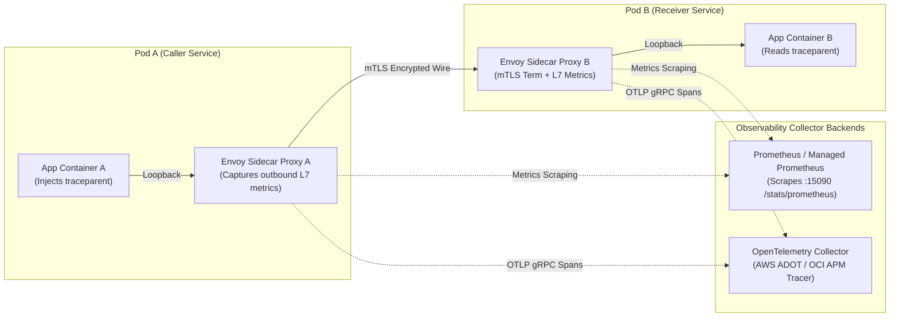
```mermaid
graph LR
    subgraph "Pod A (Caller Service)"
        APP_A["App Container A\n(Injects traceparent)"]
        ENVOY_A["Envoy Sidecar Proxy A\n(Captures outbound L7 metrics)"]
        APP_A -->|Loopback| ENVOY_A
    end

    subgraph "Pod B (Receiver Service)"
        ENVOY_B["Envoy Sidecar Proxy B\n(mTLS Term + L7 Metrics)"]
        APP_B["App Container B\n(Reads traceparent)"]
        ENVOY_B -->|Loopback| APP_B
    end

    ENVOY_A -->|mTLS Encrypted Wire| ENVOY_B

    subgraph "Observability Collector Backends"
        PROM["Prometheus / Managed Prometheus\n(Scrapes :15090 /stats/prometheus)"]
        OTEL_COL["OpenTelemetry Collector\n(AWS ADOT / OCI APM Tracer)"]
        ENVOY_A -.->|Metrics Scraping| PROM
        ENVOY_B -.->|Metrics Scraping| PROM
        ENVOY_A -.->|OTLP gRPC Spans| OTEL_COL
        ENVOY_B -.->|OTLP gRPC Spans| OTEL_COL
    end
```

#### AWS Implementation
On AWS EKS, implement service mesh observability via Istio or AWS App Mesh using AWS Distro for OpenTelemetry (ADOT) [Doc: AWS ADOT with Service Mesh, checked 2026]:
1. **Telemetry Custom Resource (Istio)**: Configure Istio to send access logs and OTLP traces directly to the ADOT Collector running in the cluster.
2. **Prometheus Scraping**: Scrape Envoy metrics on port 15090 using Amazon Managed Service for Prometheus (AMP).

```yaml
# istio-telemetry-adot.yaml
apiVersion: telemetry.istio.io/v1alpha1
kind: Telemetry
metadata:
  name: mesh-default-telemetry
  namespace: istio-system
spec:
  tracing:
    - providers:
        - name: "otel-collector"
      randomSamplingPercentage: 10.0
      customTags:
        "aws.eks.cluster":
          literal:
            value: "prod-eks-us-east-1"
  accessLogging:
    - providers:
        - name: "envoy-json-stdout"
---
# Envoy OpenTelemetry Provider in Istio ConfigMap
apiVersion: v1
kind: ConfigMap
metadata:
  name: istio
  namespace: istio-system
data:
  mesh: |-
    extensionProviders:
    - name: otel-collector
      opentelemetry:
        port: 4317
        service: adot-collector.aws-otel-eks.svc.cluster.local
    defaultConfig:
      tracing:
        sampling: 10.0
```

#### OCI Implementation
OCI offers **OCI Service Mesh** natively integrated with Oracle Container Engine for Kubernetes (OKE):
1. **Service Mesh Resource**: Define Mesh, Virtual Service, and Access Policies. OCI Service Mesh injects an Envoy proxy managed by the OCI control plane.
2. **Logging & Tracing Integration**: OCI Service Mesh natively directs Envoy access logs into OCI Logging and exports OpenTelemetry traces to OCI Application Performance Monitoring (APM) [Doc: OCI Service Mesh Observability, checked 2026].

```bash
# Enable OCI Service Mesh Access Logging to OCI Logging Service
oci service-mesh virtual-service create \
  --mesh-id ocid1.mesh.oc1.iad.aaaaaaaav5... \
  --name "order-processing-service" \
  --compartment-id ocid1.compartment.oc1..aaaaaaaam7... \
  --default-routing-policy '{"type": "UNIFORM"}' \
  --hosts '["order.prod.internal"]'

# Configure OCI Logging for the Service Mesh proxy
oci logging log create \
  --log-group-id ocid1.loggroup.oc1.iad.aaaaaaaax... \
  --display-name "mesh-envoy-access-logs" \
  --log-type SERVICE \
  --configuration '{
    "compartmentId": "ocid1.compartment.oc1..aaaaaaaam7...",
    "source": {
      "sourceType": "OCISERVICEMESH",
      "service": "servicemesh",
      "resource": "ocid1.mesh.oc1.iad.aaaaaaaav5..."
    }
  }'
```

```yaml
# Kubernetes deployment annotation for automatic OCI Service Mesh proxy injection
apiVersion: apps/v1
kind: Deployment
metadata:
  name: order-service
  namespace: production
  labels:
    app: order-service
spec:
  template:
    metadata:
      labels:
        app: order-service
      annotations:
        # Injects OCI Service Mesh Envoy Proxy and links to APM Domain
        servicemesh.oci.oracle.com/sidecar-injection: "enabled"
        servicemesh.oci.oracle.com/apm-domain-id: "ocid1.apmdomain.oc1.iad.aaaaaaaax4..."
```

#### Common Trap
Believing that deploying a service mesh eliminates the need for application developers to write tracing code. While Envoy creates server/client spans for network boundaries, it cannot correlate an incoming request to an outgoing database query or downstream REST call unless the application forwards the HTTP trace context headers (`traceparent`, `tracestate`, or `X-B3-TraceId`). Without header forwarding in app code, every service hop appears as an orphaned single-span trace.

#### Follow-up Question
How does Envoy's access log string formatting impact memory allocation and garbage collection under 100,000 requests per second, and why should enterprises transition to structured Protobuf-based access log streaming (ALS) over stdout logging?

---

### Q337: Database Observability & Query Profiling: RDS Performance Insights vs OCI Database Management

#### Question
How do cloud architects monitor and diagnose complex database performance bottlenecks (such as connection pool exhaustion, index bloat, lock contention, and high-load SQL execution plans), and how do Amazon RDS Performance Insights and OCI Database Management / Ops Insights compare in telemetry collection and profiling?

#### Short Answer
Database observability requires non-invasive, continuous sampling of active database sessions rather than polling slow-query logs. Amazon RDS Performance Insights samples active sessions once per second, visualizing Average Active Sessions (AAS) sliced by CPU, wait events, users, and SQL text relative to maximum vCPU capacity. OCI Database Management and OCI Operations Insights leverage native Oracle Database instrumentation (Active Session History `ASH`, Automatic Workload Repository `AWR`, and SQL Tuning Sets) as well as MySQL/PostgreSQL metrics. Both systems pinpoint whether database latency stems from CPU starvation, I/O bottlenecks, lock waits, or suboptimal query execution plans without imposing noticeable performance overhead on transactional engines.

#### Deep Answer
Traditional database monitoring relied on simple OS-level metrics (CPU utilization, free disk, memory) and batch-parsed slow-query logs. These metrics are lagging indicators: an RDS or Compute instance can sit at 100% CPU due to a single unindexed query or show low CPU while transactions stall indefinitely due to row-level locks (`enq: TX - row lock contention` or `exclusive lock on tuple`).

**Modern Active Session Telemetry**:
1. **Average Active Sessions (AAS)**: Defined as total DB elapsed time divided by wall-clock time over a sampling window:
   $$\text{AAS} = \frac{\sum \text{Active Session Wait Time} + \text{CPU Time}}{\text{Wall-Clock Time}}$$
   - If $\text{AAS} < \text{Max vCPU}$, the database has spare execution capacity.
   - If $\text{AAS} > \text{Max vCPU}$, queries are queuing, causing exponential latency spikes.
2. **Wait Event Categorization**: Sessions waiting for work are classified into standardized dimensions:
   - **CPU**: Active computation in database engine code.
   - **I/O (Read/Write)**: Disk access (`io/table/scan`, `db file sequential read`). High I/O waits indicate undersized buffer cache, missing indexes, or cold cache churn.
   - **Concurrency / Lock**: Session blocked waiting for a lock held by another transaction (`Lock:transaction`, `enq: TM - contention`). Adding CPU or RAM will not resolve concurrency locks.
3. **Execution Plan Profiling**: Correlating high-load SQL hashes with execution plan regressions (e.g., index range scan flipping to full table scan due to stale optimizer statistics).
4. **Platform Comparison**:
   - **Amazon RDS Performance Insights**: Integrated into RDS (PostgreSQL, MySQL, MariaDB, Oracle, SQL Server) and Aurora. Lightweight in-memory sampling ($\le 1\%$ CPU impact). Retains 7 days of rolling data for free, expandable to 731 days for long-term historical trend analysis [Doc: Amazon RDS Performance Insights, checked 2026].
   - **OCI Database Management & Ops Insights**: Native integration with Oracle Autonomous Database, Exadata Cloud, OCI Base Database, and external multi-cloud databases. Directly exposes deep enterprise diagnostic engines: ASH analytics, AWR reports, SQL Tuning Advisor, and 25-month capacity forecasting using machine learning in Ops Insights [Doc: OCI Database Management & Ops Insights, checked 2026].

#### Architecture
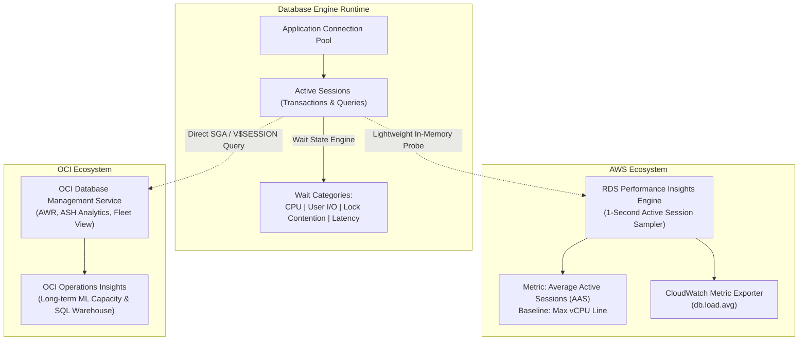
```mermaid
graph TD
    subgraph "Database Engine Runtime"
        CONN_POOL["Application Connection Pool"]
        SESSIONS["Active Sessions (Transactions & Queries)"]
        SESSIONS -->|Wait State Engine| WAIT["Wait Categories:\nCPU | User I/O | Lock Contention | Latency"]
        CONN_POOL --> SESSIONS
    end

    subgraph "AWS Ecosystem"
        RDS_PI["RDS Performance Insights Engine\n(1-Second Active Session Sampler)"]
        AAS_METRIC["Metric: Average Active Sessions (AAS)\nBaseline: Max vCPU Line"]
        CW_PI["CloudWatch Metric Exporter\n(db.load.avg)"]
        SESSIONS -.->|Lightweight In-Memory Probe| RDS_PI
        RDS_PI --> AAS_METRIC
        RDS_PI --> CW_PI
    end

    subgraph "OCI Ecosystem"
        OCI_DBM["OCI Database Management Service\n(AWR, ASH Analytics, Fleet View)"]
        OPS_INSIGHTS["OCI Operations Insights\n(Long-term ML Capacity & SQL Warehouse)"]
        SESSIONS -.->|Direct SGA / V$SESSION Query| OCI_DBM
        OCI_DBM --> OPS_INSIGHTS
    end
```

#### AWS Implementation
Enable and query RDS Performance Insights for an Aurora PostgreSQL or RDS MySQL instance:

```bash
# Enable Performance Insights with 731-day retention and KMS customer-managed key
aws rds modify-db-instance \
  --db-instance-identifier "prod-aurora-pg-01" \
  --enable-performance-insights \
  --performance-insights-kms-key-id "arn:aws:kms:us-east-1:123456789012:key/mrk-abc12345" \
  --performance-insights-retention-period 731 \
  --apply-immediately

# Query Top SQL queries contributing to database load via AWS CLI
aws pi get-resource-metrics \
  --service-type "RDS" \
  --identifier "db-ABCDEFGHIJKLMNOPQRSTUVWXYZ" \
  --metric "db.load.avg" \
  --start-time "2026-03-01T10:00:00Z" \
  --end-time "2026-03-01T11:00:00Z" \
  --period-in-seconds 60 \
  --group-by '{
    "Group": "db.sql",
    "Limit": 5
  }'
```

#### OCI Implementation
Enable OCI Database Management on an OCI Database (Exadata, Bare Metal, or Autonomous DB):

```bash
# Enable Database Management on a Managed Database
oci database-management managed-database enable-database-management-feature \
  --managed-database-id ocid1.manageddatabase.oc1.iad.aaaaaaaaxample... \
  --feature-details '{
    "feature": "DIAGNOSTICS_AND_MANAGEMENT",
    "managementOption": "ADVANCED",
    "databaseCredential": {
      "credentialType": "SECRET",
      "secretId": "ocid1.vaultsecret.oc1.iad.aaaaaaaasecret..."
    }
  }'

# Run ASH Analytics via OCI CLI to retrieve wait events and top SQL IDs
oci database-management managed-database-fleet summary \
  --compartment-id ocid1.compartment.oc1..aaaaaaaam7...

# Generate an Automatic Workload Repository (AWR) report for incident post-mortem
oci database-management managed-database get-awr-db-report \
  --managed-database-id ocid1.manageddatabase.oc1.iad.aaaaaaaaxample... \
  --begin-snapshot-id 1405 \
  --end-snapshot-id 1406 \
  --report-type HTML > awr_incident_report.html
```

#### Common Trap
Focusing exclusively on CPU utilization alerts to detect database health. A database with a max capacity of 8 vCPUs can show $15\%$ overall CPU utilization while completely freezing every client thread if 50 sessions are waiting on a single uncommitted transaction holding an exclusive lock on an index root page. In this scenario, CPU alerts never fire, but Average Active Sessions (AAS) spikes to 50 ($6.25\times$ above the 8 vCPU limit), and query latency jumps from $2\text{ms}$ to $30,000\text{ms}$.

#### Follow-up Question
How do you configure automatic SQL plan baselines to prevent query optimizer regressions when upgrading database engine major versions (e.g., PostgreSQL 15 to 16, or Oracle 19c to 23ai)?

---

### Q338: Container & Pod Metrics Collection: CloudWatch Container Insights vs OCI OKE Monitoring

#### Question
How do cloud architects collect, aggregate, and alert on high-frequency container, pod, node, and control-plane metrics across enterprise Kubernetes clusters, and how do CloudWatch Container Insights (with ADOT) and OCI Container Engine for Kubernetes (OKE) Native Monitoring compare?

#### Short Answer
Enterprise Kubernetes metrics collection operates at three layers: infrastructure node health (kubelet, cAdvisor, Node Exporter), Kubernetes cluster state (kube-state-metrics), and application pod runtime (Prometheus endpoints). AWS CloudWatch Container Insights collects these via the AWS Distro for OpenTelemetry (ADOT) or CloudWatch Agent DaemonSet, automatically generating embedded metric format (EMF) logs that roll up into CloudWatch Metrics. OCI OKE provides native cluster monitoring out-of-the-box via the OCI Monitoring service, which automatically ingests node pool and control plane health into OCI metrics, while pod-level and custom application telemetry are forwarded to OCI Monitoring or Managed Prometheus via the OCI Unified Monitoring Agent or Prometheus Operator.

#### Deep Answer
Monitoring Kubernetes requires tracking both physical/virtual compute consumption and ephemeral pod scheduling dynamics. Because pods are continuously rescheduled, telemetry systems must aggregate metrics across fluctuating pod IDs into stable dimensional constructs: `Namespace`, `Deployment`, `DaemonSet`, `StatefulSet`, and `Service`.

**Container Metric Collection Architecture**:
1. **cAdvisor & Kubelet**: Every Kubernetes worker node runs the kubelet, which embeds cAdvisor. cAdvisor reads kernel `cgroups` (control groups v1/v2) directly to measure container CPU usage (`cpu.stat`, `cpu.cfs_quota_us`, `cpu.throttled_time`), memory working set (`memory.usage_in_bytes`), network socket throughput, and disk I/O.
2. **Kube-State-Metrics (KSM)**: KSM listens to the Kubernetes API server directly, emitting metrics regarding object availability rather than resource utilization: `kube_pod_status_phase`, `kube_deployment_status_replicas_unavailable`, `kube_pod_container_status_waiting_reason{reason="CrashLoopBackOff"}`.
3. **AWS Architecture (Container Insights with ADOT)**:
   - Deployed as an EKS Managed Add-on (`amazon-cloudwatch-observability`).
   - Runs a DaemonSet of the ADOT Collector and CloudWatch Agent.
   - Converts raw container statistics into structured JSON logs using Embedded Metric Format (EMF) published to `/aws/containerinsights/<cluster-name>/performance`. CloudWatch asynchronously transforms EMF dimensions into CloudWatch Metrics (`pod_cpu_utilization`, `node_memory_utilization_over_allocatable`) [Doc: AWS Container Insights with ADOT, checked 2026].
4. **OCI Architecture (OKE Monitoring & OCI Unified Agent)**:
   - Native OKE integration emits node pool metrics (`CpuUtilization`, `MemoryUtilization`, `DiskUtilization`) directly to the `oci_computeagent` namespace without requiring in-cluster agent deployment.
   - Kubernetes cluster object telemetry is collected via the **OCI Unified Monitoring Agent** (based on Fluentd/OTel) or an in-cluster Prometheus stack scraping kube-state-metrics and pushing to OCI Monitoring via the OCI Monitoring Metric Ingestion API (`PostMetricData`) [Doc: OCI OKE Monitoring, checked 2026].

#### Architecture
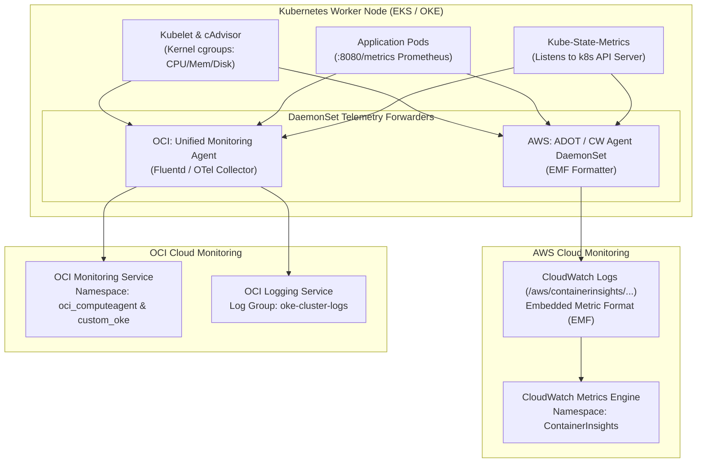
```mermaid
graph TD
    subgraph "Kubernetes Worker Node (EKS / OKE)"
        KUBELET["Kubelet & cAdvisor\n(Kernel cgroups: CPU/Mem/Disk)"]
        POD_APP["Application Pods\n(:8080/metrics Prometheus)"]
        KSM["Kube-State-Metrics\n(Listens to k8s API Server)"]
        
        subgraph "DaemonSet Telemetry Forwarders"
            ADOT_DS["AWS: ADOT / CW Agent DaemonSet\n(EMF Formatter)"]
            OCI_DS["OCI: Unified Monitoring Agent\n(Fluentd / OTel Collector)"]
        end
        
        KUBELET --> ADOT_DS
        POD_APP --> ADOT_DS
        KSM --> ADOT_DS
        
        KUBELET --> OCI_DS
        POD_APP --> OCI_DS
        KSM --> OCI_DS
    end

    subgraph "AWS Cloud Monitoring"
        CW_EMF["CloudWatch Logs (/aws/containerinsights/...)\nEmbedded Metric Format (EMF)"]
        CW_METRICS["CloudWatch Metrics Engine\nNamespace: ContainerInsights"]
        ADOT_DS --> CW_EMF
        CW_EMF --> CW_METRICS
    end

    subgraph "OCI Cloud Monitoring"
        OCI_MON["OCI Monitoring Service\nNamespace: oci_computeagent & custom_oke"]
        OCI_LOG["OCI Logging Service\nLog Group: oke-cluster-logs"]
        OCI_DS --> OCI_MON
        OCI_DS --> OCI_LOG
    end
```

#### AWS Implementation
Deploy Container Insights with enhanced observability on an Amazon EKS cluster using the EKS Managed Add-on [Doc: EKS Add-ons Container Insights, checked 2026]:

```bash
# Step 1: Associate IAM OIDC Provider with EKS Cluster
eksctl utils associate-iam-oidc-provider \
  --cluster prod-eks-us-east-1 \
  --approve

# Step 2: Create IAM Role for CloudWatch Observability Add-on
aws iam create-role \
  --role-name EKS-CloudWatchObservability-Role \
  --assume-role-policy-document '{
    "Version": "2012-10-17",
    "Statement": [{
      "Effect": "Allow",
      "Principal": { "Service": "pods.eks.amazonaws.com" },
      "Action": ["sts:AssumeRole", "sts:TagSession"]
    }]
  }'

aws iam attach-role-policy \
  --role-name EKS-CloudWatchObservability-Role \
  --policy-arn arn:aws:iam::aws:policy/CloudWatchAgentServerPolicy

# Step 3: Install the amazon-cloudwatch-observability EKS add-on
aws eks create-addon \
  --cluster-name prod-eks-us-east-1 \
  --addon-name amazon-cloudwatch-observability \
  --addon-version v1.8.0-eksbuild.1 \
  --configuration-values '{"agent":{"config":{"logs":{"metrics_collected":{"kubernetes":{"enhanced_container_insights":true}}}}}}'
```

#### OCI Implementation
Configure container monitoring and Prometheus metric scraping into OCI Monitoring on Oracle Container Engine for Kubernetes (OKE) [Doc: OCI OKE Metric Ingestion, checked 2026]:

```bash
# Enable native OKE Cluster Metrics in OCI Console / CLI
oci ce cluster update \
  --cluster-id ocid1.cluster.oc1.iad.aaaaaaaaxample... \
  --open-id-connect-discovery-provider-config '{"isOpenIdConnectDiscoveryProviderEnabled": true}'

# Deploy Prometheus Operator and OCI Monitoring Metric Adapter
cat << 'EOF' > oci-metric-exporter.yaml
apiVersion: apps/v1
kind: Deployment
metadata:
  name: oci-metrics-adapter
  namespace: kube-system
spec:
  replicas: 1
  selector:
    matchLabels:
      app: oci-metrics-adapter
  template:
    metadata:
      labels:
        app: oci-metrics-adapter
    spec:
      containers:
      - name: adapter
        image: phx.ocir.io/oracle/oci-monitoring-adapter:1.2
        env:
        - name: OCI_COMPARTMENT_ID
          value: "ocid1.compartment.oc1..aaaaaaaam7..."
        - name: METRIC_NAMESPACE
          value: "oke_workload_metrics"
        - name: SCRAPE_TARGETS
          value: "http://kube-state-metrics.kube-system.svc:8080/metrics"
EOF

kubectl apply -f oci-metric-exporter.yaml
```

#### Common Trap
Alerting on container CPU usage without monitoring **CPU throttling** (`container_cpu_cfs_throttled_seconds_total` or `pod_cpu_utilization_over_limit`). Under Kubernetes CFS (Completely Fair Scheduler) quotas, a container with a strict limit (e.g., `cpu: 500m`) can experience severe request queuing and latency degradation even if node CPU utilization is below $20\%$. Setting CPU limits too tightly causes silent kernel throttling rather than OOM kills, creating invisible performance regressions.

#### Follow-up Question
Why do modern production Kubernetes best practices recommend removing CPU limits entirely while retaining strict CPU requests and memory limits, and how does this impact cluster bin-packing and latency predictability?

---

### Q339: Log Retention, Archiving & Tiering: CloudWatch IA vs OCI Object Storage Archiving

#### Question
How do cloud architects engineer tiered log storage pipelines to optimize petabyte-scale observability spend while meeting multi-year compliance audit requirements, and how do Amazon CloudWatch Log Classes (Standard vs Infrequent Access) compare with OCI Logging partition archiving to OCI Object Storage Archive Tier?

#### Short Answer
Tiered log architectures balance query speed against storage cost by segregating hot operational logs from cold compliance archives. In AWS, Amazon CloudWatch offers two log classes: **Standard** (full capability: real-time metrics, subscription filters, alarms; \$0.50/GB ingest) and **Infrequent Access (IA)** (targeted for high-volume, rarely queried logs at \$0.25/GB ingest, 50% cheaper), with automated lifecycle exports to Amazon S3 Standard, S3 Glacier Instant Retrieval, or Glacier Deep Archive (\$0.00099/GB/mo). OCI Logging ingests logs at \$0.05/GB (the first 10GB/mo is free) and leverages Service Connector Hub to continuously partition and stream logs into OCI Object Storage Standard, automatically transitioning to OCI Object Storage **Archive Tier** (\$0.0026/GB/mo) via bucket lifecycle policies.

#### Deep Answer
Enterprises generating 10TB+ of logs per day face astronomical storage bills if logs remain in hot query engines indefinitely. A comprehensive log lifecycle separates telemetry into three distinct operational tiers:

**1. Hot Operational Tier (0–30 Days)**:
- **Use Case**: Active troubleshooting, real-time alerting, dynamic dashboards, security incident response.
- **AWS**: CloudWatch Logs Standard class or Amazon OpenSearch Service hot NVMe nodes. Real-time live tail, subscription filters to Lambda/Firehose, Metric Filters.
- **OCI**: OCI Logging and OCI Logging Analytics. Provides instant search, faceted log clustering, machine learning anomaly detection, and interactive dashboarding.

**2. Warm Analytical Tier (30–90 Days)**:
- **Use Case**: Post-incident root-cause analysis, monthly compliance audits, periodic security hunting.
- **AWS**: CloudWatch Logs Infrequent Access (IA) class (ingest-only, queried via CloudWatch Logs Insights) or Amazon OpenSearch UltraWarm (backed by S3).
- **OCI**: OCI Object Storage Standard Tier queried directly using OCI Data Flow (Managed Apache Spark) or external Presto/Trino engines.

**3. Cold Compliance / Deep Archive Tier (90 Days to 7 Years)**:
- **Use Case**: Statutory compliance (HIPAA, PCI-DSS, SEC Rule 17a-4). Logs are rarely read, but must be mathematically immutable and retained for years.
- **AWS**: Amazon S3 Glacier Flexible Archive or Glacier Deep Archive. S3 Object Lock enforces WORM compliance. Data retrieval takes minutes to hours.
- **OCI**: OCI Object Storage Archive Tier. Storage costs are fraction of a cent per GB. Objects must be restored before download (time-to-first-byte: $\sim 1\text{ hour}$). Retention rules prevent bucket deletion or object overwrites.

| Dimension | AWS CloudWatch Logs Standard | AWS CloudWatch Logs Infrequent Access (IA) | OCI Logging Service | OCI Object Storage Archive Tier |
| :--- | :--- | :--- | :--- | :--- |
| **Ingestion Cost** | \$0.50 per GB | \$0.25 per GB | \$0.05 per GB (first 10 GB free) | Free ingestion (standard PUT fees apply) |
| **Live Tail / Alarms**| Yes | No | Yes | No |
| **Subscription Filters**| Yes | No | Yes (via SCH) | No |
| **Monthly Storage** | \$0.03 per GB/mo | \$0.03 per GB/mo | \$0.05 per GB/mo (first 10 GB free) | \$0.0026 per GB/mo |
| **Long-term Cold Tier**| S3 Glacier Deep (\$0.00099/GB) | S3 Glacier Deep (\$0.00099/GB) | OCI Object Storage Archive | Native Archive Tier |

#### Architecture
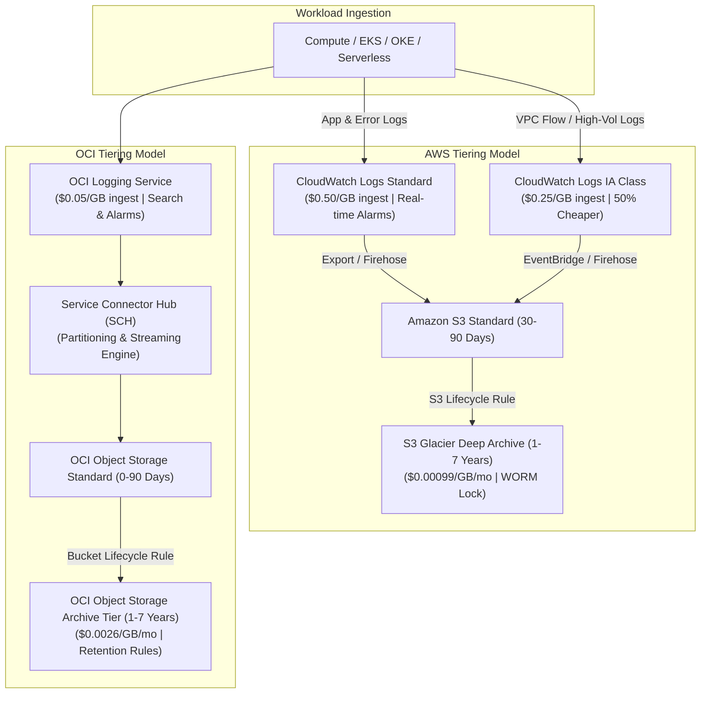
```mermaid
graph TD
    subgraph "Workload Ingestion"
        APPS["Compute / EKS / OKE / Serverless"]
    end

    subgraph "AWS Tiering Model"
        CW_STD["CloudWatch Logs Standard\n($0.50/GB ingest | Real-time Alarms)"]
        CW_IA["CloudWatch Logs IA Class\n($0.25/GB ingest | 50% Cheaper)"]
        S3_HOT["Amazon S3 Standard (30-90 Days)"]
        S3_COLD["S3 Glacier Deep Archive (1-7 Years)\n($0.00099/GB/mo | WORM Lock)"]
        
        APPS -->|App & Error Logs| CW_STD
        APPS -->|VPC Flow / High-Vol Logs| CW_IA
        CW_STD -->|Export / Firehose| S3_HOT
        CW_IA -->|EventBridge / Firehose| S3_HOT
        S3_HOT -->|S3 Lifecycle Rule| S3_COLD
    end

    subgraph "OCI Tiering Model"
        OCI_LOG["OCI Logging Service\n($0.05/GB ingest | Search & Alarms)"]
        OCI_SCH["Service Connector Hub (SCH)\n(Partitioning & Streaming Engine)"]
        OCI_OBJ["OCI Object Storage Standard (0-90 Days)"]
        OCI_ARCH["OCI Object Storage Archive Tier (1-7 Years)\n($0.0026/GB/mo | Retention Rules)"]
        
        APPS --> OCI_LOG
        OCI_LOG --> OCI_SCH
        OCI_SCH --> OCI_OBJ
        OCI_OBJ -->|Bucket Lifecycle Rule| OCI_ARCH
    end
```

#### AWS Implementation
Configure log groups with Infrequent Access class and set automated S3 lifecycle tiering [Doc: CloudWatch Log Classes, checked 2026]:

```bash
# Create a Log Group with Infrequent Access (IA) Class for high-volume VPC Flow Logs
aws logs create-log-group \
  --log-group-name "/aws/vpc/flow-logs-prod" \
  --log-group-class "INFREQUENT_ACCESS"

# Set retention policy to 90 days in CloudWatch
aws logs put-retention-policy \
  --log-group-name "/aws/vpc/flow-logs-prod" \
  --retention-in-days 90

# S3 Lifecycle Configuration to transition exported logs to Glacier Deep Archive
cat << 'EOF' > s3-lifecycle.json
{
  "Rules": [
    {
      "ID": "ArchiveLogsToGlacierDeepArchive",
      "Status": "Enabled",
      "Filter": { "Prefix": "exported-logs/" },
      "Transitions": [
        { "Days": 90, "StorageClass": "GLACIER" },
        { "Days": 180, "StorageClass": "DEEP_ARCHIVE" }
      ],
      "Expiration": { "Days": 2555 }
    }
  ]
}
EOF

aws s3api put-bucket-lifecycle-configuration \
  --bucket "enterprise-audit-logs-111122223333" \
  --lifecycle-configuration file://s3-lifecycle.json
```

#### OCI Implementation
Configure continuous log streaming via Service Connector Hub to OCI Object Storage with automated transition to the Archive Tier [Doc: OCI Object Storage Lifecycle Rules, checked 2026]:

```bash
# Step 1: Create an Object Storage Bucket for Enterprise Log Archives
oci os bucket create \
  --compartment-id ocid1.compartment.oc1..aaaaaaaam7... \
  --name "enterprise-log-archive-bucket" \
  --storage-tier "Standard"

# Step 2: Define Lifecycle Policy transitioning logs to Archive tier after 90 days
cat << 'EOF' > oci-lifecycle.json
{
  "items": [
    {
      "name": "TransitionToArchiveTier",
      "action": "ARCHIVE",
      "timeAmount": 90,
      "timeUnit": "DAYS",
      "isEnabled": true,
      "objectNameFilter": { "inclusionPrefixes": ["tenancy-logs/"] }
    },
    {
      "name": "DeleteAfter7Years",
      "action": "DELETE",
      "timeAmount": 2555,
      "timeUnit": "DAYS",
      "isEnabled": true,
      "objectNameFilter": { "inclusionPrefixes": ["tenancy-logs/"] }
    }
  ]
}
EOF

oci os object-lifecycle-policy put \
  --bucket-name "enterprise-log-archive-bucket" \
  --items file://oci-lifecycle.json

# Step 3: Stream OCI Logging directly into the Archive Bucket via SCH
oci sch service-connector create \
  --compartment-id ocid1.compartment.oc1..aaaaaaaam7... \
  --display-name "StreamLogsToObjectStorage" \
  --source '{"kind": "logging", "logSources": [{"compartmentId": "ocid1.compartment.oc1..aaaaaaaam7...", "logGroupId": "all"}]}' \
  --target '{"kind": "objectStorage", "bucketName": "enterprise-log-archive-bucket", "objectNamePrefix": "tenancy-logs/"}'
```

#### Common Trap
Using CloudWatch Logs Standard class for high-volume logs like VPC Flow Logs or Kubernetes stdout debug logs with "Never Expire" retention. Ingesting 50TB of VPC flow logs per month in Standard class costs \$25,000 in ingestion fees alone, plus \$1,500/month in compounding storage fees. Simply switching high-volume debug and network logs to CloudWatch Infrequent Access (IA) or streaming directly via Firehose to S3 Glacier reduces total cost by over 80%.

#### Follow-up Question
How do you execute serverless Athena or OCI Data Flow queries across millions of small, uncompressed JSON log files archived in object storage without paying massive S3/Object Storage GET API request fees?

---

### Q340: Business Metrics vs Infrastructure Metrics: Embedded Metric Format & OCI Custom Metrics

#### Question
How do high-scale cloud platforms ingest and visualize custom real-time business telemetry (e.g., checkout GMV, cart abandonment, fraud score distributions) alongside system infrastructure metrics without introducing synchronous latency or incurring prohibitive API ingestion rate limits?

#### Short Answer
High-scale platforms decouple metric emission from transactional code execution by logging structured JSON records asynchronously to stdout. In AWS, this is accomplished via **CloudWatch Embedded Metric Format (EMF)**: applications output standardized JSON blobs containing metric definitions and dimension values to stdout; the local CloudWatch Agent or Lambda runtime parses the log stream asynchronously and extracts high-cardinality CloudWatch Metrics without invoking synchronous `PutMetricData` API calls. In OCI, applications log structured JSON payloads to OCI Logging, and **OCI Logging Metric Extraction Rules** or the **OCI Monitoring PostMetricData API** extract custom dimensions and values asynchronously into OCI Monitoring namespaces.

#### Deep Answer
Traditional approaches to custom metric collection relied on synchronous HTTP API calls: every time an order completed, the application executed `cloudwatch.PutMetricData(...)` or `oci_monitoring.PostMetricData(...)`.

**Flaws in Synchronous Metric Ingestion**:
1. **Latency Overhead**: Adds $15\text{--}50\text{ms}$ of network round-trip time directly into critical payment or order processing threads.
2. **Failure Cascades**: If the monitoring API experiences throttling or transient network partition, checkout requests time out or fail.
3. **Severe API Throttling**: AWS `PutMetricData` has default quotas (e.g., 500 TPS per region) and charges \$0.01 per 1,000 metrics requested. High-volume systems generating 20,000 transactions per second instantly exhaust API quotas.

**The Asynchronous Embedded Metric Architecture**:
1. **Non-Blocking In-Memory Emission**: The application writes a single structured JSON line to `stdout` or a local domain socket via an in-process client library (e.g., AWS EMF SDK or standard Winston/Logback logger). Writing to `stdout` takes less than $5\mu\text{s}$.
2. **Metadata & Dimensional Model**: The JSON payload includes a top-level `_aws` directive declaring metric names, units, and dimension sets:
   ```json
   {
     "_aws": {
       "Timestamp": 1772841600000,
       "CloudWatchMetrics": [{
         "Namespace": "RetailBanking",
         "Dimensions": [["TenantId", "TransactionType"]],
         "Metrics": [{"Name": "TransferAmount", "Unit": "None"}]
       }]
     },
     "TenantId": "acme-corp",
     "TransactionType": "WireTransfer",
     "TransferAmount": 4500.00,
     "OrderId": "tx-89472910"
   }
   ```
3. **Zero Ingestion API Cost**: The CloudWatch Agent extracts the metrics natively from the log stream. You pay standard log ingestion pricing, entirely bypassing `PutMetricData` API costs [Doc: CloudWatch EMF Specification, checked 2026].
4. **OCI Equivalent (Metric Extraction from Logs)**: In OCI, applications emit structured JSON logs to OCI Logging. The **OCI Service Connector Hub** or **Logging Metric Filter** parses the log group using JMESPath expressions, continuously transforming log attributes into custom OCI Monitoring metrics without any runtime HTTP overhead [Doc: OCI Logging Metric Extraction, checked 2026].

#### Architecture
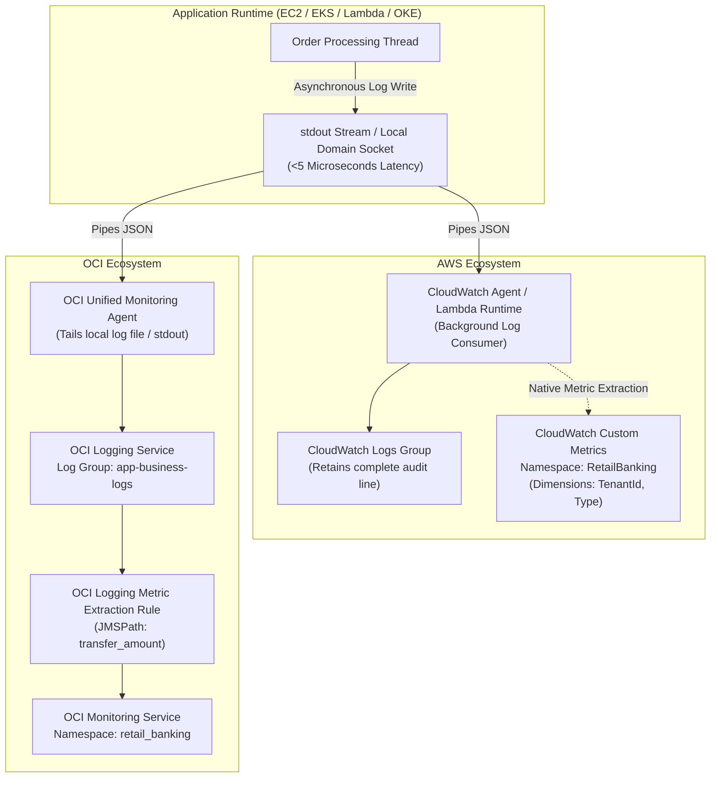
```mermaid
graph TD
    subgraph "Application Runtime (EC2 / EKS / Lambda / OKE)"
        APP_THREAD["Order Processing Thread"]
        STDOUT["stdout Stream / Local Domain Socket\n(<5 Microseconds Latency)"]
        APP_THREAD -->|Asynchronous Log Write| STDOUT
    end

    subgraph "AWS Ecosystem"
        CW_AGENT["CloudWatch Agent / Lambda Runtime\n(Background Log Consumer)"]
        STDOUT -->|Pipes JSON| CW_AGENT
        CW_LOGS["CloudWatch Logs Group\n(Retains complete audit line)"]
        CW_METRIC["CloudWatch Custom Metrics\nNamespace: RetailBanking\n(Dimensions: TenantId, Type)"]
        CW_AGENT --> CW_LOGS
        CW_AGENT -.->|Native Metric Extraction| CW_METRIC
    end

    subgraph "OCI Ecosystem"
        OCI_AGENT["OCI Unified Monitoring Agent\n(Tails local log file / stdout)"]
        STDOUT -->|Pipes JSON| OCI_AGENT
        OCI_LOG_GRP["OCI Logging Service\nLog Group: app-business-logs"]
        OCI_METRIC_RULE["OCI Logging Metric Extraction Rule\n(JMSPath: transfer_amount)"]
        OCI_MON_NS["OCI Monitoring Service\nNamespace: retail_banking"]
        OCI_AGENT --> OCI_LOG_GRP
        OCI_LOG_GRP --> OCI_METRIC_RULE
        OCI_METRIC_RULE --> OCI_MON_NS
    end
```

#### AWS Implementation
Using AWS Embedded Metric Format (EMF) in Node.js / Python without making network API calls [Doc: AWS CloudWatch EMF, checked 2026]:

```python
# app_metrics.py
import json
import time

def emit_business_metric(tenant_id, transaction_type, amount):
    # Construct EMF JSON payload
    emf_payload = {
        "_aws": {
            "Timestamp": int(time.time() * 1000),
            "CloudWatchMetrics": [
                {
                    "Namespace": "RetailBanking",
                    "Dimensions": [["TenantId", "TransactionType"]],
                    "Metrics": [
                        {"Name": "TransferAmount", "Unit": "None"},
                        {"Name": "TransactionCount", "Unit": "Count"}
                    ]
                }
            ]
        },
        "TenantId": tenant_id,
        "TransactionType": transaction_type,
        "TransferAmount": amount,
        "TransactionCount": 1,
        "AuditUserId": "usr_991823"  # Preserved in logs, excluded from metric dimensions
    }
    # Print to stdout: non-blocking, zero AWS SDK network calls
    print(json.dumps(emf_payload))

emit_business_metric("corp-alpha", "ACH", 1250.75)
```

#### OCI Implementation
Implement asynchronous business metric extraction from structured JSON logs using OCI CLI and Metric Extraction Rules [Doc: OCI Logging Metric Extraction, checked 2026]:

```bash
# Step 1: Create a Custom Metric in OCI Monitoring via Metric Extraction from Log Group
oci logging log-group create \
  --compartment-id ocid1.compartment.oc1..aaaaaaaam7... \
  --display-name "banking-app-logs"

# Step 2: Create a Metric Extraction Rule on the Log Group
cat << 'EOF' > metric-extraction.json
{
  "metricNamespace": "retail_banking",
  "metricName": "TransferAmount",
  "compartmentId": "ocid1.compartment.oc1..aaaaaaaam7...",
  "dimensionFilter": {
    "tenant_id": "$.tenantId",
    "transaction_type": "$.transactionType"
  },
  "extractionType": "VALUE",
  "valueField": "$.transferAmount"
}
EOF

# Ingest custom metric data directly via OCI CLI PostMetricData (for out-of-band services)
oci monitoring metric-data post \
  --metric-data '[{
    "compartmentId": "ocid1.compartment.oc1..aaaaaaaam7...",
    "namespace": "retail_banking",
    "name": "TransactionCount",
    "dimensions": {
      "TenantId": "corp-alpha",
      "TransactionType": "ACH"
    },
    "datapoints": [{
      "timestamp": "2026-03-01T12:00:00.000Z",
      "value": 1.0,
      "count": 1
    }]
  }]'
```

#### Common Trap
Including unbounded high-cardinality identifiers (such as `UserId`, `OrderId`, or `CreditCardHash`) as dimensions inside CloudWatch EMF or OCI Custom Metrics. CloudWatch treats every unique combination of dimensions as a completely distinct custom metric ($0.30/metric/month). Emitting 50,000 unique `OrderId` dimensions per day creates 50,000 new metrics, triggering an unexpected \$15,000/month CloudWatch bill. High-cardinality fields must remain as standard log payload attributes for querying via CloudWatch Logs Insights or OCI Logging Query Language, while metrics must only use bounded dimensions (e.g., `TenantId`, `Region`, `StatusCode`).

#### Follow-up Question
How do you calculate dynamic percentiles ($p50$, $p90$, $p99$) on emitted custom business metrics across millions of transactions without storing every individual transaction value in memory?

---

### Q341: Distributed Context & Correlation: Trace ID Injection & Log Stitching

#### Question
How do cloud observability architectures achieve deterministic 3-way correlation between distributed traces, application logs, and system metrics across polyglot microservices, and how do OpenTelemetry SDKs, AWS X-Ray, and OCI APM maintain context propagation across asynchronous message brokers (Kafka, SQS, OCI Streaming)?

#### Short Answer
Deterministic 3-way correlation binds logs, metrics, and traces using standardized context identifiers defined by the W3C Trace Context specification (`traceparent` and `tracestate`). Application logging frameworks (Logback, Winston, Zap) leverage OpenTelemetry SDK context injectors to automatically write `trace_id` and `span_id` into log records via Mapped Diagnostic Context (MDC). Metrics are tagged with active service and span exemplars. For asynchronous messaging architectures (Amazon SQS/SNS, Kafka, OCI Streaming), telemetry SDKs inject trace context into message attributes/headers upon production and extract them upon consumption, preventing asynchronous message queues from severing distributed trace timelines.

#### Deep Answer
In microservice architectures, an outage rarely presents as a single error. When an upstream checkout service fails, downstream payment, inventory, and notification logs simultaneously generate thousands of log lines. Searching logs by timestamp alone is futile due to concurrent transactions.

**The Mechanics of 3-Way Observability Correlation**:
1. **W3C Trace Context Standard**:
   - `traceparent: 00-4bf92f3577b34da6a3ce929d0e0e4736-00f067aa0ba902b7-01`
   - Formatted as `version` (2 hex) - `trace_id` (32 hex) - `parent_id/span_id` (16 hex) - `trace_flags` (2 hex: `01` = sampled).
2. **Mapped Diagnostic Context (MDC) Log Injection**:
   - In thread-per-request or reactive runtime models, the OpenTelemetry instrumentation hook intercepts the active trace context and populates thread-local storage or context objects.
   - The log formatter automatically appends `{"trace_id": "...", "span_id": "..."}` into every structured JSON log line.
   - Observability backends (CloudWatch Logs Insights, OCI APM Log Analytics) construct deep links: clicking a log line instantly opens the corresponding distributed trace in AWS X-Ray or OCI APM, and vice-versa.
3. **Exemplars in Metrics**:
   - High-percentile latency spikes ($p99$) recorded in a Prometheus/CloudWatch histogram attach an **Exemplar**: a specific `(trace_id, value)` tuple recorded at that exact millisecond. SREs clicking on the latency anomaly graph are transported directly to the root-cause trace span.
4. **Asynchronous Message Propagation**:
   - HTTP headers cannot cross message queues directly. Instead, telemetry SDKs inject the trace context into **Message Attributes**:
     - *AWS SQS/SNS*: Injected into `MessageAttributes` (String data type `AWSTraceHeader` or `traceparent`).
     - *Apache Kafka / OCI Streaming*: Injected into Kafka record `Headers` as byte arrays.
     - The consumer extracts the header, creates a child span with a `PRODUCER`/`CONSUMER` link, and restores trace continuity across asynchronous boundaries.

#### Architecture
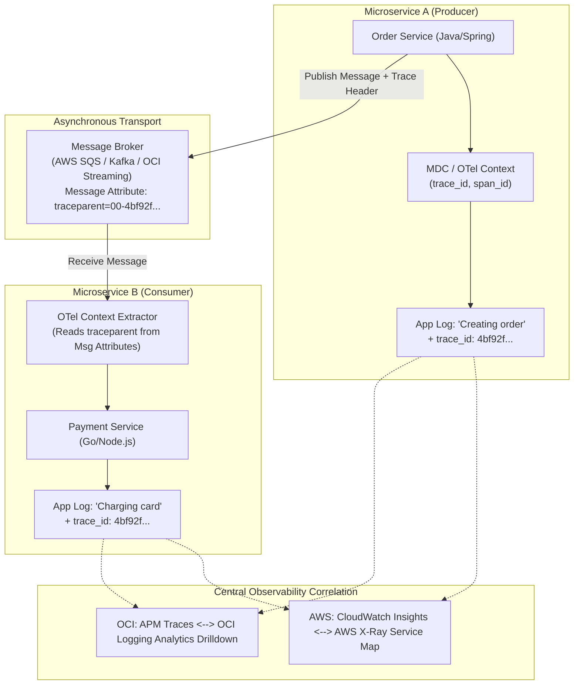
```mermaid
graph TD
    subgraph "Microservice A (Producer)"
        APP_A["Order Service (Java/Spring)"]
        MDC_A["MDC / OTel Context\n(trace_id, span_id)"]
        LOGS_A["App Log: 'Creating order'\n+ trace_id: 4bf92f..."]
        APP_A --> MDC_A
        MDC_A --> LOGS_A
    end

    subgraph "Asynchronous Transport"
        MSG_QUEUE["Message Broker\n(AWS SQS / Kafka / OCI Streaming)\nMessage Attribute: traceparent=00-4bf92f..."]
        APP_A -->|Publish Message + Trace Header| MSG_QUEUE
    end

    subgraph "Microservice B (Consumer)"
        APP_B["Payment Service (Go/Node.js)"]
        EXTRACT["OTel Context Extractor\n(Reads traceparent from Msg Attributes)"]
        LOGS_B["App Log: 'Charging card'\n+ trace_id: 4bf92f..."]
        MSG_QUEUE -->|Receive Message| EXTRACT
        EXTRACT --> APP_B
        APP_B --> LOGS_B
    end

    subgraph "Central Observability Correlation"
        AWS_CORR["AWS: CloudWatch Insights <--> AWS X-Ray Service Map"]
        OCI_CORR["OCI: APM Traces <--> OCI Logging Analytics Drilldown"]
        LOGS_A -.-> AWS_CORR
        LOGS_B -.-> AWS_CORR
        LOGS_A -.-> OCI_CORR
        LOGS_B -.-> OCI_CORR
    end
```

#### AWS Implementation
Configure automated X-Ray / OpenTelemetry trace ID injection in Python using the AWS Distro for OpenTelemetry (ADOT) and SQS Message Attributes [Doc: AWS X-Ray Context Propagation, checked 2026]:

```python
# Producer: Inject W3C Trace Context into AWS SQS Message Attributes
import boto3
from opentelemetry import trace
from opentelemetry.trace.propagation.tracecontext import TraceContextTextMapPropagator

sqs = boto3.client('sqs')
tracer = trace.get_tracer(__name__)
queue_url = "https://sqs.us-east-1.amazonaws.com/123456789012/order-queue"

with tracer.start_as_current_span("process_checkout") as span:
    # Inject active traceparent into dictionary
    carrier = {}
    TraceContextTextMapPropagator().inject(carrier)
    
    traceparent_header = carrier.get("traceparent")
    
    sqs.send_message(
        QueueUrl=queue_url,
        MessageBody='{"order_id": "ord-9921", "amount": 199.99}',
        MessageAttributes={
            'traceparent': {
                'DataType': 'String',
                'StringValue': traceparent_header
            }
        }
    )
    print(f"Dispatched message with traceparent: {traceparent_header}")
```

```bash
# Query correlated logs in CloudWatch Logs Insights using extracted trace ID
aws logs start-query \
  --log-group-name "/aws/eks/prod-cluster/application" \
  --start-time 1772841600 \
  --end-time 1772845200 \
  --query-string 'fields @timestamp, @message, traceId, spanId | filter traceId = "4bf92f3577b34da6a3ce929d0e0e4736" | sort @timestamp asc'
```

#### OCI Implementation
Correlate logs and traces in OCI APM and OCI Logging Analytics using OpenTelemetry standards [Doc: OCI APM Trace and Log Correlation, checked 2026]:

```python
# Consumer: Extract Trace Context from OCI Streaming / Kafka Message in OCI
from opentelemetry import trace
from opentelemetry.trace.propagation.tracecontext import TraceContextTextMapPropagator
import logging

tracer = trace.get_tracer(__name__)
logger = logging.getLogger("PaymentProcessor")

def process_stream_message(record_value, record_headers):
    # Extract carrier from Kafka/OCI Streaming headers
    carrier = {k: v.decode('utf-8') for k, v in record_headers.items()}
    parent_context = TraceContextTextMapPropagator().extract(carrier)
    
    # Start consumer span as child of extracted context
    with tracer.start_as_current_span("consume_payment_event", context=parent_context) as span:
        ctx = span.get_span_context()
        trace_id_hex = trace.format_trace_id(ctx.trace_id)
        span_id_hex = trace.format_span_id(ctx.span_id)
        
        # Correlated Log Entry ingested by OCI Logging Analytics
        logger.info(
            f"Processing payment for order",
            extra={"oci_apm_trace_id": trace_id_hex, "oci_apm_span_id": span_id_hex}
        )
```

```bash
# Search correlated spans and logs in OCI Logging Analytics via OCI CLI
oci log-analytics query execute \
  --namespace-name "enterprise-telemetry" \
  --query-text "'APM Trace ID' = '4bf92f3577b34da6a3ce929d0e0e4736' | fields LogContent, Time, 'APM Span ID'" \
  --time-filter '{"timeStart": "2026-03-01T00:00:00Z", "timeEnd": "2026-03-01T23:59:59Z"}'
```

#### Common Trap
Using asynchronous worker thread pools (such as `Executors.newFixedThreadPool()` in Java or unpropagated `asyncio` tasks in Python) without propagating the MDC or OpenTelemetry active context. In multi-threaded runtimes, thread-local variables do not automatically pass to child threads. When a request thread hands off a task to a background worker, the MDC trace ID is lost, causing subsequent background log lines to emit empty trace IDs (`trace_id: null`), severing the log-to-trace correlation link.

#### Follow-up Question
How do you maintain distributed trace correlation across third-party SaaS payment gateways (e.g., Stripe, PayPal) that do not accept or return custom HTTP tracing headers?

---

### Q342: Network Flow Observability: VPC Flow Logs vs OCI VCN Flow Logs

#### Question
How do cloud network engineers capture, filter, and analyze IP traffic metadata across virtual cloud networks without installing host-based packet capture agents, and how do Amazon VPC Flow Logs and OCI VCN Flow Logs compare in aggregation intervals, sampling, custom format enrichments, and security analytics?

#### Short Answer
Network flow observability captures IP network flow records (5-tuple: source IP, destination IP, source port, destination port, protocol, plus packet/byte counts and action `ACCEPT`/`REJECT`) directly at the virtual network interface (ENI / VNIC) hypervisor layer. AWS VPC Flow Logs supports 1-minute or 10-minute aggregation intervals, custom log formatting with metadata enrichments (VPC ID, subnet ID, instance ID, TCP flags, traffic direction), and delivery to CloudWatch Logs, S3, or Kinesis Firehose. OCI VCN Flow Logs samples 100% of packets or applies configurable sampling rates (e.g., 10%), writes in standard OCI Logging format, provides 1-minute aggregation windows, and natively integrates with OCI Service Connector Hub and OCI Logging Analytics for rapid SecOps forensic queries.

#### Deep Answer
Virtual Private Cloud (VPC) and Virtual Cloud Network (VCN) flow logs operate at the software-defined networking (SDN) virtualization layer, completely out-of-band from guest OS kernel stacks. This ensures that even if an EC2 or OCI Compute instance is compromised or frozen, flow telemetry cannot be tampered with or terminated by an attacker.

**Core Technical Attributes**:
1. **Flow Definition & 5-Tuple**: A flow record represents a unidirectional sequence of packets sharing the same 5-tuple: `(srcaddr, dstaddr, srcport, dstport, protocol)` within an aggregation window.
2. **Aggregation Intervals & Latency**:
   - **AWS VPC Flow Logs**: Offers **1-minute** (recommended for security forensics and real-time IDS/IPS) or **10-minute** (default, lower log volume for cost savings).
   - **OCI VCN Flow Logs**: Evaluates flows continuously with **1-minute** aggregation windows [Doc: OCI VCN Flow Logs, checked 2026].
3. **Traffic Filtering**: Both platforms allow filtering by action:
   - `ALL`: Records accepted and rejected packets.
   - `REJECT`: Records only traffic blocked by Security Groups, Network ACLs, or OCI Network Security Groups (NSGs). Essential for detecting port scans, brute-force attempts, and unauthorized lateral traversal with low storage volume.
   - `ACCEPT`: Records legitimate communications for capacity planning and service discovery.
4. **Metadata Enrichments & TCP Flags**:
   - AWS VPC Flow Logs supports custom formats incorporating TCP flags (`SYN`, `SYN-ACK`, `FIN`, `RST` mapped to bitmask integers), flow direction (`ingress`/`egress`), and resource identifiers (`instance-id`, `pkt-src-aws-service`, `traffic-path`).
   - OCI VCN Flow Logs provides rich JSON records including compartment OCIDs, VNIC OCIDs, security list rule numbers, and network security group matches, immediately indexable in OCI Logging Analytics.

#### Architecture
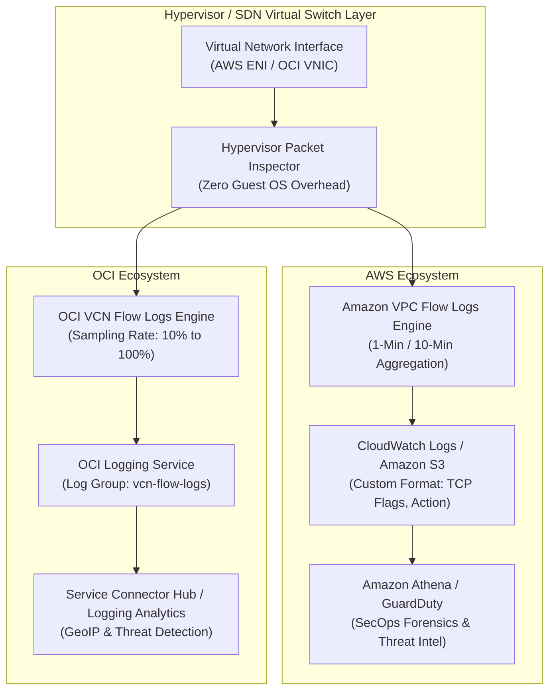
```mermaid
graph TD
    subgraph "Hypervisor / SDN Virtual Switch Layer"
        ENI_VNIC["Virtual Network Interface\n(AWS ENI / OCI VNIC)"]
        SDN_PROBE["Hypervisor Packet Inspector\n(Zero Guest OS Overhead)"]
        ENI_VNIC --> SDN_PROBE
    end

    subgraph "AWS Ecosystem"
        VPC_FL["Amazon VPC Flow Logs Engine\n(1-Min / 10-Min Aggregation)"]
        CW_FL["CloudWatch Logs / Amazon S3\n(Custom Format: TCP Flags, Action)"]
        ATHENA["Amazon Athena / GuardDuty\n(SecOps Forensics & Threat Intel)"]
        SDN_PROBE --> VPC_FL
        VPC_FL --> CW_FL
        CW_FL --> ATHENA
    end

    subgraph "OCI Ecosystem"
        VCN_FL["OCI VCN Flow Logs Engine\n(Sampling Rate: 10% to 100%)"]
        OCI_LOG["OCI Logging Service\n(Log Group: vcn-flow-logs)"]
        SCH_FL["Service Connector Hub / Logging Analytics\n(GeoIP & Threat Detection)"]
        SDN_PROBE --> VCN_FL
        VCN_FL --> OCI_LOG
        OCI_LOG --> SCH_FL
    end
```

#### AWS Implementation
Create a VPC Flow Log with 1-minute aggregation interval, custom metadata fields (including TCP flags and traffic direction), and publish directly to S3 [Doc: AWS VPC Flow Logs Custom Format, checked 2026]:

```bash
# Create VPC Flow Log with 1-minute aggregation and enriched TCP flag attributes
aws ec2 create-flow-logs \
  --resource-type VPC \
  --resource-ids vpc-0a1b2c3d4e5f67890 \
  --traffic-type ALL \
  --log-destination-type s3 \
  --log-destination "arn:aws:s3:::enterprise-security-flow-logs-111122223333/vpc-flow/" \
  --max-aggregation-interval 60 \
  --log-format '${version} ${account-id} ${interface-id} ${srcaddr} ${dstaddr} ${srcport} ${dstport} ${protocol} ${packets} ${bytes} ${start} ${end} ${action} ${log-status} ${tcp-flags} ${flow-direction} ${traffic-path}'
```

```sql
-- Query rejected SYN packets (port scans) in Amazon Athena
SELECT
  srcaddr,
  dstport,
  count(*) as scan_attempts
FROM "security_db"."vpc_flow_logs"
WHERE action = 'REJECT'
  AND tcp_flags = 2 -- TCP SYN flag bitmask
GROUP BY srcaddr, dstport
ORDER BY scan_attempts DESC
LIMIT 20;
```

#### OCI Implementation
Enable VCN Flow Logs on a Subnet or VNIC using OCI CLI and stream to OCI Logging Analytics [Doc: OCI VCN Flow Logs Configuration, checked 2026]:

```bash
# Step 1: Create a Log Group for VCN Flow Logs
oci logging log-group create \
  --compartment-id ocid1.compartment.oc1..aaaaaaaam7... \
  --display-name "network-security-log-group"

# Step 2: Enable Flow Logs on a Production Subnet
cat << 'EOF' > vcn-flow-log-config.json
{
  "compartmentId": "ocid1.compartment.oc1..aaaaaaaam7...",
  "displayName": "prod-subnet-vcn-flow-logs",
  "logType": "SERVICE",
  "configuration": {
    "compartmentId": "ocid1.compartment.oc1..aaaaaaaam7...",
    "source": {
      "sourceType": "OCISERVICE",
      "service": "flowlogs",
      "resource": "ocid1.subnet.oc1.iad.aaaaaaaaxample...",
      "category": "all"
    }
  },
  "isEnable": true
}
EOF

oci logging log create --from-json file://vcn-flow-log-config.json

# Query rejected connections in OCI Logging Analytics
oci log-analytics query execute \
  --namespace-name "enterprise-telemetry" \
  --query-text "'Log Source' = 'OCI VCN Flow Logs' and Action = 'REJECT' | stats count by 'Source IP', 'Destination Port' | sort -count" \
  --time-filter '{"timeStart": "2026-03-01T00:00:00Z", "timeEnd": "2026-03-01T12:00:00Z"}'
```

#### Common Trap
Assuming flow logs capture the application-layer payload or internal container overlay network traffic. VPC/VCN flow logs capture only Layer 3 and Layer 4 packet headers traversing the host virtual network interface. They do not record HTTP request bodies, TLS-encrypted payloads, DNS hostnames, or pod-to-pod traffic within the same worker node (which communicates over local Linux bridges or `veth` pairs without touching the AWS ENI or OCI VNIC).

#### Follow-up Question
How do you decode TCP flag integers (e.g., `2` for SYN, `18` for SYN-ACK, `16` for ACK, `4` for RST) across millions of flow records to identify half-open SYN flood attacks vs normal connection teardowns?

---

### Q343: Serverless Observability: Cold Start Monitoring & Lambda Telemetry API vs OCI Functions

#### Question
How do cloud architects monitor serverless execution lifecycles, quantify cold start latency vs execution duration, and trace serverless microservices across distributed boundaries without introducing initialization overhead, and how do AWS Lambda Insights / Telemetry API compare to OCI Functions metrics and FDK tracing?

#### Short Answer
Serverless observability decomposes execution duration into three distinct phases: **Init Phase** (container sandbox creation, runtime bootstrap, static dependency imports), **Invocation Phase** (actual business logic execution), and **Shutdown Phase**. AWS Lambda provides the **Lambda Telemetry API** and **Lambda Insights** (an extension that extracts execution telemetry from `/proc` and emits structured EMF logs), reporting `InitDuration`, `Duration`, `BilledDuration`, and memory watermark. OCI Functions (built on open-source Fn Project) integrates natively with OCI Monitoring and OCI APM, using Fn Function Development Kits (FDK) to inject OpenTelemetry distributed tracing context and reporting execution metrics (`FunctionInvocations`, `FunctionExecutionTime`, `FunctionExecutionErrors`) directly to OCI Monitoring.

#### Deep Answer
Serverless compute abstracts the underlying operating system, eliminating traditional SSH access and background daemon processes. Telemetry collection cannot run as an independent background agent without freezing when the serverless container execution context is frozen between invocations.

**Serverless Lifecycle Observability Breakdown**:
1. **The Three Execution Phases**:
   - `Init Phase`: Occurs during a **Cold Start**. Includes downloading the code/container image, initializing the runtime (JVM, Node.js, Python), and executing code outside the event handler. In AWS, `InitDuration` is billed separately if using Provisioned Concurrency or SnapStart. In OCI, cold starts occur when spinning up a new Fn container runner.
   - `Invoke Phase`: The handler receives the event payload, executes database calls/business logic, and returns a response.
   - `Shutdown Phase`: If no new requests arrive within an idle window (typically 5–15 minutes), the cloud provider sends a shutdown signal, terminates the container, and reclaims memory.
2. **AWS Lambda Telemetry API & Extensions**:
   - Lambda allows out-of-process **Lambda Extensions** running alongside the runtime engine.
   - The **Lambda Telemetry API** streams low-level platform lifecycle events (`platform.initStart`, `platform.initRuntimeDone`, `platform.report`, `platform.runtimeDone`) directly to local HTTP listeners exposed by observability extensions (Datadog, Dynatrace, New Relic, ADOT) without parsing CloudWatch text logs [Doc: AWS Lambda Telemetry API, checked 2026].
3. **OCI Functions Observability Mechanics**:
   - OCI Functions is container-native, executing standard Docker/OCI-compliant container images managed by Fn Project.
   - Built-in metrics: `FunctionInvocations`, `FunctionExecutionTime`, `FunctionExecutionErrors`, and `FunctionQuotaUtilization`.
   - Distributed Tracing: The OCI Fn FDK automatically extracts OpenTelemetry headers from HTTP headers and publishes spans to **OCI Application Performance Monitoring (APM)** via the OCI APM Tracer library [Doc: OCI Functions Tracing with APM, checked 2026].

#### Architecture
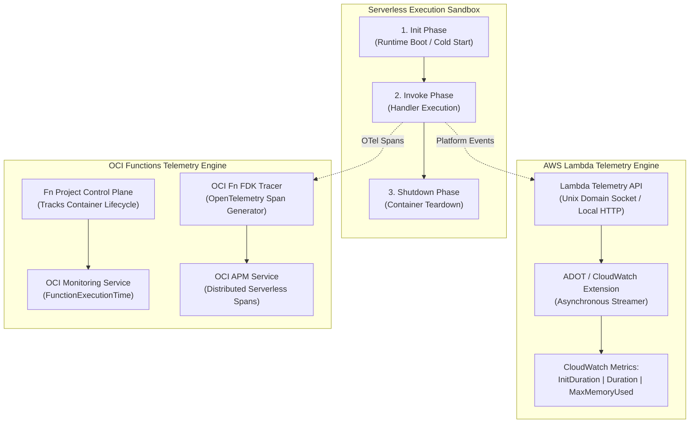
```mermaid
graph TD
    subgraph "Serverless Execution Sandbox"
        INIT["1. Init Phase\n(Runtime Boot / Cold Start)"]
        INVOKE["2. Invoke Phase\n(Handler Execution)"]
        SHUTDOWN["3. Shutdown Phase\n(Container Teardown)"]
        INIT --> INVOKE --> SHUTDOWN
    end

    subgraph "AWS Lambda Telemetry Engine"
        LAMBDA_API["Lambda Telemetry API\n(Unix Domain Socket / Local HTTP)"]
        ADOT_EXT["ADOT / CloudWatch Extension\n(Asynchronous Streamer)"]
        CW_METRICS["CloudWatch Metrics:\nInitDuration | Duration | MaxMemoryUsed"]
        INVOKE -.->|Platform Events| LAMBDA_API
        LAMBDA_API --> ADOT_EXT
        ADOT_EXT --> CW_METRICS
    end

    subgraph "OCI Functions Telemetry Engine"
        FN_ENGINE["Fn Project Control Plane\n(Tracks Container Lifecycle)"]
        OCI_FDK["OCI Fn FDK Tracer\n(OpenTelemetry Span Generator)"]
        OCI_MON["OCI Monitoring Service\n(FunctionExecutionTime)"]
        OCI_APM["OCI APM Service\n(Distributed Serverless Spans)"]
        INVOKE -.->|OTel Spans| OCI_FDK
        FN_ENGINE --> OCI_MON
        OCI_FDK --> OCI_APM
    end
```

#### AWS Implementation
Enable Lambda Insights, AWS X-Ray active tracing, and parse cold start telemetry via CloudWatch Logs Insights [Doc: AWS Lambda Insights, checked 2026]:

```bash
# Enable AWS X-Ray Active Tracing and attach CloudWatch Lambda Insights Layer
aws lambda update-function-configuration \
  --function-name "PaymentProcessorServerless" \
  --tracing-config Mode=Active \
  --layers "arn:aws:lambda:us-east-1:580247275435:layer:LambdaInsightsExtension:53"
```

```sql
-- Query Cold Starts vs Warm Starts in CloudWatch Logs Insights
filter @type = "REPORT"
| parse @message /Init Duration: (?<init_duration>[0-9\.]+) ms/
| fields @timestamp, @duration, @billedDuration, @maxMemoryUsed / 1000000 as max_mem_mb, init_duration
| stats
    count(*) as total_invocations,
    count(init_duration) as cold_starts,
    (count(init_duration) / count(*)) * 100 as cold_start_percentage,
    avg(init_duration) as avg_cold_start_ms,
    avg(@duration) as avg_warm_duration_ms,
    max(@maxMemoryUsed / 1000000) as peak_memory_mb
```

#### OCI Implementation
Configure OCI Functions distributed tracing with OCI APM and monitor execution metrics [Doc: OCI Functions Monitoring and APM, checked 2026]:

```bash
# Step 1: Enable Tracing on an OCI Functions Application
oci fn application update \
  --application-id ocid1.fnapp.oc1.iad.aaaaaaaaxample... \
  --trace-config '{
    "isEnabled": true,
    "domainId": "ocid1.apmdomain.oc1.iad.aaaaaaaax4..."
  }'

# Step 2: Set Function Memory and Timeout Configuration
oci fn function update \
  --function-id ocid1.fnfunc.oc1.iad.aaaaaaaaxample... \
  --memory-in-mbs 512 \
  --timeout-in-seconds 30

# Step 3: Alarm on High Serverless Execution Duration in OCI Monitoring
oci monitoring alarm create \
  --compartment-id ocid1.compartment.oc1..aaaaaaaam7... \
  --display-name "FunctionExecutionTimeHigh" \
  --metric-compartment-id ocid1.compartment.oc1..aaaaaaaam7... \
  --namespace "oci_faas" \
  --query-text "FunctionExecutionTime[1m].mean() > 5000" \
  --severity "WARNING" \
  --is-enabled true \
  --destinations '["ocid1.onstopic.oc1.iad.aaaaaaaaxample..."]'
```

#### Common Trap
Configuring heavy third-party telemetry SDKs inside synchronous serverless handlers that flush spans over HTTPS before returning the response. Synchronous network flushes directly inflate user-facing latency and billed execution duration on every single invocation. Modern serverless architectures must leverage the AWS Lambda Telemetry API or asynchronous background extensions that flush spans during runtime idle time or freeze cycles.

#### Follow-up Question
How does AWS Lambda SnapStart (MicroVM snapshotting) affect unique random number generation, cryptographic seeds, and OpenTelemetry trace ID generation across restored execution contexts?

---

### Q344: Observability Cost Optimization & FinOps: Ingest Throttling & Sampling

#### Question
How do enterprises implement FinOps practices to identify, budget, and curb exponential observability cost spikes (CloudWatch Logs ingestion, excessive metric cardinality, and unconstrained trace sampling) across AWS and OCI environments?

#### Short Answer
Observability FinOps prevents monitoring bills from exceeding infrastructure compute costs by enforcing controls across the three pillars: (1) **Logs**: Enforcing log drop filters, transition to lower-cost log classes (CloudWatch Infrequent Access or OCI Object Storage), log level tuning via dynamic configurations (preventing `DEBUG` in production), and central S3/Object Storage exports; (2) **Metrics**: Eliminating high-cardinality custom dimensions (UUIDs, IP addresses), aggregating metrics at the edge using OpenTelemetry Collectors, and utilizing metric math over duplicate metric publishing; (3) **Traces**: Transitioning from 100% head-based sampling to tail-based sampling (sampling 1% of HTTP 200s, but 100% of HTTP 5xx errors and $p99$ high-latency requests) via OpenTelemetry Collector pipelines.

#### Deep Answer
In large cloud enterprises, observability often becomes the fastest-growing item on the monthly cloud invoice. A single developer accidentally deploying a loop logging 10,000 `DEBUG` lines per second can generate thousands of dollars in CloudWatch or Datadog ingestion costs overnight.

**FinOps Strategies Across Observability Pillars**:

1. **Log Volume Optimization**:
   - *CloudWatch Ingestion Pricing*: AWS charges \$0.50 per GB for Standard log ingestion. Ingesting 1TB/day costs \$15,000/month. Moving high-volume, low-value logs (VPC Flow Logs, CloudTrail S3 data events, ALB access logs) to CloudWatch Logs Infrequent Access (\$0.25/GB) or streaming directly to S3 via Kinesis Firehose cuts ingestion costs by 50% to 90%.
   - *OCI Logging Pricing*: OCI charges \$0.05 per GB (first 10GB/mo free), one-tenth the cost of AWS. However, streaming logs into OCI Logging Analytics charges additional analytics storage fees (\$0.05/GB/mo). Setting strict lifecycle retention rules (e.g., dropping raw logs to OCI Object Storage Archive Tier at \$0.0026/GB/mo after 14 days) eliminates long-term accrual.
2. **Metric Cardinality Reduction**:
   - CloudWatch charges \$0.30 per custom metric per month for the first 10,000 metrics. If an application records `HttpRequestCount` with dimensions `Method`, `Path`, and `UserId` (where `UserId` has 100,000 unique values), it creates 100,000 custom metrics, costing \$30,000/month.
   - SREs must filter out ephemeral dimensions at the agent level (OTel Collector `metricstransform` or `filter` processors) before exporting to CloudWatch or OCI Monitoring.
3. **Tail-Based Trace Sampling**:
   - *Head-Based Sampling*: Samples decisions at the root ingress span (e.g., a coin flip: sample 5% of all requests). Flaw: If a critical error occurs during an unsampled 95% request, the error trace is permanently lost.
   - *Tail-Based Sampling*: Buffers all spans in memory within an OpenTelemetry Collector cluster until the root span completes. The collector evaluates the entire trace: if `http.status_code >= 500` or `duration >= 2000ms`, retain 100%; if `http.status_code == 200`, retain 1%. This slashes trace ingestion volume by 90% while guaranteeing 100% capture of production incidents.

#### Architecture
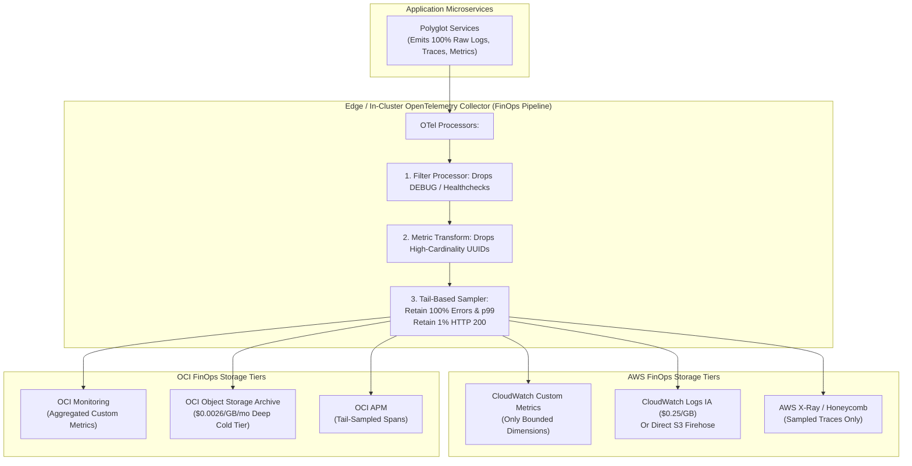
```mermaid
graph TD
    subgraph "Application Microservices"
        APP["Polyglot Services\n(Emits 100% Raw Logs, Traces, Metrics)"]
    end

    subgraph "Edge / In-Cluster OpenTelemetry Collector (FinOps Pipeline)"
        OTEL_PROC["OTel Processors:"]
        FILTER["1. Filter Processor: Drops DEBUG / Healthchecks"]
        CARD_RED["2. Metric Transform: Drops High-Cardinality UUIDs"]
        TAIL_SAMP["3. Tail-Based Sampler:\nRetain 100% Errors & p99\nRetain 1% HTTP 200"]
        
        APP --> OTEL_PROC
        OTEL_PROC --> FILTER --> CARD_RED --> TAIL_SAMP
    end

    subgraph "AWS FinOps Storage Tiers"
        CW_METRICS["CloudWatch Custom Metrics\n(Only Bounded Dimensions)"]
        CW_IA["CloudWatch Logs IA ($0.25/GB)\nOr Direct S3 Firehose"]
        XRAY["AWS X-Ray / Honeycomb\n(Sampled Traces Only)"]
        TAIL_SAMP --> CW_METRICS
        TAIL_SAMP --> CW_IA
        TAIL_SAMP --> XRAY
    end

    subgraph "OCI FinOps Storage Tiers"
        OCI_MON["OCI Monitoring\n(Aggregated Custom Metrics)"]
        OCI_OBJ_ARCH["OCI Object Storage Archive\n($0.0026/GB/mo Deep Cold Tier)"]
        OCI_APM["OCI APM\n(Tail-Sampled Spans)"]
        TAIL_SAMP --> OCI_MON
        TAIL_SAMP --> OCI_OBJ_ARCH
        TAIL_SAMP --> OCI_APM
    end
```

#### AWS Implementation
Implement Tail-Based Sampling in the AWS Distro for OpenTelemetry (ADOT) Collector configuration to control X-Ray and CloudWatch costs [Doc: ADOT Collector Tail-Based Sampling, checked 2026]:

```yaml
# config.yaml (OpenTelemetry Collector)
receivers:
  otlp:
    protocols:
      grpc:
      http:

processors:
  # FinOps Rule 1: Tail-based sampling to eliminate boring 200 OK traces
  tail_sampling:
    decision_wait: 10s
    num_traces: 10000
    expected_new_traces_per_sec: 2000
    policies:
      # Always sample 100% of errors
      - name: sample-errors
        type: status_code
        status_code: { status_codes: [ ERROR ] }
      # Always sample requests taking longer than 1500ms
      - name: sample-high-latency
        type: latency
        latency: { threshold_ms: 1500 }
      # Sample only 2% of successful requests
      - name: sample-success-probabilistic
        type: probabilistic
        probabilistic: { sampling_percentage: 2.0 }

  # FinOps Rule 2: Metric dimension filtering to prevent high cardinality
  transform:
    metric_statements:
      - context: datapoint
        statements:
          - delete_key_path(attributes, "user_id")
          - delete_key_path(attributes, "request_id")

exporters:
  awsxray:
  awsemf:
    namespace: ProductionFinOps

service:
  pipelines:
    traces:
      receivers: [otlp]
      processors: [tail_sampling]
      exporters: [awsxray]
    metrics:
      receivers: [otlp]
      processors: [transform]
      exporters: [awsemf]
```

#### OCI Implementation
Implement Cost-optimized Log Filtering and Object Storage Archival using OCI Service Connector Hub and OCI Budgets [Doc: OCI Observability Cost Management, checked 2026]:

```bash
# Step 1: Create an OCI Budget to alert when Observability spend exceeds threshold
oci budget budget create \
  --compartment-id ocid1.tenancy.oc1..aaaaaaaaxample \
  --amount 2500.00 \
  --reset-period "MONTHLY" \
  --target-type "COMPARTMENT" \
  --targets '["ocid1.compartment.oc1..observability_compartment"]' \
  --display-name "Monthly-Observability-Budget-Limit"

# Step 2: Use SCH to filter out health check logs before ingestion into OCI Logging Analytics
cat << 'EOF' > sch-filter-rule.json
{
  "source": {
    "kind": "logging",
    "logSources": [
      {
        "compartmentId": "ocid1.compartment.oc1..aaaaaaaam7...",
        "logGroupId": "ocid1.loggroup.oc1.iad.aaaaaaaaxample..."
      }
    ]
  },
  "tasks": [
    {
      "kind": "logRule",
      "taskOrder": 0,
      "condition": "data.uri != '/healthz' and data.uri != '/ready' and data.status >= 400"
    }
  ],
  "target": {
    "kind": "loggingAnalytics",
    "logGroupId": "ocid1.loganalyticsloggroup.oc1.iad.aaaaaaaaxample..."
  }
}
EOF

oci sch service-connector create \
  --compartment-id ocid1.compartment.oc1..aaaaaaaam7... \
  --display-name "FinOps-Log-Filter-Connector" \
  --source file://sch-filter-rule.json \
  --tasks file://sch-filter-rule.json \
  --target file://sch-filter-rule.json
```

#### Common Trap
Enabling debug logging (`level: DEBUG`) across production clusters and forgetting to revert the configuration after an incident. A high-throughput cluster emitting debug logs can generate 50GB to 100GB of logs per hour, producing thousands of dollars in surprise cloud charges within days. Enterprise platforms must enforce runtime dynamic log-level adjustment with automatic expiration (e.g., reverting back to `INFO` after 1 hour).

#### Follow-up Question
How do you configure OpenTelemetry Collector cluster auto-scaling when utilizing stateful tail-based sampling, given that spans of the same trace ID must be routed to the exact same collector replica via trace-ID-aware load balancing?

---

### Q345: Automated Incident Remediation: EventBridge / OCI Events & Runbook Orchestration

#### Question
How do cloud platforms transition from passive monitoring to automated self-healing remediation (e.g., recycling frozen containers, rotating compromised credentials, draining degraded compute instances), and how do Amazon EventBridge + SSM Automation compare to OCI Events + OCI Functions / Runbooks?

#### Short Answer
Automated incident remediation utilizes event-driven reactive architectures. Cloud monitoring systems (CloudWatch Alarms, OCI Alarms) or infrastructure state changes emit events to a central event broker (Amazon EventBridge or OCI Events Service). The event broker filters payloads using rule patterns and invokes decoupled serverless remediation runbooks: AWS Systems Manager (SSM) Automation Documents / AWS Lambda in AWS, or OCI Functions / Resource Manager Runbooks in OCI. Remediation logic validates preconditions, applies compensatory actions (e.g., cordoning Kubernetes nodes, expanding EBS/block volumes, revoking IAM sessions), and publishes post-mortem audit events to Slack/PagerDuty.

#### Deep Answer
Manual human intervention for recurring, well-understood operational failures causes extended Mean Time to Resolution (MTTR) and engineer burnout. Automated remediation codifies operational runbooks into deterministic state-machine workflows.

**Remediation Architecture Tenets**:
1. **Event Capture & Decoupling**: Remediations must not be embedded directly inside the monitoring agent. Infrastructure changes (e.g., EC2 Spot Interruption Notice, Auto Scaling termination, GuardDuty finding) or threshold breaches emit standard JSON events to Amazon EventBridge or OCI Events.
2. **Idempotency & Concurrency Safety**: The remediation script must be strictly idempotent. If two alarms trigger simultaneously for the same resource, the runbook must not execute conflicting operations (e.g., rebooting a database twice or triggering duplicate volume expansions).
3. **Blast Radius Containment**: Automated workflows must incorporate safety bounds:
   - Maximum execution concurrency (e.g., do not terminate more than 10% of the fleet simultaneously).
   - Rate limiting and backoff (e.g., if a pod crashes more than 5 times in 10 minutes, escalate to human SRE rather than looping endlessly).
4. **Platform Mechanisms**:
   - **AWS Ecosystem**: CloudWatch Alarm $\rightarrow$ EventBridge Rule $\rightarrow$ AWS Systems Manager (SSM) Automation Document (or Lambda). SSM Automation executes commands directly on EC2/EKS instances via SSM Agent without opening SSH ports, with built-in rollback steps [Doc: AWS Systems Manager Automation, checked 2026].
   - **OCI Ecosystem**: OCI Alarm / Infrastructure Event $\rightarrow$ OCI Events Rule $\rightarrow$ OCI Functions or OCI Notification Topic $\rightarrow$ OCI Resource Manager / Instance Action. OCI Functions uses instance principal credentials to issue API calls (e.g., `oci compute instance action --action SOFTRESET`) [Doc: OCI Events Automated Remediation, checked 2026].

#### Architecture
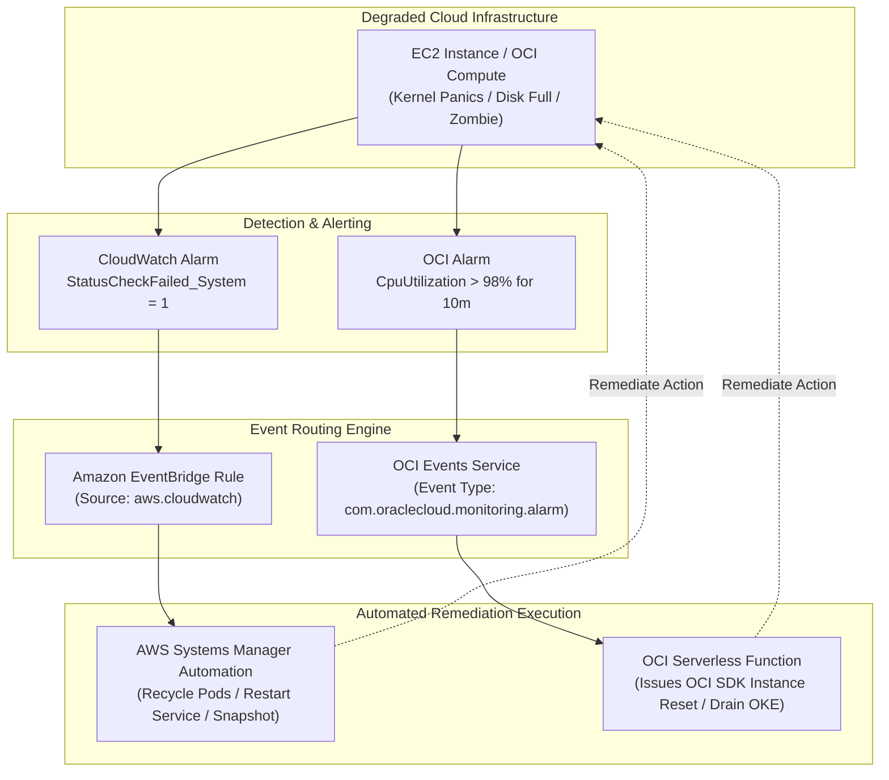
```mermaid
graph TD
    subgraph "Degraded Cloud Infrastructure"
        INST["EC2 Instance / OCI Compute\n(Kernel Panics / Disk Full / Zombie)"]
    end

    subgraph "Detection & Alerting"
        ALARM_AWS["CloudWatch Alarm\nStatusCheckFailed_System = 1"]
        ALARM_OCI["OCI Alarm\nCpuUtilization > 98% for 10m"]
        INST --> ALARM_AWS
        INST --> ALARM_OCI
    end

    subgraph "Event Routing Engine"
        EB["Amazon EventBridge Rule\n(Source: aws.cloudwatch)"]
        OCI_EVT["OCI Events Service\n(Event Type: com.oraclecloud.monitoring.alarm)"]
        ALARM_AWS --> EB
        ALARM_OCI --> OCI_EVT
    end

    subgraph "Automated Remediation Execution"
        SSM["AWS Systems Manager Automation\n(Recycle Pods / Restart Service / Snapshot)"]
        OCI_FN["OCI Serverless Function\n(Issues OCI SDK Instance Reset / Drain OKE)"]
        EB --> SSM
        OCI_EVT --> OCI_FN
        SSM -.->|Remediate Action| INST
        OCI_FN -.->|Remediate Action| INST
    end
```

#### AWS Implementation
Configure an EventBridge rule that intercepts CloudWatch Alarms and triggers an AWS Systems Manager (SSM) Automation Document to restart an application daemon [Doc: EventBridge SSM Automation, checked 2026]:

```json
// eventbridge-rule.json
{
  "source": ["aws.cloudwatch"],
  "detail-type": ["CloudWatch Alarm State Change"],
  "detail": {
    "alarmName": ["AppHealthCritical_Frontend"],
    "state": {
      "value": ["ALARM"]
    }
  }
}
```

```bash
# Step 1: Create EventBridge Rule matching the Alarm state change
aws events put-rule \
  --name "TriggerAppRemediationOnAlarm" \
  --event-pattern file://eventbridge-rule.json \
  --state ENABLED

# Step 2: Add SSM Automation Document as the EventBridge Target
aws events put-targets \
  --rule "TriggerAppRemediationOnAlarm" \
  --targets '[{
    "Id": "SSMRestartTarget",
    "Arn": "arn:aws:ssm:us-east-1:123456789012:automation-definition/AWS-RunShellScript",
    "RoleArn": "arn:aws:iam::123456789012:role/EventBridgeInvokeSSMRole",
    "InputTransformer": {
      "InputPathsMap": {
        "instanceId": "$.detail.configuration.metrics[0].metricStat.metric.dimensions.InstanceId"
      },
      "InputTemplate": "{\"InstanceId\": [\"<instanceId>\"], \"commands\": [\"systemctl restart enterprise-app.service\"]}"
    }
  }]'
```

#### OCI Implementation
Configure an OCI Events rule triggered by compute instance degraded states to invoke an OCI Function that cordons the node and resets the instance [Doc: OCI Events and Functions Remediation, checked 2026]:

```bash
# Step 1: Create an OCI Events Rule for degraded compute instances
cat << 'EOF' > oci-event-rule.json
{
  "compartmentId": "ocid1.compartment.oc1..aaaaaaaam7...",
  "displayName": "RemediateDegradedComputeInstance",
  "description": "Trigger OCI Function when Compute Instance enters degraded or maintenance state",
  "isEnabled": true,
  "condition": "{\"eventType\": [\"com.oraclecloud.computeapi.instance.maintenance.planned\", \"com.oraclecloud.computeapi.instance.statechange\"]}",
  "actions": {
    "actions": [
      {
        "actionType": "FAAS",
        "functionId": "ocid1.fnfunc.oc1.iad.aaaaaaaaremediation...",
        "isEnabled": true
      }
    ]
  }
}
EOF

oci events rule create --from-json file://oci-event-rule.json
```

```python
# OCI Function (Python) executing automated instance soft-reset via Instance Principal
import io
import json
import oci
from fdk import response

def handler(ctx, data: io.BytesIO = None):
    event = json.loads(data.getvalue())
    instance_id = event["data"]["resourceId"]
    
    # Authenticate using OCI Instance Principal
    signer = oci.auth.signers.InstancePrincipalsSecurityTokenSigner()
    compute_client = oci.core.ComputeClient(config={}, signer=signer)
    
    # Execute idempotent Soft Reset
    print(f"Triggering automated soft-reset for degraded instance: {instance_id}")
    compute_client.instance_action(instance_id=instance_id, action="SOFTRESET")
    
    return response.Response(
        ctx, response_data=json.dumps({"status": "SUCCESS", "instance": instance_id}),
        headers={"Content-Type": "application/json"}
    )
```

#### Common Trap
Creating unconstrained automated remediation loops without dead-man circuit breakers. If an underlying database cluster runs out of disk space, all application pods will fail health checks. If an automated remediation script blindly responds by killing and restarting failing pods, the cluster enters an infinite restart cascade: pods consume massive CPU during bootstrap, further thrashing the database and overwhelming the Kubernetes API server until the entire control plane crashes.

#### Follow-up Question
How do you implement distributed state locks (e.g., via DynamoDB conditional writes or OCI Object Storage ETags) in serverless remediation functions to ensure that only one remediation action executes at a time across active-active cloud regions?

---

### Q346: Deep Liveness Probes vs Synthetic Probes: Health Checking Architecture

#### Question
Why do superficial HTTP 200 health checks fail to detect catastrophic application degradation, how do cloud architects design multi-tier health probe hierarchies (Liveness, Readiness, Startup, and Deep Synthetic Probes), and what are the cascading failure risks of cascading dependency checks?

#### Short Answer
Superficial HTTP 200 `/healthz` endpoints frequently pass even when an application is entirely non-functional because they only verify that the web server process is accepting TCP sockets, ignoring database lock contention, thread pool exhaustion, or downstream cache partitions. Robust architectures implement multi-tier probe hierarchies: Kubernetes **Startup Probes** (protecting slow-booting apps), **Liveness Probes** (detecting deadlocks/zombies to trigger container restarts), and **Readiness Probes** (verifying local queue buffers and immediate socket capacity to route traffic). Crucially, **deep downstream dependency checks must NEVER be placed in Liveness or Readiness probes**; doing so causes a single downstream database blip to trigger simultaneous restart cascades across all upstream microservices. Deep validation belongs strictly in external asynchronous **Synthetic Probes**.

#### Deep Answer
Health checks are among the most misunderstood mechanisms in distributed systems. A misconfigured probe can turn a minor $100\text{ms}$ database hiccup into total cluster failure.

**The Health Check Hierarchy**:
1. **Startup Probe**: Runs during initialization. Disables Liveness and Readiness checks until the app successfully loads caches, establishes connection pools, and compiles JIT code. Prevents Kubernetes from prematurely killing slow-starting JVM or machine learning containers.
2. **Liveness Probe**: Asks: *"Is this specific container process deadlocked or zombie?"*
   - Should only evaluate local, in-process invariants (e.g., event loop responsiveness, deadlock detector).
   - If it fails, Kubernetes executes `SIGTERM` / `SIGKILL` and restarts the container.
3. **Readiness Probe**: Asks: *"Can this specific container handle another HTTP/gRPC request right now?"*
   - Evaluates internal thread pool capacity, memory pressure, and local connection health.
   - If it fails, the container is **removed from service endpoints / load balancer target pools**. The container is NOT restarted.
4. **The Cascading Failure Trap (Why Deep Probes in Readiness Kill Systems)**:
   - If Service A's `/ready` probe queries PostgreSQL, Redis, and Service B:
   - When PostgreSQL hits a transient connection spike, Service A's readiness check fails.
   - Kubernetes removes 100% of Service A pods from load balancer endpoints.
   - All client traffic immediately drops to HTTP 503.
   - Worse, if placed in `/liveness`, Kubernetes restarts all 200 pods of Service A simultaneously. When they boot back up, all 200 pods hammer the already-struggling PostgreSQL with 200 new connection spikes, guaranteeing a complete outage.
5. **External Synthetic Probes (The Solution)**:
   - Deep end-to-end user journeys (e.g., login $\rightarrow$ add to cart $\rightarrow$ execute checkout $\rightarrow$ verify DB record) must run out-of-band via **CloudWatch Synthetics Canaries** or **OCI APM Synthetic Monitors**.
   - These probes run from isolated AWS/OCI regions every 1 to 5 minutes, alerting SREs without affecting Kubernetes container lifecycle.

#### Architecture
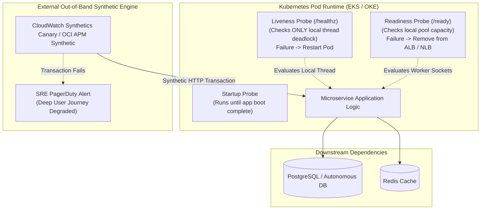
```mermaid
graph TD
    subgraph "Kubernetes Pod Runtime (EKS / OKE)"
        STARTUP["Startup Probe\n(Runs until app boot complete)"]
        LIVENESS["Liveness Probe (/healthz)\n(Checks ONLY local thread deadlock)\nFailure -> Restart Pod"]
        READINESS["Readiness Probe (/ready)\n(Checks local pool capacity)\nFailure -> Remove from ALB / NLB"]
        APP_LOGIC["Microservice Application Logic"]
    end

    subgraph "Downstream Dependencies"
        DB[("PostgreSQL / Autonomous DB")]
        REDIS[("Redis Cache")]
    end

    subgraph "External Out-of-Band Synthetic Engine"
        CWS["CloudWatch Synthetics Canary / OCI APM Synthetic"]
        ALERT["SRE PagerDuty Alert\n(Deep User Journey Degraded)"]
        CWS -->|Synthetic HTTP Transaction| APP_LOGIC
        APP_LOGIC --> DB
        APP_LOGIC --> REDIS
        CWS -.->|Transaction Fails| ALERT
    end

    LIVENESS -.->|Evaluates Local Thread| APP_LOGIC
    READINESS -.->|Evaluates Worker Sockets| APP_LOGIC
```

#### AWS Implementation
Implement layered Kubernetes probes in EKS and deep multi-step canary monitoring using CloudWatch Synthetics [Doc: CloudWatch Synthetics Multi-Step Canaries, checked 2026]:

```yaml
# kubernetes-probes.yaml
apiVersion: apps/v1
kind: Deployment
metadata:
  name: payment-service
spec:
  template:
    spec:
      containers:
      - name: app
        image: 123456789012.dkr.ecr.us-east-1.amazonaws.com/payment:v2.4
        startupProbe:
          httpGet:
            path: /health/startup
            port: 8080
          failureThreshold: 30
          periodSeconds: 5
        livenessProbe:
          httpGet:
            path: /health/liveness  # Verifies only in-memory event loop
            port: 8080
          periodSeconds: 10
          timeoutSeconds: 2
        readinessProbe:
          httpGet:
            path: /health/readiness # Verifies thread pool availability
            port: 8080
          periodSeconds: 5
          timeoutSeconds: 2
```

```python
# CloudWatch Synthetics Deep Canary Script (Python/Selenium)
from aws_synthetics.selenium import synthetics_webdriver as syn_wd
from aws_synthetics.common import synthetics_logger as syn_log

def main():
    browser = syn_wd.Chrome()
    syn_log.info("Executing deep checkout transaction canary...")
    
    browser.get("https://portal.enterprise.com/login")
    browser.find_element_by_id("username").send_keys("synthetic_tester")
    browser.find_element_by_id("password").send_keys("TestPassword123!")
    browser.find_element_by_id("submit-btn").click()
    
    # Assert successful dashboard load and database query resolution
    syn_wd.take_screenshot("dashboard_loaded")
    assert "Active Balance" in browser.page_source

def handler(event, context):
    return main()
```

#### OCI Implementation
Configure Kubernetes probes in OCI OKE and create an OCI APM Synthetic Monitor to test deep end-to-end API workflows [Doc: OCI APM Synthetic Monitoring, checked 2026]:

```bash
# Step 1: Create an OCI APM Synthetic Script (Sidecar JSON / JS Script)
cat << 'EOF' > deep-api-probe.json
{
  "displayName": "DeepDatabaseAndCartSynthetic",
  "monitorType": "SCRIPTED_REST",
  "vantagePoints": ["us-ashburn-1", "eu-frankfurt-1"],
  "repeatIntervalInMin": 5,
  "isRunOnce": false,
  "scriptDetails": {
    "content": "const axios = require('axios');\nasync function test() {\n  const res = await axios.post('https://api.enterprise.com/checkout/validate', {cartId: 'syn-999'});\n  if (res.data.status !== 'APPROVED') throw new Error('Transaction rejected');\n}\ntest();"
  }
}
EOF

# Step 2: Provision Synthetic Monitor in OCI APM Domain
oci apm-synthetics monitor create-scripted-rest-monitor \
  --apm-domain-id ocid1.apmdomain.oc1.iad.aaaaaaaax4... \
  --display-name "DeepSyntheticCheckoutProbe" \
  --repeat-interval-in-min 5 \
  --vantage-points '["us-ashburn-1"]' \
  --script-text "const axios = require('axios'); async function run(){ const r = await axios.get('https://api.enterprise.com/health/deep'); if(r.status!==200) throw new Error(); } run();"
```

#### Common Trap
Including third-party SaaS API dependencies (e.g., Stripe, Twilio, Salesforce) inside internal `/health/readiness` probes. If Stripe experiences an outage, your internal microservices fail readiness checks, dropping off the internal load balancer. Your entire application goes down globally even though 90% of your site's functionality (browsing, account management, content delivery) does not require Stripe.

#### Follow-up Question
How do you implement an "amber" degraded state where a service sheds non-essential background worker tasks and throttles batch processing while keeping user-facing transactional readiness probes green?

---

### Q347: OpenSearch & Log Analytics Engines: Amazon OpenSearch vs OCI Logging Analytics

#### Question
How do cloud enterprises index, correlate, and execute interactive full-text queries across hundreds of terabytes of unstructured log data, and how do Amazon OpenSearch Service (with UltraWarm/Cold storage) and OCI Logging Analytics compare in clustering, machine learning pattern detection, and total cost of ownership?

#### Short Answer
Enterprise full-text log analytics requires distributed search engines that parse semi-structured JSON and syslog formats into inverted indexes. Amazon OpenSearch Service manages distributed Lucene clusters with tiered storage: Hot NVMe nodes, UltraWarm nodes (backed by S3 with local caching), and Cold Storage (detached S3 indexes). OCI Logging Analytics is a fully serverless, zero-infrastructure analytics service that ingests petabytes of logs without managing Lucene shards, master nodes, or index rotation. OCI Logging Analytics natively provides advanced machine learning clustering: it automatically groups millions of diverse log lines into distinct semantic "Log Patterns" and identifies anomalies, outliers, and trend regressions out-of-the-box.

#### Deep Answer
Managing self-hosted or dedicated Elasticsearch/OpenSearch clusters at 100TB+ scale introduces massive administrative overhead: shard allocation, JVM heap garbage collection pauses, split-brain master elections, index rollover policies (ISM), and cluster rebalancing storms during node failures.

**Platform Comparison: Amazon OpenSearch vs OCI Logging Analytics**:

1. **Architecture & Sizing**:
   - **Amazon OpenSearch Service**: Requires provisioning compute instances (Dedicated Master nodes, Data nodes, UltraWarm nodes). Administrators must calculate shard count ($30\text{--}50\text{GB}$ per shard max), JVM heap ($32\text{GB}$ max to preserve Compressed OOPs), and IOPS limits.
   - **OCI Logging Analytics**: Fully serverless and autonomous. No clusters, shards, or JVMs to manage. Automatically scales ingestion and indexing dynamically, abstracting underlying storage and compute entirely [Doc: OCI Logging Analytics Architecture, checked 2026].
2. **Tiered Storage Architecture**:
   - **Amazon OpenSearch UltraWarm & Cold Storage**: Hot tier writes to local NVMe EBS. Index State Management (ISM) migrates older indexes to **UltraWarm** (backed by S3, using warm compute nodes to query S3 directly with SSD read caching) at $\sim 90\%$ lower cost. **Cold Storage** detaches compute completely, allowing petabytes of historical logs to reside in S3 and attaching compute on-demand for queries [Doc: Amazon OpenSearch UltraWarm, checked 2026].
   - **OCI Logging Analytics Lifecycle**: Automatically indexes incoming logs into high-speed search storage. Older partitions are seamlessly archived into OCI Object Storage with automated compaction and purge policies.
3. **Machine Learning & Log Clustering**:
   - **Amazon OpenSearch**: Provides Anomaly Detection plugins based on Random Cut Forest (RCF) algorithms. Requires defining detectors on specific numerical aggregations.
   - **OCI Logging Analytics (Cluster Feature)**: Employs unsupervised machine learning to tokenize log messages, remove variables (IPs, numbers, UUIDs), and cluster millions of log lines into a few dozen representative **Log Signatures / Clusters**. SREs instantly see: *"Out of 10 million log lines, 9.8 million match known patterns, while 3 log signatures are brand new errors that appeared after the 2:00 PM deployment."*

#### Architecture
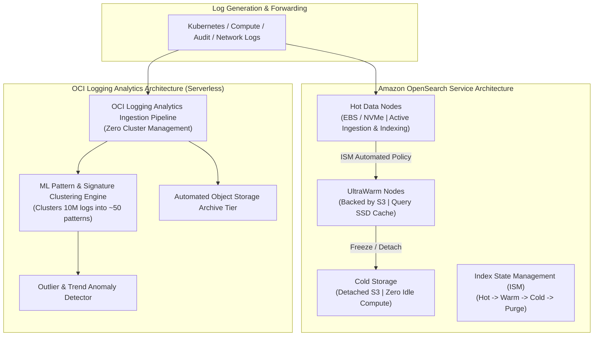
```mermaid
graph TD
    subgraph "Log Generation & Forwarding"
        LOGS["Kubernetes / Compute / Audit / Network Logs"]
    end

    subgraph "Amazon OpenSearch Service Architecture"
        HOT["Hot Data Nodes\n(EBS / NVMe | Active Ingestion & Indexing)"]
        WARM["UltraWarm Nodes\n(Backed by S3 | Query SSD Cache)"]
        COLD["Cold Storage\n(Detached S3 | Zero Idle Compute)"]
        ISM["Index State Management (ISM)\n(Hot -> Warm -> Cold -> Purge)"]
        
        LOGS --> HOT
        HOT -->|ISM Automated Policy| WARM
        WARM -->|Freeze / Detach| COLD
    end

    subgraph "OCI Logging Analytics Architecture (Serverless)"
        OCI_LA_INGEST["OCI Logging Analytics Ingestion Pipeline\n(Zero Cluster Management)"]
        OCI_ML["ML Pattern & Signature Clustering Engine\n(Clusters 10M logs into ~50 patterns)"]
        OCI_OUTLIERS["Outlier & Trend Anomaly Detector"]
        OCI_ARCHIVE["Automated Object Storage Archive Tier"]
        
        LOGS --> OCI_LA_INGEST
        OCI_LA_INGEST --> OCI_ML
        OCI_ML --> OCI_OUTLIERS
        OCI_LA_INGEST --> OCI_ARCHIVE
    end
```

#### AWS Implementation
Configure an OpenSearch Index State Management (ISM) policy to transition indices from Hot to UltraWarm and Cold storage [Doc: OpenSearch ISM Policies, checked 2026]:

```json
// ism-policy.json
{
  "policy": {
    "description": "Lifecycle policy for production application logs",
    "default_state": "hot",
    "states": [
      {
        "name": "hot",
        "actions": [
          { "rollover": { "min_index_age": "7d", "min_primary_shard_size": "40gb" } }
        ],
        "transitions": [{ "state_name": "warm" }]
      },
      {
        "name": "warm",
        "actions": [
          { "warm_migration": {} }
        ],
        "transitions": [{ "state_name": "cold", "conditions": { "min_index_age": "30d" } }]
      },
      {
        "name": "cold",
        "actions": [
          { "cold_migration": { "timestamp_field": "@timestamp" } }
        ],
        "transitions": [{ "state_name": "delete", "conditions": { "min_index_age": "365d" } }]
      },
      {
        "name": "delete",
        "actions": [{ "delete": {} }]
      }
    ]
  }
}
```

```bash
# Upload ISM policy to Amazon OpenSearch domain via curl
curl -XPUT "https://search-prod-logs-abc123.us-east-1.es.amazonaws.com/_plugins/_ism/policies/enterprise_log_policy" \
  -H 'Content-Type: application/json' \
  -d @ism-policy.json
```

#### OCI Implementation
Execute ML-driven log clustering and anomaly identification in OCI Logging Analytics using OCI CLI [Doc: OCI Logging Analytics Cluster Command, checked 2026]:

```bash
# Execute ML Cluster Command to reduce 5,000,000 log records into semantic patterns
oci log-analytics query execute \
  --namespace-name "enterprise-telemetry" \
  --query-text "'Log Source' = 'OCI Kubernetes App' | cluster" \
  --time-filter '{"timeStart": "2026-03-01T00:00:00Z", "timeEnd": "2026-03-01T04:00:00Z"}' \
  --output json > clustered_signatures.json

# Identify anomalous "Outlier" log messages that deviated from normal cluster frequency
oci log-analytics query execute \
  --namespace-name "enterprise-telemetry" \
  --query-text "'Log Source' = 'Linux Secure Logs' | cluster | where 'Outlier' = 1" \
  --time-filter '{"timeStart": "2026-03-01T00:00:00Z", "timeEnd": "2026-03-01T12:00:00Z"}'
```

#### Common Trap
Allocating too many small primary shards in OpenSearch (e.g., creating 10 shards per index for 100MB of daily logs). Every shard consumes JVM heap memory in Lucene cluster metadata. A cluster with 5,000 tiny shards will crash with `OutOfMemoryError` even if total stored data is only 50GB. SREs should target primary shard sizes between $30\text{GB}$ and $50\text{GB}$ and use index rollover policies based on size rather than arbitrary daily calendars.

#### Follow-up Question
How do you perform federated zero-ETL SQL queries joining hot operational OpenSearch logs with historical multi-terabyte parquet log archives stored in Amazon S3 or OCI Object Storage?

---

### Q348: Anomaly Detection & Predictive Machine Learning: CloudWatch vs OCI Anomaly Detection

#### Question
How do cloud platforms replace brittle static alerting thresholds with machine-learning-driven dynamic anomaly detection, and how do Amazon CloudWatch Anomaly Detection and OCI Anomaly Detection Service evaluate seasonality, noise, and structural trend shifts?

#### Short Answer
Static alerting thresholds (e.g., alert if `CPU > 80%` or `Requests < 500`) generate false positives during legitimate traffic surges (Black Friday) and false negatives during off-peak hours (a silent 3:00 AM outage where traffic drops from 500 to 0). Dynamic anomaly detection trains machine learning models on historical metric time-series data. Amazon CloudWatch Anomaly Detection fits supervised and unsupervised models (such as Gaussian process models) over 2-week rolling windows, creating dynamic upper and lower "Expected Value Bands" that adapt to hourly, daily, and weekly seasonality. OCI Anomaly Detection utilizes Oracle's patented Multivariate State Estimation Technique (MSET-2) to detect subtle anomalies across dozens of correlated signals simultaneously, flagging multivariate anomalies before any single metric breaches a threshold.

#### Deep Answer
Traditional threshold alerting breaks down in variable enterprise workloads. If an e-commerce platform receives 50,000 requests/minute at 2:00 PM and 1,000 requests/minute at 4:00 AM, a static low-traffic threshold of 500 requests/minute will not detect an outage that completely halts processing at 2:00 PM until traffic collapses by 99%.

**Anomaly Detection Mathematical Foundations**:
1. **Univariate Time-Series Modeling (CloudWatch Anomaly Detection)**:
   - Models metric behavior as:
     $$y(t) = T(t) + S(t) + \epsilon(t)$$
     where $T(t)$ is trend, $S(t)$ is seasonal periodic patterns (diurnal/weekly), and $\epsilon(t)$ is Gaussian noise.
   - Generates an **expected band** around the predicted metric. The band width is configured using the **Anomaly Detection Threshold** (standard deviation multiplier: 1, 2, or 3) [Doc: CloudWatch Anomaly Detection, checked 2026].
   - Alarms trigger when data points fall outside the band: `ANOMALY_DETECTION_BAND(m1, 2)`.
2. **Multivariate State Estimation (OCI Anomaly Detection / MSET-2)**:
   - Univariate monitoring monitors metrics in isolation. However, in complex systems, severe failures manifest as **cross-metric correlation breakdowns** (e.g., CPU utilization remains normal, but disk write throughput relative to memory allocation deviates from historical multivariate correlation).
   - **MSET-2 (Multivariate State Estimation Technique)**: Projects high-dimensional sensor/metric vectors into a learned subspace. It recognizes non-linear relationships between CPU, network I/O, cache misses, and thread count.
   - Detects structural failures hours before individual univariate thresholds spike [Doc: OCI Anomaly Detection Service, checked 2026].

#### Architecture
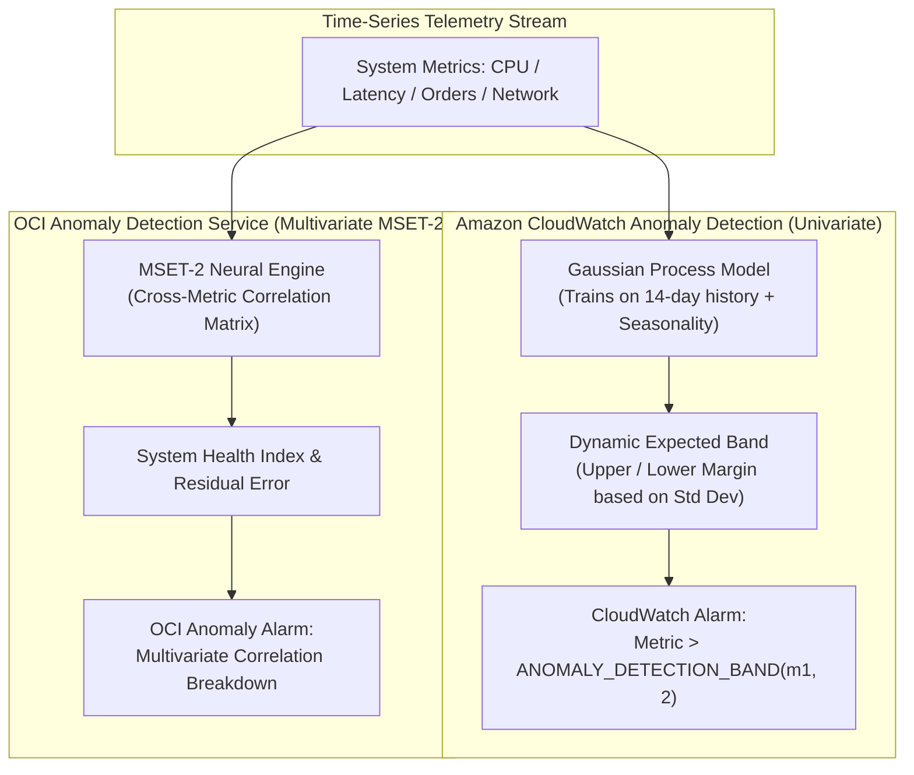
```mermaid
graph TD
    subgraph "Time-Series Telemetry Stream"
        TS["System Metrics: CPU / Latency / Orders / Network"]
    end

    subgraph "Amazon CloudWatch Anomaly Detection (Univariate)"
        CW_MODEL["Gaussian Process Model\n(Trains on 14-day history + Seasonality)"]
        BAND["Dynamic Expected Band\n(Upper / Lower Margin based on Std Dev)"]
        CW_ALARM["CloudWatch Alarm:\nMetric > ANOMALY_DETECTION_BAND(m1, 2)"]
        
        TS --> CW_MODEL
        CW_MODEL --> BAND
        BAND --> CW_ALARM
    end

    subgraph "OCI Anomaly Detection Service (Multivariate MSET-2)"
        MSET["MSET-2 Neural Engine\n(Cross-Metric Correlation Matrix)"]
        HEALTH_IDX["System Health Index & Residual Error"]
        OCI_ALARM["OCI Anomaly Alarm:\nMultivariate Correlation Breakdown"]
        
        TS --> MSET
        MSET --> HEALTH_IDX
        HEALTH_IDX --> OCI_ALARM
    end
```

#### AWS Implementation
Create a CloudWatch Metric Alarm using CloudWatch Anomaly Detection dynamic bands [Doc: CloudWatch Anomaly Detection CLI, checked 2026]:

```bash
# Step 1: Put Anomaly Detector on an Application Load Balancer RequestCount metric
aws cloudwatch put-anomaly-detector \
  --namespace "AWS/ApplicationELB" \
  --metric-name "RequestCount" \
  --dimensions Name=LoadBalancer,Value=app/prod-alb/1234567890abcdef \
  --stat "Sum"

# Step 2: Create Alarm triggering when request count falls BELOW expected lower band
aws cloudwatch put-metric-alarm \
  --alarm-name "ALB-Traffic-Drop-Anomaly" \
  --comparison-operator "LessThanLowerThreshold" \
  --evaluation-periods 3 \
  --datapoints-to-alarm 3 \
  --threshold-metric-id "ad1" \
  --metrics '[
    {
      "Id": "m1",
      "MetricStat": {
        "Metric": {
          "Namespace": "AWS/ApplicationELB",
          "MetricName": "RequestCount",
          "Dimensions": [{ "Name": "LoadBalancer", "Value": "app/prod-alb/1234567890abcdef" }]
        },
        "Period": 300,
        "Stat": "Sum"
      },
      "ReturnData": true
    },
    {
      "Id": "ad1",
      "Expression": "ANOMALY_DETECTION_BAND(m1, 2)",
      "Label": "RequestCount (Expected Band)",
      "ReturnData": true
    }
  ]' \
  --alarm-actions "arn:aws:sns:us-east-1:123456789012:sre-paging-topic"
```

#### OCI Implementation
Train and query an OCI Anomaly Detection multivariate model using OCI CLI [Doc: OCI Anomaly Detection API, checked 2026]:

```bash
# Step 1: Create Anomaly Detection Project
oci anomaly-detection project create \
  --compartment-id ocid1.compartment.oc1..aaaaaaaam7... \
  --display-name "Enterprise-Infrastructure-MSET2-Project"

# Step 2: Create a Trained Model referencing multivariate sensor datasets
cat << 'EOF' > mset-model-config.json
{
  "compartmentId": "ocid1.compartment.oc1..aaaaaaaam7...",
  "projectId": "ocid1.anomalydetectionproject.oc1.iad.aaaaaaaaxample...",
  "displayName": "Fleet-Multivariate-Model",
  "modelTrainingDetails": {
    "modelType": "MSET",
    "targetFap": 0.01,
    "trainingDataset": {
      "datasetType": "ORACLE_OBJECT_STORAGE",
      "namespaceName": "enterprise-telemetry",
      "bucketName": "training-telemetry-data",
      "objectName": "server_telemetry_historical.csv"
    }
  }
}
EOF

oci anomaly-detection model create --from-json file://mset-model-config.json

# Step 3: Run synchronous multi-metric anomaly detection inference
oci anomaly-detection data detect-anomalies \
  --model-id ocid1.anomalydetectionmodel.oc1.iad.aaaaaaaaxample... \
  --request-type "INLINE" \
  --signal-names '["cpu_util", "mem_alloc", "disk_write_iops", "active_connections"]' \
  --data '[{"timestamp": "2026-03-01T12:00:00Z", "values": [45.2, 82.1, 1200.0, 350.0]}]'
```

#### Common Trap
Enabling anomaly detection on newly deployed services that lack historical data or on bursty, low-volume metrics (e.g., an internal admin portal receiving 2 requests an hour). CloudWatch Anomaly Detection requires at least 3 to 14 days of consistent historical data to learn diurnal patterns. On erratic, low-frequency metrics, the algorithm produces excessively wide prediction bands that miss real outages or narrow bands that generate continuous alerting noise.

#### Follow-up Question
How do you programmatically exclude scheduled maintenance windows, marketing flash sales, or regional holidays from historical training datasets to prevent models from learning temporary abnormalities as normal seasonality?

---

### Q349: SLO, SLA, and SLI Engineering: Error Budgets & Burn Rate Alerting

#### Question
How do SRE teams mathematically formulate Service Level Indicators (SLIs), Service Level Objectives (SLOs), and Service Level Agreements (SLAs), and how do Multi-Window Multi-Burn-Rate alerting algorithms in CloudWatch and OCI Monitoring eliminate alert fatigue while safeguarding quarterly Error Budgets?

#### Short Answer
SLIs are quantifiable metrics representing service health (e.g., $\frac{\text{Successful Requests}}{\text{Total Requests}}$); SLOs are target reliability goals agreed upon internally (e.g., $99.9\%$ over 30 days); SLAs are contractual commitments with external customers carrying financial penalties. Modern SRE discards simple threshold alerting in favor of **Multi-Window Multi-Burn-Rate Alerting** (Google SRE standard). A $1\times$ burn rate consumes 100% of the quarterly error budget in exactly the budget period. Burn rate alerting calculates the consumption velocity across two simultaneous time windows (short window: 5 minutes / 1 hour to detect instant catastrophes at $14.4\times$ burn rate; long window: 6 hours / 3 days to detect steady bleeding at $2\times$ burn rate), alerting engineers only when the error budget is genuinely threatened.

#### Deep Answer
Alerting on simple error rates (e.g., "Alert if error rate > 1%") fails because it ignores traffic volume and time: a 1% error rate on 10 requests at 3:00 AM wakes up an on-call engineer for a non-issue, while a 0.5% error rate on 100,000 requests per second will silently wipe out an entire quarterly error budget before anyone notices.

**Mathematical Mechanics of Error Budget & Burn Rate**:
1. **Error Budget Definition**:
   $$\text{Error Budget} = 1 - \text{SLO}$$
   For a $99.9\%$ SLO over a 30-day window ($\approx 43,200\text{ minutes}$):
   $$\text{Allowed Downtime / Errors} = 0.001 \times 43,200\text{ min} = 43.2\text{ minutes}$$
2. **Burn Rate ($B$)**:
   $$\text{Burn Rate } B = \frac{\text{Observed Error Rate}}{\text{Allowed Error Rate (1 - SLO)}}$$
   - $B = 1$: Consumes $100\%$ of budget in 30 days.
   - $B = 14.4$: Consumes $2\%$ of budget in 1 hour (PagerDuty Page to SRE).
   - $B = 6$: Consumes $5\%$ of budget in 6 hours (PagerDuty Page to SRE).
   - $B = 2$: Consumes $10\%$ of budget in 3 days (Ticket/Slack alert to team).
3. **Multi-Window Multi-Burn-Rate Matrix**:
   To prevent false alarms caused by brief 1-minute blips, Google SRE mandates monitoring **two overlapping windows simultaneously**:
   - Both the **Long Window** (e.g., 1 hour) AND the **Short Window** (e.g., 5 minutes) must breach the burn rate threshold before paging.
   - If a spike clears after 3 minutes, the short window resets, instantly suppressing the alarm and preventing alert fatigue.

| Severity | Burn Rate ($B$) | Error Budget Consumed | Long Window | Short Window | Action |
| :--- | :--- | :--- | :--- | :--- | :--- |
| **Page (P1)** | $14.4\times$ | $2\%$ in 1 hour | 1 hour | 5 minutes | Immediate On-Call Page |
| **Page (P2)** | $6\times$ | $5\%$ in 6 hours | 6 hours | 30 minutes | Immediate On-Call Page |
| **Ticket (P3)**| $2\times$ | $10\%$ in 3 days | 3 days | 6 hours | Create JIRA / Slack Notification |

#### Architecture
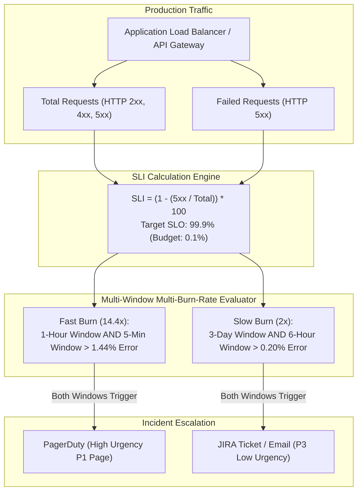
```mermaid
graph TD
    subgraph "Production Traffic"
        ALB["Application Load Balancer / API Gateway"]
        REQ["Total Requests (HTTP 2xx, 4xx, 5xx)"]
        ERR["Failed Requests (HTTP 5xx)"]
        ALB --> REQ
        ALB --> ERR
    end

    subgraph "SLI Calculation Engine"
        SLI["SLI = (1 - (5xx / Total)) * 100\nTarget SLO: 99.9% (Budget: 0.1%)"]
        REQ --> SLI
        ERR --> SLI
    end

    subgraph "Multi-Window Multi-Burn-Rate Evaluator"
        BURN_FAST["Fast Burn (14.4x):\n1-Hour Window AND 5-Min Window > 1.44% Error"]
        BURN_SLOW["Slow Burn (2x):\n3-Day Window AND 6-Hour Window > 0.20% Error"]
        SLI --> BURN_FAST
        SLI --> BURN_SLOW
    end

    subgraph "Incident Escalation"
        PAGER["PagerDuty (High Urgency P1 Page)"]
        TICKET["JIRA Ticket / Email (P3 Low Urgency)"]
        BURN_FAST -->|Both Windows Trigger| PAGER
        BURN_SLOW -->|Both Windows Trigger| TICKET
    end
```

#### AWS Implementation
Implement Multi-Window Burn Rate Alerting using CloudWatch Metric Math and Composite Alarms [Doc: CloudWatch Metric Math and SLOs, checked 2026]:

```bash
# Create 1-Hour Long-Window Burn Rate Alarm (14.4x Burn Rate for 99.9% SLO)
aws cloudwatch put-metric-alarm \
  --alarm-name "SLO-BurnRate-14.4x-LongWindow-1h" \
  --evaluation-periods 1 \
  --comparison-operator "GreaterThanThreshold" \
  --threshold 0.0144 \
  --metrics '[
    {
      "Id": "errors",
      "MetricStat": {
        "Metric": {
          "Namespace": "AWS/ApplicationELB",
          "MetricName": "HTTPCode_Target_5XX_Count",
          "Dimensions": [{ "Name": "LoadBalancer", "Value": "app/prod-alb/1234567890abcdef" }]
        },
        "Period": 3600,
        "Stat": "Sum"
      },
      "ReturnData": false
    },
    {
      "Id": "requests",
      "MetricStat": {
        "Metric": {
          "Namespace": "AWS/ApplicationELB",
          "MetricName": "RequestCount",
          "Dimensions": [{ "Name": "LoadBalancer", "Value": "app/prod-alb/1234567890abcdef" }]
        },
        "Period": 3600,
        "Stat": "Sum"
      },
      "ReturnData": false
    },
    {
      "Id": "burn_rate",
      "Expression": "errors / requests",
      "Label": "1-Hour Error Rate",
      "ReturnData": true
    }
  ]'

# Combine Long-Window and Short-Window into a Composite Alarm to prevent false alarms
aws cloudwatch put-composite-alarm \
  --alarm-name "PAGE-SRE-SLO-Budget-Burning-Fast" \
  --alarm-rule "ALARM(SLO-BurnRate-14.4x-LongWindow-1h) AND ALARM(SLO-BurnRate-14.4x-ShortWindow-5m)" \
  --alarm-actions "arn:aws:sns:us-east-1:123456789012:pagerduty-high-priority"
```

#### OCI Implementation
Implement SLI Error Budget monitoring and burn rate alerting using OCI Monitoring MQL (Monitoring Query Language) [Doc: OCI Monitoring MQL Expressions, checked 2026]:

```bash
# Create Fast-Burn Rate Alarm (14.4x Burn Rate for 99.9% SLO) in OCI Monitoring
cat << 'EOF' > oci-slo-alarm.json
{
  "compartmentId": "ocid1.compartment.oc1..aaaaaaaam7...",
  "displayName": "OCI-LoadBalancer-SLO-BurnRate-Fast",
  "metricCompartmentId": "ocid1.compartment.oc1..aaaaaaaam7...",
  "namespace": "oci_loadbalancer",
  "queryText": "(Http5xx[1h].sum() / TotalRequests[1h].sum()) > 0.0144",
  "severity": "CRITICAL",
  "pendingDuration": "PT5M",
  "body": "SLO Error budget burning at 14.4x velocity. 2% of monthly budget consumed in 1 hour.",
  "destinations": ["ocid1.onstopic.oc1.iad.aaaaaaaapagerduty..."],
  "isEnabled": true
}
EOF

oci monitoring alarm create --from-json file://oci-slo-alarm.json

# Create Slow-Burn Rate Alarm (2x Burn Rate over 3-day trend)
cat << 'EOF' > oci-slo-slowburn.json
{
  "compartmentId": "ocid1.compartment.oc1..aaaaaaaam7...",
  "displayName": "OCI-LoadBalancer-SLO-BurnRate-Slow",
  "metricCompartmentId": "ocid1.compartment.oc1..aaaaaaaam7...",
  "namespace": "oci_loadbalancer",
  "queryText": "(Http5xx[1d].sum() / TotalRequests[1d].sum()) > 0.0020",
  "severity": "WARNING",
  "pendingDuration": "PT30M",
  "destinations": ["ocid1.onstopic.oc1.iad.aaaaaaaaticket..."],
  "isEnabled": true
}
EOF

oci monitoring alarm create --from-json file://oci-slo-slowburn.json
```

#### Common Trap
Defining an SLI based on internal raw process metrics (e.g., container CPU utilization or disk free space) rather than user-perceived outcomes. If CPU reaches 95% but every user request returns HTTP 200 within $50\text{ms}$, the service is healthy and meeting its SLO. Basing SLOs on infrastructure capacity rather than user journey success creates artificial budget burn and fractures trust between development and operations teams.

#### Follow-up Question
How do you handle error budget accounting during planned maintenance windows or upstream third-party cloud outages without unfairly exhausting application teams' development velocity budgets?

---

### Q350: Observability High Availability, Out-of-Band Alerting & Disaster Recovery

#### Question
How do cloud architects ensure that mission-critical observability and alerting systems remain fully operational when primary cloud regions or monitoring backends suffer total catastrophic outages, and how are out-of-band monitoring and external "dead-man switches" implemented across AWS and OCI?

#### Short Answer
Observability architectures must never share failure domains with the workloads they monitor. If an AWS region (e.g., `us-east-1`) or OCI region (`us-ashburn-1`) loses power or control-plane connectivity, in-region CloudWatch or OCI Monitoring alarms fail silently. High-availability observability mandates: (1) **Cross-Region Telemetry Replication**: Mirroring critical telemetry to secondary regions via Kinesis/Service Connector Hub; (2) **Out-of-Band Synthetic Probing**: External third-party monitoring vantage points (Datadog, Catchpoint, independent cloud providers) probing public DNS/endpoints independently of primary VPCs; and (3) **Dead-Man Switches**: Inverted heartbeat alarms that trigger an emergency page if positive "heartbeat ping" signals cease arriving from the primary monitoring infrastructure within expected intervals.

#### Deep Answer
A fundamental axiom of reliability engineering states: **The monitoring plane must be isolated from the workload plane.** If an incident disrupts IAM authentication, VPC networking, or internal DNS, any monitoring agent running inside that same blast radius will be blinded.

**Core Resilience Patterns for Observability**:
1. **Cross-Region Dual-Delivery**:
   - Workload agents (Fluent Bit, Vector, OpenTelemetry Collector) configure multiple pipeline exporters.
   - Traces and logs are sent to primary region (`us-east-1`) and mirrored asynchronously to secondary DR region (`us-west-2` in AWS, `us-phoenix-1` in OCI).
   - If the primary region's CloudWatch Logs or OCI Logging API experiences HTTP 503 throttling, local disk buffers cache events while secondary pipelines continue delivery uninterrupted.
2. **Out-of-Band Architecture**:
   - Synthetic probes and alerting must not traverse internal VPC peered tunnels or direct connects.
   - Traffic routes over the public internet to verify the entire edge path: external Anycast DNS (Route 53 / OCI DNS), CDN edge points of presence (CloudFront / OCI WAF), and origin load balancers.
3. **The Dead-Man's Snitch / Heartbeat Pattern**:
   - How do you detect when your alerting pipeline itself is broken?
   - A dedicated serverless cron job (e.g., Lambda or OCI Function) sends an HTTP ping every 5 minutes to an external service (PagerDuty Dead Man's Snitch, VictorOps, or an independent secondary cloud).
   - If the primary region dies, the heartbeat stops; the external service triggers an emergency out-of-band page: *"Primary Monitoring Plane Unresponsive."*
4. **Disaster Recovery Telemetry Replay**:
   - Long-term log archives stored in Amazon S3 or OCI Object Storage are replicated across regions using S3 Cross-Region Replication (CRR) or OCI Object Storage Cross-Region Replication.
   - In a regional disaster, analytics engines in the secondary region can rehydrate and query historical logs immediately.

#### Architecture
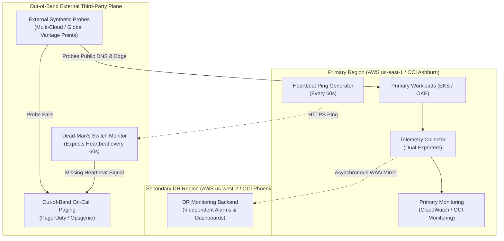
```mermaid
graph TD
    subgraph "Primary Region (AWS us-east-1 / OCI Ashburn)"
        WORKLOAD["Primary Workloads (EKS / OKE)"]
        LOCAL_COL["Telemetry Collector\n(Dual Exporters)"]
        PRIMARY_MON["Primary Monitoring\n(CloudWatch / OCI Monitoring)"]
        HEARTBEAT_CRON["Heartbeat Ping Generator\n(Every 60s)"]
        
        WORKLOAD --> LOCAL_COL
        LOCAL_COL --> PRIMARY_MON
    end

    subgraph "Secondary DR Region (AWS us-west-2 / OCI Phoenix)"
        DR_MON["DR Monitoring Backend\n(Independent Alarms & Dashboards)"]
        LOCAL_COL -.->|Asynchronous WAN Mirror| DR_MON
    end

    subgraph "Out-of-Band External Third-Party Plane"
        EXTERNAL_SYNTH["External Synthetic Probes\n(Multi-Cloud / Global Vantage Points)"]
        DEADMAN["Dead-Man's Switch Monitor\n(Expects Heartbeat every 60s)"]
        PAGER["Out-of-Band On-Call Paging\n(PagerDuty / Opsgenie)"]
        
        HEARTBEAT_CRON -.->|HTTPS Ping| DEADMAN
        DEADMAN -->|Missing Heartbeat Signal| PAGER
        EXTERNAL_SYNTH -->|Probes Public DNS & Edge| WORKLOAD
        EXTERNAL_SYNTH -->|Probe Fails| PAGER
    end
```

#### AWS Implementation
Configure cross-region metric alarm replication and an automated Dead-Man's Switch using AWS Lambda and Amazon Route 53 Health Checks [Doc: Route 53 Health Checks and CloudWatch Cross-Region, checked 2026]:

```bash
# Step 1: Create a Route 53 External Health Check probing the public edge from 8 global regions
aws route53 create-health-check \
  --caller-reference "External-Global-Edge-Probe-2026" \
  --health-check-config '{
    "IPAddress": "198.51.100.25",
    "Port": 443,
    "Type": "HTTPS",
    "ResourcePath": "/health/public",
    "FullyQualifiedDomainName": "portal.enterprise.com",
    "RequestInterval": 10,
    "FailureThreshold": 3,
    "MeasureLatency": true
  }'

# Step 2: Configure Cross-Region CloudWatch Alarm Dashboard in secondary region (us-west-2)
aws cloudwatch put-metric-alarm \
  --region us-west-2 \
  --alarm-name "DR-CrossRegion-PrimaryALB-High5XX" \
  --evaluation-periods 2 \
  --comparison-operator "GreaterThanThreshold" \
  --threshold 50 \
  --metric-name "HTTPCode_Target_5XX_Count" \
  --namespace "AWS/ApplicationELB" \
  --period 60 \
  --statistic "Sum" \
  --dimensions Name=LoadBalancer,Value=app/prod-alb/1234567890abcdef
```

```python
# Lambda Dead-Man Heartbeat Sender (Runs every minute in primary region)
import urllib.request

SNITCH_URL = "https://nosnch.in/c2a3b4d5e6"

def lambda_handler(event, context):
    try:
        req = urllib.request.Request(SNITCH_URL, headers={"User-Agent": "MonitoringHeartbeat/2.0"})
        with urllib.request.urlopen(req, timeout=5) as response:
            return {"status": "Heartbeat sent", "code": response.getcode()}
    except Exception as e:
        print(f"Failed to emit heartbeat: {e}")
        raise e
```

#### OCI Implementation
Configure cross-region logging replication and OCI Health Checks from external edge vantage points [Doc: OCI Health Checks Service, checked 2026]:

```bash
# Step 1: Configure OCI Health Checks probing public endpoints from 10 globally distributed vantage points
oci health-checks http-monitor create \
  --compartment-id ocid1.compartment.oc1..aaaaaaaam7... \
  --display-name "Global-External-Edge-Probe" \
  --protocol "HTTPS" \
  --port 443 \
  --method "GET" \
  --path "/healthz" \
  --interval-in-seconds 30 \
  --timeout-in-seconds 10 \
  --targets '["portal.enterprise.com"]' \
  --vantage-point-names '["aws-us-east-1", "aws-eu-west-1", "oracle-us-ashburn-1", "oracle-ap-tokyo-1"]' \
  --is-enabled true

# Step 2: Configure Cross-Region Service Connector Hub replicating logs from Ashburn to Phoenix
oci sch service-connector create \
  --compartment-id ocid1.compartment.oc1..aaaaaaaam7... \
  --display-name "CrossRegion-LogReplicator-IAD-to-PHX" \
  --source '{"kind": "logging", "logSources": [{"compartmentId": "ocid1.compartment.oc1..aaaaaaaam7...", "logGroupId": "all"}]}' \
  --target '{
    "kind": "objectStorage",
    "bucketName": "dr-phoenix-log-backup",
    "namespace": "enterprise-telemetry"
  }'
```

#### Common Trap
Relying on internal corporate Single Sign-On (SSO) / IdP (e.g., Okta, Azure AD) for on-call engineer access to observability dashboards during a catastrophic network partition. If the identity provider or corporate direct connect link goes down, on-call SREs are locked out of the very monitoring systems needed to diagnose and resolve the outage. Production observability systems must maintain break-glass out-of-band administrative accounts with hardware FIDO2 MFA tokens that do not depend on the primary enterprise IdP.

#### Follow-up Question
How do you architect observability telemetry retention and querying for sovereign cloud deployments (e.g., AWS GovCloud, OCI Dedicated Region Cloud@Customer) where export of any metric, log, or trace metadata outside the sovereign physical boundary is legally prohibited?

---

