# Module 29 — Sub-Phase 29.3: Autoscaling & Capacity Engineering Questions (Q351–Q375)

---

### Q351: EC2 Auto Scaling Groups vs OCI Instance Pools: Architecture, Health Checks & Lifecycles

#### Question
How do cloud compute scaling groups dynamically manage instance fleets across availability domains, what are the differences in health checking mechanics, cooldown periods, and termination policies between AWS EC2 Auto Scaling Groups (ASGs) and OCI Instance Pools?

#### Short Answer
AWS Auto Scaling Groups (ASGs) and OCI Instance Pools both abstract collections of identical compute instances deployed across availability domains or fault domains, maintaining desired capacity and replacing degraded nodes automatically. AWS ASGs rely on **Launch Templates** and offer granular health check sources (EC2 basic hardware checks vs ELB application-level target health), default cooldown periods, and customizable multi-step **Termination Policies** (e.g., `OldestInstance`, `AllocationStrategy`, `OldestLaunchTemplate`). OCI Instance Pools are provisioned from an **Instance Configuration** and utilize **Autoscaling Configurations**, distributing instances across Availability Domains and Fault Domains with built-in health monitoring, scaling cooldowns, and termination policies (e.g., `OLDEST_INSTANCE`, `NEWEST_INSTANCE`).

#### Deep Answer
Compute scaling groups represent the fundamental building block of horizontal elasticity in cloud infrastructure. They decouple instance lifecycle management from direct operator intervention.

**Deep Architectural Comparison**:
1. **Blueprint Model**:
   - **AWS**: Uses **EC2 Launch Templates** (versioned specifications capturing AMI ID, instance type, security groups, EBS mappings, user-data, IAM instance profile, and metadata options). ASGs can reference a specific version, `$Default`, or `$Latest`.
   - **OCI**: Uses **Instance Configurations** (versioned or immutable definitions capturing OS image OCID, shape, flex OCPU/memory ratios, VNIC attachments, cloud-init user-data, and KMS key IDs) attached to an **Instance Pool** [Doc: OCI Instance Pools and Configurations, checked 2026].
2. **Health Check Evaluation**:
   - **AWS ASG**: Supports two distinct health checks:
     - `EC2`: Evaluates hypervisor hardware and instance reachability (`StatusCheckFailed_System`, `StatusCheckFailed_Instance`).
     - `ELB`: When enabled, the ASG marks an instance unhealthy if the Elastic Load Balancer target group reports it failing HTTP/TCP health checks, even if the VM's OS and hypervisor are 100% operational.
   - **OCI Instance Pool**: Monitors compute instance lifecycle state (`RUNNING`, `STOPPING`, `TERMINATED`). When attached to an OCI Load Balancer backend set, the backend health status (`OK`, `WARNING`, `CRITICAL`) directly drives instance pool health replacement if configured [Doc: OCI Load Balancer Health and Instance Pools, checked 2026].
3. **Cooldowns & Warmup Timers**:
   - **Cooldown Period**: A configurable time window (e.g., 300 seconds) after a scaling activity completes, during which the scaling engine blocks additional scale-out or scale-in activities. This prevents thrashing caused by lag in metric aggregation.
   - **Default Instance Warmup**: AWS allows configuring instance warmup times, ensuring instances contribute to CloudWatch metrics before the ASG calculates capacity metrics.
4. **Termination Policies & AZ Balancing**:
   - When an ASG scales in, it must choose which instance to terminate. AWS first selects the Availability Zone with the most instances. Within that AZ, it evaluates the termination policy (e.g., `OldestLaunchConfiguration`, `ClosestToNextInstanceHour`, `AllocationStrategy`).
   - OCI similarly balances instances across Availability Domains (ADs) and Fault Domains (FDs: FD1, FD2, FD3), and applies instance termination policies (`OLDEST_INSTANCE`, `NEWEST_INSTANCE`) to ensure uniform fault-domain distribution.

#### Architecture
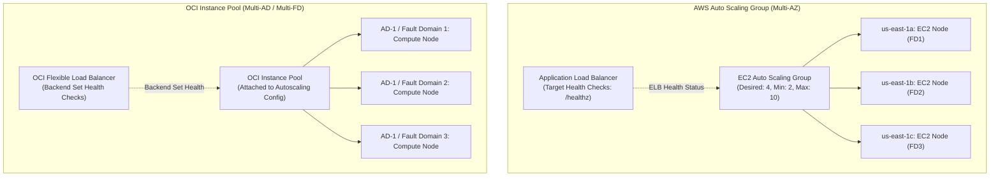

#### AWS Implementation
Create an EC2 Auto Scaling Group referencing an EC2 Launch Template with ELB health checks and customized termination policies [Doc: AWS EC2 Auto Scaling CLI, checked 2026]:

```bash
# Create an EC2 Auto Scaling Group with ELB health checks and 300s cooldown
aws autoscaling create-auto-scaling-group \
  --auto-scaling-group-name "prod-app-asg" \
  --launch-template "LaunchTemplateName=prod-web-template,Version=$Latest" \
  --min-size 2 \
  --max-size 12 \
  --desired-capacity 4 \
  --default-cooldown 300 \
  --health-check-type "ELB" \
  --health-check-grace-period 300 \
  --vpc-zone-identifier "subnet-0a1b2c3d4e,subnet-0f1e2d3c4b,subnet-0c9b8a7f6e" \
  --target-group-arns "arn:aws:elasticloadbalancing:us-east-1:123456789012:targetgroup/prod-tg/73e2d6f2424" \
  --termination-policies "OldestLaunchTemplate" "OldestInstance" "Default"
```

#### OCI Implementation
Create an OCI Instance Configuration, provision an Instance Pool across Fault Domains, and attach an Autoscaling Configuration [Doc: OCI CLI Instance Pools, checked 2026]:

```bash
# Step 1: Create an Instance Configuration from a JSON specification
cat << 'EOF' > instance-config.json
{
  "compartmentId": "ocid1.compartment.oc1..aaaaaaaam7...",
  "displayName": "prod-app-instance-config",
  "instanceDetails": {
    "instanceType": "compute",
    "launchDetails": {
      "compartmentId": "ocid1.compartment.oc1..aaaaaaaam7...",
      "shape": "VM.Standard.E5.Flex",
      "shapeConfig": { "ocpus": 4, "memoryInGBs": 32 },
      "sourceDetails": {
        "sourceType": "image",
        "imageId": "ocid1.image.oc1.iad.aaaaaaaaxample..."
      }
    }
  }
}
EOF

oci compute-management instance-configuration create --from-json file://instance-config.json

# Step 2: Create Instance Pool distributed across 3 Fault Domains
cat << 'EOF' > pool-placement.json
[
  {
    "availabilityDomain": "UwhS:US-ASHBURN-AD-1",
    "primarySubnetId": "ocid1.subnet.oc1.iad.aaaaaaaasubnet1...",
    "faultDomains": ["FAULT-DOMAIN-1", "FAULT-DOMAIN-2", "FAULT-DOMAIN-3"]
  }
]
EOF

oci compute-management instance-pool create \
  --compartment-id ocid1.compartment.oc1..aaaaaaaam7... \
  --instance-configuration-id ocid1.instanceconfig.oc1.iad.aaaaaaaaxample... \
  --size 4 \
  --placement-configurations file://pool-placement.json \
  --display-name "prod-app-instance-pool"
```

#### Common Trap
Configuring `health-check-type: EC2` on an AWS ASG attached to an Application Load Balancer instead of `ELB`. If an application crashes, deadlocks, or returns HTTP 500 on all routes, the EC2 hypervisor status checks remain green. The ASG will believe the fleet is healthy and take zero corrective action, leaving 100% of end-user requests failing behind the ALB. Always specify `health-check-type: ELB` with a sufficiently generous `health-check-grace-period` (e.g., 300s) to allow applications to initialize completely before health evaluation begins.

#### Follow-up Question
How do you configure ASG scale-in protection (`SetInstanceProtection`) during background batch processing to prevent the scaling engine from terminating a node mid-way through a 30-minute computational job?

---

### Q352: Scaling Policies: Target Tracking vs Step Scaling vs Scheduled Scaling

#### Question
How do cloud architects select between Target Tracking, Step Scaling, Simple Scaling, and Scheduled Scaling policies for mission-critical enterprise workloads, and how do AWS and OCI execute scaling evaluation logic, metric aggregation, and hysteresis deadbands?

#### Short Answer
Scaling policies determine *when* and *how many* instances are added or removed in response to changing load. **Target Tracking** functions like a home thermostat: operators specify an optimal metric target (e.g., average CPU at 60% or ALB Request Count Per Target at 1,000), and the cloud provider automatically creates dynamic CloudWatch/OCI alarms and calculates exact instance additions or removals. **Step Scaling** provides explicit multi-tier response curves based on threshold breaches (e.g., add +2 instances if CPU is 70–85%, add +5 instances if CPU > 85%) without cooldown lockouts. **Scheduled Scaling** triggers deterministic capacity adjustments ahead of predictable business events (e.g., scaling out at 8:00 AM on weekdays).

#### Deep Answer
Selecting the wrong scaling policy causes either slow scale-out (resulting in request queuing and timeouts) or aggressive scale-in (causing thrashing and premature connection termination).

**Comprehensive Breakdown of Scaling Policy Types**:

1. **Target Tracking Scaling**:
   - *Operational Model*: Proportional controller. CloudWatch or OCI Monitoring continuously calculates:
     $$\text{New Capacity} = \text{Current Capacity} \times \left(\frac{\text{Current Metric Value}}{\text{Target Metric Value}}\right)$$
   - *Hysteresis Deadband*: To prevent continuous flapping when the metric hovers near the target (e.g., 60.5% vs 60%), target tracking implements an internal deadband margin. Scale-in is intentionally dampened and delayed compared to scale-out.
   - *Best Suited For*: General web applications, REST APIs, and microservices where load scales proportionally with traffic or CPU.
2. **Step Scaling**:
   - *Operational Model*: Stepwise lookup table. When an alarm triggers, Step Scaling evaluates the magnitude of the breach:
     - $70\% \le \text{CPU} < 80\% \rightarrow \text{Add } 20\% \text{ capacity}$
     - $80\% \le \text{CPU} < 90\% \rightarrow \text{Add } 50\% \text{ capacity}$
     - $\text{CPU} \ge 90\% \rightarrow \text{Add } 100\% \text{ capacity (Emergency Burst)}$
   - *Key Advantage over Simple Scaling*: Step Scaling has **no cooldown lockout** during scale-out. If load continues surging while new instances are warming up, another step triggers immediately.
3. **Scheduled Scaling**:
   - *Operational Model*: Time-based cron trigger.
   - *Use Case*: Eliminates reactive lag for completely predictable traffic patterns (e.g., morning logon storms at 8:45 AM, batch payroll processing every Friday at 11:00 PM).
4. **Platform Equivalents**:
   - **AWS**: Native `TargetTrackingScaling`, `StepScaling`, `SimpleScaling`, and `ScheduledActions` in EC2 Auto Scaling.
   - **OCI**: OCI Autoscaling Configurations support **Threshold-based (Metrics)** scaling (defining Scale-Out and Scale-In rules with metric operators: `CPU_UTILIZATION`, `MEMORY_UTILIZATION`) and **Schedule-based** scaling (using standard 5-field cron syntax) [Doc: OCI Autoscaling Policies, checked 2026].

#### Architecture
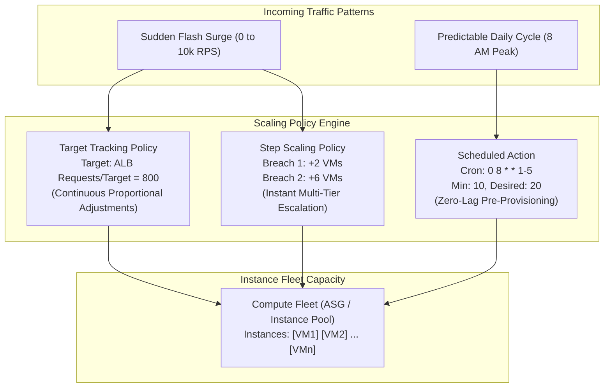

#### AWS Implementation
Configure a Target Tracking Scaling Policy targeting ALB Request Count Per Target, combined with a Scheduled Scaling Action [Doc: AWS Auto Scaling Policies CLI, checked 2026]:

```bash
# Step 1: Create Target Tracking Policy for ALB Request Count Per Target
aws autoscaling put-scaling-policy \
  --auto-scaling-group-name "prod-app-asg" \
  --policy-name "alb-requests-target-tracking" \
  --policy-type "TargetTrackingScaling" \
  --target-tracking-configuration '{
    "PredefinedMetricSpecification": {
      "PredefinedMetricType": "ALBRequestCountPerTarget",
      "ResourceLabel": "app/prod-alb/1234567890abcdef/targetgroup/prod-tg/73e2d6f2424"
    },
    "TargetValue": 1000.0,
    "DisableScaleIn": false
  }'

# Step 2: Configure Scheduled Action for Morning Peak (Every weekday at 08:00 UTC)
aws autoscaling put-scheduled-update-group-action \
  --auto-scaling-group-name "prod-app-asg" \
  --scheduled-action-name "MorningPeakScaleOut" \
  --recurrence "0 8 * * 1-5" \
  --min-size 8 \
  --desired-capacity 12 \
  --time-zone "America/New_York"
```

#### OCI Implementation
Create an OCI Autoscaling Configuration combining metric-based threshold scaling with cron-based scheduled execution [Doc: OCI Autoscaling CLI, checked 2026]:

```bash
# Create Autoscaling Configuration with Metric-based Rule and Schedule
cat << 'EOF' > autoscaling-config.json
{
  "compartmentId": "ocid1.compartment.oc1..aaaaaaaam7...",
  "displayName": "prod-app-autoscaling-policy",
  "resource": {
    "type": "instancePool",
    "id": "ocid1.instancepool.oc1.iad.aaaaaaaaxample..."
  },
  "policies": [
    {
      "policyType": "threshold",
      "displayName": "cpu-threshold-scaling",
      "capacity": { "min": 2, "max": 16, "initial": 4 },
      "rules": [
        {
          "displayName": "scale-out-rule",
          "action": { "type": "CHANGE_COUNT_BY", "value": 2 },
          "metric": {
            "metricType": "CPU_UTILIZATION",
            "threshold": { "operator": "GT", "value": 75 }
          }
        },
        {
          "displayName": "scale-in-rule",
          "action": { "type": "CHANGE_COUNT_BY", "value": -1 },
          "metric": {
            "metricType": "CPU_UTILIZATION",
            "threshold": { "operator": "LT", "value": 30 }
          }
        }
      ],
      "coolDownInSeconds": 300
    },
    {
      "policyType": "scheduled",
      "displayName": "business-hours-scale-up",
      "capacity": { "min": 8, "max": 20, "initial": 10 },
      "executionSchedule": {
        "type": "cron",
        "expression": "0 8 * * 1-5",
        "timezone": "UTC"
      }
    }
  ],
  "isEnabled": true
}
EOF

oci autoscaling configuration create --from-json file://autoscaling-config.json
```

#### Common Trap
Using raw instance CPU utilization as the sole metric for Target Tracking in I/O-bound or memory-bound services. If an application's bottleneck is relational database connection pool exhaustion or downstream HTTP latency, CPU utilization remains low ($15\text{--}25\%$) while client request queues back up and latency spikes to seconds. In these systems, scaling on `ALBRequestCountPerTarget`, Active Connections, or SQS/Streaming queue backlog is mandatory.

#### Follow-up Question
How does the mathematical calculation of Target Tracking adjust when disabling scale-in (`DisableScaleIn: true`), and why is this pattern recommended when pairing Target Tracking with aggressive Step Scaling?

---

### Q353: Predictive Scaling & Machine Learning: CloudWatch Predictive vs OCI Scheduled Capacity

#### Question
How do predictive scaling algorithms forecast compute capacity requirements hours ahead of actual traffic spikes, how do AWS CloudWatch Predictive Scaling models evaluate historical seasonality vs reactive scaling, and what are OCI's architectural patterns for proactive capacity provisioning?

#### Short Answer
Reactive autoscaling is inherently lagging: by the time an alarm triggers and new virtual machines boot, initialize runtimes, and warm up caches ($3\text{--}8\text{ minutes}$), users experience latency spikes or dropped connections. **AWS Predictive Scaling** uses machine learning to analyze up to 14 days of historical CloudWatch metric data, forecast traffic patterns 48 hours into the future, and schedule scaling actions ahead of time so new instances are already warmed up when the surge arrives. OCI achieves proactive scaling by combining **Scheduled Autoscaling Policies** (using precise cron expressions for known periodic schedules) with **OCI Data Science / OCI AI** predictive pipelines that compute forecasted capacity and update Instance Pool desired capacity via OCI APIs.

#### Deep Answer
The primary limitation of reactive autoscaling is the **Initialization Lag**:
$$\text{Total Time to Serve} = T_{\text{detection}} + T_{\text{launch}} + T_{\text{boot}} + T_{\text{cloud-init}} + T_{\text{warmup}}$$
In enterprise JVM or container applications, this window frequently reaches 5 to 10 minutes. During sudden morning traffic ramps (e.g., an insurance portal opening at 8:00 AM), reactive scaling trails the traffic curve, causing sustained CPU saturation and HTTP 504 gateway timeouts.

**Predictive Scaling Mechanics (AWS)**:
1. **Model Training**: CloudWatch analyzes 14 days of historical data for load metrics (e.g., `ALBRequestCount` or CPU utilization). It trains two machine learning models:
   - *Linear Model*: Fits baseline growth and long-term trend lines.
   - *Periodic (Fourier) Model*: Captures repeating diurnal (daily) and weekly cycles.
2. **Forecast Generation**: Generates a 48-hour forward-looking forecast updated every 24 hours.
3. **Capacity Scheduling**: Translates forecasted load into required instance counts using the target value formula:
   $$\text{Predicted Capacity} = \frac{\text{Forecasted Load}}{\text{Target Value}}$$
4. **Scaling Modes**:
   - `ForecastAndScale`: Automatically adjusts the ASG minimum/desired capacity ahead of the forecast.
   - `ForecastOnly`: Generates the predictive graph in CloudWatch without applying changes, allowing SREs to evaluate model accuracy against actual load before enabling automated execution [Doc: AWS Predictive Scaling, checked 2026].
5. **OCI Proactive Capacity Architecture**:
   - OCI natively supports **Scheduled Autoscaling Configurations** for repeating business schedules.
   - For algorithmic prediction, enterprise architects deploy an OCI Data Science notebook or automated pipeline: it reads historical OCI Monitoring metrics from Object Storage, runs Facebook Prophet or ARIMA forecasting models, and invokes the OCI Compute API (`oci compute-management instance-pool update --size <predicted_size>`) 15 minutes before the predicted surge [Doc: OCI Predictive Capacity Orchestration, checked 2026].

#### Architecture
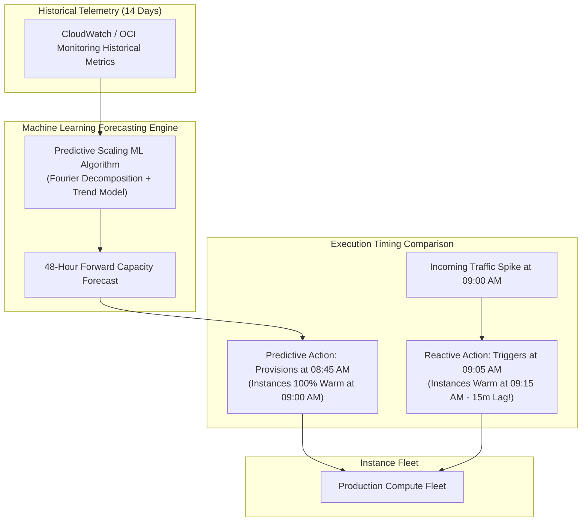

#### AWS Implementation
Configure Predictive Scaling on an existing Auto Scaling Group using the AWS CLI [Doc: AWS Auto Scaling Predictive Scaling Policy, checked 2026]:

```json
// predictive-policy.json
{
  "MetricSpecifications": [
    {
      "TargetValue": 100.0,
      "PredefinedMetricPairSpecification": {
        "PredefinedMetricPairType": "ALBRequestCount",
        "ResourceLabel": "app/prod-alb/1234567890abcdef/targetgroup/prod-tg/73e2d6f2424"
      }
    }
  ],
  "Mode": "ForecastAndScale",
  "SchedulingBufferTime": 300,
  "MaxCapacityBreachBehavior": "HonorMaxCapacity"
}
```

```bash
# Attach the predictive scaling policy to the Auto Scaling Group
aws autoscaling put-scaling-policy \
  --auto-scaling-group-name "prod-app-asg" \
  --policy-name "predictive-alb-scaling-policy" \
  --policy-type "PredictiveScaling" \
  --predictive-scaling-configuration file://predictive-policy.json
```

#### OCI Implementation
Implement an automated predictive scaling scheduler using OCI CLI and Scheduled Autoscaling Policies [Doc: OCI Scheduled Autoscaling, checked 2026]:

```bash
# Create a Multi-Schedule Autoscaling Policy in OCI for predictable weekly ramps
cat << 'EOF' > oci-predictive-schedule.json
{
  "compartmentId": "ocid1.compartment.oc1..aaaaaaaam7...",
  "displayName": "Weekly-Predictive-Ramp-Policy",
  "resource": {
    "type": "instancePool",
    "id": "ocid1.instancepool.oc1.iad.aaaaaaaaxample..."
  },
  "policies": [
    {
      "policyType": "scheduled",
      "displayName": "Pre-warm-Morning-Logon-Storm",
      "capacity": { "min": 12, "max": 30, "initial": 16 },
      "executionSchedule": {
        "type": "cron",
        "expression": "45 7 * * 1-5",
        "timezone": "America/New_York"
      }
    },
    {
      "policyType": "scheduled",
      "displayName": "Evening-Ramp-Down",
      "capacity": { "min": 4, "max": 10, "initial": 4 },
      "executionSchedule": {
        "type": "cron",
        "expression": "0 19 * * 1-5",
        "timezone": "America/New_York"
      }
    }
  ],
  "isEnabled": true
}
EOF

oci autoscaling configuration create --from-json file://oci-predictive-schedule.json
```

#### Common Trap
Relying solely on predictive scaling during unexpected one-off events (e.g., breaking news, viral social media campaigns, or cyber attacks). Because machine learning models train on historical recurring patterns, an unprecedented traffic spike will not appear in the forecast. If reactive target tracking or step scaling is disabled, the system will not scale out at all during the surprise spike. Enterprise best practice mandates pairing Predictive Scaling with reactive Target Tracking to catch unpredicted anomalies.

#### Follow-up Question
How does the `SchedulingBufferTime` parameter in AWS Predictive Scaling interact with EC2 launch warmup times, and what happens if instances require 15 minutes to compile JIT code and warm caches?

---

### Q354: Kubernetes Workload Autoscaling: Horizontal (HPA) vs Vertical (VPA) vs Multidimensional

#### Question
How do cloud Kubernetes operators architect Horizontal Pod Autoscalers (HPA) and Vertical Pod Autoscalers (VPA) to scale microservices elastically, and why does running HPA and VPA simultaneously on the same metric (such as CPU or Memory) create catastrophic feedback loops and pod eviction storms?

#### Short Answer
**Horizontal Pod Autoscaler (HPA)** scales the number of pod replicas up or down based on observed CPU/memory utilization or custom/external metrics (e.g., Prometheus metrics or SQS queue depth). **Vertical Pod Autoscaler (VPA)** adjusts the CPU and memory `requests` and `limits` of containers in-place (or by restarting pods), optimizing resource allocation and preventing OOMKills. Running HPA and VPA concurrently on the **same metric** causes conflicting control loops: as load increases, HPA attempts to add replicas while VPA attempts to resize existing pods; when load stabilizes, both scale down simultaneously, causing pod oscillation and eviction cascades. SREs resolve this by segregating metrics (e.g., HPA scales on custom request rates while VPA optimizes memory requests).

#### Deep Answer
Kubernetes resource management operates on two orthogonal axes: replica count (horizontal) and resource sizing (vertical).

**1. Horizontal Pod Autoscaler (HPA) v2 Mechanics**:
- The HPA control loop runs inside `kube-controller-manager` every 15 seconds (configurable via `--horizontal-pod-autoscaler-sync-period`).
- Calculates desired replicas using the ratio formula:
  $$\text{Desired Replicas} = \left\lceil \text{Current Replicas} \times \left( \frac{\text{Current Metric Value}}{\text{Desired Metric Value}} \right) \right\rceil$$
- Supports `Resource` metrics (metrics-server), `Custom` metrics (Prometheus via Kube Metrics Adapter), and `External` metrics (AWS CloudWatch or OCI Monitoring metrics) [Doc: Kubernetes HPA v2 Specification, checked 2026].
- **HPA Behavior Controls**: Allows fine-grained stabilization windows (e.g., scale out immediately, scale in with a 300-second stabilization window) and rate-limiting policies (`maxReplicasPerMinute`).

**2. Vertical Pod Autoscaler (VPA) Mechanics**:
- Composed of three components: **Recommender** (analyzes historical usage and OOM events), **Updater** (evicts pods whose resource requests deviate from recommendations), and **Admission Controller** (intercepts pod creation and applies recommended CPU/memory requests).
- Modes: `Off` (recommendation only), `Initial` (applies recommendations only on pod creation), `Recreate` (evicts pods to update resources), `InPlaceOrRecreate` (Kubernetes 1.27+ in-place pod resizing without eviction).

**3. The HPA + VPA Conflict Dilemma**:
- If both HPA and VPA monitor CPU utilization:
  1. A traffic spike causes pod CPU to jump from 50% to 90%.
  2. HPA detects breach ($90\% > 70\%$) and schedules $+5$ replicas.
  3. Simultaneously, VPA detects high CPU and updates the deployment spec with $2\times$ CPU requests, evicting running pods.
  4. The newly launched HPA pods boot, distributing traffic; individual pod CPU drops to 30%.
  5. HPA now detects underutilization and terminates pods.
  6. Simultaneously, VPA detects low CPU and reduces CPU requests, triggering another round of evictions.
  7. Result: Severe service disruption and flapping.
- **Architectural Solution (Multidimensional Scaling)**:
  - Configure HPA to scale replicas based on **Custom/External Application Metrics** (e.g., HTTP requests per second, active connections, or message queue depth).
  - Configure VPA in `Recommender` or `Initial` mode to optimize **Memory and Baseline CPU requests**, ensuring the two controllers never share the same input telemetry.

#### Architecture
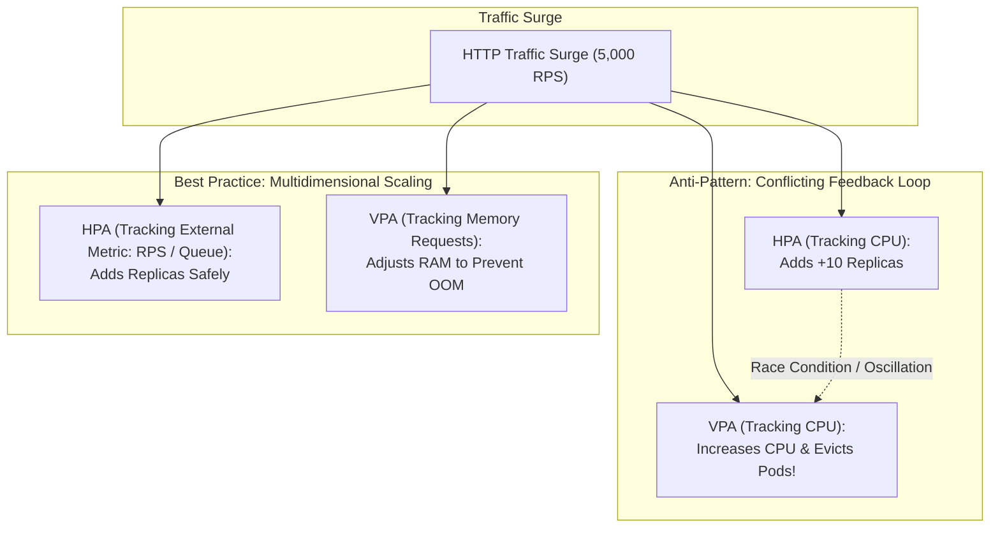

#### AWS Implementation
Deploy HPA v2 with custom behavior stabilization windows and integrate with the CloudWatch Metric Adapter on Amazon EKS [Doc: AWS EKS Autoscaling HPA, checked 2026]:

```yaml
# hpa-v2-production.yaml
apiVersion: autoscaling/v2
kind: HorizontalPodAutoscaler
metadata:
  name: payment-service-hpa
  namespace: production
spec:
  scaleTargetRef:
    apiVersion: apps/v1
    kind: Deployment
    name: payment-service
  minReplicas: 3
  maxReplicas: 30
  metrics:
  - type: Resource
    resource:
      name: cpu
      target:
        type: Utilization
        averageUtilization: 70
  - type: External
    external:
      metric:
        name: sqs_queue_depth
        selector:
          matchLabels:
            queue_name: payment_orders_queue
      target:
        type: AverageValue
        averageValue: 50
  behavior:
    scaleUp:
      stabilizationWindowSeconds: 0 # Immediate scale up
      policies:
      - type: Percent
        value: 100
        periodSeconds: 15
    scaleDown:
      stabilizationWindowSeconds: 300 # 5-minute cooldown before scaling in
      policies:
      - type: Percent
        value: 10
        periodSeconds: 60
```

#### OCI Implementation
Deploy Horizontal Pod Autoscaling on Oracle Container Engine for Kubernetes (OKE) and configure Vertical Pod Autoscaler in recommendation mode [Doc: OCI OKE Autoscaling, checked 2026]:

```yaml
# vpa-recommender-oke.yaml
apiVersion: autoscaling.k8s.io/v1
kind: VerticalPodAutoscaler
metadata:
  name: payment-service-vpa
  namespace: production
spec:
  targetRef:
    apiVersion: "apps/v1"
    kind:       Deployment
    name:       payment-service
  updatePolicy:
    updateMode: "Off" # Recommender mode only: prevents pod eviction storms
  resourcePolicy:
    containerPolicies:
      - containerName: '*'
        minAllowed:
          cpu: 250m
          memory: 512Mi
        maxAllowed:
          cpu: 4000m
          memory: 16Gi
        controlledResources: ["cpu", "memory"]
```

```bash
# View VPA resource sizing recommendations on OKE via kubectl
kubectl get vpa payment-service-vpa -n production -o yaml
```

#### Common Trap
Configuring HPA without defining container `resources.requests` in the Kubernetes pod spec. HPA calculates percentage CPU utilization against the container's **CPU Request**, *not* its limit and *not* node capacity. If `resources.requests.cpu` is omitted, the HPA controller cannot calculate utilization, reporting `<unknown>` and failing to scale replicas regardless of incoming traffic.

#### Follow-up Question
How does Kubernetes 1.27+ in-place resource resizing (`resizePolicy`) alter the trade-offs between HPA and VPA by eliminating the requirement to terminate and recreate pods when updating CPU and memory allocations?

---

### Q355: Next-Generation Kubernetes Cluster Autoscaling: Karpenter vs OKE Virtual Nodes

#### Question
How do next-generation Kubernetes node autoscalers bypass the structural limitations of the legacy Kubernetes Cluster Autoscaler, and how do Karpenter on AWS EKS and Virtual Nodes on OCI Container Engine for Kubernetes (OKE) compare in bin-packing efficiency, node launch latency, and heterogeneous compute provisioning?

#### Short Answer
The legacy Kubernetes Cluster Autoscaler (CAS) is tightly coupled to cloud provider VM scaling groups (ASGs/Instance Pools), requiring node groups to be homogenous and scaling in coarse $+1$ VM increments with $3\text{--}7\text{ minute}$ launch latencies. **Karpenter** (open-source node autoscaler incubated by AWS) operates group-lessly: it evaluates unschedulable pods directly against cloud capacity APIs, selects the optimal instance types, sizes, and pricing models (Spot vs On-Demand) matching exact pod resource requests, and boots instances in parallel within $30\text{--}60\text{ seconds}$ with automated bin-packing consolidation. **OCI OKE Virtual Nodes** provides a fully serverless, node-less Kubernetes architecture: pods run inside isolated microVMs managed entirely by Oracle's hypervisors, eliminating EC2/Compute instance management, cluster node upgrades, and node autoscaler tuning.

#### Deep Answer
For years, the standard Kubernetes autoscaler was the `cluster-autoscaler` (CAS). While functional, CAS has severe architectural flaws in dynamic cloud environments:
1. **Node Group Proliferation**: CAS requires pre-configuring Auto Scaling Groups for every instance type, architecture (x86 vs ARM64 Graviton), AZ, and purchasing model (Spot vs On-Demand). A cluster requiring diverse shapes easily requires 30+ distinct ASGs.
2. **Slow Simulation & Scheduling**: CAS simulates scheduling on every control-loop cycle. When a pod is pending, it scans all ASGs, picks an ASG, increments desired capacity, and waits for the cloud hypervisor to provision, boot the OS, install the kubelet, and join the cluster.

**Karpenter (AWS Next-Gen Autoscaling Architecture)**:
- **Group-less Node Provisioning**: Karpenter bypasses Auto Scaling Groups completely, making direct `ec2:RunInstances` fleet API calls.
- **Just-In-Time Instance Sizing**: When 10 pending pods request varying CPU/RAM, Karpenter aggregates their requests and selects the cheapest EC2 instance shape capable of bin-packing all 10 pods simultaneously (e.g., picking an `m6g.xlarge` instead of launching three `t3.medium` instances).
- **Consolidation & Drift Detection**: When pods finish or cluster utilization drops, Karpenter dynamically cordons, drains, and replaces underutilized nodes with smaller instances or terminates them entirely, slashing cloud waste by $30\text{--}50\%$ [Doc: Karpenter on AWS EKS, checked 2026].

**OCI OKE Virtual Nodes (Serverless Pod Architecture)**:
- **Node-less Kubernetes**: Eliminates the concept of worker node pools entirely.
- **MicroVM Security Boundary**: Every pod runs inside its own dedicated hardware-virtualized hypervisor microVM, providing hardware-level isolation for multi-tenant workloads.
- **Zero Capacity Planning**: SREs never configure node autoscalers, instance configurations, or node pool sizes. When a pod is scheduled, OKE provisions the microVM compute resources instantaneously. Billing is calculated per second strictly on allocated pod OCPU and memory [Doc: OCI OKE Virtual Nodes, checked 2026].

| Architectural Dimension | Legacy Cluster Autoscaler (CAS) | Karpenter (AWS EKS) | OCI OKE Virtual Nodes |
| :--- | :--- | :--- | :--- |
| **Abstraction Level** | Node Group / ASG / Pool | NodePool / Direct EC2 API | Serverless MicroVM (No Nodes) |
| **Node Launch Speed** | 3 to 7 minutes | 30 to 60 seconds | Instantaneous pod provisioning |
| **Heterogeneous Sizing** | Requires pre-defined ASGs | Completely dynamic shape choice | Per-pod OCPU/RAM allocation |
| **Node Maintenance** | Manual AMI rolling updates | Automated node drift / AMI update | 100% managed by OCI control plane |
| **Consolidation** | Basic scale-down if idle | Active bin-packing consolidation | Built-in (pay only for pod run time) |

#### Architecture
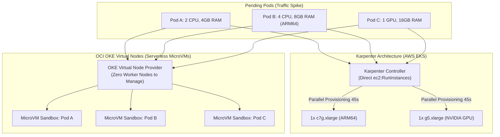

#### AWS Implementation
Deploy a Karpenter `NodePool` and `EC2NodeClass` on an Amazon EKS cluster [Doc: Karpenter Configuration Specification, checked 2026]:

```yaml
# karpenter-nodepool.yaml
apiVersion: karpenter.sh/v1beta1
kind: NodePool
metadata:
  name: default
spec:
  template:
    spec:
      requirements:
        - key: "karpenter.k8s.aws/instance-category"
          operator: In
          values: ["c", "m", "r"]
        - key: "kubernetes.io/arch"
          operator: In
          values: ["arm64", "amd64"]
        - key: "karpenter.sh/capacity-type"
          operator: In
          values: ["spot", "on-demand"]
      nodeClassRef:
        apiVersion: karpenter.k8s.aws/v1beta1
        kind: EC2NodeClass
        name: default
  limits:
    cpu: "1000"
    memory: 1000Gi
  disruption:
    consolidationPolicy: WhenUnderutilized
    consolidateAfter: 30s
---
apiVersion: karpenter.k8s.aws/v1beta1
kind: EC2NodeClass
metadata:
  name: default
spec:
  amiFamily: AL2023
  role: "KarpenterNodeRole-prod-eks"
  subnetSelectorTerms:
    - tags:
        karpenter.sh/discovery: "prod-eks-us-east-1"
  securityGroupSelectorTerms:
    - tags:
        karpenter.sh/discovery: "prod-eks-us-east-1"
```

#### OCI Implementation
Provision an OKE Cluster with Virtual Node Pools using OCI CLI [Doc: OCI OKE Virtual Nodes Creation, checked 2026]:

```bash
# Create an OKE Cluster enabled for Virtual Nodes
oci ce cluster create \
  --compartment-id ocid1.compartment.oc1..aaaaaaaam7... \
  --name "prod-oke-virtual-cluster" \
  --vcn-id ocid1.vcn.oc1.iad.aaaaaaaaxample... \
  --kubernetes-version "v1.30.1" \
  --cluster-type "ENHANCED_CLUSTER"

# Create a Virtual Node Pool (Serverless MicroVMs for Pods)
oci ce virtual-node-pool create \
  --cluster-id ocid1.cluster.oc1.iad.aaaaaaaaxample... \
  --compartment-id ocid1.compartment.oc1..aaaaaaaam7... \
  --display-name "serverless-pod-pool" \
  --placement-configurations '[{
    "availabilityDomain": "UwhS:US-ASHBURN-AD-1",
    "subnetId": "ocid1.subnet.oc1.iad.aaaaaaaapods..."
  }]' \
  --size 10 \
  --taints '[{"key": "virtual-node.oracle.com/oke", "value": "true", "effect": "NoSchedule"}]'
```

#### Common Trap
Enabling aggressive node consolidation in Karpenter (`consolidationPolicy: WhenUnderutilized`) without configuring Kubernetes **Pod Disruption Budgets (PDBs)**. When Karpenter detects an opportunity to replace a large instance with a cheaper one, it immediately drains and evicts pods. If an application lacks a PDB specifying `minAvailable: 1` or `maxUnavailable: 1`, Karpenter can evict all replicas of a critical service simultaneously, causing momentary production outages during quiet traffic periods.

#### Follow-up Question
How does Karpenter calculate the price-capacity-optimized score when provisioning Spot instances across dozens of EC2 shapes to minimize the probability of Spot interruptions?

---

### Q356: Pre-Warmed Compute Pools & Rolling Fleet Updates: Warm Pools vs Rolling Recycles

#### Question
How do cloud platforms eliminate cold-start VM boot times during sudden traffic spikes, and how do EC2 Auto Scaling Warm Pools compare to OCI Instance Pool rolling updates and configuration recycles?

#### Short Answer
Standard EC2 and Compute VM boots require 3 to 8 minutes to pull OS kernels, mount volumes, run initialization scripts (`user-data`), and warm runtime caches. **AWS Auto Scaling Warm Pools** maintain a cache of pre-initialized EC2 instances in a `Stopped` (EBS-only billing) or `Running` state within the ASG. When scale-out occurs, instances transition from `Stopped` to `InService` in under 30 seconds. In OCI, rolling fleet updates and zero-downtime AMI migrations are orchestrated via **OCI Instance Pool Rolling Updates**: when an Instance Configuration is updated, OCI applies configurable batch recycling (`CYCLIC` or `ROLLING`), spinning up new instances, verifying load balancer health, and cleanly draining old nodes without dropping user traffic.

#### Deep Answer
For latency-sensitive enterprise applications (e.g., high-frequency trading gateways or real-time bidding engines), waiting minutes for an autoscaling group to launch and initialize a virtual machine is unacceptable.

**1. AWS EC2 Auto Scaling Warm Pools**:
- **Lifecycle Architecture**: An ASG is paired with a secondary pool of instances that sit behind the active fleet.
- **Instance States**:
  - `Stopped`: The VM boots, executes cloud-init user-data scripts, completes application initialization, and is then placed in a stopped state. You pay only for EBS storage; compute vCPU and memory charges are zero. Launch time: $\approx 30\text{--}45\text{ seconds}$ [Doc: AWS Auto Scaling Warm Pools, checked 2026].
  - `Running`: The VM remains powered on in the warm pool, ideal for applications requiring continuously warm in-memory data structures. Launch time: $\approx 10\text{--}15\text{ seconds}$.
  - `Hibernated`: RAM contents are written to an encrypted EBS root volume; instance resumes instantly with preserved memory state.
- **Scale-In to Warm Pool**: When the ASG scales in, instead of terminating the instance, it can recycle it back into the warm pool, avoiding re-initialization on subsequent scale-outs.

**2. OCI Instance Pool Rolling Updates & Recycles**:
- In OCI, when security patches, kernel updates, or application releases require updating the fleet:
  1. An operator creates a new **Instance Configuration** (e.g., version 2 with updated Oracle Linux 9 image or new application artifact).
  2. The Instance Pool is updated with the new configuration OCID.
  3. The operator initiates an **Instance Pool Rolling Recycle**:
     - **Batch Sizing**: Specifies the percentage of the fleet to recycle simultaneously (e.g., 25%).
     - **Health Verification**: OCI launches replacement instances in the target Fault Domains, attaches them to the OCI Load Balancer backend set, waits for the health check to return `OK`, and then issues graceful termination commands to the older instances [Doc: OCI Instance Pool Rolling Update, checked 2026].

#### Architecture
```mermaid
graph TD
    subgraph "AWS EC2 Auto Scaling with Warm Pool"
        ACTIVE_ASG["Active In-Service Fleet\n(Serving Production Traffic)"]
        WARM_POOL["Warm Pool (State: Stopped / Hibernated)\n(Zero vCPU Billing | Initialized user-data)"]
        SURGE["Surge Event\n(Traffic Spikes 300%)"]
        
        SURGE -->|Instant Scale-Out| ACTIVE_ASG
        WARM_POOL -.->|Warmed VM to In-Service in <30s| ACTIVE_ASG
        ACTIVE_ASG -.->|Scale-In Recycle| WARM_POOL
    end

    subgraph "OCI Instance Pool Rolling Recycle"
        CONF_V1["Instance Config v1 (Current)"]
        CONF_V2["Instance Config v2 (Patched AMI)"]
        POOL_OCI["OCI Instance Pool (10 VMs)"]
        LB_OCI["OCI Load Balancer Backend Set"]
        
        CONF_V2 -->|Update Pool Config| POOL_OCI
        POOL_OCI -->|Batch 1 (25%): Launch new VMs| LB_OCI
        LB_OCI -->|Health Check OK| POOL_OCI
        POOL_OCI -->|Drain & Terminate Old VMs| CONF_V1
    end
```

#### AWS Implementation
Configure an EC2 Auto Scaling Group with a Warm Pool in `Stopped` state and initiate an automated Instance Refresh [Doc: AWS Warm Pools CLI, checked 2026]:

```bash
# Step 1: Put Warm Pool on Auto Scaling Group
aws autoscaling put-warm-pool \
  --auto-scaling-group-name "prod-app-asg" \
  --max-group-prepared-capacity 6 \
  --min-size 2 \
  --pool-state "Stopped" \
  --instance-reuse-policy '{"ReuseOnScaleIn": true}'

# Step 2: Start an Instance Refresh to update the fleet with a new Launch Template version
aws autoscaling start-instance-refresh \
  --auto-scaling-group-name "prod-app-asg" \
  --strategy "Rolling" \
  --preferences '{
    "MinHealthyPercentage": 80,
    "InstanceWarmup": 180,
    "CheckpointDelay": 3600,
    "AutoRollback": true
  }'
```

#### OCI Implementation
Update an OCI Instance Pool with a new Instance Configuration and execute a zero-downtime rolling update [Doc: OCI Instance Pool Recycle CLI, checked 2026]:

```bash
# Step 1: Attach new Instance Configuration to existing Instance Pool
oci compute-management instance-pool update \
  --instance-pool-id ocid1.instancepool.oc1.iad.aaaaaaaaxample... \
  --instance-configuration-id ocid1.instanceconfig.oc1.iad.aaaaaaaav2...

# Step 2: Trigger Rolling Instance Pool Recycle across Fault Domains
oci compute-management instance-pool-recycle \
  --instance-pool-id ocid1.instancepool.oc1.iad.aaaaaaaaxample... \
  --batch-percentage 25 \
  --graceful-shutdown-timeout-in-seconds 300
```

#### Common Trap
Configuring warm pools for applications that bind to ephemeral IP addresses or register unique hostnames with external identity providers during cloud-init. If an instance completes cloud-init, acquires a private IP, registers with a service discovery registry, and is then placed into a `Stopped` state, external clients attempt to route requests to a stopped VM. When the VM starts up later, AWS may reassign its internal network metadata, causing host registration mismatches. Lifecycle hooks must be configured to register with registries only upon transitioning from `Warmed:Pending:Wait` to `InService`.

#### Follow-up Question
How do Auto Scaling Lifecycle Hooks (`autoscaling:EC2_INSTANCE_LAUNCHING` and `autoscaling:EC2_INSTANCE_TERMINATING`) integrate with Amazon EventBridge to execute custom health verification before placing instances in-service?

---

### Q357: Spot Instances & Preemptible VMs: Allocation Strategies & Capacity Pools

#### Question
How do enterprise cloud architectures achieve 70–90% compute cost reductions using AWS Spot Instances and OCI Preemptible Instances without jeopardizing workload availability, and how do capacity-optimized allocation strategies and pool diversification eliminate correlated preemption risks?

#### Short Answer
Spot Instances (AWS) and Preemptible Instances (OCI) sell spare cloud hypervisor capacity at steep discounts (up to 90% off On-Demand rates) with the condition that the cloud provider can reclaim the instance with a **2-minute notification** when on-demand demand surges. Stateless, horizontally scalable, or fault-tolerant batch workloads survive interruptions by implementing **Fleet Diversification**: spreading requests across dozens of distinct capacity pools (different instance families, sizes, generations, and availability zones). AWS Auto Scaling enforces this via the **price-capacity-optimized** allocation strategy, which provisions instances from pools with the lowest historical interruption frequency. OCI Preemptible Instances provide fixed ~50% savings across bare-metal and flexible VM shapes, distributed across Availability and Fault Domains.

#### Deep Answer
Running production workloads on Spot/Preemptible compute requires treating instances as ephemeral disposable assets. Relying on a single instance type (e.g., only requesting `m5.large` Spot in `us-east-1a`) is an anti-pattern: when that specific hardware pool runs out of capacity, 100% of your Spot instances can be reclaimed simultaneously, triggering a complete outage.

**Capacity Pool Diversification Principles**:
1. **Definition of a Capacity Pool**:
   - A distinct pool is defined by the unique tuple: `(Instance Type, OS, Availability Zone/Domain)`.
   - `m5.large` in `us-east-1a` is a completely separate capacity pool from `m5.large` in `us-east-1b`, and separate from `m5a.large` (AMD) or `m6g.large` (Graviton ARM) in the same AZ.
2. **AWS Spot Allocation Strategies**:
   - `price-capacity-optimized` (Recommended): Analyzes both real-time spare capacity depth and price, selecting instance pools that have the lowest likelihood of interruption while still providing maximum discounts [Doc: AWS EC2 Spot Best Practices, checked 2026].
   - `capacity-optimized`: Allocates solely based on spare pool depth, prioritizing longevity over marginal price differences.
   - `lowest-price`: Allocates across the $N$ cheapest pools. Warning: Lowest price pools are often the most constrained, leading to frequent interruptions.
3. **OCI Preemptible Instances**:
   - Available for all standard VM shapes (including Flexible E3, E4, E5 shapes) and Bare Metal instances.
   - Preemption is based on real-time Oracle Cloud infrastructure demand.
   - Charges are billed at roughly 50% discount compared to On-Demand rates, with billing rounded to the second [Doc: OCI Preemptible Instances, checked 2026].
4. **Mixed-Base Architecture**:
   - Enterprise ASGs maintain a stable baseline of On-Demand instances (e.g., 20% On-Demand for core traffic) and scale the remaining 80% dynamically using diversified Spot/Preemptible instances.

#### Architecture
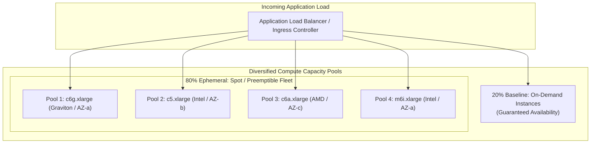

#### AWS Implementation
Configure an Auto Scaling Group with Mixed Instances Policy combining On-Demand baseline with price-capacity-optimized Spot diversification [Doc: AWS ASG Mixed Instances CLI, checked 2026]:

```bash
aws autoscaling create-auto-scaling-group \
  --auto-scaling-group-name "prod-diversified-spot-asg" \
  --min-size 4 \
  --max-size 30 \
  --desired-capacity 10 \
  --mixed-instances-policy '{
    "LaunchTemplate": {
      "LaunchTemplateSpecification": {
        "LaunchTemplateName": "prod-app-template",
        "Version": "$Latest"
      },
      "Overrides": [
        {"InstanceType": "c6g.xlarge"},
        {"InstanceType": "c6a.xlarge"},
        {"InstanceType": "c5.xlarge"},
        {"InstanceType": "m6g.xlarge"},
        {"InstanceType": "m5.xlarge"}
      ]
    },
    "InstancesDistribution": {
      "OnDemandBaseCapacity": 2,
      "OnDemandPercentageAboveBaseCapacity": 20,
      "SpotAllocationStrategy": "price-capacity-optimized"
    }
  }' \
  --vpc-zone-identifier "subnet-0a1b2c3d4e,subnet-0f1e2d3c4b,subnet-0c9b8a7f6e"
```

#### OCI Implementation
Launch an OCI Compute Instance as a Preemptible VM using OCI CLI [Doc: OCI Preemptible Instances CLI, checked 2026]:

```bash
# Launch a Preemptible Flex Instance using OCI CLI
oci compute instance launch \
  --compartment-id ocid1.compartment.oc1..aaaaaaaam7... \
  --availability-domain "UwhS:US-ASHBURN-AD-1" \
  --shape "VM.Standard.E5.Flex" \
  --shape-config '{"ocpus": 4, "memoryInGBs": 32}' \
  --display-name "preemptible-worker-01" \
  --image-id ocid1.image.oc1.iad.aaaaaaaaxample... \
  --subnet-id ocid1.subnet.oc1.iad.aaaaaaaasubnet... \
  --preemptible-instance-config '{
    "preemptionAction": {
      "type": "TERMINATE",
      "preserveBootVolume": false
    }
  }'
```

#### Common Trap
Deploying single-instance stateful workloads (e.g., primary relational databases, Kafka controller nodes, or local in-memory caches) on Spot or Preemptible instances without distributed data replication. When capacity is reclaimed, the instance is terminated with only 2 minutes notice; if data is not replicated across independent nodes, transactions fail, and data stored on non-persistent ephemeral NVMe drives is permanently lost.

#### Follow-up Question
How does AWS EC2 Capacity Rebalancing (`CapacityRebalance: true`) leverage Machine Learning to initiate proactive instance replacement *before* the formal two-minute Spot interruption notice is issued?

---

### Q358: Spot Interruption Handling: 2-Minute Notices & Graceful Workload Draining

#### Question
What sequence of operational events occurs when a cloud provider issues an instance preemption notice, and how do automated termination listeners, Kubernetes node drainers, and message broker re-queuing mechanisms prevent dropped transactions within the 2-minute termination window?

#### Short Answer
When AWS or OCI reclaims a Spot or Preemptible instance, the hypervisor emits an out-of-band **2-Minute Interruption Notice** accessible via the local Instance Metadata Service (IMDS) and cloud event buses (Amazon EventBridge or OCI Events). Applications must execute an automated 4-stage graceful drain: (1) **Detection**: Local metadata pollers or EventBridge rules detect the interruption notice within seconds; (2) **Deregistration**: The node issues deregistration calls to the Application Load Balancer / Target Group to stop receiving new HTTP requests; (3) **Drain & Cordon**: Kubernetes nodes execute `kubectl cordon` (blocking new pods) and `kubectl drain` (sending `SIGTERM` to existing pods); (4) **State Flush**: Applications complete inflight requests, commit database transactions, re-queue unacknowledged SQS/Kafka messages, and flush logs before the hypervisor executes hard `SIGKILL` at 120 seconds.

#### Deep Answer
The difference between a resilient spot architecture and a fragile one lies in the deterministic execution of the 120-second preemption lifecycle.

**The 120-Second Interruption Timeline**:
1. **$T=0\text{ seconds}$ (Notice Emitted)**:
   - AWS generates the `EC2 Spot Instance Interruption Warning` event in Amazon EventBridge and exposes `/latest/meta-data/spot/instance-action` in IMDS.
   - OCI sets the instance lifecycle status to `TERMINATING` and posts a preemption notification event to the OCI Events Service and local metadata at `http://169.254.169.254/opc/v2/instance/preemptiveEvent` [Doc: OCI Preemptible Metadata Notice, checked 2026].
2. **$T=5\text{ seconds}$ (Load Balancer Deregistration & Kubernetes Cordon)**:
   - AWS Node Termination Handler (NTH) or Karpenter intercepts the notice.
   - Executes `kubectl cordon <node>` to mark node unschedulable.
   - ELB target group connection draining (deregistration delay) begins: existing TCP connections remain open to finish responses, but all new HTTP requests are routed to other healthy nodes.
3. **$T=15\text{ seconds}$ (Pod Termination & SIGTERM)**:
   - Kubernetes issues `SIGTERM` to container entrypoints.
   - Applications must implement a graceful shutdown signal handler:
     - Web servers stop listening on ports.
     - Message queue consumers (SQS, Kafka, Celery) stop polling for new messages.
     - Inflight database transactions complete.
     - Unfinished message payloads are returned to the message queue (e.g., resetting SQS visibility timeout to 0 or omitting Kafka commit).
4. **$T=110\text{ seconds}$ (Final State Flush & Cleanup)**:
   - OpenTelemetry collectors and logging agents flush in-memory telemetry buffers to S3 or CloudWatch.
5. **$T=120\text{ seconds}$ (Hypervisor Termination)**:
   - Cloud hypervisor sends ACPI shutdown / hardware power-off. Any process still running is abruptly killed with `SIGKILL`.

#### Architecture
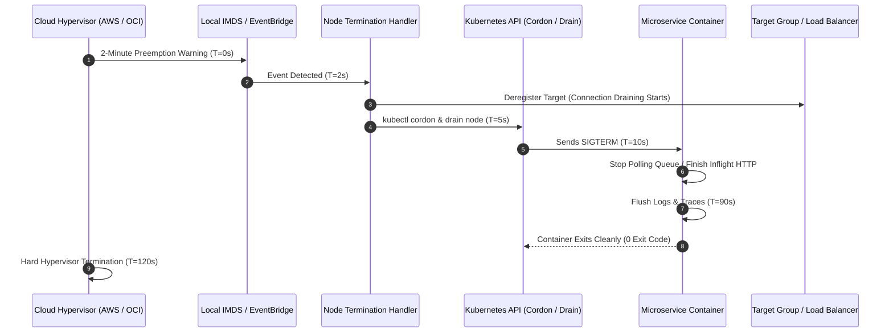

#### AWS Implementation
Deploy the AWS Node Termination Handler (NTH) in Queue Processor mode using Amazon EventBridge and SQS to intercept Spot terminations cluster-wide [Doc: AWS Node Termination Handler Guide, checked 2026]:

```bash
# Helm deployment of AWS Node Termination Handler (EventBridge Mode)
helm repo add eks https://aws.github.io/eks-charts
helm upgrade --install aws-node-termination-handler eks/aws-node-termination-handler \
  --namespace kube-system \
  --set enableSpotInterruptionDraining=true \
  --set enableRebalanceMonitoring=true \
  --set enableScheduledEventDraining=true \
  --set queueURL="https://sqs.us-east-1.amazonaws.com/123456789012/nth-spot-interruption-queue" \
  --set checkASGPathValidation=true
```

```python
# Application SIGTERM Graceful Shutdown Handler in Python
import signal
import sys
import time

shutdown_requested = False

def sigterm_handler(signum, frame):
    global shutdown_requested
    print("Received SIGTERM from Kubernetes! Initiating graceful 90s drain...")
    shutdown_requested = True
    # Stop consuming from queue, finish active orders, flush logs
    drain_inflight_transactions()
    sys.exit(0)

signal.signal(signal.SIGTERM, sigterm_handler)

def drain_inflight_transactions():
    print("Finishing active transactional writes to PostgreSQL...")
    time.sleep(5)
    print("Flushed telemetry. Safe to terminate.")
```

#### OCI Implementation
Automate Preemptible Instance draining on OCI OKE using OCI Events and an automated draining script polling OCI Metadata [Doc: OCI Preemptible Termination Handling, checked 2026]:

```bash
# Shell daemon running on OCI Compute Instance polling IMDS for Preemption
cat << 'EOF' > /usr/local/bin/oci-preemption-listener.sh
#!/bin/bash
while true; do
  STATUS_CODE=$(curl -s -o /dev/null -w "%{http_code}" -H "Authorization: Bearer Oracle" http://169.254.169.254/opc/v2/instance/preemptiveEvent)
  if [ "$STATUS_CODE" -eq 200 ]; then
    echo "OCI Preemption Notice Detected! Commencing graceful Kubernetes node drain..."
    NODE_NAME=$(hostname)
    kubectl --kubeconfig /etc/kubernetes/kubeconfig cordon "$NODE_NAME"
    kubectl --kubeconfig /etc/kubernetes/kubeconfig drain "$NODE_NAME" --ignore-daemonsets --delete-emptydir-data --grace-period=90
    exit 0
  fi
  sleep 5
done
EOF

chmod +x /usr/local/bin/oci-preemption-listener.sh
```

#### Common Trap
Setting Kubernetes `terminationGracePeriodSeconds` to a value higher than 120 seconds (e.g., 180s) on Spot or Preemptible worker nodes. Kubernetes will permit containers up to 180 seconds to finish before sending `SIGKILL`; however, the underlying cloud hypervisor will unconditionally pull power at exactly 120 seconds. Any state flush scheduled between second 121 and 180 will be violently interrupted by hardware power cutoff. For Spot nodes, `terminationGracePeriodSeconds` should be set to 90 seconds max.

#### Follow-up Question
How do message brokers (e.g., Amazon SQS, RabbitMQ, OCI Streaming) guarantee "at-least-once" delivery during unexpected node terminations when an application worker dies before executing an explicit message acknowledgment (`ack`)?

---

### Q359: Load Balancer Capacity & Pre-Warming: AWS ALB LCUs vs OCI Flexible Load Balancer

#### Question
How do cloud Application Load Balancers scale their underlying proxy fleets to handle massive sudden traffic surges (e.g., ticket drops, flash sales), why do AWS Application Load Balancers (ALBs) require manual "Pre-Warming" tickets, and how does OCI's Flexible Load Balancer dynamic bandwidth shape model contrast with AWS Load Balancer Capacity Units (LCUs)?

#### Short Answer
AWS Application Load Balancers (ALBs) scale their internal proxy nodes reactively using DNS round-robin across multiple IP addresses. When traffic spikes faster than the automated scale-up rate (e.g., jumping from 500 to 100,000 requests/sec in under 5 minutes), ALBs drop packets or return HTTP 502/504 errors unless AWS Support manually "pre-warms" the ALB ahead of time. Capacity is billed based on **Load Balancer Capacity Units (LCUs)** (evaluating new connections, active connections, bandwidth, and rule evaluations). In contrast, OCI provides the **Flexible Load Balancer**: operators select an explicit minimum and maximum bandwidth shape (from 10 Mbps up to 8,000 Mbps). The load balancer instantly guarantees the minimum provisioned throughput with zero pre-warming tickets, while dynamically autoscaling up to the maximum bandwidth ceiling as traffic demands.

#### Deep Answer
Load balancers are not infinite black-box routers; they are distributed software reverse proxies running on virtual machines or specialized bare-metal network appliances.

**1. AWS Application Load Balancer (ALB) Scaling Mechanics**:
- **DNS-Based Scaling**: An ALB's hostname resolves to multiple IP addresses (typically 2 to 8) distributed across Availability Zones. As traffic grows, AWS automatically provisions additional proxy compute nodes and updates Route 53 DNS records with new IPs.
- **The Flash Surge Failure Mode**: If traffic surges instantaneously ($10\times\text{--}100\times$ within 60 seconds), DNS caching (TTL 60s) prevents immediate traffic redistribution, and existing proxy nodes exhaust their file descriptors, ephemeral ports, and CPU, returning HTTP 502/504 or dropping SYN packets.
- **AWS Pre-Warming**: For scheduled flash events (e.g., Black Friday, Super Bowl ads), enterprise customers must open an AWS Support ticket at least 48 hours in advance, providing expected traffic curves (expected requests/second, average request/response size, SSL cipher mix, percentage of keep-alives) so AWS engineers can manually provision proxy capacity in advance [Doc: AWS ALB Pre-Warming Guide, checked 2026].
- **Billing Dimensions (LCU)**: 1 LCU is defined as the highest consumption among:
  - 25 new connections/sec.
  - 3,000 active connections/min.
  - 1 GB processed bytes/hour.
  - 1,000 rule evaluations/sec.

**2. OCI Flexible Load Balancer Architecture**:
- **Dynamic Bandwidth Shapes**: Unlike rigid legacy shapes (100 Mbps, 400 Mbps, 8 Gbps), OCI Flexible Load Balancers allow setting a **Min Bandwidth** and a **Max Bandwidth** (e.g., Min: 100 Mbps, Max: 2,000 Mbps) [Doc: OCI Flexible Load Balancer Specification, checked 2026].
- **Instant Headroom**: The **Min Bandwidth** is pre-allocated and guaranteed by the OCI network substrate instantly—no support tickets required.
- **Dynamic Autoscaling**: If traffic surges, the load balancer automatically scales its bandwidth allocation up to the Max Bandwidth limit within seconds without dropping connections or altering public IP addresses.

| Architectural Dimension | AWS Application Load Balancer (ALB) | OCI Flexible Load Balancer |
| :--- | :--- | :--- |
| **Scaling Mechanism** | Automatic DNS IP expansion (Reactive) | Dynamic bandwidth shape allocation (Active) |
| **Instant Burst Headroom** | Must file AWS Support Pre-Warming Ticket | Operator sets Min Bandwidth (Guaranteed instantly) |
| **Public IP Stability** | Dynamic pool of ephemeral IPs across AZs | Static Anycast / Regional Public IP pair |
| **Capacity Metric** | Load Balancer Capacity Units (LCU) | Provisioned Min/Max Bandwidth (Mbps) |
| **Protocol Support** | HTTP/1.1, HTTP/2, gRPC, WebSocket | HTTP/1.1, HTTP/2, gRPC, TCP, WebSocket |

#### Architecture
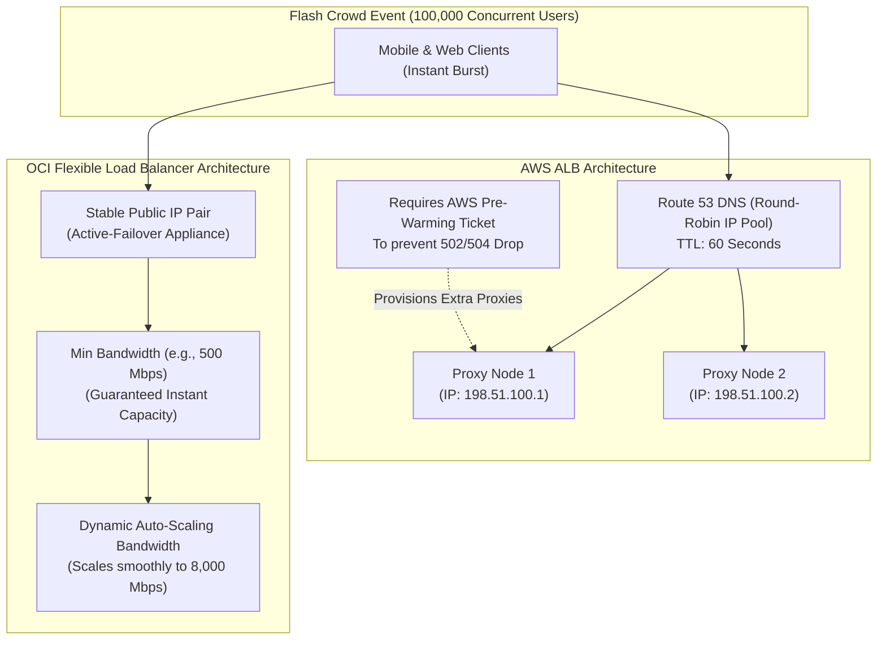

#### AWS Implementation
Calculate LCU requirements and verify ALB target group keep-alive configurations [Doc: AWS Application Load Balancer LCU Metrics, checked 2026]:

```bash
# Query active LCU usage metrics on an ALB via AWS CloudWatch CLI
aws cloudwatch get-metric-data \
  --metric-data-queries '[
    {
      "Id": "m1",
      "MetricStat": {
        "Metric": {
          "Namespace": "AWS/ApplicationELB",
          "MetricName": "ConsumedLCUs",
          "Dimensions": [{ "Name": "LoadBalancer", "Value": "app/prod-alb/1234567890abcdef" }]
        },
        "Period": 300,
        "Stat": "Sum"
      }
    }
  ]' \
  --start-time 1772841600 \
  --end-time 1772845200

# Optimize target group connection idle timeouts to reuse proxy connections
aws elbv2 modify-target-group-attributes \
  --target-group-arn "arn:aws:elasticloadbalancing:us-east-1:123456789012:targetgroup/prod-tg/73e2d6f2424" \
  --attributes Key=deregistration_delay.timeout_seconds,Value=30 \
               Key=load_balancing.algorithm.type,Value=least_outstanding_requests
```

#### OCI Implementation
Create and dynamically update an OCI Flexible Load Balancer's bandwidth shape using OCI CLI [Doc: OCI Flexible Load Balancer CLI, checked 2026]:

```bash
# Step 1: Create Flexible Load Balancer with Min 100 Mbps and Max 1000 Mbps
oci lb load-balancer create \
  --compartment-id ocid1.compartment.oc1..aaaaaaaam7... \
  --display-name "prod-flexible-alb" \
  --shape-name "flexible" \
  --shape-details '{"minimumBandwidthInMbps": 100, "maximumBandwidthInMbps": 1000}' \
  --subnet-ids '["ocid1.subnet.oc1.iad.aaaaaaaapublicsubnet..."]' \
  --is-private false

# Step 2: Dynamically scale Min Bandwidth ahead of a flash sale without dropping connections
oci lb load-balancer update-load-balancer-shape \
  --load-balancer-id ocid1.loadbalancer.oc1.iad.aaaaaaaaxample... \
  --shape-name "flexible" \
  --shape-details '{"minimumBandwidthInMbps": 1000, "maximumBandwidthInMbps": 4000}'
```

#### Common Trap
Failing to tune HTTP Keep-Alive timeouts between client-to-ALB and ALB-to-backend. If client applications close TCP connections after every single HTTP request (or if the backend's keep-alive timeout is shorter than the ALB's 60-second idle timeout), the ALB must perform a full TLS handshake and TCP 3-way handshake on every single request. This inflates new connection rates by $50\times$, rapidly burning through LCU quotas and triggering connection throttles.

#### Follow-up Question
How does configuring the `least_outstanding_requests` routing algorithm on AWS ALB or OCI Load Balancer prevent request pile-ups when backend instances have uneven processing latencies?

---

### Q360: Serverless Concurrency & Cold Start Mitigation: Reserved vs Provisioned Concurrency

#### Question
How do cloud architects engineer serverless functions to handle sudden enterprise traffic spikes without hitting account-level concurrency bottlenecks or suffering cold-start latency degradation, and how do AWS Lambda Concurrency models compare to OCI Functions scaling?

#### Short Answer
Serverless platforms scale by creating parallel container execution environments for concurrent requests. AWS Lambda provides two distinct concurrency mechanisms: **Reserved Concurrency** (guarantees a dedicated slice of the regional account concurrency limit and acts as a hard upper ceiling) and **Provisioned Concurrency** (pre-warms initialization contexts, completely eliminating cold starts for predictable traffic). OCI Functions (built on Fn Project) scales container runners dynamically from zero up to configured concurrency limits, offering configurable memory and container execution timeouts. While AWS charges an hourly rate for Provisioned Concurrency capacity even when idle, OCI Functions scales on-demand with minimal idle costs, leveraging image pre-caching and container reuse to suppress cold start impacts.

#### Deep Answer
Serverless elasticity operates on an event-driven concurrency model:
$$\text{Concurrency} = \text{Requests Per Second (RPS)} \times \text{Average Execution Duration (seconds)}$$
If an API receives 10,000 RPS and each invocation takes $200\text{ms}$ ($0.2\text{s}$), the required concurrency is:
$$\text{Concurrency} = 10,000 \times 0.2 = 2,000 \text{ concurrent executions}$$

**1. AWS Lambda Concurrency Architecture**:
- **Regional Account Limit**: AWS enforces a default regional pool (typically 1,000 concurrent executions per region, expandable via service quota request). Unreserved functions draw from this shared pool.
- **Reserved Concurrency**:
  - Sets a guaranteed floor and a strict maximum ceiling.
  - *Noisy Neighbor Protection*: Prevents a runaway function (e.g., recursive S3 trigger) from starving other mission-critical functions in the same AWS account.
  - *Downstream Throttling*: Protects relational databases from connection exhaustion by capping concurrent database connections [Doc: AWS Lambda Reserved Concurrency, checked 2026].
- **Provisioned Concurrency**:
  - Initializes the runtime, executes top-level code (imports, SDK clients, DB connections), and maintains warm containers in memory.
  - Reduces cold start latency from $1\text{--}5\text{ seconds}$ (JVM/Node) to $<15\text{ms}$.
  - Supports Application Auto Scaling to increase or decrease provisioned concurrency based on schedule or utilization metrics.

**2. OCI Functions Concurrency Architecture**:
- **Container-Native Scaling**: Functions run inside Docker/OCI container runners managed by the Fn Project engine.
- **Application & Function Limits**: OCI enforces concurrency limits at the tenancy and compartment level (default: 300 to 1,200 concurrent executions).
- **Execution Lifecycles**: When an HTTP request reaches the OCI API Gateway or Functions endpoint, Fn routes it to an available running container. If all containers are busy, Fn launches a new container instance. Hot containers remain warm in memory for an idle period (typically 5 to 15 minutes) before being reclaimed [Doc: OCI Functions Concurrency and Scaling, checked 2026].

#### Architecture
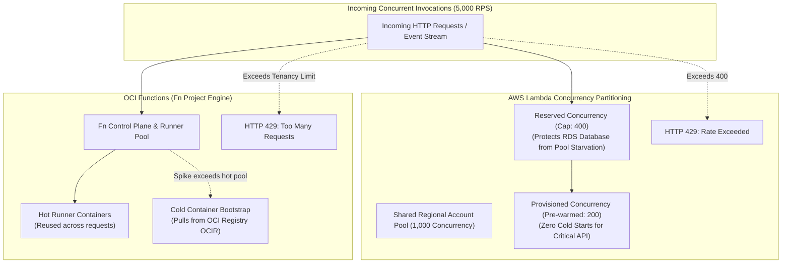

#### AWS Implementation
Configure Reserved and Provisioned Concurrency on an AWS Lambda function using the AWS CLI [Doc: AWS Lambda CLI Concurrency, checked 2026]:

```bash
# Step 1: Put Reserved Concurrency (Cap at 500 to protect RDS DB)
aws lambda put-function-concurrency \
  --function-name "PaymentCheckoutService" \
  --reserved-concurrent-executions 500

# Step 2: Publish a Function Version (Provisioned Concurrency cannot attach to $LATEST)
VERSION=$(aws lambda publish-version --function-name "PaymentCheckoutService" --query 'Version' --output text)

# Step 3: Configure 50 Provisioned Concurrency environments on that version
aws lambda put-provisioned-concurrency-config \
  --function-name "PaymentCheckoutService" \
  --qualifier "$VERSION" \
  --provisioned-concurrent-executions 50

# Step 4: Verify Provisioned Concurrency status
aws lambda get-provisioned-concurrency-config \
  --function-name "PaymentCheckoutService" \
  --qualifier "$VERSION"
```

#### OCI Implementation
Configure concurrency limits, memory allocation, and scaling timeouts for OCI Functions using OCI CLI [Doc: OCI Functions CLI, checked 2026]:

```bash
# Step 1: Configure Application-level Network and Tracing Settings
oci fn application update \
  --application-id ocid1.fnapp.oc1.iad.aaaaaaaaxample... \
  --config '{"DATABASE_POOL_MAX": "20", "LOG_LEVEL": "INFO"}'

# Step 2: Update Function Memory allocation to accelerate cold start CPU provisioning
oci fn function update \
  --function-id ocid1.fnfunc.oc1.iad.aaaaaaaaxample... \
  --memory-in-mbs 2048 \
  --timeout-in-seconds 60

# Step 3: Monitor Concurrent Function Invocations in OCI Monitoring
oci monitoring metric-data summarize-metrics-data \
  --compartment-id ocid1.compartment.oc1..aaaaaaaam7... \
  --namespace "oci_faas" \
  --query-text "FunctionInvocations[1m].sum()" \
  --start-time "2026-03-01T12:00:00Z" \
  --end-time "2026-03-01T13:00:00Z"
```

#### Common Trap
Setting Reserved Concurrency to 0 on an AWS Lambda function to disable it, and forgetting that all unreserved functions share the remaining account pool. If an account limit is 1,000 and five development functions collectively consume 1,000 concurrency during a load test, production functions with no reserved concurrency will be completely throttled (HTTP 429), taking down production APIs. Always assign explicit Reserved Concurrency to mission-critical production functions.

#### Follow-up Question
How do you configure AWS Application Auto Scaling to dynamically adjust Lambda Provisioned Concurrency based on forecasted daily traffic schedules or target utilization metrics?

---

### Q361: API Gateway Throttling & Token Bucket Rate Limiting: Amazon API Gateway vs OCI API Gateway

#### Question
How do cloud API Gateways enforce traffic rate limiting, burst handling, and tenant isolation using Token Bucket algorithms, and how do Amazon API Gateway Usage Plans compare with OCI API Gateway Rate Limiting policies?

#### Short Answer
API Gateways protect downstream microservices from denial-of-service surges using the **Token Bucket Algorithm**. The bucket holds a maximum number of tokens (**Burst Capacity**) and refills at a steady rate (**Steady-State Rate / Rate Limit** per second). Incoming requests consume one token; if the bucket is empty, the gateway rejects the call immediately with `HTTP 429 Too Many Requests`. Amazon API Gateway supports multi-tiered throttling: Account-level, API-level, Route-level, and Client/Usage-Plan-level (tied to API Keys). OCI API Gateway provides native declarative **Rate Limiting Policies** defined at the gateway or route level, supporting client IP-based, JWT-claim-based (e.g., `client_id` or `tenant_id`), or global rate limits with customizable response headers (`X-RateLimit-Remaining`, `Retry-After`).

#### Deep Answer
Exposing microservices directly to the internet without a rate-limiting gateway guarantees that a single misbehaving client, scraper, or DDoS attack will saturate backend compute and crash database connection pools.

**The Token Bucket Algorithm Mechanics**:
- **Bucket Capacity ($B$)**: Determines the maximum burst of concurrent requests permitted in a microsecond burst window.
- **Refill Rate ($R$)**: The number of tokens added to the bucket per second.
- **Mathematical Flow**:
  - When a request arrives: If $\text{Tokens} \ge 1$, decrement tokens by 1 and allow request to pass.
  - If $\text{Tokens} < 1$, reject immediately with `HTTP 429`.
  - When idle: Tokens accumulate at rate $R$ up to the maximum ceiling $B$.

**1. Amazon API Gateway Throttling Hierarchy**:
- **Account Level**: Default 10,000 requests/sec with a 5,000 burst capacity across all APIs in a region (expandable via quota request).
- **API Level**: Caps throughput for a specific REST or HTTP API.
- **Method / Route Level**: Custom rates on specific expensive routes (e.g., allow 5,000 RPS on `GET /products`, but cap `POST /checkout` at 200 RPS).
- **Usage Plans & API Keys**: Associates client API keys with tiered usage plans (e.g., Bronze: 100 RPS, Gold: 2,000 RPS) and monthly request quotas (e.g., 1,000,000 calls/month) [Doc: AWS API Gateway Throttling and Usage Plans, checked 2026].

**2. OCI API Gateway Rate Limiting Architecture**:
- **Native Flexible Enforcement**: Configured directly inside deployment specifications.
- **Client Identity Keys**:
  - `CLIENT_IP`: Enforces rate limits per caller IP address.
  - `TOTAL_PERCENTAGE`: Global rate limit applied across all callers.
  - `JWT / CLAIM`: Extracts client identifiers directly from validated OAuth2/OIDC JWT tokens (e.g., claim `sub`, `tenant_id`, or `app_id`), allowing dynamic multi-tenant SaaS rate limiting without maintaining API key tables [Doc: OCI API Gateway Rate Limiting, checked 2026].

#### Architecture
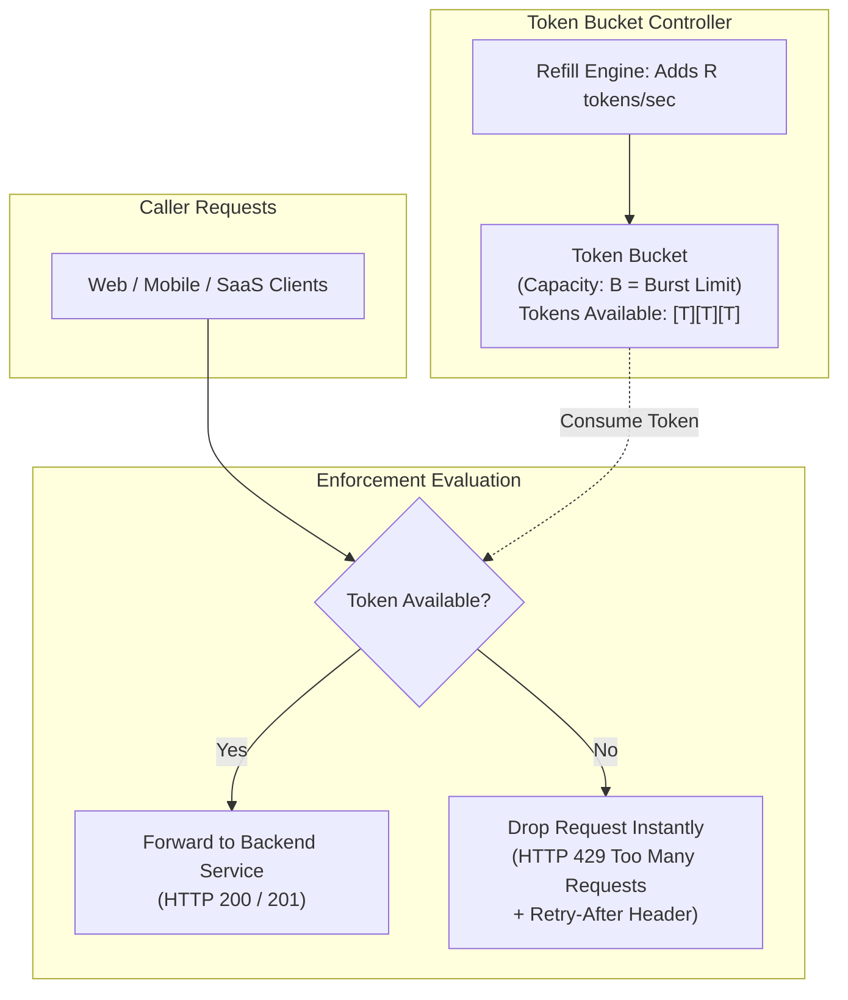

#### AWS Implementation
Configure an Amazon API Gateway Usage Plan with rate limits and burst quotas, attached to an API key [Doc: AWS API Gateway Usage Plans CLI, checked 2026]:

```bash
# Step 1: Create a Usage Plan with 500 RPS rate and 1000 burst
aws apigateway create-usage-plan \
  --name "Gold-Tier-Usage-Plan" \
  --description "High-priority tier with 500 RPS and 1000 burst" \
  --throttle "rateLimit=500.0,burstLimit=1000" \
  --quota "limit=5000000,offset=0,period=MONTH"

# Step 2: Associate Usage Plan with REST API Stage
aws apigateway update-usage-plan \
  --usage-plan-id "abc1234" \
  --patch-operations op="add",path="/apiStages",value="a1b2c3d4e5:prod"

# Step 3: Create an API Key and attach to Usage Plan
API_KEY_ID=$(aws apigateway create-api-key --name "CustomerAcmeKey" --enabled --query 'id' --output text)
aws apigateway create-usage-plan-key \
  --usage-plan-id "abc1234" \
  --key-id "$API_KEY_ID" \
  --key-type "API_KEY"
```

#### OCI Implementation
Configure rate limiting on an OCI API Gateway deployment based on client IP and custom JWT claims [Doc: OCI API Gateway Deployment Specification, checked 2026]:

```json
// oci-api-deployment.json
{
  "routes": [
    {
      "path": "/v1/orders",
      "methods": ["POST"],
      "backend": {
        "type": "HTTP_BACKEND",
        "url": "http://order-service.internal:8080/orders"
      },
      "policies": {
        "rateLimiting": {
          "rateInRequestsPerSecond": 250,
          "rateKey": "CLIENT_IP"
        }
      }
    }
  ]
}
```

```bash
# Deploy rate-limiting policy to OCI API Gateway via CLI
oci api-gateway deployment create \
  --compartment-id ocid1.compartment.oc1..aaaaaaaam7... \
  --gateway-id ocid1.apigateway.oc1.iad.aaaaaaaaxample... \
  --display-name "orders-api-v1" \
  --path-prefix "/orders" \
  --specification file://oci-api-deployment.json
```

#### Common Trap
Configuring API Gateway rate limits that are higher than downstream backend database connection limits. If API Gateway permits a burst of 5,000 requests/sec, but the downstream PostgreSQL database can only support 200 concurrent connections, the burst will pass cleanly through the API Gateway and immediately crash the database. API Gateway burst and steady-state limits must be mathematically aligned with downstream connection pools and cache hit ratios.

#### Follow-up Question
How do you implement distributed sliding-window rate limiting across multi-region API Gateway deployments when clients roam between geographical regions?

---

### Q362: Database Autoscaling: Aurora Serverless v2 vs Autonomous Database Auto-Scaling

#### Question
How do cloud managed relational databases scale CPU, memory, and transactional throughput dynamically without dropping active client connections or causing locking freezes, and how do Amazon Aurora Serverless v2 and OCI Autonomous Database Auto-Scaling compare in scaling granularity and mechanics?

#### Short Answer
Relational database autoscaling requires scaling compute independently of persistent storage while preserving in-memory buffer pools, active transactions, and lock structures. **Amazon Aurora Serverless v2** scales in fine-grained increments of 0.5 **Aurora Capacity Units (ACUs)** (1 ACU $\approx 2\text{GB}$ RAM + associated vCPU/networking) in under 1 second by adjusting hypervisor-allocated CPU and memory in-place without restarting the PostgreSQL/MySQL engine. **OCI Autonomous Database Auto-Scaling** operates on **ECPUs** (or OCPUs), scaling compute dynamically up to $3\times$ the base allocated capacity in real-time as query load demands, with zero downtime and per-second billing, leveraging Oracle Exadata shared-memory architectures and real-time workload management.

#### Deep Answer
Traditional database scaling required vertical upgrades: provisioning a larger instance, failing over to a read replica, and experiencing $15\text{--}60\text{ seconds}$ of connection dropping and cold-cache query degradation.

**1. Amazon Aurora Serverless v2 Architecture**:
- **The Aurora Decoupled Storage Engine**: Aurora separates compute from storage. The compute instance connects over a high-speed 100Gbps fabric to a multi-AZ distributed storage tier (6 copies across 3 AZs).
- **In-Place Compute Resizing**:
  - Scaling happens *within* the running database process. Aurora adjusts Linux `cgroups` allocations for CPU and dynamically grows or shrinks the PostgreSQL `shared_buffers` or MySQL `innodb_buffer_pool_size`.
  - **Scaling Granularity**: Scales in 0.5 ACU increments (e.g., from 0.5 ACUs to 128 ACUs, spanning 1GB to 256GB RAM) [Doc: Aurora Serverless v2 Scaling, checked 2026].
  - **Scale Speed**: Can double capacity in a fraction of a second. Active transactions, prepared statements, and client TCP sockets remain 100% connected.
- **Scale-Down Conservatism**: Scales down slowly to avoid evicting frequently accessed cache pages prematurely.

**2. OCI Autonomous Database (ADB) Auto-Scaling Architecture**:
- **Exadata Infrastructure**: Powered by Oracle Exadata Cloud Infrastructure (featuring RoCE 100Gbps networking, NVMe flash caching, and Exadata Smart Scan offload).
- **ECPU Scaling Mechanics**:
  - Operators configure a **Base ECPU count** (e.g., 4 ECPUs).
  - When **Compute Auto-Scaling** is enabled, Autonomous Database automatically scales up to $3\times$ the base value (e.g., up to 12 ECPUs) instantly when CPU load increases, and scales down instantly when demand subsides [Doc: OCI Autonomous Database Auto-Scaling, checked 2026].
  - Scaling is completely non-disruptive: zero connection drops, zero query interruption.
  - Billing is per-second: you pay for the base ECPUs continuously, and pay for the burst ECPUs strictly for the seconds they are active.

| Architectural Dimension | Amazon Aurora Serverless v2 | OCI Autonomous Database (ADB) |
| :--- | :--- | :--- |
| **Compute Metric** | Aurora Capacity Units (ACU: 0.5 to 128) | ECPUs / OCPUs (Base + $3\times$ Auto-scale) |
| **Scaling Granularity** | 0.5 ACU increments ($\approx 1\text{GB}$ RAM) | 1 ECPU increments |
| **Scaling Latency** | Sub-second in-place adjustment | Instantaneous dynamic thread scaling |
| **Connection Disruption** | Zero connection drops | Zero connection drops |
| **Underlying Engine** | Aurora PostgreSQL / Aurora MySQL | Autonomous Transaction Processing (ATP) / ADW |
| **Storage Architecture** | Multi-AZ distributed 6-way replication | Exadata Smart Storage + Triple Mirroring |

#### Architecture
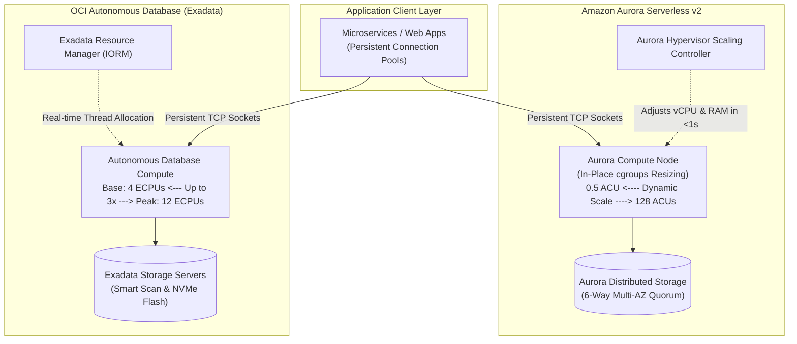

#### AWS Implementation
Provision an Amazon Aurora Serverless v2 PostgreSQL cluster and set capacity bounds using the AWS CLI [Doc: AWS Aurora Serverless v2 CLI, checked 2026]:

```bash
# Step 1: Create DB Cluster with Aurora Serverless v2 Capacity Configuration (0.5 to 32 ACUs)
aws rds create-db-cluster \
  --db-cluster-identifier "prod-aurora-pg-cluster" \
  --engine "aurora-postgresql" \
  --engine-version "16.1" \
  --master-username "dbadmin" \
  --master-user-password "ComplexPassword123!" \
  --serverless-v2-scaling-configuration MinCapacity=0.5,MaxCapacity=32.0 \
  --db-subnet-group-name "prod-db-subnets"

# Step 2: Create DB Instance in the cluster configured with Serverless shape
aws rds create-db-instance \
  --db-instance-identifier "prod-aurora-pg-instance-1" \
  --db-cluster-identifier "prod-aurora-pg-cluster" \
  --db-instance-class "db.serverless" \
  --engine "aurora-postgresql"
```

#### OCI Implementation
Provision an OCI Autonomous Transaction Processing (ATP) database with automated compute scaling enabled [Doc: OCI Autonomous Database CLI, checked 2026]:

```bash
# Provision Autonomous Database with Auto-Scaling Enabled (Base: 4 ECPUs, scales to 12 ECPUs)
oci db autonomous-database create \
  --compartment-id ocid1.compartment.oc1..aaaaaaaam7... \
  --db-name "prodatp" \
  --display-name "prod-ecommerce-atp" \
  --compute-model "ECPU" \
  --compute-count 4 \
  --is-auto-scaling-enabled true \
  --data-storage-size-in-tbs 1 \
  --is-auto-scaling-for-storage-enabled true \
  --db-workload "OLTP" \
  --admin-password "ComplexPassword123!"
```

#### Common Trap
Setting the minimum capacity too low (e.g., `MinCapacity: 0.5 ACU` on Aurora Serverless v2) for production databases with large working sets. At 0.5 ACU, total memory is only 1GB, which leaves less than 500MB for the database buffer cache. When a sudden traffic spike hits, all queries immediately trigger disk I/O reads against storage because the cache is completely cold, causing a temporary latency spike while Aurora rapidly scales up to 16 ACUs. For production workloads, set `MinCapacity` to at least 2–4 ACUs to maintain a warm working set cache.

#### Follow-up Question
How does database connection pooling (e.g., AWS RDS Proxy or Oracle Database Resident Connection Pooling - DRCP) prevent client connection limits from constraining database compute autoscaling?

---

### Q363: NoSQL Capacity Models: DynamoDB On-Demand vs OCI NoSQL Dynamic Throughput

#### Question
How do distributed NoSQL database engines scale read and write throughput dynamically without administrative intervention, and how do Amazon DynamoDB On-Demand and Provisioned Autoscaling compare to OCI NoSQL Cloud Service dynamic throughput allocations?

#### Short Answer
Amazon DynamoDB and OCI NoSQL Cloud Service manage throughput by automatically partitioning data across distributed storage nodes based on partition keys. **Amazon DynamoDB** offers two modes: **Provisioned with Auto-Scaling** (uses Application Auto Scaling to adjust Read/Write Capacity Units `RCUs`/`WCUs` based on target utilization curves) and **On-Demand** (instantly accommodates up to $2\times$ previous peak traffic with zero capacity planning, billing per individual read/write request). **OCI NoSQL Cloud Service** similarly offers **On-Demand Capacity** (pay-per-use per read/write unit) and **Provisioned Capacity** (explicitly setting Read Units, Write Units, and Gigabytes of storage), allowing dynamic, non-disruptive throughput modifications via API calls within seconds.

#### Deep Answer
NoSQL databases achieve near-infinite horizontal scalability by sharding tables into storage partitions ($10\text{GB}$ max per partition in DynamoDB; managed storage partitions in OCI NoSQL).

**1. Amazon DynamoDB Capacity Mechanics**:
- **Capacity Units**:
  - 1 Write Capacity Unit (WCU) = 1 write per second for items up to 1 KB.
  - 1 Read Capacity Unit (RCU) = 1 strongly consistent read per second (or two eventually consistent reads) for items up to 4 KB.
- **Provisioned with Auto Scaling**:
  - Target tracking policies adjust RCUs/WCUs (e.g., target 70% utilization).
  - Limitation: Reactive scaling takes several minutes to trigger CloudWatch alarms and adjust table capacity.
- **On-Demand Capacity Mode**:
  - Instantly accommodates traffic bursts up to **$2\times$ of previous peak traffic** [Doc: DynamoDB On-Demand Capacity, checked 2026].
  - If a table previously peaked at 10,000 WCUs, On-Demand accommodates an instant spike to 20,000 WCUs with zero throttling.
  - Eliminates capacity planning for spiky or unpredictable workloads, though cost per request is roughly $5\times$ higher than fully utilized provisioned capacity.

**2. OCI NoSQL Cloud Service Capacity Mechanics**:
- **Table Capacity Modes**:
  - **On-Demand Capacity**: Automatically scales read and write workloads dynamically without provisioning. Customers pay solely for active Read Units (RU) and Write Units (WU) consumed [Doc: OCI NoSQL Cloud Service Architecture, checked 2026].
  - **Provisioned Capacity**: Specify static or scheduled limits:
    - 1 Read Unit = 1 KB read per second.
    - 1 Write Unit = 1 KB write per second.
  - **Hot Partition Rebalancing**: OCI NoSQL continuously monitors storage partition temperature. If one partition experiences hot-key traffic, OCI NoSQL dynamically allocates spare throughput buffers to maintain low millisecond response times.

| Feature Dimension | Amazon DynamoDB | OCI NoSQL Cloud Service |
| :--- | :--- | :--- |
| **On-Demand Burst Limit** | Up to $2\times$ previous peak instantly | Fully autonomous dynamic scaling |
| **Read Unit Definition** | 1 RCU = 4 KB (Strong) / 8 KB (Eventual) | 1 RU = 1 KB read/sec |
| **Write Unit Definition** | 1 WCU = 1 KB write/sec | 1 WU = 1 KB write/sec |
| **Provisioned Autoscaling**| Application Auto Scaling (Target Tracking) | Dynamic shape update via CLI/SDK/Cron |
| **Global Replication** | DynamoDB Global Tables (Multi-Region Active-Active) | Cross-Region Table Replication |

#### Architecture
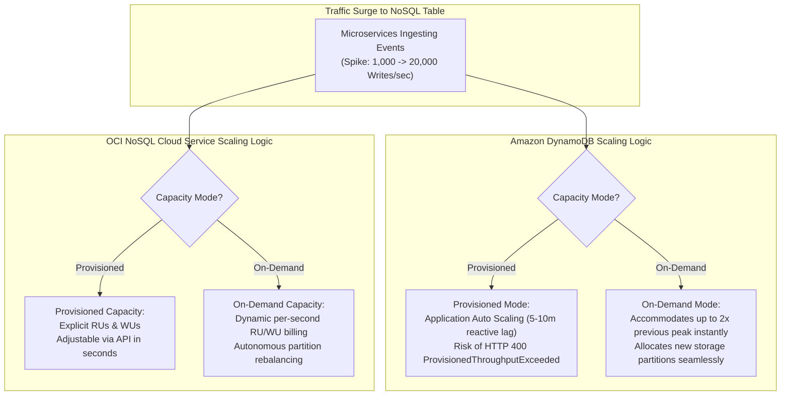

#### AWS Implementation
Create a DynamoDB table with On-Demand capacity mode and configure Global Secondary Index (GSI) scaling [Doc: AWS DynamoDB CLI, checked 2026]:

```bash
# Create DynamoDB table with PAY_PER_REQUEST (On-Demand) billing mode
aws dynamodb create-table \
  --table-name "OrdersEnterprise" \
  --attribute-definitions \
      AttributeName=CustomerId,AttributeType=S \
      AttributeName=OrderId,AttributeType=S \
  --key-schema \
      AttributeName=CustomerId,KeyType=HASH \
      AttributeName=OrderId,KeyType=RANGE \
  --billing-mode "PAY_PER_REQUEST"

# Switch existing provisioned table to On-Demand billing mode
aws dynamodb update-table \
  --table-name "LegacyOrders" \
  --billing-mode "PAY_PER_REQUEST"
```

#### OCI Implementation
Create an OCI NoSQL table with On-Demand capacity and switch between capacity modes using OCI CLI [Doc: OCI NoSQL CLI, checked 2026]:

```bash
# Step 1: Create an OCI NoSQL Table using ON_DEMAND capacity mode
oci nosql table create \
  --compartment-id ocid1.compartment.oc1..aaaaaaaam7... \
  --name "CustomerOrders" \
  --ddl-statement "CREATE TABLE CustomerOrders (customerId STRING, orderId STRING, orderData JSON, PRIMARY KEY (customerId, orderId))" \
  --table-limits '{"capacityMode": "ON_DEMAND", "maxStorageInGBs": 500}'

# Step 2: Update Table to PROVISIONED capacity with explicit Read/Write Units
oci nosql table update \
  --compartment-id ocid1.compartment.oc1..aaaaaaaam7... \
  --table-name-or-id "CustomerOrders" \
  --table-limits '{"capacityMode": "PROVISIONED", "maxReadUnits": 5000, "maxWriteUnits": 2000, "maxStorageInGBs": 500}'
```

#### Common Trap
Provisioning a Global Secondary Index (GSI) on a DynamoDB table with lower write capacity than the base table in Provisioned mode. If the base table accepts 2,000 writes/second but the GSI is only provisioned for 500 writes/second, the GSI will experience write throttling. Because DynamoDB enforces backpressure to keep indexes synchronized, **throttling on the GSI immediately throttles writes to the base table**, failing user transactions even though base table capacity is plenty high.

#### Follow-up Question
How does DynamoDB adaptive capacity handle uneven partition workloads ("hot keys"), and what are the architectural limits of partition throughput ($1,000\text{ WCUs}$ / $3,000\text{ RCUs}$ per partition)?

---

### Q364: Storage Volume Elasticity: EBS Elastic Volumes vs OCI Dynamic Block Volume Performance

#### Question
How do cloud block storage services dynamically scale storage size, IOPS, and throughput without unmounting filesystems or stopping virtual machine instances, and how do AWS EBS Elastic Volumes compare to OCI Dynamic Block Volume Elastic Performance tiers?

#### Short Answer
Cloud block storage decouples storage management from guest VM execution. **AWS EBS Elastic Volumes** allows modifying volume size, volume type (e.g., `gp2` to `gp3`, `io2`), and provisioned IOPS/throughput online without downtime; however, modifications trigger an internal volume optimization state and AWS enforces a **6-hour cooldown** before the same volume can be modified again. In contrast, **OCI Block Volumes** features **Dynamic Elastic Performance**: operators can dynamically scale performance tiers (**Ultra High Performance**, **Balanced**, **Lower Cost**) on the fly without unmounting, with **zero cooldown timers**, allowing automated cron jobs or scripts to scale up block volume performance during business hours and scale down to Lower Cost at night.

#### Deep Answer
Scaling storage in virtualized enterprise systems used to require unmounting filesystems, taking LVM snapshots, detaching virtual disks, provisioning new LUNs, and re-attaching.

**1. AWS EBS Elastic Volumes Architecture**:
- **Online Expansion**: Operators issue `ec2:ModifyVolume` to expand capacity (e.g., 100GB to 500GB).
- **Filesystem Extension**: The hypervisor immediately reflects the larger block device size. The OS administrator must execute `growpart` and `resize2fs` / `xfs_growfs` inside the guest OS to expand the filesystem.
- **The 6-Hour Lockout Constraint**:
  - When an EBS volume modification starts, it enters the `modifying` state, transitions to `optimizing`, and finally `completed`.
  - Even though performance improvements are effective immediately, AWS strictly blocks any subsequent modifications to that volume for a minimum of **6 hours** [Doc: AWS EBS Elastic Volumes Limits, checked 2026].
  - SREs cannot quickly fix a sizing mistake (e.g., accidentally expanding to 200GB instead of 500GB).

**2. OCI Dynamic Block Volume Elastic Performance**:
- **Volume Performance Units (VPUs)**: OCI measures performance in VPUs per GB:
  - **Lower Cost** (0 VPUs/GB): Ideal for batch, dev/test, and sequential streaming ($\sim 2\text{ IOPS/GB}$, $240\text{ KB/s/GB}$).
  - **Balanced** (10 VPUs/GB): Default production tier ($60\text{ IOPS/GB}$, $480\text{ KB/s/GB}$).
  - **Higher Performance** (20 VPUs/GB): Intensive databases ($75\text{ IOPS/GB}$, $680\text{ KB/s/GB}$).
  - **Ultra High Performance** (30 to 120 VPUs/GB): Extreme sub-millisecond workloads (up to $300,000\text{ IOPS}$ and $2,680\text{ MB/s}$ throughput per volume) [Doc: OCI Block Volume Elastic Performance, checked 2026].
- **Real-Time Dynamic Switching with Zero Cooldown**:
  - Performance tier switching is applied via software-defined NVMe target controls.
  - Changes take effect within seconds without detaching the volume.
  - **Zero cooldown period**: SREs can scale an OCI Block Volume to Ultra High Performance at 08:00 AM for database ETL processing and throttle it back to Lower Cost at 06:00 PM to slash storage bills by 70%.

#### Architecture
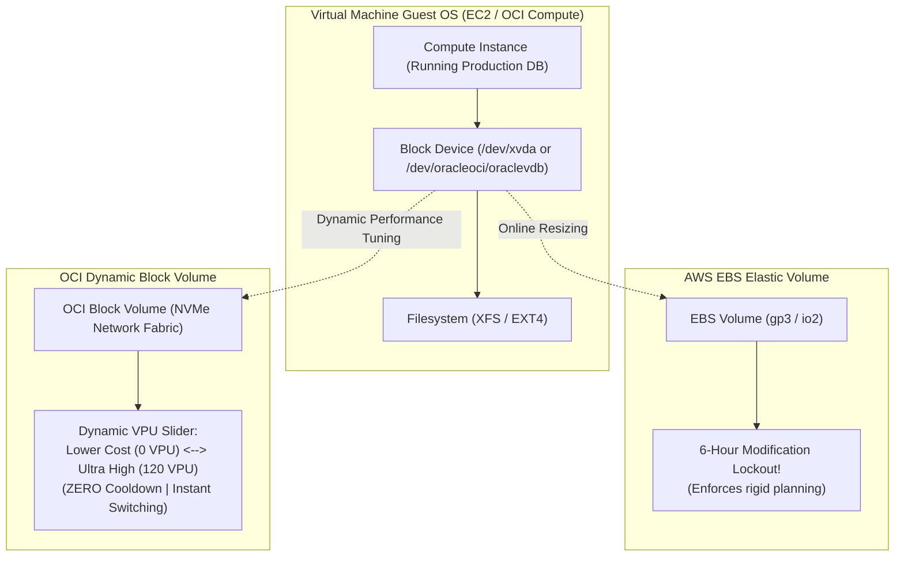

#### AWS Implementation
Expand an EBS gp3 volume's size and provisioned throughput online using the AWS CLI [Doc: AWS EBS ModifyVolume CLI, checked 2026]:

```bash
# Modify EBS Volume: expand from 100GB to 500GB, set 10,000 IOPS and 500 MB/s throughput
aws ec2 modify-volume \
  --volume-id vol-0a1b2c3d4e5f67890 \
  --size 500 \
  --volume-type gp3 \
  --iops 10000 \
  --throughput 500

# Inside Linux Guest OS: Expand partition and XFS filesystem online without reboot
sudo growpart /dev/nvme0n1 1
sudo xfs_growfs -d /mount/data
```

#### OCI Implementation
Dynamically scale an OCI Block Volume's performance tier and size using OCI CLI [Doc: OCI Block Volume CLI, checked 2026]:

```bash
# Step 1: Scale Block Volume to Ultra High Performance (30 VPUs/GB) for heavy batch processing
oci bv volume update \
  --volume-id ocid1.volume.oc1.iad.aaaaaaaaxample... \
  --vpus-per-gb 30

# Step 2: Online expansion of volume size from 200GB to 1000GB
oci bv volume update \
  --volume-id ocid1.volume.oc1.iad.aaaaaaaaxample... \
  --size-in-gbs 1000

# Inside Linux Guest OS: Extend disk partition and resize filesystem
sudo dd if=/dev/zero of=/dev/null count=1 # Refresh scsi bus
sudo growpart /dev/sdb 1
sudo resize2fs /dev/sdb1
```

#### Common Trap
Assuming that executing `ec2:ModifyVolume` or `oci bv volume update` to increase disk size automatically expands available filesystem space inside the operating system. Cloud hypervisors only expand the underlying raw block LUN; the operating system kernel continues to see the old partition table until `growpart` is run, and the filesystem will remain full until `resize2fs` (EXT4) or `xfs_growfs` (XFS) is executed. Without guest OS filesystem extension, applications will continue throwing `ENOSPC: No space left on device` errors.

#### Follow-up Question
How do you safely resize an encrypted root volume on an active production instance running Kubernetes when the underlying disk layout contains swap partitions or complex LVM volume groups?

---

### Q365: Network Throughput & Bandwidth Scaling: AWS ENA vs OCI Core-Proportional Networking

#### Question
How do cloud hypervisors allocate, throttle, and enforce virtual machine network bandwidth, and how do AWS Elastic Network Adapter (ENA) burst bandwidth allocations compare to OCI's core-proportional network bandwidth model?

#### Short Answer
Virtual machine network bandwidth is not static; it is governed by hypervisor token buckets and hardware offload engines. **AWS EC2** allocates network bandwidth based on instance type and size, utilizing the **Elastic Network Adapter (ENA)**. Smaller instance sizes (e.g., `m5.large`) rely on a **Burst Bandwidth** model (providing up to 10 Gbps burst, but throttling down to a baseline of 1.25 Gbps once burst credits are exhausted). In contrast, **OCI Compute** enforces a deterministic **Core-Proportional Bandwidth Model**: network bandwidth is strictly proportional to the number of allocated OCPUs/vCPUs (typically 1 Gbps per OCPU on AMD/Intel shapes, up to a maximum of 40 Gbps to 100 Gbps per VNIC). OCI provides dedicated, non-bursting, sustained wire-speed performance without credit exhaustion cliffs.

#### Deep Answer
Network performance regressions in high-throughput applications (e.g., Kafka brokers, database replication, video streaming) often stem from invisible hypervisor network throttling.

**1. AWS ENA & Burst Bandwidth Architecture**:
- **ENA Driver & Nitro System**: AWS Nitro offloads networking to dedicated hardware ASIC cards.
- **The Burst Credit System**:
  - AWS specifies network bandwidth as *"Up to 10 Gbps"* or *"Up to 12.5 Gbps"* for smaller and medium instance sizes.
  - Instances accumulate network I/O credits during idle periods. During large file transfers or database backups, the instance bursts up to 10 Gbps.
  - Once the burst allowance is exhausted, the Nitro card throttles network throughput down to the baseline rate (e.g., 0.75 Gbps to 1.5 Gbps) [Doc: EC2 Instance Network Bandwidth, checked 2026].
- **Diagnostic Visibility**: ENA exposes driver-level metrics via `ethtool -S eth0`:
  - `bw_in_allowance_exceeded`: Packets dropped due to inbound bandwidth throttling.
  - `bw_out_allowance_exceeded`: Packets dropped due to outbound bandwidth throttling.
  - `pps_allowance_exceeded`: Packets dropped due to Packets Per Second (PPS) limits.

**2. OCI Core-Proportional Bandwidth Architecture**:
- **Deterministic Scaling**: OCI Compute does not use burst credit buckets for network bandwidth.
- **Fixed Allocation per Core**:
  - On standard VM shapes (such as `VM.Standard.E5.Flex`), bandwidth is allocated at **1 Gbps per OCPU** (or up to 2 Gbps per core on specialized shapes) [Doc: OCI Compute Shape Network Specifications, checked 2026].
  - Sizing an instance with 8 OCPUs guarantees a sustained **8 Gbps** of network bandwidth 24/7/365. Sizing with 32 OCPUs guarantees **32 Gbps**.
- **No Hidden Throttling**: Because bandwidth is deterministic and non-oversubscribed, workloads never experience sudden mid-day bandwidth collapses due to depleted credit pools.

| Network Metric | AWS EC2 (Nitro ENA) | OCI Compute (Flexible Shapes) |
| :--- | :--- | :--- |
| **Bandwidth Model** | Baseline + Burst Credits (for small/med sizes) | Linear Core-Proportional (Sustained) |
| **Bandwidth Formula** | Tiered by instance family (e.g., 10 to 100 Gbps) | 1 Gbps per OCPU (up to 40 Gbps on VMs) |
| **Throttling Metric** | `bw_out_allowance_exceeded` in `ethtool` | OCI Monitoring `VnicEgressDropPackets` |
| **Packets Per Second** | Capped by PPS token bucket | Capped linearly with allocated OCPU count |
| **Jumbo Frames** | MTU 9001 supported within VPC | MTU 9000 supported within VCN |

#### Architecture
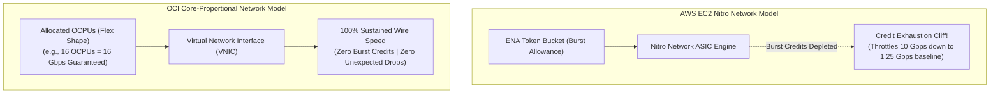

#### AWS Implementation
Diagnose ENA network throttling inside an EC2 instance and inspect CloudWatch allowance exceeded metrics [Doc: AWS ENA Monitoring Guide, checked 2026]:

```bash
# Query ENA driver network allowance exceeded statistics via Linux ethtool
ethtool -S eth0 | grep -E "allowance_exceeded"

# Output interpretation:
# bw_in_allowance_exceeded: 0
# bw_out_allowance_exceeded: 1849204  <-- Host was throttled on egress bandwidth!
# pps_allowance_exceeded: 49201       <-- Host exceeded packets-per-second limit!
# conntrack_allowance_exceeded: 0

# Upgrade instance to an instance size with dedicated sustained bandwidth (e.g., c6i.8xlarge = 12.5 Gbps)
aws ec2 modify-instance-attribute \
  --instance-id i-0123456789abcdef0 \
  --instance-type "{\"Value\": \"c6i.8xlarge\"}"
```

#### OCI Implementation
Monitor VNIC bandwidth utilization and packet drops in OCI Monitoring using OCI CLI [Doc: OCI Compute VNIC Metrics, checked 2026]:

```bash
# Query VNIC Egress throughput and dropped packets on an OCI Compute Instance
oci monitoring metric-data summarize-metrics-data \
  --compartment-id ocid1.compartment.oc1..aaaaaaaam7... \
  --namespace "oci_vcn" \
  --query-text "VnicEgressBytes[1m].rate()" \
  --start-time "2026-03-01T12:00:00Z" \
  --end-time "2026-03-01T13:00:00Z"

# Dynamically scale OCPUs on a Flex Compute Shape to increase network bandwidth
oci compute instance update \
  --instance-id ocid1.instance.oc1.iad.aaaaaaaaxample... \
  --shape-config '{"ocpus": 16, "memoryInGBs": 64}' # Scales bandwidth to 16 Gbps
```

#### Common Trap
Assuming that upgrading to a larger instance type automatically fixes network packet drops when the root cause is **PPS (Packets Per Second) throttling** rather than raw bandwidth. Processing millions of tiny 64-byte packets (e.g., DNS queries or small IoT telemetry events) exhausts the hypervisor's packet-processing queues long before touching the gigabit bandwidth ceiling. To resolve PPS throttling, architects must enable **Jumbo Frames (MTU 9000/9001)** or batch payloads into larger frames before transmission.

#### Follow-up Question
How do AWS ENA Express (SRD - Scalable Reliable Datagram) and OCI HPC RDMA over Converged Ethernet (RoCE v2) bypass standard TCP stack kernel overhead to achieve microsecond latency in distributed training and database clusters?

---

### Q366: Event-Driven Kubernetes Autoscaling: KEDA on SQS, Kafka & OCI Streaming

#### Question
How does Kubernetes Event-Driven Autoscaling (KEDA) overcome the architectural latency and polling limitations of standard Kubernetes metrics-server autoscaling for asynchronous event workers, and how is KEDA configured to scale pod replicas on AWS SQS queues and OCI Streaming Kafka consumer group lag?

#### Short Answer
Standard Kubernetes HPA relies on `metrics-server`, which only inspects resource utilization (CPU/memory) of *already running* pods. When an asynchronous message queue experiences a massive backlog surge, existing workers may sit at normal CPU while thousands of jobs queue up, or the deployment may be scaled to zero replicas with no pods running to emit CPU metrics. **KEDA (Kubernetes Event-Driven Autoscaling)** acts as an external metrics adapter that queries message brokers directly (Amazon SQS, Apache Kafka, RabbitMQ, OCI Streaming). KEDA can scale deployments from **0 to 1** (activation) and from **1 to $N$** based on queue depth or consumer group partition lag, scaling back to **0** when queues are empty to eliminate idle compute costs.

#### Deep Answer
Asynchronous message processing requires a different scaling paradigm than synchronous HTTP traffic. An HTTP service responds to incoming TCP connections; an event worker actively pulls messages from an external queue broker.

**1. The "Scale from Zero" Limitation in Kubernetes**:
- Native Kubernetes HPA cannot scale a deployment from 0 replicas because HPA only evaluates metrics collected from existing pods. If `replicas: 0`, CPU utilization is undefined ($0/0$), and HPA never triggers.
- **KEDA's Two-Layer Architecture**:
  - **KEDA Scaler**: A background controller that queries the external event source (AWS SQS API or Kafka/OCI Streaming Admin Client) via external triggers.
  - When queue depth $> 0$, KEDA modifies the deployment replica count from 0 to 1.
  - Once at $\ge 1$ replica, KEDA exposes an external metric to the Kubernetes HPA controller, which handles mathematical scaling up to $N$ replicas [Doc: KEDA Architecture Specification, checked 2026].

**2. Consumer Lag vs Raw Queue Count**:
- For Kafka and OCI Streaming, scaling on total message count is flawed because processed messages may remain in the partition log until retention expires.
- KEDA scales on **Consumer Group Lag**:
  $$\text{Consumer Lag} = \text{Log End Offset (LEO)} - \text{Current Committed Offset}$$
- If a Kafka topic has 16 partitions, scaling beyond 16 worker pods is wasteful because standard Kafka consumer groups cannot assign more than one consumer thread to a single partition. KEDA allows defining maximum replica limits bounded by partition count.

#### Architecture
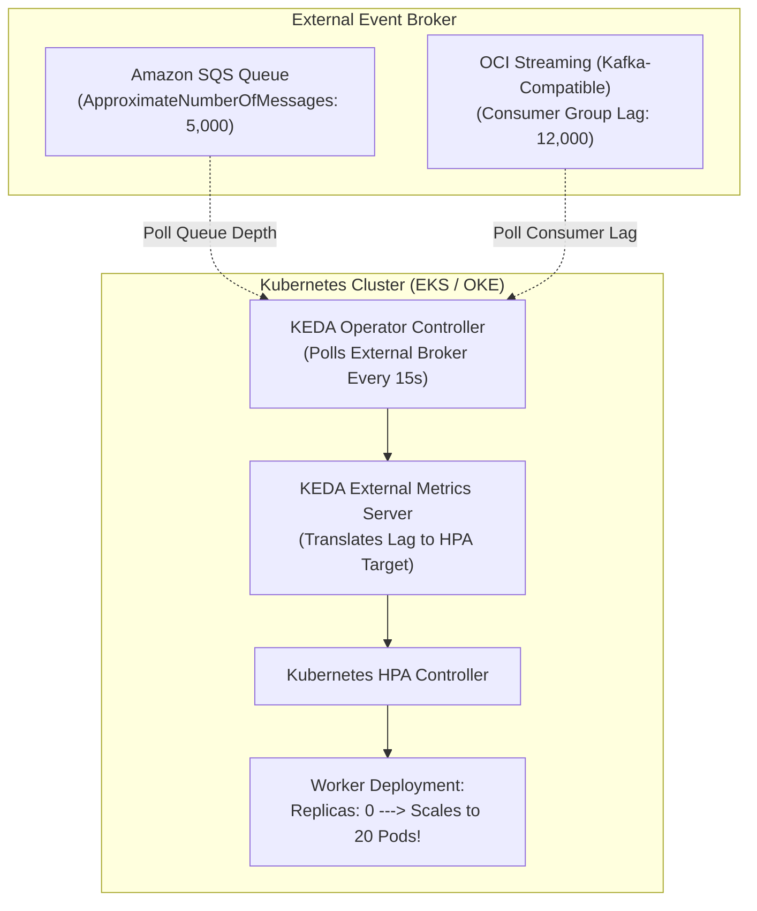

#### AWS Implementation
Configure KEDA `ScaledObject` on Amazon EKS to scale worker pods based on Amazon SQS queue depth using IAM Roles for Service Accounts (IRSA) [Doc: KEDA AWS SQS Scaler, checked 2026]:

```yaml
# keda-sqs-scaledobject.yaml
apiVersion: keda.sh/v1alpha1
kind: ScaledObject
metadata:
  name: order-processor-scaler
  namespace: production
spec:
  scaleTargetRef:
    apiVersion: apps/v1
    kind: Deployment
    name: order-processor-worker
  minReplicaCount: 0 # Scales completely to zero when queue is empty
  maxReplicaCount: 50
  cooldownPeriod: 300
  pollingInterval: 15
  triggers:
  - type: aws-sqs-queue
    metadata:
      queueURL: https://sqs.us-east-1.amazonaws.com/123456789012/order-processing-queue
      queueLength: "20" # 1 pod per 20 messages in queue
      awsRegion: us-east-1
      identityOwner: operator
```

#### OCI Implementation
Configure KEDA `ScaledObject` on Oracle Container Engine for Kubernetes (OKE) to scale workers based on OCI Streaming Kafka consumer group lag [Doc: KEDA Kafka Scaler on OCI Streaming, checked 2026]:

```yaml
# keda-oci-streaming-scaledobject.yaml
apiVersion: keda.sh/v1alpha1
kind: ScaledObject
metadata:
  name: oci-stream-worker-scaler
  namespace: production
spec:
  scaleTargetRef:
    apiVersion: apps/v1
    kind: Deployment
    name: event-stream-consumer
  minReplicaCount: 1
  maxReplicaCount: 16 # Capped by the 16 partitions of the OCI Stream
  pollingInterval: 15
  triggers:
  - type: kafka
    metadata:
      bootstrapServers: cell-1.streaming.us-ashburn-1.oci.oraclecloud.com:9092
      consumerGroup: enterprise-order-consumers
      topic: oci-order-stream
      lagThreshold: "100" # Add replica for every 100 uncommitted messages
      sasl: plaintext
      tls: enable
```

#### Common Trap
Scaling a Kafka or OCI Streaming consumer deployment to more replicas than the number of topic partitions. In Apache Kafka / OCI Streaming, a partition can be consumed by at most one worker pod within a consumer group. If a topic has 8 partitions and KEDA scales the deployment to 20 pods, **12 pods will sit 100% idle, consuming cluster CPU and RAM while doing zero work**. SREs must set `maxReplicaCount` strictly equal to or less than the partition count.

#### Follow-up Question
How do you configure KEDA activation thresholds vs scaling thresholds to prevent pod oscillation when processing large, slow-running batch messages that take 10 minutes per message?

---

### Q367: Multi-AZ & Cross-AD Capacity Rebalancing: Zone Affinity & Fault Domains

#### Question
How do cloud autoscaling engines maintain uniform capacity distribution across multiple Availability Zones (AZs) and Availability/Fault Domains (ADs/FDs), what are the failure implications of Availability Zone outages, and how do AWS AZ rebalancing algorithms compare to OCI Fault Domain placement policies?

#### Short Answer
High-availability autoscaling enforces strict geographical diversity: compute instances must be balanced equally across failure domains to ensure that losing an entire data center or power grid does not degrade capacity below survival thresholds. AWS Auto Scaling Groups (ASGs) continuously evaluate **AZ Rebalancing**: if an AZ becomes imbalanced (due to instance termination or spot reclamation), AWS launches a replacement instance in the deficient AZ *before* terminating the excess instance in the over-represented AZ. OCI Instance Pools enforce placement across **Availability Domains (ADs)** and **Fault Domains (FDs)** (FD1, FD2, FD3 within each AD), distributing instances evenly across independent power distribution units (PDUs) and top-of-rack switches.

#### Deep Answer
Designing a fleet of 12 instances across 3 AZs or FDs requires ensuring exactly 4 instances per failure domain. If an event causes 8 instances to run in AZ-a and only 2 in AZ-b and 2 in AZ-c, an outage in AZ-a will destroy 66% of the production fleet.

**1. AWS Auto Scaling Group AZ Rebalancing Mechanics**:
- **Balancing Invariant**: ASGs attempt to distribute instances uniformly across all configured subnets/AZs.
- **The Launch-Before-Terminate Pattern**:
  - Suppose an ASG has 6 instances (2 in AZ-a, 2 in AZ-b, 2 in AZ-c).
  - An instance in AZ-a fails health checks. Desired capacity is temporarily 5.
  - If AZ-a is experiencing an AWS regional capacity shortage, the ASG launches an instance in AZ-b to restore desired capacity to 6.
  - When AZ-a recovers capacity, the ASG detects an imbalance (AZ-a has 1, AZ-b has 3, AZ-c has 2).
  - **Rebalancing Action**: The ASG launches a new instance in AZ-a, waits for it to become healthy, and *then* terminates the extra instance in AZ-b [Doc: AWS ASG AZ Rebalancing, checked 2026].
- **Disabling Rebalancing for Stateful Workloads**:
  - For stateless web services, rebalancing is desirable.
  - For stateful or clustered workloads (e.g., Elasticsearch, Kafka, Cassandra), automatic rebalancing causes disruptive node churn. Operators suspend the `AZRebalance` process via `aws autoscaling suspend-processes --scaling-processes AZRebalance`.

**2. OCI Instance Pool Fault Domain Distribution**:
- OCI data centers are architected with **Fault Domains**: three distinct hardware topologies within every Availability Domain sharing zero common hardware, racks, or power units.
- **Placement Configurations**:
  - Operators specify primary subnets and explicitly list target fault domains: `["FAULT-DOMAIN-1", "FAULT-DOMAIN-2", "FAULT-DOMAIN-3"]`.
  - OCI Instance Pools automatically apply **Round-Robin Fault Domain Placement**: instance 1 lands in FD1, instance 2 in FD2, instance 3 in FD3, instance 4 in FD1 [Doc: OCI Instance Pool Placement, checked 2026].
  - If a top-of-rack switch or power supply in FD1 fails, exactly 33% of the pool is affected, leaving 67% fully operational in FD2 and FD3.

#### Architecture
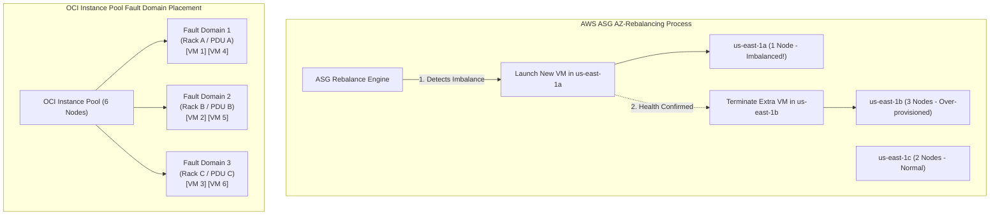

#### AWS Implementation
Suspend AZ Rebalance during stateful upgrades and resume it afterwards using AWS CLI [Doc: AWS Auto Scaling Suspend Processes, checked 2026]:

```bash
# Suspend AZRebalance process on an Auto Scaling Group to prevent node churn
aws autoscaling suspend-processes \
  --auto-scaling-group-name "prod-kafka-cluster-asg" \
  --scaling-processes "AZRebalance"

# Check active and suspended processes on the ASG
aws autoscaling describe-auto-scaling-groups \
  --auto-scaling-group-names "prod-kafka-cluster-asg" \
  --query "AutoScalingGroups[0].SuspendedProcesses"

# Resume AZRebalance once stateful data re-indexing is complete
aws autoscaling resume-processes \
  --auto-scaling-group-name "prod-kafka-cluster-asg" \
  --scaling-processes "AZRebalance"
```

#### OCI Implementation
Define explicit Fault Domain placement configurations on an OCI Instance Pool [Doc: OCI CLI Instance Pool Placement, checked 2026]:

```bash
# Placement configuration JSON defining round-robin across all 3 Fault Domains
cat << 'EOF' > oci-fd-placement.json
[
  {
    "availabilityDomain": "UwhS:US-ASHBURN-AD-1",
    "primarySubnetId": "ocid1.subnet.oc1.iad.aaaaaaaaprodsubnet...",
    "faultDomains": [
      "FAULT-DOMAIN-1",
      "FAULT-DOMAIN-2",
      "FAULT-DOMAIN-3"
    ]
  }
]
EOF

# Update Instance Pool with Fault Domain placement configuration
oci compute-management instance-pool update \
  --instance-pool-id ocid1.instancepool.oc1.iad.aaaaaaaaxample... \
  --placement-configurations file://oci-fd-placement.json
```

#### Common Trap
Configuring an AWS ASG with desired capacity equal to minimum capacity and forgetting that AZ rebalancing temporarily launches an instance *above* desired capacity. If desired capacity is 6 and max capacity is strictly set to 6, the ASG **cannot** launch the compensating instance in the deficient AZ before terminating the old one. This forces the ASG to terminate the instance first, temporarily dropping fleet capacity to 5 and violating your minimum capacity guarantee. Always ensure `max-size` has at least $+1$ or $+2$ headroom above `desired-capacity`.

#### Follow-up Question
How does Kubernetes topology spread constraints (`topologySpreadConstraints`) interact with cloud autoscalers to prevent Karpenter or OKE from co-locating all pod replicas on nodes within a single Availability Zone?

---

### Q368: Capacity Reservations & Guaranteed Headroom: On-Demand Capacity Reservations vs OCI Reserved Capacity

#### Question
How do enterprises guarantee compute capacity for disaster recovery failover, critical quarterly flash events, and GPU training clusters without keeping idle virtual machines running 24/7, and how do AWS On-Demand Capacity Reservations (ODCR) compare to OCI Reserved Capacity?

#### Short Answer
During major regional power events or cloud hardware shortages (especially for scarce GPU/AI shapes), standard `RunInstances` or `LaunchInstance` API calls fail with `InsufficientInstanceCapacity` or `Out of host capacity`. **Capacity Reservations** solve this by contractually and physically reserving hypervisor compute slots in a specific Availability Zone for as long as needed. **AWS On-Demand Capacity Reservations (ODCR)** reserve EC2 instances (any shape, AZ, and tenancy) with zero commitment duration: instances can be launched, stopped, or scaled into the reservation dynamically, and billing starts immediately for the reserved shape whether utilized or idle. **OCI Reserved Capacity** provides guaranteed capacity allocations for standard, GPU, and bare-metal shapes within specific Availability Domains and Fault Domains, integrated directly with OCI Instance Pools and Annual Universal Credit commitments.

#### Deep Answer
High availability is an illusion if the cloud provider does not have physical server hardware available when you need to fail over.

**1. AWS On-Demand Capacity Reservations (ODCR)**:
- **Mechanics**: Reserves compute capacity in a specific Availability Zone (e.g., 20 `c6i.4xlarge` in `us-east-1b`).
- **Billing**: Begins billing the On-Demand hourly rate the moment the reservation is created, regardless of whether you run an instance in it. If paired with a Savings Plan or Regional Reserved Instance, the reservation fee is covered by the commitment discount [Doc: AWS On-Demand Capacity Reservations, checked 2026].
- **Targeting Modes**:
  - `open`: Any matching EC2 instance launched in that AZ automatically consumes the reservation.
  - `targeted`: Instances must explicitly specify the reservation ID (`CapacityReservationId`) to consume it, preventing dev/test instances from accidentally consuming expensive reserved DR capacity.
- **Capacity Reservation Groups**: Integrate with AWS Auto Scaling Groups to guarantee that autoscaling will never fail due to regional capacity shortages.

**2. OCI Reserved Capacity Architecture**:
- **Availability Domain & Shape Specificity**: Reserved capacity guarantees compute capacity in a chosen Availability Domain and optional Fault Domain.
- **Use Cases**: Critical for high-demand shapes like NVIDIA H100/A100 GPU clusters, DenseIO database servers, and bare-metal instances [Doc: OCI Capacity Reservations, checked 2026].
- **Utilization Flexibility**: Unused reserved capacity is billed at the reserved rate; when instances are launched into the reservation, you pay standard instance running rates, ensuring zero double-billing.

| Dimension | AWS On-Demand Capacity Reservations (ODCR) | OCI Reserved Capacity |
| :--- | :--- | :--- |
| **Commitment Term** | No term commitment (cancel anytime) | Flexible terms (integrated with Universal Credits) |
| **Scope** | Single Availability Zone | Single Availability Domain (and Fault Domain) |
| **Targeting Model** | `open` or `targeted` | Explicit Capacity Reservation OCID assignment |
| **Auto Scaling Integration**| Native ASG Capacity Reservation Groups | Native OCI Instance Pool integration |
| **Billing Model** | Billed whether instances run or sit empty | Billed at reserved capacity rate when unused |

#### Architecture
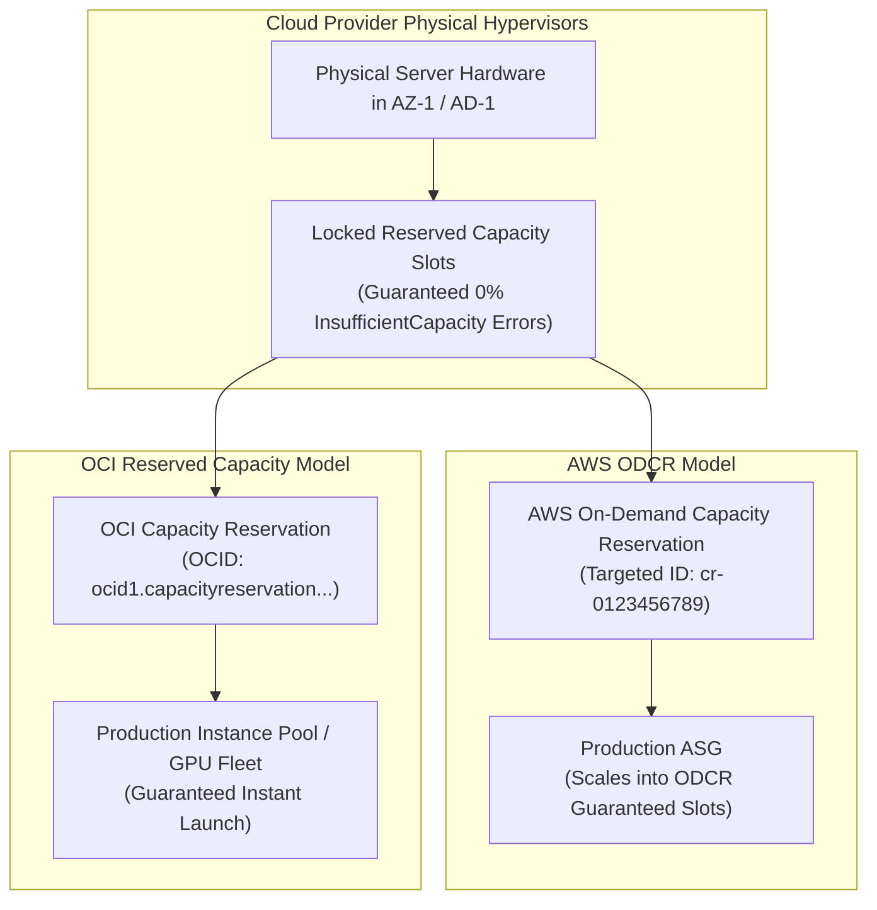

#### AWS Implementation
Create a targeted AWS On-Demand Capacity Reservation and launch an instance into it [Doc: AWS Capacity Reservations CLI, checked 2026]:

```bash
# Step 1: Create a targeted Capacity Reservation for 10 c6i.2xlarge instances in us-east-1a
RES_ID=$(aws ec2 create-capacity-reservation \
  --instance-type "c6i.2xlarge" \
  --instance-platform "Linux/UNIX" \
  --availability-zone "us-east-1a" \
  --instance-count 10 \
  --instance-match-criteria "targeted" \
  --query 'CapacityReservation.CapacityReservationId' \
  --output text)

echo "Created Capacity Reservation: $RES_ID"

# Step 2: Launch an EC2 instance explicitly targeting this Capacity Reservation
aws ec2 run-instances \
  --image-id "ami-0123456789abcdef0" \
  --instance-type "c6i.2xlarge" \
  --subnet-id "subnet-0a1b2c3d4e" \
  --capacity-reservation-specification "CapacityReservationTarget={CapacityReservationId=$RES_ID}"
```

#### OCI Implementation
Create an OCI Capacity Reservation and launch an instance into it using OCI CLI [Doc: OCI Capacity Reservations CLI, checked 2026]:

```bash
# Step 1: Create a Capacity Reservation in Ashburn AD-1 for 4 Flexible VM shapes
cat << 'EOF' > oci-cap-res.json
{
  "compartmentId": "ocid1.compartment.oc1..aaaaaaaam7...",
  "displayName": "DR-Guaranteed-Compute-Reservation",
  "availabilityDomain": "UwhS:US-ASHBURN-AD-1",
  "instanceReservationConfigs": [
    {
      "instanceShape": "VM.Standard.E5.Flex",
      "instanceShapeConfig": { "ocpus": 8, "memoryInGBs": 64 },
      "reservedCount": 4
    }
  ]
}
EOF

CAP_RES_ID=$(oci compute capacity-reservation create --from-json file://oci-cap-res.json --query 'data.id' --output text)

# Step 2: Launch Compute Instance consuming the Capacity Reservation
oci compute instance launch \
  --compartment-id ocid1.compartment.oc1..aaaaaaaam7... \
  --availability-domain "UwhS:US-ASHBURN-AD-1" \
  --shape "VM.Standard.E5.Flex" \
  --shape-config '{"ocpus": 8, "memoryInGBs": 64}' \
  --capacity-reservation-id "$CAP_RES_ID" \
  --subnet-id ocid1.subnet.oc1.iad.aaaaaaaaprod... \
  --image-id ocid1.image.oc1.iad.aaaaaaaaxample...
```

#### Common Trap
Configuring AWS Capacity Reservations with `instance-match-criteria: open` in a multi-tenant development account. Because `open` reservations allow *any* instance matching the instance type and AZ to consume the reservation, developers spinning up test instances will unknowingly consume your expensive, reserved disaster-recovery capacity slots. Production capacity reservations must always use `instance-match-criteria: targeted`, requiring explicit authorization to attach.

#### Follow-up Question
How do AWS Capacity Blocks for ML differ from standard On-Demand Capacity Reservations when reserving predictable, contiguous NVIDIA H100 GPU clusters for high-performance distributed training runs?

---

### Q369: Cost Optimization & Commitment Models: Savings Plans vs OCI Universal Credits

#### Question
How do enterprise cloud procurement and FinOps teams leverage commitment discounts to achieve 30–72% compute cost reductions, and how do AWS Compute Savings Plans / EC2 Instance Savings Plans compare to OCI Annual Universal Credits and Committed Use Discounts?

#### Short Answer
Both AWS and OCI reward enterprises for predictable spend commitments. **AWS Savings Plans** require committing to a consistent dollar-per-hour compute spend (e.g., \$100/hour) for a 1- or 3-year term. AWS offers **Compute Savings Plans** (maximum flexibility: applies automatically across EC2, Fargate, and Lambda regardless of family, region, OS, or tenancy, saving up to 66%) and **EC2 Instance Savings Plans** (tied to a specific instance family in a specific region, saving up to 72%). **OCI Universal Credits** offers a unified commitment model: customers commit to an annual spend amount, receiving aggressive upfront discounts across *all* current and future OCI IaaS/PaaS services, combined with **Committed Use Discounts** for dedicated hardware and compute shapes.

#### Deep Answer
Uncommitted On-Demand cloud compute carries a 30% to 70% pricing premium. FinOps maturity requires analyzing historical compute baselines and locking in commitments for predictable foundation workloads.

**1. AWS Commitment Mechanics (Savings Plans vs Reserved Instances)**:
- **Compute Savings Plans**:
  - Committed as `$/hour` (e.g., \$50/hour).
  - Automatically discounts any eligible compute: switching an application from an Intel `c5.2xlarge` in `us-east-1` to an ARM Graviton `c7g.2xlarge` in `eu-west-1` or AWS Fargate in `us-west-2` continues applying the discount seamlessly.
- **EC2 Instance Savings Plans**:
  - Committed to an instance family within a single region (e.g., `m6i` family in `us-east-1`).
  - Less flexible, but offers higher discounts (up to 72%). Allows changing size within the family (e.g., two `m6i.xlarge` equal one `m6i.2xlarge`).
- **Payment Options**: `No Upfront`, `Partial Upfront` (balances cash flow and discount depth), and `All Upfront` (maximum discount).

**2. OCI Commitment Mechanics (Universal Credits & Annual Commitments)**:
- **Annual Universal Credits (UCC)**:
  - Unlike AWS's per-service commitment, OCI Universal Credits apply universally across Compute, Storage, Database, Networking, and AI services.
  - Customers commit to an annual dollar figure (e.g., \$500,000/year). OCI draws down monthly from this credit pool with volume discounts of 30% to 50% applied across the entire tenancy [Doc: OCI Universal Credits Pricing, checked 2026].
- **Committed Use Discounts**:
  - Specific shape-level commitments (e.g., 1-year or 3-year commitments on Bare Metal GPU shapes or Exadata Cloud Infrastructure) that provide guaranteed rates and capacity allocations.

| Dimension | AWS Compute Savings Plans | AWS EC2 Instance Savings Plans | OCI Annual Universal Credits |
| :--- | :--- | :--- | :--- |
| **Commitment Unit** | Dollar per hour spend (\$X/hr) | Dollar per hour spend (\$X/hr) | Total annual dollar pool (\$X/yr) |
| **Cross-Region Portability**| Yes (Global across all regions) | No (Locked to single region) | Yes (Global across all tenancies) |
| **Cross-Family Portability**| Yes (c5 $\rightarrow$ m6g $\rightarrow$ Fargate) | No (Locked to instance family) | Yes (Compute, DB, Storage, AI) |
| **Discount Depth** | Up to 66% | Up to 72% | Up to 50%+ across portfolio |
| **Term Length** | 1 Year or 3 Years | 1 Year or 3 Years | 1 Year to 5 Years |

#### Architecture
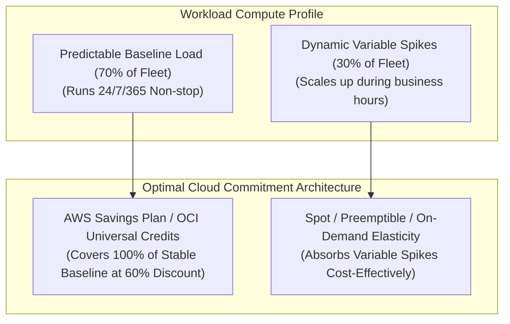

#### AWS Implementation
Evaluate Savings Plans utilization and purchase recommendations via AWS Cost Explorer CLI [Doc: AWS Savings Plans CLI, checked 2026]:

```bash
# Query Savings Plans coverage and recommended hourly commitment
aws ce get-savings-plans-purchase-recommendation \
  --savings-plans-type "COMPUTE_SP" \
  --term-in-years "ONE_YEAR" \
  --payment-option "PARTIAL_UPFRONT" \
  --lookback-period-in-days "THIRTY_DAYS"

# Purchase a Compute Savings Plan committing to $25.00/hour for 1 Year
aws savingsplans create-savings-plan \
  --savings-plan-offering-id "sp-offering-1111-2222-3333" \
  --commitment "25.00" \
  --upfront-payment-amount "109500.00"
```

#### OCI Implementation
Track Universal Credit consumption and budget drawdowns using OCI CLI [Doc: OCI Usage and Billing CLI, checked 2026]:

```bash
# Query active Universal Credit balance and monthly forecast in OCI
oci usage-api usage-summary request-summarized-usages \
  --tenant-id ocid1.tenancy.oc1..aaaaaaaaxample \
  --time-usage-started "2026-03-01T00:00:00Z" \
  --time-usage-ended "2026-03-31T23:59:59Z" \
  --granularity "MONTHLY" \
  --query-type "COST"

# Set an alert when actual commitment consumption breaches 90% of monthly budget
oci budget budget create \
  --compartment-id ocid1.tenancy.oc1..aaaaaaaaxample \
  --amount 45000.00 \
  --reset-period "MONTHLY" \
  --display-name "Universal-Credits-Monthly-Threshold"
```

#### Common Trap
Committing 100% of peak capacity to a 3-year all-upfront Savings Plan. If an architecture is modernized (e.g., re-platforming from EC2 VMs to Serverless Lambda or containerizing on Kubernetes with ARM Graviton chips), a rigid 3-year EC2 Instance Savings Plan locks the enterprise into paying for obsolete instance families. FinOps best practice recommends committing to only **70–80% of minimum baseline capacity** using flexible Compute Savings Plans or OCI Universal Credits, letting spot and elastic on-demand handle the variable peaks.

#### Follow-up Question
How do AWS Cost Allocation Tags and OCI Defined Cost-Tracking Tags enable automated chargeback and showback of commitment discounts across hundreds of internal product engineering teams?

---

### Q370: Thundering Herd & Autoscaling Thrashing: Jitter, Cooldowns & Hysteresis

#### Question
How do cloud distributed systems mitigate "Thundering Herd" problems, cache stampedes, and autoscaling thrashing (rapid, continuous scale-out and scale-in oscillations), and how are exponential backoff with full jitter and hysteresis deadbands mathematically configured?

#### Short Answer
**Autoscaling Thrashing** occurs when a system scales out in response to a load spike, and then immediately scales in because adding new capacity causes average utilization to drop below the scale-in threshold, triggering a continuous cycle of instance launches and terminations. This is solved by configuring **Hysteresis Deadbands** (a wide separation between scale-out and scale-in thresholds) and scale-in cooldown timers. The **Thundering Herd** problem occurs when thousands of clients or autoscaled instances retry a failed downstream service simultaneously upon recovery. This is prevented by implementing **Exponential Backoff with Full Jitter**: introducing randomized delays to disperse traffic evenly across time.

#### Deep Answer
Instability in elastic cloud systems usually stems from synchronous coupling and lack of damping in feedback loops.

**1. The Mathematical Physics of Autoscaling Thrashing**:
- Suppose an ASG has 4 instances running at $85\%$ CPU.
- Scale-out policy: Add 4 instances if $\text{CPU} > 80\%$.
- Scale-in policy: Remove 4 instances if $\text{CPU} < 60\%$.
- When 4 instances are added (total 8), the exact same workload is now distributed across 8 instances, dropping average CPU to:
  $$\text{New CPU} = 85\% \times \frac{4}{8} = 42.5\%$$
- Because $42.5\% < 60\%$, the scale-in policy triggers immediately, terminating 4 instances.
- The 4 remaining instances jump back to $85\%$ CPU, and the cycle repeats endlessly.
- **Hysteresis Solution**:
  - The scale-in threshold must be mathematically lower than the post-scaling fractional capacity:
    $$\text{Scale-In Threshold} < \text{Scale-Out Threshold} \times \left(\frac{N}{N + \Delta N}\right)$$
  - Scale-in cooldowns (e.g., 300 to 600 seconds) and stabilization windows force the autoscaler to observe sustained low utilization before committing to instance termination.

**2. Thundering Herd & Cache Stampede**:
- When a shared cache node (Redis/Memcached) crashes or an outage clears, all 10,000 client threads simultaneously miss the cache and hammer the backend database with identical SQL queries.
- **Full Jitter Algorithm (AWS Standard)**:
  $$\text{Sleep Time} = \text{random}(0, \min(M, B \times 2^{\text{attempt}}))$$
  where $B$ is base backoff (e.g., $100\text{ms}$) and $M$ is max backoff (e.g., $30\text{s}$). Full jitter spreads retries uniformly, flattening retry spikes into smooth, manageable traffic distributions [Doc: AWS Exponential Backoff and Jitter, checked 2026].

#### Architecture
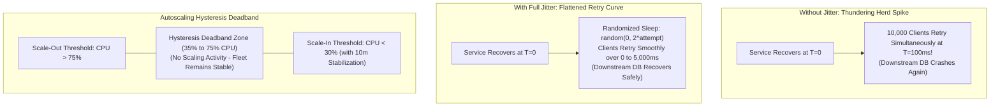

#### AWS Implementation
Implement Exponential Backoff with Full Jitter in Python client code and configure ASG scale-in stabilization windows [Doc: AWS Architecture Jitter Reference, checked 2026]:

```python
# Full Jitter Retry Implementation (AWS Architecture Standard)
import random
import time

def call_downstream_service_with_jitter(max_retries=5, base_delay=0.1, max_delay=10.0):
    for attempt in range(max_retries):
        try:
            return execute_database_query()
        except Exception as e:
            if attempt == max_retries - 1:
                raise e
            # Exponential cap
            temp = min(max_delay, base_delay * (2 ** attempt))
            # Full Jitter: uniformly distributed between 0 and temp
            sleep_duration = random.uniform(0, temp)
            print(f"Attempt {attempt+1} failed. Backing off with jitter for {sleep_duration:.3f}s...")
            time.sleep(sleep_duration)

def execute_database_query():
    # Transactional logic
    pass
```

```bash
# Configure 10-minute scale-in stabilization window in CloudWatch Alarm
aws cloudwatch put-metric-alarm \
  --alarm-name "AppScaleInDampened" \
  --metric-name "CPUUtilization" \
  --namespace "AWS/EC2" \
  --statistic "Average" \
  --period 300 \
  --evaluation-periods 2 \
  --datapoints-to-alarm 2 \
  --threshold 30.0 \
  --comparison-operator "LessThanThreshold"
```

#### OCI Implementation
Configure Autoscaling Hysteresis thresholds and cooldown periods in an OCI Autoscaling Policy [Doc: OCI Autoscaling Policies CLI, checked 2026]:

```bash
# Create an Autoscaling Policy with wide Hysteresis (Scale-out >75%, Scale-in <25%)
cat << 'EOF' > oci-hysteresis-policy.json
{
  "compartmentId": "ocid1.compartment.oc1..aaaaaaaam7...",
  "displayName": "Damped-Hysteresis-Policy",
  "resource": {
    "type": "instancePool",
    "id": "ocid1.instancepool.oc1.iad.aaaaaaaaxample..."
  },
  "policies": [
    {
      "policyType": "threshold",
      "displayName": "anti-thrashing-threshold",
      "capacity": { "min": 3, "max": 15, "initial": 3 },
      "rules": [
        {
          "displayName": "Scale-Out-Rule",
          "action": { "type": "CHANGE_COUNT_BY", "value": 2 },
          "metric": {
            "metricType": "CPU_UTILIZATION",
            "threshold": { "operator": "GT", "value": 75 }
          }
        },
        {
          "displayName": "Scale-In-Rule",
          "action": { "type": "CHANGE_COUNT_BY", "value": -1 },
          "metric": {
            "metricType": "CPU_UTILIZATION",
            "threshold": { "operator": "LT", "value": 25 }
          }
        }
      ],
      "coolDownInSeconds": 600
    }
  ],
  "isEnabled": true
}
EOF

oci autoscaling configuration create --from-json file://oci-hysteresis-policy.json
```

#### Common Trap
Configuring identical scale-out and scale-in metric thresholds (e.g., scale out if CPU > 60%, scale in if CPU < 60%). This guarantees immediate autoscaling thrashing: the second new instances join and dilute the load, CPU drops to 59%, triggering termination. Within minutes, instances terminate, CPU jumps to 61%, triggering launches. This oscillation burns cloud API quotas and degrades user sessions indefinitely.

#### Follow-up Question
How does token-bucket rate limiting on client retries (client-side circuit breakers) prevent retry storms from prolonging downstream outages during cascading recovery?

---

### Q371: Disaster Recovery Capacity Planning: Pilot Light vs Warm Standby Autoscaling

#### Question
How do cloud architects engineer automated autoscaling triggers to transition secondary regions from a minimal "Pilot Light" or "Warm Standby" footprint into full production capacity during cross-region disaster recovery (DR) failovers, and what are the primary bottleneck risks of regional capacity exhaustion?

#### Short Answer
Cross-region Disaster Recovery architectures balance recovery time objectives (RTO) against idle infrastructure costs. **Pilot Light** maintains critical core data replication (databases, storage) in the DR region with compute scaled to **zero** (or minimal bastion hosts); upon failover, automation triggers an emergency multi-stage scale-out of ASGs/Instance Pools to 100% capacity (RTO: 15–30 minutes). **Warm Standby** maintains a scaled-down, functional production footprint (e.g., 20% capacity) running 24/7 in the DR region, actively serving canaries or read traffic; upon failover, DNS shifts immediately while autoscaling policies scale the remaining 80% dynamically (RTO: 2–5 minutes). The critical risk is **Regional Capacity Exhaustion**: if thousands of enterprises fail over to the same secondary region simultaneously, On-Demand VM launches fail unless backed by Capacity Reservations.

#### Deep Answer
When a primary cloud region (e.g., `us-east-1` or `us-ashburn-1`) suffers an unprecedented catastrophic outage, regional DNS failover (Route 53 or OCI Traffic Management) redirects millions of users to the secondary DR region (`us-west-2` or `us-phoenix-1`).

**1. DR Architecture Topology Comparison**:
- **Pilot Light**:
  - *Normal Operations*: Database read replicas run in DR; object storage is replicated via S3 CRR / OCI Replication; compute ASG has `min: 0`, `desired: 0`.
  - *Failover Phase*: EventBridge / OCI Events detects failover $\rightarrow$ promotes database read replica to standalone primary $\rightarrow$ updates ASG desired capacity from 0 to 50 VMs $\rightarrow$ targets warm up $\rightarrow$ DNS flips.
  - *Trade-off*: Lowest idle cost, but highest RTO (15–30 minutes) and extreme vulnerability to `InsufficientInstanceCapacity` errors during a major regional crisis.
- **Warm Standby**:
  - *Normal Operations*: A fully functional mini-fleet (e.g., 4 instances) runs continuously behind the secondary load balancer, executing periodic synthetic checks and serving read queries.
  - *Failover Phase*: DNS points 100% of global traffic to the secondary ALB. The sudden traffic burst immediately trips Target Tracking or Step Scaling policies, scaling capacity from 4 to 40 instances within 3–5 minutes.
  - *Trade-off*: Higher running costs, but drastically faster RTO and verified operational readiness.

**2. Mitigating Regional Capacity Failover Collapses**:
- During a major public cloud regional incident, everyone attempts to spin up compute in the designated backup region simultaneously.
- SREs must pre-provision **On-Demand Capacity Reservations (AWS ODCR)** or **OCI Reserved Capacity** in the secondary region. These reservations guarantee that when the Pilot Light script executes `desired_capacity: 50`, the physical hypervisors are contractually and physically reserved [Doc: AWS Disaster Recovery Whitepaper, checked 2026].

#### Architecture
```mermaid
graph TD
    subgraph "Primary Region (US-East / Ashburn) - OUTAGE!"
        PRIMARY_APP["Primary Fleet (100% Capacity) - DOWN!"]
    end

    subgraph "Global Traffic Routing"
        DNS["Route 53 / OCI Traffic Management\n(Health Checks Detect Failure -> Shifts to DR)"]
    end

    subgraph "Secondary DR Region (US-West / Phoenix)"
        subgraph "Warm Standby Pattern"
            WARM_LB["DR Load Balancer"]
            MINI_FLEET["20% Baseline Fleet (4 VMs)\n(Actively Processing Canary Requests)"]
            STEP_SCALE["Step Scaling / Target Tracking\n(Instantly bursts to 40 VMs upon DNS shift)"]
            WARM_LB --> MINI_FLEET
            MINI_FLEET --> STEP_SCALE
        end
        
        subgraph "Guaranteed Hardware Sourcing"
            CAP_RES["Capacity Reservations (ODCR / Reserved Capacity)\n(Guarantees physical hypervisor slots)"]
            STEP_SCALE -.->|Draws Capacity from| CAP_RES
        end
    end

    DNS -.->|Failover Traffic| WARM_LB
```

#### AWS Implementation
Automate DR Auto Scaling Group expansion and Route 53 failover using AWS CLI [Doc: Route 53 Health Checks and Failover, checked 2026]:

```bash
# Step 1: Promote Aurora Cross-Region Read Replica to Primary in DR Region (us-west-2)
aws rds promote-read-replica \
  --db-instance-identifier "prod-aurora-dr-replica" \
  --region us-west-2

# Step 2: Scale Pilot Light ASG from 0 to Full Production Capacity (20 Instances)
aws autoscaling update-auto-scaling-group \
  --auto-scaling-group-name "dr-production-app-asg" \
  --region us-west-2 \
  --min-size 10 \
  --max-size 40 \
  --desired-capacity 20

# Step 3: Monitor In-Service Instance Count in DR Region
aws autoscaling describe-auto-scaling-groups \
  --auto-scaling-group-names "dr-production-app-asg" \
  --region us-west-2 \
  --query "AutoScalingGroups[0].Instances[?LifecycleState=='InService'] | length(@)"
```

#### OCI Implementation
Automate DR Instance Pool scaling in the secondary region using OCI CLI [Doc: OCI Traffic Management Failover Steering, checked 2026]:

```bash
# Step 1: Scale DR Instance Pool in Phoenix from Standby (2 VMs) to Production (16 VMs)
oci compute-management instance-pool update \
  --instance-pool-id ocid1.instancepool.oc1.phx.aaaaaaaadrpool... \
  --size 16 \
  --region "us-phoenix-1"

# Step 2: Switch OCI Traffic Management Steering Policy to point to DR Load Balancer
cat << 'EOF' > dr-traffic-failover.json
{
  "ruleList": [
    {
      "ruleType": "FAILOVER",
      "primaryPool": "phoenix-lb-pool",
      "backupPool": "ashburn-lb-pool"
    }
  ]
}
EOF

oci dns steering-policy update \
  --steering-policy-id ocid1.steeringpolicy.oc1..aaaaaaaaxample... \
  --template-details file://dr-traffic-failover.json
```

#### Common Trap
Relying on reactive autoscaling to scale from a 10% Warm Standby to 100% capacity during a catastrophic DNS cutover without warming up database connection pools. When 100% of global traffic hits the 10% standby instances, their CPU instantly hits 100%, and incoming requests time out before the autoscaler can boot replacement VMs. During a controlled or emergency failover, automation must execute a **proactive forced capacity expansion** (e.g., immediately updating `desired-capacity` to 100%) rather than waiting for reactive metric alarms.

#### Follow-up Question
How do you structure database cross-region read-replica failover to ensure zero data loss (RPO = 0) when switching from asynchronous to synchronous replication models during disaster declarations?

---

### Q372: Big Data & Batch Autoscaling: AWS EMR Managed Scaling vs OCI Big Data Service

#### Question
How do distributed data processing frameworks (Apache Spark, Hadoop, Presto/Trino) dynamically autoscale compute workers based on active task queue backlog, and how do AWS EMR Managed Scaling and OCI Big Data Service / Data Flow compare in resource management and node decommissioning?

#### Short Answer
Autoscaling distributed data engines requires deep integration with framework resource managers (YARN, Spark Standalone, Kubernetes). Scaling worker nodes naively based on standard VM CPU utilization crashes active queries because terminating a node containing intermediate Spark shuffle files or HDFS blocks forces expensive stage recomputations. **AWS EMR Managed Scaling** inspects internal YARN and Spark metrics (such as `ContainerPendingRatio` and `ShuffleDataStored`) every 30 seconds, automatically scaling Task and Core nodes with **Graceful Decommissioning** (waiting for active Spark tasks and shuffle data transfers to complete before terminating instances). **OCI Big Data Service (BDS)** and **OCI Data Flow** (serverless Apache Spark) scale executor pools dynamically based on pending stage backlogs, leveraging OCI Object Storage as an externalized, persistent shuffle/data layer to decouple compute elasticity from data loss.

#### Deep Answer
Traditional VM autoscaling operates on the assumption that any worker node can be killed at any time. In big data analytics, this assumption breaks down:
- In Apache Spark, a worker node stores **Shuffle Data** (intermediate map outputs needed by downstream reduce tasks) in local NVMe disk storage.
- If an autoscaler terminates an instance while downstream reduce tasks are reading its shuffle partitions, Spark throws `FetchFailedException`, invalidates the entire stage, and re-executes the entire upstream pipeline from scratch, turning a 10-minute job into a 2-hour failure.

**1. AWS EMR Managed Scaling Mechanics**:
- **Continuous Workload Evaluation**: Evaluates cluster metrics every 30 seconds:
  - `YARNMemoryAvailablePercentage`
  - `ContainerPendingRatio` (pending containers divided by allocated containers)
  - Spark pending tasks and executor queue depth.
- **Node Classification**:
  - **Primary / Master Node**: Runs YARN ResourceManager and HDFS NameNode. Never scales.
  - **Core Nodes**: Run DataNode and NodeManager; host HDFS blocks. Scaled cautiously.
  - **Task Nodes**: Pure compute workers; run NodeManager without HDFS. Scaled aggressively using Spot instances [Doc: AWS EMR Managed Scaling Guide, checked 2026].
- **Graceful Decommissioning**:
  - When scaling in, EMR stops scheduling new tasks on target nodes.
  - Waits up to a configurable timeout (e.g., 3,600s) for active tasks to finish and replicates local shuffle files to remaining nodes before terminating the VM.

**2. OCI Big Data Service & OCI Data Flow**:
- **OCI Big Data Service (BDS)**:
  - Managed Hadoop/Spark clusters. Autoscaling policies monitor YARN available memory and CPU.
  - Supports scaling worker node pools dynamically across Fault Domains.
- **OCI Data Flow (Serverless Spark Engine)**:
  - Completely eliminates cluster management.
  - SREs submit Spark jobs; OCI Data Flow allocates Spark driver and executor nodes on-demand.
  - Features **Dynamic Allocation**: Spark executors scale up when stages queue and scale down to zero when stages complete, reading and writing directly to OCI Object Storage via the high-speed OCI Object Storage connector [Doc: OCI Data Flow Serverless Spark, checked 2026].

#### Architecture
```mermaid
graph TD
    subgraph "Big Data Processing Workload"
        JOB["Apache Spark Job (Multi-Stage DAG)\nMap Stage -> Shuffle Write -> Reduce Stage"]
    end

    subgraph "AWS EMR Managed Scaling Architecture"
        EMR_MGT["EMR Managed Scaling Engine\n(Evaluates ContainerPendingRatio every 30s)"]
        CORE["Core Nodes (HDFS + Compute)"]
        TASK_SPOT["Task Nodes (Pure Compute / Spot Instances)\n(Scales from 5 to 50 Workers Dynamically)"]
        DECOM["Graceful Decommissioner\n(Preserves Shuffle Files during scale-in)"]
        
        JOB --> EMR_MGT
        EMR_MGT --> TASK_SPOT
        EMR_MGT --> CORE
        TASK_SPOT --> DECOM
    end

    subgraph "OCI Data Flow Serverless Architecture"
        DF_CTRL["OCI Data Flow Control Plane"]
        SPARK_EXEC["Ephemeral Spark Executors (Dynamic Allocation)\n(Scales linearly with stage partitions)"]
        OCI_OBJ[("OCI Object Storage\n(Externalized Decoupled Data & Shuffle Lake)")]
        
        JOB --> DF_CTRL
        DF_CTRL --> SPARK_EXEC
        SPARK_EXEC --> OCI_OBJ
    end
```

#### AWS Implementation
Enable EMR Managed Scaling on an EMR cluster using the AWS CLI [Doc: AWS EMR Managed Scaling CLI, checked 2026]:

```bash
# Attach Managed Scaling Policy to an Amazon EMR cluster
aws emr put-managed-scaling-policy \
  --cluster-id "j-1234567890ABC" \
  --managed-scaling-policy '{
    "ComputeLimits": {
      "UnitType": "Instances",
      "MinimumCapacityUnits": 4,
      "MaximumCapacityUnits": 60,
      "MaximumOnDemandCapacityUnits": 10,
      "MaximumCoreCapacityUnits": 10
    }
  }'

# Query current scaling metrics and cluster capacity
aws emr describe-cluster \
  --cluster-id "j-1234567890ABC" \
  --query "Cluster.NormalizedInstanceHours"
```

#### OCI Implementation
Submit a serverless, auto-scaling Apache Spark application using OCI Data Flow CLI [Doc: OCI Data Flow CLI, checked 2026]:

```bash
# Create and execute a serverless auto-scaling Spark application in OCI Data Flow
cat << 'EOF' > oci-dataflow-app.json
{
  "compartmentId": "ocid1.compartment.oc1..aaaaaaaam7...",
  "displayName": "Enterprise-ETL-AutoScaling-Job",
  "sparkVersion": "3.5.0",
  "driverShape": "VM.Standard.E5.Flex",
  "driverShapeConfig": { "ocpus": 4, "memoryInGBs": 32 },
  "executorShape": "VM.Standard.E5.Flex",
  "executorShapeConfig": { "ocpus": 8, "memoryInGBs": 64 },
  "numExecutors": 2,
  "maxNumExecutors": 30,
  "fileUri": "oci://spark-scripts@enterprise-telemetry/etl_processor.py",
  "logsBucketUri": "oci://spark-logs@enterprise-telemetry/"
}
EOF

oci data-flow application create --from-json file://oci-dataflow-app.json
```

#### Common Trap
Enabling standard EC2 Auto Scaling Group termination policies on big data worker nodes instead of EMR Managed Scaling or framework-native autoscalers. A generic ASG knows nothing about Spark shuffle stages; it will terminate an instance mid-job because CPU briefly dropped during a barrier synchronization step. This causes cascading `FetchFailed` errors, forcing Spark to repeatedly re-compute stages until the job exceeds maximum retry limits and fails completely.

#### Follow-up Question
How does the Spark External Shuffle Service (or Remote Shuffle Service - RSS) decouple shuffle partition storage from ephemeral worker node lifecycles, enabling instant node termination without data loss?

---

### Q373: GPU & AI/ML Autoscaling: SageMaker / Karpenter GPU vs OCI Supercluster

#### Question
How do cloud platforms scale heterogeneous GPU compute clusters for AI training and low-latency LLM inference, and how do AWS SageMaker / EKS Karpenter GPU autoscaling compare to OCI Supercluster and AI Infrastructure capacity management?

#### Short Answer
AI and machine learning workloads require scaling specialized hardware accelerators (NVIDIA H100, A100, L4, L40S, AWS Inferentia/Trainium). **LLM Inference** scaling requires monitoring accelerator-level metrics (**GPU Duty Cycle**, **GPU Memory Utilization**, and inference engine **vLLM / TensorRT-LLM KV-cache memory usage**) rather than host CPU. AWS achieves this via **SageMaker Endpoints Autoscaling** (scaling instances or variant weights based on `InvocationsPerInstance`) and **Karpenter on EKS** (dynamically provisioning GPU nodes matching pod CUDA requirements). **OCI Supercluster and AI Infrastructure** delivers ultra-scale AI training using bare-metal clusters interconnected via **Cluster Networking with RoCE v2 (RDMA over Converged Ethernet)**, offering predictable capacity reservations and high-performance network fabrics for multi-node distributed training (Megatron-LM, DeepSpeed).

#### Deep Answer
Scaling machine learning workloads diverges significantly from standard CPU web services due to GPU memory constraints and distributed tensor parallelism.

**1. Inference Autoscaling Metrics (Why CPU is Irrelevant)**:
- In Large Language Model (LLM) serving engines (vLLM, HuggingFace TGI, TensorRT-LLM), models are loaded permanently into GPU VRAM (e.g., 80GB on an NVIDIA A100/H100).
- Host CPU utilization typically sits below 10%.
- **Bottleneck Metrics for Autoscaling**:
  - `GPU Memory Utilization`: Tracks memory allocated to model weights and dynamic KV-caches.
  - `KV-Cache Block Usage`: When KV-cache memory hits 100%, the inference server must preempt active tokens or reject incoming requests.
  - `Concurrency / Queue Backlog`: Number of requests waiting in the inference engine's PagedAttention queue.

**2. AWS AI Autoscaling Architecture**:
- **SageMaker Managed Inference**: Supports Target Tracking on `InvocationsPerInstance` or custom GPU metrics. When scaling out, SageMaker handles container pulling and GPU driver initialization.
- **EKS with Karpenter GPU NodePools**: Pods request `resources.limits: { nvidia.com/gpu: 1 }`. Karpenter recognizes the GPU resource requirement, inspects EC2 capacity, and provisions an instance from the `g5`, `g6`, or `p4d/p5` families, automatically labeling the node with the appropriate CUDA driver tags [Doc: AWS Karpenter GPU Provisioning, checked 2026].

**3. OCI Supercluster & AI Infrastructure Architecture**:
- **The Scale of AI Training**: Large model training requires thousands of GPUs communicating synchronously via `AllReduce` operations. Standard TCP networking causes severe parameter synchronization stalls.
- **OCI Supercluster**:
  - Interconnects up to 65,536 NVIDIA H100 GPUs using **RoCE v2 RDMA** running over non-blocking 3.2 Tbps fabrics per node [Doc: OCI AI Supercluster Architecture, checked 2026].
  - Employs dedicated **Capacity Reservations** for bare-metal shapes (`BM.GPU.H100.8`), ensuring clusters remain contiguous within the same physical data center hall to minimize optical latency.

#### Architecture
```mermaid
graph TD
    subgraph "Inference Traffic (LLM Prompts)"
        PROMPTS["User Prompts / API Requests\n(High Concurrency Surge)"]
    end

    subgraph "AWS Inference Scaling"
        SAGE["SageMaker Endpoint / EKS Karpenter"]
        KV_METRIC["Metric: vLLM KV-Cache Usage > 80%\nOr InvocationsPerInstance > 50"]
        GPU_FLEET["GPU Worker Pods\n(NVIDIA L4 / A10G / H100)"]
        PROMPTS --> SAGE
        SAGE --> KV_METRIC
        KV_METRIC -->|Scale Out 45s| GPU_FLEET
    end

    subgraph "OCI AI Supercluster Architecture"
        TRAIN_JOB["Distributed Training Run (32k GPUs)"]
        RDMA["RoCE v2 RDMA Network Fabric\n(3.2 Tbps Non-blocking Bandwidth)"]
        BM_H100["OCI Bare Metal H100 GPU Clusters\n(Contractual Capacity Reservation)"]
        TRAIN_JOB --> RDMA
        RDMA --> BM_H100
    end
```

#### AWS Implementation
Configure SageMaker Target Tracking Autoscaling based on `InvocationsPerInstance` using AWS CLI [Doc: AWS SageMaker Endpoint Autoscaling, checked 2026]:

```bash
# Step 1: Register SageMaker Endpoint with Application Auto Scaling
aws application-autoscaling register-scalable-target \
  --service-namespace "sagemaker" \
  --resource-id "endpoint/llm-inference-endpoint/variant/AllTraffic" \
  --scalable-dimension "sagemaker:variant:DesiredInstanceCount" \
  --min-capacity 2 \
  --max-capacity 16

# Step 2: Configure Target Tracking Policy (Scale when invocations per instance exceed 50)
aws application-autoscaling put-scaling-policy \
  --service-namespace "sagemaker" \
  --resource-id "endpoint/llm-inference-endpoint/variant/AllTraffic" \
  --scalable-dimension "sagemaker:variant:DesiredInstanceCount" \
  --policy-name "InvocationsTargetTracking" \
  --policy-type "TargetTrackingScaling" \
  --target-tracking-scaling-policy-configuration '{
    "TargetValue": 50.0,
    "PredefinedMetricSpecification": {
      "PredefinedMetricType": "SageMakerVariantInvocationsPerInstance"
    },
    "ScaleInCooldown": 600,
    "ScaleOutCooldown": 60
  }'
```

#### OCI Implementation
Deploy a high-performance GPU compute node pool for distributed AI workloads on OCI OKE using OCI CLI [Doc: OCI OKE GPU Node Pools, checked 2026]:

```bash
# Provision an OCI OKE Node Pool using NVIDIA A10 Tensor Core GPU shapes
oci ce node-pool create \
  --cluster-id ocid1.cluster.oc1.iad.aaaaaaaaxample... \
  --compartment-id ocid1.compartment.oc1..aaaaaaaam7... \
  --name "gpu-inference-pool" \
  --node-shape "VM.GPU.A10.2" \
  --node-shape-config '{"ocpus": 30, "memoryInGBs": 480}' \
  --size 4 \
  --placement-configurations '[{
    "availabilityDomain": "UwhS:US-ASHBURN-AD-1",
    "subnetId": "ocid1.subnet.oc1.iad.aaaaaaaasubnet..."
  }]' \
  --node-metadata '{"user_data": "IyEvYmluL2Jhc2gKZXhwb3J0IE5WSURJQV9WSVNJQkxFX0RFVklDRVM9YWxsCg=="}'
```

#### Common Trap
Using standard container container image registries without pre-caching or lazy-loading when scaling GPU inference pods. LLM container images containing CUDA drivers, PyTorch, and model weights frequently exceed 15GB to 50GB in size. Pulling a 30GB image over the network upon scale-out takes 5 to 10 minutes, completely defeating the purpose of autoscaling during an emergency traffic spike. SREs must use **OCI Image Caching** or **AWS Spegel / Dragonfly P2P / eStargz lazy-loading** to allow containers to begin booting before the full image finishes downloading.

#### Follow-up Question
How does Tensor Parallelism (TP) across multiple GPUs within a single node interact with Pipeline Parallelism (PP) across multiple nodes over RoCE networks during large model scaling?

---

### Q374: Queue-Based Backlog Autoscaling: Backlog Per Worker vs Raw Message Count

#### Question
Why does autoscaling asynchronous worker fleets based on raw queue message count lead to severe capacity thrashing, and how do cloud engineers formulate and implement the "Backlog Per Worker" metric across AWS SQS and OCI Streaming?

#### Short Answer
Scaling on raw queue depth (e.g., "Add 1 instance if messages > 1,000") is flawed because it ignores current fleet processing capacity: a queue with 1,000 messages being consumed by 50 workers is completely healthy (20 messages/worker), whereas the same 1,000 messages with 1 worker represents a severe backlog. The correct mathematical formula is **Backlog Per Worker** (or **Acceptable Backlog Per Instance**):
$$\text{Backlog Per Worker} = \frac{\text{ApproximateNumberOfMessages}}{\text{InService Instances}}$$
By setting an acceptable target backlog (e.g., 50 messages per worker) based on message processing latency and desired SLA, the autoscaler adds or terminates the exact mathematical number of instances required to clear the backlog within the SLA window without over-provisioning.

#### Deep Answer
Asynchronous worker autoscaling is fundamentally a queueing theory problem (Little's Law: $L = \lambda W$).

**1. The Mathematical Formulation of Backlog Per Worker**:
- Let $T_{\text{process}}$ be the average time to process one message (e.g., 2 seconds).
- Let $T_{\text{SLA}}$ be the maximum acceptable latency for a message to sit in the queue (e.g., 60 seconds).
- The maximum acceptable backlog a single worker instance can clear within the SLA is:
  $$\text{Target Backlog Per Worker} = \frac{T_{\text{SLA}}}{T_{\text{process}}} = \frac{60\text{s}}{2\text{s}} = 30 \text{ messages/worker}$$
- If CloudWatch or OCI Monitoring detects an SQS queue with 3,000 messages:
  $$\text{Required Capacity} = \left\lceil \frac{\text{Total Messages}}{\text{Target Backlog Per Worker}} \right\rceil = \left\lceil \frac{3,000}{30} \right\rceil = 100 \text{ worker instances}$$

**2. Implementation Mechanics**:
- **AWS CloudWatch Metric Math**:
  - SQS provides `ApproximateNumberOfMessagesVisible`.
  - EC2 ASG provides `GroupInServiceInstances`.
  - Metric Math computes the custom metric:
    $$\text{BacklogPerInstance} = \frac{\text{ApproximateNumberOfMessagesVisible}}{\text{GroupInServiceInstances}}$$
  - A Target Tracking Scaling Policy targets $30.0$ on this calculated metric [Doc: AWS SQS Backlog Per Instance Scaling, checked 2026].
- **Handling Zero Workers (Edge Case)**:
  - If `GroupInServiceInstances = 0`, division by zero occurs. Metric Math handles this with an `IF` condition or by using KEDA to handle the $0 \rightarrow 1$ activation phase before handing off to proportional scaling.
- **OCI Streaming & OCI Monitoring**:
  - Uses OCI Monitoring Query Language (MQL) to divide uncommitted consumer group message lag by active compute pool instance count.

#### Architecture
```mermaid
graph TD
    subgraph "Asynchronous Queue Ingestion"
        PRODUCERS["API Producers Emitting Tasks"]
        QUEUE["Message Broker (AWS SQS / OCI Streaming)\nTotal Backlog = 3,000 Messages"]
        PRODUCERS --> QUEUE
    end

    subgraph "Capacity Calculation Engine"
        MSGS["Metric: ApproximateNumberOfMessagesVisible = 3,000"]
        INST["Metric: GroupInServiceInstances = 20"]
        MATH["Metric Math Formula:\nBacklogPerWorker = MSGS / INST = 150 msgs/worker\n(Target SLA: 30 msgs/worker)"]
        
        QUEUE --> MSGS
        MSGS --> MATH
        INST --> MATH
    end

    subgraph "Elastic Worker Fleet"
        ASG_CTRL["Target Tracking Policy\n(Calculates: 3,000 / 30 = 100 Instances Needed!)"]
        WORKERS["Worker Fleet: Scales from 20 to 100 VMs!\n(Queue drains in exactly 60 seconds)"]
        
        MATH --> ASG_CTRL
        ASG_CTRL --> WORKERS
        WORKERS -.->|Consumes from| QUEUE
        WORKERS -.->|Updates InService Count| INST
    end
```

#### AWS Implementation
Create a CloudWatch Metric Math expression calculating Backlog Per Instance and attach a Target Tracking Scaling Policy [Doc: AWS EC2 Auto Scaling Target Tracking SQS, checked 2026]:

```bash
# Configure Target Tracking Scaling Policy using CloudWatch Metric Math for SQS
aws autoscaling put-scaling-policy \
  --auto-scaling-group-name "sqs-worker-asg" \
  --policy-name "sqs-backlog-per-worker-target-tracking" \
  --policy-type "TargetTrackingScaling" \
  --target-tracking-configuration '{
    "CustomizedMetricSpecification": {
      "Metrics": [
        {
          "Id": "m1",
          "MetricStat": {
            "Metric": {
              "Namespace": "AWS/SQS",
              "MetricName": "ApproximateNumberOfMessagesVisible",
              "Dimensions": [{ "Name": "QueueName", "Value": "order-batch-queue" }]
            },
            "Stat": "Sum"
          },
          "ReturnData": false
        },
        {
          "Id": "m2",
          "MetricStat": {
            "Metric": {
              "Namespace": "AWS/AutoScaling",
              "MetricName": "GroupInServiceInstances",
              "Dimensions": [{ "Name": "AutoScalingGroupName", "Value": "sqs-worker-asg" }]
            },
            "Stat": "Average"
          },
          "ReturnData": false
        },
        {
          "Id": "e1",
          "Expression": "m1 / m2",
          "Label": "BacklogPerWorker",
          "ReturnData": true
        }
      ]
    },
    "TargetValue": 30.0,
    "DisableScaleIn": false
  }'
```

#### OCI Implementation
Implement an autoscaling alarm in OCI Monitoring tracking message backlog per worker on an OCI Instance Pool [Doc: OCI Monitoring MQL Expressions, checked 2026]:

```bash
# Create an OCI Monitoring Alarm calculating Backlog Per Worker using MQL
cat << 'EOF' > oci-backlog-alarm.json
{
  "compartmentId": "ocid1.compartment.oc1..aaaaaaaam7...",
  "displayName": "StreamingBacklogPerWorkerAlarm",
  "metricCompartmentId": "ocid1.compartment.oc1..aaaaaaaam7...",
  "namespace": "oci_streaming",
  "queryText": "(UncommittedMessages[1m].sum() / InstancePoolActiveCount[1m].mean()) > 50",
  "severity": "CRITICAL",
  "pendingDuration": "PT2M",
  "destinations": ["ocid1.onstopic.oc1.iad.aaaaaaaascale..."],
  "isEnabled": true
}
EOF

oci monitoring alarm create --from-json file://oci-backlog-alarm.json
```

#### Common Trap
Failing to account for message "in-flight" timeouts (`VisibilityTimeout` in SQS) when workers crash. If a worker picks up 10 messages and crashes before finishing them, those messages remain hidden in `ApproximateNumberOfMessagesNotVisible` until the visibility timeout expires (e.g., 5 minutes). If autoscaling only monitors `ApproximateNumberOfMessagesVisible`, it believes the queue is empty and prematurely scales in workers, leaving the orphaned in-flight messages unconsumed for minutes. The metric should sum `ApproximateNumberOfMessagesVisible + ApproximateNumberOfMessagesNotVisible`.

#### Follow-up Question
How do you implement dead-letter queue (DLQ) isolation so that poisoned messages (malformed payloads that crash workers) do not trigger infinite autoscaling loops?

---

### Q375: Enterprise Capacity Quotas & Limit Engineering: AWS Service Quotas vs OCI Limits & Compartment Quotas

#### Question
How do enterprise cloud platform teams systematically govern, monitor, and programmatically increase regional resource quotas to prevent production outages caused by hard API limits, and how do AWS Service Quotas compare to OCI Service Limits and Compartment Quotas?

#### Short Answer
Cloud providers enforce hard and soft resource limits (quotas) to protect multi-tenant infrastructure and prevent runaway billing. Hitting a service quota (e.g., maximum VPCs, maximum vCPUs per instance family, maximum EIPs/VNICs, or API rate limits) causes instant provisioning failures (`VcpuLimitExceeded` or `LimitExceededException`). **AWS Service Quotas** provides a centralized service to view default quotas, track real-time utilization via CloudWatch alarms, and request automated quota increases programmatically. **OCI** governs capacity via a two-tier hierarchy: **OCI Service Limits** (tenancy-level physical allocations set by Oracle) and **OCI Compartment Quotas** (administrator-defined guardrails using declarative policy syntax like `set compute quota vm-standard-e5-count to 20 in compartment DevTeam`), enabling fine-grained budget and capacity governance across internal business units.

#### Deep Answer
One of the most common causes of high-severity outages during major cloud scaling events or regional disaster recovery tests is encountering an unexpected service quota limit.

**1. AWS Service Quotas Governance**:
- **Quota Types**:
  - *Soft Limits*: Can be increased programmatically via AWS Service Quotas API or support request (e.g., EC2 Running On-Demand Standard `L-1216C47A` vCPUs, ALB count).
  - *Hard Limits*: Immutable architectural limits that cannot be changed (e.g., maximum 5 target groups per ALB rule, 16 TB maximum EBS volume size).
- **Automated Quota Monitoring**:
  - AWS Service Quotas integrates with CloudWatch Metrics.
  - SREs configure alarms when quota utilization exceeds $80\%$:
    $$\text{Quota Utilization} = \frac{\text{Active Usage}}{\text{Service Quota Value}} \times 100$$
  - When breached, an automated EventBridge rule triggers a Lambda function that requests a quota increase via `servicequotas:RequestServiceQuotaIncrease` [Doc: AWS Service Quotas API, checked 2026].

**2. OCI Service Limits & Compartment Quotas Architecture**:
- **Tenancy-Level Service Limits**: Default allocations granted to the tenancy based on Universal Credit commitments (e.g., 200 E5 OCPUs per AD).
- **OCI Compartment Quotas (The Governance Layer)**:
  - Enterprise cloud administrators divide tenancy limits among departments using declarative **Quota Policies**:
    ```text
    set compute quota vm-standard-e5-ocpu-count to 64 in compartment Production
    zero compute quota vm-gpu-h100-count in compartment Development
    ```
  - *Prevents Starvation*: Prevents a runaway test job in a development compartment from consuming all 200 E5 OCPUs, ensuring the Production compartment always has guaranteed capacity available [Doc: OCI Compartment Quotas, checked 2026].

| Governance Dimension | AWS Service Quotas | OCI Service Limits & Compartment Quotas |
| :--- | :--- | :--- |
| **Hierarchy** | Account-level and Regional | Tenancy-level Limits + Compartment Quotas |
| **Departmental Sub-Allocation**| Requires separate AWS Accounts / AWS Organizations | Native Compartment Quota policy statements |
| **API Automation** | `servicequotas:RequestServiceQuotaIncrease` | OCI Support API / Resource Quota API |
| **Alarm Integration** | CloudWatch Metrics (`AWS/Usage`) | OCI Monitoring Service Limits Alarms |
| **Enforcement Model** | Hard fail on API call when reached | Hard fail with explicit compartment policy denial |

#### Architecture
```mermaid
graph TD
    subgraph "AWS Account Quota Governance"
        AWS_QUOTA["AWS Service Quotas (Central API)\ne.g., Running On-Demand vCPU Limit = 1,000"]
        CW_USAGE["CloudWatch Usage Metric:\nUsage = 850 (85% Utilized)"]
        ALERT_AWS["Alarm Breached (>80%)\nEventBridge -> Automated Increase Request"]
        
        AWS_QUOTA --> CW_USAGE
        CW_USAGE --> ALERT_AWS
    end

    subgraph "OCI Tenancy & Compartment Quota Governance"
        OCI_TENANCY["OCI Tenancy Service Limit:\nTotal E5 OCPUs = 200"]
        
        subgraph "Compartment Quota Policies"
            COMP_PROD["Compartment 'Production'\nQuota: set vm-standard-e5-count to 150"]
            COMP_DEV["Compartment 'Development'\nQuota: set vm-standard-e5-count to 50\nzero vm-gpu-count in compartment Dev"]
        end
        
        OCI_TENANCY --> COMP_PROD
        OCI_TENANCY --> COMP_DEV
    end
```

#### AWS Implementation
Query active service quota utilization and request an automated limit increase using AWS CLI [Doc: AWS Service Quotas CLI, checked 2026]:

```bash
# Step 1: List active quota for Running On-Demand Standard (A, C, D, M, R, T, Z) vCPUs
aws service-quotas get-service-quota \
  --service-code "ec2" \
  --quota-code "L-1216C47A"

# Step 2: Request a programmatic Service Quota increase to 512 vCPUs
aws service-quotas request-service-quota-increase \
  --service-code "ec2" \
  --quota-code "L-1216C47A" \
  --desired-value 512.0

# Step 3: Track status of the quota increase request
aws service-quotas list-requested-service-quota-change-history-by-quota \
  --service-code "ec2" \
  --quota-code "L-1216C47A"
```

#### OCI Implementation
Enforce compartment quotas across departments and query tenancy limits using OCI CLI [Doc: OCI Compartment Quotas CLI, checked 2026]:

```bash
# Step 1: Create a Compartment Quota Policy reserving compute capacity for Production
oci limits quota create \
  --compartment-id ocid1.tenancy.oc1..aaaaaaaaxample \
  --name "EnforceDepartmentalCapacityLimits" \
  --description "Allocate compute and zero out GPU in Dev" \
  --statements '[
    "set compute quota vm-standard-e5-count to 120 in compartment Production",
    "set compute quota vm-standard-e5-count to 40 in compartment Development",
    "zero compute quota vm-gpu-a10-count in compartment Development"
  ]'

# Step 2: Query tenancy-wide service limits and active usage in Ashburn AD-1
oci limits value list \
  --compartment-id ocid1.tenancy.oc1..aaaaaaaaxample \
  --service-name "compute" \
  --availability-domain "UwhS:US-ASHBURN-AD-1"
```

#### Common Trap
Waiting until an autoscaling event or disaster recovery failover triggers to discover that an account has hit a service quota. When an autoscaling group attempts to scale from 20 to 100 instances during a flash crowd, if the regional EC2 vCPU limit or OCI Compartment Quota is capped at 32 vCPUs, the cloud API silently fails to launch instances with `VcpuLimitExceeded`. Enterprise CI/CD pipelines must include automated quota validation tests that verify headroom exists for $2\times$ peak anticipated demand across all primary and DR regions.

#### Follow-up Question
How do you architect a multi-account AWS Organization or multi-compartment OCI tenancy structure to avoid regional API throttling (such as EC2 `DescribeInstances` or IAM token verification rate limits) during large-scale concurrent fleet operations?

---

