# Module 29 — Sub-Phase 29.4: High Availability & Disaster Recovery Questions (Q376–Q400)

---

### Q376: High Availability vs Fault Tolerance vs Disaster Recovery: Principles & Metrics

#### Question
How do distributed system architects mathematically and architecturally distinguish between High Availability (HA), Fault Tolerance (FT), and Disaster Recovery (DR), and what are the exact relationships between Mean Time Between Failures (MTBF), Mean Time to Detect (MTTD), Mean Time to Repair/Recover (MTTR), and Availability Percentages ("Nines")?

#### Short Answer
**High Availability (HA)** designs systems to minimize operational downtime through redundancy, automated failover, and load balancing, accepting brief service blips during transitions (e.g., $99.99\%$ uptime permits $52.6\text{ minutes}$ of downtime per year). **Fault Tolerance (FT)** guarantees zero service degradation and zero downtime during hardware or component failures through active lockstep hardware or synchronous replication (e.g., $100\%$ uptime with zero session drop, at significantly higher cost). **Disaster Recovery (DR)** encompasses the policies, tools, and procedures to restore entire business systems after catastrophic regional infrastructure destruction. Mathematically, Availability is formulated as:
$$\text{Availability} = \frac{\text{MTBF}}{\text{MTBF} + \text{MTTR}}$$
Minimizing MTTR (via automated detection and self-healing) increases availability far more effectively than attempting to make MTBF infinite.

#### Deep Answer
Enterprise cloud reliability is governed by probability and queuing theory. Conflating HA, FT, and DR leads to either severe over-engineering (wasting millions on unnecessary FT lockstep compute) or disastrous data loss (assuming multi-AZ HA protects against regional disasters or ransomware).

**1. The Mathematical Taxonomy of Reliability**:
- **Mean Time Between Failures (MTBF)**: Average operational uptime between incidents:
  $$\text{MTBF} = \frac{\sum (\text{Downtime Start} - \text{Uptime Start})}{\text{Total Failures}}$$
- **Mean Time to Detect (MTTD)**: Elapsed time from initial hardware/software fault until alerting systems fire.
- **Mean Time to Repair/Recover (MTTR)**: Time taken to diagnose, remediate, verify, and restore service:
  $$\text{MTTR} = \text{MTTD} + \text{Time to Mitigate} + \text{Time to Verify}$$
- **The "Nines" of Availability**:
  $$\text{Uptime \%} = \left( 1 - \frac{\text{Downtime Seconds}}{\text{Total Period Seconds}} \right) \times 100$$
  - **99.9% (Three Nines)**: $8.76\text{ hours}$ downtime/year.
  - **99.99% (Four Nines)**: $52.6\text{ minutes}$ downtime/year ($4.38\text{ minutes}$/month).
  - **99.999% (Five Nines)**: $5.26\text{ minutes}$ downtime/year ($26.3\text{ seconds}$/month).

**2. Architectural Boundaries**:
- **High Availability (HA)**:
  - *Domain*: Availability Zones within a region (or Fault Domains within an AD).
  - *Mechanism*: Redundant active/passive or active/active stateless nodes behind an ALB or OCI Load Balancer.
  - *Behavior*: If a VM dies, TCP connections drop; clients retry, and subsequent requests route to healthy nodes. Transient blip is acceptable.
- **Fault Tolerance (FT)**:
  - *Domain*: Mission-critical transactional engines (aerospace, high-frequency trading).
  - *Mechanism*: Redundant hardware executing in lockstep (e.g., AWS EC2 Auto Recovery, Multi-AZ DB synchronous commit).
  - *Behavior*: Zero dropped packets, zero lost in-flight memory state, zero interruption.
- **Disaster Recovery (DR)**:
  - *Domain*: Multiple distinct geographic regions (e.g., `us-east-1` to `us-west-2` or OCI `us-ashburn-1` to `us-phoenix-1`).
  - *Mechanism*: Cross-region data replication (asynchronous storage mirroring, Aurora Global Database, OCI Full Stack Disaster Recovery).
  - *Behavior*: Handles total loss of a cloud data center campus, fiber cut, or regional control plane collapse.

#### Architecture
```mermaid
graph TD
    subgraph "High Availability (Multi-AZ / Multi-FD)"
        LB["Application Load Balancer / OCI Flexible LB"]
        NODE1["Node A (AZ-1 / FD-1) - Active"]
        NODE2["Node B (AZ-2 / FD-2) - Active"]
        LB --> NODE1
        LB --> NODE2
        NODE1 -.->|Failover on death (Brief Retry)| NODE2
    end

    subgraph "Fault Tolerance (Lockstep / Synchronous Storage)"
        PRIMARY_DB[("Primary Database (AZ-1)\nSynchronous Mirror")]
        STANDBY_DB[("Standby Database (AZ-2)\nZero Data Loss / Zero Lag")]
        PRIMARY_DB ===|EVS / NVMe Quorum Sync| STANDBY_DB
    end

    subgraph "Disaster Recovery (Cross-Region WAN)"
        REGION_A["Primary Cloud Region (Ashburn / us-east-1)"]
        REGION_B["Secondary DR Region (Phoenix / us-west-2)"]
        WAN["Asynchronous Storage Mirroring / S3 CRR / Data Guard"]
        REGION_A -->|Continuous Async Delta| WAN
        WAN --> REGION_B
    end
```

#### AWS Implementation
Configure automated EC2 instance auto-recovery for Fault Tolerance and multi-AZ target groups for High Availability [Doc: AWS EC2 Auto-Recovery, checked 2026]:

```bash
# Create CloudWatch Alarm to automatically recover an EC2 instance upon underlying hardware failure
aws cloudwatch put-metric-alarm \
  --alarm-name "AutoRecover-Core-Gateway" \
  --metric-name "StatusCheckFailed_System" \
  --namespace "AWS/EC2" \
  --statistic "Minimum" \
  --period 60 \
  --evaluation-periods 2 \
  --threshold 1 \
  --comparison-operator "GreaterThanOrEqualToThreshold" \
  --alarm-actions "arn:aws:automate:us-east-1:ec2:recover" \
  --dimensions Name=InstanceId,Value=i-0123456789abcdef0

# Configure Multi-AZ Application Load Balancer target group with fast health-check parameters
aws elbv2 modify-target-group \
  --target-group-arn "arn:aws:elasticloadbalancing:us-east-1:123456789012:targetgroup/prod-ha-tg/123" \
  --health-check-interval-seconds 10 \
  --health-check-timeout-seconds 3 \
  --healthy-threshold-count 2 \
  --unhealthy-threshold-count 2
```

#### OCI Implementation
Configure automated compute instance reboot migration for Fault Tolerance and multi-Fault Domain placement in OCI [Doc: OCI Compute Instance Maintenance Reboot, checked 2026]:

```bash
# Update an OCI Compute Instance to enable automated Live Migration / Reboot Migration
oci compute instance update \
  --instance-id ocid1.instance.oc1.iad.aaaaaaaaxample... \
  --availability-config '{"recoveryAction": "RESTORE_INSTANCE"}'

# Verify that Instance Pool placements span across Fault Domains 1, 2, and 3 for High Availability
oci compute-management instance-pool get \
  --instance-pool-id ocid1.instancepool.oc1.iad.aaaaaaaaxample... \
  --query 'data."placement-configurations"[]."fault-domains"'
```

#### Common Trap
Assuming that High Availability (e.g., deploying across 3 AZs) eliminates the need for Disaster Recovery backups. A developer accidentally executing `DROP TABLE users;` or an attacker deploying ransomware across production will have their destructive write synchronously replicated across all 3 AZs in under 5 milliseconds. Multi-AZ HA protects against physical hardware failures, not against data corruption, logical errors, or regional disasters. Immutable, out-of-band DR backups and point-in-time recovery are mandatory regardless of how many "nines" an HA setup boasts.

#### Follow-up Question
Why does adding redundant components in serial decrease overall system availability ($\text{Avail}_{\text{total}} = A_1 \times A_2 \times A_3$), while adding redundant components in parallel increases availability ($\text{Avail}_{\text{total}} = 1 - (1 - A_1)(1 - A_2)$)?

---

### Q377: RPO & RTO Deep Dive: Recovery Point vs Recovery Time Engineering

#### Question
How do enterprise cloud architectures translate business continuity requirements into strict technical designs for Recovery Point Objective (RPO) and Recovery Time Objective (RTO), and what are the quantitative storage, network, and database constraints that govern data loss and restoration duration?

#### Short Answer
**Recovery Point Objective (RPO)** defines the maximum acceptable age of data that can be permanently lost when an unexpected disaster occurs (measured in units of time, e.g., "maximum 5 minutes of transactional loss"). **Recovery Time Objective (RTO)** defines the maximum acceptable duration of service downtime before business operations must be fully restored (e.g., "system must be back online within 1 hour"). An RPO of zero requires synchronous cross-site replication (bounded by the speed of light in optical fiber: $\sim 1\text{ms}$ latency per 100 km). An RTO near zero requires hot active-active multi-region infrastructure with automated DNS traffic steering.

#### Deep Answer
RPO and RTO represent the primary cost drivers in enterprise cloud architectures. Slashing RTO from 4 hours to 4 minutes or RPO from 1 hour to 0 seconds can increase infrastructure spend by $500\%$.

**1. Recovery Point Objective (RPO) Engineering**:
- RPO is fundamentally an **I/O Replication Problem**:
  - $\text{RPO} \approx \text{Replication Lag} + \text{Buffer Queue Depth}$.
- **Storage & Database Replication Tiers**:
  - *RPO = 0 (Zero Data Loss)*: Requires **Synchronous Commit**. The database transaction does not return `ACK` to the client until write logs are acknowledged on disk in both the primary and standby locations.
    - Constraint: Subject to network round-trip time (RTT). Synchronous cross-region replication (e.g., New York to California, $\approx 70\text{ms}$ RTT) degrades database write throughput to unacceptable levels. Thus, RPO=0 is typically achievable only across **Multi-AZ** within a region ($<2\text{ms}$ RTT).
  - *RPO $\le 1\text{ second}$*: Storage-level asynchronous physical streaming (e.g., AWS Aurora Global Database, OCI Autonomous Data Guard).
  - *RPO $\le 15\text{ minutes}$*: Continuous block-level replication (AWS Elastic Disaster Recovery / OCI Block Volume Cross-Region Replication).
  - *RPO = 24 hours*: Nightly snapshot/backup jobs.

**2. Recovery Time Objective (RTO) Engineering**:
- RTO is fundamentally an **Orchestration & State-Bootstrapping Problem**:
  $$\text{RTO} = T_{\text{detection}} + T_{\text{decision}} + T_{\text{failover}} + T_{\text{compute\_boot}} + T_{\text{cache\_warm}} + T_{\text{DNS\_propagation}}$$
- **Restoration Constraints**:
  - *Cold Snapshot Recovery*: Restoring a 10TB relational database from an S3/Object Storage snapshot takes 45 to 90 minutes just to pull and rehydrate storage blocks (RTO: hours).
  - *Pilot Light Recovery*: Core database replica is already running. You only need to scale compute from 0 to 100 VMs (RTO: 10–20 minutes).
  - *Warm Standby*: Scaled-down compute is already online; simply expand capacity and shift DNS (RTO: 2–5 minutes).
  - *Active-Active Multi-Region*: Traffic is already actively processed in both regions (RTO: seconds).

| DR Tier | Typical RPO | Typical RTO | Core Technology Stack | Cost Multiple |
| :--- | :--- | :--- | :--- | :--- |
| **Backup & Restore** | 12 to 24 hours | 4 to 24 hours | AWS Backup, S3 Glacier, OCI Object Storage Archive | $1\times$ (Baseline) |
| **Pilot Light** | 1 to 15 minutes | 15 to 30 minutes | Aurora Global DB, OCI Data Guard, EC2 ASG (Desired: 0) | $2\times\text{--}3\times$ |
| **Warm Standby** | Seconds | 2 to 5 minutes | Continuous DB replication, ASG (Desired: 20%), Route 53 ARC | $4\times\text{--}6\times$ |
| **Active-Active** | $<1$ second | $<10$ seconds | DynamoDB Global Tables, OCI Globally Distributed DB | $8\times\text{--}10\times$ |

#### Architecture
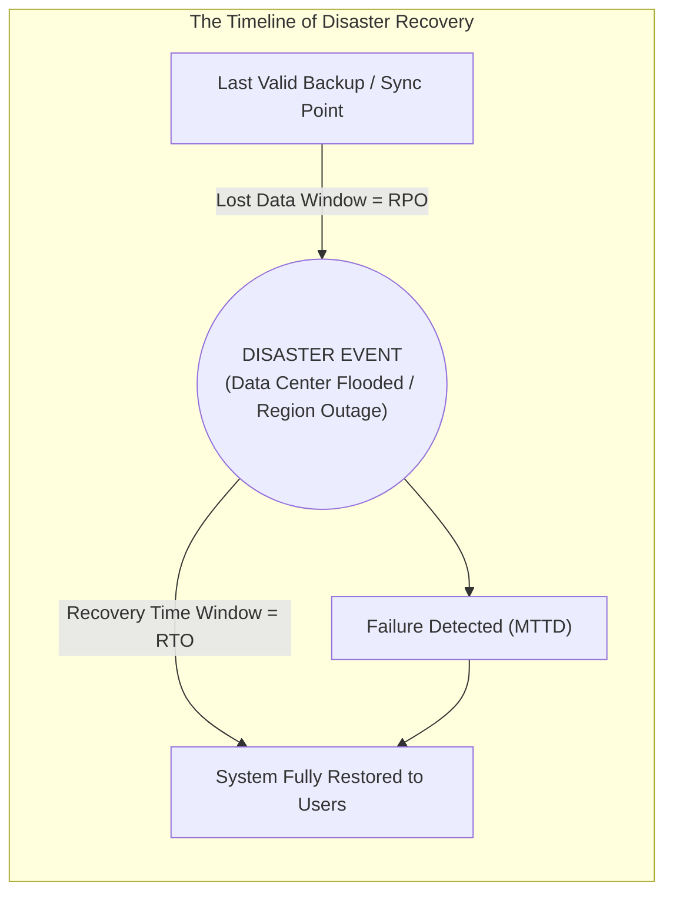

#### AWS Implementation
Configure AWS Backup for cross-region continuous Point-in-Time Recovery (PITR) to guarantee a 5-minute RPO [Doc: AWS Backup Continuous Recovery, checked 2026]:

```bash
# Create an AWS Backup plan with cross-region continuous Point-in-Time Recovery
cat << 'EOF' > backup-plan.json
{
  "BackupPlanName": "Continuous-CrossRegion-RPO5m",
  "Rules": [
    {
      "RuleName": "ContinuousRDSBackup",
      "TargetBackupVaultName": "PrimaryVault",
      "ScheduleExpression": "cron(0 12 * * ? *)",
      "EnableContinuousBackup": true,
      "Lifecycle": { "DeleteAfterDays": 35 },
      "CopyActions": [
        {
          "DestinationBackupVaultArn": "arn:aws:backup:us-west-2:123456789012:backup-vault:DRVault",
          "Lifecycle": { "DeleteAfterDays": 35 }
        }
      ]
    }
  ]
}
EOF

aws backup create-backup-plan --backup-plan file://backup-plan.json
```

#### OCI Implementation
Configure cross-region Point-in-Time recovery and automatic cross-region database replication in OCI [Doc: OCI Autonomous Database Cross-Region Data Guard, checked 2026]:

```bash
# Provision an Autonomous Data Guard Standby in a secondary region with sub-second RPO
oci db autonomous-database create-cross-region-data-guard \
  --primary-autonomous-database-id ocid1.autonomousdatabase.oc1.iad.aaaaaaaaxample... \
  --display-name "dr-standby-database" \
  --peer-db-region "us-phoenix-1" \
  --auto-failover-window-in-minutes 5 \
  --is-read-only false
```

#### Common Trap
Promising executive stakeholders an RTO of 15 minutes when your application relies on DNS failover with a 300-second (5-minute) TTL and clients use ISP recursive resolvers that ignore low TTLs. Mobile carriers and enterprise corporate proxies frequently cache DNS records for 24 to 48 hours regardless of your Route 53 or OCI DNS TTL settings. In a disaster, even if your DR infrastructure is 100% online in 10 minutes, 30% of global users will continue routing traffic to the dead primary region for hours. Realizing sub-minute RTO requires **Anycast IP Edge Routing** (AWS Global Accelerator or OCI Anycast) rather than public DNS record updates.

#### Follow-up Question
How do you mathematically prove that achieving a true cross-region RPO of zero is impossible for relational databases without introducing unacceptable latency penalties under special relativity and speed-of-light constraints?

---

### Q378: Disaster Recovery Strategies: Backup & Restore vs Pilot Light vs Warm Standby vs Active-Active

#### Question
How do cloud infrastructure architects evaluate the cost-versus-recovery trade-offs across the four standard disaster recovery architectures (Backup & Restore, Pilot Light, Warm Standby, and Multi-Region Active-Active), and what are the specific cloud orchestration primitives utilized in AWS and OCI for each tier?

#### Short Answer
The four standard disaster recovery strategies represent an ascending spectrum of cost, operational complexity, and recovery speed:
1. **Backup & Restore**: Data backed up to object storage and replicated to secondary regions; compute provisioned from scratch upon disaster (RPO: hours, RTO: 24h, Cost: lowest).
2. **Pilot Light**: Core database/storage continuously mirrored to DR region; minimal core compute (or zero compute) running; full application compute fleet provisioned via IaC upon failover (RPO: minutes, RTO: 15–30m).
3. **Warm Standby**: Scaled-down but fully functional production replica running 24/7 in DR region; scales out to 100% capacity upon failover (RPO: seconds, RTO: minutes).
4. **Multi-Region Active-Active**: Workload serves production traffic simultaneously across two or more active cloud regions with bidirectional state synchronization (RPO: near-zero, RTO: seconds/zero, Cost: highest).

#### Deep Answer
Selecting an inappropriate DR tier is one of the most common architectural failures in cloud engineering: choosing Active-Active for internal batch jobs wastes millions of dollars, while choosing Backup & Restore for customer-facing payment gateways risks corporate insolvency during an outage.

**Detailed Architectural Breakdown**:

**1. Backup and Restore (Tier 1)**:
- *Mechanics*: Nightly or hourly snapshots of RDS, EBS, OCI Block Volumes, and boot images are copied to S3/Object Storage in a remote region.
- *Orchestration*: Terraform or AWS Step Functions / OCI Full Stack Disaster Recovery provisions the VPC/VCN, subnets, gateways, database clusters, and restores volumes upon disaster declaration.
- *Use Case*: Non-critical internal applications, back-office HR systems, development environments.

**2. Pilot Light (Tier 2)**:
- *Mechanics*: Data replication is continuous (Aurora Global Database storage-level replication or OCI Data Guard / GoldenGate). The database is always alive in DR.
- *Compute*: EC2 Auto Scaling Groups or OCI Instance Pools are pre-configured in DR with `desired_capacity: 0`. Pre-baked AMIs / Custom Images are kept updated.
- *Failover*: The database is promoted to primary; ASGs/Instance Pools are updated to production capacity (e.g., `desired: 50`). Compute takes $5\text{--}10\text{ minutes}$ to launch and pass health checks.

**3. Warm Standby (Tier 3)**:
- *Mechanics*: A complete "mini-cluster" (e.g., 20–25% of production capacity) runs 24/7 in the DR region behind a live load balancer.
- *Traffic*: Used to run periodic synthetic canary tests or serve read-only analytics traffic.
- *Failover*: Route 53 or OCI Traffic Management shifts global traffic to the secondary load balancer. The sudden traffic burst triggers autoscaling (Target Tracking / Step Scaling) to scale from 20% to 100% within 3 to 5 minutes.

**4. Multi-Region Active-Active (Tier 4)**:
- *Mechanics*: Both regions process live read and write traffic simultaneously.
- *Data Architecture*: Requires distributed multi-master databases (Amazon DynamoDB Global Tables, CockroachDB, YugabyteDB, or OCI Globally Distributed Autonomous Database with Raft consensus).
- *Traffic*: Handled via latency-based or geolocation routing (AWS Global Accelerator / Route 53 or OCI Traffic Management Anycast). If Region A dies, edge proxies automatically route 100% of traffic to Region B with zero human intervention.

#### Architecture
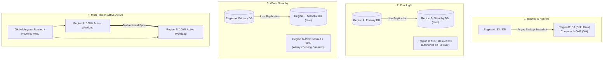

#### AWS Implementation
Deploy an automated Pilot Light compute expansion script using AWS Systems Manager and Auto Scaling CLI [Doc: AWS Disaster Recovery Strategies, checked 2026]:

```bash
# Execute disaster recovery failover: scale Pilot Light ASG from 0 to 20 instances in us-west-2
aws autoscaling set-desired-capacity \
  --auto-scaling-group-name "dr-pilot-light-asg" \
  --region us-west-2 \
  --desired-capacity 20 \
  --honor-cooldown

# Promote Aurora Cross-Region Global Database secondary cluster to standalone primary
aws rds failover-global-cluster \
  --global-cluster-identifier "enterprise-global-db" \
  --target-db-cluster-identifier "arn:aws:rds:us-west-2:123456789012:cluster:aurora-dr-cluster"
```

#### OCI Implementation
Execute a coordinated DR plan failover using the OCI Full Stack Disaster Recovery (FSDR) service [Doc: OCI Full Stack Disaster Recovery, checked 2026]:

```bash
# Execute DR Failover Plan in OCI Full Stack Disaster Recovery
oci disaster-recovery dr-plan-execution create \
  --dr-protection-group-id ocid1.drprotectiongroup.oc1.phx.aaaaaaaadr... \
  --plan-id ocid1.drplan.oc1.phx.aaaaaaaafailoverplan... \
  --execution-options '{"planExecutionType": "FAILOVER"}' \
  --display-name "Regional-Failover-Execution-2026"

# Verify execution status of all automated DR runbook steps
oci disaster-recovery dr-plan-execution get \
  --dr-plan-execution-id ocid1.drplanexecution.oc1.phx.aaaaaaaaxample... \
  --query 'data."execution-status"'
```

#### Common Trap
Attempting to deploy Multi-Region Active-Active with a traditional single-leader relational database (e.g., standard PostgreSQL or MySQL) by having Region B send write transactions across the WAN to Region A's primary instance. Every write in Region B incurs cross-country round-trip network latency ($70\text{ms}$), leading to connection pool exhaustion, distributed deadlocks, and severe lock contention. True Active-Active mandates distributed multi-master or conflict-free replicated data types (CRDTs) designed specifically for cross-WAN consensus.

#### Follow-up Question
How do you resolve write conflicts (e.g., concurrent updates to the same user record in both regions) in Multi-Region Active-Active architectures when using Last-Writer-Wins (LWW) vs Conflict-Free Replicated Data Types (CRDTs)?

---

### Q379: DNS Failover & Traffic Steering: Route 53 ARC vs OCI Traffic Management

#### Question
How do cloud edge routing systems execute automated global DNS failover across healthy regions, what are the architectural trade-offs between DNS health-check polling vs Application Recovery Controller (ARC) routing controls, and how do Amazon Route 53 and OCI Traffic Management compare?

#### Short Answer
DNS-based disaster recovery uses public DNS resolvers to direct user traffic to healthy cloud endpoints. Standard DNS failover relies on **Health Checks**: cloud probe nodes periodically send HTTP/TCP requests to regional endpoints; if probes fail, the DNS service automatically alters query responses, returning the backup region's IP address. However, DNS health checks suffer from **detection lag** ($30\text{--}90\text{s}$) and **DNS caching lag** (TTL). To eliminate automated false-positive failovers during gray failures, AWS provides **Route 53 Application Recovery Controller (ARC)**, using manual or programmatic **Routing Controls** (failover switches distributed across 5 isolated regional cells). OCI provides **OCI Traffic Management Steering Policies** (Failover, Load Balancing, Geolocation, ASN-based steering), evaluating integrated OCI Health Checks with configurable failure thresholds and vantage points.

#### Deep Answer
DNS is the most ubiquitous global traffic director, but it was not designed for instantaneous sub-second switching.

**1. The Mechanics & Failure Modes of DNS Failover**:
- **Health-Check Polling Lag**:
  - Probes run at standard ($30\text{s}$) or fast ($10\text{s}$) intervals.
  - Failure threshold requires $3$ consecutive failed attempts ($30\text{s}$).
  - Total time to detect an outage: $30\text{ to }90\text{ seconds}$.
- **The TTL (Time-to-Live) Propagation Problem**:
  - SREs configure low DNS TTLs (e.g., 5s or 10s).
  - However, third-party recursive DNS resolvers (corporate gateways, ISPs, mobile networks) frequently enforce minimum cache floors (e.g., 300s to 86,400s), ignoring your TTL.
  - Result: Even after Route 53 or OCI Traffic Management updates the record, thousands of clients continue sending traffic to the failed region.
- **The "Gray Failure" Flaw**:
  - If an application's database is corrupt or latency has increased by $10\times$, but the `/healthz` HTTP endpoint still returns HTTP 200, automated DNS health checks remain green. The system suffers a silent customer-impacting outage without triggering failover.

**2. AWS Route 53 Application Recovery Controller (ARC)**:
- ARC decouples traffic shifting from automated HTTP polling.
- **Routing Controls**: Highly available on/off switches that control DNS routing.
- **5-Regional Redundancy**: ARC routing control endpoints are replicated across 5 AWS regions. Even if the region hosting your primary app and Route 53 control plane experiences an outage, ARC's data plane remains 100% operational [Doc: Route 53 Application Recovery Controller Guide, checked 2026].
- **Safety Rules**: Enforces assertion rules (e.g., *"Do not allow turning off Region A unless Region B is confirmed online"*, preventing accidental global outages).

**3. OCI Traffic Management Steering Policies**:
- OCI Traffic Management provides native, cloud-scale edge steering built on Oracle's Anycast DNS infrastructure.
- **Policy Types**:
  - *Failover*: Directs traffic to primary endpoint; steers to secondary if OCI Health Check breaches threshold.
  - *Load Balancing*: Weighted round-robin across multiple endpoints.
  - *Geolocation*: Steers based on caller continent, country, or state/province.
  - *ASN Steering*: Steers based on the autonomous system number (ISP/carrier) of the caller [Doc: OCI Traffic Management Steering Policies, checked 2026].

#### Architecture
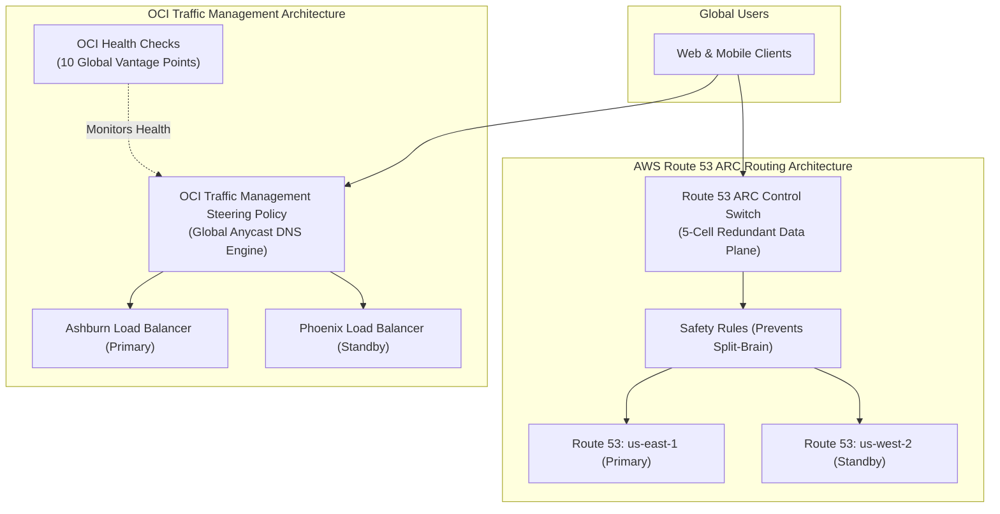

#### AWS Implementation
Configure Route 53 ARC Routing Controls and Safety Rules using AWS CLI [Doc: Route 53 ARC CLI, checked 2026]:

```bash
# Step 1: Create an ARC Cluster (5-region highly available control plane)
CLUSTER_ARN=$(aws route53-recovery-control-config create-cluster \
  --cluster-name "GlobalEnterpriseCluster" \
  --query 'Cluster.ClusterArn' --output text)

# Step 2: Create a Control Panel and Routing Control (Switch for Region A)
CP_ARN=$(aws route53-recovery-control-config create-control-panel \
  --cluster-arn "$CLUSTER_ARN" \
  --control-panel-name "ProductionTrafficPanel" \
  --query 'ControlPanel.ControlPanelArn' --output text)

RC_ARN=$(aws route53-recovery-control-config create-routing-control \
  --cluster-arn "$CLUSTER_ARN" \
  --control-panel-arn "$CP_ARN" \
  --routing-control-name "RegionA-Ingress-Switch" \
  --query 'RoutingControl.RoutingControlArn' --output text)

# Step 3: Shift Traffic: Flip routing control state to False during DR drill
aws route53-recovery-control-config update-routing-control-states \
  --routing-control-states-entries "[{\"RoutingControlArn\": \"$RC_ARN\", \"RoutingControlState\": \"Off\"}]"
```

#### OCI Implementation
Create an OCI Traffic Management Failover Steering Policy with automated health checking using OCI CLI [Doc: OCI Traffic Management CLI, checked 2026]:

```bash
# Create an OCI Traffic Management Steering Policy with Failover Rule
cat << 'EOF' > steering-failover.json
{
  "compartmentId": "ocid1.compartment.oc1..aaaaaaaam7...",
  "displayName": "Global-Portal-Failover-Policy",
  "template": "FAILOVER",
  "healthCheckId": "ocid1.httpmonitor.oc1.iad.aaaaaaaahc...",
  "answers": [
    {
      "name": "primary-ashburn",
      "type": "A",
      "rdata": "198.51.100.10",
      "pool": "primary-pool"
    },
    {
      "name": "secondary-phoenix",
      "type": "A",
      "rdata": "203.0.113.20",
      "pool": "secondary-pool"
    }
  ],
  "rules": [
    {
      "ruleType": "FAILOVER",
      "primaryPool": "primary-pool",
      "backupPool": "secondary-pool"
    }
  ],
  "ttl": 30
}
EOF

oci dns steering-policy create --from-json file://steering-failover.json
```

#### Common Trap
Enabling automated, un-damped DNS failover between regions based on a single health check probe. If a transient network glitch between the health-checker's vantage points and the primary cloud data center causes 3 failed pings, the DNS system automatically fails over 100% of global traffic to the secondary region. When traffic floods the secondary region, it triggers database promotions and cold-cache crashes. Five minutes later, the transient glitch clears, and the DNS system fails back to Region A, causing a catastrophic "double failover" and data split-brain. Automated failover must incorporate **ARC safety assertions** or require human SRE authorization.

#### Follow-up Question
How do Anycast IP networks (such as AWS Global Accelerator or Cloudflare) achieve sub-10-second failover compared to DNS-based failover, and why does Anycast eliminate the DNS TTL caching problem completely?

---

### Q380: Multi-AZ vs Multi-Region Resiliency: Failure Domains & Blast Radius

#### Question
How do cloud architects establish failure domain boundaries between Multi-Availability-Zone (Multi-AZ) and Multi-Region architectures, what are the trade-offs in operational complexity and data residency, and what failure modes does Multi-AZ fail to mitigate?

#### Short Answer
**Multi-AZ** distributes workloads across physically separated data center facilities within a single metropolitan region ($<100\text{km}$ apart) connected by ultra-low-latency redundant fiber ($<2\text{ms}$ RTT). Multi-AZ protects against localized physical disasters (power substation failure, cooling loss, rack fire, individual facility flooding) with near-zero latency penalty and simple synchronous data replication. However, Multi-AZ **fails to protect against regional failure modes**: regional control-plane outages (e.g., regional IAM, STS, or CloudWatch degradation), regional network partitions, major natural disasters (earthquakes, hurricanes, tsunamis), and statutory data residency / regulatory isolation breaches. **Multi-Region** isolates blast radiuses completely across thousands of kilometers, but introduces asynchronous replication lag (RPO $>0$), complex state synchronization, and significant cost increases ($2\times\text{--}4\times$).

#### Deep Answer
True architectural resilience requires understanding what shared dependencies exist across Availability Zones.

**1. Shared Fate in Multi-AZ Deployments**:
While AWS and OCI engineer Availability Zones (and OCI Availability Domains) with isolated power, cooling, and physical security, they inevitably share certain regional dependencies:
- **Regional Control Planes**:
  - AWS IAM is global, but regional STS endpoints, KMS regional endpoints, and CloudFormation regional engines are shared across AZs in that region.
  - If a control plane bug causes AWS STS or OCI Identity to fail in `us-east-1`, workloads in *all* Availability Zones (us-east-1a, 1b, 1c) cannot assume IAM roles, authenticate database tokens, or spin up new instances.
- **Regional Networking Substrates**:
  - Shared regional transit gateways, direct connect gateways, and regional internet exchange peering points.
- **Physical Blast Radius**:
  - Major meteorological events (Category 5 hurricanes, major earthquakes) frequently affect an entire 100km metropolitan radius, knocking out power grids and civil infrastructure across all AZs simultaneously.

**2. Multi-Region Blast Radius Isolation**:
- Each cloud region is a completely autonomous physical and logical universe.
- An outage in `us-east-1` has zero physical, electrical, or control-plane dependency on `us-west-2` or `eu-west-1`.
- **The Trade-Off Matrix**:

| Architectural Dimension | Multi-AZ Deployment | Multi-Region Deployment |
| :--- | :--- | :--- |
| **Network Latency** | Sub-2 milliseconds ($<2\text{ms}$) | 30 to 120 milliseconds ($30\text{--}120\text{ms}$) |
| **Replication Mode** | Synchronous (Zero RPO achievable) | Asynchronous (RPO $>0$ typical) |
| **Control Plane Shared Fate**| High (Shares regional cloud APIs) | Zero (Complete logical independence) |
| **Operational Overhead** | Low (Native primitives like RDS Multi-AZ)| Extreme (Cross-region CI/CD, DNS, IAM, SecOps) |
| **Data Transfer Cost** | \$0.01/GB cross-AZ | \$0.02/GB cross-region + WAN egress fees |
| **Compliance & Sovereignty** | Single sovereign boundary | Risk of violating cross-border data laws (GDPR) |

#### Architecture
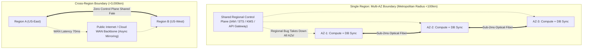

#### AWS Implementation
Deploy an Amazon EKS cluster spanning multiple Availability Zones and enforce pod anti-affinity across AZ failure domains [Doc: AWS EKS Multi-AZ Resiliency, checked 2026]:

```yaml
# kubernetes-multi-az-topology.yaml
apiVersion: apps/v1
kind: Deployment
metadata:
  name: resilient-order-service
spec:
  replicas: 6
  selector:
    matchLabels:
      app: order-service
  template:
    metadata:
      labels:
        app: order-service
    spec:
      topologySpreadConstraints:
      - maxSkew: 1
        topologyKey: topology.kubernetes.io/zone # Enforces equal distribution across us-east-1a, 1b, 1c
        whenUnsatisfiable: DoNotSchedule
        labelSelector:
          matchLabels:
            app: order-service
      containers:
      - name: app
        image: 123456789012.dkr.ecr.us-east-1.amazonaws.com/orders:v1.0
```

#### OCI Implementation
Deploy an OCI Container Engine for Kubernetes (OKE) Node Pool spanning multiple Fault Domains within an Availability Domain [Doc: OCI OKE Node Pool Placement, checked 2026]:

```bash
# Provision an OKE Node Pool explicitly distributed across Fault Domains 1, 2, and 3
oci ce node-pool create \
  --cluster-id ocid1.cluster.oc1.iad.aaaaaaaaxample... \
  --compartment-id ocid1.compartment.oc1..aaaaaaaam7... \
  --name "multi-fd-resilient-nodepool" \
  --node-shape "VM.Standard.E5.Flex" \
  --node-shape-config '{"ocpus": 4, "memoryInGBs": 32}' \
  --size 6 \
  --placement-configurations '[
    {"availabilityDomain": "UwhS:US-ASHBURN-AD-1", "subnetId": "ocid1.subnet.oc1.iad.aaaaaaaasubnet...", "faultDomains": ["FAULT-DOMAIN-1"]},
    {"availabilityDomain": "UwhS:US-ASHBURN-AD-1", "subnetId": "ocid1.subnet.oc1.iad.aaaaaaaasubnet...", "faultDomains": ["FAULT-DOMAIN-2"]},
    {"availabilityDomain": "UwhS:US-ASHBURN-AD-1", "subnetId": "ocid1.subnet.oc1.iad.aaaaaaaasubnet...", "faultDomains": ["FAULT-DOMAIN-3"]}
  ]'
```

#### Common Trap
Assuming that moving from Multi-AZ to Multi-Region automatically improves availability. In practice, unless an engineering team has mastered distributed systems, Multi-Region architectures often have **lower overall availability** than well-architected Multi-AZ systems. Multi-Region introduces asynchronous replication lag, cross-region split-brain risks, deployment synchronization challenges, complex routing logic, and double the surface area for configuration drift. If a single bad configuration change is deployed to both regions simultaneously, both regions crash together, eliminating the multi-region benefit at triple the cost.

#### Follow-up Question
How do you structure deployment pipelines with "Canary Regions" and baking periods (e.g., deploying to `eu-west-1`, baking for 24 hours, and then deploying to `us-east-1`) to prevent faulty software releases from breaching multi-region blast radius boundaries?

---

### Q381: Relational Database Cross-Region DR: Aurora Global Database vs OCI Data Guard

#### Question
How do cloud managed relational database services replicate high-throughput transactional write workloads across continental distances with sub-second replication latency, and how do Amazon Aurora Global Database and OCI Data Guard (Autonomous DB / Base DB) compare in failover orchestration, replication mechanics, and read scalability?

#### Short Answer
Replicating relational databases across regions without impacting primary transaction throughput requires asynchronous physical redo/storage replication. **Amazon Aurora Global Database** offloads replication entirely to the specialized Aurora distributed storage engine: the compute instance sends storage redo records to the secondary region's storage nodes over dedicated AWS backbone networks, achieving typical replication lag of $<1\text{ second}$ with zero impact on primary database compute performance. **OCI Data Guard** (integrated into OCI Autonomous Database and Base Database) utilizes Oracle's enterprise Data Guard technology, streaming database redo log buffers directly from primary memory to standby instances in synchronous (`Maximum Protection` / `Maximum Availability`) or asynchronous (`Maximum Performance`) modes, supporting automated 1-click failover and read-only query offload via Active Data Guard.

#### Deep Answer
Traditional database replication (e.g., standard PostgreSQL logical streaming or MySQL binlog replication) executes replication inside the database compute engine: the database process must parse, format, transmit, and apply SQL/binlog statements on the standby compute node. Under heavy write loads, the standby compute node's CPU saturates, causing replication lag to explode to minutes or hours.

**1. Amazon Aurora Global Database Architecture**:
- **Storage-Level Redo Replication**:
  - Aurora compute nodes write **redo log streams** directly to the 6-way multi-AZ storage fleet.
  - In a Global Database, the storage fleet in Region A streams these raw redo log records directly across the AWS WAN backbone to the Aurora storage fleet in Region B.
  - The compute instance in Region B does not replay SQL statements; it simply reads updated storage pages from its local storage cluster [Doc: Aurora Global Database Architecture, checked 2026].
- **Performance Characteristics**:
  - Cross-region replication lag is typically under $1,000\text{ms}$.
  - Primary database compute experiences **zero performance penalty**.
  - Supports up to 5 secondary read regions with up to 16 read replicas per region.
- **Failover Modes**:
  - *Planned Switchover*: Zero data loss (RPO=0). Waits for in-flight redo logs to synchronize, synchronizes sequence numbers, and swaps primary/secondary roles in under 2 minutes.
  - *Unplanned Failover (Detachment)*: Promotes secondary region to standalone primary cluster in under 1 minute; in-flight unsynchronized transactions are lost (RPO $<1\text{s}$).

**2. OCI Data Guard Architecture (Autonomous & Base DB)**:
- **Redo Transport & Apply Services**:
  - The primary database's Log Writer (`LGWR`) process or Redo Transport Services (`LNS`) ships redo data across the network to the standby database's Remote File Server (`RFS`).
  - **OCI Protection Modes**:
    - `Maximum Availability`: Synchronous replication within region/AD (zero data loss); automatically falls back to asynchronous if standby becomes unreachable.
    - `Maximum Performance`: Asynchronous replication across regions (typical cross-region DR mode). Redo is shipped asynchronously, guaranteeing zero primary commit latency impact [Doc: OCI Data Guard Protection Modes, checked 2026].
- **OCI Active Data Guard**:
  - Standby database is open read-only while recovery is active.
  - Enables offloading reporting, business intelligence, and backup extraction completely from the primary database to the DR site.
  - **Fast-Start Failover (FSFO)**: Automatically detects primary outage via an independent Observer node and executes failover in under 30 seconds without human intervention.

#### Architecture
```mermaid
graph TD
    subgraph "Amazon Aurora Global Database"
        AURORA_COMP["Primary Aurora Compute (us-east-1)"]
        AURORA_STORE_PRI[("Primary Storage Cluster\n(6-way Multi-AZ)")]
        AURORA_STORE_SEC[("Secondary Storage Cluster\n(us-west-2 Storage Nodes)")]
        AURORA_RO_COMP["Secondary Read-Only Compute"]
        
        AURORA_COMP -->|Redo Logs| AURORA_STORE_PRI
        AURORA_STORE_PRI ===|Storage-to-Storage Async Replication (<1s Lag)| AURORA_STORE_SEC
        AURORA_STORE_SEC --> AURORA_RO_COMP
    end

    subgraph "OCI Autonomous Data Guard"
        OCI_PRI_DB[("Primary Database (Ashburn)\nLog Writer / Redo Generation")]
        OCI_SEC_DB[("Standby Active Data Guard (Phoenix)\nRedo Apply Service (Open Read-Only)")]
        FSFO_OBSERVER["Fast-Start Failover Observer\n(Third Independent Location)"]
        
        OCI_PRI_DB ===|Asynchronous Redo Transport (Max Performance)| OCI_SEC_DB
        FSFO_OBSERVER -.->|Heartbeat Ping| OCI_PRI_DB
        FSFO_OBSERVER -.->|Heartbeat Ping| OCI_SEC_DB
    end
```

#### AWS Implementation
Create an Aurora Global Database and initiate a planned managed switchover using AWS CLI [Doc: AWS Aurora Global Database CLI, checked 2026]:

```bash
# Step 1: Create an Aurora Global Database Cluster
aws rds create-global-cluster \
  --global-cluster-identifier "enterprise-global-db" \
  --source-db-cluster-identifier "arn:aws:rds:us-east-1:123456789012:cluster:prod-aurora-primary"

# Step 2: Add secondary cross-region cluster in us-west-2
aws rds create-db-cluster \
  --db-cluster-identifier "prod-aurora-secondary" \
  --engine "aurora-postgresql" \
  --global-cluster-identifier "enterprise-global-db" \
  --region us-west-2

# Step 3: Execute a Planned Managed Switchover (Zero Data Loss)
aws rds switchover-global-cluster \
  --global-cluster-identifier "enterprise-global-db" \
  --target-db-cluster-identifier "arn:aws:rds:us-west-2:123456789012:cluster:prod-aurora-secondary"
```

#### OCI Implementation
Enable Autonomous Data Guard with cross-region standby and execute failover using OCI CLI [Doc: OCI Autonomous Database Data Guard CLI, checked 2026]:

```bash
# Step 1: Enable Autonomous Data Guard with cross-region standby in Phoenix
oci db autonomous-database create-cross-region-data-guard \
  --primary-autonomous-database-id ocid1.autonomousdatabase.oc1.iad.aaaaaaaaprimary... \
  --peer-db-region "us-phoenix-1" \
  --display-name "phoenix-dr-standby"

# Step 2: Perform a Switchover (Zero Data Loss planned role reversal)
oci db autonomous-database switchover \
  --autonomous-database-id ocid1.autonomousdatabase.oc1.iad.aaaaaaaaprimary...

# Step 3: Perform an emergency Failover if primary region is destroyed
oci db autonomous-database failover \
  --autonomous-database-id ocid1.autonomousdatabase.oc1.phx.aaaaaaaastandby...
```

#### Common Trap
Failing to update application connection strings after a database failover. When an Aurora Global Database or OCI Data Guard standby is promoted to primary, its cluster endpoint and IP address change (or reverse roles). If application microservices in the DR region are still hardcoded to point to the old primary cluster endpoint, they will either throw connection refused errors or attempt to execute writes against an instance that has been converted into a read-only replica. Applications must utilize DNS CNAME abstraction (e.g., `db.enterprise.com`) or global connection proxying (RDS Proxy / OCI DRCP).

#### Follow-up Question
What is the "split-brain" risk if a network partition isolates Region A and Region B, and how does the OCI Data Guard Fast-Start Failover Observer or AWS Global Database prevent both regions from accepting conflicting writes simultaneously?

---

### Q382: Object Storage Cross-Region Replication: S3 CRR vs OCI Object Storage Replication

#### Question
How do cloud object storage platforms replicate petabytes of unstructured binary data across geographical regions asynchronously, and how do Amazon S3 Cross-Region Replication (CRR) with Replication Time Control (RTC) compare to OCI Object Storage Cross-Region Replication in SLA guarantees, encryption key handling, and metadata synchronization?

#### Short Answer
Object storage cross-region replication operates asynchronously at the bucket level: when an object is written or updated in the source bucket, the storage control plane generates a replication event, streams the object payload across the cloud provider's private WAN backbone, and creates an identical object in the destination bucket. **Amazon S3 Cross-Region Replication (CRR)** supports filtering by prefix/tag, storage class conversion during transit, ownership overriding, and **S3 Replication Time Control (RTC)**, which contractually guarantees that $99.99\%$ of objects replicate within **15 minutes** backed by a financial SLA. **OCI Object Storage Cross-Region Replication** provides continuous, automated replication of all new and modified objects to a remote region bucket, supporting customer-managed KMS key re-encryption and bucket lifecycle synchronization.

#### Deep Answer
Replicating millions of unstructured objects (PDFs, images, data lake parquet files, backups) across continents requires robust event-driven pipeline architectures capable of handling massive throughput spikes without dropped transfers.

**1. Amazon S3 Cross-Region Replication (CRR) Mechanics**:
- **Prerequisite**: Versioning must be explicitly enabled on both source and target buckets.
- **Replication Process**:
  - S3 monitors object PUT, POST, COPY, and delete operations.
  - When an object is created, its metadata is tagged with `ReplicationStatus: PENDING`.
  - Background asynchronous workers replicate the payload. Upon successful confirmation in the destination bucket, status changes to `COMPLETED` [Doc: Amazon S3 CRR Specification, checked 2026].
- **S3 Replication Time Control (RTC)**:
  - Enterprise compliance feature: Guarantees $99.99\%$ of newly uploaded objects replicate within **15 minutes**.
  - Emits CloudWatch metrics: `ReplicationLatency` (seconds), `BytesPendingReplication`, and `OperationsPendingReplication`.
- **KMS Key Handling**:
  - If source objects are encrypted with AWS KMS CMKs, S3 CRR requires explicit configuration: S3 must be granted permissions to decrypt using the source KMS key and re-encrypt using the destination region's KMS key.
- **Delete Marker Behavior**:
  - By default, deleting an object creates a delete marker that is *not* replicated to prevent accidental mass deletions from wiping out DR archives. Replication of delete markers can be optionally enabled.

**2. OCI Object Storage Cross-Region Replication Mechanics**:
- **Continuous Policy-Driven Mirroring**:
  - Configured directly on the source bucket pointing to a destination bucket in another subscribed region (e.g., Ashburn to Phoenix).
  - Automatically replicates object creations, overwrites, and metadata changes [Doc: OCI Object Storage Replication Guide, checked 2026].
- **Replication Status & Encryption**:
  - The replication status transitions through `ACTIVE`, `CLIENT_ERROR`, and `CANCELLED`.
  - Replicating buckets encrypted with OCI Vault (KMS) master encryption keys automatically re-encrypts payloads using the destination region's KMS vault key.
- **Delete Action Isolation**:
  - Deleting an object in the source bucket **does not delete** the object in the destination bucket. This intentional air-gap ensures that accidental deletes, rogue administrator scripts, or ransomware attacks cannot propagate destruction to the DR region.

#### Architecture
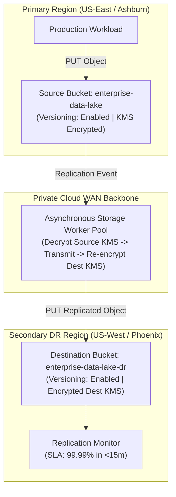

#### AWS Implementation
Configure S3 Cross-Region Replication with Replication Time Control (RTC) and KMS re-encryption using AWS CLI [Doc: AWS S3 CRR with RTC CLI, checked 2026]:

```json
// s3-crr-rtc-policy.json
{
  "Role": "arn:aws:iam::123456789012:role/S3ReplicationRole",
  "Rules": [
    {
      "ID": "CrossRegionWithRTC",
      "Status": "Enabled",
      "Priority": 1,
      "DeleteMarkerReplication": { "Status": "Disabled" },
      "Filter": { "Prefix": "critical-docs/" },
      "Destination": {
        "Bucket": "arn:aws:s3:::enterprise-data-dr-us-west-2",
        "ReplicationTime": {
          "Status": "Enabled",
          "Time": { "Minutes": 15 }
        },
        "Metrics": {
          "Status": "Enabled",
          "EventThreshold": { "Minutes": 15 }
        },
        "EncryptionConfiguration": {
          "ReplicaKmsKeyID": "arn:aws:kms:us-west-2:123456789012:key/mrk-dest-key-123"
        }
      },
      "SourceSelectionCriteria": {
        "SseKmsEncryptedObjects": { "Status": "Enabled" }
      }
    }
  ]
}
```

```bash
# Attach replication configuration to the source S3 bucket
aws s3api put-bucket-replication \
  --bucket "enterprise-data-primary-us-east-1" \
  --replication-configuration file://s3-crr-rtc-policy.json
```

#### OCI Implementation
Configure cross-region replication for an OCI Object Storage bucket using OCI CLI [Doc: OCI Object Storage Replication CLI, checked 2026]:

```bash
# Step 1: Create target bucket in secondary region (us-phoenix-1)
oci os bucket create \
  --compartment-id ocid1.compartment.oc1..aaaaaaaam7... \
  --name "enterprise-data-dr" \
  --region "us-phoenix-1"

# Step 2: Create Replication Policy in source bucket (us-ashburn-1)
cat << 'EOF' > oci-repl-policy.json
{
  "name": "AshburnToPhoenixReplication",
  "destinationRegionName": "us-phoenix-1",
  "destinationBucketName": "enterprise-data-dr"
}
EOF

oci os replication create-replication-policy \
  --bucket-name "enterprise-data-primary" \
  --from-json file://oci-repl-policy.json

# Step 3: Monitor replication policy status
oci os replication get-replication-policy \
  --bucket-name "enterprise-data-primary" \
  --replication-id "ocid1.osreplicationpolicy.oc1.iad.aaaaaaaaxample..."
```

#### Common Trap
Enabling cross-region replication on an existing S3 or OCI bucket containing 50TB of legacy data and assuming that existing objects will automatically replicate. Cloud object storage replication **only applies to new objects uploaded AFTER the replication policy is created**. Existing objects are completely ignored! To replicate historical objects, AWS mandates running **S3 Batch Replication** jobs, while OCI requires executing a batch copy script or OCI Data Transfer service to backfill historical objects into the destination bucket.

#### Follow-up Question
How do you configure S3 Object Lock (Compliance Mode) or OCI Retention Rules on cross-region replica buckets to prevent a compromised primary administrator credential from maliciously truncating DR backup objects?

---

### Q383: Replication Models & Consensus: Synchronous vs Asynchronous & Split-Brain

#### Question
How do the fundamental laws of distributed consensus (the CAP Theorem and PACELC Theorem) govern cloud data replication, what mathematical trade-offs dictate synchronous versus asynchronous replication, and how do distributed quorum protocols (Raft, Paxos, Multi-Leader) prevent split-brain catastrophes during network partitions?

#### Short Answer
Distributed data systems cannot escape the laws of physics: under network partitions, a system must choose between **Consistency** (rejecting writes to guarantee correctness) or **Availability** (accepting writes with potential divergence), as proven by the **CAP Theorem**. The **PACELC Theorem** extends this to normal (non-partitioned) operations: If there is a **P**artition, trade off **A**vailability vs **C**onsistency; **E**lse, trade off **L**atency vs **C**onsistency. **Synchronous replication** guarantees strong consistency ($RPO=0$) by requiring a majority quorum of nodes to confirm writes before acknowledging the client, but increases commit latency by the slowest node. **Asynchronous replication** returns immediate acknowledgments ($L \approx 0$), buffering data for background propagation, but risks data loss ($RPO > 0$) during sudden primary failure.

#### Deep Answer
Distributed consensus is the engineering foundation of cloud databases, message queues, and clustering engines.

**1. The Mechanics of Replication Models**:
- **Synchronous Replication ($RPO = 0$)**:
  - Flow: Client $\rightarrow$ Primary Node $\rightarrow$ Standby Node(s) $\rightarrow$ Disk Commit $\rightarrow$ Standby ACK $\rightarrow$ Primary Commit $\rightarrow$ Client ACK.
  - Latency: Bound to network round-trip time: $L_{\text{sync}} \ge L_{\text{primary}} + 2 \times \text{RTT}_{\text{network}} + L_{\text{standby}}$.
  - Availability Risk: If the network link between nodes fails or the standby stalls during a JVM garbage collection pause, the primary must block client writes, sacrificing availability.
- **Asynchronous Replication ($RPO > 0$)**:
  - Flow: Client $\rightarrow$ Primary Node $\rightarrow$ Disk Commit $\rightarrow$ Client ACK $\rightarrow$ Background streaming to Standby.
  - Latency: Minimal. Writes commit at local NVMe speeds.
  - Data Loss Risk: If the primary hardware dies before the background stream flushes the in-memory write buffer, un-replicated transactions are permanently lost.

**2. Network Partitions & The Split-Brain Catastrophe**:
- **What is Split-Brain?**:
  - Suppose Node A (New York) and Node B (London) replicate data.
  - The transatlantic fiber link is severed.
  - If both Node A and Node B believe the other is dead and promote themselves to Primary, both start accepting client writes.
  - Result: Conflicting, divergent database states that cannot be automatically merged without manual data reconstruction or catastrophic data corruption.
- **Quorum Consensus (The Solution)**:
  - Requires a strictly odd number of nodes (e.g., 3, 5, or 7) implementing consensus algorithms (**Raft** or **Multi-Paxos**).
  - To commit a write or elect a new leader, a node must achieve a **Majority Quorum ($Q$)**:
    $$Q = \left\lfloor \frac{N}{2} \right\rfloor + 1$$
    - For $N=3$ nodes, $Q = 2$. If one node is partitioned off, the remaining 2 nodes form a majority and continue operating. The isolated node cannot reach 2 votes, so it immediately self-fences (rejects writes).
    - For $N=2$ nodes, $Q = 2$. A partition prevents either node from achieving majority, causing complete system halt. This is why 2-node clusters cannot be fault-tolerant without an external **Witness / Arbiter node**.

#### Architecture
```mermaid
graph TD
    subgraph "Network Partition Event (Transatlantic Fiber Cut)"
        subgraph "Majority Partition (Quorum = 2 of 3) - HEALTHY"
            NODE1["Leader Node A (us-east-1)"]
            WITNESS["Witness / Arbiter Node C (us-west-2)"]
            NODE1 <===>|Quorum Achieved (2/3 Votes)| WITNESS
            CLIENT_W["Client Writes Accepted!"] --> NODE1
        end

        subgraph "Minority Partition (1 of 3) - FENCED"
            NODE2["Isolated Node B (eu-central-1)"]
            CLIENT_R["Client Writes REJECTED!\n(Cannot achieve quorum: 1 < 2)"] --> NODE2
        end
        
        NODE1 -.-x|PARTITION SEVERED| NODE2
    end
```

#### AWS Implementation
Deploy an odd-numbered (3-node) distributed consensus cluster across Availability Zones using Amazon EC2 and etcd [Doc: etcd Distributed Consensus Architecture, checked 2026]:

```bash
# Verify etcd distributed cluster health and Raft leader election across 3 AZs
etcdctl --endpoints=https://etcd1.us-east-1a:2379,https://etcd2.us-east-1b:2379,https://etcd3.us-east-1c:2379 \
  --cacert=/etc/etcd/ca.crt --cert=/etc/etcd/server.crt --key=/etc/etcd/server.key \
  endpoint health

# Check which node holds the active Raft leader lease
etcdctl --endpoints=https://etcd1.us-east-1a:2379,https://etcd2.us-east-1b:2379,https://etcd3.us-east-1c:2379 \
  --cacert=/etc/etcd/ca.crt --cert=/etc/etcd/server.crt --key=/etc/etcd/server.key \
  endpoint status --write-out=table
```

#### OCI Implementation
Deploy a 3-node Oracle Data Guard configuration with a Fast-Start Failover (FSFO) Observer acting as the quorum witness in an independent region [Doc: OCI Data Guard Fast-Start Failover Observer, checked 2026]:

```bash
# Query OCI Data Guard broker status via DGMGRL
dgmgrl sys/ComplexPassword123!@primary_iad << 'EOF'
SHOW CONFIGURATION;
SHOW FAST_START FAILOVER;
EOF

# Start the Fast-Start Failover Observer on an independent compute instance in Phoenix
dgmgrl sys/ComplexPassword123!@primary_iad "START OBSERVER FILE='/opt/oracle/observer.ora';"
```

#### Common Trap
Deploying a two-node active/standby database across two regions without an independent third-party witness or arbiter node. If the WAN link between Region A and Region B drops for 10 seconds, Region B assumes Region A is dead and promotes its database to read-write. Meanwhile, Region A is still alive and accepting writes from local clients. You now have two independent primary databases accepting conflicting writes. When the network link reconnects, data reconciliation is impossible without dropping transactions. Always deploy an odd-numbered witness node (in a 3rd independent region or availability zone) to break ties deterministically.

#### Follow-up Question
How does Google Spanner or AWS Aurora avoid standard two-phase commit (2PC) throughput bottlenecks across global clusters using TrueTime hardware atomic clocks and bounded GPS uncertainty ($\epsilon$)?

---

### Q384: Automated Cross-Region Backup & Vault Locking: AWS Backup vs OCI Backup Policies

#### Question
How do enterprises implement automated, centralized, and tamper-resistant backup policies across multiple cloud accounts and regions, and how do AWS Backup (with Vault Lock and Cross-Account Copy) and OCI Backup Policies (with Object Storage Retention Rules and Vault Locking) enforce mathematical WORM immutability against ransomware and rogue administrator deletion?

#### Short Answer
Enterprise backup governance requires continuous, policy-driven snapshotting across compute, storage, and databases with automated cross-region and cross-account duplication. To prevent ransomware or compromised root/administrator credentials from deleting backup recovery points, cloud providers enforce **WORM (Write Once, Read Many) Immutability**. **AWS Backup Vault Lock** places mathematical constraints on backup vaults in **Compliance Mode**, strictly blocking any user (including the AWS account root user and AWS Support) from deleting recovery points or reducing retention periods until the retention window expires. **OCI Backup Policies** natively schedule cross-region backups for Block Volumes and Boot Volumes, combined with **OCI Object Storage Retention Rules (Locked Mode)**, guaranteeing tamper-proof, immutable retention compliance under SEC Rule 17a-4 and FINRA.

#### Deep Answer
Modern ransomware attacks do not just encrypt production file systems; they actively search for and delete cloud backup snapshots and S3/Object Storage buckets before triggering payloads. If backup administration shares credentials with production infrastructure, an attacker with administrator privileges can wipe out all recovery options within minutes.

**1. AWS Backup & Vault Lock Architecture**:
- **Centralized Orchestrator**: AWS Backup provides a unified policy engine governing EBS, RDS, DynamoDB, EFS, S3, EC2, and VMware workloads.
- **Cross-Account & Cross-Region Copy**:
  - Automatically copies snapshots from production spoke accounts to an isolated, air-gapped **Log Archive / Security Vault Account** in a secondary region.
  - Encryption keys are re-encrypted using a destination KMS customer-managed key owned solely by the security account.
- **AWS Backup Vault Lock Modes**:
  - *Governance Mode*: Users with specific IAM permissions can delete backups or alter policies (used for testing).
  - *Compliance Mode*: The vault is locked irrevocably after a mandatory grace period (e.g., 3 days). Once locked, **no one**—not even the AWS account root user, IAM administrators, or AWS Support engineers—can delete recovery points, shorten retention periods, or disable the vault lock [Doc: AWS Backup Vault Lock Specification, checked 2026].

**2. OCI Backup Policies & Immutable Storage Architecture**:
- **Policy-Driven Volume Backups**:
  - OCI provides default and custom backup policies (Bronze, Silver, Gold, or custom) that govern schedule (hourly, daily, weekly), backup type (incremental vs full), retention period, and automated cross-region replication (e.g., automatically replicating Ashburn boot/block volume backups to Phoenix) [Doc: OCI Block Volume Backup Policies, checked 2026].
- **OCI Object Storage Retention Rules**:
  - Used for database backups, custom image exports, and application archives.
  - *Locked Retention Rules*: Once applied and the cooling-off period elapses, the retention rule is locked. Objects in the bucket cannot be deleted, modified, or overwritten by any identity, including tenancy administrators, until the duration timer expires.
  - Bucket deletion is physically blocked while locked objects remain.

| Governance Dimension | AWS Backup + Vault Lock | OCI Backup Policies + Locked Retention |
| :--- | :--- | :--- |
| **Service Coverage** | EBS, RDS, DynamoDB, EFS, S3, EC2 | Block Volume, Boot Volume, DB Systems, Object Storage |
| **WORM Compliance Mode**| Vault Lock Compliance Mode | Object Storage Locked Retention Rules |
| **Root User Override** | Impossible (Enforced by cloud hypervisor) | Impossible (Enforced by storage substrate) |
| **Cooling-off Period** | Configurable grace period (e.g., 3–365 days) | Configurable cooling-off period (up to 14 days) |
| **Cross-Account Isolation**| AWS Organizations Cross-Account Copy | Cross-Tenancy Replication / Separate IAM Compartment |

#### Architecture
```mermaid
graph TD
    subgraph "Production Account / Compartment (Region A: Ashburn)"
        PROD_APP["Production Workload (EC2 / OCI Compute)"]
        PROD_DB[("Production Database (RDS / Base DB)")]
        PROD_VOL["Block Volumes (EBS / BV)"]
        PROD_APP --> PROD_VOL
    end

    subgraph "Automated Backup Policy Engine"
        POLICY["AWS Backup / OCI Backup Policy\n(Hourly Incremental + Daily Full)"]
        PROD_VOL --> POLICY
        PROD_DB --> POLICY
    end

    subgraph "Isolated Air-Gapped Security Vault (Region B: Phoenix)"
        SEC_VAULT["Immutable Backup Vault\n(AWS Vault Lock Compliance Mode / OCI Locked Retention)\nCANNOT BE DELETED BY ROOT OR ADMIN!"]
        POLICY ===|Encrypted Cross-Region WAN Stream| SEC_VAULT
        ATTACKER["Compromised Admin / Ransomware"]
        ATTACKER -.->|API: DeleteRecoveryPoint (BLOCKED!)| SEC_VAULT
    end
```

#### AWS Implementation
Create an AWS Backup Vault, enable cross-region copy, and enforce Vault Lock in Compliance Mode [Doc: AWS Backup CLI, checked 2026]:

```bash
# Step 1: Create Backup Vault in secondary region (us-west-2)
aws backup create-backup-vault \
  --backup-vault-name "EnterpriseComplianceVault" \
  --region us-west-2

# Step 2: Apply Vault Lock in Compliance Mode (Minimum retention: 90 days, 3-day grace period)
aws backup put-backup-vault-lock-configuration \
  --backup-vault-name "EnterpriseComplianceVault" \
  --min-retention-days 90 \
  --changeable-for-days 3 \
  --region us-west-2

# Step 3: Verify that Vault Lock is active
aws backup describe-backup-vault \
  --backup-vault-name "EnterpriseComplianceVault" \
  --region us-west-2 \
  --query '[Locked, MinRetentionDays, LockDate]'
```

#### OCI Implementation
Create a custom cross-region Block Volume Backup Policy and enforce Object Storage Locked Retention Rules in OCI [Doc: OCI Block Volume Backup CLI, checked 2026]:

```bash
# Step 1: Create custom Backup Policy with automated cross-region copy to Phoenix
cat << 'EOF' > oci-backup-policy.json
{
  "compartmentId": "ocid1.compartment.oc1..aaaaaaaam7...",
  "displayName": "CrossRegion-Daily-Gold-Policy",
  "schedules": [
    {
      "backupType": "INCREMENTAL",
      "period": "ONE_DAY",
      "retentionSeconds": 7776000,
      "timeZone": "REGIONAL_DATA_CENTER_TIME"
    }
  ],
  "destinationRegion": "us-phoenix-1"
}
EOF

oci blockstorage volume-backup-policy create --from-json file://oci-backup-policy.json

# Step 2: Create a Locked Retention Rule on an Object Storage backup bucket
cat << 'EOF' > oci-retention-rule.json
{
  "displayName": "WORM-Compliance-Retention-1Year",
  "duration": {
    "timeAmount": 365,
    "timeUnit": "DAYS"
  }
}
EOF

oci os retention-rule create \
  --bucket-name "enterprise-database-backups" \
  --from-json file://oci-retention-rule.json
```

#### Common Trap
Enabling Vault Lock in Compliance Mode during an initial proof-of-concept test with a multi-year retention period. Because Compliance Mode is mathematically irrevocable once the cooling-off period expires, **AWS Support cannot delete the vault or the underlying recovery points**. If a tester creates a 10TB snapshot locked for 3 years, the enterprise is contractually and financially obligated to pay storage fees for that snapshot for the entire 3-year duration. Always test Vault Lock policies in **Governance Mode** before committing to Compliance Mode.

#### Follow-up Question
How do you structure cross-account AWS Backup resource-based access policies to allow spoke accounts to push snapshots into a central vault while prohibiting the spoke accounts from reading or deleting existing snapshots in that vault?

---

### Q385: Active-Active Multi-Region Databases: DynamoDB Global Tables vs OCI Globally Distributed Autonomous DB

#### Question
How do cloud databases achieve bidirectional multi-master write capabilities across multiple global regions without distributed lock deadlocks, and how do Amazon DynamoDB Global Tables and OCI Globally Distributed Autonomous Database compare in conflict resolution, replication topology, and consistency models?

#### Short Answer
Multi-Region Active-Active databases allow clients to execute local read and write operations against any region, achieving sub-10ms response times worldwide while replicating updates asynchronously in the background. **Amazon DynamoDB Global Tables** provides a fully managed multi-master NoSQL architecture: tables in different regions replicate bidirectionally, resolving concurrent write conflicts using a deterministic **Last-Writer-Wins (LWW)** strategy based on system timestamps. **OCI Globally Distributed Autonomous Database** (powered by Oracle Globally Distributed Database / Sharding) implements a distributed relational SQL database: it shards data horizontally across independent autonomous databases located in different cloud regions, utilizing Raft consensus and GSM (Global Service Manager) routing to enforce strong consistency, localized data sovereignty (GDPR), and transparent cross-shard SQL query execution.

#### Deep Answer
Traditional databases rely on a single primary writer because distributed multi-master relational locking over high-latency WAN links introduces severe performance collapse and distributed deadlocks.

**1. Amazon DynamoDB Global Tables Architecture**:
- **Multi-Master NoSQL Model**:
  - Every participating region hosts a fully functional, writable DynamoDB replica table.
  - Replicates changes asynchronously across regions (typical replication latency: $<1\text{ second}$) [Doc: DynamoDB Global Tables Architecture, checked 2026].
- **Conflict Resolution (Last-Writer-Wins)**:
  - If two clients update the exact same item key in `us-east-1` and `eu-west-1` at the same second:
  - DynamoDB compares the internal metadata timestamp (`last_updated_time`).
  - The write with the later timestamp overwrites the earlier write.
  - *Trade-off*: Concurrent updates to distinct attributes within the same item can overwrite each other unless using atomic counters or conditional expressions.
- **Transactional Consistency Scope**:
  - `TransactWriteItems` and `TransactGetItems` are ACID-compliant **only within a single region**.
  - Cross-region transactions replicate with eventual consistency.

**2. OCI Globally Distributed Autonomous Database Architecture**:
- **Distributed Relational Sharding**:
  - Horizontal partitioning of tables into independent physical databases (**Shards**) distributed across distinct geographic OCI regions (e.g., North America, Europe, Asia).
- **Raft Consensus & Data Sovereignty**:
  - Uses Raft consensus replication across shard director nodes to guarantee zero data loss and eliminate split-brain without distributed lock contention [Doc: OCI Globally Distributed Database Specification, checked 2026].
  - **User-Defined Sharding**: Routes data based on geographical sovereignty keys (e.g., rows with `country_code = 'DE'` are physically restricted to German shards to satisfy GDPR, while `country_code = 'US'` stores in Ashburn).
- **Transparent Global Queries**:
  - Applications connect to a Global Service Manager (GSM) listener.
  - Queries accessing single-shard data route directly to the local region in $<5\text{ms}$.
  - Cross-shard queries (e.g., global aggregation `SELECT count(*) FROM orders`) execute via distributed parallel coordinators across regions automatically.

| Architectural Dimension | Amazon DynamoDB Global Tables | OCI Globally Distributed Autonomous DB |
| :--- | :--- | :--- |
| **Data Paradigm** | Multi-Master NoSQL Key-Value / Document | Distributed Relational SQL (ACID) |
| **Conflict Resolution** | Last-Writer-Wins (Timestamp-based) | Sharded Partitioning + Raft Consensus |
| **Consistency Model** | Local Strong / Cross-Region Eventual | Strong Consistency within Shard / Distributed ACID |
| **Data Sovereignty (GDPR)**| Requires application-level filtering | Native Shard Catalog geolocation policies |
| **Replication Mechanism** | Managed internal DynamoDB streams | Oracle Redo Shipping / Raft State Machine |

#### Architecture
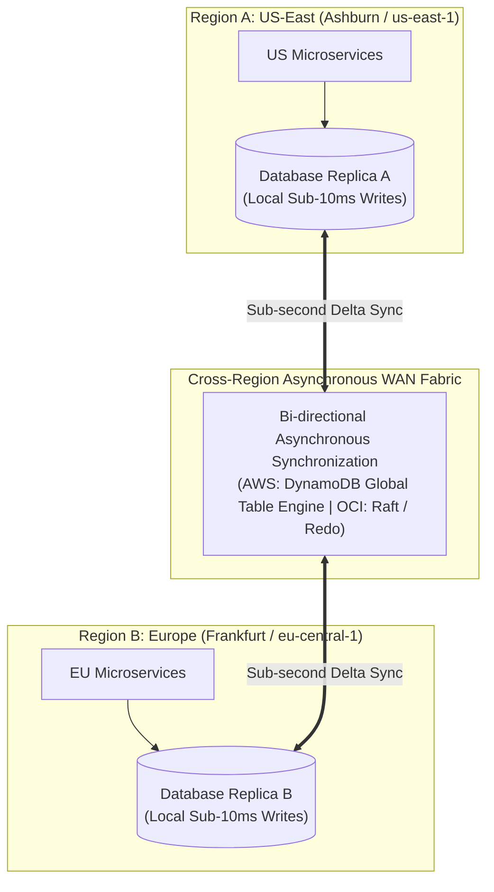

#### AWS Implementation
Create an Amazon DynamoDB Global Table spanning two regions using the AWS CLI [Doc: AWS DynamoDB Global Tables CLI, checked 2026]:

```bash
# Step 1: Create a DynamoDB table with stream enabled (mandatory for Global Tables)
aws dynamodb create-table \
  --table-name "GlobalUserSessions" \
  --attribute-definitions AttributeName=UserId,AttributeType=S \
  --key-schema AttributeName=UserId,KeyType=HASH \
  --billing-mode PAY_PER_REQUEST \
  --stream-specification StreamEnabled=true,StreamViewType=NEW_AND_OLD_IMAGES \
  --region us-east-1

# Step 2: Add secondary replica region (eu-west-1) to form a Global Table
aws dynamodb update-table \
  --table-name "GlobalUserSessions" \
  --replica-updates '[
    {
      "Create": {
        "RegionName": "eu-west-1"
      }
    }
  ]' \
  --region us-east-1
```

#### OCI Implementation
Provision an OCI Globally Distributed Autonomous Database with cross-region sharding [Doc: OCI Globally Distributed Database CLI, checked 2026]:

```bash
# Provision a Globally Distributed Database Sharded Topology in OCI
cat << 'EOF' > gdd-config.json
{
  "compartmentId": "ocid1.compartment.oc1..aaaaaaaam7...",
  "displayName": "Enterprise-Global-Sharded-DB",
  "dbDeploymentType": "DEDICATED",
  "shardingMethod": "USER_DEFINED",
  "shardDetails": [
    {
      "region": "us-ashburn-1",
      "computeCount": 4,
      "dataStorageSizeInTBs": 2
    },
    {
      "region": "eu-frankfurt-1",
      "computeCount": 4,
      "dataStorageSizeInTBs": 2
    }
  ]
}
EOF

oci distributed-database distributed-autonomous-database create --from-json file://gdd-config.json
```

#### Common Trap
Using DynamoDB Global Tables with Last-Writer-Wins (LWW) for financial ledger balances or inventory reservation counters without atomic attributes. If a user with \$100 balance makes a \$20 purchase in New York and a \$30 purchase in London within the same 500ms window, both regions read \$100. New York writes \$80, London writes \$70. When replication completes, the later write overwrites the earlier write; the final balance becomes \$70 instead of \$50, resulting in silent financial discrepancy. For counters, applications must use **Atomic Counters** (`ADD balance -20`) or implement distributed saga patterns rather than blind item puts.

#### Follow-up Question
How do CRDTs (Conflict-Free Replicated Data Types) mathematically guarantee deterministic state convergence across multi-master databases without clock synchronization or timestamp reliance?

---

### Q386: Global Anycast & Edge Ingress: AWS Global Accelerator vs OCI Anycast Routing

#### Question
How do global Anycast routing architectures bypass public internet congestion, eliminate DNS caching TTL delays during regional failovers, and accelerate TCP/TLS handshakes, and how do AWS Global Accelerator and OCI Anycast / FastConnect Dynamic Routing Gateways compare?

#### Short Answer
Standard internet routing relies on BGP over public internet service providers, subjecting traffic to unpredictable multi-hop routing, packet loss, and rigid DNS caching TTLs during outages. **Anycast Routing** advertises a single pair of static public IP addresses simultaneously from dozens of geographically dispersed edge Points of Presence (PoPs) worldwide. When a client connects, BGP routes their packets to the closest edge PoP; traffic terminates TCP/TLS locally at the edge and traverses the cloud provider's congestion-free private global fiber backbone to the application. **AWS Global Accelerator** provides two static Anycast IPs, accelerating traffic up to 60% and enabling **instant failover** (in under 10 seconds) between regions by altering private backbone routing without touching client DNS. **OCI** leverages native Anycast Border Gateway Protocol (BGP) routing across its edge network and Dynamic Routing Gateways (DRG) for deterministic private transit.

#### Deep Answer
The public internet is an unmanaged federation of independent transit autonomous systems (ASNs). A client in Singapore connecting to a server in Virginia traverses 15+ third-party routing hops, suffering high latency, jitter, and BGP route flapping.

**1. The Mechanics of Anycast Routing**:
- **BGP Anycast**: Multiple edge routers in Tokyo, Frankfurt, London, and New York advertise the identical IP address (`198.51.100.1`) to global internet exchanges.
- **Edge TCP Termination**:
  - In traditional Unicast: The 3-way TCP handshake and TLS 1.3 handshake must traverse the full cross-country WAN distance twice ($2 \times \text{RTT} \approx 300\text{ms}$).
  - In Anycast Edge Acceleration: The TCP SYN/ACK and TLS exchange terminates at the **local edge PoP** in under $10\text{ms}$.
  - The edge proxy forwards requests to the origin over pre-warmed, persistent TCP connection pools traveling across dedicated private cloud dark fiber.

**2. Instant Regional Failover (The Death of DNS TTL)**:
- In DNS-based failover, switching traffic from `us-east-1` to `us-west-2` requires updating DNS records, waiting for TTLs to expire, and dealing with recursive resolvers that ignore low TTLs.
- In **AWS Global Accelerator / OCI Anycast**:
  - The client's connection target **never changes**: they continue sending traffic to the exact same static Anycast IPs (`198.51.100.1` and `198.51.100.2`).
  - Edge proxies run health checks against backend regional endpoints (ALBs, EC2 instances, OCI Load Balancers).
  - When Region A fails, the edge proxies immediately reroute new TCP connections across the internal fiber backbone to Region B in **less than 10 seconds** [Doc: AWS Global Accelerator Failover Guide, checked 2026].
  - 100% of global clients transition instantly with zero DNS caching lag.

| Feature Dimension | AWS Global Accelerator | OCI Anycast Edge & DRG Routing |
| :--- | :--- | :--- |
| **IP Addressing Model** | Two static Anycast IPv4/IPv6 addresses | Static Anycast Public IPs / BGP Routing |
| **Protocol Support** | TCP and UDP (Layer 4) | TCP, UDP, HTTP, HTTPS |
| **Failover Latency** | $<10\text{ seconds}$ (Backbone reroute) | Real-time edge health-directed rerouting |
| **Client IP Preservation** | Native (preserves client IP in packets) | Native (via Proxy Protocol / X-Forwarded-For) |
| **Traffic Shifting / Dials**| Traffic Dial ($0\text{--}100\%$) per endpoint group | Weighted routing steering policies |

#### Architecture
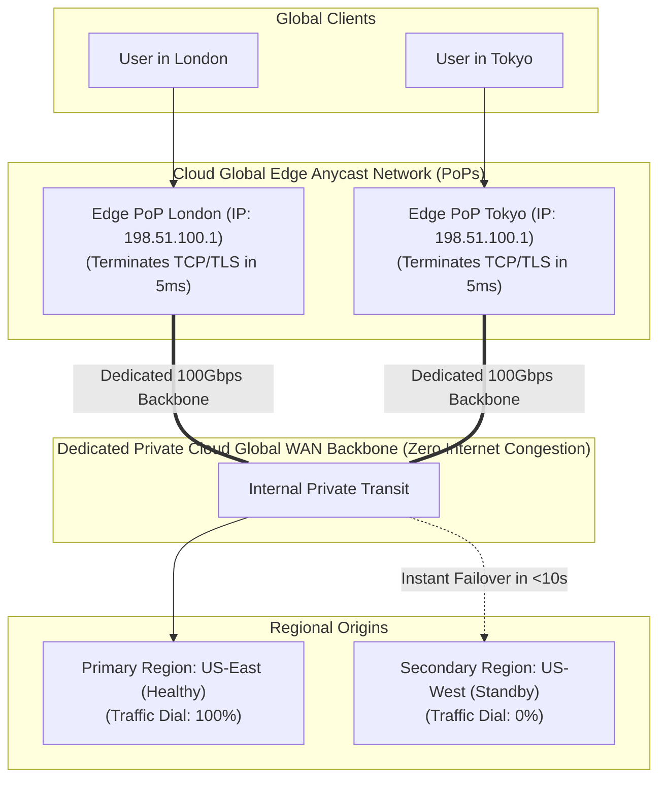

#### AWS Implementation
Deploy an AWS Global Accelerator with dual regional endpoint groups and configure traffic dials for testing [Doc: AWS Global Accelerator CLI, checked 2026]:

```bash
# Step 1: Create an Accelerator (Allocates two static Anycast IPs)
ACCEL_ARN=$(aws globalaccelerator create-accelerator \
  --name "EnterpriseGlobalAccelerator" \
  --ip-address-type "IPV4" \
  --enabled \
  --query 'Accelerator.AcceleratorArn' --output text)

# Step 2: Create a Listener on TCP port 443
LISTENER_ARN=$(aws globalaccelerator create-listener \
  --accelerator-arn "$ACCEL_ARN" \
  --port-ranges '[{"FromPort": 443, "ToPort": 443}]' \
  --protocol "TCP" \
  --query 'Listener.ListenerArn' --output text)

# Step 3: Add Primary Endpoint Group in us-east-1 and Secondary in us-west-2
aws globalaccelerator create-endpoint-group \
  --listener-arn "$LISTENER_ARN" \
  --endpoint-group-region "us-east-1" \
  --endpoint-configurations '[{"EndpointId": "arn:aws:elasticloadbalancing:us-east-1:123456789012:loadbalancer/app/prod-alb/123", "Weight": 128}]' \
  --traffic-dial-percentage 100.0

aws globalaccelerator create-endpoint-group \
  --listener-arn "$LISTENER_ARN" \
  --endpoint-group-region "us-west-2" \
  --endpoint-configurations '[{"EndpointId": "arn:aws:elasticloadbalancing:us-west-2:123456789012:loadbalancer/app/dr-alb/456", "Weight": 128}]' \
  --traffic-dial-percentage 0.0
```

#### OCI Implementation
Configure an OCI Dynamic Routing Gateway (DRG) with cross-region FastConnect peering and edge steering [Doc: OCI Dynamic Routing Gateway CLI, checked 2026]:

```bash
# Step 1: Create a Dynamic Routing Gateway (DRG) for multi-region transit
DRG_ID=$(oci network drg create \
  --compartment-id ocid1.compartment.oc1..aaaaaaaam7... \
  --display-name "Enterprise-MultiRegion-Transit-DRG" \
  --query 'data.id' --output text)

# Step 2: Attach DRG to VCN
oci network drg-attachment create \
  --drg-id "$DRG_ID" \
  --vcn-id ocid1.vcn.oc1.iad.aaaaaaaavcn... \
  --display-name "drg-vcn-attachment"

# Step 3: Configure OCI Anycast Public IP allocation on Load Balancer
oci lb load-balancer create \
  --compartment-id ocid1.compartment.oc1..aaaaaaaam7... \
  --display-name "anycast-ingress-lb" \
  --shape-name "flexible" \
  --shape-details '{"minimumBandwidthInMbps": 100, "maximumBandwidthInMbps": 2000}' \
  --subnet-ids '["ocid1.subnet.oc1.iad.aaaaaaaapublic..."]' \
  --is-private false
```

#### Common Trap
Using AWS Global Accelerator or Anycast routing without configuring sticky routing (`client-affinity`) for stateful or multi-step session workflows. While BGP Anycast routes traffic to the nearest PoP, transient BGP route flapping on the public internet can cause a client's 4th HTTP request to land at a different edge PoP than their 1st request. If the backend application relies on in-memory server sessions rather than externalized distributed caches (Redis), the client will be unexpectedly logged out. Anycast frontends mandate either stateless backends or externalized session tokens (JWTs / Redis).

#### Follow-up Question
How does AWS Global Accelerator's client IP preservation mechanism utilize source IP address virtualization and internal ENI headers without requiring backend reverse proxies to parse `X-Forwarded-For` HTTP headers?

---

### Q387: State Synchronization & Session Persistence: Distributed Caching across Regions

#### Question
How do cloud applications synchronize volatile user session state, shopping carts, and OAuth2 security tokens across geographical regions to ensure that sudden regional failover does not log out millions of active users, and how do ElastiCache Global Datastore and OCI Cache Redis compare?

#### Short Answer
Maintaining session continuity across regions requires externalizing session state from local application memory into distributed, cross-region replicated caching tiers. Storing sessions in in-memory single-node caches or sticky load balancer cookies guarantees that failing over to a secondary region forces all users to re-authenticate, dropping shopping carts and inflight transactions. **Amazon ElastiCache Global Datastore for Redis** provides managed cross-region replication: a primary cluster handles reads and writes, while up to two secondary clusters replicate state asynchronously across regions with typical latency of $<1\text{ second}$. **OCI Cache with Redis** provides high-throughput in-memory caching integrated with OCI Compute and OKE, supporting cluster cross-region mirroring via Redis Active-Active or automated asynchronous sync agents.

#### Deep Answer
Session persistence in disaster recovery is the boundary between a seamless user experience and an operational disaster where millions of users flood customer support after being kicked out of their accounts.

**1. Session Storage Paradigms**:
- **Sticky Sessions (Anti-Pattern for DR)**:
  - Load balancers route users to a specific backend server via cookie hash.
  - Failure Mode: When the instance or region fails, all session state is lost. Completely useless for cross-region disaster recovery.
- **Client-Side Stateless Tokens (JWTs)**:
  - Cryptographically signed JSON Web Tokens (JWT) contain user identity, roles, and expiration.
  - Stored in browser `localStorage` or `HttpOnly` cookies.
  - DR Advantage: 100% resilient across regions with zero data replication needed! The DR region simply needs the public key or shared KMS secret to verify token signatures.
  - Limitation: Cannot easily revoke tokens mid-session (e.g., immediate logout on password reset) and carries payload size overhead on every HTTP request.
- **Centralized Distributed In-Memory Cache (The Enterprise Standard)**:
  - Application stores session ID in cookie; full session state lives in Redis.
  - When Region A fails, Region B's Redis replica is already pre-warmed with all active session records. Users continue browsing without interruption.

**2. Amazon ElastiCache Global Datastore Mechanics**:
- **Architecture**: Links up to two cross-region secondary clusters to a primary ElastiCache for Redis cluster.
- **Replication**:
  - Uses specialized cross-region replication threads decoupled from the Redis core execution loop [Doc: ElastiCache Global Datastore Architecture, checked 2026].
  - Primary cluster write throughput is completely unaffected by WAN latency.
  - Sub-second replication ensures that session tokens generated in Virginia are valid in Oregon in $<800\text{ms}$.
- **Failover**:
  - Secondary cluster can be promoted to primary in under 1 minute via AWS Management Console or CLI.

**3. OCI Cache with Redis Mechanics**:
- **Fully Managed Service**: Powered by open-source Redis and Valkey compatibility, delivering sub-millisecond in-memory data storage.
- **Cross-Region Strategy**:
  - Utilizes OCI's high-speed private backbone.
  - Secondary regions deploy warm standby OCI Cache instances synchronized via continuous streaming connectors or application dual-write caching layers [Doc: OCI Cache with Redis Overview, checked 2026].

#### Architecture
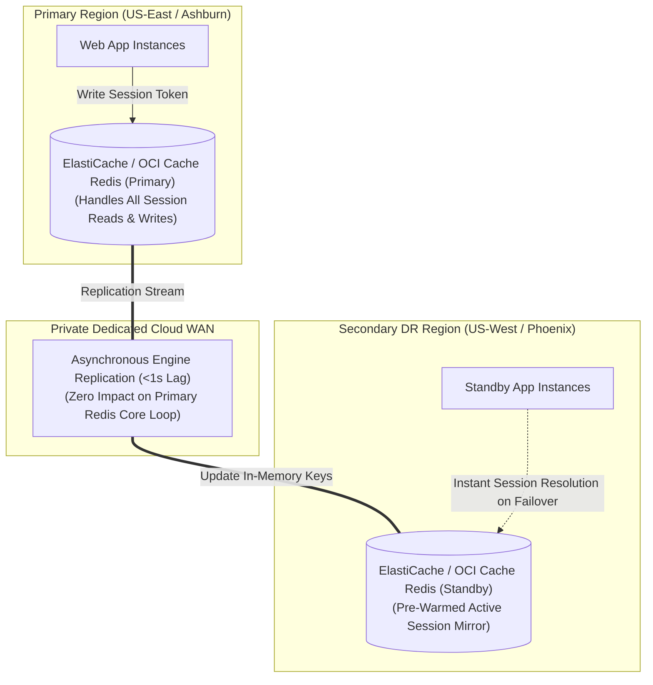

#### AWS Implementation
Provision an Amazon ElastiCache Global Datastore for Redis across two regions using the AWS CLI [Doc: AWS ElastiCache Global Datastore CLI, checked 2026]:

```bash
# Step 1: Create primary Redis cluster in us-east-1
aws elasticache create-replication-group \
  --replication-group-id "primary-redis-cluster" \
  --replication-group-description "Primary session cache in us-east-1" \
  --engine "redis" \
  --cache-node-type "cache.m6g.large" \
  --num-node-groups 2 \
  --replicas-per-node-group 1 \
  --automatic-failover-enabled \
  --region us-east-1

# Step 2: Create Global Datastore linking primary cluster
aws elasticache create-global-replication-group \
  --global-replication-group-id-suffix "enterprise-session-store" \
  --primary-replication-group-id "primary-redis-cluster" \
  --region us-east-1

# Step 3: Add secondary cluster in us-west-2 to the Global Datastore
aws elasticache create-replication-group \
  --replication-group-id "secondary-redis-cluster" \
  --replication-group-description "DR session cache in us-west-2" \
  --global-replication-group-id "enterprise-session-store" \
  --region us-west-2
```

#### OCI Implementation
Provision an OCI Cache with Redis cluster and configure memory limits using OCI CLI [Doc: OCI Cache with Redis CLI, checked 2026]:

```bash
# Provision an OCI Cache with Redis Cluster in Ashburn
cat << 'EOF' > oci-cache-config.json
{
  "compartmentId": "ocid1.compartment.oc1..aaaaaaaam7...",
  "displayName": "enterprise-session-cache",
  "nodeCount": 3,
  "nodeMemoryInGBs": 16,
  "softwareVersion": "REDIS_7_0",
  "subnetId": "ocid1.subnet.oc1.iad.aaaaaaaacachesubnet..."
}
EOF

oci redis redis-cluster create --from-json file://oci-cache-config.json
```

#### Common Trap
Synchronizing non-essential, transient ephemeral data (such as raw HTML page caches or heavy database query result sets) across the global cross-region cache datastore. Replicating gigabytes of static query caches over cross-region WAN connections consumes immense bandwidth, saturates Redis network buffers, and drives up cross-region data transfer fees. SREs must separate cache namespaces: store **ephemeral volatile query caches** in local, region-isolated Redis clusters, and restrict **cross-region global datastore replication** strictly to critical session authentication tokens, shopping carts, and security state.

#### Follow-up Question
How do you implement dual-write token patterns with fallback cache reads to prevent session loss during the exact 60-second window when an ElastiCache Global Datastore secondary cluster is being promoted to primary?

---

### Q388: Kubernetes Multi-Cluster HA & DR: EKS vs OKE Cross-Region Orchestration

#### Question
How do cloud platform engineers architect cross-region Kubernetes disaster recovery and active-active traffic distribution across Amazon EKS and OCI Container Engine for Kubernetes (OKE), and how do GitOps pipelines (ArgoCD/Flux) and multi-cluster ingress controllers prevent configuration drift across regional clusters?

#### Short Answer
Kubernetes control planes cannot span multiple cloud regions due to etcd's strict millisecond-level latency constraints for distributed consensus ($<5\text{ms}$ RTT required between etcd members). Therefore, cross-region Kubernetes disaster recovery mandates deploying **independent Kubernetes clusters in each region** (e.g., EKS in `us-east-1` and EKS in `us-west-2`, or OKE in Ashburn and OKE in Phoenix). Consistency and deployment synchronization are enforced using a **GitOps Pull Model (ArgoCD or Flux)**: Git serves as the single source of truth, continuously synchronizing identical container manifests, secrets, and Helm charts to both clusters. Global ingress is managed by Anycast routing or global DNS steering traffic across regional ingress controllers (Ingress-Nginx, Traefik, or cloud-native ALBs).

#### Deep Answer
Attempting to stretch a single Kubernetes cluster across multiple geographic regions is a known architectural anti-pattern. If etcd members are separated by WAN links ($70\text{ms}$ RTT), etcd heartbeat elections fail continuously, triggering constant leader re-elections that lock the Kubernetes API server and freeze the entire cluster control plane.

**1. The Multi-Cluster GitOps Architecture**:
- **Decoupled Autonomous Clusters**:
  - Cluster A (Primary) and Cluster B (Standby/Active) have independent control planes, independent etcd databases, independent CNI network overlays, and independent worker nodes.
  - If AWS `us-east-1` or OCI Ashburn control plane fails completely, Cluster B operates completely unaffected.
- **GitOps as the State Replicator**:
  - Operators **never** execute `kubectl apply` directly against production clusters.
  - An ArgoCD or Flux instance (running centrally or independently in each cluster) continuously polls a Git repository.
  - When an application update or configuration change merges to `main`, ArgoCD applies the identical manifest to Cluster A and Cluster B simultaneously [Doc: Multi-Cluster GitOps Architecture, checked 2026].
  - Environment-specific differences (such as regional KMS key ARNs, regional database connection strings, or replica counts) are injected cleanly using **Kustomize overlays** (`overlays/us-east-1` vs `overlays/us-west-2`).

**2. Global Ingress & Health Steering**:
- **AWS Pattern**:
  - AWS Load Balancer Controller provisions regional Application Load Balancers.
  - AWS Route 53 ARC or AWS Global Accelerator distributes external traffic across the two regional ALBs based on health checks.
- **OCI Pattern**:
  - OCI OKE Ingress Controller provisions regional OCI Flexible Load Balancers.
  - OCI Traffic Management Steering Policies direct global user traffic to the active or nearest OKE cluster.

#### Architecture
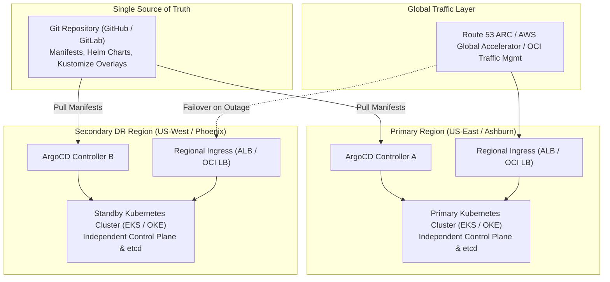

#### AWS Implementation
Deploy an ArgoCD Application managing cross-region Amazon EKS deployments using Kustomize overlays [Doc: EKS Multi-Cluster GitOps Guide, checked 2026]:

```yaml
# argocd-multi-region-application.yaml
apiVersion: argoproj.io/v1alpha1
kind: Application
metadata:
  name: payment-service-us-east-1
  namespace: argocd
spec:
  project: default
  source:
    repoURL: https://github.com/enterprise/payment-infrastructure.git
    targetRevision: HEAD
    path: k8s/overlays/us-east-1 # Regional Kustomize overlay
  destination:
    server: https://kubernetes.default.svc
    namespace: production
  syncPolicy:
    automated:
      prune: true
      selfHeal: true
---
apiVersion: argoproj.io/v1alpha1
kind: Application
metadata:
  name: payment-service-us-west-2
  namespace: argocd
spec:
  project: default
  source:
    repoURL: https://github.com/enterprise/payment-infrastructure.git
    targetRevision: HEAD
    path: k8s/overlays/us-west-2 # DR Regional Kustomize overlay
  destination:
    server: https://dr-eks-api.us-west-2.amazonaws.com # Remote DR Cluster
    namespace: production
  syncPolicy:
    automated:
      prune: true
      selfHeal: true
```

#### OCI Implementation
Deploy a production OCI Container Engine for Kubernetes (OKE) cluster in a secondary region using OCI CLI [Doc: OCI OKE Cluster Provisioning CLI, checked 2026]:

```bash
# Provision a DR OKE Enhanced Cluster in Phoenix
oci ce cluster create \
  --compartment-id ocid1.compartment.oc1..aaaaaaaam7... \
  --name "prod-oke-phoenix-dr" \
  --vcn-id ocid1.vcn.oc1.phx.aaaaaaaadrvcn... \
  --kubernetes-version "v1.30.1" \
  --cluster-type "ENHANCED_CLUSTER" \
  --endpoint-config '{"isPublicIpEnabled": true, "subnetId": "ocid1.subnet.oc1.phx.aaaaaaaak8sendpoint..."}'

# Generate local kubeconfig to register with central GitOps engine
oci ce cluster create-kubeconfig \
  --cluster-id ocid1.cluster.oc1.phx.aaaaaaaadrcluster... \
  --file ~/.kube/config-phoenix \
  --region "us-phoenix-1" \
  --token-version "2.0.0"
```

#### Common Trap
Hardcoding regional cloud resource identifiers (such as AWS IAM Role ARNs, SQS queue URLs, or OCI Vault Secret OCIDs) inside base Kubernetes deployment YAML files. When ArgoCD synchronizes the manifest to the secondary DR region, the pods in Region B attempt to connect to the SQS queue or assume the IAM role in Region A. During a regional outage in Region A, all pods in Region B crash on startup because their dependencies in Region A are dead. All regional dependencies must be abstracted using Kustomize environment overlays or externalized into Kubernetes ConfigMaps injected at deploy time.

#### Follow-up Question
How do cross-cluster service meshes (e.g., Istio Multi-Primary on different networks) route pod-to-pod east-west traffic across cloud regions securely via mutual TLS (mTLS) through Ingress Gateways?

---

### Q389: Network Partitioning & Split-Brain Mitigation: Fencing & Routing Controls

#### Question
What sequence of physical and architectural failures causes distributed systems to enter catastrophic "Split-Brain" states, how do automated fencing mechanisms (STONITH / Quorum Leases) isolate degraded partitions, and how do Route 53 ARC Routing Controls and OCI Traffic Steering prevent concurrent dual-primary writes?

#### Short Answer
A **Split-Brain** condition occurs when an unexpected network partition severs communication between distributed active-passive clusters, causing the passive cluster to incorrectly assume the primary is dead and promote itself to primary. Both clusters begin accepting client writes concurrently, creating divergent, irreconcilable data sets. Mitigation requires **Automated Fencing**: ensuring that a primary node is definitively dead before a secondary can be promoted. Techniques include **Node Fencing / STONITH ("Shoot The Other Node In The Head")** (powering off the unresponsive node via IPMI/hypervisor API), **Distributed Quorum Leases** (nodes must continuously refresh a timed lock in a majority consensus store like DynamoDB or etcd), and **Centralized Routing Controls** (Route 53 ARC or OCI Traffic Management safety rules that physically prohibit activating the secondary region unless the primary region's ingress is switched off).

#### Deep Answer
Split-brain is the most destructive failure mode in systems architecture. Hardware failures cause downtime; split-brain causes permanent silent data corruption.

**1. The Physics of the Split-Brain Trap**:
- Consider an Active-Passive database deployed across Region A and Region B.
- A backbone fiber cut severs WAN communication between Region A and Region B.
- Region B's health checker observes 100% packet loss from Region A.
- Region B executes an automated failover script: promotes its local database to primary and updates local DNS.
- However, Region A is **not dead**! Region A's local customers, internal network, and internet transit are 100% operational. Region A continues accepting writes from American users, while Region B starts accepting writes from European users.
- When the fiber link reconnects 2 hours later, you possess two distinct database timelines with overlapping primary keys and conflicting account balances.

**2. Modern Cloud Fencing & Split-Brain Prevention Mechanisms**:
- **Fencing Tokens**:
  - Every time a node claims leadership, it acquires a monotonically increasing number (**Fencing Token**, e.g., Token 42).
  - Storage targets (S3, block storage, database rows) reject any write possessing a token lower than the highest token seen. If the zombie old primary attempts a write with Token 41, the storage engine rejects it.
- **Quorum-Based Leases**:
  - A primary leader holds a time-limited lease (e.g., 10 seconds).
  - The lease requires continuous heartbeat renewal to a majority consensus store (such as Amazon DynamoDB Global Tables or OCI Distributed Database) spanning an odd number of regions (3 regions).
  - If a network partition isolates Region A, it cannot achieve majority quorum. Its lease expires in 10 seconds. Region A **self-terminates** (fences itself) before Region B is ever permitted to promote [Doc: Distributed Consensus and Fencing, checked 2026].
- **Application Recovery Controller (ARC) Routing Controls**:
  - AWS Route 53 ARC enforces **Safety Rules**:
    ```text
    Assert: (RegionA_Ingress == ON and RegionB_Ingress == OFF) OR (RegionA_Ingress == OFF and RegionB_Ingress == ON)
    ```
  - An operator or automated runbook is mathematically prevented from turning on Region B's routing switch without simultaneously turning off Region A's switch, preventing concurrent active ingress.

#### Architecture
```mermaid
graph TD
    subgraph "Split-Brain Anti-Pattern (Unfenced Dual-Primary Disaster)"
        REG_A_ERR["Region A: Accepts Local Writes\n(Believes it is alive)"]
        REG_B_ERR["Region B: Promotes Self to Primary!\n(Believes Region A is dead)"]
        REG_A_ERR -.x|WAN Partition| REG_B_ERR
        CORRUPT[("DATA CORRUPTION!\nDivergent Database States")]
        REG_A_ERR --> CORRUPT
        REG_B_ERR --> CORRUPT
    end

    subgraph "Fencing & Quorum Mitigation (Safe Consensus)"
        REG_A_OK["Region A: Primary (Holds Lease Token 42)"]
        REG_B_OK["Region B: Standby (Locked)"]
        WITNESS_Q[("3rd Location: Quorum Witness\n(etcd / DynamoDB / OCI Observer)")]
        
        REG_A_OK ===|Heartbeat Lease (Renews every 5s)| WITNESS_Q
        REG_B_OK ===|Monitors Lease| WITNESS_Q
        REG_A_OK -.->|Partitioned from Witness -> Lease Expires -> Self-Fence!| REG_B_OK
    end
```

#### AWS Implementation
Configure Route 53 ARC Assertion Safety Rules to prevent concurrent multi-region ingress activation [Doc: Route 53 ARC Safety Rules CLI, checked 2026]:

```bash
# Create an ARC Assertion Rule ensuring that at most ONE regional routing control can be active
aws route53-recovery-control-config create-safety-rule \
  --assertion-rule '{
    "Name": "PreventDualRegionSplitBrain",
    "ControlPanelArn": "arn:aws:route53-recovery-control::123456789012:controlpanel/cp-1234",
    "RuleConfig": {
      "Inverted": false,
      "Threshold": 1,
      "Type": "ATLEAST"
    },
    "AssertedControls": [
      "arn:aws:route53-recovery-control::123456789012:control/rc-us-east-1",
      "arn:aws:route53-recovery-control::123456789012:control/rc-us-west-2"
    ],
    "WaitPeriodMs": 5000
  }'
```

#### OCI Implementation
Configure an OCI Data Guard Fast-Start Failover threshold with automated fencing of the old primary [Doc: OCI Data Guard Fast-Start Failover Configuration, checked 2026]:

```bash
# Connect to Data Guard Broker via DGMGRL and set strict failover threshold and auto-reinstate
dgmgrl sys/ComplexPassword123!@primary_iad << 'EOF'
-- Enable Fast-Start Failover with 30-second heartbeat threshold
ENABLE FAST_START FAILOVER;
SET FAST_START FAILOVER THRESHOLD = 30;

-- Enforce automatic shutdown (fencing) of old primary upon failover
EDIT DATABASE 'iad_primary' SET PROPERTY FastStartFailoverTarget = 'phx_standby';
EDIT DATABASE 'iad_primary' SET PROPERTY AutoReinstate = 'TRUE';
EOF
```

#### Common Trap
Implementing automated failover scripts that promote the standby database without actively cutting off ingress or revoking credentials on the primary database. If an automated script promotes the secondary database while the primary is still powered on, existing application connections in the primary region will continue writing data to the old primary database. Even a 60-second overlap can generate thousands of orphan transactions that must be manually extracted and reconciled row-by-row during post-incident recovery.

#### Follow-up Question
How does the generation clock / fencing token pattern prevent a delayed, stale network packet from a partitioned former leader from overwriting data committed by a newly elected leader?

---

### Q390: DR Testing, Game Days & Automation: Chaos Injection & Full-Stack Orchestration

#### Question
Why do static disaster recovery documentation plans inevitably fail during real production crises, how do cloud platform engineering teams automate and validate multi-region failovers via Chaos Engineering Game Days, and how do AWS Fault Injection Service (FIS) and OCI Full Stack Disaster Recovery (FSDR) compare?

#### Short Answer
Disaster recovery runbooks documented on static wikis degrade rapidly due to continuous configuration drift, IAM policy updates, and undocumented application dependencies. Resilient organizations mandate **Automated Disaster Recovery Testing & Chaos Game Days**: deliberately inducing simulated regional failures in production or staging to validate automated recovery workflows. **AWS Fault Injection Service (FIS)** injects controlled cross-region disruptions (such as terminating regional cross-region network connectivity, exhausting cross-region replication bandwidth, or revoking database credentials) bounded by automated stop-conditions. **OCI Full Stack Disaster Recovery (FSDR)** provides a fully managed, declarative DR orchestration platform that generates, executes, and audits non-disruptive **DR Drills** across compute, database, and storage stacks with comprehensive compliance audit logging.

#### Deep Answer
An untested disaster recovery plan is merely an unverified hypothesis. The history of cloud outages is littered with companies whose DR procedures failed on Game Day because a database password changed 6 months prior, an SSL certificate was not renewed in the DR region, or an IAM role lacked cross-region permissions.

**1. Principles of Chaos Engineering & Game Days**:
- **Hypothesis-Driven Testing**: State a specific, falsifiable hypothesis: *"When us-east-1 loses Aurora database connectivity, Route 53 ARC and AWS DRS will restore 100% of order traffic in us-west-2 within 12 minutes with zero data corruption."*
- **Blast Radius Containment**: Automated stop-conditions monitor business golden signals (e.g., payment failure rate). If uncontained errors exceed thresholds, chaos injection aborts immediately and rolls back.
- **Surfacing Hidden Dependencies**: Game Days frequently discover that an application running in the DR region silently depends on an S3 bucket, secret, or OAuth endpoint hardcoded to the primary region.

**2. AWS Fault Injection Service (FIS)**:
- **Cloud-Native Chaos Injection**: Managed chaos platform supporting complex multi-action experiments.
- **Disaster Recovery Actions**:
  - `aws:network:disrupt-cross-region-connectivity`: Simulates a complete fiber cut between two AWS regions.
  - `aws:fis:inject-api-internal-error`: Injects 500 errors into AWS API calls (e.g., simulating regional EC2 or STS control plane failure) [Doc: AWS Fault Injection Service DR Experiments, checked 2026].
  - Evaluates CloudWatch Alarms as automated rollbacks (`stopConditions`).

**3. OCI Full Stack Disaster Recovery (FSDR)**:
- **Comprehensive Lifecycle Management**:
  - Unlike generic script runners, FSDR is an enterprise DR management service that orchestrates failover, switchover, and testing across the entire infrastructure topology (Compute, Storage, Autonomous DB, Base DB, Load Balancers, and Custom Scripts).
- **Non-Disruptive DR Drills**:
  - Creates an isolated clone of the production environment in the DR region using storage volume shadow copies and read-only database snapshots.
  - Executes full application startup and verification workflows without interrupting live production traffic or breaking continuous replication pipelines [Doc: OCI Full Stack Disaster Recovery Drills, checked 2026].
  - Produces certified PDF audit reports verifying compliance with regulatory mandates (DORA, HIPAA, SOC 2).

#### Architecture
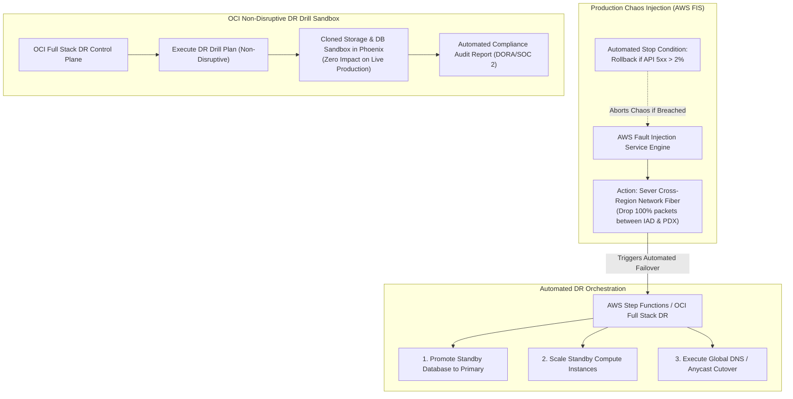

#### AWS Implementation
Configure an AWS Fault Injection Service (FIS) experiment template to simulate regional cross-region network disruption [Doc: AWS FIS Experiment Templates, checked 2026]:

```json
// fis-cross-region-disrupt.json
{
  "description": "Simulate complete network partition between us-east-1 and us-west-2",
  "targets": {
    "SubnetsToDisrupt": {
      "resourceType": "aws:ec2:subnet",
      "resourceArns": ["arn:aws:ec2:us-east-1:123456789012:subnet/subnet-0a1b2c3d4e"],
      "selectionMode": "ALL"
    }
  },
  "actions": {
    "DisruptCrossRegionWAN": {
      "actionId": "aws:network:disrupt-cross-region-connectivity",
      "parameters": {
        "duration": "PT15M",
        "peerRegion": "us-west-2"
      },
      "targets": { "Subnets": "SubnetsToDisrupt" }
    }
  },
  "stopConditions": [
    {
      "source": "aws:cloudwatch:alarm",
      "value": "arn:aws:cloudwatch:us-east-1:123456789012:alarm:CriticalPaymentDrop"
    }
  ],
  "roleArn": "arn:aws:iam::123456789012:role/FISDisasterRecoveryRole"
}
```

```bash
# Create and start the AWS FIS experiment
EXPERIMENT_ID=$(aws fis create-experiment-template --cli-input-json file://fis-cross-region-disrupt.json --query 'experimentTemplate.id' --output text)
aws fis start-experiment --experiment-template-id "$EXPERIMENT_ID"
```

#### OCI Implementation
Create and execute a non-disruptive Disaster Recovery Drill Plan in OCI Full Stack Disaster Recovery [Doc: OCI Full Stack DR Drill CLI, checked 2026]:

```bash
# Step 1: Create a DR Drill Plan in the DR Protection Group
oci disaster-recovery dr-plan create \
  --dr-protection-group-id ocid1.drprotectiongroup.oc1.phx.aaaaaaaadr... \
  --display-name "Quarterly-Compliance-DR-Drill" \
  --type "DRILL"

# Step 2: Execute the DR Drill Plan (Provisions sandboxed validation environment)
oci disaster-recovery dr-plan-execution create \
  --dr-protection-group-id ocid1.drprotectiongroup.oc1.phx.aaaaaaaadr... \
  --plan-id ocid1.drplan.oc1.phx.aaaaaaaadrillplan... \
  --execution-options '{"planExecutionType": "DRILL"}' \
  --display-name "Execute-Q1-2026-DR-Drill"

# Step 3: Check execution status and export certified audit log
oci disaster-recovery dr-plan-execution get \
  --dr-plan-execution-id ocid1.drplanexecution.oc1.phx.aaaaaaaaxample...
```

#### Common Trap
Conducting disaster recovery tests only during scheduled weekend maintenance windows with prior notification to all engineering teams. When engineers know a DR drill is happening at 10:00 AM on Saturday, they manually intervene behind the scenes: manually warming connection pools, manually modifying DNS records, and babysitting database promotions. This proves that an *army of engineers with prior warning* can restore service, not that your automated cloud architecture can self-heal during an unexpected 3:00 AM weekday crisis. Mature cloud organizations run unannounced Game Days during normal business hours.

#### Follow-up Question
How do you structure automated post-drill cleanup scripts in OCI Full Stack DR or AWS Step Functions to ensure that all ephemeral compute and cloned volumes provisioned during a drill are completely terminated, preventing compounding cloud bill accrual?

---

### Q391: Failback Engineering: Reverse Replication & Delta Resynchronization

#### Question
Why is returning to the primary cloud region ("Failback") often significantly more complex and hazardous than the initial failover, how do cloud architectures establish reverse replication streams, and what are the operational procedures to prevent double-write data corruption during failback?

#### Short Answer
**Failback** is the operational process of returning production workloads from the disaster recovery region back to the restored primary region once the original outage is resolved. Failback is fundamentally more dangerous than failover because the DR region has accumulated hours or days of new transactions that **do not exist in the primary region**. To execute failback safely without data loss: (1) **Reverse Replication** must be established (streaming delta changes backwards from the DR region to the primary region); (2) A controlled, scheduled **Planned Maintenance Window** must be declared; (3) Write traffic is temporarily quiesced or placed in read-only mode; (4) The final delta lag is drained to zero; (5) Roles are swapped (reinstating the primary); and (6) Forward replication is re-established.

#### Deep Answer
Most disaster recovery strategies focus 95% of their engineering effort on *failing over*, treating *failback* as an afterthought. This leads to severe operational panics: if you simply switch DNS back to Region A without reverse replication, all writes made during the disaster in Region B are instantly wiped out or orphaned.

**1. The Mechanics of Reverse Replication**:
- During normal operations: Region A $\rightarrow$ Region B.
- During disaster failover: Region B is promoted to standalone primary. Region A is dead.
- When Region A recovers:
  - Region A's database contains stale data (its state at the moment of the crash).
  - Region B contains all recent production data.
  - **The Re-Instate Step**: Region A must be downgraded to a **standby replica** of Region B.
  - The replication stream is reversed: Region B $\rightarrow$ Region A.
  - The replication engine streams all accumulated delta changes (transactions committed in Region B during the outage) back to Region A until replication lag reaches near-zero ($<1\text{ second}$).

**2. The Safe 6-Step Failback Procedure**:
1. **Health Verification**: Verify that Region A's underlying infrastructure (compute capacity, networking, IAM, KMS) is 100% stable and fully operational.
2. **Reverse Replication Catch-Up**: Establish reverse replication from Region B to Region A. Wait until replication lag drops below 1 second.
3. **Traffic Quiescence (Maintenance Window)**:
   - Temporarily set the application frontend into read-only mode or drain active client connections.
   - Stop accepting new transactional writes in Region B for 30–60 seconds.
4. **Final Drain (Lag = 0)**:
   - Verify that Region A has applied 100% of outstanding redo logs from Region B ($\text{Lag} = 0$).
5. **Planned Role Reversal (Switchover)**:
   - Demote Region B to standby.
   - Promote Region A back to primary.
   - Update DNS / Global Accelerator to point global traffic back to Region A.
6. **Forward Replication Resumption**:
   - Re-establish standard forward replication: Region A $\rightarrow$ Region B.
   - Lift read-only mode and resume full transactional traffic.

#### Architecture
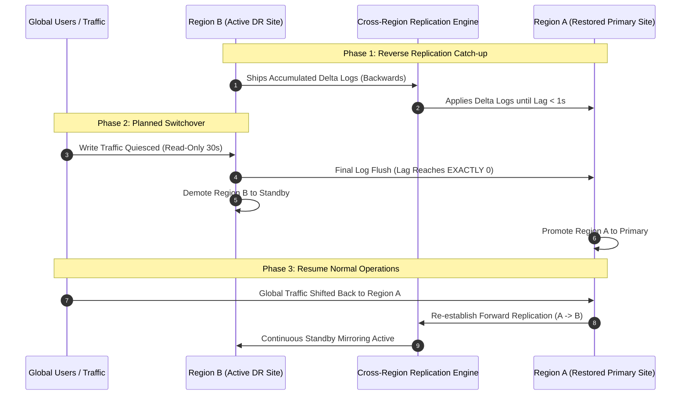

#### AWS Implementation
Establish reverse replication on an Aurora Global Database and execute a planned managed switchover back to the primary region [Doc: AWS Aurora Global Database Switchover, checked 2026]:

```bash
# Step 1: Monitor replication lag between DR cluster (us-west-2) and restored cluster (us-east-1)
aws cloudwatch get-metric-data \
  --metric-data-queries '[{
    "Id": "m1",
    "MetricStat": {
      "Metric": {
        "Namespace": "AWS/RDS",
        "MetricName": "AuroraGlobalDBReplicationLag",
        "Dimensions": [{ "Name": "DBClusterIdentifier", "Value": "prod-aurora-us-east-1" }]
      },
      "Period": 60,
      "Stat": "Maximum"
    }
  }]' \
  --start-time 1772841600 \
  --end-time 1772845200

# Step 2: Execute planned managed switchover to reinstate us-east-1 as primary with zero data loss
aws rds switchover-global-cluster \
  --global-cluster-identifier "enterprise-global-db" \
  --target-db-cluster-identifier "arn:aws:rds:us-east-1:123456789012:cluster:prod-aurora-us-east-1"
```

#### OCI Implementation
Reinstate a recovered primary database as a standby and execute a switchover back using OCI Data Guard [Doc: OCI Data Guard Reinstatement CLI, checked 2026]:

```bash
# Step 1: Reinstate the recovered Ashburn database as a standby of the active Phoenix database
oci db autonomous-database reinstate \
  --autonomous-database-id ocid1.autonomousdatabase.oc1.iad.aaaaaaaarecovered...

# Step 2: Verify that synchronization lag between Phoenix and Ashburn has converged to zero
oci db autonomous-database get \
  --autonomous-database-id ocid1.autonomousdatabase.oc1.iad.aaaaaaaarecovered... \
  --query 'data."data-guard-details"."lag-in-seconds"'

# Step 3: Perform a zero-downtime Switchover to return primary role to Ashburn
oci db autonomous-database switchover \
  --autonomous-database-id ocid1.autonomousdatabase.oc1.phx.aaaaaaaaphoenixprimary...
```

#### Common Trap
Rushing to failback immediately the moment the primary region shows signs of recovery. A primary region recovering from a major electrical or networking incident often experiences **flapping connectivity** (intermittent network blips or power fluctuations) for 1 to 2 hours after initial power restoration. Attempting failback while the primary region is unstable can cause a mid-failback network drop, leaving the database half-promoted in Region A and demoted in Region B, causing a total outage across both regions. SRE best practice mandates enforcing a **stability baking window** (typically 4 to 24 hours of sustained, verified regional stability) before initiating failback.

#### Follow-up Question
How do storage snapshot engines (such as AWS Elastic Disaster Recovery or OCI Block Volume Replication) compute changed block tracking (CBT) bitmaps to synchronize only modified sectors during failback without re-transmitting multi-terabyte disks in full?

---

### Q392: Serverless Multi-Region Failover: EventBridge Global Endpoints vs OCI API Gateway

#### Question
How do cloud serverless architectures achieve automated cross-region failover for event-driven and REST API workloads without provisioning idle compute, and how do Amazon EventBridge Global Endpoints compare to OCI API Gateway multi-region deployments?

#### Short Answer
Serverless disaster recovery relies on decoupling event ingestion from regional execution environments. **Amazon EventBridge Global Endpoints** provides a global endpoint DNS hostname that routes events to a primary region's EventBridge bus; if regional CloudWatch alarms breach (e.g., custom metric or health check), EventBridge automatically fails over event ingestion to a secondary region's bus within minutes, backed by opt-in automatic event replication to prevent event loss. **OCI API Gateway** deployed across multiple regions achieves resilience by pairing regional gateways with **OCI Traffic Management Failover Steering Policies**: client API calls route to the primary region's gateway, failing over to the secondary region if health probes fail, while backend OCI Functions execute serverless business logic without paying for idle compute in either region.

#### Deep Answer
Serverless architectures (AWS Lambda, OCI Functions, EventBridge, API Gateway) scale from zero and bill per execution, making them inherently cost-effective for disaster recovery. However, serverless components are regionally scoped: an outage in `us-east-1` halts Lambda invocations, EventBridge bus rule evaluations, and API Gateway endpoints in that region.

**1. Amazon EventBridge Global Endpoints Architecture**:
- **Global Ingress Hostname**: Applications publish events to a single global endpoint:
  `https://abc123xyz.endpoint.events.data.aws/event`
- **Automated Health-Directed Routing**:
  - EventBridge monitors an Amazon Route 53 health check tied to CloudWatch alarms in the primary region (e.g., tracking Lambda invocation error rate or bus ingestion latency).
  - If the primary region degrades, EventBridge automatically redirects incoming event traffic to the secondary region's event bus within minutes [Doc: EventBridge Global Endpoints, checked 2026].
- **Event Replication**:
  - Optional feature: Even during normal operations, EventBridge can replicate events to the secondary region, ensuring secondary event consumers or data lakes remain in sync.

**2. OCI API Gateway Multi-Region Architecture**:
- **Regional Deployment with Edge Steering**:
  - An OCI API Gateway is deployed in Ashburn and another in Phoenix, both configured with identical deployment specifications (routes, authorization policies, CORS, rate limits).
  - Backend targets point to local OCI Functions or OKE services.
- **Traffic Management Steering**:
  - An OCI Traffic Management Failover Steering Policy maps a public domain (e.g., `api.enterprise.com`) to the Ashburn and Phoenix API Gateway public IP addresses [Doc: OCI API Gateway High Availability, checked 2026].
  - Health checks continuously probe the `/healthz` route on each gateway. If Ashburn fails, OCI DNS steers traffic to Phoenix within seconds.
  - Because OCI Functions only charges when invoked, maintaining a hot DR gateway and function deployment in Phoenix incurs virtually zero idle compute cost.

#### Architecture
```mermaid
graph TD
    subgraph "Event Producers / API Clients"
        PROD["Web Apps / SaaS Partners / IoT Devices"]
    end

    subgraph "AWS Serverless Multi-Region (EventBridge)"
        GEP["EventBridge Global Endpoint\n(Single Global Ingestion URL)"]
        R53_HC["Route 53 Health Check / CW Alarm"]
        BUS_PRI["Primary Bus (us-east-1)"]
        BUS_SEC["Secondary Bus (us-west-2)"]
        
        PROD --> GEP
        R53_HC -.->|Controls Ingress| GEP
        GEP -->|Primary Route (Healthy)| BUS_PRI
        GEP -.->|Failover Route (<2m)| BUS_SEC
    end

    subgraph "OCI Serverless Multi-Region (API Gateway)"
        OCI_DNS["OCI Traffic Management Steering Policy\n(Anycast Edge Failover)"]
        GW_IAD["API Gateway: Ashburn (Primary)"]
        GW_PHX["API Gateway: Phoenix (Standby)"]
        FN_IAD["OCI Functions (Ashburn)"]
        FN_PHX["OCI Functions (Phoenix - Zero Idle Cost!)"]
        
        PROD --> OCI_DNS
        OCI_DNS --> GW_IAD
        OCI_DNS -.->|Failover| GW_PHX
        GW_IAD --> FN_IAD
        GW_PHX --> FN_PHX
    end
```

#### AWS Implementation
Configure an Amazon EventBridge Global Endpoint with automated failover and event replication using AWS CLI [Doc: AWS EventBridge Global Endpoints CLI, checked 2026]:

```bash
# Create an EventBridge Global Endpoint spanning us-east-1 and us-west-2
aws events create-endpoint \
  --name "enterprise-order-global-endpoint" \
  --routing-config '{
    "FailoverConfig": {
      "Primary": {
        "HealthCheck": "arn:aws:route53:::healthcheck/11112222-3333-4444-5555-666677778888"
      },
      "Secondary": {
        "Route": "us-west-2"
      }
    }
  }' \
  --replication-config '{"State": "ENABLED"}' \
  --event-buses '[
    {"EventBusArn": "arn:aws:events:us-east-1:123456789012:event-bus/orders-bus"},
    {"EventBusArn": "arn:aws:events:us-west-2:123456789012:event-bus/orders-bus"}
  ]'
```

#### OCI Implementation
Deploy an identical API Gateway deployment in a secondary region for zero-downtime failover using OCI CLI [Doc: OCI API Gateway CLI, checked 2026]:

```bash
# Step 1: Create an API Gateway in the DR region (us-phoenix-1)
GATEWAY_ID=$(oci api-gateway gateway create \
  --compartment-id ocid1.compartment.oc1..aaaaaaaam7... \
  --display-name "phoenix-dr-api-gateway" \
  --endpoint-type "PUBLIC" \
  --subnet-id ocid1.subnet.oc1.phx.aaaaaaaadrsubnet... \
  --region "us-phoenix-1" \
  --query 'data.id' --output text)

# Step 2: Deploy API routes pointing to local Phoenix OCI Functions
cat << 'EOF' > oci-dr-api-deployment.json
{
  "routes": [
    {
      "path": "/orders",
      "methods": ["POST"],
      "backend": {
        "type": "ORACLE_FUNCTIONS_BACKEND",
        "functionId": "ocid1.fnfunc.oc1.phx.aaaaaaaaphoenixorderfunc..."
      }
    }
  ]
}
EOF

oci api-gateway deployment create \
  --compartment-id ocid1.compartment.oc1..aaaaaaaam7... \
  --gateway-id "$GATEWAY_ID" \
  --display-name "orders-service-dr-deployment" \
  --path-prefix "/v1" \
  --specification file://oci-dr-api-deployment.json \
  --region "us-phoenix-1"
```

#### Common Trap
Configuring serverless multi-region failover without synchronizing idempotent request tokens. When an API client submits a payment request to Region A, and Region A experiences a network drop before returning the HTTP response, the client automatically retries the payment request against Region B. If Region B's serverless function does not share a distributed idempotency cache (e.g., DynamoDB Global Tables or OCI Cache) with Region A, Region B will execute the payment a second time, charging the customer twice. Serverless DR architectures must enforce cross-region distributed idempotency checks.

#### Follow-up Question
How do you structure EventBridge event replication rules to prevent infinite event ping-pong loops where an event replicated from Region A to Region B is mistakenly picked up by Region B's rules and replicated back to Region A?

---

### Q393: Message Broker Cross-Region Replication: SQS / EventBridge vs OCI Streaming & MirrorMaker 2

#### Question
How do cloud message brokers and distributed event streaming platforms replicate inflight queues and partitioned event streams across regions, and what are the operational differences between Amazon SQS cross-region bridging vs OCI Streaming / Apache Kafka MirrorMaker 2 replication?

#### Short Answer
Replicating message brokers across cloud regions involves distinct paradigms depending on whether the system uses **discrete message queues (SQS)** or **ordered partitioned log streams (Kafka / OCI Streaming)**. Amazon SQS does not support native multi-region queue replication; cross-region SQS resilience requires client-side dual-publishing, EventBridge cross-region event forwarding, or dedicated forwarder Lambda functions that consume from Region A and publish to Region B. In contrast, **OCI Streaming** (being fully Apache Kafka API compatible) natively supports **Kafka MirrorMaker 2 (MM2)**: an active-active or active-passive cluster connector that continuously replicates topic partitions, consumer group offsets, and message metadata across OCI regions over private FastConnect or DRG tunnels.

#### Deep Answer
Asynchronous messaging is the nervous system of modern decoupled applications. If an entire cloud region fails while 100,000 messages sit unconsumed in an SQS queue or Kafka partition, those messages are inaccessible until the region recovers.

**1. Discrete Queue Replication (Amazon SQS / AWS Message Queues)**:
- **The Ephemeral Queue Constraint**:
  - SQS queues are strictly regional. Messages are replicated across multiple AZs within a region, but SQS provides **zero native cross-region replication**.
  - If `us-east-1` goes dark, inflight messages inside an SQS queue in `us-east-1` cannot be read by workers in `us-west-2`.
- **Architectural Mitigation Patterns**:
  - *Client Dual-Publishing*: Ingest microservices write messages simultaneously to `queue-us-east-1` and `queue-us-west-2`, using message deduplication IDs to prevent duplicate processing.
  - *EventBridge / SNS Fanout*: Microservices publish to an Amazon SNS topic or EventBridge bus; SNS/EventBridge fans out the message to an SQS queue in `us-east-1` and an SQS queue in `us-west-2` asynchronously.

**2. Distributed Log Streaming (OCI Streaming & Kafka MirrorMaker 2)**:
- **Offset Synchronization**:
  - In Kafka / OCI Streaming, messages are immutable append-only logs.
  - **MirrorMaker 2 (MM2)** runs on Kafka Connect (or OCI Service Connector Hub). It reads from source stream partitions in Ashburn and writes to destination stream partitions in Phoenix.
  - **Offset Translation**: Because record offsets can differ between clusters, MM2 maintains internal translation topics (`checkpoint` and `heartbeat` topics) [Doc: OCI Streaming with Kafka MirrorMaker 2, checked 2026].
  - When consumers fail over to Phoenix, MM2 translates the consumer group's committed offset, ensuring workers resume processing from the exact correct position without reprocessing gigabytes of historical data.

| Feature Dimension | Amazon SQS Cross-Region | OCI Streaming / Kafka MirrorMaker 2 |
| :--- | :--- | :--- |
| **Native Engine Replication**| No (Requires SNS/EventBridge Fanout) | Yes (Native Kafka MirrorMaker 2 / MM2) |
| **Data Ordering** | Best-effort (or FIFO within group) | Strict partition order preserved |
| **Consumer Offset Sync** | None (Discrete messages deleted upon ACK)| Automated consumer group offset translation |
| **Failover Mechanics** | Switch workers to secondary queue | Switch Kafka consumer bootstrap server |
| **Inflight Data Retention** | Messages trapped until primary recovers | Continuously mirrored to secondary stream |

#### Architecture
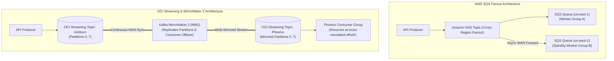

#### AWS Implementation
Configure Amazon SNS cross-region fanout to deliver messages to SQS queues in both primary and secondary regions [Doc: Amazon SNS Cross-Region Delivery, checked 2026]:

```bash
# Step 1: Create SQS Queue in primary region (us-east-1) and DR region (us-west-2)
aws sqs create-queue --queue-name "orders-queue" --region us-east-1
aws sqs create-queue --queue-name "orders-queue-dr" --region us-west-2

# Step 2: Subscribe the DR queue in us-west-2 to the SNS topic in us-east-1
aws sns subscribe \
  --topic-arn "arn:aws:sns:us-east-1:123456789012:orders-fanout-topic" \
  --protocol "sqs" \
  --notification-endpoint "arn:aws:sqs:us-west-2:123456789012:orders-queue-dr" \
  --attributes '{"RawMessageDelivery": "true"}' \
  --region us-east-1
```

#### OCI Implementation
Configure an OCI Stream and deploy a Kafka MirrorMaker 2 configuration to replicate streaming data across OCI regions [Doc: OCI Streaming Kafka MirrorMaker 2 Guide, checked 2026]:

```bash
# Create an OCI Streaming Pool in Ashburn (Source) and Phoenix (Target)
oci streaming admin stream-pool create \
  --compartment-id ocid1.compartment.oc1..aaaaaaaam7... \
  --name "EnterpriseStreamPool" \
  --region "us-ashburn-1"

oci streaming admin stream-pool create \
  --compartment-id ocid1.compartment.oc1..aaaaaaaam7... \
  --name "EnterpriseStreamPool-DR" \
  --region "us-phoenix-1"
```

```properties
# mm2.properties configuration for Kafka MirrorMaker 2 on OCI
clusters = ashburn, phoenix
ashburn.bootstrap.servers = cell-1.streaming.us-ashburn-1.oci.oraclecloud.com:9092
phoenix.bootstrap.servers = cell-1.streaming.us-phoenix-1.oci.oraclecloud.com:9092

# Enable replication from Ashburn to Phoenix
ashburn->phoenix.enabled = true
ashburn->phoenix.topics = enterprise-order-events
ashburn->phoenix.sync.group.offsets.enabled = true
ashburn->phoenix.emit.checkpoints.enabled = true
```

#### Common Trap
Failing over to a secondary Kafka/OCI Streaming cluster without consumer offset synchronization. In Kafka, message offsets are sequential integers ($0, 1, 2, 3 \dots$) assigned locally per partition. If MirrorMaker 2 does not translate consumer group offsets (or if consumers simply reset to `earliest`), worker applications in the DR region will re-consume months of historical messages upon failover, generating massive duplicate transaction cascades and corrupting downstream databases.

#### Follow-up Question
How do you achieve exactly-once processing semantics (EOS) across cross-region message consumers using transactional outbox patterns and unique database idempotency deduplication keys?

---

### Q394: Block Volume & VM Replication: AWS DRS vs OCI Cross-Region Block Volume Replication

#### Question
How do continuous block-level data protection (CDP) and asynchronous block volume replication synchronize stateful virtual machine disks across regions without guest OS agent performance penalties, and how do AWS Elastic Disaster Recovery (AWS DRS) and OCI Cross-Region Block Volume Replication compare?

#### Short Answer
Replicating stateful virtual machine filesystems across regions requires capturing write I/O below or at the block layer. **AWS Elastic Disaster Recovery (AWS DRS)** utilizes a lightweight OS-level agent inside the source VM that captures every block write in real-time (Continuous Data Protection - CDP), streaming encrypted deltas across the network to low-cost staging storage (EBS gp3 volumes attached to t3.small replication servers in the DR region); upon disaster, AWS DRS automatically executes automated machine conversion to launch full-scale EC2 instances in minutes. In contrast, **OCI Cross-Region Block Volume Asynchronous Replication** operates completely **agentless at the storage hypervisor layer**: the OCI storage fabric continuously replicates block volume deltas directly between Ashburn and Phoenix over private cloud backbones, achieving sub-15-minute RPO with zero CPU/memory footprint on guest operating systems.

#### Deep Answer
Migrating or protecting legacy, stateful, or proprietary enterprise workloads (SAP, monolithic relational databases, legacy Windows applications) that cannot be refactored into cloud-native serverless or managed databases requires block-level replication.

**1. AWS Elastic Disaster Recovery (AWS DRS) Architecture**:
- **Continuous Data Protection (CDP)**:
  - An AWS Replication Agent is installed in the source OS (Linux or Windows, running on on-premises VMware, physical servers, or AWS EC2).
  - Intercepts block writes at the kernel block-driver layer before writing to disk.
  - Streams changed blocks asynchronously over TLS to an isolated **Staging Area Subnet** in the recovery AWS region [Doc: AWS Elastic Disaster Recovery User Guide, checked 2026].
- **Cost-Optimized Staging Architecture**:
  - The DR region does *not* run expensive enterprise compute instances 24/7!
  - It runs a few tiny, shared **Replication Servers** (e.g., `t3.small`) attached to low-cost staging EBS volumes.
  - You pay only for EBS staging storage and tiny replication instances.
- **Automated Recovery Launch**:
  - When disaster occurs, an operator triggers a "Drill" or "Recovery Launch".
  - The AWS DRS service automatically provisions target EC2 instances matching production specifications, injects hypervisor drivers (ENA, NVMe), attaches the replicated storage, and boots the VMs in under 15 minutes.

**2. OCI Cross-Region Block Volume Replication Architecture**:
- **Agentless Hypervisor Replication**:
  - Zero software installed inside the guest OS. Zero kernel driver modifications.
  - Enabled directly via the OCI Block Volume service API or Console.
  - The underlying OCI storage infrastructure (NVMe-over-Fabrics storage arrays) continuously replicates block deltas between regions (e.g., Ashburn to Phoenix) [Doc: OCI Block Volume Asynchronous Replication, checked 2026].
- **SLA & Performance**:
  - Asynchronous replication delivers typical RPO of **$<15\text{ minutes}$** (or sub-1-minute for local cross-AD replication).
  - Storage performance is completely non-blocking: the source VM enjoys full IOPS/throughput without throttling.
- **Failover Execution**:
  - The replica volume in Phoenix sits in a read-only replicated state.
  - During failover, an API call activates the replica volume into a standard read-write OCI Block Volume, which is instantly attached to pre-provisioned or autoscaled OCI Compute instances.

#### Architecture
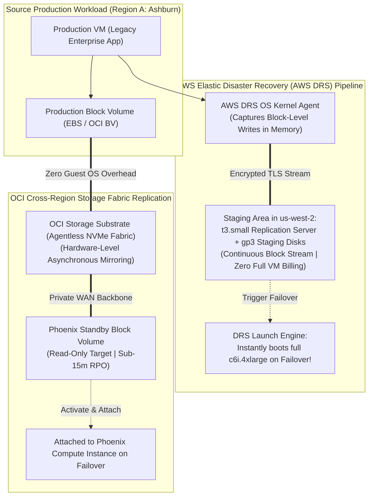

#### AWS Implementation
Initialize and monitor an AWS Elastic Disaster Recovery source machine using AWS CLI [Doc: AWS DRS CLI Reference, checked 2026]:

```bash
# Step 1: Configure DRS Replication Configuration Template for the destination region
aws drs create-replication-configuration-template \
  --staging-area-subnet-id "subnet-0a1b2c3d4e5f67890" \
  --bandwidth-throttling 0 \
  --ebs-encryption "DEFAULT" \
  --region us-west-2

# Step 2: Query replication status of protected machines in AWS DRS
aws drs describe-source-machines \
  --region us-west-2 \
  --query 'items[].[sourceMachineID, lastLaunchResult, dataReplicationInfo.dataReplicationState, dataReplicationInfo.lagDuration]'

# Step 3: Launch Recovery Instance during disaster failover
aws drs start-recovery \
  --source-machines '[{"sourceMachineID": "s-1234567890abcdef0"}]' \
  --is-drill false \
  --region us-west-2
```

#### OCI Implementation
Enable Cross-Region Asynchronous Replication on an OCI Block Volume using OCI CLI [Doc: OCI Block Volume Replication CLI, checked 2026]:

```bash
# Step 1: Create a Block Volume with Cross-Region Replication enabled to Phoenix
cat << 'EOF' > oci-volume-repl.json
{
  "compartmentId": "ocid1.compartment.oc1..aaaaaaaam7...",
  "displayName": "Enterprise-Database-Disk",
  "availabilityDomain": "UwhS:US-ASHBURN-AD-1",
  "sizeInGBs": 1000,
  "vpusPerGB": 10,
  "blockVolumeReplicas": [
    {
      "displayName": "Enterprise-Database-Disk-Replica-PHX",
      "availabilityDomain": "UwhS:US-PHOENIX-AD-1"
    }
  ]
}
EOF

oci bv volume create --from-json file://oci-volume-repl.json

# Step 2: Check replication status and synchronization point
oci bv volume-replica list \
  --compartment-id ocid1.compartment.oc1..aaaaaaaam7... \
  --availability-domain "UwhS:US-PHOENIX-AD-1"
```

#### Common Trap
Launching an AWS DRS recovery instance or activating an OCI volume replica without detaching or stopping the source machine during a DR test. If the source machine and the target recovery machine are powered on simultaneously on the same corporate network (e.g., via peered VPCs or Direct Connect / FastConnect), both machines will advertise identical IP addresses, identical MAC addresses, and identical Active Directory computer accounts, triggering severe network routing conflicts and Kerberos trust authentication crashes across the entire enterprise.

#### Follow-up Question
How do AWS DRS and OCI Block Volume replication guarantee crash-consistent vs application-consistent snapshots across multiple striped volumes (e.g., LVM RAID-0 arrays across 4 block volumes) without freezing database transactions?

---

### Q395: Static Content & CDN Resilience: CloudFront Origin Groups vs OCI Multi-Origin Health Steering

#### Question
How do modern Content Delivery Networks (CDNs) prevent customer-facing HTTP 5xx outage screens during origin infrastructure collapses, and how do Amazon CloudFront Origin Groups and OCI CDN / WAF Multi-Origin Health Steering implement automated origin failover?

#### Short Answer
Content Delivery Networks serve as the first line of defense against infrastructure outages by caching static and semi-dynamic assets at hundreds of global edge Points of Presence (PoPs). When an edge PoP must fetch dynamic content or handle a cache miss, an origin failure can cause immediate HTTP 502/504 gateway errors. **Amazon CloudFront Origin Groups** solves this by grouping a **Primary Origin** (e.g., Application Load Balancer in `us-east-1`) with a **Secondary Origin** (e.g., ALB in `us-west-2` or static S3 bucket): if the primary origin returns configured error codes (`500`, `502`, `503`, `504`, `403`, `404`) or times out, CloudFront automatically reroutes the user's request to the secondary origin in under 100 milliseconds without the end-user ever noticing. **OCI WAF & CDN** similarly provides multi-origin load balancing and automated health-probed origin failover.

#### Deep Answer
Relying on a single origin server or single cloud region behind a CDN creates a deceptive illusion of resilience: while cached static CSS and images continue serving during an origin outage, any dynamic API route or cache miss immediately breaks the application for end users.

**1. Amazon CloudFront Origin Groups Architecture**:
- **Origin Group Configuration**:
  - An Origin Group consists of exactly two origins: **Primary Origin** and **Secondary Origin**.
  - SREs bind specific Cache Behaviors (e.g., `Default (*)` or `/api/*`) to the Origin Group rather than a single origin [Doc: CloudFront Origin Groups User Guide, checked 2026].
- **Failover Criteria**:
  - Operators define a status code trigger matrix: `[500, 502, 503, 504, 403, 404]` and connection timeout limits (e.g., origin response timeout reduced from default 30s to 5s).
- **Execution Flow**:
  1. Edge PoP attempts to fetch from Primary Origin in `us-east-1`.
  2. If the primary origin drops the connection or returns HTTP 502, CloudFront does not return the error to the client.
  3. CloudFront immediately repeats the exact same HTTP request against the Secondary Origin in `us-west-2`.
  4. The client receives a successful HTTP 200 response with transparent origin failover.
- **Limitations**:
  - Origin Groups only support **idempotent HTTP methods** (`GET`, `HEAD`, `OPTIONS`) by default.
  - Non-idempotent methods (`POST`, `PUT`, `DELETE`) require careful configuration to prevent duplicate execution (e.g., charging a credit card twice if the primary origin failed *after* processing the charge but *before* returning the HTTP 200 response).

**2. OCI CDN & WAF Multi-Origin Health Steering Architecture**:
- **OCI Edge Ingress**:
  - OCI provides Web Application Firewall (WAF) and CDN edge integration.
  - Multi-Origin configurations allow defining an origin pool with primary and backup designations.
- **Active Health Probing**:
  - OCI edge proxies continuously probe regional origins using HTTP GET probes.
  - If the primary origin fails 3 consecutive health checks, the edge proxies dynamically update routing tables, steering all subsequent requests to the healthy secondary origin pool in Phoenix or Frankfurt [Doc: OCI WAF Multi-Origin Policies, checked 2026].

#### Architecture
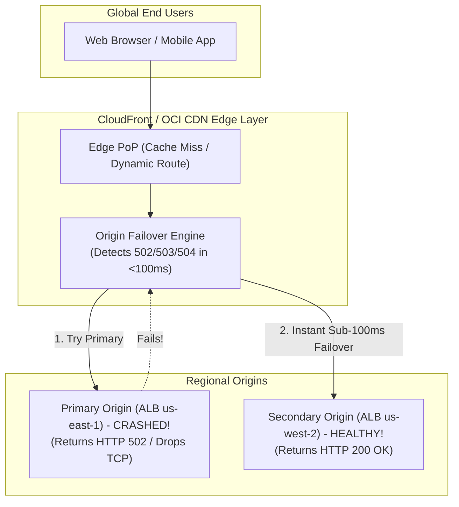

#### AWS Implementation
Configure an Amazon CloudFront Distribution with an Origin Group and automated failover criteria using the AWS CLI [Doc: AWS CloudFront Origin Groups CLI, checked 2026]:

```json
// origin-group-config.json
{
  "Quantity": 1,
  "Items": [
    {
      "Id": "PrimaryAndSecondaryOriginGroup",
      "FailoverCriteria": {
        "StatusCodes": {
          "Quantity": 5,
          "Items": [500, 502, 503, 504, 403]
        }
      },
      "Members": {
        "Quantity": 2,
        "Items": [
          { "OriginId": "Primary-ALB-us-east-1" },
          { "OriginId": "Secondary-ALB-us-west-2" }
        ]
      }
    }
  ]
}
```

```bash
# Update CloudFront Distribution to assign Origin Group to default cache behavior
aws cloudfront update-distribution \
  --id "EDFDVBD632BHDS5" \
  --if-match "E2Q2FMWCS7123" \
  --distribution-config file://distribution-with-origingroup.json
```

#### OCI Implementation
Configure an OCI Web Application Firewall (WAF) with multi-origin failover steering using OCI CLI [Doc: OCI WAF Origin Management CLI, checked 2026]:

```bash
# Create a WAF Policy with Primary and Secondary Origin Pools
cat << 'EOF' > oci-waf-origins.json
{
  "compartmentId": "ocid1.compartment.oc1..aaaaaaaam7...",
  "displayName": "multi-origin-waf-policy",
  "originGroups": [
    {
      "name": "GlobalOriginGroup",
      "origins": [
        { "name": "ashburn-origin", "weight": 100 },
        { "name": "phoenix-origin", "weight": 0 }
      ]
    }
  ]
}
EOF

oci waas waas-policy create --from-json file://oci-waf-origins.json
```

#### Common Trap
Configuring CloudFront Origin Groups or CDN failover with a 30-second origin response timeout on the primary origin. If the primary origin freezes (e.g., database connection pool exhaustion causes threads to hang), every client request will sit and hang at the edge for 30 seconds before CloudFront gives up and fails over to the secondary origin. The user experiences a 30-second white screen, assuming the site is dead. SREs must aggressively tune `OriginResponseTimeout` to $3\text{--}5\text{ seconds}$ and `OriginKeepaliveTimeout` to ensure fast failover before client attention is lost.

#### Follow-up Question
Why does automated origin failover on non-idempotent HTTP `POST` requests risk duplicate database records, and how do idempotency keys (`Idempotency-Key` HTTP header) eliminate this risk?

---

### Q396: Regulatory Compliance & Data Sovereignty in DR: Cross-Border Replication Pitfalls

#### Question
How do cloud platform architects ensure that multi-region disaster recovery replication architectures strictly comply with international data sovereignty regulations (such as GDPR, HIPAA, and financial banking laws), and what are the catastrophic legal penalties of unconstrained cross-border data replication?

#### Short Answer
Disaster recovery architectures must balance business continuity against strict legal jurisdictions. Regulations like the European Union's **General Data Protection Regulation (GDPR)**, Germany's BDSG, and sovereign financial mandates legally prohibit exporting personally identifiable information (PII) or financial banking records outside their sovereign borders without legal transfer mechanisms (Standard Contractual Clauses - SCCs) or cryptographic air-gapping. Unconstrained cross-region replication (e.g., replicating an AWS/OCI database from Frankfurt to Ashburn or Singapore) constitutes an illegal cross-border data transfer, exposing enterprises to GDPR fines up to **$4\%$ of global annual turnover or €20M**. Compliance mandates enforcing **In-Country DR Pairs** (e.g., Frankfurt to Zurich / Frankfurt to Paris) or **Field-Level Client-Side Encryption** where decryption keys never leave the sovereign boundary.

#### Deep Answer
Many engineers mistakenly treat cloud regions as interchangeable technical data centers, completely ignoring geopolitical and statutory boundaries.

**1. Data Sovereignty Regulatory Frameworks**:
- **GDPR Chapter V (Transfers of Personal Data to Third Countries)**:
  - Any transfer of EU citizens' personal data outside the European Economic Area (EEA) to countries without an EU "Adequacy Decision" (such as the US, unless certified under the EU-US Data Privacy Framework) requires strict legal guarantees.
  - The US CLOUD Act allows US federal law enforcement to compel US-headquartered cloud providers (AWS, Oracle, Microsoft) to provide data stored on cloud servers worldwide, creating direct conflicts with European privacy laws.
- **Financial & Healthcare Data Localization (DORA, HIPAA, BaFin)**:
  - Regulations frequently mandate that financial audit logs, transaction journals, and patient health records must remain physically stored within national or regional borders.

**2. Architectural Compliance Patterns for Multi-Region DR**:
- **Pattern 1: In-Country / In-Jurisdiction DR Pairing**:
  - Instead of replicating across continents (Frankfurt $\rightarrow$ Ashburn), select intra-sovereignty regional pairs:
    - *AWS*: Frankfurt (`eu-central-1`) $\leftrightarrow$ Paris (`eu-west-3`) or Zurich (`eu-central-2`).
    - *OCI*: Frankfurt (`eu-frankfurt-1`) $\leftrightarrow$ Amsterdam (`eu-amsterdam-1`) or OCI EU Sovereign Cloud [Doc: OCI EU Sovereign Cloud Architecture, checked 2026].
- **Pattern 2: PII Scrubbing & Data Tokenization**:
  - Only anonymized or tokenized data is replicated to international DR sites. PII resides strictly in a sovereign vault.
- **Pattern 3: Client-Side Envelope Encryption with Sovereign Key Isolation**:
  - Data replicated to foreign regions is encrypted with KMS keys whose root hardware modules (HSMs) physically reside **only** in the home country.
  - Even if a foreign cloud region is subpoenaed, the replicated data is cryptographically indistinguishable from random noise because the decryption key cannot be exported from the origin sovereign HSM.

#### Architecture
```mermaid
graph TD
    subgraph "Sovereign European Jurisdiction (Germany / EU)"
        EU_APP["Production Workload (Frankfurt)"]
        EU_DB[("Primary Database (Frankfurt)\nContains EU Citizen PII")]
        EU_KMS["OCI / AWS KMS Dedicated HSM\n(Keys Physically Locked in Frankfurt)"]
        EU_APP --> EU_DB
        EU_DB --> EU_KMS
    end

    subgraph "COMPLIANT: Intra-EU DR Replication (Allowed)"
        PARIS_DB[("DR Standby Database (Paris / Amsterdam)\nInside European Economic Area (EEA)")]
        EU_DB ===|Compliant Replication| PARIS_DB
    end

    subgraph "ILLEGAL NON-COMPLIANCE: Cross-Border Replication (GDPR Violation!)"
        US_DB[("Illegal DR Standby (US-Ashburn)\nSUBJECT TO US CLOUD ACT SUBPOENA!\nPenalty: 4% Global Annual Turnover")]
        EU_DB -.-x|PROHIBITED BY DATA PROTECTION OFFICER| US_DB
    end
```

#### AWS Implementation
Enforce regional replication boundaries using AWS Organizations Service Control Policies (SCPs) to mathematically block replication outside the European Union [Doc: AWS SCP Data Residency Guardrails, checked 2026]:

```json
// scp-eu-data-residency.json
{
  "Version": "2012-10-17",
  "Statement": [
    {
      "Sid": "DenyNonEURegions",
      "Effect": "Deny",
      "NotAction": [
        "iam:*",
        "route53:*",
        "cloudfront:*",
        "organizations:*"
      ],
      "Resource": "*",
      "Condition": {
        "StringNotEquals": {
          "aws:RequestedRegion": [
            "eu-central-1",
            "eu-west-1",
            "eu-west-3"
          ]
        }
      }
    }
  ]
}
```

```bash
# Attach the Data Residency SCP to the European Production Organizational Unit (OU)
aws organizations attach-policy \
  --policy-id "p-0123456789abcdef0" \
  --target-id "ou-1111-22223333"
```

#### OCI Implementation
Enforce tenancy compartment policies restricting data replication strictly to OCI European Sovereign Cloud regions [Doc: OCI EU Sovereign Cloud Policies, checked 2026]:

```bash
# Verify active tenancy subscriptions are strictly bounded to EU Sovereign Cloud regions
oci iam region-subscription list \
  --tenancy-id ocid1.tenancy.oc1..aaaaaaaaxample \
  --query 'data[?contains("region-name", "eu-")]'

# Define Compartment Quota policy blocking cross-border data transfer endpoints
oci limits quota create \
  --compartment-id ocid1.tenancy.oc1..aaaaaaaaxample \
  --name "EnforceEUDataResidencyOnly" \
  --statements '[
    "zero object-storage quota cross-region-replication-count in tenancy where request.region != eu-frankfurt-1 and request.region != eu-madrid-1"
  ]'
```

#### Common Trap
Replicating encrypted data to a non-compliant foreign region under the assumption that "because the data is encrypted at rest, GDPR does not apply." Under European regulatory guidance (EDPB Schrems II ruling), encrypted personal data **is still legally classified as personal data** unless the encryption keys are proven to be mathematically inaccessible to foreign authorities. If the foreign cloud region has access to AWS KMS or OCI Vault service endpoints capable of decrypting the data, the transfer is legally non-compliant and subject to full regulatory enforcement.

#### Follow-up Question
How do you implement confidential computing (e.g., AWS Nitro Enclaves or OCI Confidential Computing with AMD SEV-SNP memory encryption) to guarantee that cloud hypervisors cannot read in-memory encryption keys during cross-border disaster recovery compute failovers?

---

### Q397: Application Readiness & Warmup: Preventing Failover Thundering Herds

#### Question
Why do systems that successfully fail over their database and compute infrastructure to a disaster recovery region frequently collapse within 60 seconds of traffic arrival, and how do cloud architects engineer cache pre-warming, connection pool staggering, and JIT compilation warmup?

#### Short Answer
When global traffic shifts abruptly to a secondary DR region, the destination environment experiences a massive **"Cold Start Thundering Herd"**: empty application caches (0% hit ratio) force 100% of queries to hit newly promoted databases simultaneously; uninitialized relational database buffer pools trigger disk I/O thrashing; thousands of application containers simultaneously open database connection sockets, exhausting connection pool limits; and modern runtimes (JVM / .NET) suffer CPU freezes during Just-In-Time (JIT) compilation. Resilient architectures mitigate this by enforcing a **Warmup & Ramp Gate**: (1) Pre-warming database buffer caches via warm standby read replicas; (2) Pre-warming distributed Redis caches via asynchronous replication; (3) Pre-initializing container connection pools before attaching to load balancers; and (4) Shifting traffic progressively (e.g., 10%, 25%, 50%, 100%) rather than instant 100% cutovers.

#### Deep Answer
The difference between a successful failover and a secondary outage is understanding the physics of cold caches.

**1. The Mechanics of the Failover Collapse Cascade**:
- In steady-state Region A:
  - Cache hit ratio is $98\%$.
  - Only $2\%$ of reads reach the database.
  - Database CPU sits comfortably at $40\%$.
- When Region B takes 100% of traffic instantly with a cold cache:
  - Cache hit ratio is $0\%$.
  - **$100\%$ of reads hit the database**—a $50\times$ increase in database query load!
  - The database instantly exhausts its vCPUs, memory, and disk IOPS, locking all connections.
  - Upstream web servers time out waiting for SQL queries, fill their thread pools, and crash with HTTP 504.
  - SREs watch their DR failover successfully route traffic, only for the entire secondary region to burn down 45 seconds later.

**2. Engineering the Warmup Pipeline**:
- **Database Buffer Cache Pre-Warming**:
  - In Amazon Aurora, the storage layer continuously caches pages. In Oracle/OCI Data Guard, Active Data Guard instances running read-only reporting queries continuously maintain hot buffer caches.
- **Synthetic Cache Seeding**:
  - Before shifting public DNS, an automated script runs against the DR region, executing queries for the top 5% most popular products/users, seeding Redis/Memcached with hot keys.
- **Progressive Traffic Ramping (Traffic Dials)**:
  - Instead of an instantaneous 0% to 100% DNS flip:
  - Step 1: Shift 5% traffic via AWS Global Accelerator Traffic Dial or OCI Steering Weights.
  - Step 2: Observe error rates, connection pools, and database CPU for 2 minutes.
  - Step 3: Shift 25%, then 50%, then 100%. This allows JVMs to JIT-compile bytecode and caches to warm organically.

#### Architecture
```mermaid
graph TD
    subgraph "Traffic Surge Cutover"
        GLOBAL_TRAFFIC["Global Users (100,000 RPS)"]
    end

    subgraph "Anti-Pattern: Instant Cutover (Total Collapse)"
        GLOBAL_TRAFFIC -->|Instant 100%| COLD_APP["Cold App Instances (Empty Connection Pools)"]
        COLD_APP -->|0% Cache Hit! 50x DB Load| COLD_CACHE["Cold Redis Cache (Empty)"]
        COLD_CACHE -->|50x Query Surge!| DB_CRASH[("Promoted Database - CRASHED!\n(100% CPU / Connection Starvation)")]
    end

    subgraph "Best Practice: Progressive Warmup Pipeline"
        GATE["Progressive Traffic Dial (10% -> 25% -> 50% -> 100%)"]
        WARM_APP["Pre-Initialized App Fleet\n(Connection Pools Established)"]
        WARM_CACHE["Pre-Warmed Redis (Replicated from Primary)"]
        WARM_DB[("Database Buffer Pools Pre-Warmed\n(Handles Load Smoothly)")]
        
        GLOBAL_TRAFFIC --> GATE
        GATE --> WARM_APP
        WARM_APP --> WARM_CACHE
        WARM_CACHE -->|98% Cache Hit| WARM_DB
    end
```

#### AWS Implementation
Execute progressive traffic shifting using AWS Global Accelerator Traffic Dials to safely warm the secondary region [Doc: AWS Global Accelerator Traffic Dial CLI, checked 2026]:

```bash
# Step 1: Pre-warm DR region by routing 10% of traffic to us-west-2
aws globalaccelerator update-endpoint-group \
  --endpoint-group-arn "arn:aws:globalaccelerator::123456789012:accelerator/123/endpoint-group/us-west-2" \
  --traffic-dial-percentage 10.0

# Step 2: Monitor RDS CPU and Cache Hit Ratio in us-west-2 for 120 seconds
sleep 120

# Step 3: Increment traffic dial to 50%
aws globalaccelerator update-endpoint-group \
  --endpoint-group-arn "arn:aws:globalaccelerator::123456789012:accelerator/123/endpoint-group/us-west-2" \
  --traffic-dial-percentage 50.0

# Step 4: Complete cutover: 100% traffic on us-west-2, 0% on us-east-1
aws globalaccelerator update-endpoint-group \
  --endpoint-group-arn "arn:aws:globalaccelerator::123456789012:accelerator/123/endpoint-group/us-west-2" \
  --traffic-dial-percentage 100.0

aws globalaccelerator update-endpoint-group \
  --endpoint-group-arn "arn:aws:globalaccelerator::123456789012:accelerator/123/endpoint-group/us-east-1" \
  --traffic-dial-percentage 0.0
```

#### OCI Implementation
Implement weighted progressive traffic steering using OCI Traffic Management Steering Policies [Doc: OCI Traffic Management Weighted Steering, checked 2026]:

```bash
# Progressively ramp traffic from Ashburn (90%) to Phoenix (10%) during warmup
cat << 'EOF' > oci-ramp-steering.json
{
  "rules": [
    {
      "ruleType": "WEIGHTED",
      "defaultAnswerData": [
        { "answerCondition": "answer.pool == 'ashburn-pool'", "value": 90 },
        { "answerCondition": "answer.pool == 'phoenix-pool'", "value": 10 }
      ]
    }
  ]
}
EOF

oci dns steering-policy update \
  --steering-policy-id ocid1.steeringpolicy.oc1..aaaaaaaaxample... \
  --template-details file://oci-ramp-steering.json
```

#### Common Trap
Configuring application connection pools (e.g., HikariCP, PgBouncer) with `minIdle` equal to `0` on cold DR compute fleets. When an instance launches, it holds 0 database connections. The second public traffic hits the instance, 100 concurrent worker threads simultaneously issue `TCP Connect` and TLS handshakes to the database, exhausting the database's `max_connections` limit before a single query executes. Compute instances in DR fleets must be configured with pre-established minimum idle connections (`minIdle: 10`) so connections are ready *before* traffic enters the load balancer target pool.

#### Follow-up Question
How do you implement synthetic query replay (shadow traffic) from live production traffic to continuously warm database buffer pools and caches in the secondary DR region without persisting duplicate transactional writes?

---

### Q398: Secrets & Key Disaster Recovery: AWS Multi-Region Keys vs OCI Vault Replication

#### Question
How do cloud cryptographic and secret management services ensure that encrypted databases, storage volumes, and sensitive credentials can be decrypted seamlessly in a disaster recovery region during a total primary region outage, and how do AWS KMS Multi-Region Keys (MRKs) compare to OCI Vault cross-region replication?

#### Short Answer
Standard cloud cryptographic keys are strictly regional: a KMS key created in `us-east-1` or Ashburn cannot leave its physical Hardware Security Module (HSM) and cannot decrypt data in `us-west-2` or Phoenix. If an S3 bucket or database is replicated across regions, the DR region cannot decrypt the payload unless cryptographic keys are explicitly synchronized. **AWS KMS Multi-Region Keys (MRKs)** solve this by allowing a primary key to be replicated into secondary regions with the **exact same Key ID, key material, and ARN prefix**, enabling ciphertext encrypted in Region A to be decrypted in Region B without re-encryption. **OCI Vault (KMS)** supports cross-region key replication and automated cross-region secret synchronization, replicating master encryption keys and database credentials to secondary vaults with synchronized secret versions.

#### Deep Answer
Disaster recovery plans often succeed in replicating multi-terabyte databases and block storage volumes, only to fail completely on boot because the compute instance cannot decrypt its own database credentials or storage volume encryption headers.

**1. AWS KMS Multi-Region Keys (MRKs) Architecture**:
- **The Cryptographic Identity Dilemma**:
  - Standard KMS keys are regional constructs. Data encrypted with Key A (`arn:aws:kms:us-east-1:...:key/1111`) cannot be decrypted with Key B (`arn:aws:kms:us-west-2:...:key/2222`) because the Key ID is embedded inside the ciphertext envelope metadata.
- **How Multi-Region Keys (MRKs) Work**:
  - An MRK consists of a **Primary Key** in one region and synchronized **Replica Keys** in one or more remote regions.
  - **Shared Key Material**: They share the exact same 256-bit symmetric key material, key ID, and cryptographic signature algorithm.
  - **Ciphertext Interoperability**: Ciphertext encrypted by the primary key in `us-east-1` can be decrypted *directly* by the replica key in `us-west-2` using local regional KMS API calls, even if `us-east-1` is completely offline [Doc: AWS KMS Multi-Region Keys Guide, checked 2026]!
- **AWS Secrets Manager Cross-Region Replication**:
  - Secrets Manager natively replicates secrets across regions, automatically encrypting the replica secret with the destination region's local KMS key.

**2. OCI Vault (KMS) & Secret Synchronization Architecture**:
- **Cross-Region Vault Replication**:
  - OCI Vault manages Master Encryption Keys (MEKs) backed by FIPS 140-2 Level 3 Hardware Security Modules.
  - OCI supports replicating Master Encryption Keys to secondary region vaults to enable cross-region Block Volume, Boot Volume, and Object Storage decryption [Doc: OCI Vault Cross-Region Replication, checked 2026].
- **OCI Secrets Replication**:
  - Secret contents (database passwords, API tokens) in the primary vault are synchronized to the secondary region vault using OCI Service Connector Hub or automated event-driven OCI Functions.
  - When a secret version rotates in Ashburn, the event bus triggers an automated update in Phoenix, guaranteeing credential parity during failover.

| Cryptographic Dimension | AWS KMS Multi-Region Keys (MRKs) | OCI Vault Cross-Region Replication |
| :--- | :--- | :--- |
| **Key ID & ARN Parity** | Identical Key ID across all regions | Linked Replica Key OCID in target region |
| **Ciphertext Portability**| Direct decryption of remote ciphertext | Re-encryption or shared vault replication |
| **HSM Boundary** | Replicated across regional HSM clusters | Synchronized across regional FIPS HSMs |
| **Secret Replication** | Native Secrets Manager replication | OCI Vault Secret Replication / SCH |
| **Control Plane Independence**| Completely independent in each region | Completely independent in each region |

#### Architecture
```mermaid
graph TD
    subgraph "Primary Region (US-East / Ashburn)"
        KMS_PRI["AWS KMS Multi-Region Primary Key\n(Key ID: mrk-1234567890abcdef)"]
        DATA_PRI["Data Encrypted with Primary MRK:\nCiphertext = Enc(mrk-1234, Data)"]
        SEC_PRI["Secrets Manager (DB Password v1)"]
        KMS_PRI --> DATA_PRI
    end

    subgraph "Private Cryptographic Replication Fabric"
        KMS_PRI ===|Replicates 256-bit Key Material| KMS_SEC["AWS KMS Replica Key (us-west-2)\n(Identical Key ID: mrk-1234567890abcdef)"]
        SEC_PRI ===|Continuous Secret Sync| SEC_SEC["Secrets Manager Replica (us-west-2)"]
    end

    subgraph "Secondary DR Region (US-West / Phoenix)"
        DATA_REPL["Replicated Ciphertext Arrives in us-west-2"]
        DATA_REPL -->|Decrypted LOCALLY without calling us-east-1!| KMS_SEC
        APP_DR["DR Compute Fleet"] --> SEC_SEC
    end
```

#### AWS Implementation
Create an AWS KMS Multi-Region Key and replicate it to a secondary region using the AWS CLI [Doc: AWS KMS Multi-Region Keys CLI, checked 2026]:

```bash
# Step 1: Create a Multi-Region Primary Key in us-east-1
MRK_ARN=$(aws kms create-key \
  --multi-region \
  --description "Enterprise Global Multi-Region Encryption Key" \
  --region us-east-1 \
  --query 'KeyMetadata.Arn' --output text)

echo "Created Primary MRK: $MRK_ARN"

# Step 2: Replicate the Multi-Region Key to us-west-2
aws kms replicate-key \
  --key-id "$MRK_ARN" \
  --replica-region "us-west-2" \
  --description "DR Replica Key in us-west-2"

# Step 3: Create a replicated secret in AWS Secrets Manager using the MRK
aws secretsmanager create-secret \
  --name "prod/database/credentials" \
  --secret-string '{"username":"dbadmin","password":"ComplexPassword123!"}' \
  --kms-key-id "$MRK_ARN" \
  --add-replica-regions '[{"Region": "us-west-2"}]' \
  --region us-east-1
```

#### OCI Implementation
Configure cross-region master encryption key replication and secret synchronization in OCI Vault [Doc: OCI Vault Key Replication CLI, checked 2026]:

```bash
# Step 1: Create Master Encryption Key in Ashburn Vault with replication enabled
cat << 'EOF' > oci-key-config.json
{
  "compartmentId": "ocid1.compartment.oc1..aaaaaaaam7...",
  "displayName": "Enterprise-Database-MEK",
  "keyShape": {
    "algorithm": "AES",
    "length": 32
  },
  "protectionMode": "HSM"
}
EOF

KEY_ID=$(oci kms management key create --from-json file://oci-key-config.json --endpoint "https://aaaabbbb-management.kms.us-ashburn-1.oraclecloud.com" --query 'data.id' --output text)

# Step 2: Create replicated Vault secret in Phoenix
oci vault secret create-base64 \
  --compartment-id ocid1.compartment.oc1..aaaaaaaam7... \
  --vault-id ocid1.vault.oc1.phx.aaaaaaaadrvault... \
  --key-id ocid1.key.oc1.phx.aaaaaaaadrkey... \
  --secret-name "production-database-password" \
  --secret-content-content "Q29tcGxleFBhc3N3b3JkMTIzIQ==" \
  --region "us-phoenix-1"
```

#### Common Trap
Replicating encrypted data to a disaster recovery region while keeping application code configured with regional KMS key ARNs (e.g., hardcoding `arn:aws:kms:us-east-1:...`). When the primary region goes down, the application in Region B attempts to make cross-region network calls to `us-east-1`'s KMS service endpoint to decrypt data. Because `us-east-1` is down, all decryption calls fail with timeouts. Applications running in the DR region must configure their SDKs to invoke the **local regional KMS endpoint** (`us-west-2`), utilizing the local replica MRK.

#### Follow-up Question
How do you manage automatic rotation of multi-region KMS keys, and why does rotating a multi-region primary key automatically synchronize key versions across all secondary replica regions?

---

### Q399: Full-Stack Disaster Recovery Orchestration: AWS DRS vs OCI Full Stack DR

#### Question
How do modern cloud platforms orchestrate coordinated, end-to-end multi-tier failovers across complex distributed topologies (compute, databases, storage, networking, load balancers, and external DNS), and how do AWS Elastic Disaster Recovery + Step Functions compare to the native OCI Full Stack Disaster Recovery (FSDR) service?

#### Short Answer
Enterprise disaster recovery involves dozens of interdependent components that must be orchestrated in strict sequential and parallel order: a database must be promoted *before* application servers boot; application servers must pass health checks *before* DNS switches; and network security rules must open *before* services connect. In AWS, full-stack orchestration requires assembling a composite architecture: **AWS Elastic Disaster Recovery (AWS DRS)** handles block-level VM recovery, integrated with **AWS Step Functions** state machines, Lambda, and Systems Manager (SSM) Automation runbooks to sequence database promotions, compute launches, and Route 53 shifts. In contrast, OCI provides **OCI Full Stack Disaster Recovery (FSDR)**: a dedicated, fully managed, single-pane-of-glass DR orchestration service that automatically discovers infrastructure, generates customizable **DR Plans** (Switchover, Failover, Drill), and executes end-to-end multi-tier failover with built-in rollback protection.

#### Deep Answer
Managing disaster recovery through manual execution of shell scripts or disparate cloud consoles is a proven failure pattern. Under high-stress outage conditions, humans make sequencing errors, skip verification steps, and misconfigure routing.

**1. AWS Composite Orchestration (DRS + Step Functions + SSM)**:
- **Architecture**:
  - AWS provides powerful building blocks, but requires the customer to engineer the overarching orchestration logic.
  - **AWS DRS**: Replicates block storage and handles VM machine conversion.
  - **AWS Step Functions**: Serves as the master state machine orchestrator:
    - *Step 1*: Promotes Aurora Global Database or RDS replica.
    - *Step 2*: Triggers AWS DRS API to launch recovery EC2 instances in parallel.
    - *Step 3*: Invokes AWS Systems Manager (SSM) to run in-guest configuration scripts (mounting filesystems, updating connection strings, starting Docker/systemd daemons).
    - *Step 4*: Validates ALB target group health.
    - *Step 5*: Switches Route 53 ARC routing controls to direct production traffic [Doc: AWS Step Functions DR Orchestration, checked 2026].

**2. OCI Full Stack Disaster Recovery (FSDR) Architecture**:
- **Native Purpose-Built DR Orchestrator**:
  - FSDR is not an assembly of scripts; it is a first-class OCI control-plane service designed specifically for enterprise DR compliance.
- **DR Protection Groups (DRPG)**:
  - Pairs a Primary Compartment (Ashburn) with a Standby Compartment (Phoenix).
  - Automatically inventories associated resources: Compute Instances, Volume Groups, Autonomous Databases, Base Databases, Load Balancers, and Custom Scripts.
- **Automated Plan Generation**:
  - FSDR automatically generates full-stack plans:
    - **Failover Plan**: Unplanned disaster recovery execution with forced volume attachment and database promotion.
    - **Switchover Plan**: Planned, zero-data-loss role reversal for maintenance drills.
    - **Drill Plan**: Creates isolated sandbox testing environments without interrupting replication [Doc: OCI Full Stack Disaster Recovery Architecture, checked 2026].
- **Custom User-Defined Steps**:
  - Allows inserting custom pre-checks, post-checks, and execution steps (e.g., executing an OCI Function or invoking an Ansible runbook via OCI Compute Run Command) at exact points in the sequence.

| Orchestration Dimension | AWS (DRS + Step Functions + SSM) | OCI Full Stack Disaster Recovery (FSDR) |
| :--- | :--- | :--- |
| **Service Architecture** | Composite (Customer builds Step Functions state machine)| Native, purpose-built cloud service |
| **Plan Types** | Custom-coded Step Functions workflows | Automated Failover, Switchover, and Drill plans |
| **Resource Discovery** | Manual resource ARNs in state machine JSON | Automated discovery of compartment resource topology |
| **Audit & Compliance** | CloudWatch Logs + AWS CloudTrail aggregation | Native certified PDF audit reports (DORA/SOC 2) |
| **Rollback Handling** | Customer must code explicit catch/rollback blocks | Built-in automated error handling and pause/resume |

#### Architecture
```mermaid
graph TD
    subgraph "Full-Stack Disaster Recovery Orchestrator (AWS Step Functions / OCI FSDR)"
        START["Disaster Declared (API / Human Auth)"]
        
        subgraph "Phase 1: Data & Storage Promotion"
            P1_DB["1. Promote Standby Database\n(Aurora Global DB / Autonomous Data Guard)"]
            P1_VOL["2. Activate Replicated Volumes\n(AWS DRS Staging / OCI Volume Groups)"]
        end
        
        subgraph "Phase 2: Compute Fleet Initialization"
            P2_VM["3. Launch & Convert Compute Instances\n(EC2 Recovery / OCI Instance Pools)"]
            P2_SSM["4. In-Guest Custom Scripts\n(SSM Run Command / OCI Run Command)"]
        end
        
        subgraph "Phase 3: Traffic Ingress & Health Gate"
            P3_HC["5. Verify ALB / OCI LB Health Checks (HTTP 200)"]
            P3_DNS["6. Execute Global Cutover\n(Route 53 ARC / OCI Traffic Management)"]
        end
        
        START --> P1_DB
        START --> P1_VOL
        P1_DB --> P2_VM
        P1_VOL --> P2_VM
        P2_VM --> P2_SSM
        P2_SSM --> P3_HC
        P3_HC --> P3_DNS
    end
```

#### AWS Implementation
Define an AWS Step Functions state machine to orchestrate multi-tier database and compute disaster recovery [Doc: AWS Step Functions CLI, checked 2026]:

```json
// step-functions-dr-orchestrator.json
{
  "Comment": "Enterprise Multi-Tier Disaster Recovery Orchestration State Machine",
  "StartAt": "PromoteDatabase",
  "States": {
    "PromoteDatabase": {
      "Type": "Task",
      "Resource": "arn:aws:states:::rds:promoteReadReplica",
      "Parameters": { "DBInstanceIdentifier": "prod-aurora-dr-replica" },
      "Next": "LaunchDRSCompute"
    },
    "LaunchDRSCompute": {
      "Type": "Task",
      "Resource": "arn:aws:states:::drs:startRecovery",
      "Parameters": {
        "SourceMachines": [{ "SourceMachineID": "s-1234567890abcdef0" }],
        "IsDrill": false
      },
      "Next": "WaitForComputeHealthy"
    },
    "WaitForComputeHealthy": {
      "Type": "Wait",
      "Seconds": 180,
      "Next": "ShiftTrafficRoute53"
    },
    "ShiftTrafficRoute53": {
      "Type": "Task",
      "Resource": "arn:aws:states:::aws-sdk:route53recoverycontrolconfig:updateRoutingControlStates",
      "Parameters": {
        "RoutingControlStatesEntries": [
          { "RoutingControlArn": "arn:aws:route53-recovery-control::123456789012:control/rc-us-west-2", "RoutingControlState": "On" },
          { "RoutingControlArn": "arn:aws:route53-recovery-control::123456789012:control/rc-us-east-1", "RoutingControlState": "Off" }
        ]
      },
      "End": true
    }
  }
}
```

```bash
# Create Step Functions state machine via AWS CLI
aws stepfunctions create-state-machine \
  --name "EnterpriseDROrchestrator" \
  --definition file://step-functions-dr-orchestrator.json \
  --role-arn "arn:aws:iam::123456789012:role/StepFunctionsDRRole"
```

#### OCI Implementation
Create and execute a full-stack disaster recovery failover plan using OCI Full Stack Disaster Recovery (FSDR) CLI [Doc: OCI FSDR CLI Guide, checked 2026]:

```bash
# Step 1: Create a DR Protection Group (DRPG) in the standby region (Phoenix)
cat << 'EOF' > drpg-config.json
{
  "compartmentId": "ocid1.compartment.oc1..aaaaaaaam7...",
  "displayName": "Phoenix-Standby-DRPG",
  "peerId": "ocid1.drprotectiongroup.oc1.iad.aaaaaaaashburn...",
  "peerRegion": "us-ashburn-1"
}
EOF

DRPG_ID=$(oci disaster-recovery dr-protection-group create --from-json file://drpg-config.json --query 'data.id' --output text)

# Step 2: Associate Members (Autonomous Database and Compute Instances)
oci disaster-recovery dr-protection-group associate \
  --dr-protection-group-id "$DRPG_ID" \
  --role "STANDBY" \
  --peer-role "PRIMARY"

# Step 3: Execute the Full-Stack Failover Plan
oci disaster-recovery dr-plan-execution create \
  --dr-protection-group-id "$DRPG_ID" \
  --plan-id "ocid1.drplan.oc1.phx.aaaaaaaafailover..." \
  --execution-options '{"planExecutionType": "FAILOVER"}' \
  --display-name "Execute-Production-DR-Failover"
```

#### Common Trap
Configuring disaster recovery orchestration workflows that lack timeout bounds and failure-handling fallback branches. If a secondary database replica takes 45 minutes to apply transaction logs because of an unexpected storage queue spike, an unconstrained Step Functions state machine or script will wait indefinitely, blocking the compute launch and DNS cutover steps. Orchestration workflows must enforce explicit step timeouts (e.g., `TimeoutSeconds: 600`), automated retry policies with jitter, and dead-letter escalation paths to on-call incident commanders.

#### Follow-up Question
How do you structure post-failover automated verification hooks (smoke tests) to validate that user authentication, credit card processing, and core transactional APIs are operational *before* triggering final DNS traffic redirection?

---

### Q400: Out-of-Band Incident Command & Break-Glass Access during Catastrophic Outages

#### Question
How do cloud enterprises maintain communication, incident management, and administrative control when the primary cloud region hosting their internal Identity Provider (Okta/Azure AD), corporate VPN, and monitoring systems suffers a catastrophic collapse, and how are "Break-Glass" access patterns and out-of-band status pages engineered?

#### Short Answer
During catastrophic regional outages, primary enterprise infrastructure frequently loses its dependencies: corporate Single Sign-On (SSO) fails, internal Slack/Teams channels freeze, and SREs cannot log into cloud consoles because IAM federated authentication is down. Resilient incident response mandates **Out-of-Band (OOB) Architecture**: (1) **Break-Glass IAM Accounts**: Emergency administrative IAM users configured natively in the cloud provider (independent of corporate Okta/Azure AD IdPs), secured with physical FIDO2/WebAuthn hardware security keys stored in physical safes; (2) **Out-of-Band Communication**: Dedicated emergency communication channels (e.g., secondary Signal groups or independent Zoom/Paging clusters) hosted outside primary cloud infrastructure; and (3) **Independent Status Pages**: Public-facing status pages hosted entirely on a physically independent, multi-cloud network (e.g., Statuspage.io or an independent cloud provider) to communicate transparently with customers.

#### Deep Answer
The most terrifying scenario for a cloud architect is the **Total Lockout Outage**: an outage occurs, and engineers cannot log into the cloud to fix it because the corporate VPN, identity provider, and credential vaults all resided inside the failed region.

**1. The Mechanics of the Identity Dependency Trap**:
- Most enterprises federate AWS IAM and OCI Identity with corporate IdPs (Okta, Ping, Azure AD / Microsoft Entra ID) using SAML 2.0 or OIDC.
- If corporate network links, direct connects, or the identity provider's regional infrastructure fails:
  - Engineers attempting to assume IAM roles receive `403 Forbidden` or `SAML Assertion Expired`.
  - Engineers cannot issue AWS CLI or OCI CLI commands.
  - The team is completely blind and locked out.

**2. The Break-Glass Architecture Pattern**:
- **Native Emergency Identity**:
  - Direct, non-federated IAM users created directly inside the AWS account or OCI Root Tenancy (e.g., `breakglass-sre-01`).
  - Strict least-privilege during steady-state: Account has **zero permissions** attached normally.
- **Hardware-Enforced Multi-Factor Authentication (MFA)**:
  - Enforces physical hardware tokens (YubiKey / FIDO2 security keys).
  - Credentials and physical keys are split among senior leadership (e.g., password known to Principal Architect; physical YubiKey held by VP of Engineering).
- **Automated Activation & Auditing**:
  - During an emergency, a designated break-glass runbook applies an emergency administrator IAM policy (`AdministratorAccess`).
  - Any login to a break-glass account triggers high-urgency notifications via independent SMS/PagerDuty channels and writes tamper-resistant audit logs to external immutable vaults [Doc: AWS Security Incident Response Guide, checked 2026].

**3. Out-of-Band Status Pages & Incident Management**:
- Hosting your public status page (`status.enterprise.com`) inside your primary AWS/OCI account is a severe anti-pattern: when your cloud region goes down, your status page goes down with it, leaving customers in the dark.
- Status pages must be hosted **out-of-band** on an independent multi-cloud edge network (e.g., Cloudflare Workers, GitHub Pages, or dedicated SaaS status providers) with zero architectural dependency on primary VPCs.

#### Architecture
```mermaid
graph TD
    subgraph "Catastrophic Regional Failure (Region A: Ashburn / us-east-1)"
        IDP["Corporate Identity Provider (Okta / Azure AD) - CRASHED!"]
        PROD_VPC["Production Workloads - DOWN!"]
        VPN["Corporate Direct Connect / VPN - SEVERED!"]
    end

    subgraph "Standard SRE Team (LOCKED OUT!)"
        SRE_FED["SRE via Corporate SSO\n(Fails: SAML / STS Down!)"]
        SRE_FED -.->|Blocked!| IDP
    end

    subgraph "Out-of-Band Break-Glass Incident Command"
        YUBIKEY["Physical YubiKey FIDO2 Security Key\n(Stored in Physical Office Safe)"]
        BG_USER["Break-Glass IAM Account (Emergency Root / Admin)\n(Native Non-Federated Cloud Identity)"]
        AWS_CLI["Direct Out-of-Band CLI Access\n(Bypasses Corporate SSO & VPN)"]
        
        YUBIKEY --> BG_USER
        BG_USER --> AWS_CLI
        AWS_CLI -->|Direct Hypervisor API Access| PROD_VPC
    end

    subgraph "Independent Out-of-Band Status Communications"
        STATUS["External Status Page (Hosted on Cloudflare / Independent SaaS)\n(100% Operational | Zero Dependency on Primary Cloud)"]
        CUSTOMERS["External Enterprise Customers"]
        STATUS --> CUSTOMERS
    end
```

#### AWS Implementation
Configure an emergency Break-Glass IAM user with hardware MFA and CloudTrail alert triggers using AWS CLI [Doc: AWS IAM Security Best Practices, checked 2026]:

```bash
# Step 1: Create native, non-federated emergency Break-Glass IAM User
aws iam create-user --user-name "breakglass-admin-emergency"

# Step 2: Attach strict emergency policy that permits administration ONLY with Hardware MFA
cat << 'EOF' > breakglass-policy.json
{
  "Version": "2012-10-17",
  "Statement": [
    {
      "Sid": "AllowFullAdminWithHardwareMFAOnly",
      "Effect": "Allow",
      "Action": "*",
      "Resource": "*",
      "Condition": {
        "Bool": { "aws:MultiFactorAuthPresent": "true" }
      }
    }
  ]
}
EOF

aws iam put-user-policy \
  --user-name "breakglass-admin-emergency" \
  --policy-name "EmergencyBreakGlassAccess" \
  --policy-document file://breakglass-policy.json

# Step 3: EventBridge rule to alert security leadership immediately if break-glass account is used
cat << 'EOF' > breakglass-alert-rule.json
{
  "source": ["aws.signin"],
  "detail-type": ["AWS Console Sign In via CloudTrail"],
  "detail": {
    "userIdentity": {
      "userName": ["breakglass-admin-emergency"]
    }
  }
}
EOF

aws events put-rule --name "AlertOnBreakGlassLogin" --event-pattern file://breakglass-alert-rule.json
```

#### OCI Implementation
Configure an emergency native local administrator in OCI Identity and Access Management (IAM) independent of identity federations [Doc: OCI IAM Local Identity and Break-Glass, checked 2026]:

```bash
# Step 1: Create a native OCI Local User (Bypasses corporate identity federation)
oci iam user create \
  --compartment-id ocid1.tenancy.oc1..aaaaaaaaxample \
  --name "emergency-breakglass-admin" \
  --description "Out-of-band emergency administrator for catastrophic federation failure"

# Step 2: Add emergency user to Administrators group
oci iam group add-user \
  --group-id ocid1.group.oc1..aaaaaaaadministrators... \
  --user-id ocid1.user.oc1..aaaaaaaabreakglass...

# Step 3: Enforce mandatory Hardware MFA token on the local administrator user
oci iam user-mfa-totp-device create \
  --user-id ocid1.user.oc1..aaaaaaaabreakglass...
```

#### Common Trap
Storing the emergency Break-Glass credentials and MFA seed codes inside an enterprise password manager (such as 1Password or LastPass) that requires corporate Okta SSO or corporate VPN to log in. When the corporate network or identity provider fails, engineers cannot access the password manager to retrieve the break-glass credentials! Break-glass credentials, root passwords, and physical hardware YubiKeys must be physically stored in a secure physical location (such as a fireproof physical safe in an engineering operations center) with documented dual-custody access procedures.

#### Follow-up Question
How do you structure an automated post-incident "Break-Glass Remediation Workflow" that immediately rotates all passwords, revokes all active STS sessions, and exports an immutable CloudTrail/Audit forensic timeline after an emergency break-glass event concludes?

---

