# Module 29 — Sub-Phase 29.4: Resilience, Fault Tolerance & Chaos Engineering Questions (Q401–Q425)

---

### Q401: Blast Radius Reduction & Cell-Based Architecture: Principles & Implementation

#### Question
How do hyper-scale cloud platforms enforce architectural blast radius containment to prevent localized microservice failures or corrupted software releases from causing global enterprise outages, and how do Cell-Based Architectures in AWS and OCI isolate tenant failure domains?

#### Short Answer
Blast radius containment restricts the impact of an infrastructure, configuration, or software failure to a small, predictable fraction of total users. Traditional architectures partition by application tier (web, app, database), which leaves all tenants sharing the same failure domain if the shared database or cache cluster collapses. **Cell-Based Architecture (CBA)** decomposes an enterprise platform into multiple completely independent, hermetic, self-contained units called **Cells**. Each cell contains its own load balancer, compute fleet, database, cache, and messaging pipeline, serving a fixed percentage of tenants (e.g., 5% of users per cell across 20 cells). A thin, ultra-reliable **Cell Router** routes tenant requests based on a deterministic tenant ID hash. If Cell 4 suffers a complete database corruption or DDoS collapse, exactly 5% of users are impacted, while the remaining 95% experience zero degradation.

#### Deep Answer
In complex distributed systems, failures are inevitable. Designing for resilience does not mean pretending failures will not happen; it means ensuring that when a component fails, the damage is strictly bounded.

**1. Limitations of Tier-Based Architectures**:
- Traditional multi-tier architectures pool all tenants into shared clusters:
  - All tenants share 50 web servers, which connect to 1 shared Redis cluster, which connects to 1 shared primary database.
  - If Tenant X executes an unindexed search or submits a corrupted payload that causes the database to lock or crash, **100% of tenants are immediately affected**.
  - A faulty canary deployment pushed to the shared cluster can take down the entire global business simultaneously.

**2. Cell-Based Architecture (CBA) Tenets**:
- **Hermetic Boundary**: A cell has **zero runtime dependencies on any other cell**.
  - Cell A cannot query Cell B's database.
  - Compute, cache, database, and message brokers are isolated within the cell.
- **Cell Sizing & Maximum Capacity**:
  - Cells are deliberately sized to a fixed maximum capacity (e.g., max 10,000 requests/sec or max 50,000 active users).
  - Growth is achieved **horizontally by deploying new cells** ($N \rightarrow N+1$), rather than vertically scaling an existing cell into an unstable giant.
- **The Cell Router (The Single Point of Failure Challenge)**:
  - The router must be radically simpler than the applications inside the cells:
    - No database queries. No dynamic business logic.
    - Pure stateless deterministic hashing: $\text{Cell ID} = \text{hash}(\text{Tenant ID}) \pmod N$.
  - AWS implements this via Amazon Route 53, CloudFront Functions / Lambda@Edge, or API Gateway.
  - OCI implements this via OCI Traffic Management Steering, OCI WAF, or OCI Load Balancer routing rules [Doc: Cell-Based Architecture Whitepaper, checked 2026].
- **Corrupted Data & Rogue Tenant Isolation**:
  - If a "toxic payload" triggers a panic in an application parser, it only crashes the specific cell assigned to that tenant.

#### Architecture
```mermaid
graph TD
    subgraph "External Clients"
        CLIENTS["Global API Traffic\n(Requests with Tenant ID)"]
    end

    subgraph "Stateless Cell Router Layer"
        ROUTER["Cell Router (CloudFront / OCI WAF / API Gateway)\nRule: hash(TenantId) % 3"]
        CLIENTS --> ROUTER
    end

    subgraph "Hermetic Cell 1 (33% of Tenants)"
        LB1["ALB / OCI LB 1"]
        APP1["Compute Fleet 1"]
        DB1[("Dedicated DB 1")]
        ROUTER -->|Tenants 0..33%| LB1
        LB1 --> APP1 --> DB1
    end

    subgraph "Hermetic Cell 2 (33% of Tenants) - CORRUPTED / DOWN!"
        LB2["ALB / OCI LB 2"]
        APP2["Compute Fleet 2 - CRASHED!"]
        DB2[("Dedicated DB 2 - LOCKED!")]
        ROUTER -.->|Tenants 34..66% (Isolated!)| LB2
        LB2 --> APP2 --> DB2
    end

    subgraph "Hermetic Cell 3 (34% of Tenants)"
        LB3["ALB / OCI LB 3"]
        APP3["Compute Fleet 3"]
        DB3[("Dedicated DB 3")]
        ROUTER -->|Tenants 67..100%| LB3
        LB3 --> APP3 --> DB3
    end
```

#### AWS Implementation
Implement a stateless Cell Router using CloudFront Functions that inspects incoming tenant headers and rewrites the origin to route to isolated cells [Doc: CloudFront Functions Routing, checked 2026]:

```javascript
// cloudfront-cell-router.js
function handler(event) {
    var request = event.request;
    var headers = request.headers;
    
    // Extract tenant ID from header or default to public cell
    var tenantId = headers['x-tenant-id'] ? headers['x-tenant-id'].value : 'default';
    
    // Simple fast DJB2 hash of tenantId
    var hash = 5381;
    for (var i = 0; i < tenantId.length; i++) {
        hash = ((hash << 5) + hash) + tenantId.charCodeAt(i);
    }
    
    // Distribute across 3 distinct hermetic cells
    var cellNumber = Math.abs(hash % 3) + 1;
    
    // Dynamically override origin to point to the designated cell ALB
    request.origin = {
        custom: {
            domainName: 'cell-' + cellNumber + '.internal.enterprise.com',
            port: 443,
            protocol: 'https',
            path: '',
            sslProtocols: ['TLSv1.2'],
            readTimeout: 5,
            keepaliveTimeout: 5,
            customHeaders: {}
        }
    };
    
    return request;
}
```

```bash
# Associate the Cell Router function with a CloudFront Distribution
aws cloudfront create-function \
  --name "CellRouterFunction" \
  --function-config '{"Comment":"Cell-based router","Runtime":"cloudfront-js-2.0"}' \
  --function-code fileb://cloudfront-cell-router.js
```

#### OCI Implementation
Deploy cell isolation across OCI Compartments and configure OCI Load Balancer routing rules to partition tenant traffic [Doc: OCI Load Balancer Routing Rules, checked 2026]:

```bash
# Create Routing Policy on an OCI Flexible Load Balancer to steer traffic to isolated Cell Backend Sets
cat << 'EOF' > oci-cell-routing.json
{
  "name": "TenantCellRoutingPolicy",
  "conditionLanguageVersion": "V1",
  "rules": [
    {
      "name": "RouteToCell1",
      "condition": "http.request.headers['x-tenant-tier'] == 'cell-1'",
      "actions": [
        {
          "name": "FORWARD_TO_BACKENDSET",
          "backendSetName": "cell-1-backend-set"
        }
      ]
    },
    {
      "name": "RouteToCell2",
      "condition": "http.request.headers['x-tenant-tier'] == 'cell-2'",
      "actions": [
        {
          "name": "FORWARD_TO_BACKENDSET",
          "backendSetName": "cell-2-backend-set"
        }
      ]
    }
  ]
}
EOF

oci lb routing-policy create \
  --load-balancer-id ocid1.loadbalancer.oc1.iad.aaaaaaaaxample... \
  --name "TenantCellRoutingPolicy" \
  --rules file://oci-cell-routing.json
```

#### Common Trap
Introducing hidden shared cross-cell dependencies. An engineering team deploys 10 independent compute/database cells, but has all 10 cells connect to a single shared central Redis cluster for rate limiting or a single shared IAM service for token validation. When that shared central Redis or IAM service crashes, all 10 cells crash simultaneously. A cell must be completely hermetic; any cross-cell coordination must occur asynchronously out-of-band.

#### Follow-up Question
How do you execute schema migrations and database upgrades across 50 independent cells without creating operational overhead or configuration drift?

---

### Q402: Graceful Degradation & Load Shedding: Priority Queuing & Adaptive Dropping

#### Question
How do high-scale distributed systems survive unexpected traffic surges that exceed maximum compute and database capacity by shedding load gracefully, and how do priority tiers, CoDel algorithms, and downstream feature degradation prevent complete system collapse?

#### Short Answer
When incoming traffic exceeds maximum system throughput ($\text{Arrival Rate } \lambda > \text{Service Rate } \mu$), queuing theory dictates that internal queues grow indefinitely ($L \rightarrow \infty$), driving latency to infinity and causing timeouts across all clients. **Load Shedding** deliberately drops excess requests as early as possible (at the edge or ingress proxy) to maintain latency and throughput for accepted traffic. **Graceful Degradation** categorizes features into priority tiers: when under severe strain, the platform automatically disables non-essential features (e.g., personalized recommendations, real-time analytics, dynamic reviews) by returning fallback static caches, preserving 100% of compute capacity for core transactional workflows (checkout and payment processing).

#### Deep Answer
The difference between a well-architected system and a fragile system under $5\times$ load is their degradation profile:
- A fragile system attempts to process 100% of requests, exhausts its worker threads and database connections, and serves 0 successful requests (0% effective throughput).
- A resilient system processes 100% of its maximum capacity cleanly (e.g., 20,000 RPS) and rejects the excess 80,000 RPS at the ingress proxy in $<1\text{ms}$ with `HTTP 503 / 429`.

**1. Mathematical Foundations of Queue Collapse**:
- In an $M/M/1$ queue, average wait time is given by:
  $$W = \frac{1}{\mu - \lambda}$$
- As arrival rate $\lambda$ approaches service capacity $\mu$, wait time explodes exponentially.
- If clients time out after 3 seconds but the server continues spending 10 seconds of CPU processing the expired request, the server is burning computational power on requests that have already failed from the user's perspective (**Goodput vs Throughput** collapse).

**2. Load Shedding Mechanisms**:
- **Ingress Rejection**: Evaluates server queue wait time (e.g., CoDel / Controlled Delay algorithm). If a request spends more than $50\text{ms}$ sitting in an internal queue before an application thread picks it up, the request is dropped immediately without executing database queries.
- **Priority-Based Dropping**:
  - Requests carry a priority tag in headers:
    - *Critical (P0)*: User checkout, payment execution, authentication.
    - *Standard (P1)*: Search, product catalog browsing.
    - *Low (P2)*: Batch reporting, asynchronous webhooks, analytics telemetry.
  - When CPU breaches 85%, the ingress proxy automatically sheds 100% of P2 requests. If CPU breaches 92%, it sheds P1 requests, reserving resources exclusively for P0.
- **Dynamic Feature Flags (Circuit Breaker Shedding)**:
  - Application code wraps expensive microservice calls in dynamic degradation toggles:
    ```python
    if degradation_mode_active:
        return get_static_fallback_recommendations()  # 0ms DB load
    return call_expensive_ai_recommendation_engine()   # 250ms GPU/DB load
    ```

#### Architecture
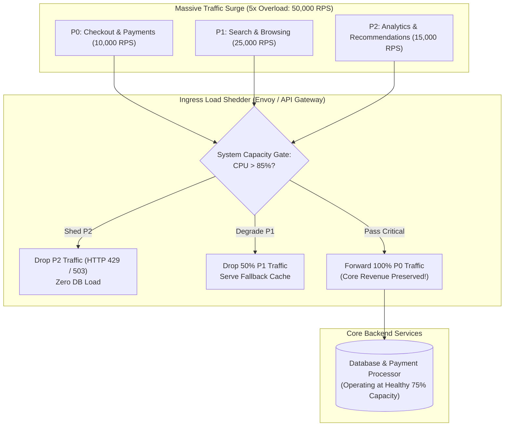

#### AWS Implementation
Implement automated load shedding on an Application Load Balancer using AWS WAF rate-based rules and priority header filtering [Doc: AWS WAF Rate-Based Rules, checked 2026]:

```json
// waf-load-shedding-rule.json
{
  "Name": "ShedLowPriorityTrafficDuringSurge",
  "Priority": 1,
  "Action": { "Block": {} },
  "VisibilityConfig": {
    "SampledRequestsEnabled": true,
    "CloudWatchMetricsEnabled": true,
    "MetricName": "SheddedP2Traffic"
  },
  "Statement": {
    "AndStatement": {
      "Statements": [
        {
          "ByteMatchStatement": {
            "SearchString": "low",
            "FieldToMatch": { "SingleHeader": { "Name": "x-traffic-priority" } },
            "TextTransformations": [{ "Priority": 0, "Type": "LOWERCASE" }],
            "PositionalConstraint": "EXACTLY"
          }
        },
        {
          "RateBasedStatement": {
            "Limit": 2000,
            "EvaluationWindowSec": 60,
            "AggregateKeyType": "CONSTANT"
          }
        }
      ]
    }
  }
}
```

```bash
# Attach rule to Regional Web ACL protecting the Application Load Balancer
aws wafv2 update-web-acl \
  --name "ProductionIngressACL" \
  --scope "REGIONAL" \
  --id "11112222-3333-4444-5555-666677778888" \
  --default-action '{"Allow": {}}' \
  --rules file://waf-load-shedding-rule.json \
  --lock-token "abc123locktoken"
```

#### OCI Implementation
Implement load shedding and prioritization using OCI API Gateway Rate Limiting and Route Policies [Doc: OCI API Gateway Route Policies, checked 2026]:

```json
// oci-gateway-load-shedding.json
{
  "routes": [
    {
      "path": "/api/v1/recommendations",
      "methods": ["GET"],
      "policies": {
        "rateLimiting": {
          "rateInRequestsPerSecond": 100,
          "rateKey": "TOTAL"
        }
      },
      "backend": {
        "type": "STOCK_RESPONSE_BACKEND",
        "status": 200,
        "body": "{\"fallback\": true, \"recommendations\": [\"popular_item_1\", \"popular_item_2\"]}",
        "headers": [{ "name": "Content-Type", "value": "application/json" }]
      }
    }
  ]
}
```

```bash
# Update OCI API Gateway deployment with degraded fallback route
oci api-gateway deployment update \
  --deployment-id ocid1.apigatewaydeployment.oc1.iad.aaaaaaaaxample... \
  --specification file://oci-gateway-load-shedding.json
```

#### Common Trap
Allowing rejected requests to execute expensive TLS handshakes or database authentication checks before dropping them. If an ingress proxy validates a JWT token against a remote database before shedding the request, the load-shedding logic itself overwhelms the database. Rejection must occur at the outermost network perimeter (CDN or API Gateway) in constant time $O(1)$ based purely on local request headers or IP tokens.

#### Follow-up Question
How does the Little's Law formula ($L = \lambda W$) dictate the exact queue concurrency limit that application servers must enforce to prevent thread pool starvation?

---

### Q403: Circuit Breakers & Retry Storms: Resilience4j / Envoy Implementation

#### Question
How do cascading service failures propagate across microservice graphs when downstream dependencies experience transient latencies, and how does the Circuit Breaker pattern (Closed, Open, Half-Open states) prevent "Retry Storms" and death spirals?

#### Short Answer
When a downstream microservice experiences performance degradation (e.g., query latency jumps from $10\text{ms}$ to $5,000\text{ms}$), upstream callers block waiting for responses, rapidly exhausting their own worker threads and connection pools. If upstream clients implement naive exponential retries, every single failing request generates 3 to 5 additional retry attempts, multiplying traffic into the already struggling downstream service ($5\times$ **Retry Storm**). The **Circuit Breaker Pattern** acts as an automated electrical fuse: in the **Closed State**, requests flow normally; when failure or slow-call rates breach a threshold (e.g., $50\%$ errors over 100 calls), the circuit trips to the **Open State**, instantly failing all subsequent calls locally in $0\text{ms}$ without touching the network; after a cooldown period, it enters the **Half-Open State**, permitting a small canary probe of requests to verify if the downstream service has recovered.

#### Deep Answer
In a deep microservice call chain ($A \rightarrow B \rightarrow C \rightarrow D$), a slowdown in Service D will cascade backwards to Service A in seconds unless isolated by circuit breakers.

**1. The Mechanics of the Three Circuit Breaker States**:
- **Closed State (Normal Operation)**:
  - All calls pass through to the downstream service.
  - The circuit breaker records metrics over a sliding window (time-based or count-based, e.g., last 100 requests).
  - If the failure rate (HTTP 5xx, timeouts) or slow-call rate ($>2,000\text{ms}$) exceeds the threshold (e.g., $>50\%$), the breaker trips into the **Open State**.
- **Open State (Fast Failure & Isolation)**:
  - The circuit is broken.
  - **Zero network requests** are sent to the downstream service.
  - Calls fail immediately with `CallNotPermittedException` or execute a local fallback method in $<1\text{ms}$.
  - This provides the downstream service the critical idle time needed to clear its thread pool, flush database locks, and recover.
  - A timer begins (e.g., `waitDurationInOpenState: 60s`).
- **Half-Open State (Canary Verification)**:
  - Once the timer elapses, the circuit transitions to Half-Open.
  - A strictly limited number of trial requests (e.g., 10 requests) are permitted through to the downstream service.
  - If all 10 requests succeed, the circuit resets to **Closed** (service recovered).
  - If even a single trial request fails or times out, the circuit immediately flips back to **Open** for another cooldown cycle.

**2. Application-Level (Resilience4j) vs Proxy-Level (Envoy / Service Mesh)**:
- **Resilience4j / Polly (In-Process)**:
  - Executes inside Java/Go/.NET application runtimes.
  - Enables rich programmatic fallbacks (e.g., querying a local stale cache or returning default values).
- **Envoy Sidecar / AWS App Mesh / OCI Service Mesh (Out-of-Process)**:
  - Configured declaratively in Envoy's `outlier_detection`.
  - Automatically ejects unhealthy upstream hosts from load balancing target pools based on consecutive 5xx errors without writing any application code [Doc: Envoy Outlier Detection Specification, checked 2026].

#### Architecture
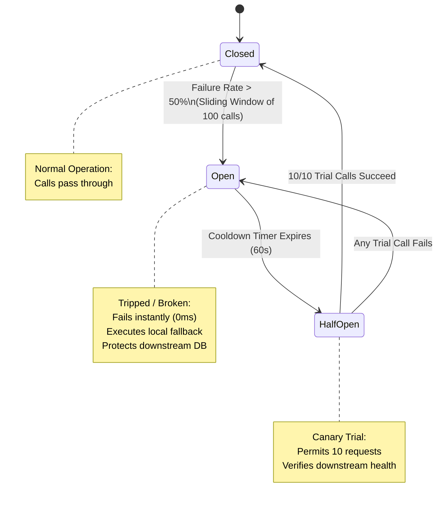

#### AWS Implementation
Configure Envoy Outlier Detection (Circuit Breaking) on an Amazon EKS cluster using Istio or Envoy Proxy [Doc: Istio Envoy Circuit Breakers, checked 2026]:

```yaml
# istio-circuit-breaker-destinationrule.yaml
apiVersion: networking.istio.io/v1beta1
kind: DestinationRule
metadata:
  name: payment-service-circuit-breaker
  namespace: production
spec:
  host: payment-service.production.svc.cluster.local
  trafficPolicy:
    connectionPool:
      tcp:
        maxConnections: 100 # Maximum concurrent TCP connections
      http:
        http1MaxPendingRequests: 10 # Queue limit before immediate 503 rejection
        maxRequestsPerConnection: 10
    outlierDetection:
      consecutive5xxErrors: 3 # Trip circuit after 3 consecutive 5xx errors
      interval: 10s
      baseEjectionTime: 30s # Keep host ejected for 30 seconds
      maxEjectionPercent: 100 # Allow ejecting all pods if downstream is down
```

#### OCI Implementation
Implement Resilience4j Circuit Breaker in Java/Spring Boot microservices running on OCI Compute or OKE [Doc: Resilience4j Circuit Breaker Specification, checked 2026]:

```yaml
# application.yml (Resilience4j configuration)
resilience4j.circuitbreaker:
  instances:
    paymentService:
      slidingWindowType: COUNT_BASED
      slidingWindowSize: 100
      minimumNumberOfCalls: 20
      failureRateThreshold: 50.0 # Trip if 50% of calls fail
      slowCallRateThreshold: 50.0
      slowCallDurationThreshold: 2000ms
      waitDurationInOpenState: 60000ms # Stay Open for 60s
      permittedNumberOfCallsInHalfOpenState: 10
      automaticTransitionFromOpenToHalfOpenEnabled: true
```

```java
// PaymentClient.java
import io.github.resilience4j.circuitbreaker.annotation.CircuitBreaker;
import org.springframework.stereotype.Service;

@Service
public class PaymentClient {

    @CircuitBreaker(name = "paymentService", fallbackMethod = "executeFallbackPayment")
    public PaymentResponse chargeCard(PaymentRequest request) {
        // Network call to downstream service
        return restTemplate.postForObject("http://payment.internal/charge", request, PaymentResponse.class);
    }

    // Fast local fallback executed when circuit is OPEN
    public PaymentResponse executeFallbackPayment(PaymentRequest request, Throwable t) {
        System.out.println("Circuit is OPEN! Queuing payment locally to prevent downstream thrashing.");
        return new PaymentResponse("QUEUED_FOR_OFFLINE_PROCESSING", request.getOrderId());
    }
}
```

#### Common Trap
Configuring upstream client retries with an exponential backoff that does not include **Jitter**, while lacking a circuit breaker. When 1,000 application instances simultaneously retry an overloaded database every 2, 4, and 8 seconds, they synchronize their retry waves into destructive, rhythmic pulses of traffic (the "Thundering Herd"). Adding a circuit breaker trips the fuse locally, while full jitter randomizes retry times, allowing the downstream system to recover safely.

#### Follow-up Question
How do you dynamically synchronize circuit breaker states across 500 horizontally scaled microservice pods without introducing a centralized, high-latency shared cache bottleneck?

---

### Q404: Bulkhead Pattern & Resource Isolation: Concurrency & Storage Quotas

#### Question
How do ship-building naval architecture principles apply to cloud microservices to prevent single-component failures from sinking an entire application fleet, and how do thread-pool isolation, connection-pool partitioning, and container resource limits enforce the Bulkhead pattern?

#### Short Answer
In naval architecture, a ship's hull is divided into watertight compartments called **Bulkheads**: if water breaches a single compartment, only that compartment floods, preventing the entire ship from sinking. In cloud distributed systems, the **Bulkhead Pattern** partitions critical system resources (thread pools, CPU/memory quotas, database connection pools, and network sockets) into isolated, bounded pools. If an unoptimized query or slow third-party API saturates one thread pool (e.g., the image processing queue), the bulkhead prevents it from consuming the threads or database connections allocated to mission-critical workloads (e.g., checkout and login processing), ensuring non-critical failures cannot cause catastrophic system-wide outages.

#### Deep Answer
Without bulkheads, modern concurrent application runtimes (such as Java's shared `ForkJoinPool`, Node.js event loops, or Go's unconstrained goroutines) share a single global resource pool.

**1. The Anatomy of a Resource Starvation Failure**:
- Consider a microservice handling both `POST /checkout` (high business value, 100ms duration) and `POST /export-pdf-report` (low business value, 15,000ms duration).
- The web server has 200 worker threads.
- If 200 users simultaneously click "Export PDF", all 200 worker threads are immediately assigned to generating PDFs.
- A user arriving to checkout cannot acquire a worker thread; their HTTP request sits in the OS socket backlog until it times out.
- **The PDF export feature has completely sunk the core checkout business!**

**2. Implementing Bulkheads Across the Cloud Stack**:
- **Thread Pool Bulkheads**:
  - Assign dedicated, bounded thread pools per downstream dependency or route:
    - `CheckoutThreadPool`: 150 threads (max queue: 50).
    - `ReportingThreadPool`: 20 threads (max queue: 10).
  - If the reporting thread pool fills up, subsequent report requests are rejected immediately with `HTTP 429 / 503`, while checkout threads continue operating at full capacity.
- **Database Connection Pool Bulkheads**:
  - Never share a single monolithic connection pool across read queries, write queries, and background batch jobs.
  - Partition pools: 70% of connections reserved for OLTP writes; 20% reserved for user reads; 10% for background workers.
- **Kubernetes Pod Resource Quotas & Limits**:
  - A noisy neighbor container suffering a memory leak will consume all host RAM, triggering Linux kernel Out-Of-Memory (OOM) killer to terminate adjacent critical containers unless bounded by strict `resources.limits.memory` bulkheads [Doc: Kubernetes Resource Quotas, checked 2026].

#### Architecture
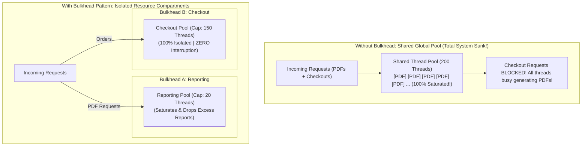

#### AWS Implementation
Implement thread-pool bulkheading in application runtimes and enforce Kubernetes container bulkheads on Amazon EKS [Doc: AWS EKS Container Resource Management, checked 2026]:

```yaml
# kubernetes-bulkhead-limits.yaml
apiVersion: apps/v1
kind: Deployment
metadata:
  name: reporting-worker-bulkhead
  namespace: production
spec:
  template:
    spec:
      containers:
      - name: worker
        image: 123456789012.dkr.ecr.us-east-1.amazonaws.com/reporting:v1.2
        resources:
          requests:
            cpu: "500m"
            memory: "1Gi"
          limits:
            # Strict Bulkhead: Container cannot consume more than 2 CPUs or 2GB RAM
            cpu: "2000m"
            memory: "2Gi"
```

#### OCI Implementation
Enforce compartment-level and instance-level resource quotas to isolate noisy neighbor departments in OCI [Doc: OCI Compartment Quotas Policy Guide, checked 2026]:

```bash
# Define OCI Compartment Quota policy establishing hard bulkheads between Dev and Prod
oci limits quota create \
  --compartment-id ocid1.tenancy.oc1..aaaaaaaaxample \
  --name "EnforceDepartmentalBulkheads" \
  --description "Strict compute and storage bulkheads between production and analytics" \
  --statements '[
    "set compute quota vm-standard-e5-count to 10 in compartment AnalyticsBatch",
    "set compute quota vm-standard-e5-count to 100 in compartment CoreProduction",
    "zero compute quota vm-gpu-count in compartment AnalyticsBatch"
  ]'
```

#### Common Trap
Configuring unbounded in-memory request queues in front of a bulkhead thread pool (e.g., `new LinkedBlockingQueue<Runnable>()` in Java with no capacity ceiling). If the thread pool is capped at 20 threads but the backlog queue is unbounded, incoming requests will accumulate in the queue indefinitely. While threads are bounded, **memory is unbounded**: the server will crash with `java.lang.OutOfMemoryError: Java heap space` as millions of pending request objects fill the JVM heap. Bulkhead queues must always enforce strict maximum capacity boundaries (e.g., max 50 queued items), rejecting excess items immediately.

#### Follow-up Question
How do you implement adaptive semaphore bulkheads (such as Netflix Concurrency Limits or Resilience4j ThreadPoolBulkhead) that dynamically resize thread pool capacity based on observed downstream latency and TCP RTT?

---

### Q405: Principles of Chaos Engineering: Hypotheses, Blast Radius & Steady State

#### Question
How do enterprise reliability teams formulate scientific Chaos Engineering experiments to uncover latent architectural vulnerabilities before they cause production outages, and what are the strict operational guardrails required for steady-state definition and blast radius control?

#### Short Answer
**Chaos Engineering** is the discipline of experimenting on a system in order to build confidence in the system's capability to withstand turbulent conditions in production. Rather than randomly breaking things, it follows a rigorous 4-step scientific method: (1) **Define Steady State**: Quantify normal operational behavior using business "golden signals" (e.g., checkout success rate $\ge 99.8\%$, API latency $p99 \le 250\text{ms}$); (2) **Formulate a Falsifiable Hypothesis**: State the expected outcome under failure (e.g., *"If AZ-1 loses network connectivity, the ALB will reroute traffic to AZ-2 and AZ-3 with zero drop in checkout success"*); (3) **Inject Realistic Faults**: Introduce simulated real-world failures (packet loss, CPU spikes, node termination); (4) **Verify or Disprove**: Compare observed metrics against the steady-state baseline.

#### Deep Answer
Chaos Engineering originated at Netflix with Chaos Monkey and has evolved into an essential discipline for mission-critical cloud platforms.

**1. The Four Tenets of Chaos Engineering**:
- **Tenet 1: Build a Hypothesis around Steady-State Behavior**:
  - Internal system metrics (CPU, memory, disk I/O) are insufficient indicators of system health.
  - Steady state must be defined by **Customer-Centric Business Metrics**:
    - Orders processed per minute.
    - Video streams started per second.
    - Successful user logins.
  - If CPU jumps to 100% but 100% of customer checkouts succeed without latency degradation, the system is performing acceptably.
- **Tenet 2: Vary Real-World Events**:
  - Faults must reflect actual production failure modes:
    - Cloud hypervisor hardware crashes (`StatusCheckFailed_System`).
    - Upstream DNS latency and packet corruption.
    - Database read-replica lag spikes ($>10\text{ seconds}$).
    - Exhaustion of ephemeral ports or file descriptors.
- **Tenet 3: Run Experiments in Production**:
  - Pre-production staging environments never replicate real production scale, live traffic diversity, multi-tenant concurrency, or third-party API rate limits.
  - Confidence is highest when experiments run against live production infrastructure.
- **Tenet 4: Minimize Blast Radius**:
  - Never run chaos experiments across 100% of production users simultaneously.
  - Contain the experiment to a single canary cell, a specific percentage of traffic (e.g., 1%), or a single availability zone.

**2. Mandatory Safety Guardrails (The Dead-Man's Switch)**:
- Every chaos experiment must have **Automated Stop-Conditions**:
  - A real-time monitoring hook (CloudWatch Alarm / OCI Alarm) tracking business KPIs.
  - If payment drop $> 1\%$ or error rate $> 2\%$, the chaos orchestration engine aborts immediately, terminates the experiment, and initiates automated rollback.

#### Architecture
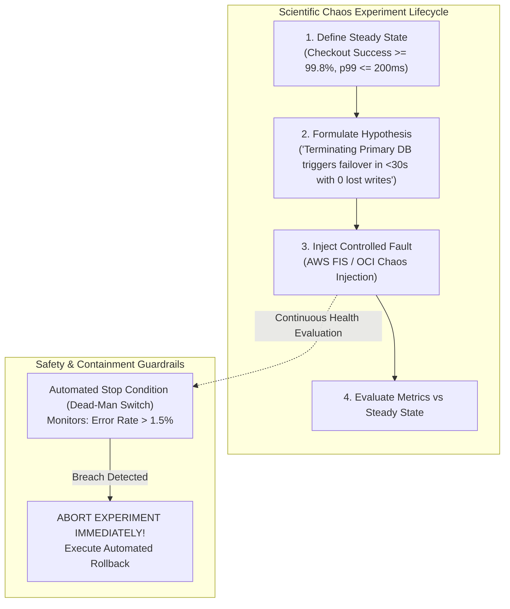

#### AWS Implementation
Define an AWS Fault Injection Service (FIS) experiment with CloudWatch alarm stop-conditions to validate steady-state recovery [Doc: AWS FIS Steady State Actions, checked 2026]:

```json
// fis-steady-state-experiment.json
{
  "description": "Verify steady-state checkout success during EKS worker node CPU saturation",
  "targets": {
    "TargetEKSNodes": {
      "resourceType": "aws:ec2:instance",
      "resourceTags": { "Environment": "production", "Role": "order-worker" },
      "selectionMode": "PERCENT(20)"
    }
  },
  "actions": {
    "StressNodeCPU": {
      "actionId": "aws:ssm:send-command",
      "parameters": {
        "documentArn": "arn:aws:ssm:us-east-1::document/AWSFIS-Run-CPU-Stress",
        "documentParameters": "{\"DurationSeconds\": \"300\", \"CPU\": \"100\"}",
        "duration": "PT5M"
      },
      "targets": { "Instances": "TargetEKSNodes" }
    }
  },
  "stopConditions": [
    {
      "source": "aws:cloudwatch:alarm",
      "value": "arn:aws:cloudwatch:us-east-1:123456789012:alarm:CheckoutSuccessRateDropped"
    }
  ],
  "roleArn": "arn:aws:iam::123456789012:role/FISExperimentRole"
}
```

```bash
# Create FIS Experiment Template via AWS CLI
aws fis create-experiment-template --cli-input-json file://fis-steady-state-experiment.json
```

#### OCI Implementation
Execute automated fault injection using OCI Compute Run Command with automated metric monitoring in OCI Monitoring [Doc: OCI Compute Instance Run Command, checked 2026]:

```bash
# Inject CPU stress fault on a targeted OCI Compute instance using OCI Run Command
oci compute instance-run-command create \
  --instance-id ocid1.instance.oc1.iad.aaaaaaaaxample... \
  --content '{"source": {"sourceType": "TEXT", "text": "stress-ng --cpu 4 --timeout 300s"}}' \
  --display-name "Chaos-CPU-Stress-Test"

# Verify OCI Monitoring Alarm stops test if API Latency breaches threshold
oci monitoring alarm get \
  --alarm-id ocid1.alarm.oc1.iad.aaaaaaaastopcondition... \
  --query 'data."query-text"'
```

#### Common Trap
Injecting chaos faults without establishing a quantified, monitored steady-state baseline first. If you terminate a database or induce network packet loss without real-time dashboards monitoring business success metrics, you cannot determine whether the subsequent system degradation was caused by your experiment or by an unrelated concurrent background event. You must observe and record steady-state metrics for at least 30 minutes *before* injecting any fault.

#### Follow-up Question
How do you design chaos experiments to test "black swan" multi-point failures (such as simultaneous loss of an Availability Zone and corruption of a major distributed cache) without catastrophic risk to production revenue?

---

### Q406: Fault Injection Tooling: AWS Fault Injection Service (FIS) vs Chaos Mesh on K8s

#### Question
How do modern cloud fault injection platforms simulate deep infrastructure disruptions, hypervisor faults, and container network partitions, and how do AWS Fault Injection Service (FIS) and open-source Chaos Mesh on Kubernetes compare in architecture, target selection, and security controls?

#### Short Answer
**AWS Fault Injection Service (FIS)** is a fully managed cloud chaos engineering platform integrated natively with the AWS control plane: it can simulate failures that cannot be generated from inside guest operating systems, such as hypervisor power termination, cross-region network disruption, AWS API throttle injection, and RDS cluster failovers, fully governed by IAM permissions and CloudWatch stop-conditions. **Chaos Mesh** is a cloud-native, open-source chaos orchestration engine designed specifically for Kubernetes: it utilizes Linux kernel cgroups, `iptables`, and eBPF kernel probes to inject pod kills, container network delays/corruption, disk I/O latency, JVM exceptions, and time travel (clock skew) directly inside container namespaces.

#### Deep Answer
Choosing between cloud-level fault injection (AWS FIS) and container-level fault injection (Chaos Mesh) depends on the layer of the abstraction stack being tested.

**1. AWS Fault Injection Service (FIS) Architecture**:
- **Control Plane & Hypervisor Native**:
  - Injects faults at the AWS virtualization and managed service layer.
  - Can simulate failures that software agents inside a VM cannot execute (e.g., cutting the physical cross-region fiber link, making the AWS STS or EC2 API return HTTP 500, or terminating a bare-metal hypervisor).
- **Target Selection**:
  - Targets resources using AWS resource ARNs, tags, or VPC/subnet filters.
  - Supports filters and percentage limits (e.g., target exactly 10% of instances matching tag `Role=web`).
- **Security & Safety**:
  - Enforces IAM role-based execution.
  - Mandatory **Stop Conditions**: FIS monitors CloudWatch Alarms continuously; if an alarm triggers, the experiment immediately halts and rolls back injected faults [Doc: AWS Fault Injection Service Guide, checked 2026].

**2. Chaos Mesh (Kubernetes Native Architecture)**:
- **Kubernetes Custom Resource Definitions (CRDs)**:
  - Deploys as an operator with a central `chaos-controller-manager` and `chaos-daemon` DaemonSet running on every worker node.
- **Deep Kernel & Container Injection**:
  - **NetworkChaos**: Uses `tc` (traffic control) and `iptables` to inject network latency, packet loss, packet duplication, and network partitions between Kubernetes namespaces.
  - **IOChaos**: Injects file read/write delays and file corruption using FUSE (Filesystem in Userspace).
  - **TimeChaos**: Uses eBPF / VDSO hijacking to alter system clock time *inside a specific container* without affecting the host OS (simulating daylight savings bugs or certificate expiration).
  - **JVMChaos**: Injects Java method exceptions, return value mutations, and artificial latency directly into running JVM processes via Byteman bytecode manipulation [Doc: Chaos Mesh Architecture, checked 2026].

| Dimension | AWS Fault Injection Service (FIS) | Chaos Mesh (Kubernetes) |
| :--- | :--- | :--- |
| **Operational Layer** | Cloud hypervisor, AWS APIs, managed databases | Linux kernel, container namespaces, JVM bytecode |
| **Unique Capabilities** | Cross-region network fiber disruption, API throttles | Time travel (clock skew), I/O faults, JVM bytecode |
| **Target Mechanism** | AWS Tags, ARNs, Subnet IDs | Kubernetes Labels, Namespaces, Pod selectors |
| **Stop Conditions** | Integrated CloudWatch Alarms | Chaos Mesh experiment duration and pause API |
| **Multi-Cloud Portability**| Locked to AWS ecosystem | 100% portable across EKS, OKE, GKE, and on-prem |

#### Architecture
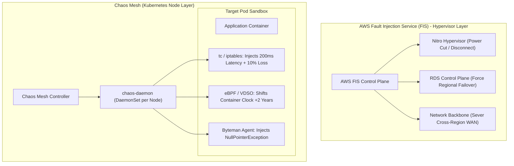

#### AWS Implementation
Create an AWS FIS experiment to simulate Amazon RDS Multi-AZ failovers and evaluate application recovery [Doc: AWS FIS RDS Actions CLI, checked 2026]:

```json
// fis-rds-failover.json
{
  "description": "Test application resilience during unannounced RDS database failover",
  "targets": {
    "PrimaryDatabase": {
      "resourceType": "aws:rds:db",
      "resourceArns": ["arn:aws:rds:us-east-1:123456789012:db:production-aurora-cluster"],
      "selectionMode": "ALL"
    }
  },
  "actions": {
    "RebootFailoverRDS": {
      "actionId": "aws:rds:failover-db-cluster",
      "targets": { "Clusters": "PrimaryDatabase" }
    }
  },
  "stopConditions": [
    {
      "source": "aws:cloudwatch:alarm",
      "value": "arn:aws:cloudwatch:us-east-1:123456789012:alarm:ApplicationErrorRateHigh"
    }
  ],
  "roleArn": "arn:aws:iam::123456789012:role/FISDisasterRecoveryRole"
}
```

```bash
# Execute RDS Failover experiment via AWS CLI
aws fis create-experiment-template --cli-input-json file://fis-rds-failover.json
```

#### OCI Implementation
Deploy Chaos Mesh on Oracle Container Engine for Kubernetes (OKE) and execute a container network partition experiment [Doc: Chaos Mesh NetworkChaos Specification, checked 2026]:

```bash
# Step 1: Install Chaos Mesh on OKE via Helm
helm repo add chaos-mesh https://charts.chaos-mesh.org
helm upgrade --install chaos-mesh chaos-mesh/chaos-mesh \
  --namespace chaos-mesh \
  --create-namespace \
  --set chaosDaemon.runtime=containerd \
  --set chaosDaemon.socketPath=/run/containerd/containerd.sock
```

```yaml
# network-delay-experiment.yaml
apiVersion: chaos-mesh.org/v1alpha1
kind: NetworkChaos
metadata:
  name: simulate-payment-network-delay
  namespace: production
spec:
  action: delay
  mode: all
  selector:
    namespaces:
      - production
    labelSelectors:
      app: payment-gateway
  delay:
    latency: "300ms"
    jitter: "50ms"
    correlation: "50"
  duration: "5m"
  direction: to
  target:
    selector:
      namespaces:
        - production
      labelSelectors:
        app: order-service
    mode: all
```

```bash
# Step 2: Apply the NetworkChaos experiment on OKE via kubectl
kubectl apply -f network-delay-experiment.yaml
```

#### Common Trap
Running Chaos Mesh network disruption experiments in Kubernetes without cleaning up `iptables` rules when the pod crashes. If the `chaos-daemon` itself crashes mid-experiment while `iptables` packet-drop rules are active, the simulated network partition becomes permanent! Production chaos tools must implement fail-safe watchdog timers (e.g., kernel-level timer resets) that automatically flush chaos `iptables` and `tc` rules if the chaos controller stops emitting heartbeats.

#### Follow-up Question
How do you configure TimeChaos in Chaos Mesh to simulate certificate expiration and leap-second clock skew without breaking host-level systemd daemons and kubelet timers?

---

### Q407: Self-Healing Architectures: Auto-Recovery, Dead-Man Monitors & Healing Runbooks

#### Question
How do cloud platforms transition from passive monitoring to autonomous self-healing architectures (auto-recovering hardware, self-healing containers, and automated diagnostic remediation), and what are the feedback-loop safeguards required to prevent self-healing death spirals?

#### Short Answer
Autonomous self-healing architectures detect, diagnose, and remediate component failures automatically without human engineer intervention. Self-healing operates across a 4-tier hierarchy: (1) **Hardware / Hypervisor Tier**: EC2 Status Check Auto-Recovery or OCI Compute Reboot Migration automatically migrates VMs off failing physical host blades; (2) **Container Tier**: Kubernetes Kubelet liveness probes automatically restart deadlocked processes; (3) **Fleet Tier**: Auto Scaling Groups and OCI Instance Pools terminate unhealthy instances and launch fresh replacements; (4) **Application / Orchestration Tier**: Amazon EventBridge or OCI Events triggers serverless runbooks (AWS Systems Manager Automation / OCI Functions) to execute corrective procedures (e.g., expanding full EBS volumes, killing zombie thread locks).

#### Deep Answer
Manual Mean Time to Repair (MTTR) is dominated by human communication: pager wakes engineer (5m) $\rightarrow$ engineer boots laptop (5m) $\rightarrow$ connects to VPN (3m) $\rightarrow$ queries logs (10m) $\rightarrow$ executes restart command (2m). Total MTTR: 25 minutes. Automated self-healing reduces this entire lifecycle to under **45 seconds**.

**1. The Self-Healing Hierarchy**:
- **Tier 1: Cloud Hypervisor Auto-Recovery**:
  - The cloud control plane continuously checks physical host power, thermal sensors, and network reachability.
  - If a hardware memory error or power supply fails, the hypervisor automatically freezes the VM, migrates its virtual disk attachment to a healthy physical hypervisor blade, and boots it back up. In AWS, this is `StatusCheckFailed_System` auto-recovery. In OCI, it is **Reboot Migration** [Doc: OCI Compute Reboot Migration, checked 2026].
- **Tier 2: In-Cluster Container Self-Healing**:
  - Kubelet monitors local pod liveness probes (`/healthz`).
  - If the application process deadlocks or leaks memory, Kubelet sends `SIGTERM`, waits for the grace period, executes `SIGKILL`, and restarts the container in $<3\text{ seconds}$.
- **Tier 3: Automated Event-Driven Remediation**:
  - Infrastructure events (e.g., CloudWatch Alarm `DiskSpaceUtilization > 85%`) emit structured events to Amazon EventBridge or OCI Events.
  - The event broker routes the event to an automated remediation engine:
    - *AWS*: Systems Manager Automation Document executes `ec2:ModifyVolume` to dynamically expand disk capacity by 50GB and runs `growpart /dev/nvme0n1` via SSM Agent without rebooting.
    - *OCI*: OCI Events invokes an OCI Function that calls `oci bv volume update --size-in-gbs` and executes an in-guest script via OCI Compute Run Command.

**2. The Self-Healing Death Spiral (The Critical Safeguard)**:
- What happens if an underlying relational database crashes, causing all 200 frontend web containers to fail their health checks?
- If the self-healing system blindly responds by restarting all 200 containers simultaneously, the cluster enters an infinite restart death spiral:
  - Restarting 200 containers saturates the Kubernetes API server.
  - When containers boot up, their connection pools aggressively hammer the database, preventing the database from ever recovering.
- **Safeguards**:
  - **Rate Limiting & Max Failure Caps**: A self-healing script must never terminate or restart more than 10–15% of a fleet simultaneously.
  - **Circuit Breaker Cutoffs**: If a self-healing action fails 3 consecutive times on the same instance, **stop auto-healing** and escalate to an on-call human engineer.

#### Architecture
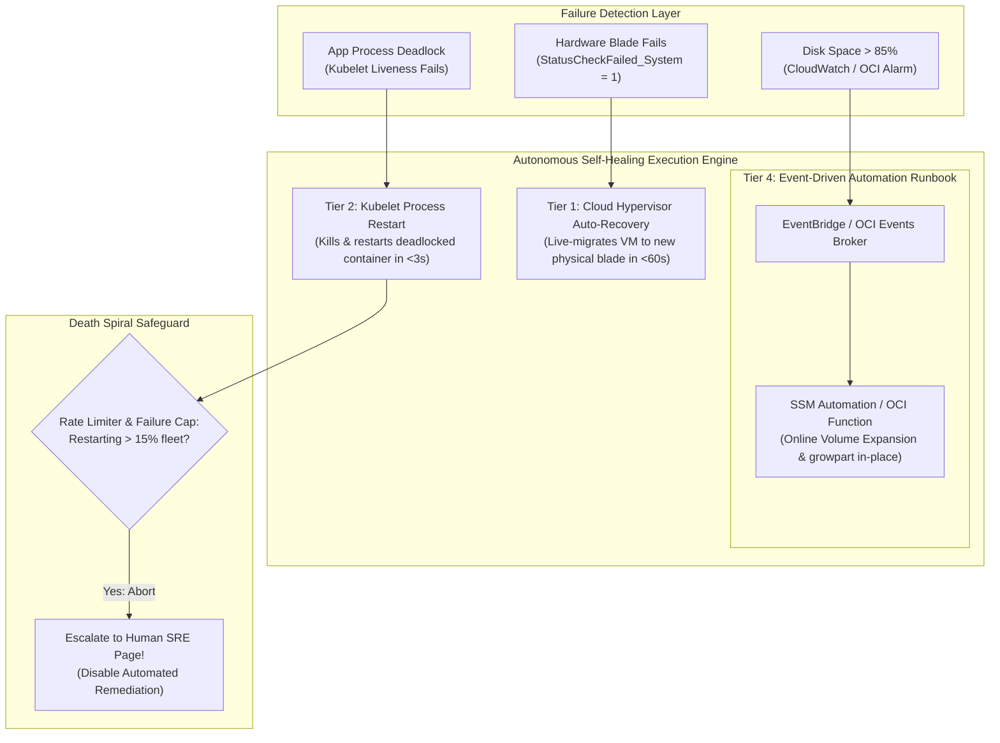

#### AWS Implementation
Configure an automated self-healing CloudWatch Alarm with EC2 Auto-Recovery and an SSM Automation runbook for automatic volume expansion [Doc: AWS CloudWatch Auto-Recovery, checked 2026]:

```bash
# Step 1: Configure automated hypervisor recovery for EC2 instance
aws cloudwatch put-metric-alarm \
  --alarm-name "AutoRecover-Hardware-Fault" \
  --metric-name "StatusCheckFailed_System" \
  --namespace "AWS/EC2" \
  --statistic "Minimum" \
  --period 60 \
  --evaluation-periods 2 \
  --threshold 1 \
  --comparison-operator "GreaterThanOrEqualToThreshold" \
  --alarm-actions "arn:aws:automate:us-east-1:ec2:recover" \
  --dimensions Name=InstanceId,Value=i-0123456789abcdef0

# Step 2: EventBridge rule invoking SSM Automation Document to expand full disk volume
cat << 'EOF' > eb-disk-heal.json
{
  "source": ["aws.cloudwatch"],
  "detail-type": ["CloudWatch Alarm State Change"],
  "detail": {
    "alarmName": ["AppDiskUtilizationHigh"],
    "state": { "value": ["ALARM"] }
  }
}
EOF

aws events put-rule --name "AutoExpandDiskVolumeRule" --event-pattern file://eb-disk-heal.json
```

#### OCI Implementation
Configure automated compute reboot migration and an OCI Events rule invoking an automated healing OCI Function [Doc: OCI Compute Reboot Migration CLI, checked 2026]:

```bash
# Enable automated reboot migration on an OCI Compute Instance
oci compute instance update \
  --instance-id ocid1.instance.oc1.iad.aaaaaaaaxample... \
  --availability-config '{"recoveryAction": "RESTORE_INSTANCE"}'

# Create an OCI Events rule to trigger self-healing function when instance enters maintenance
cat << 'EOF' > oci-heal-rule.json
{
  "compartmentId": "ocid1.compartment.oc1..aaaaaaaam7...",
  "displayName": "SelfHealingInstanceMaintenanceRule",
  "condition": "{\"eventType\": [\"com.oraclecloud.computeapi.instance.maintenance.planned\"]}",
  "actions": {
    "actions": [
      {
        "actionType": "FAAS",
        "functionId": "ocid1.fnfunc.oc1.iad.aaaaaaaaselfhealing...",
        "isEnabled": true
      }
    ]
  },
  "isEnabled": true
}
EOF

oci events rule create --from-json file://oci-heal-rule.json
```

#### Common Trap
Allowing automated self-healing scripts to delete stateful volumes or terminate instances without capturing diagnostic forensic snapshots first. If a self-healing script terminates and replaces an instance that was throwing kernel panics, the root-cause memory dump, system logs, and crash traces are permanently destroyed with the terminated instance. Self-healing automation must execute a **Forensic Snapshot** (e.g., EBS snapshot or OCI Block Volume clone) *before* issuing termination or reboot commands, preserving evidence for post-incident root-cause analysis.

#### Follow-up Question
How do you implement distributed dead-man switch monitors that detect when your self-healing automation pipeline itself has failed or stopped processing remediation events?

---

### Q408: Dependency Failure Modes: Hard vs Soft Dependencies & Fallback Caching

#### Question
How do cloud architects distinguish between "Hard Dependencies" and "Soft Dependencies" across microservice architectures, and what architectural mechanisms (fallback caches, offline queues, and default responses) prevent third-party SaaS API outages from taking down mission-critical platforms?

#### Short Answer
A **Hard Dependency** is a downstream service without which the upstream workflow cannot complete its core contractual function (e.g., an inventory database during checkout). A **Soft Dependency** is a downstream service that provides non-essential enrichment or supplementary features (e.g., personalized product recommendations, fraud rating scores, email notification dispatches, or currency converters). Resilient architectures enforce strict architectural boundaries: **no soft dependency is ever permitted to block or crash a core user workflow**. When a soft dependency fails or times out, the calling service catches the error immediately and executes an automated fallback: returning a stale fallback cache, returning a safe default value, or buffering the request in an asynchronous offline queue.

#### Deep Answer
The single most common architectural flaw in modern microservices is treating every downstream API call as a hard dependency. If an e-commerce checkout service makes synchronous HTTP calls to 5 downstream microservices (Payment, Inventory, Tax, Recommendations, Analytics), and each service boasts $99.9\%$ availability, the composite availability of the checkout service collapses:
$$\text{Availability}_{\text{composite}} = 0.999 \times 0.999 \times 0.999 \times 0.999 \times 0.999 \approx 99.5\%$$
A third-party recommendation engine going down takes down the entire payment flow!

**1. Architectural Mitigation Strategies for Soft Dependencies**:

| Dependency Type | Example Service | Architectural Failure Pattern | Resilient Fallback Pattern |
| :--- | :--- | :--- | :--- |
| **Enrichment / AI** | Product Recommendations | Synchronous HTTP call in render loop | **Stale Local Cache**: Return pre-computed top-10 products |
| **Notification** | Order Confirmation Email | Synchronous call to SendGrid / SES | **Asynchronous Queue**: Emit event to SQS/OCI Streaming; return 200 OK |
| **Tax / Rates** | External Third-Party Tax API | Synchronous call blocks checkout | **Fallback Table**: Apply cached regional estimate; reconcile later |
| **Review / Rating** | User Reviews & Star Ratings | Database query failure throws 500 | **Empty Default**: Render product page without reviews ($0\text{ms}$) |

**2. The Offline Queue Pattern for Third-Party SaaS Outages**:
- When calling external SaaS providers (Stripe, Twilio, Salesforce, Zendesk), you must assume they will suffer outages.
- Instead of calling third-party APIs synchronously inside user-facing request threads:
  1. The user request writes the payload to a local durable queue (Amazon SQS / OCI Queue).
  2. The API immediately returns `HTTP 202 Accepted` to the client.
  3. A background worker pulls from the queue and attempts delivery to the SaaS provider.
  4. If the SaaS provider returns HTTP 500 or times out, the worker backs off with exponential jitter. The message remains safe in the queue until the SaaS provider recovers.

#### Architecture
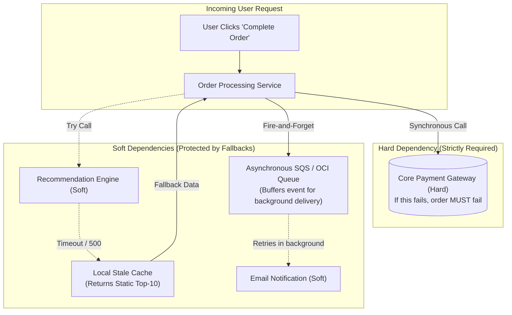

#### AWS Implementation
Implement an asynchronous fire-and-forget fallback pattern using Amazon SQS and Python boto3 [Doc: SQS Decoupled Architecture, checked 2026]:

```python
# order_processor.py
import boto3
import json
import logging

sqs = boto3.client('sqs')
OFFLINE_NOTIFICATION_QUEUE = "https://sqs.us-east-1.amazonaws.com/123456789012/offline-notifications"

def process_checkout(order_data):
    # Hard Dependency: Must execute payment synchronously
    payment_result = execute_core_payment(order_data)
    if not payment_result['success']:
        raise Exception("Payment authorization failed")
    
    # Soft Dependency: Notification dispatch MUST NOT crash the checkout!
    try:
        dispatch_email_notification_sync(order_data)
    except Exception as e:
        logging.warning(f"Notification service unreachable! Buffering to offline queue: {e}")
        # Asynchronous Fallback: Buffer to SQS queue with 14-day retention
        sqs.send_message(
            QueueUrl=OFFLINE_NOTIFICATION_QUEUE,
            MessageBody=json.dumps(order_data)
        )
    
    return {"status": "SUCCESS", "order_id": order_data['order_id']}

def execute_core_payment(data):
    return {"success": True}

def dispatch_email_notification_sync(data):
    # Simulates third-party SaaS failure
    raise TimeoutError("Third-party Email SaaS timeout")
```

#### OCI Implementation
Implement soft-dependency fallback caching using OCI Cache with Redis and OCI Queue [Doc: OCI Queue Architecture, checked 2026]:

```python
# oci_checkout_fallback.py
import redis
import json

cache = redis.Redis(host='redis.internal.oci', port=6379, socket_timeout=1.0)

def get_product_recommendations(user_id):
    # Soft Dependency: Try primary recommendation engine with strict 500ms timeout
    try:
        return call_live_ai_recommendation_engine(user_id)
    except Exception as e:
        # Fallback Cache: Retrieve pre-cached static fallback recommendations
        cached_fallback = cache.get("fallback:popular_products")
        if cached_fallback:
            return json.loads(cached_fallback)
        # Extreme Fallback: Safe default empty list (Zero latency penalty)
        return []

def call_live_ai_recommendation_engine(uid):
    raise TimeoutError("Live AI engine overloaded")
```

#### Common Trap
Configuring HTTP clients with default infinite or 60-second connection timeouts when calling downstream soft dependencies. If a microservice makes 3 sequential calls to soft dependencies with default 30-second timeouts, an outage in those dependencies causes user requests to hang for 90 seconds before throwing an error. All worker threads saturate waiting on dead services. Soft dependencies must **always enforce aggressive, sub-second timeouts** (e.g., connection timeout: $250\text{ms}$, read timeout: $500\text{ms}$) combined with fallback execution.

#### Follow-up Question
How do you implement semantic caching and stale-while-revalidate headers in reverse proxies to serve stale soft-dependency content while background workers asynchronously attempt to refresh the cache?

---

### Q409: Distributed Rate Limiting: Token Bucket vs Leaky Bucket vs Sliding Window

#### Question
How do distributed API gateways and edge proxies enforce rate limiting across hundreds of horizontally autoscaled ingress nodes without centralized database lock contention, and what are the mathematical trade-offs between Token Bucket, Leaky Bucket, Fixed Window, and Sliding Window Log algorithms?

#### Short Answer
Rate limiting protects APIs from abusive traffic, scraping, and brute-force attacks by bounding request velocity. **Fixed Window** counts requests per calendar minute (e.g., max 100 requests between 12:01 and 12:02), but suffers from "Boundary Bursts" ($2\times$ the limit across window edges). **Sliding Window Log** stores exact request timestamps in Redis sorted sets, providing mathematically perfect sliding accuracy at the cost of high memory usage ($O(N)$ storage). **Leaky Bucket** processes requests at a strictly constant, smoothed output rate (ideal for traffic shaping to legacy systems). **Token Bucket** (the industry standard in AWS API Gateway, Envoy, and OCI API Gateway) allows bursts up to a configured bucket capacity while refilling at a steady rate, enabling instantaneous bursts without dropping legitimate client interactions. In distributed fleets, counters are synchronized using **Redis Lua Scripts** or **local batching (token pre-allocation)** to avoid network round-trip bottlenecks on every request.

#### Deep Answer
Implementing rate limiting across a single web server using an in-memory hash table is trivial. In a cloud architecture with 500 API Gateway nodes, coordinating global rate limits across millions of distinct IP addresses and API keys requires distributed synchronization.

**1. Comparison of Rate Limiting Algorithms**:
- **Fixed Window Counter**:
  - *Mechanics*: `INCR user_123:2026-03-01:12:01`. Key expires after 60s.
  - *Flaw (Boundary Spike)*: A user sends 100 requests at 12:00:59, and another 100 requests at 12:01:01. Both windows record 100 requests (legal), but within a 2-second window, the user sent 200 requests, potentially crashing downstream databases.
- **Sliding Window Log**:
  - *Mechanics*: Stores timestamps of every request in a Redis Sorted Set (`ZADD`). Removes timestamps older than `now - window_size` (`ZREMRANGEBYSCORE`), and counts remaining set size (`ZCARD`).
  - *Flaw*: Extreme memory consumption. If an API handles 10,000 requests/sec per client, storing 10,000 64-bit integers per client will exhaust Redis RAM.
- **Sliding Window Counter (Hybrid)**:
  - Approximates the sliding rate by weighting the previous window and current window:
    $$\text{Rate} = \text{Count}_{\text{current}} + \text{Count}_{\text{previous}} \times \left(1 - \frac{\text{Time elapsed in current window}}{\text{Window Size}}\right)$$
  - Requires storing only two numbers per user ($O(1)$ memory) with $99.5\%$ mathematical accuracy.
- **Token Bucket (Cloud Gateway Standard)**:
  - Tokens accumulate in a bucket of capacity $B$ at rate $R$ tokens/second.
  - Accommodates sudden bursts of size $B$, while bounding sustained throughput to $R$.

**2. Distributed Synchronization Strategies**:
- **Centralized Redis with Atomic Lua Scripts**:
  - All 500 API gateway nodes execute an atomic Redis Lua script on each incoming request.
  - To prevent Redis from becoming a bottleneck, gateways use **Local Batch Token Reservation**: each gateway node requests a batch of 50 tokens from Redis and dispenses them locally from memory, reducing Redis network calls by $50\times$.

#### Architecture
```mermaid
graph TD
    subgraph "Distributed Ingress Fleet (500 Nodes)"
        GW1["Gateway Node 1\n(Local Token Buffer: 12 left)"]
        GW2["Gateway Node 2\n(Local Token Buffer: 34 left)"]
        GW3["Gateway Node 3\n(Local Token Buffer: 0 - Refills from Redis)"]
    end

    subgraph "Distributed State Tier (Redis Cluster / OCI Cache)"
        REDIS[("Redis In-Memory Cache\nAtomic Lua Script: Sliding Window Counter\nKey: tenant_42:tokens")]
        GW3 -->|Atomic Token Reservation (Batch = 50)| REDIS
    end

    subgraph "Downstream Protected Workload"
        APP["Protected Microservice Fleet\n(Protected from Boundary Bursts & Overload)"]
        GW1 --> APP
        GW2 --> APP
    end
```

#### AWS Implementation
Implement an atomic Sliding Window Counter using AWS Lambda, ElastiCache Redis, and Python Lua scripts [Doc: Redis Distributed Rate Limiting, checked 2026]:

```python
# rate_limiter.py
import redis
import time

r = redis.Redis(host='elasticache-redis.prod.internal', port=6379, socket_timeout=0.1)

# Atomic Lua Script for Sliding Window Counter
SLIDING_WINDOW_LUA = \'\'\'
local key = KEYS[1]
local now = tonumber(ARGV[1])
local window = tonumber(ARGV[2])
local limit = tonumber(ARGV[3])
local clear_before = now - window

redis.call('ZREMRANGEBYSCORE', key, 0, clear_before)
local current_requests = redis.call('ZCARD', key)

if current_requests < limit then
    redis.call('ZADD', key, now, now)
    redis.call('EXPIRE', key, window)
    return 1
else
    return 0
end
\'\'\'

def is_request_allowed(client_id, limit=100, window_seconds=60):
    now = int(time.time())
    key = f"ratelimit:{client_id}"
    allowed = r.eval(SLIDING_WINDOW_LUA, 1, key, now, window_seconds, limit)
    return allowed == 1
```

#### OCI Implementation
Configure rate limiting on an OCI API Gateway deployment with sliding window token quotas [Doc: OCI API Gateway Rate Limiting Specification, checked 2026]:

```json
// oci-rate-limiting-policy.json
{
  "routes": [
    {
      "path": "/api/v1/checkout",
      "methods": ["POST"],
      "policies": {
        "rateLimiting": {
          "rateInRequestsPerSecond": 50,
          "rateKey": "CLIENT_IP"
        }
      },
      "backend": {
        "type": "HTTP_BACKEND",
        "url": "http://checkout.internal.prod:8080/checkout"
      }
    }
  ]
}
```

```bash
# Update OCI API Gateway with Token Bucket Rate Limiting policy
oci api-gateway deployment update \
  --deployment-id ocid1.apigatewaydeployment.oc1.iad.aaaaaaaaxample... \
  --specification file://oci-rate-limiting-policy.json
```

#### Common Trap
Using client IP address (`Remote-Addr`) as the rate-limiting key for mobile or enterprise clients. Thousands of corporate employees in an office building or thousands of mobile phone users on a cellular carrier share a small pool of corporate NAT gateways or mobile carrier proxy IPs. If a rate limit of 100 requests/minute is applied per IP, a single active user in that corporate office will quickly exhaust the limit, blocking all other employees in the building. Rate limits must be keyed on authenticated tokens (**JWT `sub`**, **API Key**, or **OAuth `client_id`**), reserving raw IP rate limiting exclusively for unauthenticated endpoints (such as `/login` or `/signup`).

#### Follow-up Question
How do you implement global rate limiting across multi-region active-active deployments without incurring cross-WAN Redis latency on every single API request?

---

### Q410: Backpressure & Flow Control: Reactive Streams, TCP Buffers & Queue Saturation

#### Question
How do distributed asynchronous systems prevent fast producers from overwhelming slow consumers, and how do Reactive Streams, TCP window scaling, and message broker flow control maintain end-to-end backpressure?

#### Short Answer
**Backpressure** is the feedback mechanism by which a slow consumer signals an upstream fast producer to reduce its transmission rate, preventing memory buffer exhaustion, thread pool saturation, and system crashes. Without backpressure, a producer generating 10,000 events/sec into a consumer capable of processing only 1,000 events/sec causes in-memory buffers to grow indefinitely until the consumer crashes with `OutOfMemoryError`. At the transport layer, **TCP Flow Control** enforces backpressure via sliding window advertisements (`TCP Window Size = 0` halts sender packets). In application runtimes, the **Reactive Streams** standard (`Publisher`, `Subscriber`, `Subscription.request(n)`) enforces non-blocking, pull-based flow control. In cloud architectures, persistent message brokers (Amazon SQS, Kinesis, Kafka, OCI Streaming) act as durable **Shock Absorbers**, buffering excess events to NVMe storage.

#### Deep Answer
Backpressure is an unavoidable physical requirement of distributed data pipelines. When rate mismatches occur between components, the excess data must either be: (1) Buffered in memory (risking OOM crashes); (2) Buffered on persistent disk/brokers (introducing latency); or (3) Dropped (load shedding).

**1. The Three Layers of Backpressure**:

**A. Transport Layer (TCP Windowing)**:
- Every TCP socket maintains a receive buffer (typically 64KB to a few megabytes).
- When a consumer process is blocked (e.g., slow database write), it stops reading from the Linux kernel socket buffer via `read()`.
- The kernel receive buffer fills up.
- The consumer's TCP stack sends a `TCP Zero Window` packet to the producer.
- The producer's kernel pauses socket transmission, blocking the producer's application thread or pausing its event loop.

**B. Application Layer (Reactive Streams Specification)**:
- Push-based models fail because the sender dictates the volume.
- **Reactive Streams (RxJava, Project Reactor, Akka Streams, Java 9 Flow)** mandates **Pull-Based Demand Signaling**:
  - The `Subscriber` requests work explicitly: `subscription.request(10)`.
  - The `Publisher` is strictly forbidden from sending more than 10 items.
  - When the consumer finishes processing item 10, it issues `subscription.request(10)` again.
  - Throughput adjusts automatically to the exact real-time capacity of the consumer.

**C. Architecture Layer (Message Broker Shock Absorbers)**:
- When a producer cannot be throttled (e.g., millions of IoT devices emitting telemetry or a Black Friday shopping surge), the cloud architecture inserts an intermediate persistent broker:
  - AWS: Amazon Kinesis Data Streams / Amazon SQS.
  - OCI: OCI Streaming (Kafka-compatible) / OCI Queue.
- The broker persists gigabytes of unconsumed events across distributed NVMe disks, allowing consumer worker fleets to scale out horizontally via KEDA or Auto Scaling while processing at a safe, steady pace without crashing [Doc: Reactive Streams Architecture, checked 2026].

#### Architecture
```mermaid
graph TD
    subgraph "Unconstrained Fast Producer"
        PROD["API Ingestion Stream\n(Producing 10,000 Events/sec)"]
    end

    subgraph "WITHOUT Backpressure: Memory Buffer Overflow"
        CONSUMER_ERR["Slow Consumer\n(Processing: 1,000/sec)"]
        RAM_BUFFER["In-Memory RAM Buffer\n[Msg] [Msg] [Msg] [Msg] ...\n(Grows Unbounded!)"]
        CRASH["OutOfMemoryError: Java heap space\nProcess Terminated!"]
        PROD --> RAM_BUFFER --> CONSUMER_ERR
        RAM_BUFFER -.->|Heap Full| CRASH
    end

    subgraph "WITH Backpressure: Pull-Based Reactive Demand"
        BROKER[("Durable Broker (Kinesis / OCI Streaming)\n(Persistent NVMe Disk Storage Buffer)")]
        CONSUMER_OK["Reactive Worker Fleet"]
        PROD --> BROKER
        CONSUMER_OK ===|Pull Demand: request(50)| BROKER
        BROKER -.->|Delivers exactly 50 msgs| CONSUMER_OK
    end
```

#### AWS Implementation
Implement pull-based demand backpressure using the Amazon Kinesis Client Library (KCL) in Python/Java [Doc: AWS Kinesis Client Library Guide, checked 2026]:

```python
# kinesis_consumer.py (Controlled Pull Model)
import boto3
import time

kinesis = boto3.client('kinesis', region_name='us-east-1')
stream_name = "production-event-stream"

# Get Shard Iterator
shard_id = "shardId-000000000000"
iterator_response = kinesis.get_shard_iterator(
    StreamName=stream_name,
    ShardId=shard_id,
    ShardIteratorType='LATEST'
)
shard_iterator = iterator_response['ShardIterator']

while True:
    # Pull-based Backpressure: Explicitly limit fetch size to 50 records
    record_response = kinesis.get_records(
        ShardIterator=shard_iterator,
        Limit=50  # Enforce consumer-controlled batch sizing
    )
    records = record_response['Records']
    
    if records:
        print(f"Processing batch of {len(records)} records safely...")
        process_records_with_rate_control(records)
    
    shard_iterator = record_response['NextShardIterator']
    time.sleep(1.0) # Voluntary backpressure throttle

def process_records_with_rate_control(records):
    # Process batch against downstream database
    pass
```

#### OCI Implementation
Configure pull-based cursor processing with explicit batch sizing on an OCI Stream using OCI CLI [Doc: OCI Streaming GetMessages API, checked 2026]:

```bash
# Step 1: Create a cursor to read from an OCI Stream partition
CURSOR=$(oci streaming stream get-cursor \
  --stream-id ocid1.stream.oc1.iad.aaaaaaaaxample... \
  --cursor-type LATEST \
  --partition "0" \
  --query 'data.value' --output text)

# Step 2: Fetch a bounded batch of records (Limit: 50) enforcing consumer flow control
oci streaming stream get-messages \
  --stream-id ocid1.stream.oc1.iad.aaaaaaaaxample... \
  --cursor "$CURSOR" \
  --limit 50
```

#### Common Trap
Configuring asynchronous message consumers (e.g., SQS or Kafka listeners) with unbounded thread pools or unconstrained pre-fetch buffers (such as setting Spring Kafka's `max.poll.records` to 10,000 on a JVM with only 2GB RAM). The consumer pulls 10,000 heavy message objects into memory; before worker threads can process them, the JVM runs out of heap memory and crashes. When the container restarts, it re-fetches the same 10,000 messages and crashes again in an infinite loop. Always tune consumer pre-fetch limits strictly proportional to available container memory.

#### Follow-up Question
How does the Reactive Streams `onBackpressureDrop()` vs `onBackpressureBuffer()` strategy handle downstream saturation when processing non-droppable financial transaction events?

---

### Q411: Dead Letter Queues (DLQ) & Poison Pill Handling: Redrive Pipelines

#### Question
How do cloud asynchronous message systems isolate and recover from "Poison Pill" payloads without blocking queue throughput or dropping transactions, and how are Amazon SQS DLQs and OCI Queue / Streaming Dead Letter Queues configured for automated inspection and redrive?

#### Short Answer
A **Poison Pill** is a malformed, corrupt, or unparseable message (e.g., invalid JSON syntax, null pointer trigger, schema violation) that causes consumer applications to crash or throw an unhandled exception every time it is processed. Without proper handling, the consumer crashes, the message returns to the queue upon visibility timeout, another worker picks it up and crashes, creating a permanent processing bottleneck that blocks all subsequent valid messages. A **Dead Letter Queue (DLQ)** isolates poison pills: when a message's delivery attempt count breaches a configured **Maximum Receive Count** (e.g., 3 to 5 attempts), the message broker automatically diverts the toxic message into the DLQ, emitting an SRE alert while allowing workers to continue processing healthy messages. SREs fix the bug or sanitize the payload, and execute an automated **DLQ Redrive** to re-queue the messages back to the source queue.

#### Deep Answer
In asynchronous enterprise architectures, handling bad data is just as critical as handling good data. Dropping a poison pill silently loses user data; letting it loop forever crashes compute fleets.

**1. The Poison Pill Death Loop**:
- Producer enqueues Message 101 with an unhandled unicode character or schema mismatch.
- Worker A picks up Message 101 $\rightarrow$ Parser crashes with `JSONParseException` $\rightarrow$ Worker process terminates.
- Because Worker A died before calling `DeleteMessage`, Message 101 remains in the queue.
- Once SQS `VisibilityTimeout` (or OCI Queue delivery timeout) expires (e.g., 30 seconds), Message 101 becomes visible again.
- Worker B picks up Message 101 $\rightarrow$ crashes. Worker C picks it up $\rightarrow$ crashes.
- The entire worker fleet enters a continuous crash-restart cycle, and 100,000 valid messages behind Message 101 remain unconsumed.

**2. DLQ Architecture & Redrive Lifecycle**:
- **MaxReceiveCount (The Safety Fuse)**:
  - Every time a message is delivered to a worker, the broker increments an internal counter (`ApproximateReceiveCount` in SQS / `deliveryCount` in OCI Queue).
  - If `ApproximateReceiveCount > maxReceiveCount` (typically set to 3–5):
    - The broker moves the message to the designated Dead Letter Queue.
    - An alarm triggers: `ApproximateNumberOfMessagesVisible > 0` on the DLQ [Doc: SQS Dead-Letter Queues, checked 2026].
- **Inspection & Bug Remediation**:
  - SREs inspect DLQ payloads using CloudWatch / OCI Console or CLI.
  - A software patch or schema update is deployed to fix the parser.
- **Automated DLQ Redrive**:
  - AWS SQS supports **Dead-Letter Queue Redrive**: an automated service that moves messages from the DLQ back to the source queue (or a custom recovery queue) at a controlled throughput rate (e.g., 100 msgs/sec).
  - OCI Queue provides native DLQ re-enqueueing APIs [Doc: OCI Queue DLQ Redrive, checked 2026].

#### Architecture
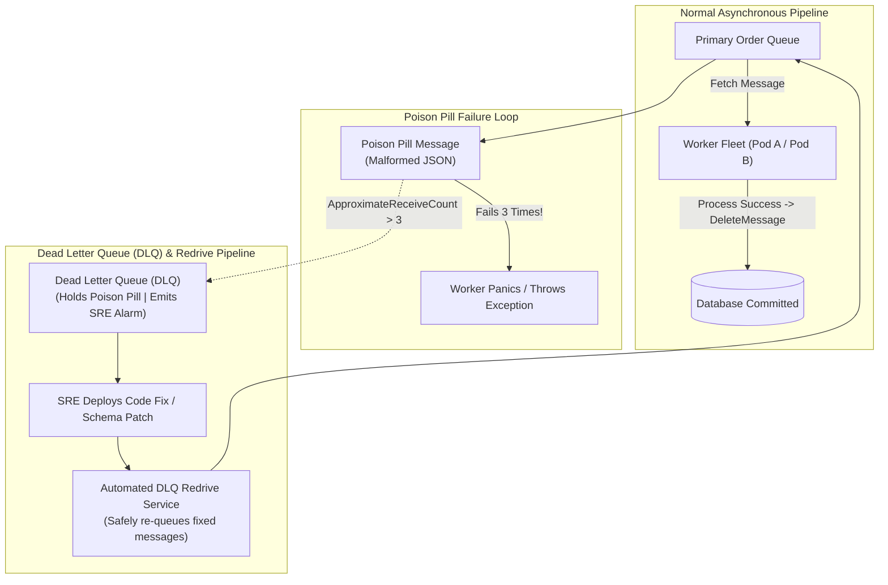

#### AWS Implementation
Configure an SQS Dead Letter Queue with a redrive policy and execute an automated DLQ redrive using AWS CLI [Doc: AWS SQS DLQ CLI, checked 2026]:

```bash
# Step 1: Create the Dead Letter Queue
DLQ_URL=$(aws sqs create-queue --queue-name "orders-dlq" --query 'QueueUrl' --output text)
DLQ_ARN=$(aws sqs get-queue-attributes --queue-url "$DLQ_URL" --attribute-names QueueArn --query 'Attributes.QueueArn' --output text)

# Step 2: Attach Redrive Policy to primary queue (MaxReceiveCount = 3)
cat << EOF > redrive-policy.json
{
  "deadLetterTargetArn": "$DLQ_ARN",
  "maxReceiveCount": "3"
}
EOF

aws sqs set-queue-attributes \
  --queue-url "https://sqs.us-east-1.amazonaws.com/123456789012/orders-primary-queue" \
  --attributes "RedrivePolicy='$(cat redrive-policy.json)'"

# Step 3: Start an automated Redrive of all messages from DLQ back to Primary Queue after fixing bug
aws sqs start-message-move-task \
  --source-arn "$DLQ_ARN" \
  --destination-arn "arn:aws:sqs:us-east-1:123456789012:orders-primary-queue" \
  --max-number-of-messages-per-second 50
```

#### OCI Implementation
Configure a Dead Letter Queue on an OCI Queue and monitor poison pill accumulation using OCI CLI [Doc: OCI Queue DLQ Configuration, checked 2026]:

```bash
# Create an OCI Queue with a Dead Letter Queue and custom delivery count limit
cat << 'EOF' > oci-queue-config.json
{
  "compartmentId": "ocid1.compartment.oc1..aaaaaaaam7...",
  "displayName": "orders-production-queue",
  "visibilityInSeconds": 30,
  "timeoutInSeconds": 60,
  "deadLetterQueueDeliveryCount": 3
}
EOF

oci queue queue create --from-json file://oci-queue-config.json

# Query DLQ message count in OCI Monitoring to trigger on-call alert
oci monitoring metric-data summarize-metrics-data \
  --compartment-id ocid1.compartment.oc1..aaaaaaaam7... \
  --namespace "oci_queue" \
  --query-text "DeadLetterMessageCount[1m].max() > 0"
```

#### Common Trap
Configuring a Dead Letter Queue with an expiration retention period shorter than your team's incident response SLA (e.g., setting DLQ message retention to 1 day). If a poison pill enters the DLQ on a Friday evening, and the on-call team does not inspect it until Monday morning, the message broker permanently deletes the poison pills, losing customer transactions forever. Dead Letter Queues must always be configured with the **maximum retention period permitted by the cloud provider** (14 days in Amazon SQS and OCI Queue).

#### Follow-up Question
How do you structure Dead Letter Queues when consuming from strictly ordered FIFO queues without violating sequential message ordering guarantees?

---

### Q412: Database Resiliency: Read Replica Lag & Read-After-Write Consistency

#### Question
How do enterprise cloud architectures prevent user-facing data inconsistencies caused by asynchronous database read replica replication lag, and how are Read-After-Write consistency pinning and connection routing implemented across AWS RDS / Aurora and OCI Database systems?

#### Short Answer
To scale read throughput, cloud databases offload `SELECT` queries to asynchronous read replicas. However, because replication is asynchronous, a **Replication Lag** window ($10\text{ms}$ to several seconds) exists between the primary writer and read replicas. If an application executes a write (`INSERT / UPDATE`) on the primary and immediately redirects the user to a profile page that queries a lagged read replica, the user experiences the **"Disappearing Data" bug** (their newly created comment or updated address is missing, prompting frantic duplicate submissions). Resilient architectures solve this via **Read-After-Write Consistency Pinning**: after any mutation, subsequent read queries for that specific user or session are pinned to the **Primary Writer** for a bounded time window (e.g., 5 seconds) before falling back to read replicas, or using database session tokens (e.g., PostgreSQL LSN / MySQL GTID tracking).

#### Deep Answer
Scaling read replicas is essential for high-throughput applications, but assuming read replicas are always up-to-date is a fatal architectural assumption.

**1. The Root Causes of Replication Lag Spikes**:
- Long-running analytical batch queries (`SELECT ... GROUP BY`) executing on the read replica, holding locks and starving replication apply threads.
- High write I/O bursts on the primary (e.g., mass database bulk updates).
- Network congestion or replication thread single-threaded bottlenecks (e.g., standard MySQL single-threaded replica SQL threads).

**2. Architectural Patterns for Read-After-Write Consistency**:
- **Pattern 1: Time-Based Session Pinning (The 5-Second Rule)**:
  - When a user performs an HTTP `POST / PUT / DELETE`:
    - The application sets a short-lived session flag or cookie: `just_wrote_timestamp = now()`.
  - On subsequent `GET` requests:
    - If `now() - just_wrote_timestamp < 5 seconds`, route the query to the **Primary Writer**.
    - If $>5$ seconds, route safely to the **Read Replica**.
  - Trade-off: Simple to implement in API Gateways, protects 99% of user journeys, while offloading 90% of total read volume to replicas.
- **Pattern 2: Monotonic Sequence Number Pinning (LSN / GTID)**:
  - When the primary commits a transaction, it returns the **Log Sequence Number (LSN)** in PostgreSQL or **Global Transaction Identifier (GTID)** in MySQL.
  - The client includes this LSN in subsequent request headers: `x-required-lsn: 10482910`.
  - The connection router inspects the read replica's current replay LSN:
    - If $\text{Replica LSN} \ge \text{Required LSN}$, execute on replica.
    - If $\text{Replica LSN} < \text{Required LSN}$, route to primary writer [Doc: Database Replication Consistency Patterns, checked 2026].
- **Pattern 3: Aurora Global Database Read Consistency**:
  - Aurora PostgreSQL provides session-level consistency options (`aurora_read_replica_read_consistency`) allowing queries to wait until the replica catches up to the required point-in-time.

#### Architecture
```mermaid
graph TD
    subgraph "Client Action: User Updates Profile"
        USER["User Submits Form\n(POST /update-profile)"]
        ROUTER["Application Connection Router"]
        USER --> ROUTER
    end

    subgraph "Database Tier"
        PRIMARY[("Primary Database (Writer)\n(Commits Update at LSN: 500)")]
        STANDBY[("Read Replica (Lagging at LSN: 480)\n(Does not have new profile data yet!)")]
        
        ROUTER -->|1. Write to Primary| PRIMARY
        PRIMARY -.->|Async Replication Lag (500ms)| STANDBY
    end

    subgraph "Subsequent Client Action (100ms later)"
        USER_GET["User Views Profile\n(GET /profile)"]
        CHECK{"Session Wrote Recently?\n(<5s OR Required LSN > Replica LSN)"}
        
        USER_GET --> CHECK
        CHECK -->|YES: Pin to Writer| PRIMARY
        CHECK -->|NO: Safe to use Replica| STANDBY
    end
```

#### AWS Implementation
Configure database connection routing with replication lag thresholds using AWS RDS Proxy and CloudWatch metric monitoring [Doc: AWS RDS Proxy Read Replica Routing, checked 2026]:

```bash
# Monitor Aurora / RDS Replication Lag via AWS CloudWatch CLI
aws cloudwatch get-metric-data \
  --metric-data-queries '[{
    "Id": "m1",
    "MetricStat": {
      "Metric": {
        "Namespace": "AWS/RDS",
        "MetricName": "AuroraReplicaLag",
        "Dimensions": [{ "Name": "DBInstanceIdentifier", "Value": "prod-aurora-reader-1" }]
      },
      "Period": 60,
      "Stat": "Maximum"
    }
  }]' \
  --start-time 1772841600 \
  --end-time 1772845200
```

```python
# Application-level connection router in Python
import time

def get_database_connection(user_session, is_write_operation=False):
    if is_write_operation:
        user_session['last_write_time'] = time.time()
        return get_primary_connection()
    
    # Read-After-Write Pinning: If user mutated data within last 5 seconds, use Primary!
    time_since_write = time.time() - user_session.get('last_write_time', 0)
    if time_since_write < 5.0:
        return get_primary_connection()
    
    return get_read_replica_connection()
```

#### OCI Implementation
Monitor database replication lag and configure read-after-write session consistency in OCI Autonomous Database / Base DB Data Guard [Doc: OCI Data Guard Lag Monitoring, checked 2026]:

```bash
# Query Active Data Guard replication lag in OCI Monitoring
oci monitoring metric-data summarize-metrics-data \
  --compartment-id ocid1.compartment.oc1..aaaaaaaam7... \
  --namespace "oci_database" \
  --query-text "DataGuardLag[1m].max()" \
  --start-time "2026-03-01T12:00:00Z" \
  --end-time "2026-03-01T13:00:00Z"
```

```sql
-- Inside Oracle Database: Configure Session-Level Read Consistency on Active Data Guard
ALTER SESSION SET STANDBY_MAX_DATA_DELAY = 2; -- Rejects query on replica if lag > 2 seconds
```

#### Common Trap
Blindly routing all HTTP `GET` requests to database read replicas and all `POST / PUT / DELETE` requests to the primary database via reverse proxy rules. In modern Single Page Applications (SPAs) and mobile apps, a `POST /items` is followed within 15 milliseconds by an automated `GET /items` to re-render the list. Because replication lag is rarely sub-15ms, the newly added item is guaranteed to be missing from the list, causing UI flickering and duplicate user submissions. You must implement session-level pinning or return the updated resource representation directly in the `POST` response payload.

#### Follow-up Question
How does causal consistency (e.g., in MongoDB or CockroachDB) preserve the illusion of sequential consistency across distributed replicas without requiring global two-phase locking?

---

### Q413: Distributed Lock Management: Redis Redlock vs DynamoDB vs OCI ETags

#### Question
How do distributed cloud applications coordinate mutual exclusion across horizontally scaled compute workers without deadlocks, and what are the critical safety flaws (clock drift, GC pauses, and network partitions) of Redis Redlock compared to DynamoDB Conditional Writes and OCI Object Storage ETags?

#### Short Answer
Distributed locking guarantees that only one worker process executes a specific critical section at a time (e.g., processing a payment batch, generating a sequence invoice, or executing a leader election). **Redis Redlock** uses multiple independent Redis nodes with time-based TTL expiration; however, famous computer science critiques (e.g., Martin Kleppmann) proved that Redlock is **unsafe for correctness** because unexpected JVM/runtime Garbage Collection (GC) pauses or OS clock drift can cause a lock to expire while the worker is still actively executing, leading to concurrent double-execution. For strict transactional correctness, cloud architectures utilize **DynamoDB Conditional Writes** (`attribute_not_exists(LockKey) OR Expiration < :now`) with fencing tokens or **OCI Object Storage / Database Conditional ETags** (`If-Match`), ensuring atomic hardware-level serialization independent of system clock synchronization.

#### Deep Answer
A distributed lock is fundamentally different from a local in-process mutex because in distributed systems, **clocks are unreliable, processes can pause at any moment, and network packets can be delayed arbitrarily**.

**1. The Garbage Collection (GC) Pause Trap in Redis Redlock**:
- Consider Worker A acquiring a 10-second Redlock.
- Worker A begins the critical transaction.
- Suddenly, Worker A experiences a major "Stop-the-World" Java garbage collection pause or hypervisor CPU freeze that lasts for **12 seconds**.
- While Worker A is frozen, its 10-second lock expires in Redis.
- Worker B requests the lock $\rightarrow$ acquires it successfully $\rightarrow$ begins writing to the database.
- Worker A wakes up from the GC pause! Believing it still owns the lock, Worker A executes its database write simultaneously with Worker B.
- **Both workers execute the critical section concurrently, corrupting data!**

**2. Fencing Tokens (The Solution to Expired Locks)**:
- Every time a distributed lock is acquired, the lock server issues a **Fencing Token**: a strictly monotonically increasing number ($1, 2, 3 \dots$).
- Target storage systems (PostgreSQL, DynamoDB, OCI Block Storage) must validate the fencing token:
  - If Storage has already accepted a write with Token 42 from Worker B, and Worker A wakes up and attempts a write with Token 41, **Storage rejects Worker A's write**.

**3. Cloud-Native Lock Implementations**:
- **Amazon DynamoDB Conditional Writes**:
  - Atomic compare-and-swap at the storage partition engine:
    ```sql
    PutItem(LockKey="billing_job", Owner="worker_1", LeaseExpiry=1772841600)
    Condition: attribute_not_exists(LockKey) OR LeaseExpiry < :now
    ```
  - DynamoDB uses internal Paxos consensus, guaranteeing deterministic atomicity [Doc: DynamoDB Distributed Locking, checked 2026].
- **OCI Object Storage Conditional ETags**:
  - Uses HTTP `If-Match` with MD5/SHA256 entity tags (ETags).
  - An atomic compare-and-swap operation: if another worker has updated the lock object, the ETag changes, and the update is rejected with `HTTP 412 Precondition Failed`.

#### Architecture
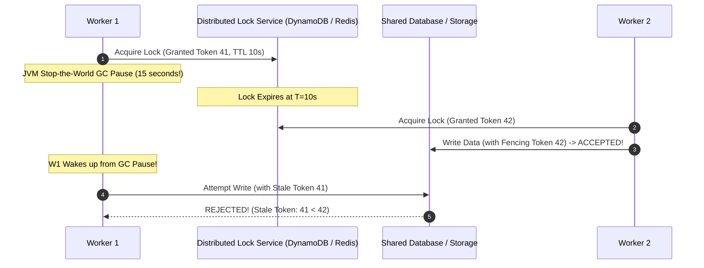

#### AWS Implementation
Implement atomic distributed locking with fencing tokens using Amazon DynamoDB Conditional Writes in Python [Doc: AWS DynamoDB Lock Client, checked 2026]:

```python
# dynamodb_lock.py
import boto3
import time
from botocore.exceptions import ClientError

dynamodb = boto3.client('dynamodb', region_name='us-east-1')
TABLE_NAME = "DistributedLocks"

def acquire_lock(lock_name, owner_id, duration_seconds=30):
    now = int(time.time())
    lease_expiration = now + duration_seconds
    
    try:
        # Atomic Compare-and-Swap: Acquire lock only if missing OR expired
        dynamodb.put_item(
            TableName=TABLE_NAME,
            Item={
                'LockKey': {'S': lock_name},
                'Owner': {'S': owner_id},
                'LeaseExpiration': {'N': str(lease_expiration)},
                'FencingToken': {'N': str(now)} # Monotonically increasing token
            },
            ConditionExpression="attribute_not_exists(LockKey) OR LeaseExpiration < :now",
            ExpressionAttributeValues={':now': {'N': str(now)}}
        )
        print(f"Lock '{lock_name}' acquired by {owner_id} with Fencing Token {now}")
        return True, now
    except ClientError as e:
        if e.response['Error']['Code'] == 'ConditionalCheckFailedException':
            print(f"Lock '{lock_name}' is currently held by another worker.")
            return False, None
        raise e
```

#### OCI Implementation
Implement atomic distributed locking using OCI Object Storage Conditional ETags and `If-Match` [Doc: OCI Object Storage Conditional Requests, checked 2026]:

```python
# oci_object_lock.py
import oci
import json
import time

config = oci.config.from_file()
client = oci.object_storage.ObjectStorageClient(config)
NAMESPACE = "enterprise-telemetry"
BUCKET = "distributed-locks"

def acquire_oci_lock(lock_name, owner_id):
    # Step 1: Read existing lock object to acquire current ETag
    try:
        get_resp = client.get_object(NAMESPACE, BUCKET, lock_name)
        current_etag = get_resp.headers['ETag']
        lock_data = json.loads(get_resp.data.text)
        
        # Verify if existing lock is expired
        if time.time() < lock_data['expires_at']:
            return False, None # Lock is actively held
    except oci.exceptions.ServiceError as e:
        if e.status == 404:
            current_etag = None # Object doesn't exist yet
        else:
            raise e

    # Step 2: Atomic update with If-Match (or If-None-Match for initial creation)
    new_lock_payload = json.dumps({"owner": owner_id, "expires_at": time.time() + 30})
    try:
        put_kwargs = {"if_none_match": "*"} if current_etag is None else {"if_match": current_etag}
        client.put_object(NAMESPACE, BUCKET, lock_name, new_lock_payload, **put_kwargs)
        return True, time.time()
    except oci.exceptions.ServiceError as e:
        if e.status == 412: # Precondition Failed: Another worker acquired it first!
            return False, None
        raise e
```

#### Common Trap
Releasing a distributed lock simply by deleting the lock key (`DEL my_lock` in Redis or `DeleteItem` in DynamoDB) without verifying that you still own it! If Worker A's lock expired while it was paused, and Worker B acquired the lock, Worker A waking up and blindly executing `DEL my_lock` will **delete Worker B's active lock**, allowing Worker C to enter the critical section while Worker B is still writing. A lock release must be atomic and conditional: delete only if the lock value matches your specific owner ID and lease token.

#### Follow-up Question
Why does the Chandy-Lamport distributed snapshot algorithm allow capturing global consistent states across asynchronous networks without freezing distributed lock managers?

---

### Q414: Timeouts, Deadlines & Request Hedging: Eliminating Tail Latency

#### Question
How do high-scale distributed systems eliminate catastrophic $p99$ and $p99.9$ tail latency spikes, and what are the mathematical and architectural differences between Context Deadlines, Deadline Propagation (gRPC / OTel), and Request Hedging?

#### Short Answer
In deep microservice graphs, overall response time is governed by the slowest downstream dependency (the "Tail at Scale"). Standard fixed timeouts fail because they do not account for time already spent in upstream tiers. **Context Deadlines** specify an absolute point in time (e.g., `12:00:05.500`) by which the entire distributed transaction must complete. **Deadline Propagation** automatically transmits this remaining time budget across service boundaries via HTTP/gRPC headers; if a downstream service receives a request whose deadline has already elapsed, it rejects it immediately in $0\text{ms}$ rather than wasting CPU. **Request Hedging** slashes tail latency by sending an identical secondary request to an alternate replica if the primary request has not returned within the expected $p95$ latency window (e.g., after $25\text{ms}$), accepting whichever response returns first and canceling the other.

#### Deep Answer
As microservice depth increases, the probability of a user encountering a slow server approaches certainty:
$$\text{Probability of slow user request} = 1 - (1 - p)^N$$
If a page calls 100 backend services, and each service has a $1\%$ tail latency probability ($p=0.01$), **$63.4\%$ of all user requests will experience severe tail latency!**

**1. Deadline Propagation (The Anti-Wasted-Work Architecture)**:
- Consider a call chain: Client $\rightarrow$ Service A $\rightarrow$ Service B $\rightarrow$ Database.
- Client sets a 2,000ms deadline.
- If Service A takes 1,800ms executing local logic before calling Service B:
  - Without deadline propagation, Service B uses its default 2,000ms timeout. Service B calls the database and takes 1,500ms.
  - Total time: $1,800 + 1,500 = 3,300\text{ms}$.
  - But the client already timed out at 2,000ms! The compute power spent by Service B and the database was **completely wasted**.
- With **gRPC / OpenTelemetry Deadline Propagation**:
  - Service A calculates remaining budget: $2,000 - 1,800 = 200\text{ms}$.
  - Passes `grpc-timeout: 200m` in header.
  - If Service B cannot complete within 200ms, it aborts immediately, conserving cluster capacity.

**2. Request Hedging (Slaying the Tail)**:
- Originated by Google (Dean & Barroso, "The Tail at Scale").
- The client sends a request to Replica 1.
- If Replica 1 does not return within the $p95$ latency threshold (e.g., 20ms):
  - The client sends an identical **Hedged Request** to Replica 2.
  - Whichever replica returns first wins; the other is canceled via context cancellation.
- Latency drops dramatically from 500ms to 25ms, at the cost of a modest $\approx 5\%$ increase in total cluster request volume [Doc: Google Tail at Scale Architecture, checked 2026].

#### Architecture
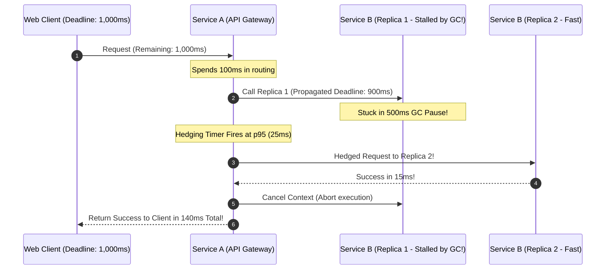

#### AWS Implementation
Implement gRPC Deadline Propagation in Python using OpenTelemetry context propagation [Doc: gRPC Python Deadlines, checked 2026]:

```python
# grpc_deadline_client.py
import grpc
import time

def call_downstream_with_deadline(stub, request_payload, timeout_seconds=1.5):
    # Establish absolute deadline
    deadline = time.time() + timeout_seconds
    
    try:
        # Passes deadline metadata across the network boundary
        response = stub.ExecutePayment(
            request_payload,
            timeout=timeout_seconds # Injects grpc-timeout header automatically
        )
        return response
    except grpc.RpcError as e:
        if e.code() == grpc.StatusCode.DEADLINE_EXCEEDED:
            print(f"Downstream service aborted: deadline of {timeout_seconds}s exceeded.")
        raise e
```

#### OCI Implementation
Implement Request Hedging in Go microservices deployed on OCI OKE [Doc: Go Context Deadlines and Hedging, checked 2026]:

```go
// hedging_client.go
package main

import (
	"context"
	"net/http"
	"time"
)

func executeHedgedRequest(ctx context.Context, replica1 string, replica2 string) (*http.Response, error) {
	ctx, cancel := context.WithTimeout(ctx, 500*time.Millisecond)
	defer cancel()

	resultChan := make(chan *http.Response, 2)
	errChan := make(chan error, 2)

	// Send Primary Request
	go func() {
		req, _ := http.NewRequestWithContext(ctx, "GET", replica1, nil)
		resp, err := http.DefaultClient.Do(req)
		if err == nil { resultChan <- resp } else { errChan <- err }
	}()

	// Hedging Timer: If primary takes longer than 25ms, send hedged request to replica 2
	select {
	case resp := <-resultChan:
		return resp, nil
	case <-time.After(25 * time.Millisecond):
		go func() {
			req, _ := http.NewRequestWithContext(ctx, "GET", replica2, nil)
			resp, err := http.DefaultClient.Do(req)
			if err == nil { resultChan <- resp } else { errChan <- err }
		}()
	}

	select {
	case resp := <-resultChan:
		return resp, nil
	case err := <-errChan:
		return nil, err
	}
}
```

#### Common Trap
Using Request Hedging for non-idempotent mutation operations (`POST /charge-card` or database inserts). If an application hedges a credit card payment because the payment gateway took 50ms to respond, both requests will execute on backend processors, charging the customer twice! Request Hedging **must be strictly restricted to idempotent read operations** (`GET`, `HEAD`) or mutations protected by strict database idempotency keys.

#### Follow-up Question
How does the Envoy proxy `hedge_on_per_try_timeout` configuration coordinate request cancellations via HTTP/2 `RST_STREAM` frames when the winning hedged response arrives?

---

### Q415: Stateless vs Stateful Failover: Session Affinity & Rehydrating Cold Replicas

#### Question
Why is achieving high availability and disaster recovery dramatically simpler for stateless applications compared to stateful workloads, and what are the specific architectural strategies required to externalize session state and rehydrate stateful replicas without cold-cache thrashing?

#### Short Answer
**Stateless applications** hold zero client session state or transactional data in local memory between HTTP requests; any request can be routed to any instance in any Availability Zone or region interchangeably, enabling instantaneous failover in $<1\text{ms}$ with zero data loss. **Stateful workloads** bind client state to local memory, local NVMe disks, or active TCP connections (e.g., WebSocket chat servers, transactional game loops, distributed caches); failing over a stateful node requires migrating or rehydrating state, which introduces connection drops, cold-cache latency spikes, and potential state corruption. Resilient cloud engineering enforces the **Externalized State Pattern**: decoupling stateless compute containers (EKS/OKE) from externalized distributed data planes (Amazon ElastiCache, OCI Cache with Redis, DynamoDB, Autonomous DB).

#### Deep Answer
Architectural complexity in cloud engineering is directly proportional to statefulness.

**1. The Mechanics of Stateless Elasticity**:
- A stateless web container boots in 15 seconds.
- Incoming HTTP requests carry complete authorization tokens (stateless cryptographically signed JWTs).
- Any instance in any AZ or region can handle the request.
- If an instance crashes:
  - Load balancer health checks detect failure $\rightarrow$ removes instance from target pool.
  - Client retries request $\rightarrow$ lands on an adjacent instance $\rightarrow$ request succeeds immediately.
  - Zero lost state. Zero synchronization overhead.

**2. The Stateful Failover Nightmare**:
- Consider a stateful WebSocket server maintaining 50,000 active persistent TCP connections holding real-time user session state in process RAM.
- If that node crashes:
  - 50,000 TCP sockets disconnect simultaneously.
  - All 50,000 clients attempt to reconnect simultaneously (**Thundering Herd**).
  - When replacement nodes boot, their local caches are 100% empty.
  - As 50,000 users re-authenticate and rehydrate their profiles, their requests slam the backend relational database with 50,000 simultaneous SQL queries, crashing the database.

**3. Architectural Patterns for Stateful Resilience**:
- **Externalize Volatile State**:
  - Remove all user session state, shopping carts, and in-flight tokens from local VM memory.
  - Move state to an external in-memory distributed cache (ElastiCache Redis / OCI Cache Redis) or distributed NoSQL store (DynamoDB / OCI NoSQL).
- **Sticky Session Fallback (Cookie Pinning)**:
  - If legacy applications cannot externalize state, load balancers inject an encrypted session cookie (`AWSALB` or OCI `SERVERID`) that pins a user's requests to a specific backend server.
  - Resilience Risk: When that specific backend server crashes, that user's session is permanently lost, forcing re-login.
- **Stateful Replica Warmup (Pre-Rehydration)**:
  - Replacement stateful replicas must be warmed up using background replay pipelines *before* the load balancer marks the target as healthy and directs live traffic to it.

#### Architecture
```mermaid
graph TD
    subgraph "Anti-Pattern: In-Memory Stateful Compute (Fragile)"
        USER1["User A"] -->|Sticky Session| VM1["Compute Node 1\n(RAM: User A Session Data)"]
        VM1 -.->|Node Crashes!| LOST["User A Session Permanently Lost!\nForced Logout & Cart Lost"]
    end

    subgraph "Best Practice: Externalized Stateless Architecture (Resilient)"
        USER2["User B"]
        ALB["Application Load Balancer / OCI Flexible LB"]
        NODE_A["Stateless Node 1 (No State)"]
        NODE_B["Stateless Node 2 (No State)"]
        CACHE[("Distributed Shared Cache\n(ElastiCache / OCI Cache Redis)\nUser B Session Data")]
        
        USER2 --> ALB
        ALB --> NODE_A
        NODE_A <===>|Fetch Session in 0.5ms| CACHE
        NODE_A -.->|Node 1 Dies!| NODE_B
        ALB -->|Fails over to Node 2| NODE_B
        NODE_B <===>|Fetches exact same session! Zero loss!| CACHE
    end
```

#### AWS Implementation
Configure an Application Load Balancer with Cookie-Based Sticky Sessions for legacy stateful applications using AWS CLI [Doc: AWS ALB Target Group Sticky Sessions, checked 2026]:

```bash
# Enable duration-based sticky session cookies on an AWS ALB target group
aws elbv2 modify-target-group-attributes \
  --target-group-arn "arn:aws:elasticloadbalancing:us-east-1:123456789012:targetgroup/legacy-stateful-tg/123" \
  --attributes \
      Key=stickiness.enabled,Value=true \
      Key=stickiness.type,Value=lb_cookie \
      Key=stickiness.lb_cookie.duration_seconds,Value=86400
```

#### OCI Implementation
Configure Session Persistence on an OCI Flexible Load Balancer Backend Set using OCI CLI [Doc: OCI Load Balancer Session Persistence, checked 2026]:

```bash
# Update OCI Load Balancer Backend Set to enforce cookie-based session persistence
cat << 'EOF' > oci-session-persistence.json
{
  "cookieName": "ENTERPRISE_SESSION_ID",
  "disableFallback": false,
  "domain": "enterprise.com",
  "isHttpOnly": true,
  "isSecure": true,
  "path": "/"
}
EOF

oci lb backend-set update \
  --load-balancer-id ocid1.loadbalancer.oc1.iad.aaaaaaaaxample... \
  --backend-set-name "stateful-backend-set" \
  --session-persistence-configuration file://oci-session-persistence.json
```

#### Common Trap
Storing user authentication session tokens in local Node.js or Python memory variables (`const sessions = {}` or `global_sessions = {}`) in a microservice deployed across multiple Kubernetes pods. When Kubernetes scales the deployment from 1 replica to 5 replicas, requests from the same user land on different pods: request 1 succeeds (lands on Pod A), but request 2 fails with `401 Unauthorized` (lands on Pod B which doesn't have the session in memory). Session state must **always** reside in an externalized distributed store.

#### Follow-up Question
How do stateful distributed storage engines (such as Apache Cassandra or Kafka) rehydrate a restored node's partition replicas using hint handoffs and read repair without degrading active cluster throughput?

---

### Q416: MTBF, MTTR, and MTTD Optimization: Mathematical Levers of Availability

#### Question
How do Site Reliability Engineering (SRE) teams mathematically manipulate Mean Time Between Failures (MTBF), Mean Time to Detect (MTTD), and Mean Time to Repair (MTTR) to achieve "Four Nines" and "Five Nines" availability, and why does slashing MTTR deliver exponentially higher availability returns than attempting to maximize MTBF?

#### Short Answer
Availability is mathematically formulated as:
$$\text{Availability} = \frac{\text{MTBF}}{\text{MTBF} + \text{MTTR}}$$
In real-world distributed systems running on commodity cloud hardware, making components indestructible (maximizing MTBF) is bounded by hardware physics and Murphy's Law: hardware components *will* fail. However, because MTTR is in the denominator alongside MTBF, **reducing MTTR from 1 hour to 1 minute increases availability by $60\times$**, easily transitioning a system from $99.9\%$ (Three Nines: $8.76\text{ hours}$ downtime/year) to $99.99\%$ (Four Nines: $52.6\text{ minutes}$ downtime/year). MTTR optimization decomposes into: (1) **Slashing MTTD** via anomaly detection alarms; (2) **Slashing MTTR** via automated rollbacks, self-healing runbooks, and automated failovers.

#### Deep Answer
The difference between novice engineering and senior reliability engineering is the realization that **failure is a normal condition**.

**1. The Mathematical Proof (Why MTTR Trumps MTBF)**:
- Suppose a platform experiences 1 failure every 30 days ($\text{MTBF} = 720\text{ hours}$):
  - *Case 1 (Manual Remediation)*: $\text{MTTR} = 2\text{ hours}$.
    $$\text{Availability} = \frac{720}{720 + 2} = \frac{720}{722} \approx 99.72\% \quad (\text{Two Nines})$$
  - *Case 2 (Attempting to double MTBF)*: Team spends \$500,000 refactoring code to double uptime to 60 days ($\text{MTBF} = 1,440\text{ hours}$), but remediation remains manual ($\text{MTTR} = 2\text{ hours}$):
    $$\text{Availability} = \frac{1,440}{1,440 + 2} \approx 99.86\% \quad (\text{Still Two Nines!})$$
  - *Case 3 (Automating MTTR)*: Keep $\text{MTBF} = 720\text{ hours}$, but automate detection and failover so that $\text{MTTR} = 30\text{ seconds}$ ($0.00833\text{ hours}$):
    $$\text{Availability} = \frac{720}{720 + 0.00833} \approx 99.9988\% \quad (\text{Nearly Five Nines!})$$
- Automating recovery delivers **orders of magnitude higher availability** for a fraction of the cost.

**2. Deconstructing MTTR into Component Levers**:
$$\text{MTTR} = \text{MTTD} + \text{Time to Acknowledge} + \text{Time to Mitigate} + \text{Time to Verify}$$
- **Slashing MTTD (Detection)**:
  - Replace static threshold alarms (which require minutes of sustained breaches) with real-time metric math and anomaly detection. Reduces MTTD from 15 minutes to 30 seconds.
- **Slashing Time to Mitigate**:
  - **Rule 1: Mitigate First, Debug Later**. Never debug in production during an outage.
  - If a new deployment causes errors, **execute instant automated rollback** via GitOps / Canary triggers. Do not inspect stack traces while the site is down.
  - If an instance is degraded, **kill and replace it immediately**.

#### Architecture
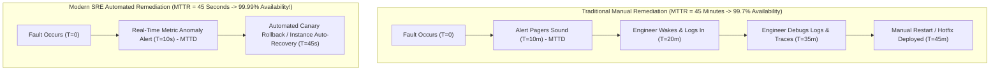

#### AWS Implementation
Implement automated canary rollback on Amazon EKS using Argo Rollouts to slash MTTR from 30 minutes to 30 seconds [Doc: Argo Rollouts Automated Rollback, checked 2026]:

```yaml
# argo-rollout-canary-rollback.yaml
apiVersion: argoproj.io/v1alpha1
kind: Rollout
metadata:
  name: order-api-rollout
  namespace: production
spec:
  replicas: 20
  strategy:
    canary:
      analysis:
        templates:
          - templateName: success-rate-analysis
        args:
          - name: service-name
            value: order-api-canary
      steps:
        - setWeight: 10 # Route 10% traffic to canary
        - pause: { duration: 60s }
---
apiVersion: argoproj.io/v1alpha1
kind: AnalysisTemplate
metadata:
  name: success-rate-analysis
  namespace: production
spec:
  metrics:
  - name: success-rate
    interval: 20s
    successCondition: result[0] >= 0.999
    failureLimit: 1 # If even ONE analysis fails, AUTOMATICALLY ABORT AND ROLLBACK INSTANTLY!
    provider:
      prometheus:
        address: http://prometheus-k8s.monitoring:9090
        query: |
          sum(rate(http_requests_total{status!~"5.*"}[1m])) / sum(rate(http_requests_total[1m]))
```

#### OCI Implementation
Configure automated metric alarms in OCI Monitoring with instant notification topic dispatches to minimize MTTD [Doc: OCI Monitoring Alarm Evaluation CLI, checked 2026]:

```bash
# Create an ultra-fast OCI Alarm evaluating error rates every 10 seconds to minimize MTTD
cat << 'EOF' > oci-mttd-alarm.json
{
  "compartmentId": "ocid1.compartment.oc1..aaaaaaaam7...",
  "displayName": "FastMTTD-Http5xxSpike",
  "metricCompartmentId": "ocid1.compartment.oc1..aaaaaaaam7...",
  "namespace": "oci_loadbalancer",
  "queryText": "Http5xx[10s].sum() > 5",
  "severity": "CRITICAL",
  "pendingDuration": "PT0M",
  "destinations": ["ocid1.onstopic.oc1.iad.aaaaaaaapagerduty..."],
  "isEnabled": true
}
EOF

oci monitoring alarm create --from-json file://oci-mttd-alarm.json
```

#### Common Trap
Spending engineering effort attempting to reach Five Nines ($99.999\%$) availability when your upstream dependencies (the public cloud provider's SLA, DNS providers, and telecom carriers) only guarantee Three Nines ($99.9\%$). If AWS or Oracle's Load Balancer or S3 service SLA guarantees $99.95\%$, an application running on top of that service **cannot mathematically guarantee $99.999\%$** unless it is deployed active-active across multiple completely independent cloud providers. Align availability targets with the realistic business cost of downtime.

#### Follow-up Question
How do you structure SRE Error Budget Policies to enforce a mandatory feature freeze when a development team burns through their monthly MTTR/downtime budget?

---

### Q417: Immutable Infrastructure & Anti-Drift: Golden Images vs In-Place Mutation

#### Question
Why does mutable infrastructure (SSH-based patching, manual configuration edits, and long-lived virtual machines) inevitably lead to configuration drift and catastrophic failure during disaster recovery, and how do Immutable Infrastructure patterns (Packer Golden AMIs, ephemeral VM recycles, and OCI Custom Images) guarantee deterministic resilience?

#### Short Answer
**Mutable Infrastructure** allows servers to be updated, patched, and modified in-place over months or years. Over time, manual hotfixes, kernel package differences, and forgotten cron jobs cause individual servers to diverge into unique "Snowflakes" (**Configuration Drift**); when a failure forces an autoscaler to launch a replacement node from an old base image, the replacement crashes because it lacks those uncommitted manual tweaks. **Immutable Infrastructure** enforces a strict invariant: **servers are never modified after launch**. If a security patch, configuration change, or code update is required, an automated CI/CD pipeline uses HashiCorp Packer to bake a brand-new **Golden Image** (AMI or OCI Custom Image); the fleet is replaced entirely via rolling recycles or blue/green replacement, and the old instances are terminated.

#### Deep Answer
Configuration drift is the silent killer of disaster recovery plans. In an audit of failed cloud failovers, over 60% fail because the DR region launches base images that lack packages manually installed on the primary servers months prior.

**1. The Mechanics of Configuration Drift (The Snowflake Problem)**:
- At Month 1: 10 servers are launched from Ubuntu 22.04 base.
- At Month 3: An SRE SSHs into Server 3 to install `libssl-dev` to fix a production bug.
- At Month 6: An automated security script updates OpenSSL on Servers 1–5, but times out on Servers 6–10.
- At Month 9: Each of the 10 servers has a subtly different kernel version, shared library set, and environment variable configuration.
- At Month 12: Server 3 crashes. The Auto Scaling Group launches a new node from the Month 1 base image. The new node **immediately crashes** because it lacks `libssl-dev`.

**2. The Immutable Infrastructure Paradigm**:
- **Bake, Don't Fry**:
  - All operating system dependencies, security hardening (CIS Benchmarks), application binaries, and monitoring daemons are pre-compiled and baked into an immutable image artifact (**Golden AMI** in AWS / **Custom Image** in OCI) using HashiCorp Packer [Doc: Immutable Infrastructure Patterns, checked 2026].
- **No In-Place SSH / Mutation**:
  - Production servers run with SSH ports disabled (`port 22 closed`).
  - Configuration changes are committed to Git $\rightarrow$ triggers Packer build $\rightarrow$ generates new AMI/Image $\rightarrow$ updates Launch Template / Instance Configuration $\rightarrow$ initiates rolling instance refresh.
- **Benefits for Resilience**:
  - *Instant Startup*: Nodes boot in 30 seconds because they don't need to run 15-minute `apt-get update` or Ansible playbooks during cloud-init.
  - *100% Deterministic*: What was tested in staging is bit-for-bit identical to what runs in production and what will boot in the DR region.

#### Architecture
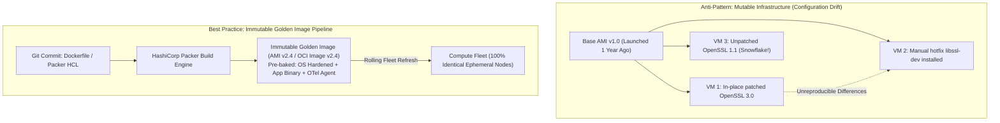

#### AWS Implementation
Automate Golden AMI generation using HashiCorp Packer and trigger an automated Auto Scaling Group Instance Refresh [Doc: AWS EC2 Instance Refresh CLI, checked 2026]:

```hcl
# aws-golden-ami.pkr.hcl
packer {
  required_plugins {
    amazon = {
      version = ">= 1.2.8"
      source  = "github.com/hashicorp/amazon"
    }
  }
}

source "amazon-ebs" "al2023" {
  ami_name      = "enterprise-golden-ami-{{timestamp}}"
  instance_type = "c6i.large"
  region        = "us-east-1"
  source_ami    = "ami-0123456789abcdef0" # Amazon Linux 2023 Base
  ssh_username  = "ec2-user"
}

build {
  sources = ["source.amazon-ebs.al2023"]

  provisioner "shell" {
    inline = [
      "sudo dnf update -y",
      "sudo dnf install -y amazon-cloudwatch-agent",
      "sudo systemctl enable amazon-cloudwatch-agent"
    ]
  }
}
```

```bash
# Trigger automated zero-downtime rolling replacement of the ASG fleet with new Golden AMI
aws autoscaling start-instance-refresh \
  --auto-scaling-group-name "prod-app-asg" \
  --strategy "Rolling" \
  --preferences '{"MinHealthyPercentage": 80, "InstanceWarmup": 180}'
```

#### OCI Implementation
Create an immutable OCI Custom Image and update an Instance Configuration for rolling fleet replacement [Doc: OCI Custom Images CLI, checked 2026]:

```bash
# Step 1: Capture an immutable Custom Image from a pre-configured instance
oci compute image create \
  --compartment-id ocid1.compartment.oc1..aaaaaaaam7... \
  --instance-id ocid1.instance.oc1.iad.aaaaaaaabuildinstance... \
  --display-name "Enterprise-Golden-Image-v2.4"

# Step 2: Create new Instance Configuration referencing the new Golden Image
cat << 'EOF' > oci-instance-config-v2.json
{
  "compartmentId": "ocid1.compartment.oc1..aaaaaaaam7...",
  "displayName": "prod-app-config-v2.4",
  "instanceDetails": {
    "instanceType": "compute",
    "launchDetails": {
      "compartmentId": "ocid1.compartment.oc1..aaaaaaaam7...",
      "shape": "VM.Standard.E5.Flex",
      "shapeConfig": { "ocpus": 4, "memoryInGBs": 32 },
      "sourceDetails": {
        "sourceType": "image",
        "imageId": "ocid1.image.oc1.iad.aaaaaaaagoldenimage24..."
      }
    }
  }
}
EOF

oci compute-management instance-configuration create --from-json file://oci-instance-config-v2.json
```

#### Common Trap
Using user-data scripts or cloud-init to download the latest external software packages (`yum install -y my-app-latest`) during autoscaling launches. If an upstream third-party repository (e.g., npm, PyPI, Ubuntu apt repos) experiences a network outage, or if a dependency author publishes a breaking change, newly launched autoscaling instances will fail cloud-init and fail to join the cluster. Under high traffic, your autoscaler attempts to scale out, but every new instance crashes during boot. All dependencies must be **baked directly into the immutable image**, with zero runtime internet download dependencies.

#### Follow-up Question
How do you structure automated CI/CD vulnerability scanning (e.g., AWS Inspector or Trivy) in Packer pipelines to automatically reject Golden AMI builds that contain Critical or High CVEs?

---

### Q418: Quorum Consensus & Distributed Protocols: Raft, Paxos & Split Votes

#### Question
How do distributed consensus algorithms (Raft and Multi-Paxos) guarantee consistency, leader election, and state machine replication across cloud clusters during network partitions, and how do randomized election timers and quorum majorities resolve "Split Vote" deadlocks?

#### Short Answer
Distributed consensus algorithms solve the problem of getting a group of unreliable nodes to agree on a single, shared state across an untrusted network. **Paxos** and **Raft** (the modern standard in Kubernetes etcd, Consul, and CockroachDB) enforce a fundamental rule: **any state mutation or leader election requires the agreement of a strict Majority Quorum**:
$$\text{Quorum } Q = \left\lfloor \frac{N}{2} \right\rfloor + 1$$
In Raft, nodes exist in three states: **Follower**, **Candidate**, or **Leader**. If followers stop receiving heartbeats from the leader within an **Election Timeout**, they become Candidates and vote for themselves. To prevent multiple candidates from splitting votes equally (e.g., two candidates each receiving 2 votes in a 4-node cluster, causing an infinite tie), Raft uses **Randomized Election Timeouts** (e.g., 150ms to 300ms): one candidate's timer will fire first, allowing it to collect majority votes and become the uncontested leader before other candidates wake up.

#### Deep Answer
Without consensus protocols, distributed clusters suffer from split-brain or data divergence when network links fail.

**1. The Three Roles of Raft Consensus**:
- **Leader**: Handles all client requests. Appends commands to its local log and replicates log entries to followers. Once a majority ($Q$) acknowledges, the entry is committed to the state machine, and the client receives confirmation.
- **Follower**: Passive. Responds to RPCs from leaders and candidates.
- **Candidate**: Used during leader elections.

**2. The Split-Vote Dilemma & Randomized Timeouts**:
- Suppose a 4-node cluster loses its leader:
  - If all 3 remaining nodes (Nodes A, B, C) use a fixed 200ms election timeout, they will all transition to Candidate status at the exact same millisecond.
  - Node A votes for Node A; Node B votes for Node B; Node C votes for Node C.
  - Each receives exactly 1 vote. Majority requires 3 votes ($N=4, Q=3$).
  - A tie occurs. The election fails.
  - If timeouts remain synchronized, they will tie again in an infinite loop.
- **The Solution (Randomized Election Timeouts)**:
  - Raft randomizes the election timeout per node (e.g., uniformly distributed between $150\text{ms}$ and $300\text{ms}$).
  - Node B's timer expires at $162\text{ms}$; Node A's expires at $245\text{ms}$.
  - Node B transitions to Candidate, requests votes from Node A and C, collects 3 votes, and becomes the established Leader before Node A's timer ever elapses [Doc: Raft Consensus Algorithm Specification, checked 2026].

**3. Surviving Network Partitions**:
- Consider a 5-node cluster spanning 3 Availability Zones (2 in AZ-a, 2 in AZ-b, 1 in AZ-c).
- AZ-a becomes partitioned from AZ-b and AZ-c:
  - Partition 1 (AZ-a): Contains 2 nodes. Cannot achieve quorum ($2 < 3$). Rejects all client writes!
  - Partition 2 (AZ-b + AZ-c): Contains 3 nodes. Holds majority quorum ($3 \ge 3$). Elects a leader and continues processing writes cleanly.
  - When the partition heals, the 2 nodes in AZ-a discover the higher Raft Term from Partition 2, truncate their uncommitted logs, and replicate the majority log state.

#### Architecture
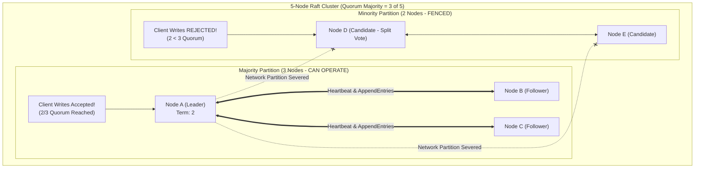

#### AWS Implementation
Deploy and verify an Amazon EKS etcd multi-AZ consensus topology and inspect Raft election metrics [Doc: Kubernetes etcd Metrics, checked 2026]:

```bash
# Query etcd Raft consensus metrics on Amazon EKS
kubectl exec -it etcd-ip-10-0-1-10.ec2.internal -n kube-system -- etcdctl \
  --endpoints=https://127.0.0.1:2379 \
  --cacert=/etc/kubernetes/pki/etcd/ca.crt \
  --cert=/etc/kubernetes/pki/etcd/server.crt \
  --key=/etc/kubernetes/pki/etcd/server.key \
  endpoint status --write-out=table

# Output verifies Raft leader, Raft index, and term synchronization across AZs:
# +------------------------+------------------+---------+---------+-----------+------------+
# |        ENDPOINT        |        ID        | VERSION | DB SIZE | IS LEADER | RAFT TERM  |
# +------------------------+------------------+---------+---------+-----------+------------+
# | https://10.0.1.10:2379 | 8e9e05c52164694d |  3.5.9  |   42 MB |      true |          4 |
# | https://10.0.2.20:2379 | 6d3f27891234abcd |  3.5.9  |   42 MB |     false |          4 |
# | https://10.0.3.30:2379 | a1b2c3d4e5f67890 |  3.5.9  |   42 MB |     false |          4 |
# +------------------------+------------------+---------+---------+-----------+------------+
```

#### OCI Implementation
Configure Raft-based consensus clustering for high availability in OCI using OCI Compute across three Fault Domains [Doc: OCI Fault Domain Clustering, checked 2026]:

```bash
# Query Raft consensus peer status on a distributed cluster deployed across Fault Domains
curl -s http://10.0.1.5:2379/v3/cluster/member/list | jq .

# Verify that cluster members are pinned across Fault Domains 1, 2, and 3
oci compute instance list \
  --compartment-id ocid1.compartment.oc1..aaaaaaaam7... \
  --display-name "raft-node-*" \
  --query 'data[].[displayName, faultDomain, lifecycleState]'
```

#### Common Trap
Deploying an even number of consensus nodes (such as 2 or 4 nodes) under the mistaken belief that "more nodes always equal higher availability." Adding a 4th node to a 3-node cluster **actually reduces availability**:
- A 3-node cluster requires 2 nodes for quorum ($Q=2$). It can survive **1 failure**.
- A 4-node cluster requires 3 nodes for quorum ($Q=3$). It can still only survive **1 failure**!
- But the 4-node cluster has more hardware that can break, increasing the probability of downtime. Consensus clusters **must always consist of an odd number of nodes ($3, 5, 7$)**.

#### Follow-up Question
Why does Raft enforce that a newly elected leader can never commit log entries from a previous term directly by counting replicas, and must instead commit an entry from its current term?

---

### Q419: Automated Chaos in CI/CD Pipelines: Continuous Resilience Verification

#### Question
How do platform engineering teams shift chaos engineering "left" by integrating automated fault injection experiments directly into CI/CD delivery pipelines, and what are the verification gates required to fail a deployment before fragile code reaches production?

#### Short Answer
Shifting chaos left integrates automated resilience testing into continuous integration and staging deployment pipelines (CI/CD) before code enters production. Rather than waiting for live Game Days, the CI/CD pipeline (GitHub Actions, GitLab CI, OCI DevOps) automatically provisions a sandboxed preview environment, runs synthetic end-to-end traffic, and triggers **Automated Chaos Experiments** (killing pods, injecting 300ms database latency, terminating primary cache nodes). If the application fails to degrade gracefully (e.g., throwing unhandled 500 errors, leaking memory, or taking longer than 15 seconds to recover), the **Quality Gate** fails, blocking the pull request or rolling back the deployment artifact before real users are exposed.

#### Deep Answer
Traditional unit and integration tests only verify the "happy path" or anticipated error returns (`catch (Exception e)`). They completely fail to test how software behaves under non-deterministic distributed failures: partial network partitions, half-open TCP connections, thread pool saturation, or disk write stalls.

**1. The Continuous Chaos Pipeline Architecture**:
1. **Stage 1: Build & Ephemeral Deploy**:
   - Developer opens Pull Request.
   - Pipeline builds container image, deploys an ephemeral preview environment on Kubernetes (EKS / OKE).
2. **Stage 2: Synthetic Workload Generation**:
   - A load-testing tool (k6, Locust, Gatling) executes continuous background transactions matching realistic production traffic patterns (e.g., 500 requests/second).
   - Verifies baseline steady-state metrics ($p99 < 100\text{ms}$, error rate $= 0\%$).
3. **Stage 3: Automated Chaos Fault Injection**:
   - Pipeline invokes Chaos Mesh, AWS FIS, or Toxiproxy via API:
     - Experiment 1: Inject $200\text{ms}$ latency on the database connection pool.
     - Experiment 2: Kill the Redis cache container.
     - Experiment 3: Sever connectivity to the third-party payment mock.
4. **Stage 4: Automated Hypothesis Assertion (The Resilience Gate)**:
   - The pipeline queries Prometheus / CloudWatch metrics:
     - Did the circuit breaker open within 500ms?
     - Did the fallback cache serve static recommendations?
     - Did error rate remain $< 0.1\%$?
   - If assertions pass $\rightarrow$ PR approved.
   - If unhandled HTTP 500 errors spike $>1\%$ $\rightarrow$ **Pipeline Fails**, blocking production deployment [Doc: Continuous Resilience Testing Architecture, checked 2026].

#### Architecture
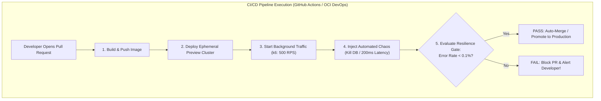

#### AWS Implementation
Automate resilience verification in a GitHub Actions CI/CD pipeline using AWS Fault Injection Service (FIS) CLI and k6 [Doc: AWS FIS CI/CD Integration, checked 2026]:

```yaml
# .github/workflows/resilience-verification.yml
name: Continuous Resilience Testing

on:
  pull_request:
    branches: [ main ]

jobs:
  chaos-test:
    runs-on: ubuntu-latest
    steps:
      - uses: actions/checkout@v4

      - name: Deploy Ephemeral Test App to EKS
        run: |
          kubectl apply -k k8s/overlays/preview-pr-${{ github.event.number }}
          kubectl wait --for=condition=ready pod -l app=order-service --timeout=120s

      - name: Start Background Traffic Generator (k6)
        run: |
          docker run -d --network="host" loadimpact/k6 run - < tests/k6-load-script.js

      - name: Trigger AWS FIS Chaos Experiment
        run: |
          EXPERIMENT_ID=$(aws fis start-experiment \
            --experiment-template-id "EXT-1111222233334444" \
            --query 'experiment.id' --output text)
          echo "Started FIS Experiment: $EXPERIMENT_ID"
          
          # Wait for experiment to complete
          aws fis wait experiment-completed --id "$EXPERIMENT_ID"

      - name: Evaluate Resilience Quality Gate
        run: |
          # Query Prometheus for error rate during the chaos injection window
          ERROR_RATE=$(curl -s "http://prometheus.internal:9090/api/v1/query?query=sum(rate(http_requests_total{status=~'5..'}[2m]))/sum(rate(http_requests_total[2m]))" | jq -r '.data.result[0].value[1]')
          echo "Observed Error Rate during Chaos: $ERROR_RATE"
          
          # Fail pipeline if error rate exceeded 0.01 (1%)
          awk -v err="$ERROR_RATE" 'BEGIN { if (err > 0.01) exit 1; else exit 0 }'
```

#### OCI Implementation
Implement automated chaos testing in an OCI DevOps Build Pipeline using OCI CLI [Doc: OCI DevOps Build Pipelines, checked 2026]:

```yaml
# build_spec.yaml (OCI DevOps Pipeline)
version: 0.1
component: build
timeoutInSeconds: 1200
steps:
  - type: Command
    name: "Deploy to Staging OKE Cluster"
    command: |
      oci ce cluster create-kubeconfig --cluster-id ocid1.cluster.oc1.iad.aaaaaaaastaging... --file ~/.kube/config
      kubectl apply -f staging-deployment.yaml

  - type: Command
    name: "Inject Network Chaos via Chaos Mesh"
    command: |
      kubectl apply -f chaos-mesh-network-delay.yaml
      sleep 120

  - type: Command
    name: "Verify Resilience Gate via OCI Monitoring"
    command: |
      ERROR_COUNT=$(oci monitoring metric-data summarize-metrics-data \
        --compartment-id ocid1.compartment.oc1..aaaaaaaam7... \
        --namespace "oci_loadbalancer" \
        --query-text "Http5xx[2m].sum()" --query 'data[0]."aggregated-datapoints"[0].value')
      
      if [ "$ERROR_COUNT" -gt "5" ]; then
        echo "Resilience Gate FAILED! Service dropped requests during network delay."
        exit 1
      fi
      echo "Resilience Gate PASSED!"
```

#### Common Trap
Running chaos experiments in CI/CD without background traffic generation. If a pipeline injects a pod kill or network latency while 0 requests are traversing the system, the error rate is mathematically zero ($0/0$). The pipeline passes with flying colors, giving false confidence. Chaos experiments in pipelines **must always be accompanied by active synthetic load generators** (k6 / Locust) measuring latency and error distributions throughout the entire duration of the fault.

#### Follow-up Question
How do you structure ephemeral test databases in CI/CD chaos pipelines to ensure that injected database connection stalls or forced failovers do not leak orphaned transactional locks into shared staging databases?

---

### Q420: Network Partition Tolerance: BGP Flapping & Asymmetric Routing

#### Question
How do distributed cloud network fabrics detect and mitigate "Gray Network Failures" (such as BGP route flapping, asymmetric packet loss, and MTU blackholes), and how do Bidirectional Forwarding Detection (BFD) and automated route withdrawal prevent silent outages?

#### Short Answer
Standard network monitoring relies on link-state reachability (checking whether a physical Ethernet port has "link light" or whether periodic ICMP pings succeed). However, catastrophic cloud outages are frequently caused by **Gray Network Failures**: physical links remain electrically "up", but drop 5% of packets, corrupt TCP checksums, route outbound packets over one path while inbound packets route over another (**Asymmetric Routing**), or experience **BGP Route Flapping** (routes rapidly appearing and disappearing due to unstable fiber lines). Standard routing protocols like BGP take $90\text{--}180\text{ seconds}$ to detect a dead link using standard keepalives ($30\text{s}$ interval $\times 3$). To achieve sub-second fault detection, cloud platforms enforce **Bidirectional Forwarding Detection (BFD)**: hardware-offloaded microsecond keepalive probes ($300\text{ms}$ detection time) that trigger instant BGP route withdrawal before silent packet drop cascades disrupt application TCP sessions.

#### Deep Answer
In hyper-scale cloud networks (AWS Direct Connect, OCI FastConnect, transit gateways), networks do not fail cleanly into binary "working" or "dead" states. They fail partially.

**1. Types of Gray Network Failures**:
- **BGP Route Flapping**:
  - A flapping physical interface causes BGP sessions to oscillate between `Established` and `Idle` every 10 seconds.
  - Border routers repeatedly recalculate routing tables, generating massive CPU spikes across cloud gateways and dropping transit packets.
  - *Mitigation*: **BGP Route Flap Damping (RFD)**: penalizes flapping routes, suppressing them for a penalty duration (e.g., 15–30 minutes) until physical stability is verified.
- **Asymmetric Routing & Stateful Firewalls**:
  - Outbound traffic from AWS VPC routes over Direct Connect Link 1.
  - Return traffic from on-premises routes back over Direct Connect Link 2.
  - *Failure Mode*: Stateful inspection firewalls (AWS Network Firewall, Palo Alto, OCI Network Firewall) track TCP 3-way handshakes. Because Link 2 never saw the initial `SYN` packet (which went over Link 1), the firewall drops the return `SYN-ACK` packet as an invalid out-of-state packet.
- **MTU Blackholes (Path MTU Discovery Failure)**:
  - Client sends large packets with `DF` (Don't Fragment) bit set.
  - A router in the path with a smaller MTU drops the packet and sends an `ICMP Fragmentation Needed` packet back.
  - If a security group or firewall blocks ICMP Type 3 Code 4, the sender never learns of the MTU limit. TCP handshakes succeed (small packets), but large HTTP payloads hang indefinitely.

**2. Bidirectional Forwarding Detection (BFD) Mechanics**:
- Operates at Layer 2/3 independent of routing protocols.
- Transmits micro-packets at hardware line rate (e.g., every $300\text{ms}$).
- If 3 consecutive packets are missed ($900\text{ms}$):
  - BFD immediately informs BGP: *"Path is dead!"*
  - BGP tears down the neighbor relationship in $<1\text{ second}$ rather than waiting for the standard 90-second BGP hold timer, shifting traffic to redundant backup circuits instantly [Doc: BFD Cloud Networking Specification, checked 2026].

#### Architecture
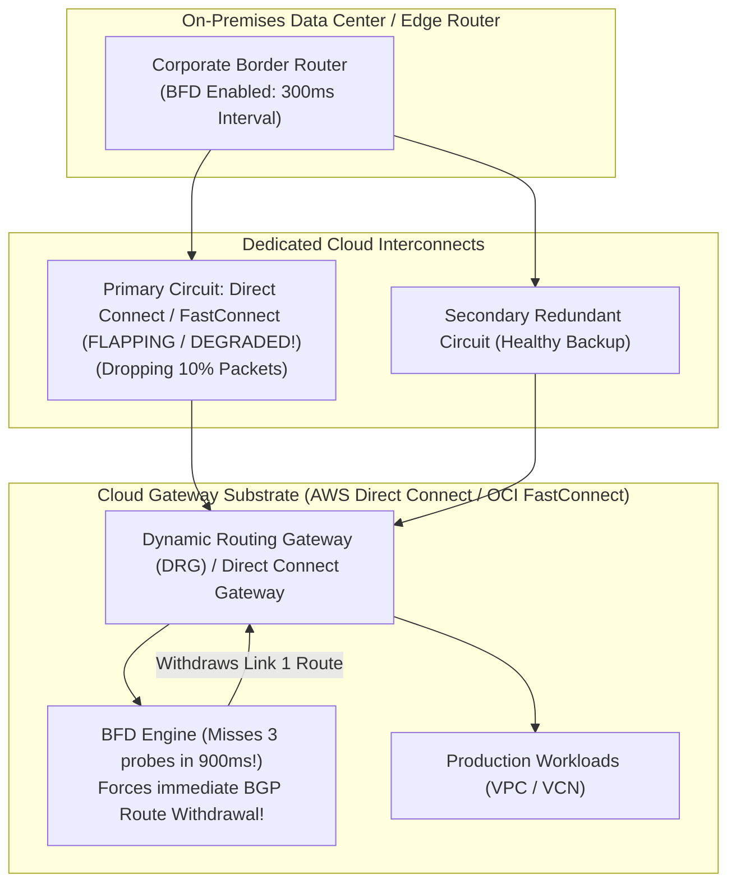

#### AWS Implementation
Enable Bidirectional Forwarding Detection (BFD) on an AWS Direct Connect Virtual Interface using AWS CLI [Doc: AWS Direct Connect BFD CLI, checked 2026]:

```bash
# Update Direct Connect Virtual Interface to enable BFD with fast detection timers
aws directconnect update-virtual-interface-attributes \
  --virtual-interface-id "dxvif-12345678" \
  --enable-site-link \
  --mtu 1500

# Verify BFD status on Direct Connect Private Virtual Interface
aws directconnect describe-virtual-interfaces \
  --virtual-interface-id "dxvif-12345678" \
  --query 'virtualInterfaces[0].[virtualInterfaceState, bfdStatus]'
```

#### OCI Implementation
Enable BFD on an OCI FastConnect Virtual Circuit using OCI CLI [Doc: OCI FastConnect BFD Configuration, checked 2026]:

```bash
# Create an OCI FastConnect Virtual Circuit with BFD enabled
cat << 'EOF' > oci-fastconnect-bfd.json
{
  "compartmentId": "ocid1.compartment.oc1..aaaaaaaam7...",
  "displayName": "FastConnect-BFD-Production",
  "type": "PRIVATE",
  "gatewayId": "ocid1.drg.oc1.iad.aaaaaaaadrg...",
  "bandwidthShapeName": "10 Gbps",
  "customerBgpPeeringIp": "10.0.0.1/30",
  "oracleBgpPeeringIp": "10.0.0.2/30",
  "customerAsn": 65000,
  "isBfdEnabled": true
}
EOF

oci network virtual-circuit create --from-json file://oci-fastconnect-bfd.json
```

#### Common Trap
Enabling BFD on one side of a BGP peering connection (e.g., on your on-premises edge router) without enabling BFD on the cloud provider gateway (AWS Direct Connect or OCI FastConnect). BFD requires bidirectional negotiation: if one side does not negotiate BFD control packets, the session fails to establish, and the network defaults back to the sluggish 90-second standard BGP hold timer, leaving your architecture vulnerable to multi-minute outages during circuit fiber cuts.

#### Follow-up Question
How do you architect multi-path Equal-Cost Multi-Path (ECMP) routing across dual Direct Connect or FastConnect links to ensure symmetric return flows and prevent stateful firewall packet drops?

---

### Q421: Storage Fault Tolerance: Erasure Coding vs Multi-Way Replication

#### Question
How do cloud distributed storage architectures mathematically guarantee $99.999999999\%$ (11 Nines) of data durability against simultaneous hard drive, server rack, and data center facility collapses, and what are the trade-offs between Multi-Way Mirroring and Reed-Solomon Erasure Coding?

#### Short Answer
Cloud storage engines achieve astronomical durability by eliminating single points of failure. **Multi-Way Replication (Triple Mirroring)** stores 3 full, independent physical copies of every data block on distinct servers across separate failure domains; it provides ultra-low write latency and minimal CPU overhead (ideal for block storage like AWS EBS and OCI Block Volumes), but carries a heavy **$300\%$ storage overhead** (storing 1TB costs 3TB of raw disk). **Reed-Solomon Erasure Coding ($N+M$)** breaks data into $N$ data chunks and computes $M$ mathematical parity chunks; it can survive the loss of *any* $M$ chunks simultaneously while requiring only $\approx 1.3\times\text{--}1.5\times$ storage overhead (a $50\%$ cost reduction), making it the universal standard for object storage (Amazon S3 and OCI Object Storage).

#### Deep Answer
Hard drives (HDDs) have an Annualized Failure Rate (AFR) of $1\text{--}4\%$; Solid State Drives (SSDs) suffer unrecoverable read errors (UREs). In a storage facility with 500,000 drives, multiple drives fail every single hour.

**1. Multi-Way Mirroring (EBS & Block Storage)**:
- **Mechanics**: Every 4KB write is written synchronously to 3 separate NVMe SSDs in different server racks.
- **Latency**: $L_{\text{write}} = \max(L_1, L_2, L_3)$. Extremely fast ($<1\text{ms}$) because there are no complex mathematical matrix calculations.
- **Durability**: Survives 2 concurrent disk failures.
- **Storage Amplification Factor**:
  $$\text{Storage Overhead} = 3.0\times \quad (200\% \text{ raw disk overhead})$$
- Perfect for low-latency random I/O transactional databases (EBS gp3/io2, OCI Block Volumes).

**2. Reed-Solomon Erasure Coding (S3 & Object Storage)**:
- **Mathematical Foundations (Vandermonde Matrices / Galois Fields $\text{GF}(2^8)$)**:
  - An object is divided into $K$ data chunks and generates $M$ parity chunks, totaling $N = K + M$ fragments.
  - Example: $8+4$ Erasure Coding ($K=8, M=4, N=12$):
    - 8 data chunks + 4 parity chunks.
    - Each of the 12 chunks is placed in an independent server rack or Availability Zone.
    - **Any 8 chunks out of 12 are mathematically sufficient to reconstruct the entire original object!**
    - The system can lose **any 4 arbitrary disks or racks simultaneously** without losing a single byte of data.
- **Storage Amplification Factor**:
  $$\text{Overhead} = \frac{K + M}{K} = \frac{8 + 4}{8} = 1.5\times \quad (50\% \text{ storage overhead})$$
- Compared to $3.0\times$ mirroring, erasure coding slashes petabyte-scale storage costs by half while achieving **11 Nines of Durability** ($99.999999999\%$) [Doc: AWS S3 Durability Architecture, checked 2026].

| Dimension | Multi-Way Replication (3-Way Mirror) | Reed-Solomon Erasure Coding ($8+4$) |
| :--- | :--- | :--- |
| **Typical Cloud Use Case**| AWS EBS, OCI Block Volume | Amazon S3, OCI Object Storage |
| **Storage Overhead** | $3.0\times$ ($200\%$ extra raw disk) | $1.5\times$ ($50\%$ extra raw disk) |
| **Failure Tolerance** | Survives 2 concurrent failures | Survives 4 concurrent failures |
| **CPU / Compute Impact** | Zero (Simple memory copy) | High (Matrix polynomial calculations) |
| **Random Write Latency** | Sub-millisecond ($<1\text{ms}$) | Higher (Requires recomputing parity chunks) |

#### Architecture
```mermaid
graph TD
    subgraph "Multi-Way Mirroring (3-Way Copy - 300% Storage Overhead)"
        DATA_IN1["Original 1GB File"]
        M1["Copy 1 (Rack A)"]
        M2["Copy 2 (Rack B)"]
        M3["Copy 3 (Rack C)"]
        DATA_IN1 --> M1
        DATA_IN1 --> M2
        DATA_IN1 --> M3
    end

    subgraph "Reed-Solomon Erasure Coding (8+4 Scheme - 150% Overhead)"
        DATA_IN2["Original 1GB File"]
        SPLIT["Matrix Split: 8 Data Chunks (D1..D8) + 4 Parity Chunks (P1..P4)"]
        
        RACK1["Rack 1: [D1]"]
        RACK2["Rack 2: [D2]"]
        RACK3["Rack 3: [D3]"]
        RACK4["Rack 4: [D4] - DESTROYED!"]
        RACK5["Rack 5: [D5] - DESTROYED!"]
        RACK6["Rack 6: [P1] - DESTROYED!"]
        RACK7["Rack 7: [P2] - DESTROYED!"]
        RACK8["Remaining 8 Chunks: Reconstruct 100% of Data Mathematically!"]
        
        DATA_IN2 --> SPLIT
        SPLIT --> RACK1
        SPLIT --> RACK2
        SPLIT --> RACK3
        SPLIT --> RACK4
        SPLIT --> RACK5
        SPLIT --> RACK6
        SPLIT --> RACK7
        SPLIT --> RACK8
    end
```

#### AWS Implementation
Configure Amazon S3 Lifecycle policies to transition objects to cost-optimized Erasure Coded storage classes [Doc: AWS S3 Storage Classes, checked 2026]:

```json
// s3-storage-tiering.json
{
  "Rules": [
    {
      "ID": "MoveToGlacierInstantRetrieval",
      "Status": "Enabled",
      "Filter": { "Prefix": "archives/" },
      "Transitions": [
        {
          "Days": 30,
          "StorageClass": "GLACIER_IR"
        }
      ]
    }
  ]
}
```

```bash
# Apply lifecycle configuration to S3 bucket to utilize S3's deep erasure-coded Glacier tier
aws s3api put-bucket-lifecycle-configuration \
  --bucket "enterprise-compliance-data" \
  --lifecycle-configuration file://s3-storage-tiering.json
```

#### OCI Implementation
Create an OCI Object Storage bucket with multi-region replication and object retention rules [Doc: OCI Object Storage Durability, checked 2026]:

```bash
# Create an OCI Object Storage bucket backed by OCI's erasure-coded storage substrate
oci os bucket create \
  --compartment-id ocid1.compartment.oc1..aaaaaaaam7... \
  --name "enterprise-high-durability-lake" \
  --storage-tier "Standard" \
  --versioning "Enabled"
```

#### Common Trap
Using software-defined Erasure Coding across network mounts for low-latency relational database storage (e.g., placing PostgreSQL or Oracle DB datafiles directly on an erasure-coded object store or Ceph cluster). Because every random 8KB page write requires reading the entire stripe, computing new parity chunks, and rewriting multiple disks (**Write Amplification & Read-Modify-Write penalties**), database write latency jumps from $1\text{ms}$ to $50\text{ms}$, collapsing database throughput by 90%. Databases require multi-way mirrored block storage (EBS / OCI Block Volumes); erasure coding is architecturally intended for append-only object storage.

#### Follow-up Question
How does distributed background scrubbing (continuous cryptographic hash validation) detect and heal "Silent Data Corruption" (bit rot) before degraded sectors cause unrecoverable read errors?

---

### Q422: Resilient DNS Engineering: Dual-Provider Anycast & DNSSEC Management

#### Question
Why is relying on a single cloud DNS provider a fatal Single Point of Failure (SPOF) for global enterprises, and how do multi-provider Anycast DNS architectures (pairing Amazon Route 53 with NS1 or Cloudflare) synchronize zone records and DNSSEC cryptographic keys?

#### Short Answer
DNS is the absolute root of internet connectivity: if an enterprise's DNS service fails, every application endpoint, API, CDN, and email gateway becomes instantly unreachable globally, even if underlying cloud compute and database infrastructure are 100% healthy. Major historical outages (e.g., the Dyn DNS DDoS attack) proved that relying on a single DNS provider is an unacceptable catastrophic risk. **Dual-Provider Resilient DNS** configures a public domain with Name Server (NS) delegations distributed equally between two completely independent Anycast DNS networks (e.g., 2 nameservers on Amazon Route 53 and 2 nameservers on NS1 or Cloudflare). Zone files are continuously synchronized via **Infrastructure as Code (Terraform)** or **AXFR (DNS Zone Transfers)**, while **Multi-Signer DNSSEC** ensures cryptographic trust chains remain valid across both providers.

#### Deep Answer
When an enterprise registers `enterprise.com`, the Top-Level Domain (TLD) registry records the authoritative Name Servers (NS). If all 4 NS records point to `awsdns-*.com`, any regional or global control plane failure in Route 53 takes down 100% of company operations.

**1. The Dual-Provider Architecture**:
- At the Domain Registrar / TLD:
  ```text
  enterprise.com.  NS  ns-111.awsdns-11.com.   (AWS Route 53)
  enterprise.com.  NS  ns-222.awsdns-22.net.   (AWS Route 53)
  enterprise.com.  NS  dns1.p01.nsone.net.     (NS1 / IBM)
  enterprise.com.  NS  dns2.p01.nsone.net.     (NS1 / IBM)
  ```
- Resolvers querying the domain use round-robin and latency measurement to pick a nameserver.
- If Route 53 is hit with a massive 500 Gbps DDoS attack or suffers an outage, recursive resolvers automatically fail over to NS1 within milliseconds with zero manual intervention.

**2. The Synchronization Challenge**:
- **Zone Record Synchronization**:
  - DNS records cannot be managed manually in two consoles.
  - SREs define DNS records in a central Git repository using Terraform or OctoDNS.
  - CI/CD pipelines push identical record changes to Route 53 and NS1 simultaneously.
- **The Multi-Signer DNSSEC Challenge (RFC 8901)**:
  - DNSSEC signs DNS records with a private Key Signing Key (KSK) and Zone Signing Key (ZSK).
  - If Route 53 and Cloudflare use different private keys to sign the zone, recursive resolvers validating DNSSEC will detect signature mismatches and block 100% of client traffic with `SERVFAIL`!
  - **RFC 8901 Model 2 (Multi-Signer)**:
    - Route 53 and NS1 exchange their public ZSK keys.
    - Each provider signs the zone with its own key *and* imports the other provider's public key.
    - Both KSKs are published as `DS` records in the parent TLD registry, ensuring cryptographic validation succeeds regardless of which nameserver answers [Doc: RFC 8901 Multi-Signer DNSSEC, checked 2026].

#### Architecture
```mermaid
graph TD
    subgraph "Root Domain Registrar (TLD: .com)"
        TLD["Delegation: 2x Route 53 NS + 2x NS1 / Cloudflare NS"]
    end

    subgraph "Dual Independent Anycast DNS Networks"
        R53["Amazon Route 53 Anycast Network\n(ns-111.awsdns-11.com) - ATTACKED / DOWN!"]
        NS1["NS1 / Cloudflare Anycast Network\n(dns1.p01.nsone.net) - HEALTHY!"]
        TLD --> R53
        TLD --> NS1
    end

    subgraph "Global Client Resolvers"
        RESOLVER["Recursive DNS Resolver (Google 8.8.8.8 / Cloudflare 1.1.1.1)"]
        RESOLVER -.->|Query Route 53 (Timeout)| R53
        RESOLVER -->|Instant Failover to NS1| NS1
        RESOLVER --> USER["End-User Browser (Zero Interruption!)"]
    end

    subgraph "Synchronization Pipeline"
        GIT["Git Single Source of Truth (OctoDNS / Terraform)"]
        GIT ===|Sync Records| R53
        GIT ===|Sync Records| NS1
    end
```

#### AWS Implementation
Configure Route 53 public hosted zone with external nameserver delegations and export zone records via AWS CLI [Doc: AWS Route 53 Hosted Zone CLI, checked 2026]:

```bash
# Query assigned Route 53 authoritative nameservers
aws route53 get-hosted-zone \
  --id "/hostedzone/Z1PA6795UKMFR9" \
  --query 'DelegationSet.NameServers'

# Test DNS query resolution directly against specific Route 53 nameserver
dig +dnssec @ns-111.awsdns-11.com api.enterprise.com
```

#### OCI Implementation
Configure an OCI Public DNS Zone and import synchronized zone records using OCI CLI [Doc: OCI DNS Service CLI, checked 2026]:

```bash
# Create a Public DNS Zone in OCI DNS Service to act as secondary Anycast DNS provider
cat << 'EOF' > oci-dns-zone.json
{
  "compartmentId": "ocid1.compartment.oc1..aaaaaaaam7...",
  "name": "enterprise.com",
  "zoneType": "PRIMARY"
}
EOF

oci dns zone create --from-json file://oci-dns-zone.json

# Retrieve OCI DNS authoritative nameservers to add to domain registrar
oci dns zone get \
  --zone-name-or-id "enterprise.com" \
  --query 'data."nameservers"[].hostname'
```

#### Common Trap
Enabling DNSSEC on a dual-provider DNS configuration without implementing RFC 8901 Multi-Signer key synchronization. If both DNS providers sign the zone using their own independent private keys without importing each other's ZSKs into the parent DS record set, DNSSEC-validating resolvers (such as Google 8.8.8.8 and Quad9) will treat 50% of DNS responses as forged/spoofed, returning `SERVFAIL` to users and creating an intermittent global outage that affects half your customers.

#### Follow-up Question
How does OctoDNS automate bidirectional zone synchronization and conflict resolution across heterogeneous DNS providers with proprietary routing features (such as Route 53 Latency routing vs NS1 Filter Chain)?

---

### Q423: Graceful Shutdown & Pod Disruption Budgets: Zero-Downtime Draining

#### Question
How do cloud Kubernetes platforms guarantee zero dropped HTTP connections during autoscaling events, rolling deployments, and worker node upgrades, and how do Pod Disruption Budgets (PDBs), preStop lifecycle hooks, and load balancer deregistration delays prevent in-flight request truncation?

#### Short Answer
When a Kubernetes worker node is drained or a pod is terminated during a rolling update, Kubernetes does not wait for active requests to finish by default: it removes the pod from endpoints and simultaneously sends `SIGTERM` to the container. If the application terminates immediately, active in-flight HTTP requests and database transactions are violently truncated, returning `TCP Connection Reset by Peer` or HTTP 502 to users. Zero-downtime draining requires a synchronized 4-stage teardown: (1) **Pod Disruption Budgets (PDBs)** guarantee that a minimum number of replicas remain available during voluntary disruptions; (2) **`preStop` Lifecycle Hooks** inject an intentional sleep (e.g., `sleep 15`) to allow iptables and load balancer target groups to remove the pod from routing tables; (3) **Graceful Signal Handling**: Application catches `SIGTERM`, stops accepting new sockets, and finishes active requests; (4) **Load Balancer Deregistration Delay**: Ensures edge proxies wait for in-flight TCP streams to drain cleanly before severing connections.

#### Deep Answer
The termination of a pod is an asynchronous distributed race condition:
- Thread 1: The Kubernetes Endpoints controller updates the `Endpoints` object, informing the cloud load balancer (ALB / OCI LB) and kube-proxy to stop routing traffic to the pod IP.
- Thread 2: The Kubelet sends `SIGTERM` to the pod container.
- **The Fatal Race**: Updating cloud load balancers and distributing iptables rules takes **5 to 15 seconds**. If the container receives `SIGTERM` and shuts down in 1 second, clients will continue routing HTTP requests to the dead pod's IP address for the next 10 seconds, generating thousands of HTTP 502/504 errors.

**1. The Mechanics of Zero-Downtime Pod Termination**:
1. **The `preStop` Sleep Invariant**:
   ```yaml
   lifecycle:
     preStop:
       exec:
         command: ["/bin/sh", "-c", "sleep 15"]
   ```
   - When Kubernetes decides to kill the pod, it executes the `preStop` hook *before* sending `SIGTERM`.
   - The container sleeps for 15 seconds while continuing to serve active traffic.
   - During these 15 seconds, the AWS Load Balancer Controller or OCI Ingress Controller removes the pod IP from target groups and flushes iptables rules.
2. **SIGTERM Signal Handling**:
   - At second 15, Kubelet sends `SIGTERM`.
   - The application web server stops listening on ports, finishes all inflight HTTP requests, and closes database connections cleanly.
3. **`terminationGracePeriodSeconds`**:
   - Must be set higher than the `preStop` sleep plus longest expected transaction duration (e.g., `sleep 15 + 45s drain = 60s`).
4. **Pod Disruption Budgets (PDB)**:
   - Prevents node drain operations (`kubectl drain` or Karpenter node consolidation) from evicting too many pods simultaneously:
     `minAvailable: 80%` or `maxUnavailable: 1`.

#### Architecture
```mermaid
sequenceDiagram
    autonumber
    participant K8s as Kubernetes API / Kubelet
    participant ALB as Cloud Load Balancer (ALB / OCI LB)
    participant PreStop as Pod preStop Hook
    participant App as Application Process (Node/Java/Go)
    participant Client as External Inflight Client

    K8s->>ALB: Remove Pod IP from Target Group (Deregistering)
    K8s->>PreStop: Execute preStop hook (sleep 15s)
    Client->>App: Inflight HTTP Request in Progress
    Note over PreStop,App: 15 Seconds Elapse: ALB Flushes Routing Tables
    ALB->>ALB: Zero new requests routed to this pod
    K8s->>App: Sends SIGTERM
    App->>App: Stop listening on port 8080
    App->>Client: Finishes Inflight HTTP Response (200 OK!)
    App->>K8s: Process exits cleanly (Exit Code 0)
    Note over K8s: Zero Dropped Connections!
```

#### AWS Implementation
Configure a Kubernetes Deployment with a `preStop` hook, generous grace period, and a Pod Disruption Budget on Amazon EKS [Doc: AWS EKS Graceful Draining Best Practices, checked 2026]:

```yaml
# zero-downtime-deployment.yaml
apiVersion: apps/v1
kind: Deployment
metadata:
  name: order-service
  namespace: production
spec:
  replicas: 10
  template:
    spec:
      terminationGracePeriodSeconds: 60 # Total allowed drain window
      containers:
      - name: app
        image: 123456789012.dkr.ecr.us-east-1.amazonaws.com/order-service:v2.1
        lifecycle:
          preStop:
            exec:
              # Sleep 15s to allow AWS ALB target group deregistration to propagate
              command: ["/bin/sh", "-c", "sleep 15"]
---
apiVersion: policy/v1
kind: PodDisruptionBudget
metadata:
  name: order-service-pdb
  namespace: production
spec:
  minAvailable: "80%" # Guarantees at least 8 of 10 pods are always serving
  selector:
    matchLabels:
      app: order-service
```

#### OCI Implementation
Configure Load Balancer deregistration delay and Pod Disruption Budgets on Oracle Container Engine for Kubernetes (OKE) [Doc: OCI OKE Ingress Connection Draining, checked 2026]:

```yaml
# oci-ingress-drain.yaml
apiVersion: networking.k8s.io/v1
kind: Ingress
metadata:
  name: enterprise-ingress
  namespace: production
  annotations:
    # Set Load Balancer backend connection draining timeout to 30 seconds
    oci.oraclecloud.com/load-balancer-type: "flexible"
    oci.oraclecloud.com/backend-set-drain-timeout: "30"
spec:
  rules:
  - http:
      paths:
      - path: /orders
        pathType: Prefix
        backend:
          service:
            name: order-service
            port:
              number: 8080
```

#### Common Trap
Using container base images where the application process does not run as PID 1 (e.g., starting a Java or Node application via an intermediate shell script `CMD /start.sh`). In Linux, shell scripts do not forward OS signals (`SIGTERM`) to child processes by default. When Kubelet sends `SIGTERM`, the shell script swallows the signal; the Java application never knows it is being terminated, continues accepting requests, and is violently killed 30 seconds later by `SIGKILL`, abruptly severing active client connections. Always use `exec` in shell entrypoints (`exec java -jar app.jar`) or use init systems like `tini` to ensure signals reach the application process.

#### Follow-up Question
How does Kubernetes endpoint slicing (`EndpointSlices`) optimize iptables and IPVS rule propagation latency compared to legacy Endpoints when scaling clusters beyond 1,000 pods?

---

### Q424: Incident Post-Mortems & Blameless Root Cause Analysis (RCA)

#### Question
How do high-performing Site Reliability Engineering organizations conduct Blameless Post-Mortems following high-severity production outages, what are the structural components of an enterprise Root Cause Analysis (RCA) document, and why must post-mortems avoid human blame?

#### Short Answer
A **Blameless Post-Mortem** assumes that humans in an organization act with good intentions based on the information available to them at the time; blaming individuals ("engineer made a typo") fails to fix underlying systemic vulnerabilities. Instead of seeking scapegoats, a blameless post-mortem investigates **systemic contributing factors**: why did the CI/CD pipeline permit the typo to reach production? Why did monitoring take 20 minutes to detect it? Why did the rollback script fail? A comprehensive enterprise Root Cause Analysis (RCA) document consists of 6 mandatory sections: (1) **Executive Summary**; (2) **Customer Impact (Quantified Downtime & Data Loss)**; (3) **Second-by-Second Chronological Timeline**; (4) **Five Whys / Contributing Factors Tree**; (5) **What Went Well vs What Went Poorly**; and (6) **Action Items (SMART Preventative Engineering Tasks)**.

#### Deep Answer
Punishing engineers for mistakes creates a toxic culture of fear where teams hide incidents, delay reporting outages, and resist touching fragile legacy code. Blameless culture (pioneered by John Allspaw and Google SRE) treats outages as invaluable, free learning opportunities.

**1. The Structure of an Enterprise SRE Post-Mortem Document**:
- **Section 1: Incident Metadata & Executive Summary**:
  - Date, duration, severity level (P0/P1), incident commander, primary communications lead.
  - High-level 3-sentence summary suitable for C-level executives.
- **Section 2: Quantified Customer Impact**:
  - *Never use vague terms like "some users were affected"*.
  - Quantify: "Between 14:02 UTC and 14:38 UTC (36 minutes), 142,500 checkout attempts failed (HTTP 500), representing \$1.2M in uncollected gross merchandise value (GMV). 0 records of data corruption occurred."
- **Section 3: Second-by-Second Chronological Timeline (UTC)**:
  - Exact timestamps extracted from CloudTrail, OCI Audit, and OpenTelemetry traces:
    - `14:00:15 UTC`: PR #482 merged by deployment pipeline.
    - `14:02:10 UTC`: EKS canary rollout initiates in `us-east-1`.
    - `14:04:30 UTC`: CloudWatch alarm `Checkout5xxErrorSpike` fires (MTTD: 2m 20s).
    - `14:08:00 UTC`: Incident Commander joins conference bridge and declares P0 outage.
    - `14:15:20 UTC`: SRE initiates automated rollback.
    - `14:22:00 UTC`: Service recovers; error rates return to steady state.
- **Section 4: The Five Whys (Drilling Past the Surface)**:
  - *Why did the site go down?* The database ran out of connections.
  - *Why did it run out of connections?* An unindexed SQL query caused CPU to spike to 100%.
  - *Why was the query unindexed?* The developer assumed the ORM migration created the index.
  - *Why didn't the test suite catch it?* Integration tests run on mock databases with only 10 rows.
  - *Root Cause Action*: Integration testing pipelines must validate query execution plans against production-scale datasets using automated `EXPLAIN` analysis.
- **Section 5: Action Items (SMART Criteria)**:
  - Action items must be **Specific, Measurable, Assignable, Realistic, and Time-bound**.
  - Every action item must have a ticket number, priority (P1/P2), and an assigned owner.

#### Architecture
```mermaid
graph TD
    subgraph "Blameless Root Cause Analysis (RCA) Pipeline"
        OUTAGE["P0 Outage Occurs\n(T=0 to T=36m)"]
        TIMELINE["1. Construct Precise Chronological Timeline (UTC)\n(CloudTrail / OCI Audit / Prometheus)"]
        IMPACT["2. Quantify Business & Customer Impact\n(Lost Revenue / Failed Requests)"]
        WHYS["3. Deep 'Five Whys' Analysis\n(Identify Systemic & Architectural Gaps)"]
        ACTIONS["4. Generate Preventative Action Items\n(P1 JIRA Tickets with Owners & Deadlines)"]
        REVIEW["5. Blameless Engineering Review & Knowledge Base"]
        
        OUTAGE --> TIMELINE
        TIMELINE --> IMPACT
        IMPACT --> WHYS
        WHYS --> ACTIONS
        ACTIONS --> REVIEW
    end
```

#### AWS Implementation
Extract automated chronological incident audit timelines from AWS CloudTrail and CloudWatch Logs using AWS CLI [Doc: AWS CloudTrail Event History CLI, checked 2026]:

```bash
# Query CloudTrail for all administrative actions and deployments during the incident window
aws cloudtrail lookup-events \
  --start-time 1772841600 \
  --end-time 1772843800 \
  --lookup-attributes AttributeKey=EventName,AttributeValue=UpdateService \
  --region us-east-1 \
  --query 'Events[].[EventTime, Username, EventName, CloudTrailEvent]' \
  --output table
```

#### OCI Implementation
Extract chronological audit and security events during an incident window using OCI Audit CLI [Doc: OCI Audit Service Events CLI, checked 2026]:

```bash
# Extract OCI Audit events occurring during the outage window for post-mortem analysis
oci audit event list \
  --compartment-id ocid1.compartment.oc1..aaaaaaaam7... \
  --start-time "2026-03-01T14:00:00Z" \
  --end-time "2026-03-01T14:45:00Z" \
  --query 'data[].[eventTime, principalName, eventType, responseStatus]'
```

#### Common Trap
Closing a post-mortem review with vague, non-committal action items such as "Remind engineers to be more careful when modifying database configurations" or "Host a training session on SQL indexing." Human memory is fallible; reminders do not prevent outages. Action items must be **architectural, automated, and enforceable**: "Implement a CI/CD linting check that rejects any PR with SQL queries that trigger table scans" or "Configure an automated database connection pool ceiling in RDS Proxy."

#### Follow-up Question
How do you track and enforce completion of post-mortem Action Items across enterprise engineering departments to prevent recurring outages from forgotten P1 remediation tickets?

---

### Q425: Enterprise Reliability Governance: Error Budgets, Launch Gates & Review Boards

#### Question
How do enterprise platform engineering organizations govern software velocity against service reliability, and how do SRE Error Budget Policies, production Launch Readiness Gates, and Architectural Review Boards prevent feature releases from degrading production availability?

#### Short Answer
Enterprise reliability governance resolves the fundamental tension between **Product Management (demanding rapid feature velocity)** and **Site Reliability Engineering (demanding rock-solid stability)** using **Error Budgets**. The Error Budget is the mathematical inverse of the Service Level Objective ($\text{Error Budget} = 1 - \text{SLO}$). If a service has a $99.9\%$ monthly SLO, its error budget is $0.1\%$ (43.2 minutes of downtime). As long as the error budget remains positive, product teams are free to ship features rapidly. If the error budget is exhausted, **automated policy freezes feature releases**, redirecting 100% of engineering bandwidth to reliability, technical debt reduction, and automated tests. This is supported by **Launch Readiness Gates** (verifying runbooks, telemetry, and load testing prior to launch) and **Architectural Review Boards**.

#### Deep Answer
Without formal reliability governance, organizations swing between two destructive extremes: either product teams ship reckless changes that cause continuous outages, or risk-averse operations teams block all deployments, grinding business innovation to a halt.

**1. The Mechanics of Error Budget Governance**:
- **The Social Contract**: Product, Engineering, and Business leadership must sign an explicit **Error Budget Policy**.
- **Consequences of Budget Exhaustion**:
  - *Stage 1 (Budget Remaining $> 50\%$)*: Normal operations. Teams release features at will.
  - *Stage 2 (Budget Remaining $10\text{--}50\%$)*: Yellow alert. Deployment canary baking periods double from 1 hour to 2 hours. Mandatory peer reviews on all IaC changes.
  - *Stage 3 (Budget Burned Out: $0\%$)*: **Hard Feature Freeze**.
    - All non-emergency deployments to production are automatically blocked by the CI/CD pipeline.
    - Sprints are dedicated exclusively to fixing root-cause bugs identified in recent post-mortems.
    - Feature deployments resume only when the rolling 30-day error budget recovers [Doc: Google SRE Error Budget Governance, checked 2026].

**2. Production Launch Readiness Review (LRR) Gates**:
- Before any new microservice or major architectural overhaul is permitted into production, it must pass an automated **Launch Gate Checklist**:
  1. *Observability Gate*: Emits metrics for the 4 Golden Signals (latency, traffic, errors, saturation); has structured JSON logging and trace ID propagation.
  2. *Resilience Gate*: Circuit breakers and timeouts configured on all downstream dependencies; health check endpoints distinguish between liveness and readiness.
  3. *Capacity Gate*: Auto Scaling Group / Instance Pool configured with tested Target Tracking; load test proves headroom for $2\times$ peak anticipated load.
  4. *Disaster Recovery Gate*: RPO and RTO documented; database backup schedules verified; runbook committed to Git.

#### Architecture
```mermaid
graph TD
    subgraph "Monthly Error Budget Allocation (SLO = 99.9% -> Budget = 0.1% / 43.2m)"
        BUDGET["30-Day Rolling Error Budget\n(Calculated via CloudWatch / OCI Monitoring)"]
    end

    subgraph "Automated Governance Decision Gate"
        BUDGET --> CHECK{"Budget Balance?"}
        
        GREEN["Budget > 50% Healthy:\nFull Feature Velocity Unlocked!\nDeploy to Prod at will"]
        YELLOW["Budget 10-50% Warning:\nDouble Canary Bake Time\nMandatory Peer Review"]
        RED["Budget EXHAUSTED (0%):\nHARD FEATURE FREEZE!\nCI/CD Blocks Feature Deploys\n100% Focus on Tech Debt & SRE"]
        
        CHECK -->|>50%| GREEN
        CHECK -->|10-50%| YELLOW
        CHECK -->|0%| RED
    end

    subgraph "CI/CD Deployment Pipeline"
        CD["GitLab / GitHub Actions Deployment Step"]
        RED -.->|Automated API Lockout| CD
    end
```

#### AWS Implementation
Implement an automated Error Budget Burn Policy query using CloudWatch Metric Math to gate AWS CodePipeline deployments [Doc: AWS CodePipeline Deployment Gates, checked 2026]:

```bash
# Query active 30-day Error Budget consumption percentage via AWS CLI
ERROR_BUDGET_BURNED=$(aws cloudwatch get-metric-data \
  --metric-data-queries '[
    {
      "Id": "errors",
      "MetricStat": {
        "Metric": {
          "Namespace": "AWS/ApplicationELB",
          "MetricName": "HTTPCode_Target_5XX_Count",
          "Dimensions": [{ "Name": "LoadBalancer", "Value": "app/prod-alb/1234567890abcdef" }]
        },
        "Period": 2592000,
        "Stat": "Sum"
      },
      "ReturnData": false
    },
    {
      "Id": "total",
      "MetricStat": {
        "Metric": {
          "Namespace": "AWS/ApplicationELB",
          "MetricName": "RequestCount",
          "Dimensions": [{ "Name": "LoadBalancer", "Value": "app/prod-alb/1234567890abcdef" }]
        },
        "Period": 2592000,
        "Stat": "Sum"
      },
      "ReturnData": false
    },
    {
      "Id": "budget_burn",
      "Expression": "(errors / total) / 0.001",
      "Label": "ErrorBudgetBurnRatio",
      "ReturnData": true
    }
  ]' \
  --start-time 1770249600 \
  --end-time 1772841600 \
  --query 'MetricDataResults[0].Values[0]')

echo "Error Budget Burn Ratio (1.0 = 100% consumed): $ERROR_BUDGET_BURNED"
```

#### OCI Implementation
Enforce automated deployment launch gates in OCI DevOps Pipelines using OCI Monitoring MQL [Doc: OCI DevOps Deployment Gates, checked 2026]:

```bash
# Query OCI Monitoring MQL to verify if error rate breaches SLO threshold over 30 days
cat << 'EOF' > oci-slo-query.json
{
  "compartmentId": "ocid1.compartment.oc1..aaaaaaaam7...",
  "query": "(Http5xx[30d].sum() / TotalRequests[30d].sum()) > 0.001"
}
EOF

# If the query returns True (Error budget breached), the pipeline script exits with code 1
STATUS=$(oci monitoring metric-data summarize-metrics-data --from-json file://oci-slo-query.json --query 'data[0]."aggregated-datapoints"[0].value')
if [ "$STATUS" -eq 1 ]; then
  echo "OCI DevOps Gate: Error budget exhausted! Blocking feature deployment to production."
  exit 1
fi
```

#### Common Trap
Treating an Error Budget Policy as a non-binding guideline rather than an immutable contract backed by executive leadership. If a development team burns 100% of their error budget due to sloppy testing, and executive leadership allows them to override the freeze to launch a marketing feature anyway, the error budget becomes a meaningless metric. When reliability is compromised for short-term deadlines, technical debt compounds until a catastrophic, multi-day outage forces an involuntary business shutdown.

#### Follow-up Question
How do you architect multi-tenant SLOs and Error Budgets when different tiers of enterprise customers (e.g., Free vs Enterprise Gold) have radically different contractual availability commitments?

---

