# Module 29 — Sub-Phase 29.4: Infrastructure as Code & Terraform Questions (Q426–Q450)

---

### Q426: Terraform Architecture & Execution Engine: Directed Acyclic Graphs & Provider RPC

#### Question
How does HashiCorp Terraform's core execution engine compile declarative HCL configurations into a Directed Acyclic Graph (DAG), how do Terraform Core and Provider plugins communicate via gRPC over local domain sockets, and what occurs under the hood during the `init`, `plan`, `apply`, and `refresh` lifecycles?

#### Short Answer
Terraform operates on a client-server plugin architecture divided into two distinct layers: **Terraform Core** (the platform-agnostic engine that parses HCL, manages the state file, and builds the resource dependency graph) and **Terraform Providers** (isolated Go binaries that execute gRPC Remote Procedure Calls over local Unix domain sockets to translate desired state into cloud-specific API calls). During execution: (1) `terraform init` downloads provider plugins and initializes the remote backend; (2) `terraform plan` queries cloud APIs to refresh state, constructs a **Directed Acyclic Graph (DAG)** of all resources, determines topological sort order, and computes the delta diff; (3) `terraform apply` walks the graph concurrently (default 10 parallel threads), invoking provider gRPC methods (`Create`, `Read`, `Update`, `Delete`) to reach the desired state.

#### Deep Answer
Understanding Terraform's internal architecture is essential for debugging cycle dependencies, provider deadlocks, and multi-cloud orchestration bottlenecks.

**1. The Separation of Core and Plugins**:
- **Terraform Core**:
  - Written in Go. Implements the HCL (HashiCorp Configuration Language) parser and state manager.
  - Core knows **nothing** about AWS, OCI, Azure, or Kubernetes APIs!
  - It treats resources as generic nodes with attributes: `type`, `id`, and attribute schema.
- **Provider Plugins (gRPC Interface)**:
  - When Terraform executes, Core launches the provider binary (`terraform-provider-aws` or `terraform-provider-oci`) as an independent child process.
  - Communication occurs over a local loopback Unix domain socket using **gRPC (Protocol Buffers)**.
  - The provider exposes standardized CRUD RPC endpoints:
    - `ConfigureProvider()`: Validates credentials and initializes SDK clients.
    - `PlanResourceChange()`: Compares proposed state with prior state.
    - `ApplyResourceChange()`: Executes actual HTTP REST calls against AWS/OCI endpoints [Doc: Terraform Plugin Framework Specification, checked 2026].

**2. The Graph Engine & Directed Acyclic Graph (DAG)**:
- Terraform builds a mathematical graph where nodes represent resources, data sources, and modules, and directed edges represent dependencies:
  - Implicit dependencies: `aws_subnet.main.vpc_id = aws_vpc.main.id` generates an edge `aws_subnet -> aws_vpc`.
  - Explicit dependencies: `depends_on = [oci_core_vcn.main]`.
- **Topological Sorting**:
  - The engine performs a topological sort on the DAG to determine creation order (VPC before Subnet, Subnet before EC2 instance).
  - Independent branches of the graph are executed in parallel up to the concurrency limit (`-parallelism=10`).
- **Cycle Detection**:
  - If Resource A references Resource B, and Resource B references Resource A, Terraform detects a cyclic loop (`Cycle: aws_security_group_rule.a, aws_security_group_rule.b`) and aborts before executing any API calls.

#### Architecture
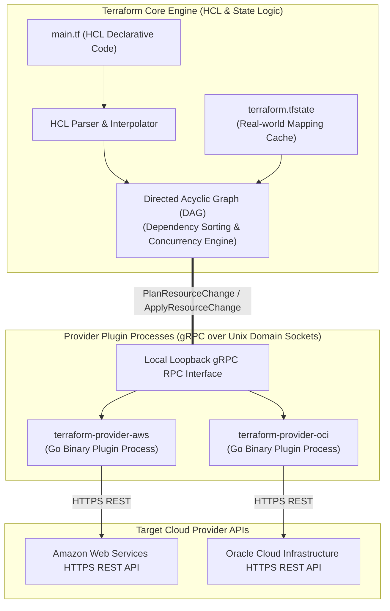

#### AWS Implementation
Inspect Terraform's internal dependency graph using `terraform graph` and visualize dependencies with Graphviz [Doc: Terraform Graph CLI, checked 2026]:

```bash
# Generate visual dot representation of the Directed Acyclic Graph
terraform graph -type=plan > terraform-graph.dot

# Render SVG dependency graph using Graphviz
dot -Tsvg terraform-graph.dot -o terraform-graph.svg

# Execute plan with custom parallel thread concurrency (default: 10)
terraform plan -parallelism=20 -out=tfplan
```

```hcl
# main.tf (Implicit vs Explicit Dependency Demonstration)
resource "aws_vpc" "main" {
  cidr_block = "10.0.0.0/16"
}

resource "aws_subnet" "public" {
  vpc_id     = aws_vpc.main.id # Implicit dependency: Graph creates aws_vpc first
  cidr_block = "10.0.1.0/24"
}

resource "aws_internet_gateway" "gw" {
  vpc_id = aws_vpc.main.id
  # Explicit dependency forces IGW creation before routing tables update
  depends_on = [aws_vpc.main]
}
```

#### OCI Implementation
Configure the OCI Terraform Provider with API key authentication and inspect execution plan output [Doc: OCI Terraform Provider Configuration, checked 2026]:

```hcl
# oci_provider.tf
terraform {
  required_version = ">= 1.5.0"
  required_providers {
    oci = {
      source  = "oracle/oci"
      version = "~> 5.30.0"
    }
  }
}

provider "oci" {
  tenancy_ocid     = "ocid1.tenancy.oc1..aaaaaaaaxample"
  user_ocid        = "ocid1.user.oc1..aaaaaaaaxample"
  fingerprint      = "20:3b:97:13:55:1c:..."
  private_key_path = "~/.oci/oci_api_key.pem"
  region           = "us-ashburn-1"
}

resource "oci_core_vcn" "prod_vcn" {
  compartment_id = "ocid1.compartment.oc1..aaaaaaaam7..."
  cidr_blocks    = ["10.0.0.0/16"]
  display_name   = "ProductionVCN"
}

resource "oci_core_subnet" "public_subnet" {
  compartment_id = "ocid1.compartment.oc1..aaaaaaaam7..."
  vcn_id         = oci_core_vcn.prod_vcn.id # Implicit dependency creates VCN first
  cidr_block     = "10.0.1.0/24"
  display_name   = "PublicSubnet"
}
```

#### Common Trap
Assuming that adding `depends_on` everywhere makes configurations safer. Overusing explicit `depends_on` flattens the Directed Acyclic Graph, destroying Terraform's ability to execute independent resource creations concurrently. Furthermore, adding `depends_on` pointing to an entire module forces Terraform to serialize every single resource in that module, drastically slowing down `terraform apply` times on large infrastructures from 3 minutes to 45 minutes. Only use `depends_on` when a hidden runtime dependency exists that cannot be expressed via resource attribute interpolation.

#### Follow-up Question
How does Terraform 1.4+ `terraform plan -generate-config-out` reverse-engineer declarative HCL from existing cloud resources during state import workflows?

---

### Q427: Remote State Management & Distributed Locking: S3 + DynamoDB vs OCI Object Storage

#### Question
Why is local state management an immediate disaster in multi-engineer cloud teams, how do remote backends manage state persistence and distributed concurrency locking, and how do AWS (S3 + DynamoDB) and OCI (Object Storage + OCI Resource Manager) compare?

#### Short Answer
The Terraform state file (`terraform.tfstate`) is the single source of truth mapping declared HCL code to physical cloud resource IDs and tracking resource metadata. Storing state locally on an engineer's laptop leads to state file desynchronization, lost updates, and accidental resource deletion. **Remote State Backends** centralize the state file in secure cloud object storage. To prevent two engineers or CI/CD pipelines from running `terraform apply` simultaneously—which would corrupt the state file—the backend enforces **Distributed State Locking**: the executing process acquires an exclusive lock before modifying state and releases it upon completion. In AWS, this is achieved via **Amazon S3 (for storage) + Amazon DynamoDB (for distributed locking)**. In OCI, this is implemented using **OCI Object Storage (with native HTTP ETag locking)** or natively managed via **OCI Resource Manager (ORM)**.

#### Deep Answer
Concurrent state file modification without distributed locking guarantees data corruption: if Engineer A modifies a security group while Engineer B is adding a subnet, both download the state file simultaneously; whichever apply finishes last overwrites the other's state, orphaning cloud resources in production.

**1. AWS Remote Backend Architecture (S3 + DynamoDB)**:
- **State Storage (Amazon S3)**:
  - Stores the JSON state file encrypted at rest using AWS KMS (`sse_customer_key` or `aws:kms`).
  - **Bucket Versioning**: Strictly required. If state is corrupted, SREs can roll back to any previous state version instantly.
- **Distributed State Locking (Amazon DynamoDB)**:
  - Requires a DynamoDB table with a single primary partition key named `LockID` (String).
  - When `terraform plan` or `apply` runs:
    1. Terraform writes an item to DynamoDB: `LockID: "<bucket>/<path>/terraform.tfstate"`, containing metadata (operator hostname, timestamp, execution ID).
    2. Uses a DynamoDB conditional write (`attribute_not_exists(LockID)`).
    3. If another process holds the lock, the conditional write fails, and Terraform halts immediately: `Error: Error acquiring the state lock` [Doc: Terraform S3 Backend Specification, checked 2026].
    4. Upon completion, Terraform deletes the lock item from DynamoDB.

**2. OCI Remote Backend & OCI Resource Manager Architecture**:
- **Option A: OCI Object Storage HTTP Backend**:
  - OCI Object Storage supports native HTTP backends.
  - **Native ETag Locking**: Unlike AWS which requires a separate database (DynamoDB), OCI Object Storage leverages atomic HTTP conditional updates (`If-Match` with ETags).
  - When Terraform writes state, it checks the ETag: if another process modified the state file, the ETag changes, and OCI rejects the write with `HTTP 412 Precondition Failed`, preventing race conditions without needing a separate database.
- **Option B: OCI Resource Manager (ORM)**:
  - Oracle's fully managed, cloud-native Terraform service.
  - Automatically manages state storage, encryption, versioning, and exclusive execution locking behind the scenes with zero backend configuration boilerplate [Doc: OCI Resource Manager State Management, checked 2026].

#### Architecture
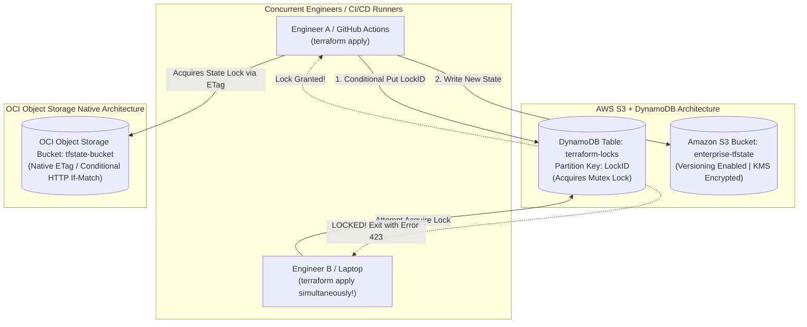

#### AWS Implementation
Configure an S3 remote backend with DynamoDB state locking and server-side KMS encryption [Doc: Terraform S3 Backend CLI, checked 2026]:

```hcl
# backend-aws.tf
terraform {
  required_version = ">= 1.5.0"
  backend "s3" {
    bucket         = "enterprise-terraform-state-111122223333"
    key            = "production/us-east-1/network/terraform.tfstate"
    region         = "us-east-1"
    dynamodb_table = "terraform-state-locks"
    encrypt        = true
    kms_key_id     = "arn:aws:kms:us-east-1:123456789012:key/mrk-1234567890abcdef"
  }
}
```

```bash
# Provision DynamoDB lock table via AWS CLI if setting up from scratch
aws dynamodb create-table \
  --table-name "terraform-state-locks" \
  --attribute-definitions AttributeName=LockID,AttributeType=S \
  --key-schema AttributeName=LockID,KeyType=HASH \
  --billing-mode PAY_PER_REQUEST \
  --region us-east-1
```

#### OCI Implementation
Configure an HTTP backend targeting an OCI Object Storage pre-authenticated request (PAR) or native OCI Resource Manager [Doc: Terraform OCI HTTP Backend, checked 2026]:

```hcl
# backend-oci.tf (HTTP Backend via OCI Object Storage PAR)
terraform {
  required_version = ">= 1.5.0"
  backend "http" {
    address        = "https://objectstorage.us-ashburn-1.oraclecloud.com/p/abc123PARtoken/n/enterprise-telemetry/b/tfstate-bucket/o/production.tfstate"
    update_method  = "PUT"
  }
}
```

```bash
# Initialize and migrate local state to the OCI remote backend
terraform init -migrate-state
```

#### Common Trap
Forcibly breaking a stale state lock (`terraform force-unlock <lock-id>`) without confirming that the competing execution has actually died. If an automated CI/CD pipeline is running an intensive 20-minute database migration apply, and an impatient developer runs `terraform force-unlock` because they assume the lock is stuck, the developer's subsequent apply will run concurrently with the CI/CD pipeline. This causes catastrophic race conditions, corrupting the state file and leaving half-provisioned resources orphaned in the cloud. Always verify process death before unlocking!

#### Follow-up Question
How do you configure S3 Object Lock (Compliance Mode) on a Terraform state bucket to prevent malicious or accidental state deletion without breaking Terraform's ability to overwrite `terraform.tfstate` with new versions?

---

### Q428: State Surgery & Disaster Recovery: state rm, mv, import & JSON Recovery

#### Question
How do cloud infrastructure engineers safely repair corrupted, out-of-sync, or duplicated Terraform state files without triggering unintended resource destruction, and what are the operational procedures for `terraform state rm`, `terraform state mv`, and low-level JSON state surgery?

#### Short Answer
When Terraform's state file diverges from physical reality (e.g., resources manually created in the console, resources deleted out-of-band, or state file syntax corruption), running `terraform apply` blindly can result in destructive deletion of production infrastructure. SREs perform **State Surgery** to realign state with reality: `terraform state rm` removes a resource from the state file so Terraform stops tracking it (without deleting the physical cloud resource); `terraform state mv` renames resources or refactors them into modules without destruction; and `terraform import` binds existing cloud resources into the state. In catastrophic state corruption scenarios, engineers pull raw state via `terraform state pull`, repair the JSON structure, increment the `serial` counter, and force-push via `terraform state push`.

#### Deep Answer
Direct modification of the Terraform state file is a surgical, high-risk procedure. The state file acts as the translation layer between HCL resource labels (`aws_instance.web`) and physical cloud IDs (`i-0123456789abcdef0`).

**1. Core State Surgery Commands**:
- **`terraform state rm <resource_address>`**:
  - *Use Case*: You want to remove a resource from Terraform management (or migrate it to another state file) *without* destroying the physical cloud resource.
  - *Behavior*: Deletes the JSON block from `terraform.tfstate`. On the next `terraform apply`, Terraform will **not** issue a delete API call to AWS/OCI.
- **`terraform state mv <source> <destination>`**:
  - *Use Case*: Refactoring code (e.g., moving standalone resource `aws_security_group.sg` into a module `module.networking.aws_security_group.sg`).
  - *Behavior*: Without `state mv`, Terraform interprets this as *"destroy old security group and create new security group"*, dropping active firewall rules. `state mv` updates the logical address in-place with zero cloud disruption.
- **`terraform state pull` and `terraform state push` (Low-Level JSON Surgery)**:
  - If state is corrupted by an aborted process:
    1. Pull the raw JSON: `terraform state pull > state.json`.
    2. Inspect and repair the JSON in a text editor (e.g., removing a stuck tainted status).
    3. **Crucial Rule**: You must increment the `"serial"` integer attribute (e.g., from `142` to `143`).
    4. Push the repaired state: `terraform state push state.json` [Doc: Terraform State CLI Reference, checked 2026].

**2. Handling Tainted Resources**:
- If a resource creation fails mid-way (e.g., VM boots, but provisioner script crashes), Terraform marks it as `tainted`.
- On the next apply, Terraform will destroy and recreate it.
- If the failure was transient and the resource is actually healthy, SREs untaint it: `terraform untaint <resource_address>`.

#### Architecture
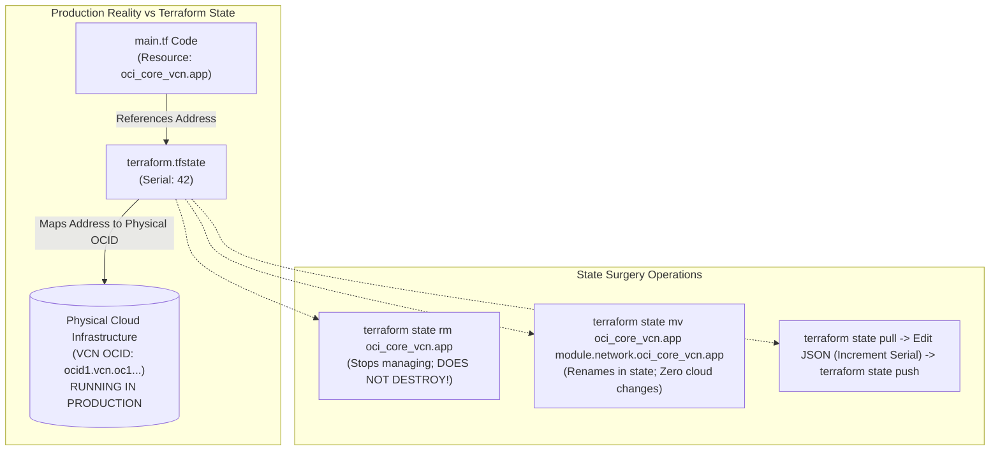

#### AWS Implementation
Execute state surgery to refactor an AWS security group into a module without destroying it [Doc: Terraform State MV CLI, checked 2026]:

```bash
# Step 1: Backup current state before any surgery
terraform state pull > backup-state-$(date +%s).json

# Step 2: List current tracked resource addresses in state
terraform state list

# Step 3: Move standalone security group into a newly created networking module
terraform state mv \
  aws_security_group.web_sg \
  module.vpc.aws_security_group.web_sg

# Step 4: Verify that terraform plan detects ZERO changes (No destroy / No create)
terraform plan
# Output: No changes. Your infrastructure matches the configuration.
```

#### OCI Implementation
Perform an emergency state removal and re-import of an OCI Compute Instance [Doc: Terraform State RM and Import, checked 2026]:

```bash
# Step 1: Remove an OCI Compute Instance from state so Terraform stops managing it
terraform state rm oci_core_instance.database_vm
# Successfully removed 1 resource instance.

# Step 2: Re-import the existing physical OCI instance back into a new resource address
terraform import \
  oci_core_instance.database_vm_v2 \
  ocid1.instance.oc1.iad.aaaaaaaaxample...

# Step 3: Pull state to manually inspect the JSON structure
terraform state pull | jq '.resources[] | select(.type=="oci_core_instance")'
```

#### Common Trap
Modifying the raw `terraform.tfstate` JSON file locally and running `terraform state push` without incrementing the `"serial"` counter. Terraform remote backends (S3 / OCI Object Storage) enforce an optimistic concurrency check on the serial number: if the serial number on the pushed state is equal to or lower than the serial number already in the remote bucket, Terraform **rejects the push with an error** (`State push rejected: state has an older serial`). Always increment the `"serial"` integer by at least $+1$ when executing manual JSON state surgery.

#### Follow-up Question
How do declarative `moved` blocks introduced in Terraform 1.1+ eliminate the need for multi-engineer teams to execute manual `terraform state mv` commands across local development environments?

---

### Q429: Terraform Provider Mechanics: AWS vs OCI Providers & Authentication

#### Question
How do Terraform Providers negotiate authentication, session tokens, and rate-limiting backoff when communicating with cloud provider control planes, and how do the AWS Provider (`hashicorp/aws`) and OCI Provider (`oracle/oci`) compare in authentication models (IAM Roles / OIDC vs Instance Principals / API Signing Keys)?

#### Short Answer
Terraform Providers translate generic HCL resource blocks into authenticated cloud API requests. The **AWS Provider** (`hashicorp/aws`) supports a multi-tiered credential resolution chain (environment variables, shared `~/.aws/credentials`, IAM instance profiles, ECS task roles, and web identity federation / OIDC for GitHub Actions/GitLab). The **OCI Provider** (`oracle/oci`) authenticates via **RSA API Signing Keys** (using SHA256 RSA signatures on HTTP request headers) or natively via **Instance Principals** (leveraging local hypervisor x509 certificates on compute instances to make authenticated API calls with zero hardcoded credentials). Both providers implement client-side exponential backoff and retry logic to absorb cloud API rate limits (`ThrottlingException` / HTTP 429).

#### Deep Answer
Managing cloud credentials in Infrastructure as Code requires balancing security against automation velocity: hardcoding API keys in `.tf` files is a critical security vulnerability that leaks secrets to version control.

**1. AWS Provider Authentication Models**:
- **Credential Resolution Chain**:
  1. Static provider arguments (`access_key`, `secret_key` - *Anti-pattern*).
  2. Environment variables (`AWS_ACCESS_KEY_ID`, `AWS_SECRET_ACCESS_KEY`, `AWS_SESSION_TOKEN`).
  3. Shared credentials/config file (`~/.aws/credentials`, `profile = "prod"`).
  4. Workload Identity Federation / OIDC:
     - CI/CD runners (GitHub Actions, GitLab) exchange an OpenID Connect token for a temporary AWS STS session token (`sts:AssumeRoleWithWebIdentity`), completely eliminating long-lived static AWS secret keys [Doc: AWS Provider Authentication Guide, checked 2026].
  5. IAM Roles for Amazon EC2 / EKS Pod Identity.

**2. OCI Provider Authentication Models**:
- **RSA Key-Pair Signature (Standard)**:
  - OCI does not use bearer tokens or simple access keys. Every HTTP request requires an **RFC-compliant HTTP Signature** computed using a 2048-bit or 4096-bit private RSA key.
  - Required parameters: `tenancy_ocid`, `user_ocid`, `fingerprint`, and `private_key_path`.
- **Instance Principals (The Cloud-Native Standard)**:
  - An OCI Compute instance (e.g., a Jenkins worker or Terraform runner) is placed into a Dynamic Group.
  - An IAM policy grants the Dynamic Group permission to manage resources:
    `Allow dynamic-group TerraformRunners to manage all-resources in tenancy`.
  - The OCI Provider sets `auth = "InstancePrincipal"`.
  - The provider fetches an ephemeral cryptographic certificate directly from the hypervisor metadata service at `http://169.254.169.254/opc/v2/identity/cert.pem` and signs API requests dynamically with **zero static keys stored on disk** [Doc: OCI Provider Instance Principal Auth, checked 2026].
- **Security Token Authentication (OCI CLI Token)**:
  - Short-lived browser-authenticated session tokens (`auth = "SecurityToken"`).

| Authentication Feature | AWS Provider (`hashicorp/aws`) | OCI Provider (`oracle/oci`) |
| :--- | :--- | :--- |
| **Primary Static Method** | Access Key ID + Secret Access Key | User OCID + Fingerprint + Private RSA Key (.pem) |
| **Ephemeral Compute Identity**| IAM Instance Profile / Pod Identity | OCI Instance Principals / Dynamic Groups |
| **CI/CD OIDC Federation** | AWS STS `AssumeRoleWithWebIdentity` | OCI Identity Federation / OIDC IdP |
| **Multi-Account / Tenancy** | `assume_role` blocks in provider | `provider` aliases with distinct tenancy OCIDs |
| **Request Signing Standard** | AWS Signature Version 4 (SigV4) | RFC Draft Cavage HTTP Request Signatures |

#### Architecture
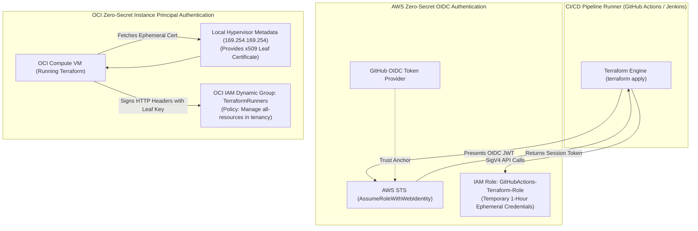

#### AWS Implementation
Configure the AWS Provider with cross-account IAM Role assumption and OIDC federation [Doc: Terraform AWS Provider Assume Role, checked 2026]:

```hcl
# provider-aws.tf
terraform {
  required_version = ">= 1.5.0"
  required_providers {
    aws = {
      source  = "hashicorp/aws"
      version = "~> 5.50.0"
    }
  }
}

provider "aws" {
  region = "us-east-1"

  # Assume Production Role dynamically without hardcoded access keys
  assume_role {
    role_arn     = "arn:aws:iam::111122223333:role/TerraformExecutionRole"
    session_name = "TerraformDeploymentSession"
  }

  default_tags {
    tags = {
      ManagedBy   = "Terraform"
      Environment = "Production"
    }
  }
}
```

#### OCI Implementation
Configure the OCI Provider using Instance Principal authentication on an OCI Compute instance or runner [Doc: Terraform OCI Provider Authentication, checked 2026]:

```hcl
# provider-oci.tf
terraform {
  required_version = ">= 1.5.0"
  required_providers {
    oci = {
      source  = "oracle/oci"
      version = "~> 5.30.0"
    }
  }
}

provider "oci" {
  # Zero hardcoded keys! Uses local hypervisor x509 certificates
  auth   = "InstancePrincipal"
  region = "us-ashburn-1"
}

data "oci_identity_tenancy" "current" {
  tenancy_id = "ocid1.tenancy.oc1..aaaaaaaaxample"
}
```

#### Common Trap
Using static access keys (`access_key` / `secret_key` or `private_key_path`) committed to private Git repositories under the assumption that "the repository is private, so it is secure." Private repositories are routinely cloned onto unsecured developer laptops, exposed via compromised developer credentials, or indexed by third-party CI/CD plugins. Production Terraform pipelines must **strictly forbid static credentials**, enforcing **AWS IAM OIDC Federation** or **OCI Instance Principals**.

#### Follow-up Question
How does the OCI Provider's `auth = "SecurityToken"` pattern integrate with the OCI CLI session token cache (`oci session authenticate`) to enable MFA-protected developer desktop runs?

---

### Q430: Terraform Module Architecture: Design Principles & Registry Versioning

#### Question
How do enterprise cloud platform teams design, structure, and version reusable Terraform modules to enforce organizational security standards without creating rigid, brittle abstraction layers, and what are the architectural principles of Module Composition?

#### Short Answer
Enterprise Terraform module design balances **reusability against over-abstraction**. A well-architected module adheres to 4 core principles: (1) **Single Responsibility**: Modules represent a coherent architectural component (e.g., `terraform-aws-vpc` or `terraform-oci-oke`), never a monolithic "all-in-one" infrastructure stack; (2) **Open-Closed Principle**: Inputs configure behavior via typed variables with sensible defaults, while outputs export all generated resource IDs and attributes; (3) **Semantic Versioning (SemVer)**: Modules are published to private Git/Terraform Registries with strict version tags (`v1.2.0`); (4) **Module Composition**: Complex environments assemble smaller, loosely coupled modules together in root configurations rather than nesting child modules inside child modules.

#### Deep Answer
Novice Terraform engineers frequently create "God Modules": a single massive module containing VPC, subnets, EKS, RDS, and CloudFront. When a team needs to tweak one subnet setting, the entire monolith must be planned and applied, creating extreme blast radius and slow execution.

**1. The Standard Module Structure (HashiCorp Standard)**:
Every published module must follow the canonical file structure:
- `main.tf`: Defines core resources.
- `variables.tf`: Explicitly typed input variables with `description` and `validation` blocks.
- `outputs.tf`: Exports all created resource attributes (never hide resource IDs).
- `versions.tf`: Pins minimum `required_version` and required provider constraints.
- `README.md`: Autogenerated documentation (using `terraform-docs`).

**2. Anti-Patterns in Module Design**:
- **The "Pass-Through Variable" Anti-Pattern**:
  - Creating a module that exposes 50 variables that map 1:1 to every single attribute of the underlying resource without adding any abstraction, policy enforcement, or security guardrail.
  - If a module just wraps `aws_s3_bucket` without adding encryption, versioning, or bucket policies, developers should use the native resource directly.
- **Deep Nesting (Child calling Child calling Child)**:
  - Deep module nesting creates brittle, unmaintainable dependency graphs.
  - **Best Practice (Flat Composition)**: Root configurations instantiate independent modules and wire outputs from Module A into inputs of Module B:
    ```hcl
    module "vpc" { source = "git::.../vpc.git?ref=v2.1.0" }
    module "eks" { source = "git::.../eks.git?ref=v1.4.0"; vpc_id = module.vpc.vpc_id }
    ```

**3. Version Pinning & Semantic Versioning**:
- Root modules must **always pin exact module versions**:
  `source = "git::https://github.com/org/terraform-aws-vpc.git?ref=v2.4.1"`
- Never use `ref=main` or unpinned registry versions in production configurations! If a module author commits a breaking change to `main`, subsequent `terraform apply` runs in production will unexpectedly alter or destroy resources.

#### Architecture
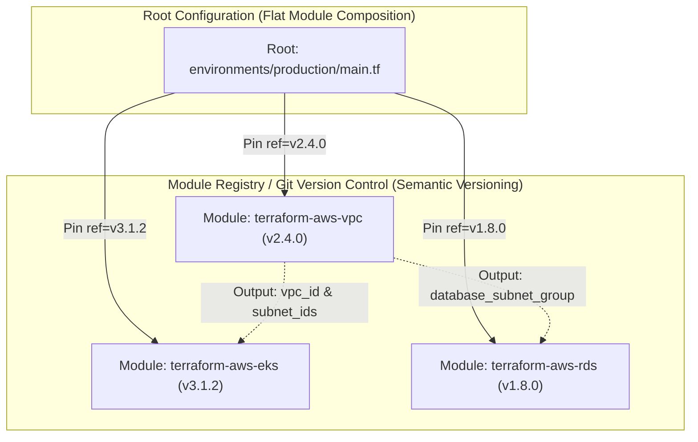

#### AWS Implementation
Design a reusable, secure Amazon S3 Bucket module with input variable validation and automated tagging [Doc: Terraform Input Validation, checked 2026]:

```hcl
# modules/s3-bucket/variables.tf
variable "bucket_name" {
  type        = string
  description = "Globally unique name for the S3 bucket"
  validation {
    condition     = can(regex("^[a-z0-9.-]{3,63}$", var.bucket_name))
    error_message = "Bucket name must be lowercase alphanumeric and between 3 and 63 characters."
  }
}

variable "environment" {
  type        = string
  description = "Deployment environment tier"
  validation {
    condition     = contains(["dev", "staging", "prod"], var.environment)
    error_message = "Environment must be one of: dev, staging, prod."
  }
}

# modules/s3-bucket/main.tf
resource "aws_s3_bucket" "this" {
  bucket = var.bucket_name
}

resource "aws_s3_bucket_server_side_encryption_configuration" "this" {
  bucket = aws_s3_bucket.this.id
  rule {
    apply_server_side_encryption_by_default {
      sse_algorithm = "AES256"
    }
  }
}

resource "aws_s3_bucket_public_access_block" "this" {
  bucket                  = aws_s3_bucket.this.id
  block_public_acls       = true
  block_public_policy     = true
  ignore_public_acls      = true
  restrict_public_buckets = true
}

# modules/s3-bucket/outputs.tf
output "bucket_id" {
  description = "The name of the bucket"
  value       = aws_s3_bucket.this.id
}

output "bucket_arn" {
  description = "The ARN of the bucket"
  value       = aws_s3_bucket.this.arn
}
```

#### OCI Implementation
Consume a reusable OCI VCN Module from a private Git repository with SemVer pinning [Doc: Terraform OCI VCN Module, checked 2026]:

```hcl
# environments/production/networking.tf
module "production_vcn" {
  source  = "oracle-terraform-modules/vcn/oci"
  version = "3.6.0" # Strict SemVer pinning

  compartment_id = "ocid1.compartment.oc1..aaaaaaaam7..."
  vcn_name       = "ProductionVCN"
  vcn_dns_label  = "prodvcn"
  vcn_cidrs      = ["10.0.0.0/16"]

  create_internet_gateway = true
  create_nat_gateway      = true
  create_service_gateway  = true

  subnets = {
    public_subnet = {
      cidr_block = "10.0.1.0/24"
      type       = "public"
    }
    private_subnet = {
      cidr_block = "10.0.2.0/24"
      type       = "private"
    }
  }
}

output "vpc_id" {
  value = module.production_vcn.vcn_id
}
```

#### Common Trap
Publishing breaking changes to a Terraform module without bumping the Major Semantic Version (e.g., modifying an output variable name or changing a resource identifier from `aws_instance.this` to `aws_instance.app` in a `v1.2.1` patch release). Because Terraform tracks resources by their exact module address in the state file, renaming a resource inside a child module causes Terraform to destroy the existing cloud resource and recreate it from scratch. Module authors must adhere strictly to SemVer: any change that alters resource state addresses or removes input/output variables **must be released as a Major Version bump (`v2.0.0`)**.

#### Follow-up Question
How do `tflint` and `terraform-docs` integrate into Git pre-commit hooks to automatically validate module syntax and regenerate markdown documentation tables before code is committed?

---

### Q431: Data Sources & Dynamic Querying: Resolving Cloud Metadata without Hardcoding

#### Question
How do cloud infrastructure configurations dynamically discover and resolve pre-existing cloud resources (AMIs, VPC subnets, KMS keys, and Compartment OCIDs) without hardcoding environment-specific IDs, and what are the performance and lifecycle risks of overusing Terraform Data Sources?

#### Short Answer
Hardcoding cloud resource identifiers (e.g., `ami-0a1b2c3d4e` or `ocid1.subnet.oc1.iad...`) makes Terraform code brittle, non-portable across regions or accounts, and prone to silent failures when base images update. **Terraform Data Sources** allow configurations to dynamically query cloud provider APIs at plan time: fetching the latest hardened Golden AMI, discovering public subnets matching specific tags, or retrieving the active KMS encryption key ARN. However, overusing data sources introduces **Performance Degradation** (excessive API polling during `terraform plan`) and **Drift Fragility**: if a data source queries the "latest" AMI, every time the security team publishes a new base AMI, Terraform automatically plans to destroy and recreate the entire EC2 compute fleet during the next routine apply.

#### Deep Answer
Data sources provide read-only views of infrastructure that was provisioned outside the current Terraform workspace (or by another team).

**1. Mechanics of Data Source Execution**:
- During `terraform plan`:
  - Terraform Core instructs the provider to execute a read query against cloud APIs.
  - The provider queries the API using filters (tags, names, owners) and populates the data source attributes in memory.
- **The "Deferred Read" Edge Case**:
  - If a data source references an attribute of a resource that has not yet been created (e.g., `data "aws_subnet" "target" { id = aws_subnet.new.id }`), the data source read cannot execute during `plan`!
  - It is deferred to `apply`, causing dependent resources to display `(known after apply)`, which blocks plan-time validation.

**2. The "Latest AMI" Destruction Hazard**:
- A common junior pattern:
  ```hcl
  data "aws_ami" "latest_ubuntu" {
    most_recent = true
    owners      = ["099720109477"] # Canonical
    filter { name = "name"; values = ["ubuntu/images/hvm-ssd/ubuntu-jammy-22.04-amd64-server-*"] }
  }
  ```
- *The Disaster*: Canonical publishes a minor kernel patch update on a Tuesday morning.
- On Tuesday afternoon, an engineer runs `terraform apply` to modify a DNS record.
- Because `most_recent = true` dynamically resolves to the newly published AMI, Terraform interprets this as a changed attribute on all production EC2 instances, generating a plan to **terminate all 50 production virtual machines**!
- *Best Practice*: Use data sources to discover infrastructure, but pin immutable base image versions or manage AMI updates explicitly via Launch Template versioning.

#### Architecture
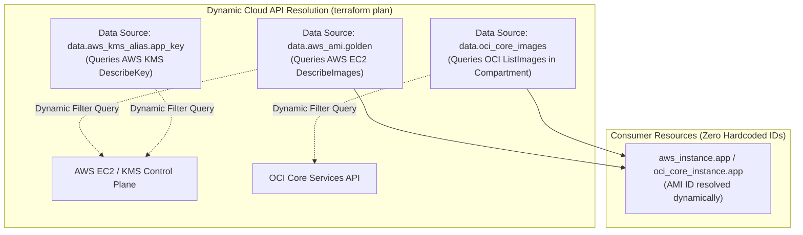

#### AWS Implementation
Dynamically query the latest approved enterprise Golden AMI and active VPC subnets using AWS Data Sources [Doc: Terraform AWS Data Sources, checked 2026]:

```hcl
# Resolve Golden AMI built by internal security team
data "aws_ami" "enterprise_al2023" {
  most_recent = true
  owners      = ["111122223333"] # Enterprise Security Account ID

  filter {
    name   = "name"
    values = ["enterprise-hardened-al2023-v2.*"]
  }

  filter {
    name   = "state"
    values = ["available"]
  }
}

# Dynamically discover all private subnets tagged for application workloads
data "aws_subnets" "app_tier" {
  filter {
    name   = "vpc-id"
    values = ["vpc-0a1b2c3d4e5f67890"]
  }

  tags = {
    Tier = "Private-App"
  }
}

# Resolve KMS Customer Managed Key by Alias
data "aws_kms_alias" "s3_key" {
  name = "alias/enterprise-s3-key"
}
```

#### OCI Implementation
Dynamically query availability domains, compartment OCIDs, and the latest Oracle Linux image in OCI [Doc: Terraform OCI Data Sources, checked 2026]:

```hcl
# Discover availability domains in the current tenancy
data "oci_identity_availability_domains" "ads" {
  compartment_id = var.tenancy_ocid
}

# Query the latest Oracle Linux 9 platform image matching shape requirements
data "oci_core_images" "oracle_linux_9" {
  compartment_id           = var.compartment_ocid
  operating_system         = "Oracle Linux"
  operating_system_version = "9"
  shape                    = "VM.Standard.E5.Flex"
  sort_by                  = "TIMECREATED"
  sort_order               = "DESC"
}

# Reference the discovered OCID dynamically
resource "oci_core_instance" "app_server" {
  compartment_id      = var.compartment_ocid
  availability_domain = data.oci_identity_availability_domains.ads.availability_domains[0].name
  shape               = "VM.Standard.E5.Flex"

  source_details {
    source_type = "image"
    source_id   = data.oci_core_images.oracle_linux_9.images[0].id
  }
}
```

#### Common Trap
Using data sources across dozens of sub-modules to repeatedly query the exact same cloud resources (e.g., 20 independent modules each declaring `data "aws_vpc" "default" {}` and `data "aws_caller_identity" "current" {}`). Every single data source executes a synchronous HTTP API call during `terraform plan`. In a large enterprise configuration, redundant data sources trigger hundreds of unnecessary API calls, hitting AWS/OCI API throttling limits (`Rate exceeded`) and causing plan operations to take 10+ minutes. Query shared metadata **once** at the root configuration and pass the resolved values down into child modules as input arguments.

#### Follow-up Question
How do `lifecycle { ignore_changes = [ami] }` blocks protect virtual machine instances from being destroyed when a dynamic AMI data source resolves to a newly published image ID?

---

### Q432: Loops, Conditionals & Dynamic Blocks: count vs for_each & Dynamic HCL

#### Question
How do senior Terraform engineers construct dynamic, DRY infrastructure configurations using `count`, `for_each`, ternary conditionals, and `dynamic` blocks, and why does using `count` for resource collections indexed by lists create catastrophic resource recreation bugs?

#### Short Answer
Terraform provides metaproperties for scaling resources: `count` creates a fixed integer number of identical resources indexed by an array position ($0, 1, 2 \dots$); `for_each` accepts a map or set of strings, creating resources identified by unique string keys. **Using `count` on a list of resources is a major architectural anti-pattern**: if an item is removed from the middle of the list, all subsequent array indices shift by $-1$, causing Terraform to destroy and recreate every subsequent resource in the list! **`for_each` eliminates this bug** because resources are bound to immutable map keys. For configuring repeated nested attributes within a single resource (such as multiple security group ingress rules or OCI route rules), Terraform provides **`dynamic` blocks**, iterating over local collections cleanly without repeating boilerplate HCL.

#### Deep Answer
Mastering HCL metaproperties is the difference between safe modular infrastructure and accidental production outages during routine list edits.

**1. The Fatal `count` Index Shifting Trap**:
- Suppose you provision 3 subnets using `count`:
  ```hcl
  variable "subnets" { default = ["subnet-a", "subnet-b", "subnet-c"] }
  resource "aws_subnet" "net" {
    count = length(var.subnets)
    tags  = { Name = var.subnets[count.index] }
  }
  ```
  - State file tracks:
    - `aws_subnet.net[0]` $\rightarrow$ `subnet-a`
    - `aws_subnet.net[1]` $\rightarrow$ `subnet-b`
    - `aws_subnet.net[2]` $\rightarrow$ `subnet-c`
- A developer removes `subnet-b` from the list: `["subnet-a", "subnet-c"]`.
- What does Terraform do?
  - `aws_subnet.net[0]` is still `subnet-a` (No change).
  - `aws_subnet.net[1]` was `subnet-b`, but is now `subnet-c`! **Terraform updates/recreates Subnet 1!**
  - `aws_subnet.net[2]` no longer exists. **Terraform issues a DELETE API call for `subnet-c`!**
- The developer intended to delete Subnet B, but Terraform **destroyed Subnet C**!

**2. The `for_each` Solution**:
- `for_each` binds resources to unique string identifiers:
  ```hcl
  resource "aws_subnet" "net" {
    for_each = toset(var.subnets)
    tags     = { Name = each.key }
  }
  ```
  - State file tracks:
    - `aws_subnet.net["subnet-a"]`
    - `aws_subnet.net["subnet-b"]`
    - `aws_subnet.net["subnet-c"]`
- When `subnet-b` is removed, Terraform issues a delete **only for `aws_subnet.net["subnet-b"]`**. Subnet A and Subnet C are completely untouched.

**3. `dynamic` Blocks for Nested Configurations**:
- Resources with repeatable nested blocks (e.g., security group rules, load balancer listeners):
  ```hcl
  dynamic "ingress" {
    for_each = var.ingress_rules
    content {
      from_port   = ingress.value.port
      to_port     = ingress.value.port
      protocol    = "tcp"
      cidr_blocks = ingress.value.cidrs
    }
  }
  ```

#### Architecture
```mermaid
graph TD
    subgraph "Anti-Pattern: count with Lists (Index Shift Disaster)"
        L1["List: [App, DB, Web]"] --> IDX["Indexed by Integer: [0], [1], [2]"]
        REM["Remove 'DB' -> List: [App, Web]"]
        SHIFT["Index [1] remapped from DB to Web!\nIndex [2] DELETED!\n(Destroys Web Subnet unexpectedly!)"]
        REM --> SHIFT
    end

    subgraph "Best Practice: for_each with Maps/Sets (Safe Immutable Keys)"
        M1["Map: {app: ..., db: ..., web: ...}"] --> KEYS["Indexed by String Keys"]
        REM_SAFE["Remove 'db' key"]
        SAFE["Deletes ONLY resource[\"db\"]\nresource[\"web\"] is 100% untouched!"]
        REM_SAFE --> SAFE
    end
```

#### AWS Implementation
Implement `for_each` with maps and `dynamic` blocks for an AWS Security Group [Doc: Terraform Dynamic Blocks, checked 2026]:

```hcl
# security_groups.tf
locals {
  firewall_rules = [
    { port = 443, cidrs = ["0.0.0.0/0"], desc = "HTTPS" },
    { port = 80,  cidrs = ["0.0.0.0/0"], desc = "HTTP" },
    { port = 22,  cidrs = ["10.0.0.0/8"], desc = "SSH Internal" }
  ]
}

resource "aws_security_group" "web" {
  name        = "web-application-firewall"
  description = "Security group with dynamically generated ingress rules"
  vpc_id      = "vpc-0a1b2c3d4e5f67890"

  # Dynamic block constructs nested ingress blocks cleanly
  dynamic "ingress" {
    for_each = local.firewall_rules
    content {
      description = ingress.value.desc
      from_port   = ingress.value.port
      to_port     = ingress.value.port
      protocol    = "tcp"
      cidr_blocks = ingress.value.cidrs
    }
  }

  egress {
    from_port   = 0
    to_port     = 0
    protocol    = "-1"
    cidr_blocks = ["0.0.0.0/0"]
  }
}
```

#### OCI Implementation
Deploy a set of OCI Subnets using `for_each` over a map of objects with custom CIDRs and Route Tables [Doc: Terraform for_each Specification, checked 2026]:

```hcl
# oci_subnets.tf
variable "subnets_config" {
  type = map(object({
    cidr_block = string
    is_public  = bool
  }))
  default = {
    frontend = { cidr_block = "10.0.1.0/24", is_public = true }
    backend  = { cidr_block = "10.0.2.0/24", is_public = false }
    database = { cidr_block = "10.0.3.0/24", is_public = false }
  }
}

resource "oci_core_subnet" "tiers" {
  # Safe for_each over map keys: adding or removing a tier never affects others!
  for_each       = var.subnets_config
  compartment_id = "ocid1.compartment.oc1..aaaaaaaam7..."
  vcn_id         = "ocid1.vcn.oc1.iad.aaaaaaaavcn..."
  display_name   = "Subnet-${each.key}"
  cidr_block     = each.value.cidr_block
  prohibit_public_ip_on_vnic = !each.value.is_public
}
```

#### Common Trap
Using `count` combined with a ternary conditional to toggle optional single resources (e.g., `count = var.enable_vpn ? 1 : 0`), and then attempting to access its attributes in downstream resources using `aws_vpn_gateway.this[0].id` when `enable_vpn = false`. Terraform will throw an evaluation error (`Index 0 out of bounds`). When toggling optional resources, use the splat operator `one(aws_vpn_gateway.this[*].id)` or modern `try()` / ternary functions to safely handle empty lists without crashing plans.

#### Follow-up Question
How do the `can()` and `try()` functions evaluate dynamic expressions without halting Terraform plan evaluation when parsing complex nested JSON structures?

---

### Q433: Terraform Workspaces vs Directory-Based Multi-Environment Isolation

#### Question
How do enterprise cloud architectures isolate multiple deployment environments (Development, Staging, Production) in Infrastructure as Code, and what are the severe security and blast-radius risks of Terraform CLI Workspaces compared to Directory-Based isolation?

#### Short Answer
**Terraform CLI Workspaces** manage multiple state files from a single shared directory of HCL code, toggled via `terraform workspace select <name>`. While convenient for quick testing, using Workspaces for production multi-environment isolation is a **severe anti-pattern**: all environments share the exact same backend storage bucket, identical cloud provider credentials, and identical variables; a simple typo (`terraform workspace select prod` instead of `dev`) allows an engineer to accidentally execute destructive changes in Production. **Directory-Based Isolation** separates environments into distinct physical directory structures (e.g., `environments/dev/`, `environments/stage/`, `environments/prod/`), utilizing completely independent remote state backend buckets, completely separate AWS accounts / OCI compartments, and isolated IAM credentials, ensuring absolute blast radius containment.

#### Deep Answer
Environment isolation is not just a code organization choice; it is an essential security and blast-radius boundary.

**1. The Flaws & Traps of Terraform CLI Workspaces**:
- **Shared State Storage & IAM Permissions**:
  - In a workspace setup, `dev` and `prod` state files reside in the **same S3 bucket or OCI Object Storage bucket**:
    - `env:/dev/terraform.tfstate`
    - `env:/prod/terraform.tfstate`
  - An engineer needing read/write access to test a change in `dev` must be granted write access to the state bucket. Because both states live in the same bucket, the engineer has full permissions to overwrite or delete Production state!
- **Single Point of Credential Compromise**:
  - The provider configuration must have access to both Dev and Prod cloud accounts, violating the principle of least privilege.
- **The "Forgot Which Workspace I'm In" Disaster**:
  - SRE runs `terraform destroy` intending to clean up a temporary dev workspace, forgetting that their terminal context was left in the `prod` workspace. Production infrastructure is instantly vaporized.

**2. Directory-Based Architecture (The Enterprise Standard)**:
- **Physical Separation of Concerns**:
  ```text
  ├── modules/
  │   ├── vpc/
  │   └── eks/
  └── environments/
      ├── dev/
      │   ├── backend.tf   # Points to Dev S3 Bucket in Dev Account
      │   ├── main.tf      # References modules with Dev sizing
      │   └── terraform.tfvars
      └── prod/
          ├── backend.tf   # Points to Prod S3 Bucket in Prod Account
          ├── main.tf      # References modules with Prod sizing
          └── terraform.tfvars
  ```
- **Blast Radius Containment**:
  - A developer with credentials for the `dev` AWS account cannot execute code against `prod`.
  - A CI/CD pipeline deploying to `dev` has **zero IAM permissions** in the `prod` account.
  - Testing a major module version upgrade (e.g., migrating from `module v1` to `module v2`) can be applied and baked in `environments/dev/` for weeks without modifying a single line of HCL in `environments/prod/`.

#### Architecture
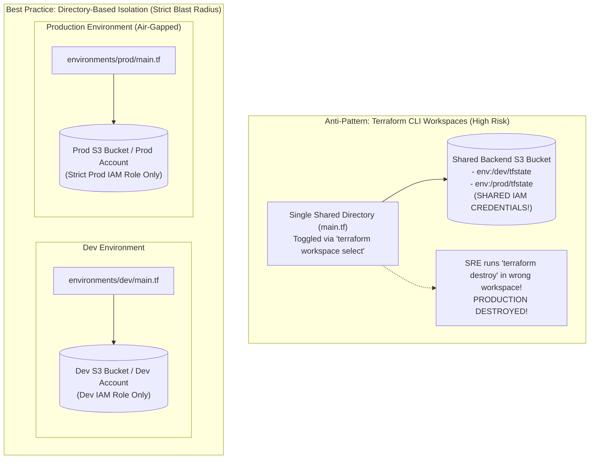

#### AWS Implementation
Structure an enterprise Directory-Based multi-account AWS Terraform deployment [Doc: AWS Multi-Account IaC Patterns, checked 2026]:

```hcl
# environments/prod/backend.tf (Air-gapped Production State)
terraform {
  required_version = ">= 1.5.0"
  backend "s3" {
    bucket         = "prod-enterprise-tfstate-111122223333"
    key            = "networking/terraform.tfstate"
    region         = "us-east-1"
    dynamodb_table = "prod-terraform-locks"
    encrypt        = true
    # Access strictly bounded to Production IAM credentials
  }
}

# environments/prod/main.tf
module "vpc" {
  source = "../../modules/vpc"

  cidr_block         = "10.100.0.0/16"
  environment        = "production"
  enable_nat_gateway = true
  single_nat_gateway = false # Multi-AZ NAT for production high availability
}
```

#### OCI Implementation
Enforce Directory-Based isolation across OCI Compartments using separate compartment OCIDs and IAM policies [Doc: OCI Compartment Isolation IaC, checked 2026]:

```hcl
# environments/prod/main.tf (OCI Production Compartment Isolation)
module "prod_network" {
  source = "../../modules/oci-network"

  # Enforces hard compartment boundary: Dev credentials cannot access this compartment!
  compartment_ocid = "ocid1.compartment.oc1..production_compartment_ocid"
  vcn_cidr         = "10.200.0.0/16"
  environment      = "production"
}
```

```bash
# SRE runs apply inside the specific directory; zero risk of workspace selection error
cd environments/prod
terraform init
terraform apply
```

#### Common Trap
Using Terraform CLI Workspaces for separate customer tenants in a SaaS platform without automated isolation. If Tenant A and Tenant B are managed via `workspace select tenant_a` and `workspace select tenant_b` using the same backend, an unhandled error during a CI/CD batch run can apply Tenant A's customer secrets into Tenant B's infrastructure, causing a catastrophic multi-tenant security and compliance breach. Workspaces should only be used for ephemeral, short-lived feature branch testing, never for persistent security boundaries.

#### Follow-up Question
How do tools like Terragrunt or Atmos eliminate code duplication across directory-based environments while keeping state files and IAM credentials strictly isolated?

---

### Q434: Secrets Management in Terraform and Preventing Plaintext Exposure in State

#### Question
How do you securely handle sensitive credentials, tokens, and database passwords in Terraform without leaking them in version control or leaving unencrypted plaintext values exposed in remote state files?

#### Short Answer
Terraform stores all resource attributes—including those marked `sensitive = true`—in unencrypted plaintext within the JSON `.tfstate` file. To prevent exposure, you must: (1) never hardcode secrets in `.tf` or commit `.tfvars`; (2) retrieve secrets dynamically at runtime from external secret vaults (AWS Secrets Manager/KMS, OCI Vault, HashiCorp Vault) or use dynamic ephemeral secrets; (3) mark variables and outputs as `sensitive = true` to suppress console logging; (4) encrypt remote state backends (S3+KMS with restrictive IAM and bucket policies, OCI Object Storage with KMS Customer-Managed Keys); and (5) leverage Terraform 1.10+ `ephemeral` resources and write-only attributes where credentials are used in provider configs without writing to state.

#### Deep Answer
Secrets management in Infrastructure as Code involves three threat boundaries: **Code/VCS**, **Execution/Console Output**, and the **State Storage Layer (`.tfstate`)**.

1. **Version Control Suppression**:
   - Never commit `.tfvars` files with secret values. Use environment variables prefixed with `TF_VAR_variable_name` injected via secure CI/CD runners (e.g., GitHub Actions Secrets, GitLab Protected Variables, OCI DevOps secret references).
   - Use `.gitignore` templates covering `*.tfvars`, `*.tfstate*`, `.terraform/`, and `*.pem`.

2. **Console Output Masking**:
   - Mark input variables and module outputs as `sensitive = true`. This directs the Terraform graph engine to redact the string as `(sensitive value)` in `terraform plan` and `terraform apply` logs.
   - *Limitation*: Marking an attribute sensitive does **not** encrypt it in state—it only masks it in terminal stdout/stderr.

3. **State File Exposure Problem**:
   - The Terraform state engine requires actual values to calculate diffs. If you create an `aws_db_instance` with `password = var.db_password`, the plaintext password is saved directly into `terraform.tfstate`.
   - Anyone with read access to the S3 bucket or OCI Object Storage bucket containing the state can read database passwords, TLS private keys, and API tokens.
   - *Mitigations*:
     - **Dynamic Secret Generation**: Generate random passwords using `random_password` and immediately push them into AWS Secrets Manager or OCI Vault, or have the database engine generate secrets via native IAM authentication (e.g., AWS IAM DB Authentication, OCI IAM Database Authentication) eliminating static passwords entirely.
     - **Encrypted State Backends**: Enforce server-side encryption via customer-managed keys (AWS KMS CMK with `aws:kms` bucket policies; OCI Vault Master Encryption Key).
     - **Micro-State Segregation**: Isolate state files holding sensitive resources (DBs, certs) from broad networking/compute state files, applying strict RBAC per state path.
     - **Terraform 1.10+ Ephemeral Values**: Use `ephemeral` blocks and data sources (such as ephemeral tokens) which exist strictly in-memory during the plan/apply cycle and are deliberately scrubbed from the persisted state graph.

#### Architecture
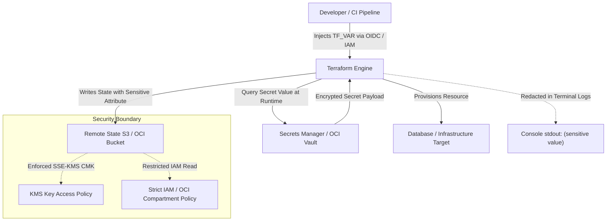

#### AWS Implementation
In AWS, retrieve secrets via `aws_secretsmanager_secret_version` or generate passwords via `random_password` and write them to AWS Secrets Manager, with state encrypted via KMS CMK: [Doc: AWS Secrets Manager & Terraform State Security, checked 2026].

```hcl
# backend.tf - Remote state with KMS CMK encryption and strict access
terraform {
  required_version = ">= 1.5.0"
  backend "s3" {
    bucket         = "corp-production-tfstate-us-east-1"
    key            = "databases/aurora-pg/terraform.tfstate"
    region         = "us-east-1"
    dynamodb_table = "terraform-state-locks"
    encrypt        = true
    kms_key_id     = "arn:aws:kms:us-east-1:112233445566:key/mrk-state-signing-key"
  }
}

# Variable marked sensitive to prevent console exposure
variable "master_username" {
  type        = string
  default     = "dbadmin"
  sensitive   = false
}

# Generate cryptographically strong password inside Terraform
resource "random_password" "db_master" {
  length           = 32
  special          = true
  override_special = "!#$%&*()-_=+[]{}<>:?"
}

# Store generated password in AWS Secrets Manager with KMS encryption
resource "aws_secretsmanager_secret" "db_password" {
  name                    = "production/aurora/master-password"
  kms_key_id              = "arn:aws:kms:us-east-1:112233445566:key/secrets-kms-key"
  recovery_window_in_days = 0 # Force immediate deletion on destroy
}

resource "aws_secretsmanager_secret_version" "db_password_val" {
  secret_id     = aws_secretsmanager_secret.db_password.id
  secret_string = jsonencode({
    username = var.master_username
    password = random_password.db_master.result
  })
}

# Provision RDS DB instance consuming the sensitive secret
resource "aws_db_instance" "app_db" {
  identifier           = "app-production-db"
  engine               = "postgres"
  engine_version      = "16.2"
  instance_class       = "db.r6g.xlarge"
  allocated_storage    = 100
  username             = var.master_username
  password             = random_password.db_master.result
  skip_final_snapshot  = false
  final_snapshot_identifier = "app-production-db-final"
}

output "db_secret_arn" {
  value       = aws_secretsmanager_secret.db_password.arn
  description = "Secrets Manager ARN holding master credentials"
}
```

#### OCI Implementation
In OCI, leverage `oci_vault_secret` backed by OCI Vault Key Management Service, combined with OCI Object Storage state backend with SSE-KMS: [Doc: OCI Vault Service & Resource Manager State Security, checked 2026].

```hcl
# backend.tf - OCI Object Storage Backend using native S3 compatibility or OCI RM
terraform {
  required_version = ">= 1.5.0"
  backend "s3" {
    bucket   = "corp-production-tfstate"
    key      = "databases/autonomous-db/terraform.tfstate"
    region   = "us-ashburn-1"
    endpoint = "https://axxxxxxxxx.compat.objectstorage.us-ashburn-1.oraclecloud.com"
    skip_region_validation      = true
    skip_credentials_validation = true
    skip_metadata_api_check     = true
    force_path_style            = true
  }
}

variable "compartment_id" {
  type = string
}

variable "vault_kms_key_id" {
  type = string
}

variable "vault_id" {
  type = string
}

# Generate cryptographically secure database admin password
resource "random_password" "oci_admin_pwd" {
  length           = 32
  special          = true
  min_upper        = 4
  min_lower        = 4
  min_numeric      = 4
  min_special      = 4
  override_special = "#_-"
}

# Store secret in OCI Vault Secret Service (Base64 encoded)
resource "oci_vault_secret" "db_admin_secret" {
  compartment_id = var.compartment_id
  secret_name    = "prod-autonomous-db-admin-password"
  vault_id       = var.vault_id
  key_id         = var.vault_kms_key_id

  secret_content {
    content_type = "BASE64"
    content      = base64encode(random_password.oci_admin_pwd.result)
  }
}

# Deploy Autonomous Transaction Processing (ATP) Database
resource "oci_database_autonomous_database" "prod_atp" {
  compartment_id           = var.compartment_id
  db_name                  = "prodatp01"
  display_name             = "prod-atp-database"
  admin_password           = random_password.oci_admin_pwd.result
  cpu_core_count           = 4
  data_storage_size_in_tbs = 2
  db_workload              = "OLTP"
  is_auto_scaling_enabled  = true
  is_free_tier             = false
}

output "vault_secret_ocid" {
  value       = oci_vault_secret.db_admin_secret.id
  description = "OCID of the OCI Vault secret holding database credentials"
}
```

#### Common Trap
Believing that setting `sensitive = true` protects secrets from compromise. The `sensitive = true` attribute only informs the CLI and UI to redact output strings as `(sensitive value)`. Inside the backend storage (`terraform.tfstate`), the JSON document contains the unencrypted cleartext value. If developers or build systems have `s3:GetObject` on the state bucket, they can download the `.tfstate` and read raw credentials via `cat terraform.tfstate | jq '.. | .password? // empty'`.

#### Follow-up Question
How do Terraform 1.10+ `ephemeral` resources mitigate state file leakage compared to traditional `sensitive = true` attributes?

*Answer*: In Terraform 1.10+, `ephemeral` blocks allow defining data sources and resources that are queried or generated strictly in-memory during the execution graph evaluation (e.g., retrieving temporary STS credentials or Vault tokens). Unlike standard resources, ephemeral values are explicitly excluded from being written into the JSON state file on disk or in remote backends, closing the state-file secret exposure window entirely.

---

### Q435: Drift Detection and Automated Reconciliation in Enterprise IaC

#### Question
How do you detect, alert on, and automatically reconcile configuration drift when engineers or external automation make out-of-band manual changes directly in cloud management consoles or APIs?

#### Short Answer
Configuration drift occurs when real-world cloud infrastructure deviates from the declarative Terraform state definition. To manage drift: (1) Run scheduled non-mutating speculative plans (`terraform plan -detailed-exitcode -refresh-only`) via CI/CD pipelines (e.g., nightly cron in GitHub Actions or AWS EventBridge); (2) In OCI, use OCI Resource Manager (ORM) built-in Drift Detection jobs; (3) Capture the detailed exit code (`0` = no drift, `2` = drift detected, `1` = error); (4) Parse drifted resources and publish alerts to Slack/PagerDuty; and (5) For automated reconciliation, trigger an automated `terraform apply -refresh-only` or full `terraform apply --auto-approve` in lower environments, while opening auto-generated remediation Pull Requests for production environments.

#### Deep Answer
Infrastructure drift manifests in two distinct forms:
1. **State Drift**: Cloud resource attributes were modified out-of-band (e.g., an engineer manually modified a security group rule via AWS Console during a midnight incident). Terraform detects this during the refresh cycle as an attribute difference.
2. **Resource Drift**: Cloud resources were manually deleted, or orphan resources were created out-of-band without IaC tracking.

**Detection Mechanics**:
- The command `terraform plan -refresh-only -detailed-exitcode` updates the in-memory state against real-world cloud APIs without proposing destructive changes.
- Exit code values:
  - `0`: Succeeded with empty diff (real infrastructure matches `.tf` code).
  - `1`: Error encountered during API invocation or provider execution.
  - `2`: Succeeded, but configuration drift is present (diff found between code and cloud).

**Enterprise Reconciliation Strategies**:
- **Strict Enforced Reconciliation (Self-Healing / GitOps)**:
  - If drift is detected, a pipeline immediately triggers `terraform apply --auto-approve` to overwrite console modifications and restore the repository code as the source of truth.
  - *Risk*: Overwriting intentional emergency hotfixes can cause immediate outages if an engineer opened a port to remediate a live disruption.
- **Speculative Drift Pull Requests**:
  - The pipeline runs `terraform plan -refresh-only`, generates a markdown summary diff, and opens a GitHub/GitLab Pull Request back into the repo. This forces the team to either approve the drift (merging the state update into code) or reject it (triggering an apply to overwrite real-world resources).
- **Console Lockdown (Preventative Governance)**:
  - Drift is fundamentally prevented by stripping human write permissions in production AWS accounts/OCI tenancies using AWS Service Control Policies (SCPs) or OCI Compartment Policies. Human identities have read-only permissions; only the Terraform IAM execution role / Instance Principal can mutate resources.

#### Architecture
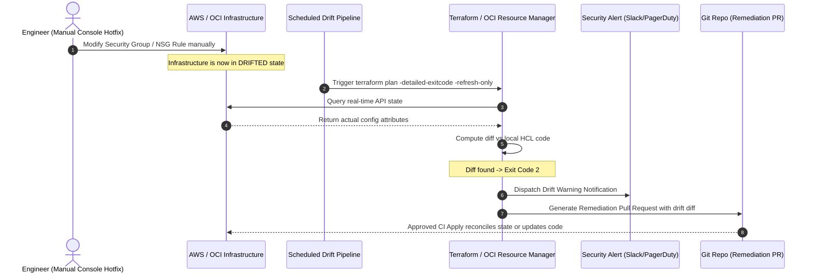

#### AWS Implementation
A production GitHub Actions workflow executing nightly drift detection against AWS resources with Slack alerting: [Doc: AWS CLI & Terraform Automation, checked 2026].

```yaml
# .github/workflows/terraform-drift-detection.yml
name: "Terraform Drift Detection"

on:
  schedule:
    - cron: "0 2 * * *" # Run daily at 02:00 UTC
  workflow_dispatch:

jobs:
  drift-check:
    name: "Detect Infrastructure Drift"
    runs-on: ubuntu-latest
    permissions:
      id-token: write
      contents: read
    steps:
      - name: Checkout Repository
        uses: actions/checkout@v4

      - name: Configure AWS Credentials via OIDC
        uses: aws-actions/configure-aws-credentials@v4
        with:
          role-to-assume: arn:aws:iam::112233445566:role/github-terraform-drift-auditor
          aws-region: us-east-1

      - name: Setup Terraform
        uses: hashicorp/setup-terraform@v3
        with:
          terraform_version: 1.8.0

      - name: Terraform Init
        run: terraform init -input=false

      - name: Check for Drift
        id: drift
        run: |
          set +e
          terraform plan -detailed-exitcode -refresh-only -no-color -out=drift.tfplan > drift_output.txt
          EXIT_CODE=$?
          echo "exit_code=$EXIT_CODE" >> $GITHUB_OUTPUT
          set -e

          if [ $EXIT_CODE -eq 0 ]; then
            echo "SUCCESS: No drift detected. Infrastructure matches code."
            exit 0
          elif [ $EXIT_CODE -eq 2 ]; then
            echo "WARNING: Drift detected between cloud state and code!"
            exit 0
          else
            echo "ERROR: Terraform plan failed with execution error."
            cat drift_output.txt
            exit 1
          fi

      - name: Notify Slack on Drift
        if: steps.drift.outputs.exit_code == '2'
        uses: slackapi/slack-github-action@v1.26.0
        with:
          payload: |
            {
              "text": "*CRITICAL: Infrastructure Drift Detected in Production!*",
              "blocks": [
                {
                  "type": "section",
                  "text": {
                    "type": "mrkdwn",
                    "text": ":warning: *Drift Detected in Account 112233445566 (us-east-1)*\nOut-of-band console changes detected. Review workflow run: ${{ github.server_url }}/${{ github.repository }}/actions/runs/${{ github.run_id }}"
                  }
                }
              ]
            }
        env:
          SLACK_WEBHOOK_URL: ${{ secrets.SLACK_DRIFT_WEBHOOK }}
```

#### OCI Implementation
OCI Resource Manager provides native, zero-infrastructure drift detection jobs that compare the active stack against actual cloud resources: [Doc: OCI Resource Manager Drift Detection, checked 2026].

```bash
#!/usr/bin/env bash
# oci-detect-drift.sh: Run scheduled drift detection across OCI Resource Manager Stacks
set -euo pipefail

STACK_OCID="ocid1.ormstack.oc1.iad.aaaaaaaaxxxxxxxxxxxxxxxxxxxxxxxxxxxx"
COMPARTMENT_OCID="ocid1.compartment.oc1..aaaaaaaaxxxxxxxxxxxxxxxxxxxxxxx"

echo "[INFO] Triggering OCI Resource Manager Drift Detection Job..."
JOB_JSON=$(oci resource-manager job create-drift-detection-job \
  --stack-id "$STACK_OCID" \
  --display-name "Nightly-Drift-Audit-$(date +%F)" \
  --wait-for-state SUCCEEDED \
  --wait-for-state FAILED \
  --max-wait-seconds 600)

JOB_ID=$(echo "$JOB_JSON" | jq -r '.data.id')
LIFECYCLE_STATE=$(echo "$JOB_JSON" | jq -r '.data["lifecycle-state"]')

echo "[INFO] Drift Detection Job $JOB_ID finished with status: $LIFECYCLE_STATE"

if [ "$LIFECYCLE_STATE" != "SUCCEEDED" ]; then
  echo "[ERROR] Drift detection job execution failed!"
  exit 1
fi

# Query drift status results
DRIFT_STATUS=$(oci resource-manager stack get \
  --stack-id "$STACK_OCID" | jq -r '.data["drift-status"]')

echo "[INFO] Stack Drift Status: $DRIFT_STATUS"

if [ "$DRIFT_STATUS" == "IN_SYNC" ]; then
  echo "[SUCCESS] All OCI resources are in sync with Terraform state."
  exit 0
elif [ "$DRIFT_STATUS" == "DRIFTED" ]; then
  echo "[ALERT] Infrastructure drift detected! Fetching drifted resource details..."
  
  # List individual drifted resources
  oci resource-manager job list-drift-status \
    --job-id "$JOB_ID" \
    --output json | jq -r '.data.items[] | select(.["drift-status"] != "IN_SYNC") | {resource_name: .["resource-name"], resource_type: .["resource-type"], drift_status: .["drift-status"]}'
  
  # Trigger alert / event notification
  exit 2
fi
```

#### Common Trap
Using `terraform apply -refresh-only --auto-approve` blindly in automated pipelines. A `refresh-only` apply updates the Terraform state file to reflect what is currently running in the cloud. If an attacker created a rogue IAM user or an engineer accidentally weakened a security group to `0.0.0.0/0`, running `refresh-only apply` silently writes the rogue configuration into the state file as legitimate, legitimizing the security vulnerability! Speculative plan diffs must always be inspected.

#### Follow-up Question
How does Terraform handle drift on attributes defined with `lifecycle { ignore_changes = [ ... ] }`?

*Answer*: When an attribute is listed in `ignore_changes`, Terraform reads the current remote value during the refresh phase and updates the in-memory state representation to match the remote value, but suppresses any diff calculation against the configuration file. Thus, drift on ignored attributes never causes `terraform plan` to propose changes or trigger exit code `2`.

---

### Q436: Zero-Downtime Resource Replacement and Lifecycle Meta-Arguments

#### Question
How do you prevent production downtime when Terraform must recreate immutable infrastructure resources (such as launch templates, virtual machine instances, or security groups), and how do lifecycle meta-arguments govern resource mutation?

#### Short Answer
By default, Terraform destroys an existing resource before creating its replacement (`destroy-then-create`), causing immediate production downtime. To guarantee zero downtime: (1) Apply `create_before_destroy = true` inside the resource `lifecycle` block so the replacement instance is fully provisioned and healthy before the obsolete resource is torn down; (2) Use `prevent_destroy = true` on stateful databases and production buckets to block accidental deletion; (3) Use `ignore_changes` for attributes managed dynamically out-of-band (e.g., autoscaling group desired capacity or Kubernetes replicas); and (4) Coordinate zero-downtime updates on load-balanced pools using target group blue/green swapping or Rolling Deployments.

#### Deep Answer
Terraform's execution graph operates strictly on dependency ordering. When an attribute change requires resource replacement (e.g., changing an EC2 instance AMI or an OCI Compute fault domain/OS image), Terraform's default lifecycle is:
1. `terraform destroy` old resource.
2. `terraform create` new resource.

During the interval between step 1 and step 2, user requests fail with connection refused or 502 Bad Gateway.

**The `create_before_destroy` Meta-Argument**:
- Inverting the lifecycle with `create_before_destroy = true` alters the Directed Acyclic Graph (DAG):
  1. `terraform create` new resource (with a uniquely randomized name or suffix).
  2. Wait for successful resource creation API response.
  3. `terraform destroy` old resource.
- *Caveat - Unique Name Conflicts*: If the resource has a static `name` argument (e.g., `aws_security_group.name = "web-sg"`), `create_before_destroy` will **fail** because the cloud API rejects creating a duplicate resource with an identical name while the old one still exists. You must replace `name` with `name_prefix = "web-sg-"` to allow Terraform to append a unique random suffix to the new resource.

**The `prevent_destroy` Meta-Argument**:
- Acts as a pre-execution safety fuse. If any code change, variable mutation, or module destruction would result in a plan containing `destroy` for that resource, `terraform plan` halts immediately with a fatal error.
- *Crucial note*: `prevent_destroy` is evaluated client-side by the Terraform CLI; it does **not** protect against console-based deletion or manual API calls.

**The `ignore_changes` Meta-Argument**:
- Prevents Terraform from reverting attributes modified by external controllers. For example, an AWS Auto Scaling Group's `desired_capacity` is mutated by CloudWatch alarms or Karpenter. If Terraform does not ignore `desired_capacity`, every routine `terraform apply` will forcefully reset the cluster size back to the hardcoded baseline, causing service throttling or premature scaling down.

#### Architecture
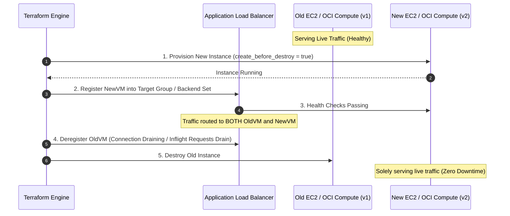

#### AWS Implementation
Zero-downtime EC2 replacement behind an ALB using `create_before_destroy`, `name_prefix`, and `ignore_changes`: [Doc: Terraform AWS Provider Lifecycle, checked 2026].

```hcl
# Security group configured for zero-downtime replacement
resource "aws_security_group" "web_sg" {
  name_prefix = "web-app-sg-" # Required for create_before_destroy
  description = "Security group for web tier"
  vpc_id      = var.vpc_id

  ingress {
    from_port   = 443
    to_port     = 443
    protocol    = "tcp"
    cidr_blocks = ["10.0.0.0/8"]
  }

  egress {
    from_port   = 0
    to_port     = 0
    protocol    = "-1"
    cidr_blocks = ["0.0.0.0/0"]
  }

  lifecycle {
    create_before_destroy = true
  }
}

# Launch Template with immutable version updates
resource "aws_launch_template" "web_lt" {
  name_prefix   = "web-lt-"
  image_id      = "ami-0c7217cdde317cfec" # Upgraded AMI ID
  instance_type = "c6i.xlarge"

  network_interfaces {
    associate_public_ip_address = false
    security_groups             = [aws_security_group.web_sg.id]
  }

  user_data = base64encode(file("${path.module}/userdata.sh"))

  lifecycle {
    create_before_destroy = true
  }
}

# Auto Scaling Group using instance refresh for rolling zero-downtime updates
resource "aws_autoscaling_group" "web_asg" {
  name_prefix         = "web-asg-"
  min_size            = 4
  max_size            = 12
  desired_capacity    = 6
  vpc_zone_identifier = var.private_subnet_ids

  launch_template {
    id      = aws_launch_template.web_lt.id
    version = "$Latest"
  }

  # Instance refresh guarantees rolling upgrade without service disruption
  instance_refresh {
    strategy = "Rolling"
    preferences {
      min_healthy_percentage = 90
      instance_warmup        = 300
    }
    triggers = ["tag"]
  }

  lifecycle {
    create_before_destroy = true
    # Ignore capacity mutated by AWS Target Tracking Auto Scaling
    ignore_changes = [desired_capacity]
  }
}

# Production database protected from accidental deletion
resource "aws_rds_cluster" "aurora_prod" {
  cluster_identifier = "prod-aurora-cluster"
  engine             = "aurora-postgresql"
  engine_version     = "16.2"
  database_name      = "production"
  master_username    = "dbadmin"
  master_password    = var.db_password
  deletion_protection = true

  lifecycle {
    prevent_destroy = true
  }
}
```

#### OCI Implementation
Zero-downtime instance pool replacement and OCI Network Security Group (NSG) lifecycle rules: [Doc: OCI Compute Instance Pool & Lifecycle Rules, checked 2026].

```hcl
# Network Security Group with create_before_destroy
resource "oci_core_network_security_group" "web_nsg" {
  compartment_id = var.compartment_id
  vcn_id         = var.vcn_id
  display_name   = "prod-web-nsg"

  lifecycle {
    create_before_destroy = true
  }
}

# Instance Configuration specifying new image / shape
resource "oci_core_instance_configuration" "web_config" {
  compartment_id = var.compartment_id
  display_name   = "prod-web-config-${formatdate("YYYYMMDDhhmmss", timestamp())}"

  instance_details {
    instance_type = "compute"
    launch_details {
      compartment_id = var.compartment_id
      shape          = "VM.Standard3.Flex"
      
      shape_config {
        ocpus         = 4
        memory_in_gbs = 32
      }

      source_details {
        source_type = "image"
        image_id    = var.latest_custom_image_ocid
      }
    }
  }

  lifecycle {
    create_before_destroy = true
    ignore_changes        = [display_name]
  }
}

# Instance Pool executing rolling zero-downtime replacement
resource "oci_core_instance_pool" "web_pool" {
  compartment_id            = var.compartment_id
  instance_configuration_id = oci_core_instance_configuration.web_config.id
  size                      = 4
  display_name              = "prod-web-instance-pool"

  placement_configurations {
    availability_domain = var.ad1
    primary_subnet_id   = var.subnet_ocid
  }

  load_balancers {
    load_balancer_id = var.lb_ocid
    backend_set_name = var.backend_set_name
    port             = 8080
    vnic_selection   = "PrimaryVnic"
  }

  lifecycle {
    create_before_destroy = true
    # Ignore autoscaling size changes triggered by OCI Autoscaling policies
    ignore_changes = [size]
  }
}

# Production Autonomous Database protected from destruction
resource "oci_database_autonomous_database" "prod_db" {
  compartment_id           = var.compartment_id
  db_name                  = "proddb01"
  cpu_core_count           = 8
  data_storage_size_in_tbs = 4
  db_workload              = "OLTP"
  is_free_tier             = false

  lifecycle {
    prevent_destroy = true
  }
}
```

#### Common Trap
Enabling `create_before_destroy = true` on a resource without applying it to all downstream resources that depend on it. If Resource A has `create_before_destroy = true` but dependent Resource B does not, Terraform encounters a circular dependency deadlock during graph generation: to destroy old Resource A, it must destroy Resource B, but Resource B must point to the new Resource A before old A can be destroyed. Any resource in a dependency chain using `create_before_destroy` requires that upstream and downstream linked resources also support `create_before_destroy`.

#### Follow-up Question
What happens if you run `terraform destroy` on a module containing a resource marked with `lifecycle { prevent_destroy = true }`?

*Answer*: The execution aborts immediately during the planning phase. Terraform generates an error message: `Resource <name> has lifecycle.prevent_destroy set, but the plan calls for this resource to be destroyed`. The destroy command refuses to generate or execute a destruction plan until the engineer explicitly removes or sets `prevent_destroy = false` in code.

---

### Q437: Refactoring and Renaming Terraform Resources without Destruction

#### Question
How do you refactor monolithic Terraform code into reusable sub-modules or rename resource identifiers without causing Terraform to plan the destruction and recreation of existing live infrastructure?

#### Short Answer
Historically, renaming a resource or moving it into a child module caused Terraform to treat the old identifier as deleted and the new identifier as newly created, triggering catastrophic infrastructure destruction. In modern Terraform (1.1+), you use declarative `moved` blocks directly in HCL code to instruct the state engine that an address has changed. For legacy workflows or ad-hoc operations, you can use CLI state manipulation (`terraform state mv`). Declarative `moved` blocks are strongly preferred because they are tracked in version control, self-documenting, and execute automatically across all team member and CI/CD runs without manual state locking.

#### Deep Answer
Terraform binds code to real-world cloud resources via an internal **resource address schema**:
- Root level: `aws_instance.web`
- Inside a module: `module.compute.aws_instance.web`
- Inside an indexed module: `module.vpc["prod"].aws_subnet.private[0]`

When a developer refactors code by moving an existing resource into a module, the address changes from `aws_s3_bucket.logs` to `module.logging.aws_s3_bucket.logs`. Without refactoring directives:
1. `terraform plan` flags `aws_s3_bucket.logs` for **DESTRUCTION**.
2. `terraform plan` flags `module.logging.aws_s3_bucket.logs` for **CREATION**.
3. Applying this deletes the production S3 bucket containing years of audit logs!

**Refactoring Mechanisms**:

1. **Declarative `moved` Blocks (Terraform 1.1+)**:
   - Written directly in `.tf` code alongside resources.
   - Syntax:
     ```hcl
     moved {
       from = aws_security_group.legacy_sg
       to   = aws_security_group.app_sg
     }
     ```
   - Across module boundaries:
     ```hcl
     moved {
       from = aws_instance.web
       to   = module.web_cluster.aws_instance.server
     }
     ```
   - When any pipeline or developer runs `terraform plan`, Terraform recognizes the address migration, mutates the state graph metadata in-memory, and calculates an empty diff (`0 to add, 0 to change, 0 to destroy`).
   - `moved` blocks can be kept permanently or pruned after all deployment environments (dev, stage, prod) have executed `terraform apply`.

2. **Imperative CLI State Manipulation (`terraform state mv`)**:
   - Syntax: `terraform state mv aws_instance.web module.web_cluster.aws_instance.server`
   - *Risks*: Highly error-prone; requires write access to remote state backends; requires manual coordination across multi-environment state files; leaves no Git audit trail.

3. **Refactoring Module Iteration (`count` to `for_each`)**:
   - Moving from `count` indices (`aws_subnet.public[0]`, `aws_subnet.public[1]`) to keyed maps (`aws_subnet.public["us-east-1a"]`, `aws_subnet.public["us-east-1b"]`) can be executed cleanly with mapped `moved` blocks:
     ```hcl
     moved {
       from = aws_subnet.public[0]
       to   = aws_subnet.public["us-east-1a"]
     }
     ```

#### Architecture
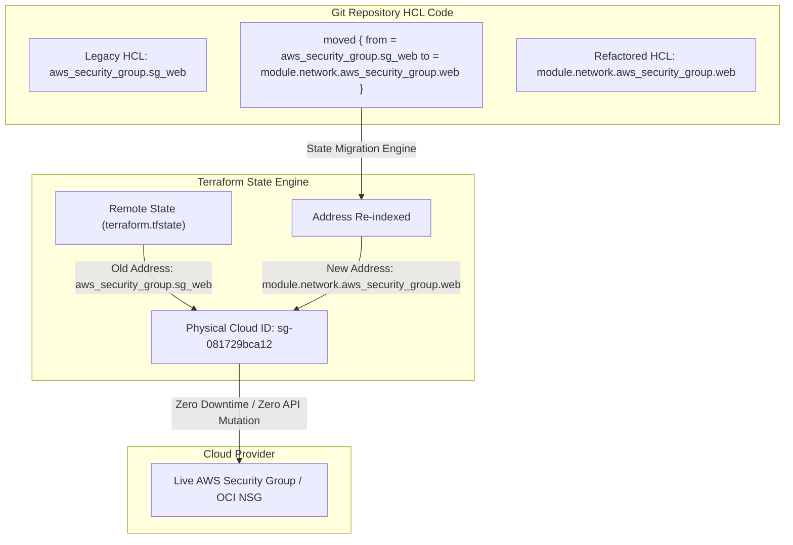

#### AWS Implementation
Refactoring standalone AWS VPC and Security Group resources into an encapsulated module using declarative `moved` blocks: [Doc: Terraform State Refactoring & moved blocks, checked 2026].

```hcl
# =========================================================================
# File: main.tf (Root Configuration after refactoring)
# =========================================================================

# Declarative moved blocks linking legacy root resources to child module
moved {
  from = aws_vpc.main
  to   = module.vpc.aws_vpc.this
}

moved {
  from = aws_internet_gateway.gw
  to   = module.vpc.aws_internet_gateway.this[0]
}

moved {
  from = aws_subnet.public_a
  to   = module.vpc.aws_subnet.public["us-east-1a"]
}

moved {
  from = aws_subnet.public_b
  to   = module.vpc.aws_subnet.public["us-east-1b"]
}

# Invocation of the newly introduced VPC module
module "vpc" {
  source = "./modules/vpc"

  cidr_block = "10.100.0.0/16"
  public_subnets = {
    "us-east-1a" = "10.100.1.0/24"
    "us-east-1b" = "10.100.2.0/24"
  }
}

# =========================================================================
# File: modules/vpc/main.tf (Inside the reusable child module)
# =========================================================================
variable "cidr_block" {
  type = string
}

variable "public_subnets" {
  type = map(string)
}

resource "aws_vpc" "this" {
  cidr_block           = var.cidr_block
  enable_dns_hostnames = true
  enable_dns_support   = true

  tags = {
    Name = "production-vpc"
  }
}

resource "aws_internet_gateway" "this" {
  count  = length(var.public_subnets) > 0 ? 1 : 0
  vpc_id = aws_vpc.this.id
}

resource "aws_subnet" "public" {
  for_each                = var.public_subnets
  vpc_id                  = aws_vpc.this.id
  cidr_block              = each.value
  availability_zone       = each.key
  map_public_ip_on_launch = true

  tags = {
    Name = "public-subnet-${each.key}"
  }
}
```

#### OCI Implementation
Refactoring OCI Core Virtual Cloud Network (VCN) and Internet Gateway into a modular architecture using `moved` blocks: [Doc: OCI Provider & Terraform State Refactoring, checked 2026].

```hcl
# =========================================================================
# File: main.tf (Root configuration)
# =========================================================================

# Preserve existing VCN and gateways in state during refactoring
moved {
  from = oci_core_vcn.primary_vcn
  to   = module.core_network.oci_core_vcn.this
}

moved {
  from = oci_core_internet_gateway.primary_ig
  to   = module.core_network.oci_core_internet_gateway.this
}

# Invoke the newly created network module
module "core_network" {
  source = "./modules/network"

  compartment_ocid = var.compartment_ocid
  vcn_cidr         = "172.16.0.0/16"
  vcn_display_name = "corp-prod-vcn"
}

# =========================================================================
# File: modules/network/main.tf
# =========================================================================
variable "compartment_ocid" {
  type = string
}

variable "vcn_cidr" {
  type = string
}

variable "vcn_display_name" {
  type = string
}

resource "oci_core_vcn" "this" {
  compartment_id = var.compartment_ocid
  cidr_blocks    = [var.vcn_cidr]
  display_name   = var.vcn_display_name
  dns_label      = "corpvcn"
}

resource "oci_core_internet_gateway" "this" {
  compartment_id = var.compartment_ocid
  vcn_id         = oci_core_vcn.this.id
  display_name   = "${var.vcn_display_name}-igw"
  enabled        = true
}

output "vcn_id" {
  value = oci_core_vcn.this.id
}
```

#### Common Trap
Accidentally applying `moved` blocks when moving resources between two **different** remote state files. `moved` blocks only operate within a single Terraform configuration / single state file. If you are splitting a monolithic `terraform.tfstate` into two separate state backends (e.g., separating networking from compute), `moved` blocks cannot bridge the state boundary. You must use `terraform state rm <address>` in the source repository and declarative `import` blocks or `terraform import` in the destination repository.

#### Follow-up Question
When can you safely delete a `moved` block from your Terraform codebase?

*Answer*: A `moved` block can be safely removed once `terraform apply` has run successfully across **all** deployment environments (development, testing, staging, and production workspaces). If you delete the `moved` block before an environment (e.g., Disaster Recovery in a secondary region) has run an apply, that environment's state will not know about the address translation and will attempt to destroy the old resource and recreate the new one.

---

### Q438: Policy as Code and Security Guardrails in CI/CD (OPA/Rego, Sentinel, Checkov)

#### Question
How do you enforce security guardrails, cost controls, and compliance rules on Terraform configurations before infrastructure is provisioned, and what are the trade-offs between static HCL analysis and plan-time evaluation?

#### Short Answer
Policy as Code (PaC) automates the enforcement of security, architectural, and financial policies within CI/CD pipelines. There are two primary enforcement layers: (1) **Static Analysis / AST Scanning** (e.g., Checkov, tfsec/Trivy) which parses raw HCL code without executing provider plugins to catch syntax misconfigurations (e.g., unencrypted S3 buckets, open security groups); and (2) **Plan-Time Evaluation** (e.g., Open Policy Agent (OPA) with Rego, HashiCorp Sentinel) which inspects the compiled JSON execution plan (`terraform show -json tfplan.binary`). Plan-time evaluation is superior for catching dynamically computed values, resource counts, instance sizes, and cross-resource contextual relationships.

#### Deep Answer
Enterprise cloud security requires shifting policy enforcement left into the pull request lifecycle before infrastructure touches cloud APIs.

**Comparison of Enforcement Tools**:

| Capability | Checkov / Trivy | Open Policy Agent (OPA) / Rego | HashiCorp Sentinel |
| :--- | :--- | :--- | :--- |
| **Input Format** | Raw `.tf` HCL files | Compiled `tfplan.json` | Sentinel runtime objects (TFC/TFE) |
| **Evaluation Timing** | Pre-plan (commit/PR time) | Post-plan (speculative execution) | Post-plan inside Terraform Cloud |
| **Dynamic Value Support**| Weak (cannot resolve variables from remote state or dynamic loops) | Full (evaluates final computed attributes in plan JSON) | Full (evaluates structured plan and state graphs) |
| **Licensing** | Open Source (Bridgecrew/Palo Alto) | Open Source (Cloud Native Computing Foundation) | Proprietary (HashiCorp Enterprise) |
| **Cost Rules** | Limited | Yes (cross-reference Infracost plan JSON) | Yes (enforce hard budget limits) |

**Plan-Time Evaluation Mechanics with OPA**:
1. Run `terraform plan -out=tfplan.binary`.
2. Convert the binary plan to structured JSON: `terraform show -json tfplan.binary > tfplan.json`.
3. Evaluate OPA policies: `opa eval --input tfplan.json --data policies/ "data.terraform.deny"`.
4. The plan JSON contains `resource_changes` array detailing `change.actions` (`create`, `update`, `delete`) and `change.after` (the desired post-apply configuration).
5. If any rule evaluates to `deny`, the CI/CD pipeline returns exit code `1`, halting deployment before `terraform apply` can execute.

#### Architecture
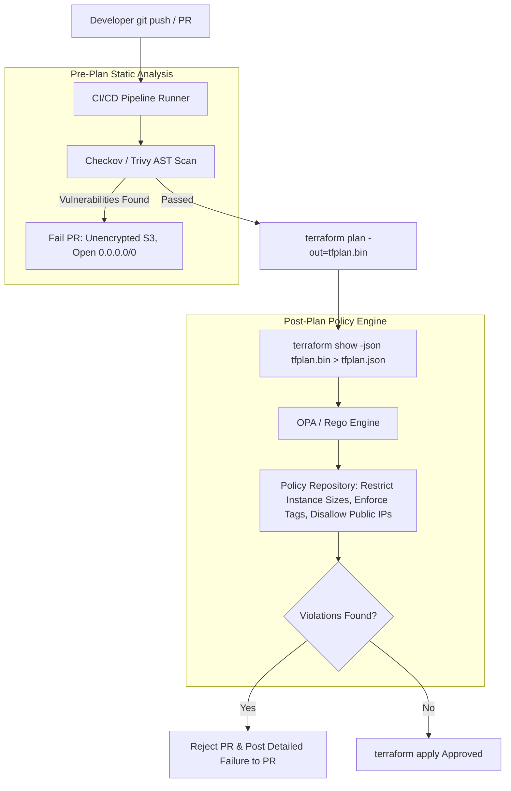

#### AWS Implementation
Enforcing encryption-at-rest and prohibiting public S3 buckets using Open Policy Agent (OPA) and Rego: [Doc: Terraform Plan JSON & OPA Integration, checked 2026].

```rego
# policies/aws_s3_guardrails.rego
package terraform.aws

import future.keywords.in

default allow = false

# Collect all resources being created or modified
resource_changes[res] {
    some res in input.resource_changes
    res.type == "aws_s3_bucket"
    "create" in res.change.actions
}

# Rule 1: Deny S3 buckets without server-side encryption configuration
deny[msg] {
    some res in input.resource_changes
    res.type == "aws_s3_bucket_server_side_encryption_configuration"
    "create" in res.change.actions

    # Check if KMS or AES256 rule is missing
    rules := res.change.after.rule
    count(rules) == 0
    msg := sprintf("CRITICAL: S3 Bucket encryption rule missing in '%v'", [res.address])
}

# Rule 2: Deny EC2 instances with unauthorized expensive shapes
unauthorized_ec2_types := ["p4d.24xlarge", "p5.48xlarge", "u-12tb1.112xlarge"]

deny[msg] {
    some res in input.resource_changes
    res.type == "aws_instance"
    res.change.after.instance_type in unauthorized_ec2_types
    msg := sprintf("COST ALERT: Instance '%v' uses unapproved expensive shape '%v'. Requires CTO approval.", [
        res.address,
        res.change.after.instance_type
    ])
}

# Allow if zero deny rules are triggered
allow {
    count(deny) == 0
}
```

CI Step executing OPA validation against the generated AWS plan:
```bash
#!/usr/bin/env bash
set -euo pipefail

# 1. Generate binary plan
terraform plan -out=tfplan.binary

# 2. Convert to JSON
terraform show -json tfplan.binary > tfplan.json

# 3. Evaluate OPA policy
VIOLATIONS=$(opa eval --input tfplan.json --data policies/aws_s3_guardrails.rego "data.terraform.aws.deny" --format json | jq -r '.result[0].expressions[0].value[]')

if [ -n "$VIOLATIONS" ]; then
  echo "================================================="
  echo "POLICY VIOLATION DETECTED - DEPLOYMENT REJECTED"
  echo "================================================="
  echo "$VIOLATIONS"
  exit 1
fi

echo "All security and cost policies passed successfully."
```

#### OCI Implementation
Enforcing OCI security guardrails (prohibiting Public Subnets in sensitive VCNs and enforcing mandatory Cost Center tags) using Checkov and OCI Resource Manager Policy: [Doc: OCI Resource Manager Guardrails & Checkov, checked 2026].

```python
# checkov/custom_checks/OCIRequireSubnetPrivate.py
# Custom Checkov policy inspecting OCI Subnets
from checkov.common.models.enums import CheckResult, CheckCategories
from checkov.terraform.checks.resource.base_resource_check import BaseResourceCheck

class OCIRequireSubnetPrivate(BaseResourceCheck):
    def __init__(self):
        name = "Ensure OCI subnets are private unless explicitly tagged public-ingress"
        id = "CKV_OCI_CUSTOM_101"
        supported_resources = ['oci_core_subnet']
        categories = [CheckCategories.NETWORKING]
        super().__init__(name=name, id=id, categories=categories, supported_resources=supported_resources)

    def scan_resource_conf(self, conf):
        # prohibit_public_ip_on_vnic defaults to false in OCI API
        prohibit_public = conf.get('prohibit_public_ip_on_vnic')
        
        if prohibit_public and prohibit_public[0] is True:
            return CheckResult.PASSED

        # Check for approved waiver tag
        tags = conf.get('freeform_tags', [{}])[0]
        if tags.get('AllowPublic') == "true":
            return CheckResult.PASSED

        return CheckResult.FAILED

check = OCIRequireSubnetPrivate()
```

HCL snippet demonstrating compliant OCI infrastructure:
```hcl
resource "oci_core_subnet" "compliant_private_subnet" {
  compartment_id             = var.compartment_id
  vcn_id                     = var.vcn_id
  cidr_block                 = "10.0.10.0/24"
  display_name               = "prod-secure-backend-subnet"
  prohibit_public_ip_on_vnic = true # Guarantees instances receive private IPs only

  freeform_tags = {
    "Environment" = "Production"
    "CostCenter"  = "Engineering-104"
  }
}
```

#### Common Trap
Relying entirely on pre-commit static AST scanners (like Checkov) to prevent configuration breaches. AST scanners inspect raw text without executing Terraform functions, referencing remote state, or resolving variables like `var.env == "prod" ? "t3.micro" : var.large_instance`. Only **plan-time JSON evaluation** (OPA/Sentinel) sees the final computed values that will actually be submitted to cloud provider APIs. A robust architecture uses Checkov for fast developer feedback during code editing, and OPA/Sentinel at PR merge time on the compiled plan JSON.

#### Follow-up Question
How can an engineer deliberately bypass a hard-mandatory Policy as Code rule in an emergency incident?

*Answer*: Production systems must implement a cryptographically audited "Break-Glass" mechanism. This is implemented via GitHub PR labels (e.g., `security-break-glass-approved`) requiring dual approvals from Security Leads, or passing a signed dynamic token into the policy engine that logs the bypass event directly to an immutable SIEM/Security Lake before unlocking the apply stage.

---

### Q439: Multi-Region and Multi-Provider Orchestration (AWS and OCI Cross-Cloud)

#### Question
How do you architect Terraform configurations that deploy interdependent infrastructure across multiple geographic regions or simultaneously orchestrate resources across both AWS and Oracle Cloud Infrastructure (OCI)?

#### Short Answer
Terraform orchestrates multi-region and multi-cloud architectures using **Provider Aliases**. By declaring multiple `provider` blocks with distinct `alias` labels (e.g., `aws.us_east_1`, `aws.eu_west_1`, `oci.ashburn`), modules and resources explicitly bind to designated providers via the `provider = <provider>.<alias>` meta-argument. For cross-cloud topologies (e.g., AWS EKS consuming an OCI Autonomous Database, or private cross-cloud FastConnect/Direct Connect interconnects), Terraform evaluates a unified Directed Acyclic Graph (DAG), resolving cross-provider dependencies (such as passing an OCI CIDR block into an AWS Route Table) sequentially.

#### Deep Answer
Enterprise multi-region (active-active DR) and multi-cloud (hybrid architecture) IaC requires managing provider lifecycles and avoiding provider coupling:

1. **Provider Alias Mechanics**:
   - The default provider (without an alias) acts as the fallback for any resource that does not specify an explicit provider.
   - Aliased providers allow instantiation of identical providers with distinct regions, IAM roles, or tenancies:
     ```hcl
     provider "aws" { region = "us-east-1" }
     provider "aws" { alias = "dr"; region = "us-west-2" }
     provider "oci" { alias = "oci_iad"; region = "us-ashburn-1" }
     ```

2. **Passing Providers to Child Modules**:
   - In modern Terraform, modules must declare `required_providers` with `configuration_aliases`.
   - The root configuration maps explicit provider aliases into the module via the `providers` map argument:
     ```hcl
     module "multi_region_network" {
       source = "./modules/cross_region_peering"
       providers = {
         aws.primary = aws
         aws.peer    = aws.dr
       }
     }
     ```

3. **Cross-Cloud Dependency Graphs**:
   - Terraform builds a single unified DAG across all declared providers.
   - If an AWS resource references an OCI output (e.g., `aws_route.to_oci.destination_cidr_block = oci_core_vcn.primary.cidr_blocks[0]`), the graph engine guarantees that the OCI VCN is provisioned first, captures its CIDR, and injects it into the AWS route table API call.
   - *Failure Domain Hazard*: If the OCI API suffers an outage, running `terraform plan` on the shared state file will halt entirely because Terraform refreshes all provider resources simultaneously. Cross-cloud micro-state separation using `terraform_remote_state` is critical for production isolation.

#### Architecture
```mermaid
graph TD
    subgraph Terraform Unified Graph Engine
        Root[Root Module: multi-cloud.tf]
        Root -->|providers = { aws = aws.us_east_1 }| ModAWS[Module: AWS Web Tier]
        Root -->|providers = { oci = oci.ashburn }| ModOCI[Module: OCI Database Tier]
    end

    subgraph Amazon Web Services us-east-1
        ModAWS --> EKS[EKS Worker Nodes / VPC 10.0.0.0/16]
        EKS --> VGW[AWS Virtual Private Gateway / Direct Connect]
    end

    subgraph Oracle Cloud Infrastructure us-ashburn-1
        ModOCI --> ATP[Autonomous Database / VCN 172.16.0.0/16]
        ATP --> DRG[OCI Dynamic Routing Gateway / FastConnect]
    end

    VGW <===>|Cross-Cloud Megaport / Equinix Interconnect| DRG
```

#### AWS Implementation
Root module orchestrating an AWS VPC peering connection between `us-east-1` (Primary) and `us-west-2` (DR): [Doc: Terraform AWS Provider Aliases & Peering, checked 2026].

```hcl
# providers.tf - Multi-Region Provider Definitions
terraform {
  required_version = ">= 1.5.0"
  required_providers {
    aws = {
      source  = "hashicorp/aws"
      version = "~> 5.40.0"
    }
  }
}

provider "aws" {
  region = "us-east-1"
  # Default provider
}

provider "aws" {
  alias  = "dr_region"
  region = "us-west-2"
}

# Primary VPC in us-east-1
resource "aws_vpc" "primary" {
  cidr_block           = "10.100.0.0/16"
  enable_dns_hostnames = true
  tags = { Name = "primary-us-east-1-vpc" }
}

# DR VPC in us-west-2
resource "aws_vpc" "dr" {
  provider             = aws.dr_region
  cidr_block           = "10.200.0.0/16"
  enable_dns_hostnames = true
  tags = { Name = "dr-us-west-2-vpc" }
}

# Requester side of peering (us-east-1)
resource "aws_vpc_peering_connection" "primary_to_dr" {
  vpc_id      = aws_vpc.primary.id
  peer_vpc_id = aws_vpc.dr.id
  peer_region = "us-west-2"
  auto_accept = false

  tags = { Name = "cross-region-peering-us-east-to-west" }
}

# Accepter side of peering (us-west-2)
resource "aws_vpc_peering_connection_accepter" "dr_accepter" {
  provider                  = aws.dr_region
  vpc_peering_connection_id = aws_vpc_peering_connection.primary_to_dr.id
  auto_accept               = true

  tags = { Name = "cross-region-peering-dr-accepter" }
}
```

#### OCI Implementation
Multi-Cloud orchestration file declaring both AWS and OCI providers, deploying an OCI Dynamic Routing Gateway (DRG) connected to an AWS Direct Connect Gateway: [Doc: OCI Provider Multi-Region Configuration & Cross-Cloud Routing, checked 2026].

```hcl
# providers.tf - Hybrid AWS + OCI Orchestration
terraform {
  required_version = ">= 1.5.0"
  required_providers {
    aws = {
      source  = "hashicorp/aws"
      version = "~> 5.40.0"
    }
    oci = {
      source  = "oracle/oci"
      version = "~> 5.30.0"
    }
  }
}

provider "aws" {
  region = "us-east-1"
}

provider "oci" {
  tenancy_ocid     = var.oci_tenancy_ocid
  user_ocid        = var.oci_user_ocid
  fingerprint      = var.oci_fingerprint
  private_key_path = var.oci_private_key_path
  region           = "us-ashburn-1"
}

# OCI VCN hosting Oracle Autonomous Database
resource "oci_core_vcn" "db_vcn" {
  compartment_id = var.oci_compartment_ocid
  cidr_blocks    = ["172.16.0.0/16"]
  display_name   = "oci-hybrid-db-vcn"
}

# OCI Dynamic Routing Gateway (DRG v2) for Hybrid Interconnect
resource "oci_core_drg" "hybrid_drg" {
  compartment_id = var.oci_compartment_ocid
  display_name   = "oci-to-aws-drg"
}

resource "oci_core_drg_attachment" "vcn_attachment" {
  drg_id = oci_core_drg.hybrid_drg.id
  network_details {
    id   = oci_core_vcn.db_vcn.id
    type = "VCN"
  }
}

# Cross-Cloud Reference: Inject OCI VCN CIDR into AWS VPC Route Table!
resource "aws_route" "route_to_oci" {
  route_table_id         = var.aws_main_route_table_id
  destination_cidr_block = oci_core_vcn.db_vcn.cidr_blocks[0] # Dynamic Cross-Cloud evaluation
  gateway_id             = var.aws_direct_connect_gateway_id
}
```

#### Common Trap
Placing multiple cloud providers inside a single monolithic state file for production infrastructure. If either cloud provider's API experiences degraded performance, authentication token expirations, or service disruption during an incident, running `terraform plan` or `terraform apply` fails completely, freezing all changes across both clouds. Production best practice mandates separating AWS resources into an AWS-specific state file and OCI resources into an OCI-specific state file, linking them asynchronously via `data.terraform_remote_state` or parameter store / SSM endpoints.

#### Follow-up Question
How do you dynamically configure provider regions without hardcoding them in `provider` blocks?

*Answer*: Providers do not accept dynamic input variables within modules (`module providers` blocks cannot depend on computed outputs). However, root provider configurations accept standard input variables: `provider "aws" { region = var.aws_region }`. If multi-region deployment demands dynamic loops over an arbitrary list of regions, you must either invoke Terraform multiple times per region using workspaces/CLI flags, or use Teragrunt to generate provider configurations dynamically.

---

### Q440: Teragrunt and DRY IaC Orchestration at Scale

#### Question
How does Teragrunt eliminate boilerplate code and manage complex multi-tier, multi-account dependency trees in enterprise Terraform deployments, and what architectural trade-offs does it introduce compared to native Terraform?

#### Short Answer
Teragrunt is an orchestration wrapper for Terraform that solves two core limitations of native Terraform: (1) repetitive backend and provider declarations (DRY principle), and (2) orchestrating deployments across multiple isolated state files. By using `teragrunt.hcl` configuration files with `include`, `generate`, and `dependency` blocks, Teragrunt automatically derives remote backend paths from the filesystem hierarchy, generates provider blocks dynamically, and resolves inter-module state dependencies with automatic ordering via `teragrunt run-all apply`.

#### Deep Answer
In large-scale enterprise deployments managing hundreds of AWS accounts or OCI compartments, native Terraform suffers from massive code duplication: every single environment (`dev/us-east-1/vpc`, `prod/us-east-1/vpc`) requires copy-pasting `backend "s3"` blocks and `provider "aws"` blocks. Furthermore, native Terraform cannot natively orchestrate dependencies across independent state backends in a single command.

**Core Teragrunt Capabilities**:

1. **DRY Remote State Generation (`remote_state` and `generate`)**:
   - A single root `teragrunt.hcl` defines the remote backend template (e.g., S3/DynamoDB or OCI Object Storage).
   - Leaf `teragrunt.hcl` files inherit the backend via `include "root" {}`. Teragrunt dynamically constructs the state key based on the directory path: `prod/us-east-1/vpc/terraform.tfstate`.

2. **Inter-Module Dependency Trees (`dependency` blocks)**:
   - Instead of fragile, loosely typed `data.terraform_remote_state` blocks, Teragrunt defines typed dependencies:
     ```hcl
     dependency "vpc" {
       config_path = "../vpc"
     }
     inputs = {
       subnet_ids = dependency.vpc.outputs.private_subnets
     }
     ```
   - When running `teragrunt run-all apply`, Teragrunt calculates a Directed Acyclic Graph (DAG) across all directory nodes and deploys them in topological order, running independent modules in parallel.

3. **Hierarchical Variable Inheritance (`read_teragrunt_config`)**:
   - Variables are loaded hierarchically (`account.hcl` -> `region.hcl` -> `env.hcl`), merging inputs cleanly so environment parameters are declared exactly once.

**Trade-offs & Production Risks**:
- *Tooling Overhead*: Requires teams and CI/CD pipelines to install, manage, and debug an extra abstraction binary.
- *`run-all` Concurrency Hazards*: In large trees, `run-all apply` can trigger hundreds of concurrent API calls, hitting AWS/OCI API rate limits and throttling tokens.
- *Partial Failure Recovery*: If module 3 of 10 fails during `run-all apply`, state can be left partially applied across multiple backends, requiring manual step-by-step remediation.

#### Architecture
```mermaid
graph TD
    Root["Root teragrunt.hcl (Generates Backend & Providers)"]
    
    subgraph Filesystem Hierarchy
        Root --> Acc["us-prod-account (account.hcl)"]
        Acc --> Reg["us-east-1 (region.hcl)"]
        Reg --> VPC["vpc/teragrunt.hcl (Leaf Node: VPC State)"]
        Reg --> App["app/teragrunt.hcl (Leaf Node: App State)"]
        Reg --> DB["db/teragrunt.hcl (Leaf Node: DB State)"]
    end

    VPC -->|Exposes vpc_id, subnet_ids| DB
    VPC -->|Exposes subnet_ids| App
    DB -->|Exposes db_endpoint| App
    
    Note over App: Teragrunt run-all apply resolves graph: 1. VPC -> 2. DB -> 3. App
```

#### AWS Implementation
A production Teragrunt architecture demonstrating root backend generation and a leaf application module referencing a VPC dependency: [Doc: Teragrunt Configuration & AWS Automation, checked 2026].

```hcl
# =========================================================================
# File: /infra/teragrunt.hcl (Root Configuration)
# =========================================================================
locals {
  account_vars = read_teragrunt_config(find_in_parent_folders("account.hcl"))
  region_vars  = read_teragrunt_config(find_in_parent_folders("region.hcl"))
  aws_region   = local.region_vars.locals.aws_region
  account_id   = local.account_vars.locals.aws_account_id
}

# Auto-generate backend configuration for all child modules
remote_state {
  backend = "s3"
  generate = {
    path      = "backend_generated.tf"
    if_exists = "overwrite_teragrunt"
  }
  config = {
    bucket         = "corp-tfstate-${local.account_id}-${local.aws_region}"
    key            = "${path_relative_to_include()}/terraform.tfstate"
    region         = local.aws_region
    encrypt        = true
    dynamodb_table = "terraform-locks"
  }
}

# Auto-generate AWS provider with assume_role
generate "provider" {
  path      = "provider_generated.tf"
  if_exists = "overwrite_teragrunt"
  contents  = <<EOF
provider "aws" {
  region = "${local.aws_region}"
  assume_role {
    role_arn = "arn:aws:iam::${local.account_id}:role/TerraformDeployerRole"
  }
}
EOF
}

# =========================================================================
# File: /infra/prod/us-east-1/app/teragrunt.hcl (Leaf Module Configuration)
# =========================================================================
include "root" {
  path = find_in_parent_folders()
}

terraform {
  source = "git::git@github.com:corp/terraform-aws-service.git//modules/ecs-service?ref=v2.4.0"
}

# Explicit dependency on VPC state
dependency "vpc" {
  config_path = "../vpc"
  mock_outputs = {
    vpc_id          = "vpc-00000000000000000"
    private_subnets = ["subnet-00000001", "subnet-00000002"]
  }
}

inputs = {
  service_name   = "order-processing-api"
  vpc_id         = dependency.vpc.outputs.vpc_id
  subnet_ids     = dependency.vpc.outputs.private_subnets
  container_port = 8080
  desired_count  = 6
}
```

#### OCI Implementation
Teragrunt configuration managing OCI compartments and Object Storage remote backends: [Doc: Teragrunt OCI Provider & Architecture, checked 2026].

```hcl
# =========================================================================
# File: /oci-infra/teragrunt.hcl (Root OCI Configuration)
# =========================================================================
locals {
  tenancy_vars = read_teragrunt_config(find_in_parent_folders("tenancy.hcl"))
  region_vars  = read_teragrunt_config(find_in_parent_folders("region.hcl"))
  oci_region   = local.region_vars.locals.oci_region
  tenancy_ocid = local.tenancy_vars.locals.tenancy_ocid
}

remote_state {
  backend = "s3"
  generate = {
    path      = "backend_oci.tf"
    if_exists = "overwrite_teragrunt"
  }
  config = {
    bucket   = "corp-oci-tfstate-${local.oci_region}"
    key      = "${path_relative_to_include()}/terraform.tfstate"
    region   = local.oci_region
    endpoint = "https://${local.tenancy_vars.locals.ns}.compat.objectstorage.${local.oci_region}.oraclecloud.com"
    skip_region_validation      = true
    skip_credentials_validation = true
    skip_metadata_api_check     = true
    force_path_style            = true
  }
}

generate "provider" {
  path      = "provider_oci.tf"
  if_exists = "overwrite_teragrunt"
  contents  = <<EOF
provider "oci" {
  region       = "${local.oci_region}"
  tenancy_ocid = "${local.tenancy_ocid}"
  auth         = "InstancePrincipal"
}
EOF
}

# =========================================================================
# File: /oci-infra/prod/us-ashburn-1/database/teragrunt.hcl
# =========================================================================
include "root" {
  path = find_in_parent_folders()
}

terraform {
  source = "git::git@github.com:corp/oci-modules.git//modules/atp-database?ref=v1.2.0"
}

dependency "network" {
  config_path = "../network"
  mock_outputs = {
    subnet_ocid = "ocid1.subnet.oc1.iad.mocksubnet"
  }
}

inputs = {
  compartment_ocid = "ocid1.compartment.oc1..prodcompartment"
  db_name          = "corpfinprod"
  subnet_ocid      = dependency.network.outputs.subnet_ocid
  cpu_core_count   = 4
}
```

#### Common Trap
Failing to specify `mock_outputs` on `dependency` blocks. When running `teragrunt plan` on a fresh repository where the upstream dependency (e.g., VPC) has not yet been applied, the upstream output does not exist in state. Without `mock_outputs`, Teragrunt halts with an error: `Output not found`. By providing `mock_outputs` with `mock_outputs_allowed_terraform_commands = ["validate", "plan"]`, Teragrunt can generate speculative plans safely before the foundational layers are deployed.

#### Follow-up Question
How does Teragrunt handle concurrency when running `teragrunt run-all apply` across 50 independent micro-state folders?

*Answer*: Teragrunt uses a worker pool mechanism controlled by the `--teragrunt-parallelism <N>` CLI flag (defaulting to unlimited or system CPU capacity). It constructs a Directed Acyclic Graph (DAG) of the directories based on `dependency` links, executes independent nodes concurrently up to the parallelism limit, and blocks dependent nodes until all prerequisite modules report successful exit code `0`.

---

### Q441: Terraform Cloud / Enterprise vs OCI Resource Manager (ORM)

#### Question
How do managed Infrastructure as Code execution platforms—specifically Terraform Cloud / Enterprise (TFC/TFE) and OCI Resource Manager (ORM)—differ in architecture, security posture, runner infrastructure, and governance from running self-hosted CLI pipelines?

#### Short Answer
Self-hosted CLI pipelines (e.g., running `terraform apply` inside Jenkins or generic GitHub Actions runners) create state locking contentions, require distributing sensitive cloud admin credentials into CI runners, and lack built-in IaC audit governance. Managed platforms solve this by hosting state natively, executing plans and applies in isolated ephemeral container sandboxes, enforcing Policy as Code guardrails, and providing run approval gates. Terraform Cloud offers multi-cloud flexibility, private agent pools, and Sentinel/OPA policies; OCI Resource Manager (ORM) provides a native, fully managed, zero-cost (free tier included) service within OCI tenancies using native IAM Instance Principals and built-in drift detection.

#### Deep Answer
Operating enterprise Terraform across dozens of cross-functional teams requires a managed execution plane rather than fragmented local CLI scripts.

**Comparative Analysis**:

| Feature | Self-Hosted CI/CD (GitHub Actions / Jenkins) | Terraform Cloud / Enterprise (TFC / TFE) | OCI Resource Manager (ORM) |
| :--- | :--- | :--- | :--- |
| **Execution Plane** | Self-managed VMs / ephemeral containers | Managed TFC cloud runners or Self-Hosted Private Agents | Managed Oracle Cloud container runners (zero infrastructure to manage) |
| **State Storage & Locking** | S3 + DynamoDB / OCI Object Storage | Native encrypted managed backend | Native managed backend inside tenancy |
| **Authentication & RBAC** | IAM Role assumption / OIDC / API keys | Workspace RBAC, Team access, HashiCorp Vault dynamic tokens | Native OCI IAM policies, Compartments, Tag-based access |
| **Policy Enforcement** | Custom scripts, Checkov, OPA in pipeline | Sentinel & OPA integrated into run pipeline before apply | Built-in Resource Manager limits, OCI IAM Policy, Checkov |
| **Drift Detection** | Scheduled CI pipeline cron jobs | Scheduled Drift Detection (TFC Plus/Enterprise) | Native 1-click & scheduled drift detection jobs |
| **Multi-Cloud Support** | Unrestricted (Any provider) | Unrestricted (AWS, Azure, OCI, GCP, Kubernetes) | Primary focus OCI, but supports arbitrary Terraform providers |
| **Cost** | Compute cost of CI runners | Per-resource-under-management (RUM) licensing | **Free** (No additional charge for Resource Manager service) |

**OCI Resource Manager (ORM) Architectural Advantages**:
- **Zero Credential Exposure**: ORM executes under native OCI IAM Instance Principals / Service execution contexts. You never create, rotate, or store OCI API signing keys or user credentials.
- **Compartment Isolation**: Stacks and State are first-class OCI resources bound to compartments. If an engineer lacks `manage orm-stacks` in Compartment Finance, they cannot view or apply the stack.
- **Git Integration**: ORM connects natively to GitHub, GitLab, Bitbucket, and OCI DevOps Code Repositories, triggering automatic Plan jobs on Pull Requests.

#### Architecture
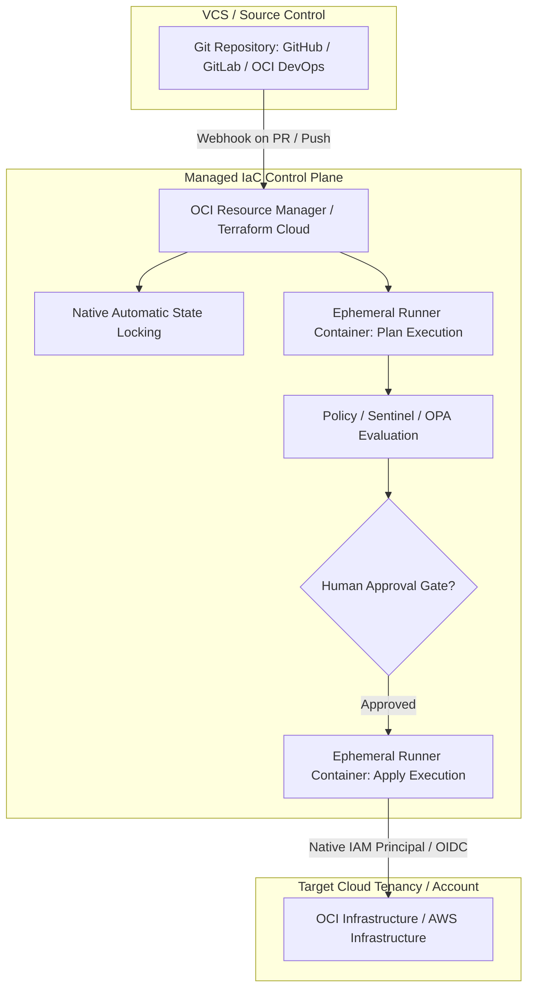

#### AWS Implementation
Configuring a Terraform Cloud Workspace with AWS OIDC dynamic provider credentials (no long-lived AWS keys stored in TFC): [Doc: Terraform Cloud AWS Dynamic Provider Credentials, checked 2026].

```hcl
# main.tf configured for Terraform Cloud backend
terraform {
  required_version = ">= 1.5.0"
  cloud {
    organization = "corp-enterprise"

    workspaces {
      name = "prod-aws-infrastructure"
    }
  }

  required_providers {
    aws = {
      source  = "hashicorp/aws"
      version = "~> 5.40.0"
    }
  }
}

# Provider authenticating via dynamic OIDC without static AWS Access Keys
provider "aws" {
  region = "us-east-1"
  # TFC automatically injects TFC_AWS_RUN_ROLE_ARN and JWT token into the runner
}

resource "aws_sqs_queue" "enterprise_queue" {
  name                      = "prod-order-events-queue"
  kms_master_key_id         = "alias/aws/sqs"
  message_retention_seconds = 86400
}
```

AWS IAM Trust Policy granting Terraform Cloud runner role access via OIDC:
```json
{
  "Version": "2012-10-17",
  "Statement": [
    {
      "Effect": "Allow",
      "Principal": {
        "Federated": "arn:aws:iam::112233445566:oidc-provider/app.terraform.io"
      },
      "Action": "sts:AssumeRoleWithWebIdentity",
      "Condition": {
        "StringEquals": {
          "app.terraform.io:aud": "aws.workload.identity"
        },
        "StringLike": {
          "app.terraform.io:sub": "organization:corp-enterprise:project:*:workspace:prod-aws-infrastructure:run_phase:*"
        }
      }
    }
  ]
}
```

#### OCI Implementation
Creating an OCI Resource Manager Stack linked to a Git repository using the OCI CLI, executing a Plan and Apply job with native IAM: [Doc: OCI Resource Manager Stack & Job Automation, checked 2026].

```bash
#!/usr/bin/env bash
# create-orm-stack.sh: Provision and execute an OCI Resource Manager Stack
set -euo pipefail

COMPARTMENT_OCID="ocid1.compartment.oc1..aaaaaaaaxxxxxxxxxxxxxxxxxxxxxxx"
REPO_URL="https://github.com/corp-org/oci-core-infrastructure.git"

echo "[INFO] Creating OCI Resource Manager Stack from Git repository..."
STACK_JSON=$(oci resource-manager stack create-from-git-provider \
  --compartment-id "$COMPARTMENT_OCID" \
  --display-name "Production-Core-Network-Stack" \
  --description "Managed stack for VCN and core routing" \
  --git-provider-type "GITHUB" \
  --repository-url "$REPO_URL" \
  --branch "main" \
  --terraform-version "1.5.x" \
  --working-directory "network" \
  --output json)

STACK_ID=$(echo "$STACK_JSON" | jq -r '.data.id')
echo "[SUCCESS] Created ORM Stack: $STACK_ID"

echo "[INFO] Triggering speculative PLAN job..."
PLAN_JOB_JSON=$(oci resource-manager job create-plan-job \
  --stack-id "$STACK_ID" \
  --display-name "Automated-Plan-$(date +%s)" \
  --wait-for-state SUCCEEDED \
  --wait-for-state FAILED \
  --max-wait-seconds 900)

PLAN_STATUS=$(echo "$PLAN_JOB_JSON" | jq -r '.data["lifecycle-state"]')
PLAN_JOB_ID=$(echo "$PLAN_JOB_JSON" | jq -r '.data.id')

if [ "$PLAN_STATUS" != "SUCCEEDED" ]; then
  echo "[ERROR] Terraform Plan failed in ORM. Check logs:"
  oci resource-manager job get-job-logs --job-id "$PLAN_JOB_ID"
  exit 1
fi

echo "[SUCCESS] Plan succeeded. Fetching execution logs summary..."
oci resource-manager job get-job-logs-content --job-id "$PLAN_JOB_ID" | tail -n 20

echo "[INFO] Applying stack infrastructure changes..."
oci resource-manager job create-apply-job \
  --stack-id "$STACK_ID" \
  --execution-plan-strategy "FROM_PLAN_JOB_ID" \
  --execution-plan-job-id "$PLAN_JOB_ID" \
  --display-name "Automated-Apply-$(date +%s)" \
  --wait-for-state SUCCEEDED \
  --max-wait-seconds 1200
```

#### Common Trap
Configuring Terraform Cloud or Resource Manager with direct internet-facing runners when target cloud resources reside entirely in private subnets without public IPs. If Terraform must configure resources inside private networks (e.g., creating schemas inside a private Aurora cluster or running Kubernetes provider commands against an internal OKE cluster), public cloud runners will time out. You must deploy **Terraform Cloud Private Agents** or **OCI Resource Manager Private Pools** inside your private VPC/VCN to bridge runner connectivity.

#### Follow-up Question
How does OCI Resource Manager guarantee that two concurrent pipeline runs do not corrupt state?

*Answer*: ORM manages state locking at the stack level. When an Apply or Plan job is submitted, ORM places a lock on the stack metadata in the control plane. Any secondary job submitted simultaneously is queued or rejected with a `409 Conflict - Stack is currently locked by Job ID <ocid>`. The lock is released only when the active job finishes, fails, or is cancelled.

---

### Q442: Declarative Import Blocks and Reverse Engineering Cloud Resources

#### Question
How do modern declarative `import` blocks in Terraform 1.5+ differ from imperative `terraform import` CLI commands, and how do you automatically generate HCL configuration for unmanaged brownfield cloud resources?

#### Short Answer
Historically, `terraform import` was an imperative CLI command that mutated state immediately without updating code, requiring engineers to manually author matching HCL blocks through trial and error. Modern Terraform 1.5+ introduces declarative `import` blocks directly in HCL (`import { to = ... id = ... }`). Combined with the flag `terraform plan -generate-config-out=generated.tf`, Terraform inspects the real-world resource attributes via cloud APIs and automatically synthesizes valid, idiomatic HCL code while preparing a safe, reviewable plan before touching the persistent state file.

#### Deep Answer
Migrating pre-existing "brownfield" infrastructure into Infrastructure as Code is a fundamental enterprise operational challenge.

**Imperative vs Declarative Import**:
- **Legacy Imperative (`terraform import`)**:
  - Syntax: `terraform import aws_s3_bucket.logs my-company-log-bucket`
  - *Drawbacks*: Directly mutates the state file on disk or in remote storage without code generation. If the written HCL has missing or mismatched arguments, the subsequent `terraform plan` attempts to rewrite or recreate the resource. Leaves no reviewable Git commit history for the import event.
- **Modern Declarative (`import` Blocks)**:
  - Syntax:
    ```hcl
    import {
      to = aws_s3_bucket.logs
      id = "my-company-log-bucket"
    }
    ```
  - *Benefits*: Version controlled, reviewed via standard pull request workflows, and safely executed in CI/CD without granting developers direct write privileges to production state files.

**Automatic HCL Generation**:
- When importing unmanaged resources, writing hundreds of HCL lines manually is prone to errors.
- Running `terraform plan -generate-config-out=generated.tf`:
  1. Identifies all `import` blocks whose target address does not yet exist in code.
  2. Queries the cloud provider API to fetch the live resource schema and attribute values.
  3. Writes a synthesized `.tf` configuration into `generated.tf`.
  4. Generates a speculative execution plan showing: `Plan: 1 to import, 0 to add, 0 to change, 0 to destroy`.
- Engineers then review and clean up `generated.tf` (e.g., removing deprecated default arguments, converting hardcoded values to variables) before running `terraform apply`.

#### Architecture
```mermaid
graph TD
    subgraph Developer Workflow
        Dev[Engineer discovers unmanaged S3 / OCI Bucket]
        Dev -->|1. Write import block in HCL| Code[HCL: import { to = ... id = ... }]
        Code -->|2. terraform plan -generate-config-out| TF[Terraform 1.5+ Engine]
    end

    subgraph Cloud Discovery
        TF -->|3. Read Remote API State| Cloud[AWS S3 / OCI Object Storage API]
        Cloud -->|4. Return Schema & Config Attributes| TF
    end

    subgraph Output Generation
        TF -->|5. Synthesize Idiomatic HCL| GenFile[generated.tf]
        TF -->|6. Speculative Plan Output| Plan[Plan: 1 to import, 0 to change]
        Plan -->|7. Approved terraform apply| State[State Backend Updated]
    end
```

#### AWS Implementation
Declarative import of an unmanaged AWS VPC and Security Group with automatic HCL generation: [Doc: Terraform Declarative Import & AWS Provider, checked 2026].

```hcl
# =========================================================================
# File: imports.tf
# =========================================================================

# Declarative import block for unmanaged legacy VPC
import {
  to = aws_vpc.legacy_network
  id = "vpc-07b9a8c14d9e23f01"
}

# Declarative import block for unmanaged Security Group
import {
  to = aws_security_group.db_access
  id = "sg-0123456789abcdef0"
}
```

Command executed to generate HCL:
```bash
# Generate the HCL configuration automatically
terraform plan -generate-config-out=generated_network.tf
```

Generated HCL output (`generated_network.tf`):
```hcl
# __generated__ by Terraform
# Review and adjust before applying
resource "aws_vpc" "legacy_network" {
  cidr_block                       = "10.50.0.0/16"
  enable_dns_hostnames             = true
  enable_dns_support               = true
  instance_tenancy                 = "default"
  tags = {
    "Environment" = "Legacy-Production"
    "ManagedBy"   = "Terraform"
  }
}

resource "aws_security_group" "db_access" {
  name        = "db-access-sg"
  description = "Managed DB access from private subnet"
  vpc_id      = aws_vpc.legacy_network.id

  ingress {
    from_port   = 5432
    to_port     = 5432
    protocol    = "tcp"
    cidr_blocks = ["10.50.10.0/24"]
  }

  egress {
    from_port   = 0
    to_port     = 0
    protocol    = "-1"
    cidr_blocks = ["0.0.0.0/0"]
  }
}
```

#### OCI Implementation
Declarative import of an unmanaged OCI Virtual Cloud Network (VCN) and Compute Instance: [Doc: OCI Provider & Terraform Import Blocks, checked 2026].

```hcl
# =========================================================================
# File: oci_imports.tf
# =========================================================================

# Declarative import block for existing OCI VCN
import {
  to = oci_core_vcn.unmanaged_core_vcn
  id = "ocid1.vcn.oc1.iad.amaaaaaaxxxxxxxxxxxxxxxxxxxxxxxxxxxxxxxxxxxxx"
}

# Declarative import block for unmanaged Autonomous Database
import {
  to = oci_database_autonomous_database.unmanaged_atp
  id = "ocid1.autonomousdatabase.oc1.iad.abuwcljtxxxxxxxxxxxxxxxxxxxxxx"
}
```

Command executed to generate HCL:
```bash
# Generate declarative HCL code from OCI API
terraform plan -generate-config-out=generated_oci.tf
```

Resulting synthesized configuration (`generated_oci.tf`):
```hcl
# __generated__ by Terraform from OCI Resource API
resource "oci_core_vcn" "unmanaged_core_vcn" {
  compartment_id = "ocid1.compartment.oc1..aaaaaaaaxxxxxxxxxxxxxxxxxxxxxxx"
  cidr_blocks    = ["10.20.0.0/16"]
  display_name   = "corp-production-ashburn-vcn"
  dns_label      = "corpashburn"
}

resource "oci_database_autonomous_database" "unmanaged_atp" {
  compartment_id           = "ocid1.compartment.oc1..aaaaaaaaxxxxxxxxxxxxxxxxxxxxxxx"
  db_name                  = "corpfinprod"
  display_name             = "corpfinprod"
  cpu_core_count           = 4
  data_storage_size_in_tbs = 2
  db_workload              = "OLTP"
  is_auto_scaling_enabled  = true
  is_free_tier             = false
}
```

#### Common Trap
Believing that importing a resource automatically imports its child or attached sub-resources. For example, importing an `aws_vpc` does **not** import its subnets, route tables, internet gateways, or NAT gateways. Similarly, importing an `oci_core_vcn` does not import route tables, security lists, or subnets. Every discrete cloud resource type must have its own dedicated `import` block and corresponding ID.

#### Follow-up Question
What happens to the `import` block once `terraform apply` has successfully integrated the resource into state?

*Answer*: Once applied, the resource is permanently bound to state. You can safely remove the `import` block from the HCL code, or retain it. If retained, subsequent `terraform plan` runs simply recognize that the resource address is already managed in state and ignore the import directive.

---

### Q443: Developing Custom Terraform Providers using the Plugin Framework

#### Question
How is a custom Terraform Provider architected in Go, how does the Terraform CLI communicate with provider plugins, and why was the modern Plugin Framework created to replace Plugin SDKv2?

#### Short Answer
A Terraform Provider is an independent executable binary written in Go that communicates with the Terraform Core CLI over an RPC channel (specifically gRPC over Unix domain sockets or named pipes). Terraform Core handles the dependency graph, expressions, and state management, while delegating actual cloud API CRUD operations to the provider. The modern **Terraform Plugin Framework** replaced the legacy **SDKv2** to support native Terraform type systems (dynamic types, null vs unknown differentiation, nested object validation), reduce reflection-heavy boilerplate, and provide structured diagnostics and validation hooks.

#### Deep Answer
Terraform's plugin architecture decouples the workflow engine from cloud vendor APIs:

1. **RPC / gRPC Protocol Architecture**:
   - When you run `terraform init`, Terraform downloads provider binaries into `.terraform/providers/`.
   - When executing `terraform plan` or `apply`, Terraform Core launches the provider executable as a child process.
   - Core and Provider communicate via **gRPC (Protocol Buffers)**. The provider implements standard service methods: `ConfigureProvider`, `ValidateResourceTypeConfig`, `ReadResource`, `PlanResourceChange`, and `ApplyResourceChange`.

2. **Why Plugin SDKv2 Was Replaced**:
   - *Type System Mismatch*: SDKv2 mapped all types to Go `interface{}` and primitive maps/lists, causing silent runtime type assertions, inability to distinguish between an unconfigured attribute and an empty attribute, and awkward handling of `null` vs `unknown`.
   - *Framework Modernization*: The **Plugin Framework** introduces strong, first-class types (`types.String`, `types.Object`), compile-time schema safety, automatic conversion to/from Go structs, and granular plan modification hooks.

3. **Core CRUD Lifecycle**:
   - `Create`: Receives planned configuration, executes cloud REST API call, and writes resultant state (including server-generated IDs/ARNs).
   - `Read`: Queries remote cloud API and refreshes state against real-world drift. If API returns `404 Not Found`, provider removes resource from state (`resp.State.RemoveResource(ctx)`).
   - `Update`: Evaluates planned attribute changes and sends PATCH/PUT requests.
   - `Delete`: Invokes DELETE API on cloud target and removes resource from state.

#### Architecture
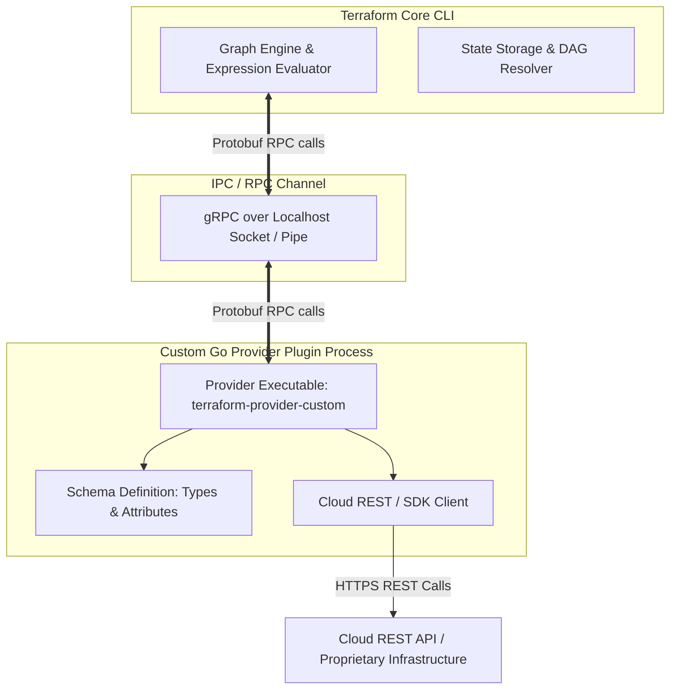

#### AWS Implementation
Building an AWS-oriented custom resource using the modern Go Plugin Framework to manage a proprietary internal microservice API: [Doc: Terraform Plugin Framework Specification, checked 2026].

```go
// internal/provider/resource_custom_service.go
package provider

import (
	"context"
	"fmt"
	"github.com/hashicorp/terraform-plugin-framework/resource"
	"github.com/hashicorp/terraform-plugin-framework/resource/schema"
	"github.com/hashicorp/terraform-plugin-framework/resource/schema/planmodifier"
	"github.com/hashicorp/terraform-plugin-framework/resource/schema/stringplanmodifier"
	"github.com/hashicorp/terraform-plugin-framework/types"
)

var _ resource.Resource = &CustomServiceResource{}

type CustomServiceResource struct {
	client *InternalAPIClient
}

type CustomServiceModel struct {
	ID          types.String `tfsdk:"id"`
	ServiceName types.String `tfsdk:"service_name"`
	ClusterARN  types.String `tfsdk:"cluster_arn"`
	Port        types.Int64  `tfsdk:"port"`
}

func (r *CustomServiceResource) Schema(ctx context.Context, req resource.SchemaRequest, resp *resource.SchemaResponse) {
	resp.Schema = schema.Schema{
		Description: "Manages an internal enterprise microservice registration.",
		Attributes: map[string]schema.Attribute{
			"id": schema.StringAttribute{
				Computed: true,
				PlanModifiers: []planmodifier.String{
					stringplanmodifier.UseStateForUnknown(),
				},
			},
			"service_name": schema.StringAttribute{
				Required:    true,
				Description: "Unique name of the registered microservice.",
			},
			"cluster_arn": schema.StringAttribute{
				Required:    true,
				Description: "AWS ECS or EKS Cluster ARN.",
			},
			"port": schema.Int64Attribute{
				Required:    true,
				Description: "TCP port on which the service listens.",
			},
		},
	}
}

func (r *CustomServiceResource) Create(ctx context.Context, req resource.CreateRequest, resp *resource.CreateResponse) {
	var plan CustomServiceModel
	diags := req.Plan.Get(ctx, &plan)
	resp.Diagnostics.Append(diags...)
	if resp.Diagnostics.HasError() {
		return
	}

	// Invoke underlying cloud/REST API
	createdID, err := r.client.RegisterService(plan.ServiceName.ValueString(), plan.ClusterARN.ValueString(), plan.Port.ValueInt64())
	if err != nil {
		resp.Diagnostics.AddError("API Registration Error", fmt.Sprintf("Failed to register service: %s", err))
		return
	}

	plan.ID = types.StringValue(createdID)
	diags = resp.State.Set(ctx, plan)
	resp.Diagnostics.Append(diags...)
}
```

#### OCI Implementation
A custom provider resource written in Go managing an internal OCI Custom Instance Pool configuration: [Doc: OCI Go SDK & Terraform Plugin Framework, checked 2026].

```go
// internal/provider/resource_oci_custom_pool.go
package provider

import (
	"context"
	"github.com/hashicorp/terraform-plugin-framework/resource"
	"github.com/hashicorp/terraform-plugin-framework/resource/schema"
	"github.com/hashicorp/terraform-plugin-framework/types"
	"github.com/oracle/oci-go-sdk/v65/core"
)

type OCICustomPoolResource struct {
	computeClient core.ComputeManagementClient
}

type OCICustomPoolModel struct {
	ID             types.String `tfsdk:"id"`
	CompartmentID  types.String `tfsdk:"compartment_id"`
	PoolName       types.String `tfsdk:"pool_name"`
	TargetCapacity types.Int64  `tfsdk:"target_capacity"`
}

func (r *OCICustomPoolResource) Read(ctx context.Context, req resource.ReadRequest, resp *resource.ReadResponse) {
	var state OCICustomPoolModel
	diags := req.State.Get(ctx, &state)
	resp.Diagnostics.Append(diags...)
	if resp.Diagnostics.HasError() {
		return
	}

	// Invoke OCI SDK
	request := core.GetInstancePoolRequest{InstancePoolId: state.ID.ValueStringPointer()}
	response, err := r.computeClient.GetInstancePool(ctx, request)
	if err != nil {
		resp.Diagnostics.AddError("OCI API Error", err.Error())
		return
	}

	// Check if deleted remotely
	if *response.LifecycleState == core.InstancePoolLifecycleStateTerminated {
		resp.State.RemoveResource(ctx)
		return
	}

	state.PoolName = types.StringPointerValue(response.DisplayName)
	state.TargetCapacity = types.Int64Value(int64(*response.Size))
	resp.Diagnostics.Append(resp.State.Set(ctx, &state)...)
}
```

#### Common Trap
Forgetting to handle `404 Not Found` API status codes inside the `Read` function of a custom provider resource. If a resource is deleted manually out-of-band in the cloud console, the next `terraform plan` calls `Read`. If the provider returns an error on `404` instead of calling `resp.State.RemoveResource(ctx)`, the plan fails catastrophically with an execution error instead of gracefully reporting that the resource was removed and proposing to recreate it.

#### Follow-up Question
How does Terraform handle schema version upgrades in custom providers when internal state schemas change?

*Answer*: The Plugin Framework supports `StateUpgraders`. When a provider increments its `SchemaVersion` (e.g., from 0 to 1), it registers an upgrader function that receives the raw prior state JSON, performs structural translations (e.g., renaming fields, migrating integers to strings), and outputs the new schema representation before Terraform executes plan calculations.

---

### Q444: Blast Radius Containment and Decomposing Monolithic State Files

#### Question
Why are monolithic Terraform state files dangerous in enterprise production environments, and how do you decompose infrastructure into decoupled micro-state layers connected via remote state data sources or parameter stores?

#### Short Answer
Monolithic state files group networking, databases, compute clusters, and application deployments into a single `terraform.tfstate`. This creates catastrophic blast radius hazards: (1) a typo in an application module can inadvertently delete the production VPC or database; (2) state locking bottlenecks prevent concurrent team deployments; and (3) `terraform plan` execution slows to tens of minutes due to hundreds of API refresh calls. To contain blast radius, decompose infrastructure into isolated lifecycle layers (Foundations/Networking -> Data Storage -> Compute/Platform -> Applications), isolating state files per environment and per layer, cross-referencing shared outputs via `terraform_remote_state`, AWS SSM Parameter Store, or OCI Vault/Object Storage.

#### Deep Answer
Blast radius containment is the single most critical architectural pattern in enterprise Infrastructure as Code.

**Anti-Pattern: The Monolithic State File**:
- A single `main.tf` and `.tfstate` controlling VPCs, Transit Gateways, RDS Clusters, EKS clusters, and 20 Kubernetes microservices.
- *Risks*:
  - **Accidental Cascading Destructions**: A developer updating an ECS task definition accidentally changes a VPC variable, prompting Terraform to plan a recreation of the VPC, tearing down every subnet, database, and load balancer.
  - **Locking Contention**: Team A cannot deploy a minor app fix because Team B is executing a 45-minute database migration that holds the state lock.
  - **API Rate Limiting**: Refreshing 800 resources on every run hits AWS/OCI API throttling limits, triggering exponential backoff delays.

**Decomposition Strategy: Tiered Micro-State Architecture**:
Infrastructure must be partitioned across two orthogonal axes: **Environment** (Dev, Stage, Prod) and **Lifecycle Layer**:
1. **Layer 0 - Core Networking (Rarely changed, 99.999% uptime requirement)**:
   - VPCs, Subnets, Transit Gateways, Internet/NAT Gateways, OCI VCNs, DRGs.
2. **Layer 1 - Data Persistence (Stateful, high data-loss risk)**:
   - Aurora PostgreSQL, DynamoDB, OCI Autonomous Database, S3/Object Storage buckets.
3. **Layer 2 - Compute & Orchestration Platform (Medium churn)**:
   - EKS / OKE Clusters, Node Groups, IAM Roles, Autoscaling Groups.
4. **Layer 3 - Application Workloads (High churn, continuous deployment)**:
   - Kubernetes Helm charts, ECS Services, Route53 records, API Gateways.

**State Decoupling Mechanisms**:
- `data.terraform_remote_state`: Directly queries the outputs of an upstream state file.
  - *Risk*: Requires read permissions to the upstream state file (which may contain sensitive database secrets).
- **Decoupled Publish/Subscribe (SSM Parameter Store / OCI Vault)**:
  - Upstream networking writes `vpc_id` to AWS SSM Parameter Store (`/network/prod/vpc_id`).
  - Downstream compute reads the SSM parameter string. No cross-state dependency or state-read privileges required!

#### Architecture
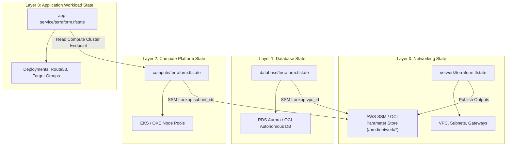

#### AWS Implementation
Decoupled networking layer writing outputs to AWS SSM Parameter Store, and a compute layer reading parameters without remote state access: [Doc: AWS SSM Parameter Store & Terraform State Decoupling, checked 2026].

```hcl
# =========================================================================
# File: 01-networking/main.tf (Isolated State: networking/terraform.tfstate)
# =========================================================================
resource "aws_vpc" "prod" {
  cidr_block           = "10.100.0.0/16"
  enable_dns_hostnames = true
  tags = { Name = "prod-vpc" }
}

resource "aws_subnet" "private" {
  count             = 2
  vpc_id            = aws_vpc.prod.id
  cidr_block        = "10.100.${count.index + 1}.0/24"
  availability_zone = count.index == 0 ? "us-east-1a" : "us-east-1b"
}

# Publish decoupled outputs to SSM Parameter Store
resource "aws_ssm_parameter" "vpc_id" {
  name        = "/prod/network/vpc_id"
  type        = "String"
  value       = aws_vpc.prod.id
  description = "Production VPC ID for downstream compute consumption"
}

resource "aws_ssm_parameter" "private_subnets" {
  name        = "/prod/network/private_subnets"
  type        = "StringList"
  value       = join(",", aws_subnet.private[*].id)
  description = "Comma-delimited list of private subnet IDs"
}

# =========================================================================
# File: 02-compute/main.tf (Isolated State: compute/terraform.tfstate)
# =========================================================================
# Query parameters from SSM - Zero cross-state read permissions required!
data "aws_ssm_parameter" "vpc_id" {
  name = "/prod/network/vpc_id"
}

data "aws_ssm_parameter" "private_subnets" {
  name = "/prod/network/private_subnets"
}

locals {
  vpc_id     = data.aws_ssm_parameter.vpc_id.value
  subnet_ids = split(",", data.aws_ssm_parameter.private_subnets.value)
}

resource "aws_security_group" "eks_cluster" {
  name        = "eks-cluster-control-plane-sg"
  vpc_id      = local.vpc_id
  description = "EKS control plane security group"
}
```

#### OCI Implementation
Decomposing OCI VCN and Autonomous Database into micro-state layers linked via `data.terraform_remote_state`: [Doc: OCI Object Storage Backend & Remote State, checked 2026].

```hcl
# =========================================================================
# File: 01-network/main.tf (State: oci-network/terraform.tfstate)
# =========================================================================
resource "oci_core_vcn" "prod_vcn" {
  compartment_id = var.compartment_id
  cidr_blocks    = ["10.0.0.0/16"]
  display_name   = "prod-network-vcn"
}

resource "oci_core_subnet" "db_subnet" {
  compartment_id             = var.compartment_id
  vcn_id                     = oci_core_vcn.prod_vcn.id
  cidr_block                 = "10.0.2.0/24"
  display_name               = "db-private-subnet"
  prohibit_public_ip_on_vnic = true
}

output "db_subnet_ocid" {
  value       = oci_core_subnet.db_subnet.id
  description = "OCID of the private database subnet"
}

# =========================================================================
# File: 02-database/main.tf (State: oci-database/terraform.tfstate)
# =========================================================================
# Read upstream network state securely from OCI Object Storage
data "terraform_remote_state" "network" {
  backend = "s3"
  config = {
    bucket   = "corp-oci-tfstate"
    key      = "oci-network/terraform.tfstate"
    region   = "us-ashburn-1"
    endpoint = "https://axxxxxxxxx.compat.objectstorage.us-ashburn-1.oraclecloud.com"
    skip_region_validation      = true
    skip_credentials_validation = true
    skip_metadata_api_check     = true
    force_path_style            = true
  }
}

resource "oci_database_autonomous_database" "prod_atp" {
  compartment_id           = var.compartment_id
  db_name                  = "proddb01"
  subnet_id                = data.terraform_remote_state.network.outputs.db_subnet_ocid
  cpu_core_count           = 4
  data_storage_size_in_tbs = 2
  db_workload              = "OLTP"
  is_free_tier             = false
}
```

#### Common Trap
Over-partitioning state into hundreds of micro-repositories containing only 1-2 resources each (e.g., individual S3 buckets in their own state folders). This creates extreme orchestration latency, requires complex multi-step pipelines to deploy a single feature, and leads to dependency loops. The optimal industry balance is layering by **lifecycle volatility and risk**: Network (yearly changes), Databases (quarterly changes), Compute/Clusters (monthly changes), Applications (daily/hourly changes).

#### Follow-up Question
Why is SSM Parameter Store preferred over `data.terraform_remote_state` for cross-layer decoupling in security-hardened enterprises?

*Answer*: `data.terraform_remote_state` requires the downstream pipeline to possess `GetObject` permissions on the entire upstream state file. Because Terraform state files contain all attributes in cleartext (including database passwords, TLS private keys, and master tokens), granting remote state read access allows downstream application engineers to inspect sensitive database and network secrets. SSM Parameter Store allows granular, attribute-level IAM RBAC, exposing only the specific non-sensitive ARN or ID needed.

---

### Q445: Provisioners and Local-Exec Anti-Patterns vs Cloud Native Bootstrapping

#### Question
Why does HashiCorp classify `local-exec` and `remote-exec` provisioners as a "last resort" anti-pattern in Terraform, and what cloud-native bootstrapping alternatives should be used instead?

#### Short Answer
Provisioners violate the core declarative philosophy of Terraform: they are non-declarative, imperative side-effects that execute outside the state machine. If a `local-exec` bash script or `remote-exec` SSH command fails halfway through, Terraform marks the entire resource as "tainted" without recording what partial changes occurred, destroying and recreating the resource on the next run. Furthermore, provisioners require direct network reachability (opening SSH port 22/WinRM into private instances) and local tooling dependencies. Production architectures replace provisioners with immutable golden images (Packer), `cloud-init` / User Data scripts, or agent-based configuration management (AWS SSM Run Command, OCI Cloud Agent).

#### Deep Answer
Terraform's graph engine relies on declarative idempotency: reading current cloud state, comparing it to desired HCL configuration, and computing an exact delta.

**Why Provisioners Break IaC**:
1. **No Drift Detection or State Tracking**:
   - Terraform records *that* the provisioner ran, but cannot track the files, packages, or services created by the script. If someone modifies a file installed via `remote-exec`, Terraform cannot detect the drift.
2. **Failure Leads to Resource Tainting**:
   - If a package installation fails due to a temporary `apt` repository network timeout, the underlying EC2 instance or OCI Compute instance is marked as `tainted`. On the next apply, Terraform forcefully destroys and recreates the instance, causing cascading downtime.
3. **Security Degradation**:
   - `remote-exec` requires injecting SSH private keys into CI runners and opening inbound port 22 through security groups and firewalls.
4. **Environment Inconsistency**:
   - `local-exec` runs binaries installed on the developer's workstation or CI runner (`ansible-playbook`, `aws`, `kubectl`). If the developer's laptop has a different CLI version than the CI server, executions yield non-deterministic results.

**Cloud-Native Alternatives**:
- **Bake, Don't Fry (Immutable AMIs/Custom Images via Packer)**:
  - Install dependencies, security agents, and system packages into a machine image *before* Terraform runs. Terraform simply references the static `image_id`.
- **Cloud-Init & User Data**:
  - Declarative OS initialization passed natively to the hypervisor metadata service at first boot.
- **Remote Agent Management**:
  - AWS Systems Manager (SSM) Run Command or OCI Compute Management Agent executes post-provisioning configurations securely over the cloud control plane without opening inbound network ports or SSH keys.

#### Architecture
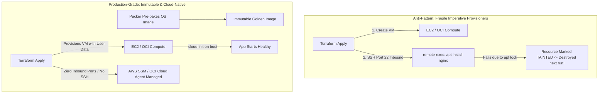

#### AWS Implementation
Replacing `remote-exec` with a secure, zero-inbound-port cloud-init template and AWS SSM Run Command association: [Doc: AWS EC2 User Data & SSM Association, checked 2026].

```hcl
# User data template rendering cloud-init configuration
data "cloudinit_config" "server_init" {
  gzip          = true
  base64_encode = true

  part {
    content_type = "text/cloud-config"
    content      = yamlencode({
      package_update  = true
      packages        = ["amazon-cloudwatch-agent", "nginx"]
      write_files = [
        {
          path        = "/var/www/html/index.html"
          permissions = "0644"
          content     = "<h1>Production Node Healthy</h1>"
        }
      ]
      runcmd = [
        ["systemctl", "enable", "--now", "nginx"]
      ]
    })
  }
}

# Production EC2 Instance - No SSH keys or port 22 security rules required!
resource "aws_instance" "web" {
  ami                  = "ami-0c7217cdde317cfec" # Pre-baked hardened golden AMI
  instance_type        = "c6i.large"
  iam_instance_profile = aws_iam_instance_profile.ssm_profile.name
  subnet_id            = var.private_subnet_id
  user_data_base64     = data.cloudinit_config.server_init.rendered

  vpc_security_group_ids = [aws_security_group.private_web.id]

  tags = {
    Name = "prod-immutable-web-node"
  }
}

# IAM Role granting AWS SSM Agent connectivity
resource "aws_iam_role" "ssm_role" {
  name = "prod-ec2-ssm-role"
  assume_role_policy = jsonencode({
    Version = "2012-10-17"
    Statement = [{
      Action = "sts:AssumeRole"
      Effect = "Allow"
      Principal = { Service = "ec2.amazonaws.com" }
    }]
  })
}

resource "aws_iam_role_policy_attachment" "ssm_core" {
  role       = aws_iam_role.ssm_role.name
  policy_arn = "arn:aws:iam::aws:policy/AmazonSSMManagedInstanceCore"
}

resource "aws_iam_instance_profile" "ssm_profile" {
  name = "prod-ec2-ssm-profile"
  role = aws_iam_role.ssm_role.name
}
```

#### OCI Implementation
Native OCI Cloud-Init metadata injection combined with Oracle Cloud Agent for zero-downtime bootstrapping: [Doc: OCI Compute User Data & Cloud Agent, checked 2026].

```hcl
# Cloud-init configuration for OCI Compute
locals {
  cloud_init_content = <<-EOF
    #cloud-config
    packages:
      - oracle-cloud-agent
      - nginx
    runcmd:
      - systemctl enable --now nginx
      - echo "OCI Production Instance Initialized" > /usr/share/nginx/html/index.html
  EOF
}

resource "oci_core_instance" "prod_node" {
  compartment_id      = var.compartment_id
  availability_domain = var.ad
  display_name        = "prod-oci-compute-node"
  shape               = "VM.Standard3.Flex"

  shape_config {
    ocpus         = 2
    memory_in_gbs = 16
  }

  source_details {
    source_type = "image"
    image_id    = var.custom_hardened_image_ocid
  }

  create_vnic_details {
    subnet_id        = var.private_subnet_ocid
    assign_public_ip = false
    nsg_ids          = [var.web_nsg_ocid]
  }

  # Pass cloud-init metadata cleanly without provisioners
  metadata = {
    user_data = base64encode(local.cloud_init_content)
  }

  # Enable Oracle Cloud Agent plugins for zero-SSH remote execution
  agent_config {
    is_management_disabled = false
    is_monitoring_disabled = false

    plugins_config {
      desired_state = "ENABLED"
      name          = "Compute Instance Run Command"
    }
  }
}
```

#### Common Trap
Using `local-exec` provisioners with `when = destroy` to clean up external state (e.g., deregistering from a third-party monitoring tool). If the destroy-time `local-exec` provisioner fails (e.g., the monitoring API endpoint is unreachable or VPN drops), Terraform aborts the destruction midway through. The resource remains partially in state, and subsequent `terraform destroy` runs will repeatedly fail on the same provisioner error, locking the resource in state until manually modified.

#### Follow-up Question
Under what specific circumstance is `local-exec` genuinely justified as an acceptable pattern?

*Answer*: `local-exec` is acceptable exclusively for non-infrastructure client-side setup tasks that do not impact cloud state correctness—such as invoking a local script to generate custom TLS client certificates or running `aws eks update-kubeconfig` to configure local developer context files post-provisioning.

---

### Q446: Testing Terraform Architectures (Native `terraform test` vs Terratest)

#### Question
How do you implement comprehensive automated testing for Terraform modules, and what are the architectural differences between the native `terraform test` framework (Terraform 1.6+) and Go-based Terratest?

#### Short Answer
Automated testing for Terraform validates that modules provision expected resources, calculate accurate variables, and honor architectural invariants without regressing in production. In Terraform 1.6+, HashiCorp introduced the native `terraform test` framework, which uses declarative `.tftest.hcl` files to execute unit tests (evaluating code and provider logic without creating real cloud resources via `command = plan` and mocks) and integration tests (`command = apply`). In contrast, Terratest is a Go testing library that executes actual CLI runs and performs deep HTTP, SSH, and cloud SDK assertions against live infrastructure.

#### Deep Answer
IaC testing operates across the test pyramid:

1. **Static Analysis & Linting**:
   - `terraform fmt -check`, `terraform validate`, and tflint. Validates syntax and basic argument schemas.
2. **Unit Testing (`command = plan` with Mock Providers in `terraform test`)**:
   - Fast, zero-cost, and executes entirely in CI runners without AWS/OCI credentials.
   - Evaluates complex HCL logic: conditional counts, dynamic blocks, string manipulation, and input validations.
   - Mocks provider responses so `plan` can test module output assertions against simulated API responses.
3. **Integration & E2E Testing (`command = apply`)**:
   - Deploys ephemeral infrastructure into a sandbox AWS account or OCI compartment, tests real functionality (e.g., sending an HTTP request to an ALB endpoint to verify 200 OK), and tears down via `destroy`.

**Comparison: Native `terraform test` vs Terratest (Go)**:

| Dimension | Native `terraform test` (1.6+) | Terratest (Gruntwork / Go) |
| :--- | :--- | :--- |
| **Language** | Native HCL (`.tftest.hcl`) | Go (`*_test.go`) |
| **Prerequisites** | Terraform CLI only | Go runtime, Terraform CLI, cloud SDKs |
| **Unit Testing** | First-class native support (mocking providers/data) | Difficult (designed primarily for live apply) |
| **External Assertions** | HCL assertions on state/outputs only | Full Go power (HTTP requests, SSH, SQL queries) |
| **Execution Speed** | Ultra-fast in mock/plan mode | Slower (compiles Go tests, provisions live infra) |

#### Architecture
```mermaid
graph TD
    PR[Developer Opens Module PR] --> CI[CI Test Runner]

    subgraph Native terraform test (Fast Feedback)
        CI --> UT["terraform test (command = plan)"]
        UT --> Mock[Mock Providers: Test Variable Validation & HCL Math]
        Mock --> AssertHCL[HCL Assertions: assert { condition = ... }]
    end

    subgraph Live Integration Test (Pre-Release)
        AssertHCL -->|Passed| IT["terraform test / Terratest (command = apply)"]
        IT --> Sandbox[Sandbox Cloud Environment]
        Sandbox --> Verify[Verify HTTP 200 OK / Security Rules]
        Verify --> Teardown[Automatic terraform destroy]
    end
```

#### AWS Implementation
Native `tests/vpc_test.tftest.hcl` file verifying VPC CIDR calculation and subnet division logic using mock providers: [Doc: Terraform Test Framework & Assertions, checked 2026].

```hcl
# tests/vpc_test.tftest.hcl
# Native Terraform 1.6+ test file

# Mock provider allows running plan-only tests without AWS credentials!
mock_provider "aws" {}

# Test 1: Verify input validation fails on invalid CIDR
run "verify_cidr_validation" {
  command = plan

  variables {
    vpc_cidr     = "invalid-cidr-format"
    environment  = "test"
  }

  expect_failures = [
    var.vpc_cidr
  ]
}

# Test 2: Unit test verifying subnet partitioning and output calculation
run "verify_subnet_math" {
  command = plan

  variables {
    vpc_cidr    = "10.0.0.0/16"
    environment = "staging"
    az_count    = 3
  }

  assert {
    condition     = aws_vpc.this.cidr_block == "10.0.0.0/16"
    error_message = "VPC CIDR did not match input configuration."
  }

  assert {
    condition     = length(aws_subnet.private) == 3
    error_message = "Private subnet count must match az_count."
  }

  assert {
    condition     = aws_subnet.private[0].cidr_block == "10.0.1.0/24"
    error_message = "First private subnet CIDR calculation is incorrect."
  }
}

# Test 3: Integration test applying ephemeral infrastructure
run "apply_ephemeral_test" {
  command = apply

  variables {
    vpc_cidr    = "10.99.0.0/16"
    environment = "ci-test"
    az_count    = 2
  }

  assert {
    condition     = output.vpc_id != ""
    error_message = "VPC ID output must not be empty after apply."
  }
}
```

#### OCI Implementation
Go-based Terratest script verifying an OCI VCN and Subnet deployment in a live test compartment: [Doc: Terratest Framework & OCI Go SDK, checked 2026].

```go
// test/oci_vcn_test.go
package test

import (
	"fmt"
	"testing"
	"github.com/gruntwork-io/terratest/modules/terraform"
	"github.com/oracle/oci-go-sdk/v65/common"
	"github.com/oracle/oci-go-sdk/v65/core"
	"github.com/stretchr/testify/assert"
)

func TestOCIVcnModule(t *testing.T) {
	t.Parallel()

	expectedDisplayName := fmt.Sprintf("ci-test-vcn-%d", 101)
	expectedCIDR := "172.28.0.0/16"

	terraformOptions := terraform.WithDefaultRetryableErrors(t, &terraform.Options{
		TerraformDir: "../modules/oci-vcn",
		Vars: map[string]interface{}{
			"compartment_ocid": "ocid1.compartment.oc1..aaaaaaaaci-sandbox",
			"vcn_display_name": expectedDisplayName,
			"vcn_cidr":         expectedCIDR,
		},
	})

	// Ensure teardown at test conclusion
	defer terraform.Destroy(t, terraformOptions)

	// Execute terraform init & apply
	terraform.InitAndApply(t, terraformOptions)

	// Fetch module output
	vcnOCID := terraform.Output(t, terraformOptions, "vcn_id")
	assert.NotEmpty(t, vcnOCID, "VCN OCID should not be empty")

	// Direct OCI SDK verification to prove real-world existence
	configProvider := common.DefaultConfigProvider()
	virtualNetworkClient, err := core.NewVirtualNetworkClientWithConfigurationProvider(configProvider)
	assert.NoError(t, err)

	req := core.GetVcnRequest{VcnId: &vcnOCID}
	resp, err := virtualNetworkClient.GetVcn(t.Context(), req)
	assert.NoError(t, err)
	assert.Equal(t, core.VcnLifecycleStateAvailable, resp.LifecycleState)
	assert.Equal(t, expectedDisplayName, *resp.DisplayName)
}
```

#### Common Trap
Running integration tests (`command = apply`) in CI against production or shared staging cloud accounts without strict automated cleanup. If a CI test job gets killed halfway through (e.g., runner cancellation or timeout), the `defer terraform.Destroy` or post-test destroy step does not execute. Over weeks, orphan NAT gateways, provisioned load balancers, and unattached EBS/OCI block volumes accumulate, generating thousands of dollars in unmonitored cloud waste. Enterprise CI pipelines must implement automated garbage collection lambdas that sweep and destroy test accounts nightly.

#### Follow-up Question
How do mock providers in `terraform test` handle computed attributes (like an AWS generated ARN or OCI OCID) during plan-only tests?

*Answer*: In mock mode, Terraform synthesizes mock values for unknown computed attributes. Engineers can specify custom mock values using the `mock_provider` block:
```hcl
mock_provider "aws" {
  mock_data "aws_vpc" {
    defaults = {
      id  = "vpc-mocked12345678"
      arn = "arn:aws:ec2:us-east-1:123456789012:vpc/vpc-mocked12345678"
    }
  }
}
```
This enables downstream resources that consume these computed attributes to be planned and asserted cleanly without throwing "attribute unknown" errors.

---

### Q447: Resolving Cyclic Dependencies in the Terraform Graph Engine

#### Question
What causes circular dependency errors (`Error: Cycle: ...`) in Terraform Directed Acyclic Graphs (DAGs), and what architectural refactoring techniques resolve cyclic deadlocks between mutually dependent resources?

#### Short Answer
Terraform builds a Directed Acyclic Graph (DAG) to determine execution order. A cyclic dependency occurs when Resource A depends on Resource B, and Resource B simultaneously depends on Resource A (e.g., Security Group A allows ingress from Security Group B, while Security Group B allows ingress from Security Group A; or an ECS service depends on an IAM role whose policy references the ECS service ARN). Because a cycle cannot be topologically sorted, Terraform halts during plan. To resolve cycles: (1) split bidirectional resources into separate sub-resources (e.g., separate standalone `aws_security_group_rule` or `oci_core_network_security_group_security_rule` from the parent group); (2) break IAM circular references using wildcards or separate attachment resources; and (3) decouple interdependent modules using intermediary data lookups or parameter stores.

#### Deep Answer
Terraform calculates resource provisioning order by building a graph where nodes represent resources and edges represent dependencies created through attribute interpolation (e.g., `vpc_id = aws_vpc.this.id`).

**The Mechanics of a Cycle**:
```
Node A (App Security Group) ---- depends on ----> Node B (DB Security Group)
   ^                                                   |
   |------------------ depends on ---------------------|
```
Because the graph contains a directed loop, it violates the mathematical requirement of being **Acyclic**. Topological sorting fails, and Terraform raises `Error: Cycle: aws_security_group.db, aws_security_group.app`.

**Primary Manifestations & Solutions**:

1. **Security Group Cross-Referencing**:
   - *Problem*: Inline `ingress` blocks inside `aws_security_group` or `oci_core_security_list` that reference each other's ID.
   - *Fix*: Remove inline rules entirely. Define the security group containers first (they have zero mutual dependencies), then attach standalone rule resources (`aws_security_group_rule` or `oci_core_network_security_group_security_rule`) that reference the provisioned IDs.

2. **IAM Policy Mutual Dependencies**:
   - *Problem*: An S3 bucket policy references an IAM Role ARN, while the IAM Role policy references the S3 Bucket ARN.
   - *Fix*: Provision the IAM Role with an empty trust policy, provision the S3 bucket referencing the role ARN, and attach the policy to the IAM role via a standalone `aws_iam_role_policy` or `aws_iam_policy_attachment` resource.

3. **Compute and DNS / Load Balancer Cross-Talk**:
   - *Problem*: An EC2 User Data script queries the ALB DNS name to configure an internal config file, while the ALB target group depends on the EC2 instance ID.
   - *Fix*: Decouple by assigning a predictable Route 53 private hosted zone CNAME or OCI Private DNS record beforehand, and configure the VM to connect to the stable DNS alias rather than the raw ALB output.

#### Architecture
```mermaid
graph TD
    subgraph Cyclic Failure (Deadlock)
        SG1[Security Group A: Inline rule allows SG2]
        SG2[Security Group B: Inline rule allows SG1]
        SG1 -->|Depends on SG2 ID| SG2
        SG2 -->|Depends on SG1 ID| SG1
    end

    subgraph Decoupled DAG Solution (Acyclic Graph)
        ContainerA[Empty SG A: Resource Container]
        ContainerB[Empty SG B: Resource Container]
        Rule1[Standalone Rule 1: Allow SG A -> SG B]
        Rule2[Standalone Rule 2: Allow SG B -> SG A]

        ContainerA --> Rule1
        ContainerB --> Rule1
        ContainerA --> Rule2
        ContainerB --> Rule2
    end
```

#### AWS Implementation
Resolving a classic bidirectional security group cycle by splitting inline rules into standalone `aws_security_group_rule` resources: [Doc: AWS Provider Security Group Rule Lifecycle, checked 2026].

```hcl
# INCORRECT (Causes Cycle if defined inline):
# resource "aws_security_group" "web" { ingress { security_groups = [aws_security_group.db.id] } }
# resource "aws_security_group" "db"  { ingress { security_groups = [aws_security_group.web.id] } }

# CORRECT ARCHITECTURE: Decoupled containers + Standalone Rules

# Step 1: Create SG containers with ZERO cross-dependencies
resource "aws_security_group" "web" {
  name        = "prod-web-sg"
  description = "Frontend Web Tier"
  vpc_id      = var.vpc_id
}

resource "aws_security_group" "db" {
  name        = "prod-db-sg"
  description = "Backend Database Tier"
  vpc_id      = var.vpc_id
}

# Step 2: Create directional rules attached after both SGs exist in graph
# Allow Web SG to egress to DB SG on PostgreSQL port 5432
resource "aws_security_group_rule" "web_to_db_egress" {
  type                     = "egress"
  from_port                = 5432
  to_port                  = 5432
  protocol                 = "tcp"
  security_group_id        = aws_security_group.web.id
  source_security_group_id = aws_security_group.db.id
}

# Allow DB SG to accept ingress from Web SG
resource "aws_security_group_rule" "db_from_web_ingress" {
  type                     = "ingress"
  from_port                = 5432
  to_port                  = 5432
  protocol                 = "tcp"
  security_group_id        = aws_security_group.db.id
  source_security_group_id = aws_security_group.web.id
}
```

#### OCI Implementation
Resolving cyclic dependencies in OCI Network Security Groups (NSGs) using standalone NSG security rules: [Doc: OCI Network Security Group Security Rules, checked 2026].

```hcl
# Step 1: Provision independent NSG containers
resource "oci_core_network_security_group" "app_nsg" {
  compartment_id = var.compartment_id
  vcn_id         = var.vcn_id
  display_name   = "prod-application-nsg"
}

resource "oci_core_network_security_group" "db_nsg" {
  compartment_id = var.compartment_id
  vcn_id         = var.vcn_id
  display_name   = "prod-database-nsg"
}

# Step 2: Attach independent rules referencing the opposite NSG OCID
resource "oci_core_network_security_group_security_rule" "app_to_db_rule" {
  network_security_group_id = oci_core_network_security_group.app_nsg.id
  direction                 = "EGRESS"
  protocol                  = "6" # TCP

  destination_type = "NETWORK_SECURITY_GROUP"
  destination      = oci_core_network_security_group.db_nsg.id

  tcp_options {
    destination_port_range {
      min = 1521 # Oracle Database port
      max = 1521
    }
  }
}

resource "oci_core_network_security_group_security_rule" "db_from_app_rule" {
  network_security_group_id = oci_core_network_security_group.db_nsg.id
  direction                 = "INGRESS"
  protocol                  = "6" # TCP

  source_type = "NETWORK_SECURITY_GROUP"
  source      = oci_core_network_security_group.app_nsg.id

  tcp_options {
    destination_port_range {
      min = 1521
      max = 1521
    }
  }
}
```

#### Common Trap
Mixing inline security group rules (`ingress { ... }` block inside `aws_security_group`) with standalone `aws_security_group_rule` resources on the same security group. Terraform treats the inline rules as authoritative over the entire rule list. On every subsequent `terraform apply`, Terraform will detect the standalone rules as out-of-band drift and attempt to purge them, creating infinite thrashing and recurring cyclic errors during plans. Never mix inline rules and standalone rule resources.

#### Follow-up Question
How can you visualize and debug an obscure cyclic dependency in a repository containing 2,000 resources?

*Answer*: Run the command `terraform graph -type=plan | dot -Tpng > graph.png` to generate a visual node diagram. For text-based debugging, search the output of `terraform graph` for cycles, or inspect the CLI cycle error string which lists the exact loop sequence: `Cycle: Resource_A -> Resource_B -> Resource_C -> Resource_A`.

---

### Q448: Cost Estimation in IaC Pull Requests (Infracost vs OCI Resource Manager)

#### Question
How do you integrate automated cloud cost estimation into pull request workflows to prevent financial surprises, and how do tools like Infracost calculate delta costs against cloud pricing APIs?

#### Short Answer
FinOps in Infrastructure as Code shifts financial governance left by calculating cost deltas on Pull Requests before resources are provisioned. **Infracost** parses the Terraform code or compiled plan JSON (`tfplan.json`), queries the Infracost Cloud Pricing API (mirroring AWS, GCP, and Azure public retail and custom discount rates), and posts an automated PR comment showing the monthly cost delta (e.g., `+$420/month (+12%)`). In OCI, **OCI Resource Manager (ORM)** provides a native Cost Estimation API that calculates projected monthly spend directly within the tenancy based on active subscription rates and Universal Credits (UCC).

#### Deep Answer
Unexpected cloud bills are frequently caused by innocuous-looking IaC changes (e.g., bumping an RDS instance from `db.r6g.xlarge` to `db.r6g.8xlarge` or provisioning an uncompressed multi-AZ NAT Gateway).

**How Infracost Works**:
1. In a CI runner, generate the Terraform plan: `terraform plan -out=tfplan.binary`.
2. Parse plan to JSON: `terraform show -json tfplan.binary > tfplan.json`.
3. Infracost evaluates `tfplan.json` against its open-source parsing definitions:
   - Identifies created, updated, and destroyed resources.
   - Multiplies static attributes (e.g., instance count $\times$ hours per month $\times$ hourly rate).
   - Evaluates usage profiles (`infracost-usage.yml`) to estimate dynamic costs (e.g., S3 storage GBs, data transfer egress, DynamoDB write units).
4. Emits a structured comment directly onto the GitHub/GitLab Pull Request.
5. Enforces FinOps guardrails: fails the pipeline if the monthly cost delta exceeds a budget threshold (e.g., delta > \$500/month requires FinOps approval).

**OCI Resource Manager Cost Estimation**:
- Native to Oracle Cloud tenancies.
- ORM integrates directly with OCI Metering and Subscription APIs, evaluating actual contractual negotiated discount rates rather than public list prices.
- When an ORM Plan job executes, the console and API return a detailed itemized cost projection per resource OCID.

#### Architecture
```mermaid
graph TD
    Dev[Developer git push branch] --> PR[GitHub / GitLab Pull Request]
    PR --> CI[CI/CD Pipeline]
    
    subgraph Cost Engine
        CI --> Plan[terraform plan -out=tfplan.bin]
        Plan --> JSON[terraform show -json tfplan.bin > tfplan.json]
        JSON --> Infracost[Infracost CLI Evaluation]
        Infracost --> PriceAPI[Infracost Cloud Pricing API]
        Infracost --> Usage[infracost-usage.yml: Network Egress & IOPS]
    end

    Infracost --> Comment[Post PR Cost Summary: +$342/mo]
    Infracost --> Gate{Exceeds Budget Limit?}
    Gate -->|Yes: Delta > $500| Fail[Block PR Merge -> Require FinOps Approval]
    Gate -->|No| Pass[Approve PR for Review]
```

#### AWS Implementation
GitHub Actions workflow executing Infracost against AWS Terraform plans and posting PR comments: [Doc: Infracost CI/CD Integration & AWS Pricing, checked 2026].

```yaml
# .github/workflows/infracost.yml
name: "IaC Cost Estimation"

on:
  pull_request:
    paths:
      - "terraform/**"

jobs:
  infracost:
    name: "Infracost Cost Breakdown"
    runs-on: ubuntu-latest
    permissions:
      contents: read
      pull-requests: write
    steps:
      - name: Checkout Code
        uses: actions/checkout@v4

      - name: Setup Infracost
        uses: infracost/actions/setup@v3
        with:
          api_key: ${{ secrets.INFRACOST_API_KEY }}

      - name: Generate Infracost Cost Breakdown
        run: |
          infracost breakdown --path=terraform/ \
                              --format=json \
                              --out-file=/tmp/infracost.json

      - name: Post Infracost Comment to PR
        uses: infracost/actions/comment@v3
        with:
          path: /tmp/infracost.json
          behavior: update

      - name: Check Cost Guardrails
        run: |
          # Fails if monthly increase exceeds $500
          DIFF_TOTAL=$(jq -r '.diffTotalMonthlyCost // 0' /tmp/infracost.json)
          echo "Monthly Cost Delta: \$$DIFF_TOTAL"
          if (( $(echo "$DIFF_TOTAL > 500.0" | bc -l) )); then
            echo "ERROR: Cost increase of \$$DIFF_TOTAL exceeds $500/month threshold!"
            exit 1
          fi
```

#### OCI Implementation
Fetching OCI Resource Manager native stack cost estimation using the OCI CLI: [Doc: OCI Resource Manager Cost Estimation API, checked 2026].

```bash
#!/usr/bin/env bash
# oci-estimate-stack-cost.sh: Query OCI Resource Manager estimated stack costs
set -euo pipefail

STACK_OCID="ocid1.ormstack.oc1.iad.aaaaaaaaxxxxxxxxxxxxxxxxxxxxxxxxxxxx"

echo "[INFO] Requesting Cost Estimation for ORM Stack $STACK_OCID..."

# Trigger cost estimation job
ESTIMATE_JSON=$(oci resource-manager stack get-stack-cost-estimate \
  --stack-id "$STACK_OCID" \
  --output json)

echo "=================================================="
echo "OCI RESOURCE MANAGER ESTIMATED MONTHLY SPEND"
echo "=================================================="

# Parse itemized costs per resource
echo "$ESTIMATE_JSON" | jq -r '.data.items[] | "\(.["resource-name"]) (\(.["resource-type"])): $\(.["monthly-cost"]) / month"'

TOTAL_COST=$(echo "$ESTIMATE_JSON" | jq -r '.data["total-monthly-cost"]')
echo "--------------------------------------------------"
echo "Total Projected Monthly Cost: \$$TOTAL_COST USD"
echo "=================================================="

# Check threshold
if (( $(echo "$TOTAL_COST > 2000.0" | bc -l) )); then
  echo "[FINOPS ALERT] Stack exceeds $2,000 monthly budget threshold!"
  exit 2
fi
```

#### Common Trap
Relying solely on static instance size pricing while ignoring usage-based dynamic cost drivers. For example, creating a NAT Gateway in AWS costs ~\$32/month for the instance, but data processing costs \$0.045 per GB. If a petabyte analytics workload routes through that NAT Gateway, data transfer fees can easily exceed \$45,000/month! Infracost requires configuring an `infracost-usage.yml` file to model estimated gigabytes transferred, read/write IOPS, and API requests to provide true total cost projections.

#### Follow-up Question
How can Infracost handle custom Enterprise Discount Program (EDP) pricing agreements with AWS?

*Answer*: Infracost Enterprise supports integrating AWS Cost and Usage Reports (CUR) or uploading custom pricing matrices via API. When calculating deltas, the engine matches resource usage against negotiated EDP or OCI Universal Credit discounts rather than standard public rate cards.

---

### Q449: Upgrading Major Terraform Versions and State Migration

#### Question
How do you safely execute major-version Terraform upgrades (e.g., from 0.12/0.14 to 1.x or between major 1.x versions) across hundreds of repositories without corrupting remote state files or causing downtime?

#### Short Answer
Major Terraform version upgrades require a disciplined, step-by-step sequential migration process because state schema formats and provider protocols evolve across versions. To upgrade safely: (1) Never skip intermediate milestone versions (e.g., upgrade 0.12 -> 0.13 -> 0.14 -> 0.15 -> 1.0); (2) Back up remote state files before executing any commands; (3) Pin provider versions and run `terraform 0.13upgrade` or syntax migrations; (4) Use non-mutating `terraform plan` to verify an empty diff before applying; and (5) Use version managers (e.g., `tfswitch` or `tenv`) and enforce `required_version` constraints to prevent mismatched CLI versions from inadvertently upgrading state formats.

#### Deep Answer
Terraform's state file format changes across major releases. For example, Terraform 0.13 introduced hierarchical module support and provider source namespaces (`registry.terraform.io/hashicorp/aws`), while Terraform 1.0 stabilized the 1.x interoperability guarantee.

**The Golden Upgrade Workflow**:

1. **Remote State Snapshot**:
   - Take an explicit backup of the remote state before initiating the upgrade:
     `terraform state pull > state-backup-$(date +%s).json`
   - Ensure backend object versioning is enabled on S3 / OCI Object Storage.

2. **Stepwise Milestone Progression**:
   - Upgrading directly from 0.12 to 1.5 causes immediate state deserialization failure.
   - Milestone sequence:
     - `0.12`: Standardize HCL2 syntax.
     - `0.13`: Run `terraform 0.13upgrade .` to rewrite provider source blocks to FQCN (`hashicorp/aws`). Run `terraform apply` to upgrade the state schema to version 4.
     - `0.14`: Lockfile introduction (`.terraform.lock.hcl`).
     - `0.15`: Deprecations removed.
     - `1.0.x`: The long-term support baseline.
     - `1.1+`: Introduction of `moved` blocks.
     - `1.5+`: Introduction of `import` blocks.

3. **Provider Locking (`.terraform.lock.hcl`)**:
   - Commit `.terraform.lock.hcl` to version control. This ensures all team members and CI runners download identical provider binary checksums, preventing provider version drift during core CLI upgrades.

4. **Rollback Limitations**:
   - **State upgrades are strictly one-way!** Once a newer Terraform CLI writes a state file with an updated format version, older Terraform binaries will permanently refuse to read it (`Error: state snapshot was created by Terraform v1.8.0, which is newer than current v1.4.0`). Rolling back requires manually restoring the S3/OCI state backup.

#### Architecture
```mermaid
graph TD
    subgraph Stepwise Upgrade Path
        V12["Terraform 0.12 (HCL2 Baseline)"] --> V13["Terraform 0.13 (Provider FQCN + Schema v4)"]
        V13 --> V14["Terraform 0.14 (.terraform.lock.hcl)"]
        V14 --> V1["Terraform 1.0 (LTS Guarantee)"]
        V1 --> Modern["Terraform 1.8+ (moved, import, test)"]
    end

    subgraph State Backup & Verification
        Backup["1. Pull State Backup: state-backup.json"] --> Run["2. Run terraform plan"]
        Run --> Empty{"Diff == 0?"}
        Empty -->|Yes| Apply["3. terraform apply (Upgrades State Format)"]
        Empty -->|No: Unintended Diffs| Abort["Abort & Fix HCL Deprecations"]
    end
```

#### AWS Implementation
A complete automation script backing up remote state, validating provider locks, and executing a safe Terraform upgrade: [Doc: Terraform CLI Upgrade Documentation, checked 2026].

```bash
#!/usr/bin/env bash
# upgrade-terraform.sh: Safely upgrade Terraform version and dependencies
set -euo pipefail

TARGET_TF_VERSION="1.8.2"

echo "[1/5] Verifying current Terraform environment..."
CURRENT_VERSION=$(terraform version -json | jq -r '.terraform_version')
echo "Current Version: $CURRENT_VERSION -> Target Version: $TARGET_TF_VERSION"

# Enforce backup before proceeding
echo "[2/5] Creating immutable backup of remote state from S3..."
BACKUP_FILE="backup-state-${CURRENT_VERSION}-$(date +%s).json"
terraform state pull > "$BACKUP_FILE"
echo "State safely backed up to $BACKUP_FILE"

echo "[3/5] Switching Terraform binary to $TARGET_TF_VERSION..."
# Using tfswitch or tenv
tfswitch "$TARGET_TF_VERSION"

echo "[4/5] Updating provider dependency locks..."
terraform init -upgrade

echo "[5/5] Executing speculative verification plan..."
set +e
terraform plan -detailed-exitcode -no-color > upgrade_plan.txt
EXIT_CODE=$?
set -e

if [ $EXIT_CODE -eq 0 ]; then
  echo "SUCCESS: Empty diff! Infrastructure code matches cloud resources exactly."
  echo "Ready for: terraform apply"
elif [ $EXIT_CODE -eq 2 ]; then
  echo "WARNING: Plan produced diffs after version upgrade. Review upgrade_plan.txt before proceeding!"
  cat upgrade_plan.txt
  exit 2
else
  echo "ERROR: Terraform plan failed during upgrade."
  exit 1
fi
```

#### OCI Implementation
Managing OCI Resource Manager Stack Terraform version upgrades using the OCI CLI: [Doc: OCI Resource Manager Stack Version Upgrade, checked 2026].

```bash
#!/usr/bin/env bash
# oci-upgrade-stack.sh: Upgrade OCI Resource Manager Stack Terraform runtime
set -euo pipefail

STACK_OCID="ocid1.ormstack.oc1.iad.aaaaaaaaxxxxxxxxxxxxxxxxxxxxxxxxxxxx"
NEW_TF_VERSION="1.5.x" # Target runtime in OCI ORM

echo "[INFO] Querying current stack configuration..."
CURRENT_STACK=$(oci resource-manager stack get --stack-id "$STACK_OCID" --output json)
CURRENT_VERSION=$(echo "$CURRENT_STACK" | jq -r '.data["terraform-version"]')
echo "Current ORM Stack Terraform Version: $CURRENT_VERSION"

echo "[INFO] Upgrading Stack to Terraform Version $NEW_TF_VERSION..."
oci resource-manager stack update \
  --stack-id "$STACK_OCID" \
  --terraform-version "$NEW_TF_VERSION" \
  --force

echo "[INFO] Running verification PLAN job under new engine..."
JOB_JSON=$(oci resource-manager job create-plan-job \
  --stack-id "$STACK_OCID" \
  --display-name "Upgrade-Verification-Plan" \
  --wait-for-state SUCCEEDED \
  --wait-for-state FAILED)

JOB_STATUS=$(echo "$JOB_JSON" | jq -r '.data["lifecycle-state"]')

if [ "$JOB_STATUS" != "SUCCEEDED" ]; then
  echo "[CRITICAL] Plan failed under Terraform $NEW_TF_VERSION. Reverting stack version..."
  oci resource-manager stack update --stack-id "$STACK_OCID" --terraform-version "$CURRENT_VERSION" --force
  exit 1
fi

echo "[SUCCESS] Stack successfully upgraded to Terraform $NEW_TF_VERSION with clean plan."
```

#### Common Trap
Failing to commit `.terraform.lock.hcl` to version control. The dependency lockfile pins exact cryptographic checksums of provider binaries. If `.terraform.lock.hcl` is omitted or added to `.gitignore`, a developer running `terraform init` on macOS with an ARM64 (M1/M2/M3) processor may resolve a different provider patch release than an x86_64 CI/CD runner, introducing silent syntax discrepancies and checksum validation failures in pipelines.

#### Follow-up Question
What is the purpose of the `required_version` constraint in the `terraform {}` block?

*Answer*: The `required_version` setting (e.g., `required_version = ">= 1.5.0, < 1.9.0"`) acts as a client-side circuit breaker. If an engineer attempts to execute commands using an unsupported or newer CLI version, Terraform halts immediately before initializing or reading remote state, preventing accidental irreversible state file format upgrades.

---

### Q450: Enterprise IaC Governance (Monorepo vs Polyrepo and Golden Modules)

#### Question
How do enterprise cloud platform teams architect repository structures (Monorepo vs Polyrepo), manage module versioning and deprecation lifecycles, and enforce golden architectural blueprints across autonomous development teams?

#### Short Answer
Enterprise IaC governance balances developer autonomy with organizational compliance. Most high-scale organizations adopt a **Polyrepo-for-Modules, Monorepo-for-Environments** hybrid model: reusable infrastructure modules live in dedicated versioned repositories with strict Semantic Versioning (`v1.2.0`) and CI testing, while live environment orchestrations live in structured monorepos or domain-partitioned repositories. Platform teams publish "Golden Blueprints" to Private Module Registries (Terraform Cloud, AWS Service Catalog, or OCI Resource Manager Templates), enforce semantic version pinning, manage deprecation through warning diagnostics, and restrict cloud permissions so teams can provision solely via approved modules.

#### Deep Answer
At enterprise scale (hundreds of developers, thousands of cloud resources), uncontrolled IaC leads to "spaghetti infrastructure", security regressions, and massive cost waste.

**Monorepo vs Polyrepo Trade-offs**:

| Architectural Dimension | Monorepo (All-in-One Repo) | Polyrepo (Repo per Service/Domain) | Hybrid (Recommended) |
| :--- | :--- | :--- | :--- |
| **Structure** | Single repo containing all environments and modules | Each module and environment in independent Git repos | Dedicated repos for Reusable Modules; Monorepo per Business Unit for Deployments |
| **CI/CD Speed** | Slower (requires complex path filtering in pipelines) | Fast (isolated pipelines per repo) | Fast module releases; clear environment blast radius |
| **Code Sharing** | Trivial (relative path references `./modules/vpc`) | Requires Private Registry or Git tag releases | Formal module semantic releases via Git tags |
| **RBAC / Security** | Harder (requires fine-grained GitHub CODEOWNERS) | Clean (native Git repository permissions) | Platform team controls module repos; app teams control app infra repos |

**Golden Module Lifecycle and Deprecation**:
1. **Semantic Versioning (SemVer)**:
   - `MAJOR` (v2.0.0): Breaking architectural changes (e.g., deleting arguments, changing subnets from list to map).
   - `MINOR` (v1.3.0): Backward-compatible additions (e.g., optional log encryption flag).
   - `PATCH` (v1.2.1): Backward-compatible bug/security fixes.
2. **Strict Pinning Rules**:
   - Environment configurations must pin exact module tags (`?ref=v2.1.0`), never floating branches (`?ref=main`).
3. **Deprecation Warnings in HCL**:
   - In modern Terraform, modules use `check` blocks or variable validations to emit non-fatal warnings when an obsolete module version or deprecated argument is referenced.
4. **Enforcing Blueprints via IAM / SCP**:
   - Developers are denied direct permissions to create EC2 instances or S3 buckets directly. They only have permissions to trigger CI pipelines that execute approved Terraform modules signed by the Platform Engineering team.

#### Architecture
```mermaid
graph TD
    subgraph Platform Engineering Team
        ModVPC[Module Repo: terraform-aws-vpc]
        ModEKS[Module Repo: terraform-aws-eks]
        ModVPC -->|Tag Release: v2.1.0| Reg[Private Module Registry / OCI Templates]
        ModEKS -->|Tag Release: v3.0.0| Reg
    end

    subgraph Autonomous Product Teams (Application Deployment Monorepo)
        AppMonorepo[Monorepo: product-checkout-infra]
        AppMonorepo --> DevEnv[environments/dev/main.tf]
        AppMonorepo --> ProdEnv[environments/prod/main.tf]
        
        DevEnv -->|source = ...?ref=v2.1.0| Reg
        ProdEnv -->|source = ...?ref=v2.1.0| Reg
    end

    subgraph Cloud Governance & Enforcement
        Reg --> Gate[OPA / Checkov Policy Engine]
        Gate --> Cloud[AWS Account / OCI Tenancy Provisioning]
    end
```

#### AWS Implementation
A production reusable Golden Module in AWS enforcing security standards with SemVer pinning and deprecation validation: [Doc: Terraform Enterprise Module Architecture & Git Tagging, checked 2026].

```hcl
# =========================================================================
# File: modules/s3-secure-bucket/main.tf (Platform Team Repository)
# =========================================================================
terraform {
  required_version = ">= 1.5.0"
  required_providers {
    aws = {
      source  = "hashicorp/aws"
      version = ">= 5.0.0"
    }
  }
}

variable "bucket_name" {
  type        = string
  description = "Name of the secure S3 bucket"
}

variable "enable_legacy_unencrypted_mode" {
  type        = bool
  default     = false
  description = "DEPRECATED: Unencrypted mode will be removed in v3.0.0"

  validation {
    condition     = var.enable_legacy_unencrypted_mode == false
    error_message = "SECURITY POLICY ERROR: enable_legacy_unencrypted_mode is strictly prohibited in production."
  }
}

# Enforced Golden Security Baseline
resource "aws_s3_bucket" "this" {
  bucket = var.bucket_name
}

resource "aws_s3_bucket_public_access_block" "block" {
  bucket                  = aws_s3_bucket.this.id
  block_public_acls       = true
  block_public_policy     = true
  ignore_public_acls      = true
  restrict_public_buckets = true
}

resource "aws_s3_bucket_server_side_encryption_configuration" "kms" {
  bucket = aws_s3_bucket.this.id
  rule {
    apply_server_side_encryption_by_default {
      sse_algorithm = "aws:kms"
    }
  }
}

# =========================================================================
# File: environments/prod/storage.tf (Consuming Product Team)
# =========================================================================
# Product team consumes strictly pinned golden module release
module "audit_logs_storage" {
  source = "git::git@github.com:corp-platform/terraform-aws-s3-secure-bucket.git?ref=v2.1.0"

  bucket_name = "corp-prod-audit-logs-2026"
}
```

#### OCI Implementation
Publishing and consuming an OCI Resource Manager Golden Template in an enterprise tenancy: [Doc: OCI Resource Manager Stack Templates & Compartment Governance, checked 2026].

```bash
#!/usr/bin/env bash
# publish-oci-golden-template.sh: Package and register an enterprise golden template
set -euo pipefail

COMPARTMENT_OCID="ocid1.compartment.oc1..aaaaaaaaplatformcompartment"
TEMPLATE_ZIP="oci-golden-vcn-template-v1.4.0.zip"

echo "[INFO] Packaging Golden Module code into distribution archive..."
cd modules/oci-golden-vcn
zip -r "../../${TEMPLATE_ZIP}" . -x "*.git*" "*.terraform*" "*.tfstate*"
cd ../..

echo "[INFO] Uploading Golden Template to OCI Resource Manager Template Catalog..."
TEMPLATE_JSON=$(oci resource-manager template create \
  --compartment-id "$COMPARTMENT_OCID" \
  --display-name "Golden-VCN-Standard-v1.4.0" \
  --description "Enterprise-certified secure multi-tier VCN template" \
  --template-config-source "{\"templateConfigSourceType\": \"ZIP_UPLOAD\"}" \
  --config-source "$TEMPLATE_ZIP" \
  --output json)

TEMPLATE_OCID=$(echo "$TEMPLATE_JSON" | jq -r '.data.id')
echo "[SUCCESS] Published Golden Template OCID: $TEMPLATE_OCID"

# Downstream product teams create stacks directly from approved template OCID
```

#### Common Trap
Allowing teams to source modules using unpinned or floating references (e.g., `source = "git::https://github.com/corp/module.git"` or `?ref=main`). When the platform team pushes a breaking change or commits work-in-progress code to `main`, every subsequent `terraform init -upgrade` or CI run across the entire company downloads the bleeding-edge code immediately, resulting in company-wide broken pipelines and unexpected production diffs. Module references must **always** be pinned to immutable Git release tags or registry semantic versions.

#### Follow-up Question
How can a platform team programmatically audit whether all 200 microservice repositories across the organization are using the latest patched version of a golden module?

*Answer*: Platform teams implement automated scanning using tools like Renovate Bot, Dependabot, or custom CLI scripts querying the GitHub/GitLab API. Renovate scans all repositories for Terraform module sources, cross-references internal release tags, and automatically opens upgrade Pull Requests containing changelogs when a new module patch or minor version is published.

---

