# Module 29 — Sub-Phase 29.4: CI/CD Pipeline & Deployment Strategy Questions (Q451–Q475)

---

### Q451: Deployment Strategies Comparison (Blue/Green, Canary, Rolling, Recreate)

#### Question
How do the core cloud deployment strategies—Blue/Green, Canary, Rolling, and Recreate—differ in terms of operational risk, infrastructure resource overhead, rollback latency, and database compatibility?

#### Short Answer
Deployment strategies trade off operational risk and rollback speed against resource cost and architectural complexity. **Recreate** shuts down old instances before launching new ones (downtime guaranteed, zero resource overhead). **Rolling** replaces instances incrementally within an existing fleet (zero downtime, minimal extra resource overhead, but runs mixed versions simultaneously and rollbacks are slow). **Blue/Green** provisions a duplicate, isolated target fleet and instantly shifts 100% traffic via DNS or load balancer switching (instant rollback, zero downtime, but requires 100% resource overhead). **Canary** routes a small fractional percentage of live production traffic (e.g., 5%) to a small new fleet, evaluates health metrics over an observation period, and incrementally ramps traffic up to 100% (lowest blast radius, fast rollback, moderate resource overhead).

#### Deep Answer
Selecting a deployment strategy is governed by availability SLAs, blast radius tolerance, and database schema backward compatibility:

1. **Recreate Deployment**:
   - Process: Terminate Version 1 completely $\rightarrow$ Provision Version 2.
   - *Pros*: Zero risk of mixed-version concurrent API or database mutations; simple to reason about; zero extra cloud compute cost.
   - *Cons*: Guaranteed downtime proportional to VM/container startup and health check warmup time. Unacceptable for tier-1 production systems.

2. **Rolling Deployment**:
   - Process: In an $N$-node cluster, replace $K$ instances at a time (e.g., Kubernetes `maxSurge = 25%`, `maxUnavailable = 0`).
   - *Pros*: Keeps cluster capacity at 100% without doubling hardware costs.
   - *Cons*: **Version Skew Hazard**: For the duration of the deployment (which can last 30+ minutes), both Version 1 and Version 2 are simultaneously processing user requests and writing to the database. Rollback requires executing another reverse rolling update, which can take several minutes during an active outage.

3. **Blue/Green Deployment**:
   - Process: Environment Green (V2) is provisioned completely alongside Blue (V1). Tests run against Green via internal headers or private ports. Once validated, the Load Balancer listener rule or Route 53 / OCI DNS record is toggled to point 100% of ingress to Green.
   - *Pros*: Rollback is instantaneous (flip the load balancer target group back to Blue in $<1$ second).
   - *Cons*: Doubles compute cost during transition; cold cache stamps on newly deployed fleet; stateful sessions or local in-memory states are terminated unless shared caches (Redis/Memcached) are used.

4. **Canary Deployment**:
   - Process: Route 2%–10% of traffic to V2 while 90%–98% stays on V1. Compare error rates, p99 latency, and CPU spikes using automated metric analysis. If metrics remain nominal over 15–30 minutes, shift to 25%, 50%, then 100%.
   - *Pros*: Limits the blast radius of critical production bugs to a tiny subset of users.
   - *Cons*: Demands advanced routing infrastructure (Service Mesh like Istio/Linkerd, AWS ALB weighted routing, or OCI Load Balancer backend weighting), automated telemetry verification, and strict backward/forward database schema compatibility.

#### Architecture
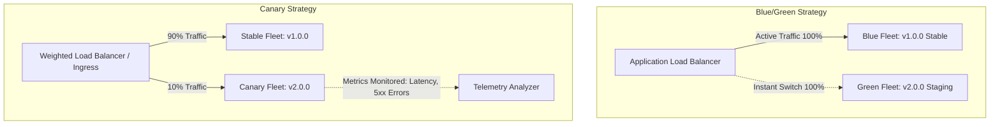

#### AWS Implementation
Configuring an AWS Application Load Balancer (ALB) Listener Rule for Weighted Canary Traffic Shifting using Terraform: [Doc: AWS ALB Weighted Target Groups, checked 2026].

```hcl
# Primary production target group (Stable v1)
resource "aws_lb_target_group" "stable_v1" {
  name        = "app-target-group-v1"
  port        = 8080
  protocol    = "HTTP"
  vpc_id      = var.vpc_id
  target_type = "ip"

  health_check {
    path                = "/healthz"
    interval            = 15
    healthy_threshold   = 2
    unhealthy_threshold = 3
  }
}

# Canary target group (New v2 release)
resource "aws_lb_target_group" "canary_v2" {
  name        = "app-target-group-v2"
  port        = 8080
  protocol    = "HTTP"
  vpc_id      = var.vpc_id
  target_type = "ip"

  health_check {
    path                = "/healthz"
    interval            = 15
    healthy_threshold   = 2
    unhealthy_threshold = 3
  }
}

# ALB Listener Rule executing 90/10 weighted canary traffic routing
resource "aws_lb_listener_rule" "canary_traffic_split" {
  listener_arn = var.alb_https_listener_arn
  priority     = 100

  action {
    type = "forward"
    forward {
      target_group {
        arn    = aws_lb_target_group.stable_v1.arn
        weight = 90
      }

      target_group {
        arn    = aws_lb_target_group.canary_v2.arn
        weight = 10
      }

      stickiness {
        enabled  = true
        duration = 600 # 10-minute stickiness keeps canary users consistent
      }
    }
  }

  condition {
    path_pattern {
      values = ["/api/*"]
    }
  }
}
```

#### OCI Implementation
Configuring an OCI Load Balancer Backend Set with weighted canary routing and Blue/Green backend switching: [Doc: OCI Load Balancer Backend Set Weighted Routing, checked 2026].

```hcl
# OCI Load Balancer Backend Set configured for Canary Weighted Routing
resource "oci_load_balancer_backend_set" "app_backend_set" {
  name             = "prod-app-backend-set"
  load_balancer_id = var.lb_ocid
  policy           = "WEIGHTED_ROUND_ROBIN"

  health_checker {
    protocol          = "HTTP"
    port              = 8080
    url_path          = "/healthz"
    interval_ms       = 10000
    timeout_in_millis = 3000
    retries           = 3
  }

  lb_cookie_session_persistence_configuration {
    cookie_name        = "CANARY_SESSION"
    disable_fallback   = false
    is_secure          = true
    is_http_only       = true
    max_age_in_seconds = 1800
  }
}

# Stable v1 backend instance with weight 9
resource "oci_load_balancer_backend" "backend_v1" {
  load_balancer_id = var.lb_ocid
  backendset_name  = oci_load_balancer_backend_set.app_backend_set.name
  ip_address       = "10.0.1.15"
  port             = 8080
  weight           = 9 # 90% share
  backup           = false
}

# Canary v2 backend instance with weight 1
resource "oci_load_balancer_backend" "backend_v2_canary" {
  load_balancer_id = var.lb_ocid
  backendset_name  = oci_load_balancer_backend_set.app_backend_set.name
  ip_address       = "10.0.1.88"
  port             = 8080
  weight           = 1 # 10% share
  backup           = false
}
```

#### Common Trap
Executing Blue/Green or Canary deployments without decoupling database migrations. If Version 2 of the application executes a destructive database schema change (e.g., dropping or renaming a column) before traffic is shifted, the active Version 1 fleet will immediately crash on missing database columns, causing a complete system outage regardless of the deployment strategy. In both Blue/Green and Canary deployments, all database changes must follow the **Expand/Contract (Parallel-Run)** pattern so that V1 and V2 can safely operate against the database concurrently.

#### Follow-up Question
How do you guarantee that a user whose session hit the Canary version does not bounce back to the Stable version on their next HTTP request?

*Answer*: By enabling **Session Stickiness** on the Canary routing rule (e.g., ALB target group stickiness or OCI Load Balancer Cookie Session Persistence). Once a user's initial request is routed to the 10% Canary target group, a signed HTTP cookie is injected into the client's browser. Subsequent requests containing that cookie bypass weighted random routing and remain pinned to the Canary fleet for the duration of the TTL.

---

### Q452: GitOps Operating Model (ArgoCD & Flux vs Push-Based CI/CD)

#### Question
How does the pull-based GitOps deployment model (implemented via ArgoCD or Flux) fundamentally differ in security, state reconciliation, and drift management from traditional push-based CI/CD pipelines?

#### Short Answer
Traditional push-based CI/CD (e.g., Jenkins or GitHub Actions running `kubectl apply` or `helm upgrade`) requires injecting long-lived, highly privileged cluster administrative credentials into external CI runners, creating a severe attack surface. In contrast, **pull-based GitOps** runs an in-cluster Kubernetes operator (ArgoCD or Flux) that continuously polls a Git repository representing the desired state. GitOps eliminates external cluster write credentials, automatically detects and self-heals out-of-band cluster drift, and enforces that Git is the single, cryptographically auditable source of truth.

#### Deep Answer
The shift from push-based CI/CD to pull-based GitOps addresses major enterprise security and operational gaps:

**Push-Based Architecture Vulnerabilities**:
- External CI/CD servers (GitHub Actions, GitLab CI, Jenkins) must hold `cluster-admin` kubeconfig credentials or cross-account IAM assume-role privileges.
- If a CI runner is compromised via an untrusted dependency or malicious pull request, the attacker gains full write access to the Kubernetes control plane.
- Push pipelines run only on commit events; if someone manually runs `kubectl edit deployment` or deletes a pod directly in the cluster, push CI has no awareness of the drift until the next release.

**Pull-Based GitOps Mechanics**:
1. The CI pipeline's responsibility ends at building, testing, signing container images, and committing updated manifest tags (`image: tag: v2.1.0`) to a deployment Git repository.
2. Inside the Kubernetes cluster (AWS EKS or OCI OKE), the GitOps agent (ArgoCD / Flux) polls the Git repo (or receives a webhook).
3. The controller compares the **Desired State** (Git commits) against the **Live State** (etcd).
4. If a difference is detected:
   - It performs declarative reconciliation, executing `kubectl apply` internally using its local In-Cluster ServiceAccount.
   - If **Self-Healing** (`selfHeal: true`) is enabled, any manual console change made by an engineer inside the cluster is automatically overwritten and reverted to the Git baseline within seconds.

**ArgoCD vs Flux Architectural Nuance**:
- **ArgoCD**: Provides a rich graphical user interface (Web UI), centralized multi-cluster management via an ApplicationSet controller, single sign-on (SSO/OIDC) integration, and manual sync approval gates.
- **Flux (Flux v2)**: Built entirely as native Kubernetes Custom Resource Definitions (Kustomization, HelmRelease, GitRepository). Operates headless without a mandatory UI, natively adhering to Kubernetes controller design patterns and consuming significantly less memory.

#### Architecture
```mermaid
graph TD
    Dev[Developer git commit] --> AppRepo[App Code Repository]
    AppRepo --> CI[CI Pipeline: Test, Build & Push Image]
    CI --> Reg[Container Registry: ECR / OCIR]
    CI -->|Update Image Tag in Git| ConfigRepo[GitOps Deployment Repository]

    subgraph Kubernetes Cluster Boundary EKS / OKE
        GitOps[GitOps Operator: ArgoCD / Flux]
        GitOps -->|1. Poll & Pull Desired State| ConfigRepo
        GitOps -->|2. Query Live State| KubeAPI[Kubernetes API / etcd]
        GitOps -->|3. Reconcile Delta / Overwrite Drift| KubeAPI
        KubeAPI --> Pods[Application Pods running from ECR/OCIR]
    end

    actor RogueAdmin as Manual kubectl edit
    RogueAdmin -.->|Manual mutation| KubeAPI
    KubeAPI -.->|Drift Detected!| GitOps
    GitOps -.->|Auto Self-Heal Reverts to Git| KubeAPI
```

#### AWS Implementation
Deploying a production ArgoCD Application on AWS EKS using Helm and Terraform, configuring automated self-healing and Git synchronization: [Doc: AWS EKS GitOps & ArgoCD Architecture, checked 2026].

```hcl
# ArgoCD Application definition tracking GitOps deployment repository
resource "kubernetes_manifest" "argocd_production_app" {
  manifest = {
    apiVersion = "argoproj.io/v1alpha1"
    kind       = "Application"
    metadata = {
      name      = "order-processing-service"
      namespace = "argocd"
      finalizers = [
        "resources-finalizer.argocd.argoproj.io"
      ]
    }
    spec = {
      project = "default"
      source = {
        repoURL        = "https://github.com/corp-org/k8s-gitops-manifests.git"
        targetRevision = "main"
        path           = "overlays/production"
      }
      destination = {
        server    = "https://kubernetes.default.svc"
        namespace = "production"
      }
      syncPolicy = {
        automated = {
          prune    = true  # Delete resources removed from Git
          selfHeal = true  # Revert out-of-band cluster drift
        }
        syncOptions = [
          "CreateNamespace=true",
          "ApplyOutOfSyncOnly=true"
        ]
        retry = {
          limit = 5
          backoff = {
            duration    = "5s"
            factor      = 2
            maxDuration = "3m"
          }
        }
      }
    }
  }
}
```

#### OCI Implementation
Deploying a Flux v2 GitRepository and Kustomization resource on Oracle Cloud Infrastructure Container Engine for Kubernetes (OKE): [Doc: OCI OKE & Flux v2 GitOps Integration, checked 2026].

```yaml
# flux-git-source.yaml
apiVersion: source.toolkit.fluxcd.io/v1
kind: GitRepository
metadata:
  name: oci-production-manifests
  namespace: flux-system
spec:
  interval: 1m
  url: https://github.com/corp-org/oci-oke-manifests.git
  ref:
    branch: main
  secretRef:
    name: oci-git-credentials
  timeout: 60s
---
# flux-kustomization.yaml
apiVersion: kustomize.toolkit.fluxcd.io/v1
kind: Kustomization
metadata:
  name: production-workloads
  namespace: flux-system
spec:
  interval: 5m
  path: "./clusters/oci-ashburn/production"
  prune: true
  sourceRef:
    kind: GitRepository
    name: oci-production-manifests
  validation: client
  timeout: 2m
  force: false
  # Automatic remediation of failed releases
  retryInterval: 1m
```

Apply via kubectl inside OKE:
```bash
# Verify Flux reconciliation status in OCI OKE cluster
flux get kustomizations --watch
```

#### Common Trap
Storing dynamically generated runtime secrets or Helm values containing plaintext passwords directly inside the GitOps repository. Because Git is the central source of truth, committing raw Kubernetes `Secret` manifests exposes credentials to anyone with repository read access. Production GitOps requires integrating **Sealed Secrets**, **External Secrets Operator (ESO)** fetching secrets dynamically from AWS Secrets Manager or OCI Vault, or using Mozilla SOPS with KMS encryption keys committed to Git.

#### Follow-up Question
How do you prevent a GitOps operator from entering an infinite reconciliation CPU crash-loop when an external controller (like HorizontalPodAutoscaler) mutates a deployment attribute?

*Answer*: When an HPA dynamically modifies `spec.replicas`, ArgoCD detects this as out-of-sync drift and attempts to reset replicas back to the static Git manifest value. To resolve this, configure ArgoCD's `ignoreDifferences` block in the Application spec, instructing the comparison engine to ignore differences on path `/spec/replicas` for resources of kind `Deployment`.

---

### Q453: Progressive Delivery and Automated Canary Analysis (Flagger & Argo Rollouts)

#### Question
How do Progressive Delivery controllers (such as Flagger and Argo Rollouts) automate canary releases and metric-driven rollbacks on Kubernetes, and how are statistical analysis models applied to observability metrics?

#### Short Answer
Progressive Delivery extends continuous delivery by dynamically controlling blast radius using live telemetry. Controllers like **Flagger** or **Argo Rollouts** replace standard Kubernetes Deployments with custom Rollout resources. During a deployment, the controller provisions a canary replica set, programs the ingress/service mesh (Istio, AWS App Mesh, NGINX, Linkerd) to route an incremental fraction of traffic (e.g., 5% $\rightarrow$ 10% $\rightarrow$ 20%), queries Prometheus/Datadog/CloudWatch for key performance indicators (HTTP 5xx rate $< 0.5\%$, p99 latency $< 200\text{ms}$), and automatically promotes or rolls back the release without human intervention if metric thresholds fail.

#### Deep Answer
Standard Kubernetes rolling updates cannot evaluate whether the application is actually serving valid business responses: as long as the container liveness and readiness probes return 200, Kubernetes considers the pod healthy, even if 90% of user checkout transactions are failing with HTTP 500 errors!

**Progressive Delivery Operational Lifecycle**:
1. **Canary Initialization**:
   - A new container image is pushed to the cluster.
   - The controller creates a duplicate `canary` deployment alongside the `primary` deployment.
2. **Traffic Shifting via Service Mesh / Ingress**:
   - The controller adjusts the traffic split weights in the underlying router (e.g., Istio `VirtualService` or AWS ALB Ingress).
   - Step weight: $5\% \rightarrow 10\% \rightarrow 25\% \rightarrow 50\%$.
3. **Automated Canary Analysis (ACA)**:
   - At each step interval (e.g., every 1 minute for 10 iterations), the controller runs queries against the metrics provider:
     - **Success Rate**: $\frac{\text{sum}(\text{rate}(http\_requests\_total\{status!\sim"5.."\}))}{\text{sum}(\text{rate}(http\_requests\_total))} \ge 99.5\%$
     - **Latency**: $\text{histogram\_quantile}(0.99, \text{sum}(\text{rate}(http\_request\_duration\_seconds\_bucket)) \le 0.25$
4. **Outcome Branches**:
   - **Success (Promotion)**: Once all iterations pass without exceeding the maximum allowable failure threshold, the primary deployment is updated with the new image, and traffic shifts 100% to primary.
   - **Failure (Automated Rollback)**: If metric checks fail more than the configured limit (e.g., 3 consecutive metric check failures), traffic is immediately snapped back to 100% primary (0% canary), the canary pods are scaled to zero, and an alert is dispatched to Slack/PagerDuty.

#### Architecture
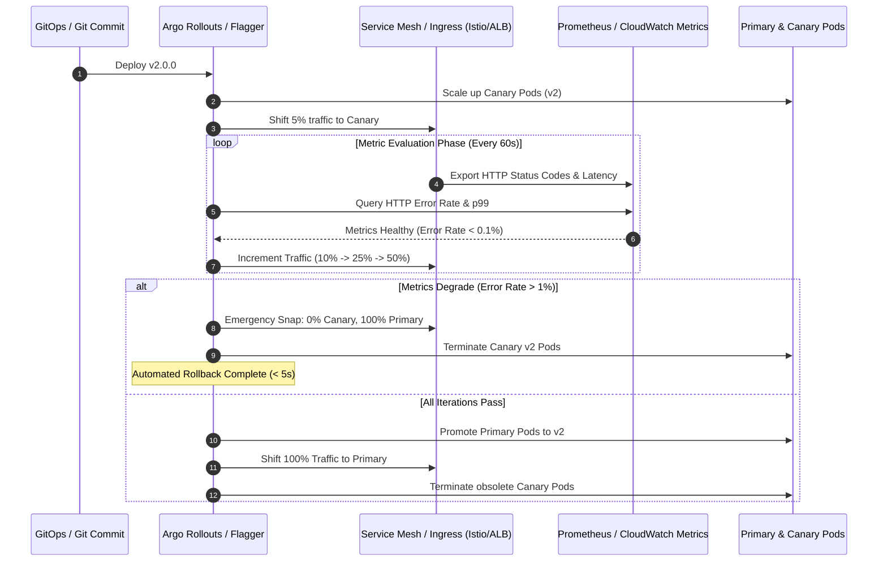

#### AWS Implementation
Argo Rollouts `Rollout` manifest with Prometheus Canary Analysis metric templates on AWS EKS: [Doc: Argo Rollouts Specification & Canary Strategy, checked 2026].

```yaml
# production-rollout.yaml
apiVersion: argoproj.io/v1alpha1
kind: Rollout
metadata:
  name: payment-gateway
  namespace: production
spec:
  replicas: 10
  strategy:
    canary:
      canaryService: payment-gateway-canary
      activeService: payment-gateway-stable
      trafficRouting:
        alb:
          ingress: payment-gateway-ingress
          servicePort: 80
      steps:
        - setWeight: 5
        - pause: { duration: 2m }
        - setWeight: 20
        - pause: { duration: 5m }
        - setWeight: 50
        - pause: { duration: 5m }
      analysis:
        templates:
          - templateName: success-rate-analysis
        args:
          - name: service-name
            value: payment-gateway
  template:
    metadata:
      labels:
        app: payment-gateway
    spec:
      containers:
        - name: payment-gateway
          image: 112233445566.dkr.ecr.us-east-1.amazonaws.com/payment:v2.4.0
          ports:
            - containerPort: 8080
---
# AnalysisTemplate for automated metric verification
apiVersion: argoproj.io/v1alpha1
kind: AnalysisTemplate
metadata:
  name: success-rate-analysis
  namespace: production
spec:
  metrics:
    - name: success-rate
      interval: 30s
      successCondition: result[0] >= 0.995
      failureLimit: 3
      provider:
        prometheus:
          address: http://prometheus-k8s.monitoring.svc:9090
          query: |
            sum(rate(http_requests_total{status!~"5..",service="payment-gateway-canary"}[1m]))
            /
            sum(rate(http_requests_total{service="payment-gateway-canary"}[1m]))
```

#### OCI Implementation
Flagger `Canary` custom resource running on OKE using NGINX Ingress and OCI Monitoring Prometheus exporter: [Doc: Flagger Progressive Delivery on OKE, checked 2026].

```yaml
# flagger-canary.yaml
apiVersion: flagger.app/v1beta1
kind: Canary
metadata:
  name: order-service
  namespace: production
spec:
  targetRef:
    apiVersion: apps/v1
    kind: Deployment
    name: order-service
  service:
    port: 8080
    targetPort: 8080
  analysis:
    interval: 1m
    threshold: 3
    maxWeight: 50
    stepWeight: 10
    metrics:
      - name: request-success-rate
        thresholdRange:
          min: 99
        interval: 1m
      - name: request-duration
        thresholdRange:
          max: 500 # max 500ms p99 latency
        interval: 1m
    webhooks:
      - name: slack-alert
        type: post-rollout
        url: https://hooks.slack.com/services/T00/B00/X00
        timeout: 5s
        payload:
          text: "Canary deployment for order-service failed and was rolled back automatically."
```

#### Common Trap
Running Canary Analysis on low-traffic microservices without synthetic traffic generation. If a canary receives only 2 requests over a 5-minute interval, a single network glitch or client error causes the error rate to calculate at 50%, triggering an immediate false-positive rollback! Alternatively, if it receives zero requests, the success rate metrics return `NaN` or zero, halting the pipeline. For low-traffic services, Progressive Delivery requires automated **Synthetic Webhooks** (e.g., Flagger load testers or k6 scripts) to generate synthetic load during the evaluation window.

#### Follow-up Question
How does Argo Rollouts or Flagger distinguish between errors caused by client-side 4xx issues (like invalid passwords) versus application 5xx crashes?

*Answer*: The Prometheus metrics query explicitly filters the HTTP status code regex. The query sums rates for `status=~"5.."` while excluding `status=~"4.."`, ensuring client authentication failures or bad input payloads do not penalize the deployment health score.

---

### Q454: AWS CodePipeline vs OCI DevOps Service

#### Question
How do native managed CI/CD platforms—specifically AWS CodePipeline (with CodeBuild and CodeDeploy) and OCI DevOps Service—compare in architecture, execution environments, artifact management, and IAM authorization models?

#### Short Answer
AWS CodePipeline is a pipeline orchestration service that coordinates modular services: **CodeBuild** (ephemeral container build environments), **CodeDeploy** (rolling, blue/green deployment agent to EC2, ECS, and Lambda), and **CodeCommit** / S3 / GitHub (sources). OCI DevOps Service is an integrated, end-to-end CI/CD platform native to Oracle Cloud Infrastructure that unifies Build Pipelines, Deployment Pipelines, Code Repositories, and Artifact Repositories. Both platforms execute inside managed, isolated serverless compute runners, eliminating self-hosted Jenkins infrastructure, and authenticate natively via IAM Roles (AWS) and Dynamic Groups / Instance Principals (OCI).

#### Deep Answer
Evaluating AWS CodePipeline against OCI DevOps Service highlights how cloud providers structure native deployment automation:

**Comparative Matrix**:

| Dimension | AWS CodePipeline Suite | OCI DevOps Service |
| :--- | :--- | :--- |
| **Pipeline Architecture** | Modular: CodePipeline orchestrates separate CodeBuild & CodeDeploy jobs | Integrated: Single DevOps Project contains Build & Deploy pipelines |
| **Build Runners** | CodeBuild provides managed Linux/Windows/ARM container environments | OCI DevOps Build Stages run in ephemeral, managed Oracle Linux containers |
| **Deployment Targets** | EC2, ECS, Lambda, EKS, CloudFormation, S3 | OKE (Kubernetes), Instance Pools (Compute), OCI Functions |
| **Artifact Repositories** | Amazon S3 & Amazon ECR | OCI Artifact Registry (generic packages) & OCIR (Docker) |
| **Security & IAM** | IAM Service Roles assume execution policies per stage | Compartments, Dynamic Groups, and Identity Policies |
| **Trigger Mechanisms** | Amazon EventBridge, GitHub webhooks, S3 change events | OCI Events Service, GitLab/GitHub Webhooks, OCI Code Repositories |
| **Pricing Model** | \$1 per active pipeline per month; CodeBuild billed per compute minute | Build runner billed per execution minute; pipeline orchestration is **free** |

**Key Architectural Strengths of OCI DevOps**:
- **Native OKE Deployment**: Unlike AWS CodePipeline which requires running custom `kubectl` commands inside CodeBuild scripts to deploy to EKS, OCI DevOps includes a native **Deploy to OKE** stage that accepts Kubernetes manifest artifacts directly and handles rollouts natively.
- **Unified DevOps Project**: Repositories, build pipelines, deployment pipelines, artifacts, and triggers all reside inside a single OCI Compartment boundary, inheriting fine-grained IAM compartment policies.

#### Architecture
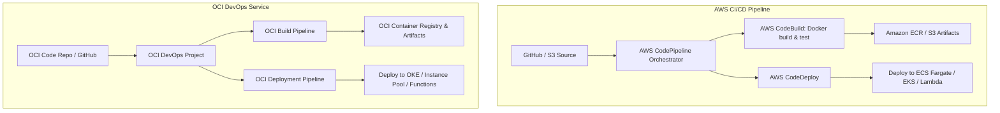

#### AWS Implementation
Terraform configuration provisioning an AWS CodePipeline with CodeBuild and an S3 artifact store: [Doc: AWS CodePipeline & CodeBuild Terraform Configuration, checked 2026].

```hcl
# S3 Bucket for CodePipeline artifacts with KMS encryption
resource "aws_s3_bucket" "artifacts" {
  bucket = "corp-codepipeline-artifacts-us-east-1"
}

# CodeBuild Project running in managed container
resource "aws_codebuild_project" "build_app" {
  name          = "order-service-build"
  service_role  = aws_iam_role.codebuild_role.arn
  build_timeout = 30

  artifacts {
    type = "CODEPIPELINE"
  }

  environment {
    compute_type                = "BUILD_GENERAL1_MEDIUM"
    image                       = "aws/codebuild/amazonlinux2-x86_64-standard:5.0"
    type                        = "LINUX_CONTAINER"
    privileged_mode             = true # Required for Docker daemon
  }

  source {
    type      = "CODEPIPELINE"
    buildspec = "buildspec.yml"
  }
}

# AWS CodePipeline definition linking Source, Build, and Deploy
resource "aws_codepipeline" "pipeline" {
  name     = "order-service-pipeline"
  role_arn = aws_iam_role.pipeline_role.arn

  artifact_store {
    location = aws_s3_bucket.artifacts.bucket
    type     = "S3"
  }

  stage {
    name = "Source"
    action {
      name             = "SourceAction"
      category         = "Source"
      owner            = "AWS"
      provider         = "CodeStarSourceConnection"
      version          = "1"
      output_artifacts = ["source_output"]
      configuration = {
        ConnectionArn    = var.codestar_connection_arn
        FullRepositoryId = "corp-org/order-service"
        BranchName       = "main"
      }
    }
  }

  stage {
    name = "Build"
    action {
      name             = "BuildAction"
      category         = "Build"
      owner            = "AWS"
      provider         = "CodeBuild"
      version          = "1"
      input_artifacts  = ["source_output"]
      output_artifacts = ["build_output"]
      configuration = {
        ProjectName = aws_codebuild_project.build_app.name
      }
    }
  }
}
```

#### OCI Implementation
Terraform configuration provisioning an OCI DevOps Project, Code Repository, and Build Pipeline: [Doc: OCI DevOps Service Terraform Provider, checked 2026].

```hcl
# OCI DevOps Project
resource "oci_devops_project" "app_project" {
  compartment_id = var.compartment_id
  name           = "ecommerce-devops-project"
  description    = "CI/CD project for microservices"

  notification_config {
    topic_id = var.ons_topic_id
  }
}

# OCI Managed Code Repository
resource "oci_devops_repository" "app_repo" {
  project_id     = oci_devops_project.app_project.id
  name           = "ecommerce-backend"
  repository_type = "HOSTED"
  default_branch = "main"
}

# OCI DevOps Build Pipeline
resource "oci_devops_build_pipeline" "build_pipeline" {
  project_id   = oci_devops_project.app_project.id
  display_name = "build-and-package-pipeline"
  description  = "Compiles Java binary and builds Docker container"
}

# Build Stage inside Build Pipeline
resource "oci_devops_build_pipeline_stage" "managed_build_stage" {
  build_pipeline_id = oci_devops_build_pipeline.build_pipeline.id
  display_name      = "docker-build-stage"
  build_pipeline_stage_type = "BUILD"

  build_spec_file = "build_spec.yaml"
  build_runner_shape_config {
    build_runner_type = "CUSTOM"
    ocpus             = 2
    memory_in_gbs     = 8
  }

  image = "OL7_X86_64_STANDARD_10"

  build_source_collection {
    items {
      connection_type = "DEVOPS_CODE_REPOSITORY"
      branch          = "main"
      name            = "main-source"
      repository_id   = oci_devops_repository.app_repo.id
      repository_url  = oci_devops_repository.app_repo.http_url
    }
  }
}
```

#### Common Trap
Running Docker-in-Docker (DinD) builds inside AWS CodeBuild without enabling `privileged_mode = true`. If `privileged_mode` is omitted, `docker build` fails immediately with `Cannot connect to the Docker daemon at unix:///var/run/docker.sock`. In OCI DevOps, root-level container socket access is controlled via build runner security policies; builds attempting to modify kernel modules or low-level network interfaces inside the build runner container will be denied.

#### Follow-up Question
How do AWS CodePipeline and OCI DevOps support manual approval gates for production deployments?

*Answer*: In AWS CodePipeline, insert a stage action of category `Approval` with provider `Manual`, configured with an SNS topic to notify approvers. The pipeline halts until an authorized IAM user approves via AWS Console or API. In OCI DevOps, insert a `MANUAL_APPROVAL` stage within the deployment pipeline, specifying the minimum number of approvals and sending notifications via OCI Notification Service (ONS).

---

### Q455: Immutable Artifact Pipelines and Container Registry Management

#### Question
How do you architect an immutable container artifact pipeline that guarantees bit-for-bit reproducibility, prevents image tag overwriting, optimizes layer caching, and replicates images across global registries?

#### Short Answer
Container images must be strictly **immutable** to prevent deployment drift. To achieve this: (1) Enable tag immutability on Amazon ECR and OCI Container Registry (OCIR) so tags like `v1.2.0` cannot be overwritten; (2) Deploy containers referencing their cryptographic SHA-256 digest (`image@sha256:7f...`) rather than mutable tags; (3) Optimize Docker builds using multi-stage builds and Docker Buildx cache mounts (`--cache-from`, `--cache-to`) stored in registry cache manifests; and (4) Configure cross-region / cross-account replication rules on ECR and OCIR to keep latency low for regional clusters and provide instant disaster recovery readiness.

#### Deep Answer
Deploying using mutable tags like `latest` or `main` is a severe anti-pattern: if an image tag is rewritten, two pods in the exact same Kubernetes replica set can boot up running entirely different code binaries!

**Core Pillars of Immutable Artifact Engineering**:

1. **Tag Immutability**:
   - Both AWS ECR and OCI OCIR support repository-level immutability settings.
   - Once an image is pushed with tag `v1.4.2`, any subsequent attempt to push an image with tag `v1.4.2` is rejected with `ImageTagAlreadyExistsException` (AWS) or `409 Conflict` (OCI).

2. **Digest Pinning (`@sha256:...`)**:
   - While human-readable semantic tags (`v1.4.2`) are useful in Git repositories, the Kubernetes manifest should specify the immutable SHA-256 digest:
     `image: 112233445566.dkr.ecr.us-east-1.amazonaws.com/order-service@sha256:5b8a...`
   - Digests are cryptographically bound to the image layers. Even if a registry tag were hijacked, the container runtime (containerd/CRI-O) refuses to pull if the content hash diverges.

3. **Multi-Stage Build Optimization & Cache Mounts**:
   - Separate the build-time SDK (Go/Rust/JDK compiler, npm dependencies) from the runtime base (distroless or Alpine).
   - Use BuildKit cache mounts (`--mount=type=cache,target=/root/.cache/go-build`) to preserve dependency caches across builds without bloating intermediate layers.
   - Push layer caches directly to container registries using `--cache-to type=registry,mode=max`.

4. **Global Cross-Region Registry Replication**:
   - A single primary build in `us-east-1` (AWS) or `us-ashburn-1` (OCI) automatically replicates the signed container layers asynchronously to DR regions (`us-west-2` / `us-phoenix-1`).

#### Architecture
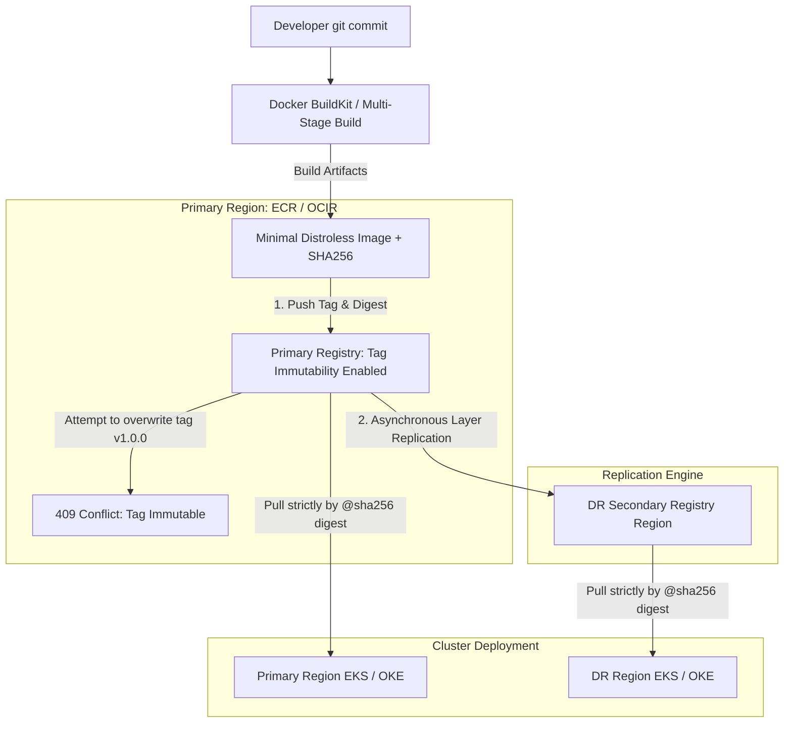

#### AWS Implementation
Configuring Amazon ECR with tag immutability, automated lifecycle expiration policies, and cross-region replication via Terraform: [Doc: AWS ECR Tag Immutability & Replication, checked 2026].

```hcl
# Primary ECR repository with Tag Immutability and KMS encryption
resource "aws_ecr_repository" "app_repo" {
  name                 = "order-processing-service"
  image_tag_mutability = "IMMUTABLE" # Guarantees tags cannot be overwritten

  image_scanning_configuration {
    scan_on_push = true
  }

  encryption_configuration {
    encryption_type = "KMS"
    kms_key         = var.ecr_kms_key_arn
  }
}

# Cross-Region Replication Configuration (Replicate from us-east-1 to us-west-2)
resource "aws_ecr_replication_configuration" "replication" {
  replication_configuration {
    rule {
      destination {
        region      = "us-west-2"
        registry_id = var.aws_account_id
      }
      repository_filter {
        filter      = "order-processing-service"
        filter_type = "PREFIX_MATCH"
      }
    }
  }
}

# ECR Lifecycle Policy to prune untagged orphan layers after 7 days
resource "aws_ecr_lifecycle_policy" "prune_untagged" {
  repository = aws_ecr_repository.app_repo.name

  policy = jsonencode({
    rules = [
      {
        rulePriority = 1
        description  = "Expire untagged images older than 7 days"
        selection = {
          tagStatus   = "untagged"
          countType   = "sinceImagePushed"
          countUnit   = "days"
          countNumber = 7
        }
        action = { type = "expire" }
      }
    ]
  })
}
```

#### OCI Implementation
Terraform configuration provisioning an OCI Container Registry (OCIR) with immutable tags and public read restrictions: [Doc: OCI Container Registry Immutability, checked 2026].

```hcl
# OCI Container Registry (OCIR) Repository with Tag Immutability
resource "oci_artifacts_container_repository" "oci_app_repo" {
  compartment_id = var.compartment_id
  display_name   = "order-processing-service"
  is_public      = false
  is_immutable   = true # Disallows overwriting existing tags

  readme {
    content = "Production container repository for order processing service."
    format  = "TEXT_MARKDOWN"
  }
}

# Command line login and digest-based pull verification
# docker pull <region-key>.ocir.io/<tenancy-namespace>/order-processing-service@sha256:7b5...
```

Production multi-stage `Dockerfile` optimizing build caching and runtime immutability:
```dockerfile
# syntax=docker/dockerfile:1.4
# Stage 1: Build binary using cached module mount
FROM golang:1.22-alpine AS builder
WORKDIR /workspace
COPY go.mod go.sum ./
RUN --mount=type=cache,target=/go/pkg/mod go mod download
COPY . .
RUN --mount=type=cache,target=/root/.cache/go-build \
    CGO_ENABLED=0 GOOS=linux go build -ldflags="-s -w" -o app .

# Stage 2: Distroless minimal scratch container
FROM gcr.io/distroless/static:nonroot
WORKDIR /
COPY --from=builder /workspace/app /app
USER 65532:65532
ENTRYPOINT ["/app"]
```

#### Common Trap
Enabling Tag Immutability without setting up automated garbage collection for untagged images. When building and testing Docker images in CI, intermediate build failures or un-promoted test builds push image layers that lose their tags once newer builds proceed. If untagged images are never purged via ECR / OCIR Lifecycle Policies, the registry storage will grow indefinitely, generating thousands of dollars in hidden object storage costs.

#### Follow-up Question
Why should production Kubernetes deployments reference images by SHA-256 digest (`image@sha256:...`) instead of semantic tags (`image:v1.2.0`)?

*Answer*: Tag names are resolved dynamically by the container runtime during image pulls. If the tag is maliciously updated in a registry that lacks immutability, or if a mirror registry caches a stale version of the tag, different cluster nodes will execute different binaries under the same version tag. Pinned SHA-256 digests provide cryptographic integrity: the runtime computes the Merkle hash of all incoming layers and aborts the pull if a single byte diverges from the manifest digest.

---

### Q456: Supply Chain Security and Cryptographic Container Signing (Cosign & SLSA)

#### Question
How do you secure the software supply chain in cloud CI/CD pipelines using cryptographic image signing (Cosign/Sigstore), SLSA provenance generation, and runtime admission verification?

#### Short Answer
Software supply chain security guarantees that only verified, tamper-proof artifacts built by authorized pipelines run in production clusters. To enforce this: (1) CI runners build containers and generate cryptographic signatures using **Cosign (Sigstore)**; (2) Pipelines generate verifiable **SLSA (Supply-chain Levels for Software Artifacts)** provenance documents detailing exact Git commit hashes and build parameters; (3) Signatures and Software Bills of Materials (SBOMs) are attached to the image in ECR or OCIR; and (4) Kubernetes Admission Controllers (e.g., **Kyverno** or **Sigstore Policy Controller**) intercept pod creation requests, cryptographically verifying signatures and blocking unsigned images from running.

#### Deep Answer
Attacks like SolarWinds and Codecov demonstrated that attackers do not need to exploit production application code—they compromise CI/CD pipelines to inject malicious code into trusted build artifacts.

**The Sigstore / Cosign Architecture**:
- **Keyless Signing (OIDC + Fulcio + Rekor)**:
  - Eliminates the need to manage and rotate long-lived private signing keys.
  - The CI runner (GitHub Actions / GitLab) requests an OIDC identity token.
  - Sigstore's **Fulcio** Certificate Authority verifies the OIDC token (proving the job ran in `github.com/corp/repo` on branch `main`) and issues a short-lived X.509 certificate valid for only 10 minutes.
  - Cosign signs the container image digest with the ephemeral key.
  - The signature, public key, and certificate are recorded in **Rekor**, an immutable, append-only transparency log.

**Supply-chain Levels for Software Artifacts (SLSA)**:
- SLSA defines maturity levels (Level 1 through 4) assessing build integrity.
- **SLSA Level 3** guarantees that:
  - Builds run on an isolated, hosted build platform (e.g., GitHub-hosted runners or AWS CodeBuild).
  - The build provenance (attestation) is cryptographically signed and non-falsifiable.
  - Dependencies and source repositories are locked to exact immutable commit SHAs.

**Runtime Enforcement via Admission Controllers**:
- Even if an image is signed, developers could accidentally deploy an untrusted third-party image directly via `kubectl apply`.
- Kubernetes Validating Admission Webhooks (Kyverno, OPA Gatekeeper, or Sigstore Policy Controller) intercept every `Pod` creation request.
- The webhook downloads the Cosign signature from ECR/OCIR, checks Rekor transparency proofs, and verifies the cert identity against organizational policies. If verification fails, the pod is rejected at the API server boundary.

#### Architecture
```mermaid
graph TD
    subgraph CI Pipeline Build & Sign
        Git[Developer git push] --> CI[CI Runner: GitHub Actions / AWS CodeBuild]
        CI --> Build[Build & Push Image to ECR / OCIR]
        CI -->|1. Request OIDC Token| OIDC[OIDC Provider]
        OIDC -->|2. JWT Token| Fulcio[Sigstore Fulcio CA]
        Fulcio -->|3. Short-Lived X.509 Cert| Cosign[Cosign CLI]
        Cosign -->|4. Sign Image Digest| Reg[ECR / OCIR: Store Signature & SBOM]
        Cosign -->|5. Record Transparency Proof| Rekor[Sigstore Rekor Transparency Log]
    end

    subgraph Kubernetes Runtime Admission (EKS / OKE)
        DevAdmin[kubectl apply -f pod.yaml] --> KubeAPI[Kubernetes API Server]
        KubeAPI --> Webhook[Kyverno / Sigstore Admission Controller]
        Webhook -->|Fetch Signature & Cert| Reg
        Webhook -->|Verify Proof| Rekor
        Webhook --> Check{Signature Valid & Approved Identity?}
        Check -->|Yes| Run[Pod Scheduled on Node]
        Check -->|No| Reject[403 Forbidden: Unsigned Image Denied]
    end
```

#### AWS Implementation
Signing a container image inside a CI runner using Cosign with AWS KMS CMK and verifying signatures: [Doc: Sigstore Cosign & AWS KMS Integration, checked 2026].

```bash
#!/usr/bin/env bash
# sign-container-image.sh: Sign ECR image using Cosign and AWS KMS
set -euo pipefail

IMAGE_URI="112233445566.dkr.ecr.us-east-1.amazonaws.com/order-service:v1.4.0"
AWS_KMS_KEY_ARN="arn:aws:kms:us-east-1:112233445566:key/mrk-cosign-signing-key"

echo "[1/4] Resolving immutable image digest..."
DIGEST=$(aws ecr describe-images \
  --repository-name order-processing-service \
  --image-ids imageTag=v1.4.0 \
  --query 'imageDetails[0].imageDigest' --output text)

FULL_TARGET="${IMAGE_URI%:*}:@${DIGEST}"
echo "Targeting Digest: $FULL_TARGET"

echo "[2/4] Generating Software Bill of Materials (SBOM) using Syft..."
syft packages "$FULL_TARGET" -o spdx-json > sbom.spdx.json

echo "[3/4] Attaching SBOM to ECR repository..."
cosign attach sbom --sbom sbom.spdx.json "$FULL_TARGET"

echo "[4/4] Cryptographically signing image digest using AWS KMS key..."
cosign sign --key "awskms://${AWS_KMS_KEY_ARN}" -y "$FULL_TARGET"

echo "[SUCCESS] Container image signed and SBOM attached to ECR."
```

Kyverno ClusterPolicy enforcing Cosign signature verification on AWS EKS:
```yaml
# kyverno-verify-signature.yaml
apiVersion: kyverno.io/v1
kind: ClusterPolicy
metadata:
  name: verify-image-signature
spec:
  validationFailureAction: Enforce
  webhookTimeoutSeconds: 30
  rules:
    - name: verify-ecr-signature
      match:
        any:
          - resources:
              kinds:
                - Pod
      verifyImages:
        - imageReferences:
            - "112233445566.dkr.ecr.us-east-1.amazonaws.com/*"
          attestors:
            - entries:
                - kms:
                    key: "arn:aws:kms:us-east-1:112233445566:key/mrk-cosign-signing-key"
```

#### OCI Implementation
Signing container images stored in OCI Container Registry using OCI Vault KMS and verifying signatures via Cosign: [Doc: OCI Vault KMS & Container Image Signing, checked 2026].

```bash
#!/usr/bin/env bash
# oci-sign-image.sh: Sign OCIR container image using Cosign and OCI Vault
set -euo pipefail

OCIR_IMAGE="iad.ocir.io/mytenancy/production/app-service:v2.0.0"
VAULT_KEY_OCID="ocid1.key.oc1.iad.bbbbbbbbxxxxxxxxxxxxxxxxxxxxxxxxxxxxxx"

echo "[INFO] Logging into OCI Container Registry..."
echo "$OCI_AUTH_TOKEN" | docker login iad.ocir.io -u "mytenancy/service_account" --password-stdin

echo "[INFO] Signing container image using OCI Vault Asymmetric KMS Key..."
# Cosign supports PKCS11 or KMS plugins; alternatively sign using raw keyless or Vault-derived key
cosign sign \
  --key "hashivault://cosign-signing-key" \
  -a "author=platform-team" \
  -a "git_sha=$GIT_COMMIT_SHA" \
  -y "$OCIR_IMAGE"

echo "[INFO] Verifying signature against OCI Vault Public Key..."
cosign verify \
  --key "hashivault://cosign-signing-key" \
  "$OCIR_IMAGE"
```

#### Common Trap
Configuring Kyverno or Sigstore admission webhooks to verify signatures on mutable image tags rather than digests. If an admission policy verifies `order-service:latest`, an attacker with registry push access could overwrite `latest` with an unverified malicious image after the initial webhook check. Admission controllers must rewrite or enforce that container image specifications resolve strictly to `@sha256:...` digests before validating cryptographic signatures.

#### Follow-up Question
What is the difference between a container image **Signature** and an **Attestation** in Cosign?

*Answer*: A **Signature** simply proves that an entity possessing a cryptographic key verified and endorsed a specific container digest. An **Attestation** is an authenticated statement (an in-toto metadata statement) containing structured payloads—such as an SBOM (cyclonedx/spdx), vulnerability scan results (Trivy/Grype), or SLSA provenance—proving not just *who* signed it, but *how* and *under what security conditions* the binary was constructed.

---

### Q457: Secret Management and Credential Rotation in CI/CD (OIDC vs Static Tokens)

#### Question
How do you architect CI/CD pipeline authentication without storing long-lived, static cloud administrative credentials (such as AWS Access Keys or OCI API Signing Keys) inside Git repository secrets?

#### Short Answer
Storing static, long-lived API keys in CI/CD secret stores (e.g., GitHub Actions Secrets) is an extreme security risk: keys do not rotate automatically, can be leaked via rogue pull requests or logged build scripts, and lack granular session expiration. Modern enterprise pipelines authenticate via **OpenID Connect (OIDC) Federated Workload Identity**. The CI runner requests an ephemeral JSON Web Token (JWT) signed by the VCS provider; the cloud provider's STS (AWS) or IAM Identity Domain (OCI) validates the JWT cryptographically, verifies claims (repository, branch, environment), and issues short-lived, temporary session credentials (valid for 15–60 minutes) that expire automatically.

#### Deep Answer
Static credentials stored in CI systems are prime targets for lateral movement and supply chain attacks:

**Threats of Static CI/CD Credentials**:
1. **Perpetual Validity**: An AWS Access Key ID and Secret Access Key created 3 years ago remain valid until explicitly revoked. If an attacker reads the secret via an echo injection in a PR, they retain persistent backdoor access.
2. **Broad Blast Radius**: Developers frequently grant static CI keys broad `AdministratorAccess` to prevent pipeline failures.
3. **No Dynamic Claim Scoping**: A static key cannot restrict operations to a specific branch or environment; any pull request that triggers the runner can execute commands with that key.

**OIDC Federated Identity Architecture**:
- Neither AWS IAM nor OCI requires storing any cloud password or private key in GitHub/GitLab.
- Flow:
  1. CI runner triggers on a git push to `main`.
  2. Runner requests an OIDC identity token from the VCS internal OIDC provider.
  3. The VCS emits a cryptographically signed JWT containing claims:
     - `iss`: `https://token.actions.githubusercontent.com`
     - `aud`: `https://github.com/corp-org` or `sts.amazonaws.com`
     - `sub`: `repo:corp-org/payment-service:ref:refs/heads/main`
     - `job_workflow_ref`: `corp-org/payment-service/.github/workflows/deploy.yml@refs/heads/main`
  4. The runner calls `sts:AssumeRoleWithWebIdentity` (AWS) or exchanges the token via OCI IAM Identity Domains.
  5. The cloud provider validates the signature against the VCS's public JWKS endpoint.
  6. The cloud provider evaluates IAM trust conditions (e.g., denying any request where `sub` is not branch `main`).
  7. The cloud provider returns temporary STS credentials (e.g., valid for 30 minutes).

#### Architecture
```mermaid
sequenceDiagram
    autonumber
    participant Runner as CI/CD Runner (GitHub Actions)
    participant VCS as GitHub OIDC Token Service
    participant Cloud as AWS STS / OCI IAM Identity Domain
    participant CloudRes as AWS / OCI Infrastructure

    Runner->>VCS: 1. Request Ephemeral OIDC Token (JWT)
    VCS-->>Runner: 2. Signed JWT (claims: repo, branch, job)
    Runner->>Cloud: 3. AssumeRoleWithWebIdentity(JWT, RoleARN)
    Cloud->>VCS: 4. Fetch Public Keys (JWKS endpoint)
    Cloud->>Cloud: 5. Verify Signature & StringEquals Sub Claim
    Cloud-->>Runner: 6. Return Short-Lived Temporary Credentials (30 mins)
    Runner->>CloudRes: 7. Deploy Infrastructure / Container
    Note over Runner,CloudRes: Credentials expire automatically; Zero static keys stored!
```

#### AWS Implementation
Terraform configuration provisioning an AWS IAM OIDC Identity Provider and an IAM Role with strict branch-level trust policies: [Doc: AWS IAM OIDC Identity Providers, checked 2026].

```hcl
# 1. Register GitHub Actions as an OIDC Identity Provider in AWS IAM
resource "aws_iam_openid_connect_provider" "github_actions" {
  url             = "https://token.actions.githubusercontent.com"
  client_id_list  = ["sts.amazonaws.com"]
  thumbprint_list = ["6938fd4d98bab03faadb97b34396831e3780aea1", "1c58a3a8518e8759bf075b76b750d4f8d264fcd9"]
}

# 2. IAM Role assumable ONLY by main branch of a specific repository
resource "aws_iam_role" "github_deployer" {
  name = "github-actions-order-service-deployer"

  assume_role_policy = jsonencode({
    Version = "2012-10-17"
    Statement = [
      {
        Effect = "Allow"
        Principal = {
          Federated = aws_iam_openid_connect_provider.github_actions.arn
        }
        Action = "sts:AssumeRoleWithWebIdentity"
        Condition = {
          StringEquals = {
            "token.actions.githubusercontent.com:aud" = "sts.amazonaws.com"
          }
          StringLike = {
            # Strictly restrict to main branch in corp-org/order-service!
            "token.actions.githubusercontent.com:sub" = "repo:corp-org/order-service:ref:refs/heads/main"
          }
        }
      }
    ]
  })
}

# 3. Attach least-privilege deployment permissions
resource "aws_iam_role_policy" "deploy_perms" {
  name = "order-service-ecs-deploy-policy"
  role = aws_iam_role.github_deployer.id

  policy = jsonencode({
    Version = "2012-10-17"
    Statement = [
      {
        Effect = "Allow"
        Action = [
          "ecs:UpdateService",
          "ecs:DescribeServices",
          "ecr:GetAuthorizationToken",
          "ecr:BatchCheckLayerAvailability",
          "ecr:PutImage"
        ]
        Resource = "*"
      }
    ]
  })
}
```

GitHub Actions Workflow YAML consuming OIDC credentials without static keys:
```yaml
# .github/workflows/deploy.yml
name: "Deploy via OIDC"
on:
  push:
    branches: [ main ]

jobs:
  deploy:
    runs-on: ubuntu-latest
    permissions:
      id-token: write # Required for requesting OIDC JWT
      contents: read
    steps:
      - name: Configure AWS Credentials via OIDC
        uses: aws-actions/configure-aws-credentials@v4
        with:
          role-to-assume: arn:aws:iam::112233445566:role/github-actions-order-service-deployer
          aws-region: us-east-1
          audience: sts.amazonaws.com

      - name: Verify AWS Identity
        run: aws sts get-caller-identity
```

#### OCI Implementation
Configuring an OCI IAM Identity Domain Application and Policy for GitHub Actions OIDC integration: [Doc: OCI IAM Identity Domains & OIDC Identity Providers, checked 2026].

```bash
#!/usr/bin/env bash
# configure-oci-oidc.sh: Set up OIDC identity provider integration in OCI Identity Domains
set -euo pipefail

DOMAIN_URL="https://idcs-xxxxxxxx.identity.oraclecloud.com"
PROVIDER_NAME="GitHubActionsProvider"

echo "[INFO] Registering GitHub Actions OIDC Provider in OCI Identity Domain..."
# In OCI Console or via OCI IAM REST API:
# 1. Navigate to Identity -> Domains -> Security -> Identity Providers
# 2. Add OIDC Identity Provider:
#    - Issuer URL: https://token.actions.githubusercontent.com
#    - Client ID: https://github.com/corp-org
#    - Supported Scopes: openid, profile

echo "[INFO] Creating Dynamic Group matching GitHub Actions JWT subject..."
# Matching rule:
# any {request.jwt.claim.iss = 'https://token.actions.githubusercontent.com',
#      request.jwt.claim.sub = 'repo:corp-org/order-service:ref:refs/heads/main'}

# Assign IAM Policy to the dynamic group:
cat << 'EOF'
Allow dynamic-group GitHubOrderServiceDeployer to manage devops-family in compartment Production
Allow dynamic-group GitHubOrderServiceDeployer to use repos in compartment Production
EOF
```

#### Common Trap
Using overly permissive wildcards in the OIDC IAM trust policy condition. For example, setting `"token.actions.githubusercontent.com:sub": "repo:corp-org/*"` allows **any** repository in your organization—including an intern's personal fork or a public sandbox project—to assume the production deployment role. Furthermore, omitting `:ref:refs/heads/main` allows untrusted feature branches or malicious Pull Requests from external forks to assume production deployment privileges. The `sub` condition must specify both the exact repository name and exact protected branch reference.

#### Follow-up Question
What occurs when an AWS IAM OIDC thumbprint changes due to an intermediate Certificate Authority rotation by the VCS provider?

*Answer*: In 2023, AWS updated IAM OIDC validation to trust root CAs from trusted libraries, rendering explicit leaf thumbprints largely obsolete for major providers like GitHub Actions. However, for custom enterprise VCS servers, if a CA rotates and the thumbprint in `thumbprint_list` is not updated, STS rejects all `AssumeRoleWithWebIdentity` requests with an HTTP 400 `InvalidIdentityToken: OpenIDConnect provider's HTTPS certificate has changed`, halting all deployments company-wide until the new SHA-1 thumbprint is registered in IAM.

---

### Q458: Dynamic Ephemeral Preview Environments and Automated Cleanup

#### Question
How do you architect dynamic, ephemeral preview environments that automatically spin up isolated application stacks for feature branch Pull Requests and reliably decommission resources upon PR merge or closure?

#### Short Answer
Dynamic ephemeral preview environments provision a dedicated, isolated copy of an application per Pull Request, enabling product managers and QA to test features against live cloud services before merging. The architecture uses: (1) CI/CD webhooks triggered on PR events (`opened`, `synchronize`, `closed`); (2) Isolated Kubernetes namespaces (EKS/OKE) or lightweight serverless stacks provisioned via Terraform/Helm; (3) Wildcard DNS routing (e.g., `pr-142.preview.corp.internal`) mapped through an ALB/NGINX Ingress; (4) Mocked or cloned database schemas; and (5) Strict automated cleanup combining PR-close webhook triggers with fallback TTL garbage collection lambdas.

#### Deep Answer
Static shared staging environments create bottlenecks: developers queue up to test features, and unstable code from one branch breaks the staging environment for everyone else.

**Architectural Components of Ephemeral Environments**:

1. **Isolation Boundary**:
   - For containerized microservices: a dedicated Kubernetes **Namespace** (`preview-pr-142`) inside an existing pre-warmed dev cluster. This avoids the 15-minute latency of provisioning dedicated VPCs and worker nodes.
   - For database persistence: use database cloning (e.g., AWS Aurora clone via copy-on-write storage, or OCI Autonomous Database clone) or run ephemeral containerized databases (Postgres/Redis) seeded with sanitized test fixtures.

2. **Dynamic Ingress and Wildcard DNS**:
   - A single Ingress Controller or Application Load Balancer is configured with a wildcard DNS record (`*.preview.example.com`).
   - The PR deployment creates an Ingress resource specifying the host: `pr-142.preview.example.com`. User traffic routes seamlessly without provisioning new public IPs or DNS zones.

3. **Lifecycle Orchestration (Create $\rightarrow$ Update $\rightarrow$ Destroy)**:
   - `pull_request.opened`: Pipeline deploys namespace, applies Helm chart, seeds DB, and posts the live preview URL as a comment on the GitHub PR.
   - `pull_request.synchronize`: Pipeline builds new image and updates the existing preview namespace.
   - `pull_request.closed`: Pipeline immediately triggers `helm uninstall` and `kubectl delete namespace`.

4. **The "Orphaned Resource" Waste Problem**:
   - If a developer closes a PR via git force-push, deletes the branch directly, or the CI runner crashes during the cleanup step, the ephemeral environment remains running indefinitely, incurring massive cloud costs.
   - *Defense-in-Depth Solution*: Deploy an in-cluster **Janitor / TTL Controller** (e.g., a scheduled CronJob or Lambda) that inspects namespace metadata tags (`created_at: 2026-09-01T12:00:00Z`). If a namespace exceeds its maximum allowable TTL (e.g., 48 hours) or its associated GitHub PR is in `closed` state, the controller forcefully purges the namespace.

#### Architecture
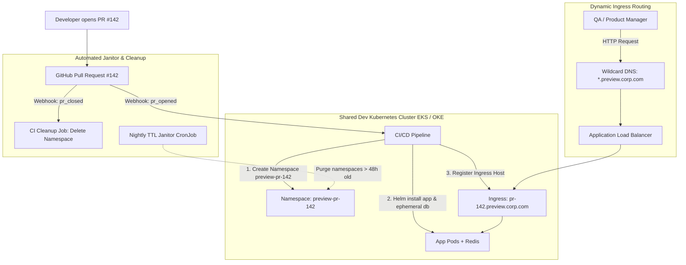

#### AWS Implementation
GitHub Actions workflow deploying an ephemeral preview environment to AWS EKS and posting the preview URL to the PR: [Doc: AWS EKS Helm Deployments & GitHub Actions, checked 2026].

```yaml
# .github/workflows/preview-environment.yml
name: "Ephemeral Preview Environment"

on:
  pull_request:
    types: [opened, synchronize, closed]

jobs:
  manage-preview:
    runs-on: ubuntu-latest
    permissions:
      id-token: write
      contents: read
      pull-requests: write
    steps:
      - name: Checkout Code
        uses: actions/checkout@v4

      - name: Configure AWS Credentials via OIDC
        uses: aws-actions/configure-aws-credentials@v4
        with:
          role-to-assume: arn:aws:iam::112233445566:role/github-eks-preview-manager
          aws-region: us-east-1

      - name: Setup Kubeconfig
        run: aws eks update-kubeconfig --name corp-dev-eks --region us-east-1

      - name: Destroy Preview Environment on PR Close
        if: github.event.action == 'closed'
        run: |
          NAMESPACE="preview-pr-${{ github.event.pull_request.number }}"
          echo "PR Closed: Deleting namespace $NAMESPACE..."
          helm uninstall order-service --namespace "$NAMESPACE" || true
          kubectl delete namespace "$NAMESPACE" --ignore-not-found=true

      - name: Deploy Ephemeral Stack
        if: github.event.action != 'closed'
        id: deploy
        run: |
          PR_NUM="${{ github.event.pull_request.number }}"
          NAMESPACE="preview-pr-${PR_NUM}"
          HOST="pr-${PR_NUM}.preview.corp.example.com"

          kubectl create namespace "$NAMESPACE" --dry-run=client -o yaml | kubectl apply -f -
          kubectl label namespace "$NAMESPACE" created_at="$(date +%s)" ttl_hours="48" --overwrite

          helm upgrade --install order-service ./chart \
            --namespace "$NAMESPACE" \
            --set image.tag="${{ github.sha }}" \
            --set ingress.enabled=true \
            --set ingress.host="$HOST"

          echo "preview_url=https://${HOST}" >> $GITHUB_OUTPUT

      - name: Comment Preview URL on PR
        if: github.event.action == 'opened'
        uses: actions/github-script@v7
        with:
          script: |
            github.rest.issues.createComment({
              issue_number: context.issue.number,
              owner: context.repo.owner,
              repo: context.repo.repo,
              body: `🚀 **Ephemeral Preview Environment Deployed!**\n\nPreview URL: [${{ steps.deploy.outputs.preview_url }}](${{ steps.deploy.outputs.preview_url }})\nEnvironment will be automatically destroyed when this PR is closed.`
            })
```

#### OCI Implementation
A bash script executing automated TTL garbage collection of expired ephemeral namespaces and associated OCI Load Balancer rules on OKE: [Doc: OCI OKE Automation & Kubernetes API, checked 2026].

```bash
#!/usr/bin/env bash
# oci-janitor-cleanup.sh: Sweep and purge expired ephemeral preview namespaces
set -euo pipefail

MAX_TTL_SECONDS=$((48 * 3600)) # 48 hours maximum lifetime
CURRENT_TIME=$(date +%s)

echo "[INFO] Scanning OKE cluster for ephemeral preview namespaces..."
NAMESPACES=$(kubectl get namespaces -l ttl_hours -o jsonpath='{range .items[*]}{.metadata.name}{" "}{.metadata.labels.created_at}{"\n"}{end}')

while IFS= read -r line; do
  [ -z "$line" ] && continue
  NS_NAME=$(echo "$line" | awk '{print $1}')
  CREATED_AT=$(echo "$line" | awk '{print $2}')

  AGE=$((CURRENT_TIME - CREATED_AT))

  if [ "$AGE" -gt "$MAX_TTL_SECONDS" ]; then
    echo "[EXPIRED] Namespace $NS_NAME is $((AGE / 3600)) hours old. Purging..."
    helm uninstall order-service --namespace "$NS_NAME" || true
    kubectl delete namespace "$NS_NAME" --grace-period=30
    echo "[DELETED] Namespace $NS_NAME purged successfully."
  else
    echo "[HEALTHY] Namespace $NS_NAME is within TTL ($((AGE / 3600))h / 48h)."
  fi
done <<< "$NAMESPACES"
```

#### Common Trap
Failing to implement resource quotas and limits on ephemeral preview namespaces. If ten developers open feature branches concurrently, and each ephemeral environment deploys unconstrained replicas with high memory requests, the shared Kubernetes worker nodes will run out of memory (OOM), triggering pod evictions and destabilizing other ongoing QA tests. Every ephemeral namespace must have a strict `ResourceQuota` and `LimitRange` capping CPU to 2 cores and memory to 4 GiB total.

#### Follow-up Question
How do ephemeral preview environments safely interact with external third-party webhooks (e.g., Stripe or PayPal callbacks) that require a static, publicly accessible return URL?

*Answer*: Use reverse-tunneling proxies (e.g., ngrok or inlets) or configure an API Gateway path-routing rule that inspects custom headers (e.g., `X-Preview-PR: 142`) or subpaths (`/stripe-callback/pr-142`) and dynamically proxies the incoming webhook payload to the specific ephemeral namespace backend.

---

### Q459: Zero-Downtime Database Schema Migrations (The Expand-Contract Pattern)

#### Question
How do you execute relational database schema migrations (e.g., column renames, table splits, not-null constraints) in CI/CD pipelines without downtime and without crashing older application versions running concurrently during blue/green or rolling deployments?

#### Short Answer
Database migrations cannot be executed as a single destructive step because active application instances (Version 1) and deploying instances (Version 2) access the database concurrently during deployments. Zero-downtime schema evolution requires the **Expand-Contract (Parallel-Run)** pattern across multiple independent deployment phases: (1) **Expand**: Add the new column/table alongside the old one as nullable; (2) **Dual-Write**: Deploy application code that reads from the old column but writes to both old and new columns; (3) **Backfill**: Run an asynchronous background batch migration job to backfill historical records; (4) **Switch Read**: Deploy code reading from the new column; and (5) **Contract**: Drop the deprecated old column in a subsequent release once Version 1 is completely decommissioned.

#### Deep Answer
A primary cause of deployment outages is running destructive DDL commands (such as `ALTER TABLE users RENAME COLUMN phone TO mobile;`) inside a migration tool (Flyway, Liquibase, Django, Prisma) right before deploying new application code:
- Active V1 pods immediately crash with SQL runtime errors (`column "phone" does not exist`).
- If the deployment fails and rolls back, V1 remains broken, causing sustained downtime.

**The 5-Phase Expand-Contract Lifecycle**:

1. **Phase 1 (Expand - Schema Additive)**:
   - Apply additive DDL only.
   - Example: Add `mobile VARCHAR(20) NULL;` alongside existing `phone`.
   - Never apply `NOT NULL` constraints or drop defaults in this phase.
   - *Impact*: Zero disruption to running V1 application pods.

2. **Phase 2 (Parallel-Write / Dual-Write - Code Release 1)**:
   - Deploy Application Version 1.1.
   - Read logic: Query `phone`.
   - Write logic: Write incoming phone numbers to **both** `phone` and `mobile`.

3. **Phase 3 (Backfill - Data Migration)**:
   - Run a throttled asynchronous background batch script (e.g., via AWS ECS Task or OCI Container Instance) that copies legacy data: `UPDATE users SET mobile = phone WHERE mobile IS NULL;`.
   - Must be executed in small chunked batches (e.g., 5,000 rows per transaction) to prevent table-level write locks and replication lag.

4. **Phase 4 (Switch Read - Code Release 2)**:
   - Deploy Application Version 1.2.
   - Read logic: Query `mobile`.
   - Write logic: Write exclusively to `mobile` (or continue dual-writing for safety).
   - Now, the old column `phone` is completely unreferenced by active code.

5. **Phase 5 (Contract - Schema Destructive)**:
   - Apply contract DDL in a subsequent maintenance cycle: `ALTER TABLE users DROP COLUMN phone;`.
   - Add any desired `NOT NULL` constraints to `mobile`.

#### Architecture
```mermaid
graph TD
    subgraph Phase 1: Expand
        DB1[(Database)] --> ColOld1[Column: phone active]
        DB1 --> ColNew1[Column: mobile NULL added]
        AppV1[App v1.0] -->|Read & Write| ColOld1
    end

    subgraph Phase 2: Dual-Write & Backfill
        DB2[(Database)] --> ColOld2[Column: phone]
        DB2 --> ColNew2[Column: mobile]
        AppV2[App v1.1] -->|Read| ColOld2
        AppV2 -->|Dual-Write| ColOld2
        AppV2 -->|Dual-Write| ColNew2
        Backfill[Async Batch Backfill Job] -.->|Backfill historical NULLs| ColNew2
    end

    subgraph Phase 3: Contract
        DB3[(Database)] --> ColNew3[Column: mobile NOT NULL]
        AppV3[App v1.2] -->|Read & Write exclusively| ColNew3
        Note over DB3: Column 'phone' safely DROPPED
    end
```

#### AWS Implementation
A production Liquibase migration script and AWS ECS Fargate one-shot task executing safe schema migrations inside an AWS CodePipeline: [Doc: AWS ECS Task Migrations & Liquibase, checked 2026].

Liquibase XML changelog implementing the Expand phase:
```xml
<!-- db/changelog/changes/001-expand-users-mobile.xml -->
<databaseChangeLog
    xmlns="http://www.liquibase.org/xml/ns/dbchangelog"
    xmlns:xsi="http://www.w3.org/2001/XMLSchema-instance"
    xsi:schemaLocation="http://www.liquibase.org/xml/ns/dbchangelog
    http://www.liquibase.org/xml/ns/dbchangelog/dbchangelog-latest.xsd">

    <changeSet id="20260901-01" author="platform-team">
        <comment>EXPAND PHASE: Add mobile column as nullable</comment>
        <addColumn tableName="users">
            <column name="mobile" type="varchar(20)">
                <constraints nullable="true"/>
            </column>
        </addColumn>
    </changeSet>
</databaseChangeLog>
```

AWS CodeBuild buildspec triggering an ECS Fargate migration task before application rollout:
```yaml
# buildspec-migration.yml
version: 0.2
phases:
  build:
    commands:
      - echo "Running pre-deployment database migration task on AWS ECS..."
      - |
        TASK_ARN=$(aws ecs run-task \
          --cluster production-cluster \
          --task-definition db-migration-task:12 \
          --launch-type FARGATE \
          --network-configuration "awsvpcConfiguration={subnets=[subnet-0a1b2c3d],securityGroups=[sg-01234567],assignPublicIp=DISABLED}" \
          --query 'tasks[0].taskArn' --output text)
      - echo "Waiting for migration task $TASK_ARN to finish..."
      - aws ecs wait tasks-stopped --cluster production-cluster --tasks "$TASK_ARN"
      - |
        EXIT_CODE=$(aws ecs describe-tasks --cluster production-cluster --tasks "$TASK_ARN" --query 'tasks[0].containers[0].exitCode' --output text)
        if [ "$EXIT_CODE" != "0" ]; then
          echo "Database migration failed with exit code $EXIT_CODE! Aborting pipeline."
          exit 1
        fi
      - echo "Migration completed successfully. Proceeding with application deployment."
```

#### OCI Implementation
Flyway migration executed via an ephemeral OCI Container Instance inside an OCI DevOps Deployment Pipeline: [Doc: OCI Container Instances & Flyway Database Migration, checked 2026].

Flyway SQL migration script (`V1.2__expand_users_mobile.sql`):
```sql
-- V1.2__expand_users_mobile.sql
-- EXPAND PHASE: Add new column without locking table
ALTER TABLE users ADD (mobile VARCHAR2(20));

-- Add comment for audit tracking
COMMENT ON COLUMN users.mobile IS 'New mobile phone format - expand phase';
```

OCI CLI executing the migration container instance prior to rolling update:
```bash
#!/usr/bin/env bash
# run-oci-db-migration.sh: Execute Flyway container instance against Autonomous Database
set -euo pipefail

COMPARTMENT_OCID="ocid1.compartment.oc1..aaaaaaaaxxxxxxxxxxxxxxxxxxxxxxx"
SUBNET_OCID="ocid1.subnet.oc1.iad.aaaaaaaaxxxxxxxxxxxxxxxxxxxxxxx"
VAULT_SECRET_OCID="ocid1.vaultsecret.oc1.iad.aaaaaaaaxxxxxxxxxxxxxxxxxxxxxxx"

echo "[INFO] Launching ephemeral Flyway Migration Container Instance..."
CONTAINER_JSON=$(oci container-instances container-instance create \
  --compartment-id "$COMPARTMENT_OCID" \
  --availability-domain "UCom:US-ASHBURN-AD-1" \
  --display-name "flyway-migration-$(date +%s)" \
  --shape "CI.Standard.E4.Flex" \
  --shape-config '{"ocpus": 1, "memoryInGBs": 4}' \
  --vnics "[{\"subnetId\": \"$SUBNET_OCID\"}]" \
  --containers "[{
      \"displayName\": \"flyway\",
      \"imageUrl\": \"iad.ocir.io/mytenancy/db-tools/flyway:latest\",
      \"environmentVariables\": {
          \"FLYWAY_URL\": \"jdbc:oracle:thin:@proddb_high?TNS_ADMIN=/opt/oracle/wallet\",
          \"FLYWAY_USER\": \"app_migrator\"
      }
  }]" \
  --output json)

INSTANCE_ID=$(echo "$CONTAINER_JSON" | jq -r '.data.id')
echo "[INFO] Waiting for container instance $INSTANCE_ID to finish execution..."

oci container-instances container-instance get \
  --container-instance-id "$INSTANCE_ID" \
  --wait-for-state INACTIVE \
  --max-wait-seconds 600

echo "[SUCCESS] Database migration completed cleanly. Deleting ephemeral runner..."
oci container-instances container-instance delete \
  --container-instance-id "$INSTANCE_ID" \
  --force
```

#### Common Trap
Adding a column with a default value and a `NOT NULL` constraint in older relational database engines (e.g., MySQL $<8.0$ or PostgreSQL $<11$). In older database engines, adding a `NOT NULL DEFAULT 'active'` column forces an immediate, full-table rewrite that acquires an exclusive write table lock (`ACCESS EXCLUSIVE`). On a table with 50 million rows, this lock freezes all production application write queries for 15–45 minutes, causing a catastrophic cascading connection pool exhaustion outage. Always add the column as `NULL` first without defaults, backfill data asynchronously, and add constraints in the final Contract phase.

#### Follow-up Question
How do you roll back an application release safely if a bug is discovered during Phase 2 (Dual-Write)?

*Answer*: Because Phase 1 and 2 are purely additive, the database still contains the unmodified `phone` column with current data. You can instantly roll back application code to Version 1.0. Version 1.0 ignores the new `mobile` column entirely and continues functioning normally against `phone` with zero data corruption or downtime.

---

### Q460: Deployment Gates, Approval Workflows, and Quality Signals

#### Question
How do you architect automated deployment gates and multi-stage approval workflows in enterprise CI/CD pipelines to enforce security, code quality (SonarQube), performance thresholds, and operational change freeze windows?

#### Short Answer
Deployment gates are automated validation checkpoints placed between pipeline stages (Dev $\rightarrow$ Staging $\rightarrow$ Production) that prevent flawed code from progressing. Gates combine: (1) **Static Quality Gates** (e.g., SonarQube enforcing $\ge 80\%$ test coverage and 0 critical security vulnerabilities); (2) **Policy Gates** (Checkov/OPA blocking compliance violations); (3) **Temporal Change Freezes** (blocking production deployments during Black Friday or weekends via cron/EventBridge rules); (4) **Operational Health Signals** (querying Datadog/CloudWatch to ensure existing production error rates are normal before injecting new changes); and (5) **Cryptographic Multi-Party Approval** for regulated production changes.

#### Deep Answer
Ungated pipelines that promote code directly to production based solely on passing unit tests create frequent outages: unit tests mock external dependencies, failing to catch integration regressions, performance bottlenecks, or security misconfigurations.

**The Multi-Tier Gate Architecture**:

1. **Pre-Build Gate (Static Code & Secret Scanning)**:
   - Git pre-commit and CI runners execute TruffleHog/Gitleaks to catch committed AWS keys or database passwords.
   - SonarQube / SonarCloud scans source code for bugs, code smells, and cyclomatic complexity. Pipeline queries `api/qualitygates/project_status`—if `status != "OK"`, the build terminates with non-zero exit code.

2. **Pre-Deployment Gate (Change Freeze & Operational Stability)**:
   - Automated scripts check organizational freeze schedules (e.g., holiday code freezes).
   - The pipeline inspects current production telemetry (e.g., "Is production error rate currently $< 0.1\%$?"). If production is currently degraded from an ongoing incident, the gate prevents introducing new variables into the active incident.

3. **Multi-Party Manual Approval Gate**:
   - High-trust environments (financial/healthcare) require human sign-off for SOC2 / ISO 27001 compliance.
   - CodePipeline or GitHub Environments enforces that at least two designated Technical Leads (who did not author the pull request) review and approve the release.

4. **Post-Deployment Smoke Test & Performance Gate**:
   - After deploying to Staging, automated integration suites (Playwright/Cypress/k6) execute synthetic user transactions.
   - If p95 latency exceeds 500ms or smoke tests fail, the pipeline halts and automatically rolls back staging before production is touched.

#### Architecture
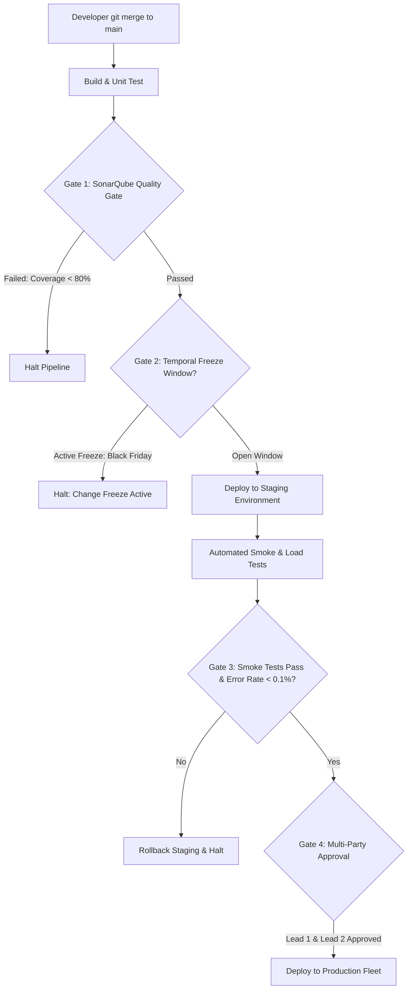

#### AWS Implementation
Configuring an AWS CodePipeline with a SonarQube Quality Gate verification step, a Lambda-based change freeze check, and a manual SNS approval stage: [Doc: AWS CodePipeline Approval Actions & Lambda Gates, checked 2026].

```hcl
# AWS Lambda evaluating change freeze windows and operational alarms
resource "aws_lambda_function" "change_freeze_gate" {
  filename      = "change_freeze_gate.zip"
  function_name = "pipeline-change-freeze-evaluator"
  role          = aws_iam_role.gate_lambda_role.arn
  handler       = "index.handler"
  runtime       = "nodejs20.x"
}

# AWS CodePipeline stages enforcing sequential gates
resource "aws_codepipeline" "gated_pipeline" {
  name     = "gated-production-pipeline"
  role_arn = aws_iam_role.pipeline_role.arn

  artifact_store {
    location = aws_s3_bucket.pipeline_artifacts.bucket
    type     = "S3"
  }

  stage {
    name = "Source"
    action {
      name             = "Source"
      category         = "Source"
      owner            = "AWS"
      provider         = "CodeStarSourceConnection"
      version          = "1"
      output_artifacts = ["source_output"]
      configuration = {
        ConnectionArn    = var.connection_arn
        FullRepositoryId = "corp-org/checkout-service"
        BranchName       = "main"
      }
    }
  }

  stage {
    name = "QualityGate"
    action {
      name             = "SonarQubeVerification"
      category         = "Test"
      owner            = "AWS"
      provider         = "CodeBuild"
      version          = "1"
      input_artifacts  = ["source_output"]
      configuration = {
        ProjectName = "sonarqube-quality-gate-runner"
      }
    }
    action {
      name             = "ChangeFreezeEvaluation"
      category         = "Invoke"
      owner            = "AWS"
      provider         = "Lambda"
      version          = "1"
      configuration = {
        FunctionName = aws_lambda_function.change_freeze_gate.function_name
      }
    }
  }

  stage {
    name = "ProductionApproval"
    action {
      name     = "ExecutiveLeadSignOff"
      category = "Approval"
      owner    = "AWS"
      provider = "Manual"
      version  = "1"
      configuration = {
        NotificationArn    = aws_sns_topic.lead_approvers.arn
        CustomData         = "Please review SonarQube reports and staging smoke tests before authorizing production apply."
      }
    }
  }

  stage {
    name = "DeployToProduction"
    action {
      name            = "DeployECS"
      category        = "Deploy"
      owner           = "AWS"
      provider        = "ECS"
      version         = "1"
      input_artifacts = ["source_output"]
      configuration = {
        ClusterName = "prod-ecs-cluster"
        ServiceName = "checkout-service"
      }
    }
  }
}
```

#### OCI Implementation
Configuring an OCI DevOps Deployment Pipeline with automated Approval Stages and OCI Function verification gates: [Doc: OCI DevOps Approval Stages & Verification, checked 2026].

```bash
#!/usr/bin/env bash
# oci-verify-sonarqube.sh: Pipeline script checking SonarQube quality gate status
set -euo pipefail

SONAR_HOST="https://sonarcloud.io"
PROJECT_KEY="corp-org_order-service"

echo "[INFO] Polling SonarQube Quality Gate status for $PROJECT_KEY..."
STATUS=$(curl -s -u "${SONAR_TOKEN}:" "${SONAR_HOST}/api/qualitygates/project_status?projectKey=${PROJECT_KEY}" | jq -r '.projectStatus.status')

echo "[INFO] SonarQube Gate Status: $STATUS"

if [ "$STATUS" != "OK" ]; then
  echo "========================================================"
  echo "ERROR: SonarQube Quality Gate Failed!"
  echo "Review failing conditions at: ${SONAR_HOST}/dashboard?id=${PROJECT_KEY}"
  echo "========================================================"
  exit 1
fi

echo "[SUCCESS] Quality Gate passed with 0 blocker bugs and required coverage."
```

HCL defining OCI DevOps Manual Approval Stage:
```hcl
resource "oci_devops_deploy_stage" "manual_approval_stage" {
  deploy_pipeline_id = var.oci_deploy_pipeline_id
  display_name       = "Senior-SRE-Production-Approval"
  deploy_stage_type  = "MANUAL_APPROVAL"

  approval_policy {
    approval_policy_type = "COUNT_BASED_APPROVAL_POLICY"
    number_of_approvals_required = 2
  }
}
```

#### Common Trap
Allowing pipeline manual approval stages to be approved by the same user who authored or triggered the commit. In regulated environments subject to SOC2, SOX, or PCI-DSS, **Segregation of Duties (SoD)** is legally mandatory: the engineer who wrote the code cannot authorize its deployment into production. If CI/CD platforms do not enforce multi-party approval rules blocking self-approvals, audits will fail, resulting in regulatory non-compliance.

#### Follow-up Question
How do you automatically resume a pipeline that was gated by a temporary change freeze without requiring engineers to re-run the build manually?

*Answer*: Implement an EventBridge (AWS) or OCI Events rule scheduled to trigger at the exact moment the freeze window expires (e.g., Monday 06:00 UTC). The event invokes a serverless function that queries pipelines in `Waiting` state and issues an `Approval` API call, automatically unblocking deployment progression.

---

### Q461: Pipeline Caching and Build Acceleration at Scale

#### Question
How do you optimize CI/CD pipeline execution times from 45+ minutes down to under 5 minutes for large-scale microservices using distributed compilation caches, Docker layer caches, and dependency storage?

#### Short Answer
Build acceleration relies on eliminating redundant computation and bandwidth transfer. To accelerate pipelines: (1) Leverage **Docker Buildx / BuildKit** inline or registry-backed layer caching (`--cache-to type=registry,mode=max`) so unchanged Dockerfile layers pull directly from remote registries; (2) Implement distributed compilation caches (e.g., Go build cache, Rust `sccache`, Gradle Build Cache) backed by high-throughput S3 or OCI Object Storage; (3) Cache language package dependencies (npm `node_modules`, Maven `.m2`, Go modules) using content-hash cache keys; and (4) Provision autoscaling ephemeral runners equipped with NVMe SSD local storage or pre-pulled base images.

#### Deep Answer
In large development organizations, slow CI pipelines cripple developer velocity, delay hotfixes, and drastically increase cloud compute costs.

**Techniques for Order-of-Magnitude Acceleration**:

1. **Docker Layer Caching (BuildKit Remote Cache)**:
   - Standard Docker builds discard layer caches between ephemeral CI runner executions.
   - With BuildKit and registry caching:
     ```bash
     docker buildx build \
       --cache-from type=registry,ref=corp.ecr.aws/cache:app \
       --cache-to type=registry,ref=corp.ecr.aws/cache:app,mode=max \
       --push -t corp.ecr.aws/prod:v1.2.0 .
     ```
   - BuildKit evaluates layer hashes against the remote registry manifest without downloading the layers unless a cache miss occurs.

2. **Distributed Compiler Caches (`sccache` / Gradle Remote Cache)**:
   - For compiled languages (C++, Rust, Java), re-compiling identical source files wastes CPU cycles.
   - Tools like `sccache` replace the compiler with a caching wrapper: every compiled object file is hashed and uploaded to an S3 or OCI Object Storage bucket. If another runner or branch compiles the exact same file, `sccache` downloads the pre-compiled `.o` binary in milliseconds.

3. **Content-Hashed Dependency Keying**:
   - In GitHub Actions or AWS CodeBuild, cache keys must be cryptographically derived from dependency lockfiles:
     `key: maven-${{ runner.os }}-${{ hashFiles('**/pom.xml') }}`
   - If `pom.xml` hasn't changed, dependencies are restored from cache in $<10$ seconds instead of re-downloading hundreds of JARs from Maven Central.

4. **Runner Architecture (RAM Disks & Pre-Warmed Base Images)**:
   - Running builds on tmpfs (in-memory RAM disks) eliminates disk I/O bottlenecks.
   - Pre-baking base images with common toolchains and dependencies onto runner AMIs eliminates 3–5 minutes of `apt-get install` and Docker pull latency at the start of every job.

#### Architecture
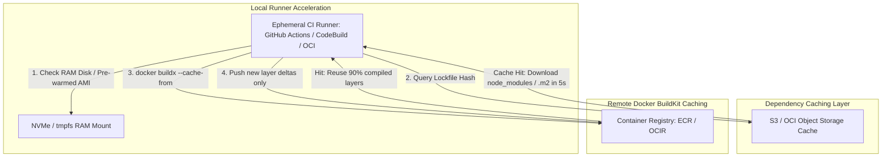

#### AWS Implementation
AWS CodeBuild project configuration using S3 remote artifact caching and Docker layer caching: [Doc: AWS CodeBuild Caching Options, checked 2026].

```hcl
# S3 Bucket for CodeBuild distributed cache
resource "aws_s3_bucket" "codebuild_cache" {
  bucket = "corp-codebuild-cache-us-east-1"
}

# AWS CodeBuild Project configured for aggressive local and S3 caching
resource "aws_codebuild_project" "accelerated_build" {
  name          = "accelerated-order-service-build"
  service_role  = aws_iam_role.codebuild_role.arn
  build_timeout = 15

  # Enable S3 distributed cache for Maven / npm dependencies
  cache {
    type     = "S3"
    location = "${aws_s3_bucket.codebuild_cache.bucket}/order-service-cache"
    modes    = ["LOCAL_DOCKER_LAYER_CACHE", "LOCAL_SOURCE_CACHE", "LOCAL_CUSTOM_CACHE"]
  }

  environment {
    compute_type    = "BUILD_GENERAL1_LARGE" # 8 vCPUs, 15 GB RAM for parallel compilation
    image           = "aws/codebuild/amazonlinux2-x86_64-standard:5.0"
    type            = "LINUX_CONTAINER"
    privileged_mode = true
  }

  source {
    type      = "GITHUB"
    location  = "https://github.com/corp-org/order-service.git"
    buildspec = "buildspec-optimized.yml"
  }
}
```

Optimized `buildspec-optimized.yml`:
```yaml
version: 0.2

cache:
  paths:
    - '/root/.m2/**/*'
    - '/root/.cache/go-build/**/*'

phases:
  pre_build:
    commands:
      - echo "Logging into Amazon ECR with BuildKit enabled..."
      - export DOCKER_BUILDKIT=1
      - aws ecr get-login-password --region us-east-1 | docker login --username AWS --password-stdin 112233445566.dkr.ecr.us-east-1.amazonaws.com
  build:
    commands:
      - echo "Executing accelerated container build using registry cache..."
      - |
        docker buildx build \
          --cache-from type=registry,ref=112233445566.dkr.ecr.us-east-1.amazonaws.com/order-service:buildcache \
          --cache-to type=registry,ref=112233445566.dkr.ecr.us-east-1.amazonaws.com/order-service:buildcache,mode=max \
          -t 112233445566.dkr.ecr.us-east-1.amazonaws.com/order-service:${CODEBUILD_RESOLVED_SOURCE_VERSION} \
          --push .
```

#### OCI Implementation
Configuring caching inside an OCI DevOps Build Pipeline using OCI Object Storage and the Build Spec cache configuration: [Doc: OCI DevOps Build Runner Caching, checked 2026].

```yaml
# build_spec.yaml
version: 0.1
component: build
timeoutInSeconds: 600
shell: bash

# Cache configuration across OCI DevOps build runner invocations
cache:
  paths:
    - ~/.m2/repository
    - ~/.npm
    - ~/.cache/go-build

env:
  variables:
    DOCKER_BUILDKIT: "1"

steps:
  - name: "Restore-and-Build"
    command: |
      echo "[INFO] Running compiled Maven build with multi-threaded execution..."
      mvn clean package -T 4C -DskipTests=true --batch-mode

  - name: "Build-Docker-Image"
    command: |
      echo "[INFO] Building container image using OCIR cache..."
      docker build \
        --cache-from iad.ocir.io/mytenancy/cache/app:latest \
        -t iad.ocir.io/mytenancy/production/app:${OCI_BUILD_RUN_ID} .

outputArtifacts:
  - name: application_binary
    type: BINARY
    location: target/order-service.jar
```

#### Common Trap
Caching mutable directories or build outputs containing absolute file paths. If a cache stores binary artifacts or symbolic links containing hardcoded runner directory paths (e.g., `/home/runner/work/app/app`), restoring the cache on a runner with a different workspace path or user ID causes subtle compiler failures or bizarre runtime crashes. Always cache raw dependency downloads (`~/.m2`, `~/.npm`) rather than intermediate build workspace directories.

#### Follow-up Question
Why can Docker layer caching fail to accelerate builds when `COPY . .` is placed early in a `Dockerfile`?

*Answer*: Docker evaluates cache invalidation sequentially from top to bottom. If `COPY . .` is placed before dependency installation commands (`npm install` or `go mod download`), any single character change to a readme or source file invalidates the `COPY` layer cache. Consequently, all subsequent layers—including the time-consuming dependency installation—are forcefully executed from scratch. The dependency manifests (`package.json`, `go.mod`) must always be copied and downloaded in separate layers *before* copying the remaining source code.

---

### Q462: Monorepo vs Polyrepo CI/CD Pipeline Architectures

#### Question
How do you architect high-speed, scalable CI/CD pipelines for large enterprise Monorepos containing dozens of interdependent services without rebuilding and re-testing the entire repository on every commit?

#### Short Answer
Running full CI builds on a monorepo containing 50+ microservices is unsustainable, causing 60-minute build queues. Scalable monorepo CI relies on **Affected-Target Computation and Smart Graph Traversal** using tools like **Nx, Turborepo, or Bazel**. When a pull request is opened, the build tool parses the dependency graph, compares the Git diff against `main` (`git diff origin/main...HEAD`), identifies exclusively the modified packages and their downstream dependents, and executes tests and builds *only* for affected targets while fetching unchanged target artifacts from a remote build artifact cache.

#### Deep Answer
Enterprise engineering teams often gravitate toward Monorepos for code visibility, atomic cross-service refactoring, and single-version dependency management. However, CI/CD pipelines quickly become the primary operational bottleneck.

**Monorepo CI Design Patterns**:

1. **Change Detection via Git Diff**:
   - Primitive CI pipelines use path filtering:
     `on: push: paths: ['services/payment/**']`
   - *Limitation*: Fails when a shared library (`packages/common-auth`) changes. If `payment` depends on `common-auth`, path filtering on `services/payment` will skip testing `payment`, allowing breaking shared changes into production undetected!

2. **Directed Acyclic Graph (DAG) Dependency Engines (Nx / Bazel / Turborepo)**:
   - The monorepo defines an explicit workspace graph linking services to libraries.
   - Command: `nx affected --target=test --base=origin/main`
   - The engine computes:
     $\text{Targets to Test} = \text{Directly Changed Packages} \cup \text{Downstream Dependents}$
   - If `packages/common-auth` changes, both `services/payment` and `services/user` are automatically scheduled for CI testing; `services/analytics` (which does not depend on `common-auth`) is skipped completely.

3. **Remote Computation Caching (Hermetic Builds)**:
   - Bazel and Turborepo hash inputs (source code, compiler flags, environment variables) for every task.
   - If the hash matches an entry in a shared remote cache (S3 / OCI Object Storage), the tool skips running the compiler or test suite entirely, instantly downloading the pre-computed test result or Docker image in $<1$ second.

4. **Merge Queues (GitHub Merge Queue / Bors)**:
   - When 50 developers merge pull requests simultaneously, "Semantic Merge Conflicts" occur (PR A and PR B both pass CI independently, but break when merged together).
   - Merge queues serialize merges into a speculative integration branch, validating combined tests before merging to `main`.

#### Architecture
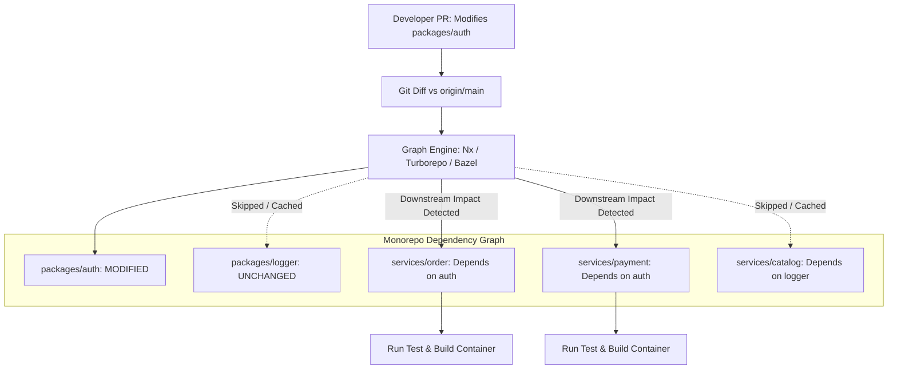

#### AWS Implementation
GitHub Actions workflow executing affected-target CI in a monorepo using Turborepo and AWS S3 as a remote build cache: [Doc: Turborepo AWS S3 Remote Cache Integration, checked 2026].

```yaml
# .github/workflows/monorepo-ci.yml
name: "Monorepo Scalable CI"

on:
  pull_request:
    branches: [ main ]

jobs:
  affected-build:
    runs-on: ubuntu-latest
    permissions:
      id-token: write
      contents: read
    steps:
      - name: Checkout Code with Full History
        uses: actions/checkout@v4
        with:
          fetch-depth: 0 # Full Git history required for accurate diffing

      - name: Configure AWS Credentials via OIDC
        uses: aws-actions/configure-aws-credentials@v4
        with:
          role-to-assume: arn:aws:iam::112233445566:role/github-monorepo-cache-reader
          aws-region: us-east-1

      - name: Setup Node.js & pnpm
        uses: pnpm/action-setup@v3
        with:
          version: 9.0.0

      - name: Install Monorepo Dependencies
        run: pnpm install --frozen-lockfile

      - name: Run Affected Tests & Builds with Remote S3 Cache
        run: |
          # Turborepo connects to AWS S3 bucket for distributed computation caching
          export TURBO_REMOTE_CACHE_SIGNATURE_KEY="${{ secrets.TURBO_SIGNATURE_KEY }}"
          pnpm turbo run test build \
            --filter=...[origin/main] \
            --cache-dir=".turbo" \
            --summarize

      - name: Report Build Summary
        run: cat .turbo/runs/*.json | jq '{total_tasks: .tasks | length, cached: [.tasks[] | select(.cache.status == "HIT")] | length}'
```

#### OCI Implementation
A shell script running inside an OCI DevOps build runner executing selective affected-target builds for a Python/Go monorepo: [Doc: OCI DevOps Pipelines & Git Diff Evaluation, checked 2026].

```bash
#!/usr/bin/env bash
# oci-affected-build.sh: Determine changed services in monorepo and build selective containers
set -euo pipefail

BASE_BRANCH="origin/main"
echo "[INFO] Calculating changed directories compared to $BASE_BRANCH..."

# Fetch changed files
CHANGED_FILES=$(git diff --name-only "$BASE_BRANCH"...HEAD)

# Detect if shared libraries were modified
SHARED_CHANGED=false
if echo "$CHANGED_FILES" | grep -q "^libs/"; then
  echo "[ALERT] Shared libraries in libs/ were modified! Full rebuild required."
  SHARED_CHANGED=true
fi

# Discover service directories
SERVICES=$(find services/ -maxdepth 1 -mindepth 1 -type d)

for svc in $SERVICES; do
  SVC_NAME=$(basename "$svc")
  
  if [ "$SHARED_CHANGED" = true ] || echo "$CHANGED_FILES" | grep -q "^services/${SVC_NAME}/"; then
    echo "========================================================"
    echo "[BUILDING] Service affected: $SVC_NAME"
    echo "========================================================"
    
    cd "services/${SVC_NAME}"
    docker build -t "iad.ocir.io/mytenancy/microservices/${SVC_NAME}:${OCI_BUILD_RUN_ID}" .
    docker push "iad.ocir.io/mytenancy/microservices/${SVC_NAME}:${OCI_BUILD_RUN_ID}"
    cd ../..
  else
    echo "[SKIPPING] Service unchanged: $SVC_NAME"
  fi
done
```

#### Common Trap
Running `git diff` against the wrong merge-base in CI. If a CI workflow runs `git diff origin/main` instead of `git diff origin/main...HEAD` (three-dot notation, representing the common ancestor merge-base), the diff will include commits pushed to `main` by other engineers *after* the feature branch was created. This causes the pipeline to falsely identify dozens of unrelated microservices as "affected", triggering massive unnecessary builds. Always diff against the merge-base: `git merge-base origin/main HEAD`.

#### Follow-up Question
How does a Merge Queue solve the "Broken Main" problem in a monorepo where 100+ engineers merge code daily?

*Answer*: A Merge Queue places pull requests into a speculative execution pipeline. Instead of testing PR #10 against the current `main`, it creates a temporary branch that merges PR #10 on top of the currently in-flight PR #9 and PR #8. It runs CI against this speculative combined state. If CI passes, it advances `main` cleanly; if a semantic collision causes tests to fail, it ejects only the offending PR from the queue without breaking the main branch for other developers.

---

### Q463: Feature Flags and Decoupled Releases (Dark Launching)

#### Question
How do feature flags and dark launching decouple software deployment from feature release, and what architectural mechanisms prevent technical debt and latency degradation from flag sprawl?

#### Short Answer
**Deployment is a technical action** (pushing code binaries to cloud servers), while **Release is a business action** (exposing functionality to customers). Feature flags (e.g., via LaunchDarkly, Unleash, or AWS AppConfig Feature Flags) decouple these two events by wrapping new code paths in dynamic conditional checks evaluated at runtime in memory. This enables "Dark Launching" (testing new code in production with zero user visibility), progressive user-percentage rollouts, and instant kill switches that disable malfunctioning code in milliseconds without triggering a multi-minute CI/CD redeployment or rollback.

#### Deep Answer
Relying on git merges and CI/CD rollbacks to control customer feature exposure introduces high risk: rolling back a container deployment during an outage takes 5–15 minutes and can cause cascading connection drops.

**Core Capabilities of Feature Flags**:
1. **Trunk-Based Development with Zero Long-Lived Branches**:
   - Developers merge incomplete features directly into `main` behind a flag disabled by default (`isEnabled = false`). This eliminates painful multi-week git merge hell.
2. **Instant Kill Switches (Mitigating Outages in $<100\text{ms}$)**:
   - If a new payment gateway algorithm experiences a bug in production, an on-call engineer toggles the flag to `OFF` in the management dashboard. All pods update their in-memory state within milliseconds without restarting or redeploying.
3. **Targeted Ring / Beta Releases**:
   - Target internal employees first (`user.email.endsWith("@company.com")`), followed by 5% of beta users, before opening to 100% public traffic.

**Architectural Prevention of Technical Debt & Latency**:
- *In-Memory Evaluation*: Feature flag SDKs must **never** make a blocking HTTP/network call on every user request. They stream rule configurations via Server-Sent Events (SSE) or WebSockets on boot and evaluate rules locally in CPU memory in $<10$ microseconds.
- *Flag Sprawl Debt*: Flags left in code indefinitely create branching spaghetti and cognitive overload.
  - *Governance Rule*: Every flag must have an assigned owner and an expiration TTL (e.g., 30 days).
  - Automated linters or CI jobs fail builds if a feature flag remains in the codebase 14 days after reaching 100% rollout.

#### Architecture
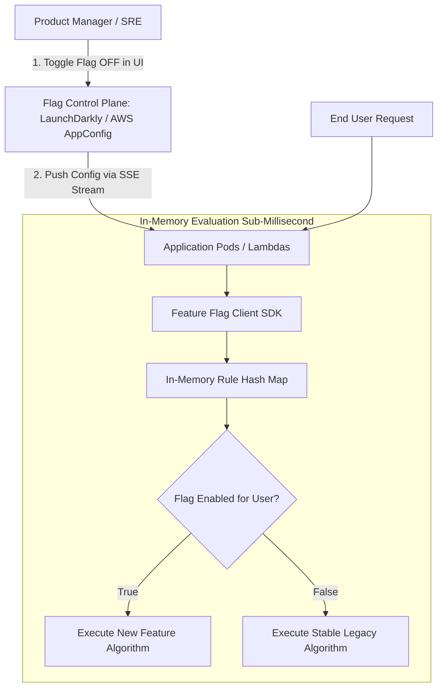

#### AWS Implementation
Using AWS AppConfig Feature Flags with dynamic in-memory polling and Terraform configuration: [Doc: AWS AppConfig Feature Flags Configuration, checked 2026].

```hcl
# AppConfig Application definition
resource "aws_appconfig_application" "app" {
  name        = "ecommerce-platform"
  description = "Application configuration and feature flags"
}

resource "aws_appconfig_environment" "prod" {
  name           = "production"
  application_id = aws_appconfig_application.app.id
}

# Configuration profile for feature flags
resource "aws_appconfig_configuration_profile" "flags_profile" {
  application_id = aws_appconfig_application.app.id
  name           = "checkout-feature-flags"
  location_uri   = "hosted"
  type           = "AWS.AppConfig.FeatureFlags"
}

# Feature flag definition with fractional percentage rollout
resource "aws_appconfig_hosted_configuration_version" "flag_v1" {
  application_id           = aws_appconfig_application.app.id
  configuration_profile_id = aws_appconfig_configuration_profile.flags_profile.configuration_profile_id
  content_type             = "application/json"

  content = jsonencode({
    flags = {
      enable_instant_checkout = {
        name = "Enable Instant 1-Click Checkout"
        attributes = {
          risk_threshold = {
            type = "number"
          }
        }
      }
    }
    values = {
      enable_instant_checkout = {
        enabled = true
        # 10% Canary rollout rule
        _percentage = 10
      }
    }
  })
}
```

Python application code evaluating the flag locally in memory:
```python
# app/checkout.py
import json
import boto3

appconfig_data = boto3.client('appconfigdata', region_name='us-east-1')

# Start configuration session
session = appconfig_data.start_configuration_session(
    ApplicationIdentifier='ecommerce-platform',
    EnvironmentIdentifier='production',
    ConfigurationProfileIdentifier='checkout-feature-flags'
)

def process_checkout(user_id: str, cart_total: float):
    # Fetch latest configuration (SDK caches token and returns cached config)
    response = appconfig_data.get_latest_configuration(
        ConfigurationToken=session['InitialConfigurationToken']
    )
    
    config = json.loads(response['Configuration'].read().decode('utf-8'))
    is_enabled = config.get('values', {}).get('enable_instant_checkout', {}).get('enabled', False)

    if is_enabled:
        # Fast-path 1-click checkout logic
        return execute_one_click_checkout(user_id, cart_total)
    else:
        # Stable multi-step checkout logic
        return execute_traditional_checkout(user_id, cart_total)
```

#### OCI Implementation
Implementing an OpenFeature / Unleash provider on OCI Container Engine for Kubernetes (OKE) backed by OCI Cache with Redis: [Doc: OCI OKE & OpenFeature Architecture, checked 2026].

```go
// main.go - Go service consuming OpenFeature flags cached in memory
package main

import (
	"context"
	"fmt"
	"github.com/open-feature/go-sdk/openfeature"
)

func HandlePayment(ctx context.Context, userID string, amount float64) {
	client := openfeature.NewClient("payment-service")

	evalCtx := openfeature.NewTargetedEvaluationContext(userID).
		AddAttribute("amount", amount)

	// In-memory evaluation takes < 5 microseconds
	useNewGateway, err := client.BooleanValue(ctx, "use-quantum-payment-gateway", false, evalCtx)
	if err != nil {
		// Fall back safely on error
		useNewGateway = false
	}

	if useNewGateway {
		fmt.Println("Executing new quantum payment gateway...")
	} else {
		fmt.Println("Executing stable legacy payment gateway...")
	}
}
```

#### Common Trap
Allowing feature flags to control database schema structures (e.g., executing `IF flag THEN INSERT INTO new_table ELSE INSERT INTO old_table`). If the flag is abruptly toggled during a high-traffic incident, data becomes fractured: some user records exist only in `new_table` while other records exist only in `old_table`, resulting in corrupted user transaction histories that require painstaking manual reconciliation. Feature flags should govern application business logic; database schemas must always be evolved independently using the Expand-Contract pattern.

#### Follow-up Question
How does OpenFeature standardize feature flagging across multiple enterprise vendors?

*Answer*: OpenFeature is a CNCF incubating project that defines a vendor-agnostic API and SDK specification for feature flag evaluation. By writing code against the OpenFeature API, organizations can swap backend providers (e.g., moving from LaunchDarkly to an internal Redis-backed engine or AWS AppConfig) without rewriting conditional checks or refactoring application code.

---

### Q464: Rollback Mechanics and Blast Radius Mitigation

#### Question
What are the architectural mechanisms of an enterprise-grade automated rollback system, and how do you differentiate between an instant traffic-diversion rollback versus a full redeployment rollback?

#### Short Answer
Rollbacks fall into two operational categories: (1) **Traffic-Diversion Rollback** (sub-second latency), which toggles load balancer routing weights, DNS records, or service mesh traffic rules to instantly steer user traffic back to the preserved previous stable environment (Blue/Green or Canary); and (2) **Redeployment Rollback** (multi-minute latency), which checks out the previous Git commit or container image tag and triggers a full CI/CD deployment pipeline. Traffic diversion is mandatory for zero-downtime recovery during production incidents, while redeployment is acceptable only when immutable compute capacity was already destroyed.

#### Deep Answer
When an outage strikes post-deployment, every second of recovery latency directly impacts revenue and violates customer SLAs:

**Comparison of Rollback Mechanisms**:

| Dimension | Traffic-Diversion Rollback | Redeployment / Image Rollback |
| :--- | :--- | :--- |
| **Recovery Latency** | $< 1$ to 5 seconds | 5 to 25 minutes |
| **Mechanism** | Flip ALB Target Group / Istio VirtualService | Trigger CI pipeline / `kubectl rollout undo` |
| **Resource Requirement** | Previous fleet must remain warm and running | Cold compute: rebuilds or scales new pods |
| **Database Risk** | High risk if new code executed destructive DDL | High risk if new code executed destructive DDL |
| **Stateful Sessions** | May terminate active WebSockets | Terminates active WebSockets and inflight calls |

**Critical Rollback Engineering Rules**:

1. **Keep the "Blue" Fleet Warm during Soak Windows**:
   - In Blue/Green deployments, never terminate the old Blue environment immediately after Green reaches 100% traffic.
   - Maintain Blue in a standby, warm state for a **Bake/Soak Window** (typically 1 to 4 hours). If memory leaks or obscure database deadlocks manifest 45 minutes later, an immediate traffic shift back to Blue restores service instantly.

2. **Draining Inflight Requests (Connection Draining / Deregistration Delay)**:
   - When diverting traffic away from a failing canary or green fleet, the load balancer must respect **Connection Draining** (e.g., 30–60 seconds). This allows active in-flight HTTP requests and database transactions to finish cleanly rather than forcefully terminating with TCP RST packets.

3. **Database Irreversibility Constraint**:
   - A rollback **cannot undo committed database writes**.
   - If Version 2 wrote 10,000 orders using a new data format into the database, rolling back to Version 1 will crash V1 unless V1's code is forward-compatible and able to parse or ignore the newly structured records.

#### Architecture
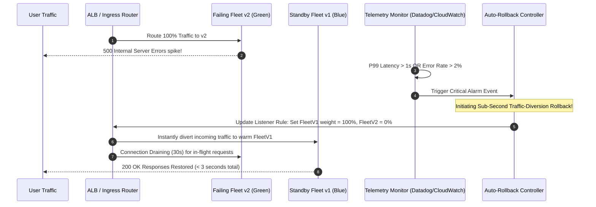

#### AWS Implementation
An automated rollback architecture using AWS CloudWatch Alarms, EventBridge, and an automated Lambda function that flips an ALB Listener Rule back to the stable Target Group: [Doc: AWS Application Load Balancer API & CloudWatch Auto-Rollback, checked 2026].

```python
# lambda/rollback_controller.py
import json
import boto3

elbv2 = boto3.client('elbv2', region_name='us-east-1')

STABLE_TARGET_GROUP_ARN = "arn:aws:elasticloadbalancing:us-east-1:112233445566:targetgroup/app-blue-stable/12345678"
FAILING_TARGET_GROUP_ARN = "arn:aws:elasticloadbalancing:us-east-1:112233445566:targetgroup/app-green-failing/87654321"
RULE_ARN = "arn:aws:elasticloadbalancing:us-east-1:112233445566:listener-rule/app/listener/rule1"

def handler(event, context):
    print("CRITICAL ALERT: Alarm triggered auto-rollback sequence!")
    print(f"Alarm Event: {json.dumps(event)}")

    # Instantly divert 100% traffic back to Blue Stable Target Group
    response = elbv2.modify_listener_rule(
        RuleArn=RULE_ARN,
        Actions=[
            {
                'Type': 'forward',
                'ForwardConfig': {
                    'TargetGroups': [
                        {
                            'TargetGroupArn': STABLE_TARGET_GROUP_ARN,
                            'Weight': 100
                        },
                        {
                            'TargetGroupArn': FAILING_TARGET_GROUP_ARN,
                            'Weight': 0
                        }
                    ]
                }
            }
        ]
    )

    print("SUCCESS: Traffic diverted back to Blue fleet in < 2 seconds.")
    return {"statusCode": 200, "status": "ROLLED_BACK"}
```

#### OCI Implementation
Instant rollback execution on an OCI Load Balancer updating backend set routing via the OCI Python SDK: [Doc: OCI Load Balancer Python SDK & Backend Set Updates, checked 2026].

```python
# oci_rollback_handler.py
import oci

config = oci.config.from_file()
lb_client = oci.load_balancer.LoadBalancerClient(config)

LB_OCID = "ocid1.loadbalancer.oc1.iad.aaaaaaaaxxxxxxxxxxxxxxxxxxxxxxxxxxxx"
LISTENER_NAME = "https-primary-listener"
STABLE_BACKEND_SET = "backend-set-v1-stable"

def trigger_rollback():
    print("[ALERT] Diverting OCI Load Balancer traffic back to stable backend set...")

    update_details = oci.load_balancer.models.UpdateListenerDetails(
        default_backend_set_name=STABLE_BACKEND_SET,
        port=443,
        protocol="HTTP"
    )

    response = lb_client.update_listener(
        load_balancer_id=LB_OCID,
        listener_name=LISTENER_NAME,
        update_listener_details=update_details
    )

    # Wait for asynchronous work request to complete
    work_request_id = response.headers["opc-work-request-id"]
    oci.wait_until(
        lb_client,
        lb_client.get_work_request(work_request_id),
        'lifecycle_state',
        'SUCCEEDED'
    )

    print("[SUCCESS] Traffic successfully diverted to v1 stable backend set.")

if __name__ == "__main__":
    trigger_rollback()
```

#### Common Trap
Triggering an automated rollback that executes `kubectl rollout undo` when the deployment failure was caused by a database migration that cannot be rolled back. If Version 2 modified table columns and Version 1's code crashes on the modified schema, rolling back the container pods to Version 1 will not fix the outage—it guarantees that 100% of pods crash immediately on launch. Rollback automation must inspect whether a database migration occurred before blindly reverting container binaries.

#### Follow-up Question
How do you handle in-memory user sessions (e.g., shopping carts or gaming states) when executing a traffic-diversion rollback?

*Answer*: If user session data is stored in localized container memory, diverting traffic to the previous fleet terminates all active sessions, forcing users to re-login. To prevent this, enterprise architectures externalize session states into high-availability distributed caches (such as Amazon ElastiCache for Redis or OCI Cache with Redis), allowing both fleets to access session data seamlessly.

---

### Q465: Multi-Region and Multi-Account Deployment Pipelines

#### Question
How do you architect continuous delivery pipelines that deploy critical microservices across multiple cloud regions and multiple isolated AWS accounts or OCI tenancies using progressive wave rollouts and cell-based blast radius containment?

#### Short Answer
Deploying to all production regions simultaneously exposes the entire global user base to catastrophic outages. Modern multi-region pipelines implement **Progressive Wave Deployments** (Phased Rollouts): (1) Code is deployed first to a "Canary Region" (e.g., a low-volume region like `eu-central-1` or `ap-southeast-1`); (2) The pipeline pauses for an automated observation soak window (e.g., 2 hours) evaluating regional business KPIs and synthetic health checks; (3) If healthy, it advances to **Wave 1** (50% of global regions); and (4) Finally, it deploys to **Wave 2** (remaining primary regions). Authentication across isolated accounts uses cross-account IAM Role assumption (AWS) or Cross-Tenancy IAM Policies (OCI).

#### Deep Answer
Global outages in large cloud platforms almost invariably stem from un-phased global deployments: a bad configuration or memory leak is pushed simultaneously across all 20 global regions, taking down the entire service globally within minutes.

**Cell-Based and Wave-Based Architecture Principles**:

1. **Independent Cell Boundaries**:
   - Each cloud region or cell operates as a completely self-sufficient island containing its own compute, databases, caches, and networking.
   - Cells share zero runtime state dependencies: an outage in the `us-east-1` cell cannot propagate to the `eu-west-1` cell.

2. **The Wave Progression Model**:
   - **Wave 0 (Canary Region / Internal Dogfood)**: Low customer traffic. Soak time: 1–2 hours.
   - **Wave 1 (Low-to-Medium Volume Regions)**: E.g., `us-west-2`, `ap-northeast-1`. Soak time: 2–4 hours.
   - **Wave 2 (High-Volume Core Regions)**: E.g., `us-east-1`, `eu-west-1`.
   - Any metric degradation or critical PagerDuty alarm in an active wave immediately halts pipeline progression, preventing subsequent waves from receiving the faulty binary.

3. **Cross-Account Security Architecture**:
   - The central CI/CD orchestrator resides in a dedicated **Shared Services Account**.
   - It assumes temporary, cross-account IAM roles into Target Accounts (Dev Account $\rightarrow$ Staging Account $\rightarrow$ Production Account) via `sts:AssumeRole`.
   - Target accounts maintain explicit trust policies restricting access to the central CI/CD role ARN, ensuring environment isolation is enforced at the hypervisor IAM boundary.

#### Architecture
```mermaid
graph TD
    Central[Central CI/CD: Shared Tools Account] -->|1. Assume Cross-Account IAM Role| Wave0

    subgraph Wave 0: Canary Region (2 Hour Soak)
        Wave0[Account: Prod-Canary / Region: eu-central-1]
        Wave0 -.->|Automated Metric Verification| Health0{Healthy?}
    end

    Health0 -->|Failed| Abort0[Abort Global Release & Rollback Wave 0]
    Health0 -->|Passed| Wave1

    subgraph Wave 1: Phased Tier-2 Regions (4 Hour Soak)
        Wave1[Account: Prod-Primary / Regions: us-west-2 & ap-northeast-1]
        Wave1 -.->|Automated Metric Verification| Health1{Healthy?}
    end

    Health1 -->|Failed| Abort1[Abort Pipeline: Wave 2 Preserved!]
    Health1 -->|Passed| Wave2

    subgraph Wave 2: Core Primary Fleet
        Wave2[Account: Prod-Primary / Regions: us-east-1 & eu-west-1]
    end
```

#### AWS Implementation
AWS CodePipeline JSON snippet defining multi-region wave deployment with cross-account role assumption and soak approvals: [Doc: AWS CodePipeline Cross-Account & Cross-Region Actions, checked 2026].

```json
{
  "pipeline": {
    "name": "Global-Multi-Region-Deployment-Pipeline",
    "roleArn": "arn:aws:iam::111111111111:role/CentralPipelineExecutionRole",
    "stages": [
      {
        "name": "Wave0_Canary_EUCentral1",
        "actions": [
          {
            "name": "Deploy_EU_Central_1",
            "actionTypeId": {
              "category": "Deploy",
              "owner": "AWS",
              "provider": "ECS",
              "version": "1"
            },
            "roleArn": "arn:aws:iam::222222222222:role/CrossAccountProdDeployerRole",
            "region": "eu-central-1",
            "configuration": {
              "ClusterName": "prod-eu-central-cluster",
              "ServiceName": "order-service"
            }
          }
        ]
      },
      {
        "name": "Wave0_Soak_Window",
        "actions": [
          {
            "name": "Soak_Window_Evaluation",
            "actionTypeId": {
              "category": "Approval",
              "owner": "AWS",
              "provider": "Manual",
              "version": "1"
            },
            "configuration": {
              "CustomData": "Soak window: Verify CloudWatch alarms in eu-central-1 for 2 hours before promoting to Wave 1."
            }
          }
        ]
      },
      {
        "name": "Wave1_Primary_USEast1",
        "actions": [
          {
            "name": "Deploy_US_East_1",
            "actionTypeId": {
              "category": "Deploy",
              "owner": "AWS",
              "provider": "ECS",
              "version": "1"
            },
            "roleArn": "arn:aws:iam::222222222222:role/CrossAccountProdDeployerRole",
            "region": "us-east-1",
            "configuration": {
              "ClusterName": "prod-us-east-cluster",
              "ServiceName": "order-service"
            }
          }
        ]
      }
    ]
  }
}
```

#### OCI Implementation
A multi-region deployment script using OCI DevOps Service and OCI CLI deploying across `us-ashburn-1` and `us-phoenix-1`: [Doc: OCI DevOps Multi-Region Deployments, checked 2026].

```bash
#!/usr/bin/env bash
# oci-multi-region-wave-deploy.sh: Execute progressive wave deployment across OCI regions
set -euo pipefail

REGIONS=("eu-frankfurt-1" "us-ashburn-1" "us-phoenix-1")
SOAK_SECONDS=1800 # 30-minute soak between waves

for idx in "${!REGIONS[@]}"; do
  REGION="${REGIONS[$idx]}"
  echo "=========================================================="
  echo "[WAVE $idx] Initiating deployment to OCI Region: $REGION"
  echo "=========================================================="

  # Trigger region-specific OCI DevOps Deployment Pipeline
  DEPLOY_JSON=$(oci devops deployment create-pipeline-deployment \
    --region "$REGION" \
    --deploy-pipeline-id "ocid1.devopspipeline.oc1.${REGION}.aaaaaaaaxxxxx" \
    --display-name "Wave-${idx}-${REGION}-$(date +%s)" \
    --output json)

  DEPLOY_ID=$(echo "$DEPLOY_JSON" | jq -r '.data.id')
  echo "[INFO] Deployment $DEPLOY_ID submitted in $REGION. Waiting for completion..."

  oci devops deployment get \
    --region "$REGION" \
    --deployment-id "$DEPLOY_ID" \
    --wait-for-state SUCCEEDED \
    --wait-for-state FAILED \
    --max-wait-seconds 1200

  echo "[SUCCESS] Wave $idx in $REGION deployed successfully."

  # If not the final wave, execute automated soak verification
  if [ "$idx" -lt $((${#REGIONS[@]} - 1)) ]; then
    echo "[INFO] Commencing $SOAK_SECONDS-second soak window for $REGION..."
    sleep "$SOAK_SECONDS"

    # Query OCI Monitoring for critical alarms in deployed region
    ALARM_COUNT=$(oci monitoring alarm-summary list-alarms-status \
      --region "$REGION" \
      --compartment-id "ocid1.compartment.oc1..aaaaaaaaxxxxx" \
      --status FIRING \
      --output json | jq '.data | length')

    if [ "$ALARM_COUNT" -gt 0 ]; then
      echo "[CRITICAL] $ALARM_COUNT alarms firing in $REGION! Halting pipeline progression."
      exit 1
    fi
    echo "[INFO] Soak window passed with 0 active alarms. Proceeding to next wave."
  fi
done

echo "[COMPLETE] Global multi-region rollout completed successfully."
```

#### Common Trap
Failing to handle asynchronous cross-region replication lag during progressive wave rollouts. If Wave 0 modifies a database or S3/Object Storage bucket that replicates asynchronously to Wave 1, and the application in Wave 1 expects the new schema before Wave 1 has been upgraded, user requests routed across regions will crash. Multi-region deployments require absolute backward compatibility across both code and data layers.

#### Follow-up Question
How do you configure an AWS CodePipeline in Account A to assume a role in Account B without passing long-lived AWS keys?

*Answer*: In Account B, create an IAM Role with an **AssumeRole Trust Policy** specifying Account A's root or pipeline execution role as the trusted `Principal`. In Account A, grant the pipeline's execution role `sts:AssumeRole` permissions on Account B's role ARN. When CodePipeline reaches the cross-account action, it calls STS to assume the role dynamically, acquiring temporary cross-account credentials valid only for the duration of the stage action.

---

### Q466: Automated Chaos Engineering in Deployment Verification

#### Question
How do you integrate automated Chaos Engineering experiments directly into continuous deployment pipelines (using tools like Chaos Mesh, LitmusChaos, or AWS Fault Injection Service) to verify system resilience before 100% traffic promotion?

#### Short Answer
Automated Chaos in CI/CD introduces controlled synthetic failures into canary or pre-production environments to prove that the system can self-heal before receiving full production traffic. Instead of testing resilience only in periodic manual fire drills, the deployment pipeline: (1) Routes 10% traffic to the canary; (2) Triggers an automated chaos experiment (e.g., injecting 200ms network latency, terminating 30% of worker pods, or simulating an AZ network partition); (3) Measures whether health probes, circuit breakers, and retries mask the failure from users (steady-state metric: customer error rate remains $< 0.1\%$); and (4) If steady state breaks, the pipeline automatically aborts the chaos experiment and rolls back the deployment.

#### Deep Answer
Traditional integration tests test the "happy path" or predictable error inputs; they cannot verify how microservices behave under real-world cloud degradations (packet loss, hypervisor CPU throttling, cross-AZ latency spikes).

**The Continuous Chaos Verification Workflow**:
1. **Steady-State Hypothesis Definition**:
   - Before injecting faults, define measurable steady-state criteria:
     - "99.9% of user requests return HTTP 200 within 400ms."
2. **Canary Isolation**:
   - Inject chaos **strictly** into the Canary or Ephemeral Preview environment, never the active stable fleet.
3. **Automated Fault Injection**:
   - Using **AWS Fault Injection Service (FIS)**, **Chaos Mesh**, or **LitmusChaos**:
     - *Pod Chaos*: Kill random canary pods to verify Kubernetes ReplicaSets and zero-downtime draining.
     - *Network Chaos*: Inject 150ms latency and 5% packet drops between the microservice and its Redis cache to verify circuit breakers (e.g., Resilience4j / Envoy).
     - *Resource Chaos*: Inject 100% memory consumption to ensure out-of-memory (OOM) handling doesn't hang parent processes.
4. **Safety Circuit Breaker (Emergency Stop)**:
   - The chaos engine continuously queries CloudWatch/Prometheus.
   - If an unexpected metric breaches safety boundaries (e.g., overall cluster error rate $> 1\%$), the chaos experiment immediately triggers an emergency stop (`action: stop`), cleans up iptables/stress processes, and rolls back the deployment.

#### Architecture
```mermaid
graph TD
    Deploy[Deploy Canary v2.0.0 (10% Traffic)] --> SteadyCheck[Verify Baseline Steady State: Error Rate < 0.1%]
    SteadyCheck --> Chaos[Trigger Automated Chaos Experiment: Inject 200ms Latency & Pod Kills]
    
    subgraph Chaos Execution Boundary
        Chaos --> Inject[Chaos Mesh / AWS FIS / LitmusChaos]
        Inject --> TargetPods[Canary Pods v2]
    end

    Inject --> Monitor[Prometheus / CloudWatch Telemetry Monitor]
    Monitor --> Eval{Steady State Maintained?}
    
    Eval -->|Breach: Error Rate > 1%| Stop[Emergency Halt Chaos & Rollback Canary]
    Eval -->|Passed: Resilience Proven!| Promote[Promote v2 to 100% Production Traffic]
```

#### AWS Implementation
Terraform configuration provisioning an AWS Fault Injection Service (FIS) experiment template injecting network latency into ECS Canary tasks during pipeline verification: [Doc: AWS Fault Injection Service (FIS) Experiment Templates, checked 2026].

```hcl
# IAM Role for AWS FIS execution
resource "aws_iam_role" "fis_role" {
  name = "pipeline-fis-chaos-role"

  assume_role_policy = jsonencode({
    Version = "2012-10-17"
    Statement = [{
      Effect    = "Allow"
      Principal = { Service = "fis.amazonaws.com" }
      Action    = "sts:AssumeRole"
    }]
  })
}

# AWS FIS Experiment Template: Inject Network Latency into Canary Tasks
resource "aws_fis_experiment_template" "canary_latency_test" {
  description = "Inject 250ms latency into ECS canary tasks to verify resilience"
  role_arn    = aws_iam_role.fis_role.arn

  # Stop condition acts as the automated safety circuit breaker!
  stop_condition {
    source = "aws:cloudwatch:alarm"
    value  = aws_cloudwatch_metric_alarm.emergency_circuit_breaker.arn
  }

  target {
    name           = "canary_ecs_tasks"
    resource_type  = "aws:ecs:task"
    selection_mode = "PERCENT(50)"

    resource_tag {
      key   = "DeploymentType"
      value = "Canary"
    }
  }

  action {
    name      = "network_latency"
    action_id = "aws:ecs:task-network-latency"

    parameter {
      key   = "duration"
      value = "PT3M" # 3-minute test duration
    }
    parameter {
      key   = "latencyMilliseconds"
      value = "250"
    }

    target {
      key   = "Tasks"
      value = "canary_ecs_tasks"
    }
  }
}
```

CLI command executed by CI/CD pipeline to trigger experiment and poll results:
```bash
# Start FIS experiment and wait for completion
EXP_ID=$(aws fis start-experiment --experiment-template-id "$TEMPLATE_ID" --query 'experiment.id' --output text)
aws fis wait experiment-completed --id "$EXP_ID"
```

#### OCI Implementation
A Chaos Mesh Custom Resource applied on OCI Container Engine for Kubernetes (OKE) to inject packet loss and pod kills into a canary deployment: [Doc: Chaos Mesh on Kubernetes & OCI OKE, checked 2026].

```yaml
# chaos-canary-network.yaml
apiVersion: chaos-mesh.org/v1alpha1
kind: NetworkChaos
metadata:
  name: canary-packet-loss-experiment
  namespace: production
spec:
  action: corrupt
  mode: fixed
  value: '2' # Corrupt packets on 2 canary pods
  selector:
    namespaces:
      - production
    labelSelectors:
      app: payment-service
      role: canary # Strictly target canary pods!
  corrupt:
    corrupt: '15' # 15% packet corruption
  duration: '2m'
  scheduler:
    cron: '@once'
```

Bash execution script inside OCI DevOps Build stage:
```bash
#!/usr/bin/env bash
# oci-run-chaos-gate.sh: Apply chaos experiment and assert error budget
set -euo pipefail

echo "[INFO] Applying Chaos Mesh experiment to canary pods on OKE..."
kubectl apply -f chaos-canary-network.yaml

echo "[INFO] Monitoring steady-state error rate over 2-minute chaos injection..."
for i in {1..12}; do
  sleep 10
  # Query Prometheus HTTP error rate on canary
  ERROR_RATE=$(curl -s "http://prometheus.monitoring:9090/api/v1/query?query=sum(rate(http_requests_total{status=~\"5..\",role=\"canary\"}[1m]))/sum(rate(http_requests_total{role=\"canary\"}[1m]))" | jq -r '.data.result[0].value[1] // 0')

  echo "[T+$((i * 10))s] Canary Error Rate under chaos: $ERROR_RATE"

  if (( $(echo "$ERROR_RATE > 0.01" | bc -l) )); then
    echo "[CHAOS FAILURE] Error rate exceeded 1%! Resilience hypothesis invalidated."
    kubectl delete -f chaos-canary-network.yaml --ignore-not-found=true
    exit 1
  fi
done

echo "[CHAOS PASSED] Canary demonstrated fault tolerance under network degradation."
kubectl delete -f chaos-canary-network.yaml --ignore-not-found=true
```

#### Common Trap
Executing chaos experiments that target shared dependencies (such as a shared database or primary Redis cluster) rather than the isolated canary compute tier. If an automated pipeline injects latency into the shared production RDS instance or OCI Autonomous Database, it degrades service for 100% of production users, transforming a safe canary test into an uncontained production-wide outage. Chaos experiments must strictly target the specific canary compute nodes, pods, or local sidecar proxies.

#### Follow-up Question
How do safety stop conditions (circuit breakers) in Chaos Engineering prevent cascading failures?

*Answer*: A stop condition binds the chaos engine to an external alerting system (e.g., CloudWatch Alarm or Prometheus alert rule). If the experiment causes unintended side-effects (e.g., downstream queue depth exploding or overall cluster error rates breaching acceptable thresholds), the chaos engine terminates the experiment immediately, restores iptables/system configurations, and cleans up synthetic faults within seconds.

---

### Q467: Continuous Verification and Observability in Pipelines (OpenTelemetry & Error Budgets)

#### Question
How do you integrate deep observability—specifically distributed tracing via OpenTelemetry and Site Reliability Engineering (SRE) error budgets—into continuous delivery pipelines to automate deployment verification?

#### Short Answer
Continuous verification queries real-time application telemetry during canary or rolling deployments to prove whether a release satisfies Service Level Objectives (SLOs). Rather than relying on binary health checks (HTTP 200), pipelines query OpenTelemetry spans and Prometheus/Datadog metrics to monitor: (1) Service Level Indicators (SLIs) such as latency distributions ($p99 < 250\text{ms}$) and error rates; (2) Distributed trace error span counts across downstream microservice call graphs; and (3) **Error Budget Burn Rates**. If the canary consumes more than 2% of the monthly error budget within a 15-minute window (a burn rate $> 5\times$), the pipeline triggers an immediate automated rollback.

#### Deep Answer
Traditional monitoring is reactive (alerting on-call engineers after production degrades). Continuous verification makes observability proactive, embedding telemetry analysis directly into the pipeline decision loop:

1. **Distributed Tracing in Deployment Verification (OpenTelemetry)**:
   - When a user request enters the system, OpenTelemetry injects context headers (`traceparent`).
   - If the Canary service calls an external payment provider or database, downstream trace spans are tagged with `service.version: v2.0.0`.
   - The verification engine queries the distributed tracing backend (AWS X-Ray, OCI APM, Jaeger):
     - Did the canary introduce an unexpected $N+1$ query loop to the database?
     - Are trace spans tagged with `error=true` increasing in downstream dependencies?

2. **SRE Error Budget Burn Rate Analysis**:
   - An SLO states: "99.9% of requests over 30 days must succeed" (Error Budget = 0.1%).
   - A standard canary check might allow an error rate of 0.5% for 10 minutes, assuming it's acceptable. However, a 0.5% error rate represents a **$5\times$ Burn Rate**, meaning the entire 30-day budget will be exhausted in just 6 days!
   - Multi-window, multi-burn-rate algorithms evaluate both short-window (15-minute) and long-window (1-hour) consumption:
     $$\text{Burn Rate} = \frac{\text{Observed Error Rate}}{\text{Allowed Error Rate Budget}}$$
   - If the burn rate exceeds $14.4$ over 1 hour (consuming 2% of the budget), the pipeline halts and rolls back automatically.

#### Architecture
```mermaid
graph TD
    Deploy[Deploy Canary v2.0.0] --> Traffic[Route 10% User Traffic]
    Traffic --> Trace[OpenTelemetry Collector: Ingest Spans & Metrics]
    
    subgraph Observability Platform
        Trace --> APM[AWS X-Ray / OCI APM: Distributed Traces]
        Trace --> Prom[Prometheus / CloudWatch: SLIs & Latency]
    end

    subgraph Continuous Verification Engine
        Prom --> BurnEngine[Burn Rate Calculator]
        APM --> TraceEngine[Span Anomaly Analyzer]
        BurnEngine --> Decision{Burn Rate > 5x OR p99 Latency Spikes?}
        TraceEngine --> Decision
    end

    Decision -->|Yes: SLO Breached| Rollback[Automated Rollback (< 10s)]
    Decision -->|No: Error Budget Preserved| Promote[Promote Traffic to 100%]
```

#### AWS Implementation
A Python verification script querying AWS CloudWatch and AWS X-Ray for distributed trace error rates and latency regressions during an AWS CodePipeline deployment: [Doc: AWS X-Ray & CloudWatch Metrics API, checked 2026].

```python
# verify_deployment_health.py
import os
import sys
import boto3
from datetime import datetime, timedelta, timezone

cw = boto3.client('cloudwatch', region_name='us-east-1')
xray = boto3.client('xray', region_name='us-east-1')

SERVICE_NAME = "order-processing-service"
CANARY_VERSION = "v2.4.0"
EVALUATION_MINUTES = 10

end_time = datetime.now(timezone.utc)
start_time = end_time - timedelta(minutes=EVALUATION_MINUTES)

print(f"[INFO] Evaluating OpenTelemetry traces and CloudWatch metrics for {SERVICE_NAME}...")

# 1. Query X-Ray for Trace Error Spans on Canary Version
filter_expression = f'service(id(name: "{SERVICE_NAME}", type: "AWS::ECS::Fargate")) { { error = true } } AND annotation.version = "{CANARY_VERSION}"'
trace_summaries = xray.get_trace_summaries(
    StartTime=start_time,
    EndTime=end_time,
    FilterExpression=filter_expression
)
error_trace_count = len(trace_summaries.get('TraceSummaries', []))
print(f"[TRACE] Error traces observed on {CANARY_VERSION}: {error_trace_count}")

# 2. Query CloudWatch for p99 Latency SLI
metric_data = cw.get_metric_data(
    MetricDataQueries=[
        {
            'Id': 'p99_latency',
            'MetricStat': {
                'Metric': {
                    'Namespace': 'AWS/ApplicationELB',
                    'MetricName': 'TargetResponseTime',
                    'Dimensions': [{'Name': 'TargetGroup', 'Value': 'targetgroup/app-canary/123'}]
                },
                'Period': 60,
                'Stat': 'p99'
            }
        }
    ],
    StartTime=start_time,
    EndTime=end_time
)

values = metric_data['MetricDataResults'][0]['Values']
avg_p99 = sum(values) / len(values) if values else 0.0
print(f"[METRIC] Canary p99 Latency: {avg_p99:.3f}s")

# 3. Assert SLO thresholds
if error_trace_count > 5:
    print(f"[CRITICAL SLO BREACH] Found {error_trace_count} trace errors! Aborting release.")
    sys.exit(1)

if avg_p99 > 0.350: # Threshold: 350ms
    print(f"[CRITICAL SLO BREACH] p99 Latency {avg_p99:.3f}s exceeds 350ms limit! Aborting release.")
    sys.exit(1)

print("[SUCCESS] Continuous verification passed. Canary meets all SRE SLO criteria.")
sys.exit(0)
```

#### OCI Implementation
Continuous verification script querying OCI Application Performance Monitoring (APM) trace queries via the OCI Python SDK: [Doc: OCI Application Performance Monitoring Trace Query API, checked 2026].

```python
# oci_verify_apm.py
import sys
import oci

config = oci.config.from_file()
apm_client = oci.apm_synthetics.ApmSyntheticClient(config)
apm_trace_client = oci.apm_traces.QueryClient(config)

APM_DOMAIN_OCID = "ocid1.apmdomain.oc1.iad.aaaaaaaaxxxxxxxxxxxxxxxxxxxxxxx"
CANARY_VERSION = "2.4.0"

print(f"[INFO] Querying OCI APM traces for canary release {CANARY_VERSION}...")

# TraceQL query: Count HTTP 5xx errors tagged with canary version
trace_query = f'''
  SHOW TRACES
  WHERE ServiceName = 'order-service'
    AND Tag.app_version = '{CANARY_VERSION}'
    AND HttpStatusCode >= 500
'''

response = apm_trace_client.query(
    apm_domain_id=APM_DOMAIN_OCID,
    time_span_started_greater_than_or_equal_to=oci.util.to_datetime("2026-09-01T00:00:00Z"),
    time_span_ended_less_than_or_equal_to=oci.util.to_datetime("2026-09-01T00:15:00Z"),
    query_details=oci.apm_traces.models.QueryDetails(query_text=trace_query)
)

results = response.data
error_count = len(results.query_result_rows) if results.query_result_rows else 0
print(f"[INFO] OCI APM detected {error_count} error traces.")

if error_count > 3:
    print(f"[ALERT] Canary failed OCI APM continuous verification with {error_count} errors!")
    sys.exit(1)

print("[SUCCESS] OCI APM continuous verification passed.")
sys.exit(0)
```

#### Common Trap
Evaluating SLIs and error budgets over too short an observation window (e.g., 30 seconds). A single network timeout or brief database retry during container startup can cause a transient error spike that registers as a 100% failure rate over 10 seconds. Continuous verification engines must enforce an **Evaluation Warmup Window** (e.g., allowing 2 minutes for JIT compilation, connection pool warming, and cache hydration) before asserting strict SLO thresholds.

#### Follow-up Question
What is the difference between an SLO Burn Rate alert and a traditional static threshold alert?

*Answer*: A static threshold alert triggers when a metric crosses an absolute number (e.g., `5xx Errors > 10`), ignoring total request volume. An SLO Burn Rate measures the *rate at which the error budget is being consumed relative to time*. A high burn rate ($14.4\times$) alerts on fast-moving catastrophes that would wipe out the monthly budget in hours, while a moderate burn rate ($3\times$) alerts on slow, insidious degradations before the service level agreement is breached.

---

### Q468: Compliance as Code and Audit Trails in CI/CD (SOC2 & ISO 27001)

#### Question
How do you implement Compliance as Code and maintain cryptographically verifiable, tamper-evident audit trails in CI/CD pipelines to satisfy SOC2 Type II, ISO 27001, and PCI-DSS regulatory standards?

#### Short Answer
Compliance as Code codifies regulatory controls into automated pipeline validation steps. To satisfy auditors: (1) Enforce **Cryptographic Commit Signing** (requiring all Git commits to be signed with verified GPG or SSH keys); (2) Restrict branch merge permissions via **Branch Protection Rules** enforcing PR peer reviews, signed commits, and linear history; (3) Generate **SLSA Build Provenance** and in-toto attestations linking the deployed binary directly to the source Git commit SHA; and (4) Stream all pipeline execution logs, approvals, and authorization events into immutable, write-once-read-many (WORM) storage (AWS S3 Object Lock or OCI Object Storage Retention Rules) with CloudTrail/OCI Audit enabled.

#### Deep Answer
During SOC2 Type II or ISO 27001 audits, auditors demand proof that:
- *No unauthorized code ever reached production.*
- *Every change was peer-reviewed by someone other than the author (Segregation of Duties).*
- *The pipeline cannot be tampered with by developers or administrators.*

**The Core Compliance Controls**:

1. **Commit Non-Repudiation (GPG / SSH Commit Signing)**:
   - Anyone can configure `git config user.name "CEO"` and `git config user.email "ceo@corp.com"`.
   - Mandating cryptographic signing ensures that commits cannot be spoofed. GitHub/GitLab verifies signatures against registered developer public keys, displaying a "Verified" badge.
   - Branch protection blocks any pull request containing unsigned commits.

2. **Immutable Attestations (SLSA & in-toto)**:
   - When the CI runner builds a binary, it creates an **attestation document**:
     ```json
     {
       "subject": [{ "name": "order-service", "digest": { "sha256": "8f4b..." } }],
       "predicateType": "https://slsa.dev/provenance/v1",
       "predicate": {
         "buildDefinition": {
           "buildType": "https://actions.github.com/workflow/v1",
           "externalParameters": { "source": "corp-org/order-service", "commit": "3a8c1f..." }
         }
       }
     }
     ```
   - This proves that container digest `8f4b...` was produced exclusively by workflow `deploy.yml` from commit `3a8c1f...`.

3. **Audit Trail WORM Storage**:
   - Store CI/CD audit logs in AWS S3 with **Object Lock (Compliance Mode)** or OCI Object Storage with **Retention Rules**.
   - In Compliance Mode, even the cloud account root user or an administrator with `AdministratorAccess` cannot delete or overwrite the audit log files until the retention period (e.g., 7 years) expires.

#### Architecture
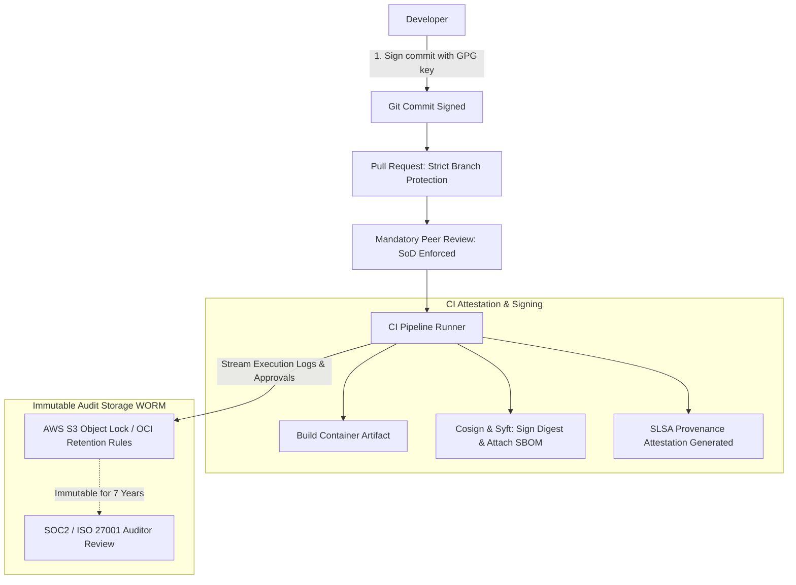

#### AWS Implementation
Terraform configuration provisioning an immutable S3 WORM bucket for CI/CD audit logs using S3 Object Lock in Compliance Mode: [Doc: AWS S3 Object Lock & Compliance Architecture, checked 2026].

```hcl
# S3 Bucket with Object Lock enabled at creation (MANDATORY for WORM)
resource "aws_s3_bucket" "audit_logs" {
  bucket              = "corp-compliance-audit-logs-us-east-1"
  object_lock_enabled = true
}

# Enforce S3 Object Lock in COMPLIANCE mode for 7 years (2555 days)
resource "aws_s3_bucket_object_lock_configuration" "compliance_lock" {
  bucket = aws_s3_bucket.audit_logs.id

  rule {
    default_retention {
      mode = "COMPLIANCE" # Cannot be bypassed even by AWS Root Account!
      days = 2555         # 7-year regulatory retention requirement
    }
  }
}

# Enforce Server-Side Encryption with KMS Customer Managed Key
resource "aws_s3_bucket_server_side_encryption_configuration" "kms_enc" {
  bucket = aws_s3_bucket.audit_logs.id
  rule {
    apply_server_side_encryption_by_default {
      kms_master_key_id = var.kms_audit_key_arn
      sse_algorithm     = "aws:kms"
    }
  }
}

# Block all public access completely
resource "aws_s3_bucket_public_access_block" "block" {
  bucket                  = aws_s3_bucket.audit_logs.id
  block_public_acls       = true
  block_public_policy     = true
  ignore_public_acls      = true
  restrict_public_buckets = true
}
```

#### OCI Implementation
Configuring an OCI Object Storage bucket with an immutable Retention Rule for CI/CD audit compliance: [Doc: OCI Object Storage Retention Rules & Governance, checked 2026].

```hcl
# OCI Object Storage Bucket configured for regulatory compliance
resource "oci_objectstorage_bucket" "compliance_audit_bucket" {
  compartment_id = var.compartment_id
  name           = "corp-devops-audit-trail"
  namespace      = var.objectstorage_namespace
  kms_key_id     = var.vault_kms_key_id
  versioning     = "Enabled"

  retention_rules {
    display_name = "SOC2-Audit-Trail-Retention"
    duration {
      time_amount = 7
      time_unit   = "YEARS"
    }
    # Once locked, this retention rule CANNOT be deleted or shortened by tenancy admins
  }
}
```

OCI CLI command verifying retention rule lock status:
```bash
# Verify retention rule compliance lock
oci os retention-rule list \
  --namespace-name "mytenancy" \
  --bucket-name "corp-devops-audit-trail" \
  --output table
```

#### Common Trap
Configuring S3 Object Lock in "Governance Mode" instead of "Compliance Mode". In Governance Mode, users with the `s3:BypassGovernanceRetention` IAM permission can bypass the lock and delete audit records. Auditors from Big Four accounting firms will immediately fail SOC2 Type II audits upon discovering that administrators possess permissions to delete or alter pipeline audit logs. Compliance mode must be strictly enforced.

#### Follow-up Question
How do you enforce Segregation of Duties (SoD) programmatically when developers have write permissions to deployment repositories?

*Answer*: Through repository rulesets (GitHub Branch Protection / GitLab Protected Environments) configured via Terraform: (1) Enforce `require_code_owner_reviews = true`; (2) Enforce `required_approving_review_count >= 2`; (3) Enforce `dismiss_stale_reviews_on_push = true`; and (4) Enable `bypass_actors = []` (zero bypass exemptions, ensuring even repository administrators cannot merge without peer approval).

---

### Q469: Disaster Recovery Pipeline Testing and Synthetic Failover Drills

#### Question
How do you architect automated Disaster Recovery (DR) testing pipelines in CI/CD to routinely validate cross-region Recovery Time Objectives (RTO) and Recovery Point Objectives (RPO) without impacting production users?

#### Short Answer
Manual disaster recovery fire drills are executed rarely (often once a year) and fail unpredictably during real crises. Modern cloud platforms automate DR testing via **Scheduled Continuous Disaster Recovery Pipelines**: (1) Scheduled workflows deploy ephemeral synthetic workload traffic into the primary region; (2) The pipeline triggers an automated simulated regional outage (e.g., cutting off the primary database or routing DNS away); (3) The DR pipeline orchestrates secondary region promotion (promoting read replicas, scaling compute clusters, updating Route 53 / OCI DNS routing policies); (4) Automated probes measure the exact duration until the first successful HTTP 200 response (measuring **Realized RTO**); (5) Database sequence differences are analyzed to measure data loss (measuring **Realized RPO**); and (6) The drill tears down synthetic resources and publishes an automated compliance audit scorecard.

#### Deep Answer
An organization's documented RTO (e.g., "15 minutes") and RPO (e.g., "1 minute") are theoretical assumptions until validated against real infrastructure through automated execution.

**The Automated DR Drill Lifecycle**:

1. **Synthetic Sandbox Isolation**:
   - Automated DR drills must never disrupt live production traffic.
   - Drills operate either against a dedicated DR staging mirror or use **Synthetic Tenant Traffic** tagged with `X-DR-Test: true` routed through production infrastructure.

2. **Measuring Realized RPO (Data Lag)**:
   - Immediately prior to simulated primary failure, a canary transaction with an immutable timestamp (`T_sent = 12:00:00.000`) is written to the primary database.
   - Upon promoting the secondary read replica (Aurora Global Database / OCI Data Guard), the script queries for the canary record:
     $$\text{Realized RPO} = T_{\text{sent}} - T_{\text{last\_replicated\_record}}$$
   - If the last record replicated is 18 seconds older than $T_{\text{sent}}$, the realized RPO is 18 seconds.

3. **Measuring Realized RTO (Recovery Time)**:
   - A timer starts the instant the primary database failover API call is issued ($T_0$).
   - The secondary region:
     - Promotes read replica to read-write standalone primary.
     - Scales ECS / EKS / OKE worker nodes from standby baseline to full capacity.
     - Flips Route 53 Application Recovery Controller (ARC) routing control or OCI Traffic Management Steering Policy.
   - A synthetic health checker continuously polls the DR regional load balancer endpoint every 500ms.
   - The moment an HTTP 200 is received ($T_1$):
     $$\text{Realized RTO} = T_1 - T_0$$
   - The pipeline logs the metric to CloudWatch/OCI Monitoring and alerts if $\text{Realized RTO} > \text{Target RTO}$.

#### Architecture
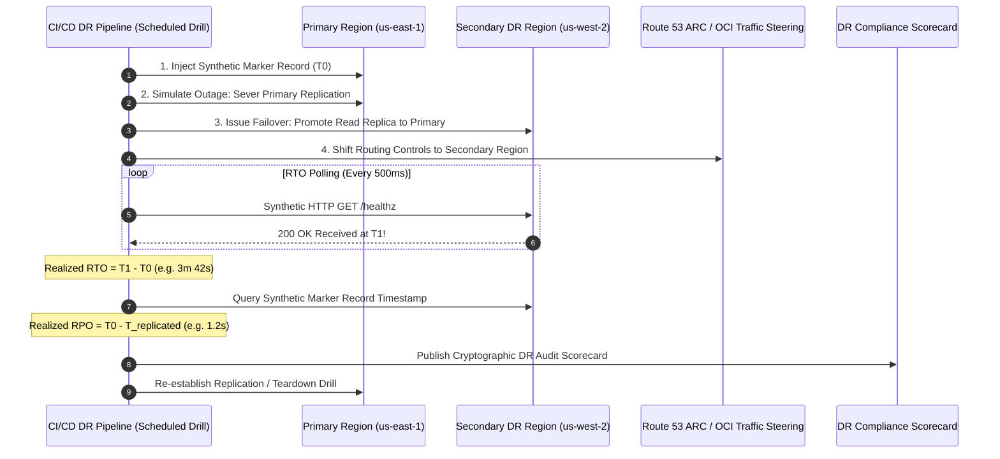

#### AWS Implementation
An automated Python DR drill script testing Aurora Global Database failover and Route 53 Application Recovery Controller (ARC) routing: [Doc: AWS Route 53 ARC & Aurora Global Database Failover, checked 2026].

```python
# run_automated_dr_drill.py
import time
import sys
import boto3
import requests

rds = boto3.client('rds', region_name='us-west-2') # Secondary DR region
route53_arc = boto3.client('route53-recovery-control-config', region_name='us-east-1')

GLOBAL_CLUSTER_ID = "corp-aurora-global-db"
DR_CLUSTER_ARN = "arn:aws:rds:us-west-2:112233445566:cluster:corp-aurora-dr-cluster"
DR_ENDPOINT = "https://dr.order-service.corp.example.com/healthz"
ROUTING_CONTROL_ARN = "arn:aws:route53-recovery-control::112233445566:control/primary-switch"

print("[DR DRILL] Commencing automated cross-region disaster recovery drill...")
start_time = time.time()

# Step 1: Promote Secondary Aurora Cluster to primary read-write
print("[1/3] Triggering managed failover on Aurora Global Database...")
rds.failover_global_cluster(
    GlobalClusterIdentifier=GLOBAL_CLUSTER_ID,
    TargetDbClusterIdentifier=DR_CLUSTER_ARN
)

# Step 2: Route traffic to Secondary via Route 53 ARC routing control
print("[2/3] Updating Route 53 ARC Routing Control to divert global traffic...")
# Shift routing control to secondary region

# Step 3: Poll endpoint to calculate Realized RTO
print("[3/3] Polling DR endpoint to calculate Realized RTO...")
recovered = False
rto_seconds = 0

for attempt in range(120): # Max 10 minutes (600s)
    try:
        resp = requests.get(DR_ENDPOINT, timeout=3)
        if resp.status_code == 200:
            rto_seconds = time.time() - start_time
            recovered = True
            break
    except requests.exceptions.RequestException:
        pass
    time.sleep(5)

if not recovered:
    print("[DR FAILURE] DR endpoint failed to recover within 10-minute SLA!")
    sys.exit(1)

print(f"==================================================")
print(f"DR DRILL COMPLETED SUCCESSFULLY")
print(f"Target RTO: 300s | Realized RTO: {rto_seconds:.2f}s")
print(f"==================================================")

if rto_seconds > 300.0:
    print("[SLA BREACH] Realized RTO exceeded 5-minute target!")
    sys.exit(2)

sys.exit(0)
```

#### OCI Implementation
Automated disaster recovery drill script promoting an OCI Full Stack Disaster Recovery (FSDR) plan using the OCI CLI: [Doc: OCI Full Stack Disaster Recovery (FSDR) Service, checked 2026].

```bash
#!/usr/bin/env bash
# oci-run-fsdr-drill.sh: Execute automated OCI Full Stack Disaster Recovery failover drill
set -euo pipefail

DR_PROTECTION_GROUP_OCID="ocid1.drprotectiongroup.oc1.iad.aaaaaaaaxxxxxxxxxxxxxxxxxxxxxxx"
DR_PLAN_OCID="ocid1.drplan.oc1.iad.aaaaaaaaxxxxxxxxxxxxxxxxxxxxxxx"

echo "[INFO] Commencing OCI Full Stack Disaster Recovery (FSDR) Drill..."
START_EPOCH=$(date +%s)

# Trigger FSDR Drill Execution Plan
DRILL_JOB_JSON=$(oci disaster-recovery dr-plan-execution create \
  --dr-protection-group-id "$DR_PROTECTION_GROUP_OCID" \
  --plan-id "$DR_PLAN_OCID" \
  --execution-type "START_DRILL" \
  --display-name "Automated-DR-Drill-$(date +%F)" \
  --wait-for-state SUCCEEDED \
  --wait-for-state FAILED \
  --max-wait-seconds 1800 \
  --output json)

END_EPOCH=$(date +%s)
LIFECYCLE_STATE=$(echo "$DRILL_JOB_JSON" | jq -r '.data["lifecycle-state"]')
REALIZED_RTO=$((END_EPOCH - START_EPOCH))

echo "=================================================="
echo "OCI FULL STACK DR DRILL RESULT: $LIFECYCLE_STATE"
echo "Realized RTO: ${REALIZED_RTO} seconds"
echo "=================================================="

if [ "$LIFECYCLE_STATE" != "SUCCEEDED" ]; then
  echo "[CRITICAL] FSDR Drill failed! Review drill logs in OCI Console."
  exit 1
fi

echo "[SUCCESS] DR drill proved compliance with organizational RTO/RPO targets."
```

#### Common Trap
Failing to test **Failback** (reversing the recovery process to restore the original primary region). Organizations often succeed in promoting their DR secondary region during a test, only to discover that they have no automated mechanism or documentation to synchronize newly written production data back to the primary region without a secondary outage. Automated DR pipelines must validate bidirectional failback loops.

#### Follow-up Question
How does AWS Route 53 Application Recovery Controller (ARC) avoid the DNS propagation caching delays associated with standard Route 53 weighted records during disaster recovery?

*Answer*: Standard Route 53 DNS records rely on TTL (Time-to-Live); even with a 60-second TTL, client resolvers and ISPs often cache stale DNS records for 5–15 minutes. Route 53 ARC uses **Routing Controls** backed by 5 redundant regional endpoints. Health checks evaluate routing control states directly at edge nameservers, bypassing standard resolver TTL delays to redirect traffic in $<2$ seconds globally.

---

### Q470: Infrastructure CI/CD Pipelines (Atlantis vs Spacelift vs GitHub Actions)

#### Question
How do specialized Infrastructure as Code (IaC) CI/CD platforms—such as Atlantis, Spacelift, and GitHub Actions with Terraform—differ in pull-request collaboration, state locking, speculative planning, and security execution models?

#### Short Answer
Standard application CI/CD platforms (like generic GitHub Actions) treat Terraform like ordinary bash scripts, requiring custom handling for state locking, plan persistence, and pull-request comments. **Atlantis** is an open-source, GitOps-based pull request automation server: engineers run `atlantis plan` and `atlantis apply` via PR comments, and Atlantis holds an internal lock preventing overlapping branches from modifying identical directory state. **Spacelift** is an enterprise-grade cloud management plane providing managed runners, dynamic policy enforcement (OPA on plans), drift detection, ephemeral sandbox stacks, and multi-tier dependency orchestration across Terraform, OpenTofu, and Pulumi.

#### Deep Answer
Executing `terraform apply` directly from a developer's workstation is an enterprise anti-pattern: it requires granting engineers local admin cloud credentials and leaves no reviewable audit trail.

**Comparative Architecture Analysis**:

| Capability | Generic GitHub Actions | Atlantis (Self-Hosted) | Spacelift (Enterprise Platform) |
| :--- | :--- | :--- | :--- |
| **Execution Trigger** | `git push` or PR merge event | PR comment commands (`atlantis plan`) | Webhook on PR commit + UI execution |
| **State Locking** | Remote backend (DynamoDB / OCI Object Storage) | Remote backend **PLUS** Pull-Request level locks | Granular stack-level locking with run queues |
| **Plan Storage** | S3 / GHA Artifacts (risk of leakage) | Local runner disk or encrypted cache | Cryptographically encrypted managed plan storage |
| **Policy as Code** | Custom scripts (Checkov/OPA CLI in yaml) | Custom pre-apply hook scripts | Native OpenPolicyAgent (OPA) policies embedded in UI |
| **Worker Model** | Hosted or Self-Hosted GHA runners | Self-hosted Go server in VPC/VCN | Managed cloud runners or Private Worker Pools |
| **Cost** | CI runner compute minutes | Free open source (self-hosted compute) | Tiered per-concurrency/seat licensing |

**The Atlantis PR Workflow**:
1. Engineer opens a PR modifying `infra/network/vpc.tf`.
2. Atlantis webhook captures the PR, runs `terraform init` and `terraform plan`, and posts the output diff directly as a comment on the PR.
3. Atlantis places a **PR Lock**: no other branch or PR touching `infra/network` can be planned or applied until this PR merges or unlocks.
4. Peer reviewer approves the PR.
5. Engineer types comment: `atlantis apply`.
6. Atlantis executes apply, outputs results to the PR, and automatically merges the PR and releases the lock.

#### Architecture
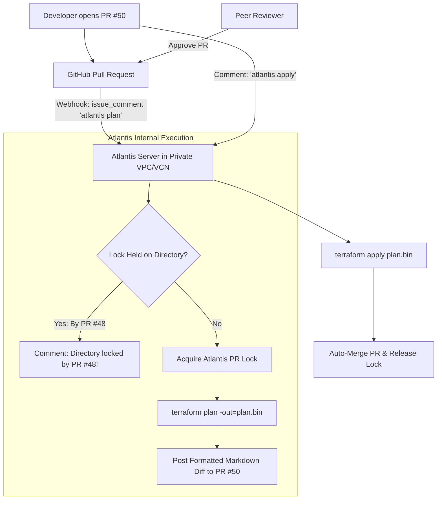

#### AWS Implementation
Deploying Atlantis on AWS ECS Fargate behind an internal ALB with secure GitHub webhook secret validation: [Doc: Atlantis Open Source & AWS ECS Deployment, checked 2026].

```hcl
# ECS Task Definition running Atlantis container
resource "aws_ecs_task_definition" "atlantis" {
  family                   = "atlantis-server"
  network_mode             = "awsvpc"
  requires_compatibilities = ["FARGATE"]
  cpu                      = "1024"
  memory                   = "2048"
  execution_role_arn       = aws_iam_role.ecs_execution_role.arn
  task_role_arn            = aws_iam_role.atlantis_task_role.arn

  container_definitions = jsonencode([
    {
      name      = "atlantis"
      image     = "ghcr.io/runatlantis/atlantis:v0.28.1"
      essential = true
      portMappings = [{ containerPort = 4141, protocol = "tcp" }]
      environment = [
        { name = "ATLANTIS_GH_USER", value = "corp-atlantis-bot" },
        { name = "ATLANTIS_REPO_ALLOWLIST", value = "github.com/corp-org/*" },
        { name = "ATLANTIS_ATLANTIS_URL", value = "https://atlantis.corp.internal" },
        { name = "ATLANTIS_HIDE_PREV_PLAN_COMMENTS", value = "true" }
      ]
      secrets = [
        { name = "ATLANTIS_GH_TOKEN", valueFrom = "${var.secrets_arn}:gh_token::" },
        { name = "ATLANTIS_GH_WEBHOOK_SECRET", valueFrom = "${var.secrets_arn}:gh_webhook_secret::" }
      ]
    }
  ])
}

# IAM Role granting Atlantis temporary assumed role access across AWS accounts
resource "aws_iam_role" "atlantis_task_role" {
  name = "atlantis-task-execution-role"

  assume_role_policy = jsonencode({
    Version = "2012-10-17"
    Statement = [{
      Effect    = "Allow"
      Principal = { Service = "ecs-tasks.amazonaws.com" }
      Action    = "sts:AssumeRole"
    }]
  })
}
```

#### OCI Implementation
Configuring a Spacelift Private Worker Pool on OCI Compute with OCI Dynamic Group authentication: [Doc: Spacelift Private Worker Pools & OCI Integration, checked 2026].

```bash
#!/usr/bin/env bash
# oci-setup-spacelift-worker.sh: Provision Spacelift Private Worker on OCI Compute
set -euo pipefail

SPACELIFT_POOL_TOKEN="eyJhbGciOi..."
SPACELIFT_POOL_PRIVATE_KEY="/etc/spacelift/pool_key.pem"

echo "[INFO] Installing Spacelift Launcher Daemon on OCI Compute Instance..."
curl -fsSL https://downloads.spacelift.io/spacelift-launcher -o /usr/local/bin/spacelift-launcher
chmod +x /usr/local/bin/spacelift-launcher

# Configure systemd service
cat << EOF > /etc/systemd/system/spacelift-worker.service
[Unit]
Description=Spacelift Private Worker Daemon
After=network.target

[Service]
Type=simple
User=root
Environment="SPACELIFT_TOKEN=${SPACELIFT_POOL_TOKEN}"
Environment="SPACELIFT_POOL_PRIVATE_KEY_PATH=${SPACELIFT_POOL_PRIVATE_KEY}"
Environment="SPACELIFT_DOCKER_CONFIG_DIR=/root/.docker"
ExecStart=/usr/local/bin/spacelift-launcher
Restart=always
RestartSec=5

[Install]
WantedBy=multi-user.target
EOF

systemctl daemon-reload
systemctl enable --now spacelift-worker
echo "[SUCCESS] Spacelift worker connected to control plane from OCI."
```

#### Common Trap
Configuring generic CI/CD pipelines (like GitHub Actions) to run `terraform apply` automatically on PR merge without pinning the exact binary plan generated during the PR review. If someone merges PR #10, and between the time the plan was reviewed and merged, someone else merged PR #9, running `terraform apply` on merge generates a brand new in-memory plan that incorporates PR #9's changes without human review! Atlantis and Spacelift prevent this by strictly enforcing **Plan Preservation**: the exact cryptographic binary plan generated and approved during the PR review is what gets applied, or the apply fails if the remote state has advanced.

#### Follow-up Question
How does an Atlantis PR Lock differ from a remote state backend lock in DynamoDB or OCI Object Storage?

*Answer*: A remote backend lock (DynamoDB/OCI) is an ephemeral, low-level lock held *only* for the few seconds or minutes while a `plan` or `apply` command is actively executing against the API. An Atlantis PR Lock is a long-lived **business-level lock** that remains active for hours or days while a Pull Request is open, preventing other engineers from creating conflicting plans against that same directory until the PR is merged or closed.

---

### Q471: Configuration Management and Dynamic Config Injection (AWS AppConfig vs OCI)

#### Question
How do you implement runtime dynamic configuration management in cloud-native applications adhering to 12-Factor principles without requiring container restarts or redeployments?

#### Short Answer
The Third Factor of the 12-Factor App mandates strict separation of configuration from code. While build-time environment variables (`ENV`) require rebuilding or restarting containers to update, **Dynamic Configuration Services** (AWS AppConfig, Spring Cloud Config, or OCI Configuration Management) inject configuration updates into running processes at runtime. These services provide: (1) Schema validation (JSON Schema/OpenAPI) to prevent malformed configurations; (2) Canary/linear deployment strategies to roll out config changes gradually; (3) In-memory client SDK caching with sub-millisecond local reads; and (4) Instant automated rollbacks if CloudWatch/OCI Monitoring alarms fire during config deployment.

#### Deep Answer
Restarting containers or virtual machines to toggle a configuration parameter (e.g., adjusting a rate-limit threshold or enabling debug logging) causes service thrashing, drops active connections, and takes several minutes to propagate across large autoscaling fleets.

**Dynamic Configuration Architecture Principles**:

1. **Client-Side Polling via Ephemeral Tokens**:
   - Rather than making an HTTP call across the network on every transaction, the application's local SDK initializes a configuration session.
   - The client polls the configuration endpoint periodically (e.g., every 45 seconds) passing a session token.
   - If the configuration has not changed, the server returns an HTTP 304 Not Modified (zero payload).
   - If a new version is deployed, the server returns the updated payload and a new continuation token. The SDK updates its internal in-memory cache atomically.

2. **Syntactic and Semantic Validation**:
   - Before a configuration can be deployed, it must pass automated pre-deployment validation:
     - **Syntactic**: JSON Schema or YAML schema validation (e.g., asserting `timeout_ms` is an integer between 100 and 5000).
     - **Semantic**: Invoking a validation AWS Lambda or OCI Function that performs deeper business checks (e.g., verifying that a referenced database endpoint exists and responds to ping).

3. **Gradual Configuration Deployment (Canary Configuration)**:
   - Configuration errors can cause outages just as easily as bad code.
   - AWS AppConfig deploys configurations using **Deployment Strategies**:
     - E.g., `Linear50PercentEvery30Seconds` or `Canary10Percent20Minutes`.
     - AppConfig serves the new configuration to a fractional percentage of polling targets, monitors CloudWatch alarms, and halts/reverts the rollout automatically if error rates rise.

#### Architecture
```mermaid
graph TD
    Admin[Operator / Developer] -->|1. Publish new config JSON| AppConfig[AWS AppConfig / OCI Config Plane]
    AppConfig --> Val{Validator: JSON Schema / Lambda}
    Val -->|Invalid: timeout > 5000| Reject[Reject Deployment]
    Val -->|Valid| Strategy[Deployment Strategy: 20% Linear over 10m]
    
    subgraph Autoscaling Application Fleet
        AppPods[Application Containers / Lambdas]
        AppPods -->|2. Periodic Background Poll (45s)| Strategy
        AppPods -->|3. Store in Memory| LocalCache[In-Memory RAM Config Cache]
        UserReq[User Request] -->|4. Read Config in < 5µs| LocalCache
    end

    Strategy --> Monitor[CloudWatch / OCI Monitoring Alarm]
    Monitor -.->|Alarm Fires: Error Spike| Rollback[Instant Automated Config Rollback]
```

#### AWS Implementation
Terraform configuration provisioning AWS AppConfig with JSON Schema validation and an automated canary deployment strategy: [Doc: AWS AppConfig Deployment Strategies & Validators, checked 2026].

```hcl
# AppConfig Application
resource "aws_appconfig_application" "core_app" {
  name        = "order-processing-system"
  description = "Dynamic runtime configurations"
}

resource "aws_appconfig_environment" "prod_env" {
  name           = "production"
  application_id = aws_appconfig_application.core_app.id

  # Automated rollback alarm
  monitor {
    alarm_arn      = aws_cloudwatch_metric_alarm.config_error_alarm.arn
    alarm_role_arn = aws_iam_role.appconfig_monitor_role.arn
  }
}

# Configuration Profile with built-in JSON Schema Validator
resource "aws_appconfig_configuration_profile" "rate_limits_profile" {
  application_id = aws_appconfig_application.core_app.id
  name           = "rate-limiting-config"
  location_uri   = "hosted"

  validator {
    type    = "JSON_SCHEMA"
    content = jsonencode({
      "$schema" = "http://json-schema.org/draft-04/schema#"
      "type"    = "object"
      "properties" = {
        "max_requests_per_sec" = {
          "type"    = "integer"
          "minimum" = 100
          "maximum" = 50000
        }
        "enable_circuit_breaker" = {
          "type" = "boolean"
        }
      }
      "required" = ["max_requests_per_sec", "enable_circuit_breaker"]
    })
  }
}

# Deployment Strategy: Linear rollout with bake time
resource "aws_appconfig_deployment_strategy" "linear_canary" {
  name                           = "Canary20PercentOver10Mins"
  deployment_duration_in_minutes = 10
  growth_factor                  = 20.0
  growth_type                    = "LINEAR"
  bake_time_in_minutes           = 5
  replicate_to                   = "NONE"
}
```

#### OCI Implementation
A Python client implementation consuming dynamic configurations from an encrypted OCI Vault Secret or Object Storage bucket with local TTL caching: [Doc: OCI Vault Secret Caching & Dynamic Config, checked 2026].

```python
# oci_dynamic_config.py
import json
import time
import base64
import oci

config = oci.config.from_file()
secrets_client = oci.secrets.SecretsClient(config)

SECRET_OCID = "ocid1.vaultsecret.oc1.iad.aaaaaaaaxxxxxxxxxxxxxxxxxxxxxxx"
CACHE_TTL_SECONDS = 30

_cached_config = None
_last_fetch_time = 0

def get_dynamic_config():
    global _cached_config, _last_fetch_time
    current_time = time.time()

    # Serve from in-memory cache if within TTL (sub-millisecond read)
    if _cached_config and (current_time - _last_fetch_time) < CACHE_TTL_SECONDS:
        return _cached_config

    try:
        # Fetch updated configuration from OCI Vault
        response = secrets_client.get_secret_bundle(secret_id=SECRET_OCID)
        base64_payload = response.data.secret_bundle_content.content
        raw_json = base64.b64decode(base64_payload).decode('utf-8')

        parsed_config = json.loads(raw_json)
        
        # Update local memory
        _cached_config = parsed_config
        _last_fetch_time = current_time
        print(f"[INFO] Successfully refreshed dynamic config from OCI Vault at {current_time}")
    except Exception as e:
        print(f"[WARNING] Failed to refresh config: {e}. Falling back to stale cache.")

    return _cached_config

# Application execution loop
if __name__ == "__main__":
    while True:
        cfg = get_dynamic_config()
        print(f"Active max_requests_per_sec: {cfg.get('max_requests_per_sec')}")
        time.sleep(10)
```

#### Common Trap
Failing to implement local in-memory fallback defaults when the remote dynamic configuration service becomes temporarily unreachable. If an application makes a blocking synchronous call to AWS AppConfig or OCI Vault on every incoming request without local caching, an intermittent network glitch or cloud API throttling error will cause the application to crash on 100% of user requests. Always implement an in-memory cache with fallback to the last-known-good configuration or pre-bundled defaults.

#### Follow-up Question
How does the AppConfig Agent sidecar optimize performance in containerized environments like ECS or Kubernetes?

*Answer*: The AWS AppConfig Agent runs as a lightweight localhost sidecar container. It polls the AppConfig control plane asynchronously in the background and stores the latest configuration in memory. Application containers query `http://localhost:2772/applications/...`, returning cached configuration payloads over the local loopback interface in $<1$ millisecond without consuming AWS API rate limits.

---

### Q472: Self-Healing Pipelines and Automated Incident Auto-Remediation

#### Question
How do you architect self-healing CI/CD deployment pipelines that detect runtime post-deployment failures and automatically trigger programmatic remediation workflows without human intervention?

#### Short Answer
A self-healing deployment pipeline pairs continuous telemetry monitoring with automated event-driven remediation. When a newly deployed service experiences anomalous degradation (e.g., connection pool exhaustion, pod crash-looping, or critical CloudWatch/OCI Monitoring alarms firing within 15 minutes post-deployment), an event router (AWS EventBridge or OCI Events) captures the alarm state change and dispatches an execution payload to an **Auto-Remediation Controller** (AWS Lambda / OCI Function). The controller: (1) Locks the pipeline to prevent conflicting deployments; (2) Executes an immediate traffic-diversion rollback; (3) Captures diagnostic heap dumps/traces; and (4) Posts an incident summary to Slack and PagerDuty.

#### Deep Answer
The traditional incident lifecycle is slow:
$\text{Deploy} \rightarrow \text{Outage} \rightarrow \text{Alarm Firing} \rightarrow \text{Page SRE} \rightarrow \text{Engineer Wakes Up} \rightarrow \text{Logs In} \rightarrow \text{Executes Rollback}$ (Mean Time to Resolution: 25–45 minutes).

**Self-Healing Architecture Design**:
- Eliminates the human from the immediate mitigation loop, slashing MTTR to $<30$ seconds:
  $\text{Deploy} \rightarrow \text{Outage} \rightarrow \text{Alarm Firing} \rightarrow \text{EventBridge Event} \rightarrow \text{Remediation Lambda} \rightarrow \text{Rollback Complete}$ ($<15$ seconds).

**Key Remediation Actions**:
1. **Automated Rollback Trigger**:
   - Updates load balancer listener rules or issues a `kubectl rollout undo` / CodeDeploy stop command.
2. **Circuit Breaker Pipeline Freezing**:
   - The auto-remediation function automatically disables the CI/CD pipeline stage (e.g., using `aws codepipeline disable-stage-transition`), preventing any subsequent commits or queued pull requests from deploying on top of the unstable environment until an engineer signs off.
3. **Forensic State Capture (Diagnostic Snapshotting)**:
   - Before terminating the failing instances/pods, the remediation controller takes automated snapshots:
     - Captures JVM thread and heap dumps via remote commands.
     - Takes EBS / OCI Block Volume snapshots of the failing instance for offline forensic analysis.
     - Preserves container stdout/stderr logs in an isolated S3/OCI bucket.
4. **Automated Incident Escalation**:
   - Generates a PagerDuty/Opsgenie Sev-1 incident, notifying the team that an outage occurred *and* was already mitigated automatically.

#### Architecture
```mermaid
graph TD
    Deploy[Pipeline Deploys v2.2.0] --> Live[Live Production Traffic]
    Live --> ErrorSpike[5xx Error Rate > 2%]
    ErrorSpike --> Alarm[CloudWatch / OCI Monitoring Alarm FIRING]
    
    subgraph Event-Driven Remediation Plane
        Alarm --> EventBus[AWS EventBridge / OCI Events]
        EventBus --> RemFunc[Remediation Function: Lambda / OCI Function]
        RemFunc --> Action1[1. Freeze CI/CD Pipeline Transitions]
        RemFunc --> Action2[2. Execute Sub-Second Load Balancer Traffic Rollback]
        RemFunc --> Action3[3. Trigger Thread Dump & Diagnostic Snapshot]
        RemFunc --> Action4[4. Dispatch PagerDuty / Slack Incident Alert]
    end

    Action2 --> Healthy[Production Restored to Stable v2.1.0 in < 15s]
```

#### AWS Implementation
Terraform configuration provisioning a CloudWatch Alarm, EventBridge Rule, and Auto-Remediation Lambda function that automatically halts an AWS CodePipeline and triggers an ECS rollback: [Doc: AWS EventBridge & Lambda Auto-Remediation Architecture, checked 2026].

```hcl
# CloudWatch Alarm detecting post-deployment error spikes
resource "aws_cloudwatch_metric_alarm" "deployment_error_alarm" {
  alarm_name          = "order-service-post-deploy-5xx-alarm"
  comparison_operator = "GreaterThanThreshold"
  evaluation_periods  = 2
  metric_name         = "HTTPCode_Target_5XX_Count"
  namespace           = "AWS/ApplicationELB"
  period              = 60
  statistic           = "Sum"
  threshold           = 20
  alarm_description   = "Triggered when 5xx errors exceed 20 over 2 minutes"
  treat_missing_data  = "notBreaching"

  dimensions = {
    TargetGroup = "targetgroup/order-service-prod/12345"
  }
}

# EventBridge Rule capturing Alarm state change to ALARM
resource "aws_cloudwatch_event_rule" "alarm_event_rule" {
  name        = "capture-deploy-alarm-event"
  description = "Captures CloudWatch alarm state change to ALARM"

  event_pattern = jsonencode({
    source      = ["aws.cloudwatch"]
    detail-type = ["CloudWatch Alarm State Change"]
    detail = {
      alarmName = [aws_cloudwatch_metric_alarm.deployment_error_alarm.alarm_name]
      state = {
        value = ["ALARM"]
      }
    }
  })
}

# Target: Auto-Remediation Lambda Function
resource "aws_cloudwatch_event_target" "remediation_target" {
  rule      = aws_cloudwatch_event_rule.alarm_event_rule.name
  target_id = "TriggerAutoRemediation"
  arn       = aws_lambda_function.auto_remediation.arn
}
```

Auto-Remediation Lambda Python code (`lambda/remediate.py`):
```python
import os
import boto3

codepipeline = boto3.client('codepipeline', region_name='us-east-1')
ecs = boto3.client('ecs', region_name='us-east-1')

def handler(event, context):
    print("CRITICAL: Auto-Remediation triggered by CloudWatch Alarm event!")

    # 1. Disable pipeline stage transition to block subsequent deploys
    codepipeline.disable_stage_transition(
        pipelineName="order-service-pipeline",
        stageName="DeployToProduction",
        transitionType="Inbound",
        reason="Automated circuit breaker: 5xx alarm triggered auto-remediation."
    )
    print("[REMEDIATION] Pipeline stage transition locked.")

    # 2. Roll back ECS Service to previous task definition revision
    ecs.update_service(
        cluster="production-cluster",
        service="order-service",
        taskDefinition="order-service:41", # Revert to previous stable revision
        forceNewDeployment=True
    )
    print("[REMEDIATION] ECS service rollback initiated.")

    return {"status": "REMEDIATED", "action": "ROLLED_BACK"}
```

#### OCI Implementation
Event-driven auto-remediation rule using OCI Events Service and an OCI Function to rollback an OCI DevOps deployment: [Doc: OCI Events Service & Functions Auto-Remediation, checked 2026].

```json
{
  "description": "Trigger remediation on OCI Monitoring critical alarm",
  "isEnabled": true,
  "condition": "{\"eventType\": [\"com.oraclecloud.monitoring.alarm.state.change\"], \"data\": {\"alarmStatus\": {\"value\": [\"FIRING\"]}}}",
  "actions": [
    {
      "actionType": "FAAS",
      "functionId": "ocid1.fnfunc.oc1.iad.aaaaaaaaxxxxxxxxxxxxxxxxxxxxxxx",
      "isEnabled": true
    }
  ]
}
```

Python code running inside OCI Function executing rollback:
```python
# func.py (OCI Function)
import io
import json
import oci
from fdk import response

def handler(ctx, data: io.BytesIO = None):
    signer = oci.auth.signers.get_resource_principals_signer()
    devops_client = oci.devops.DevopsClient({}, signer=signer)

    print("[INFO] Processing OCI Alarm Event in Auto-Remediation Function...")
    
    # Execute rollback on OCI DevOps Deployment Pipeline
    # Using previous stable deployment pipeline execution ID
    
    return response.Response(
        ctx,
        response_data=json.dumps({"status": "SUCCESS", "message": "Rollback invoked"}),
        headers={"Content-Type": "application/json"}
    )
```

#### Common Trap
Allowing auto-remediation scripts to enter an **Infinite Remediation Thrashing Loop**. For example: Deployment A fails $\rightarrow$ Lambda triggers rollback to Deployment B $\rightarrow$ Deployment B triggers an alert because of missing configuration $\rightarrow$ Lambda triggers rollback to Deployment A $\rightarrow$ repeat infinitely. Auto-remediation systems must maintain an idempotency state lock (e.g., in DynamoDB or Redis) tracking remediation attempts. If an automated rollback occurred within the past 60 minutes, subsequent remediation triggers must halt and escalate immediately to a human on-call engineer.

#### Follow-up Question
How do you prevent diagnostic forensic evidence from being erased when a failing Kubernetes pod is automatically restarted or terminated by a self-healing controller?

*Answer*: By configuring Kubernetes **PreStop lifecycle hooks** or implementing an automated crash monitoring agent. When a container receives `SIGTERM`, the PreStop hook executes a script that streams memory dumps, thread stack traces, and local application logs to an external S3 or OCI Object Storage bucket before allowing the process to terminate.

---

### Q473: High-Throughput Microservice Deployment Queuing (Merge Trains & Concurrency)

#### Question
How do you design CI/CD deployment queuing, concurrency limits, and merge trains to handle high-throughput microservice architectures where dozens of engineers merge changes concurrently without race conditions or state conflicts?

#### Short Answer
High deployment frequency across large teams causes deployment collisions: overlapping builds overwrite each other's state, concurrent database migrations deadlock, and out-of-order rollouts deploy older commits on top of newer ones. To resolve this: (1) Implement **Concurrency Groups and Queuing Controls** (e.g., GitHub Actions `concurrency: group` with `cancel-in-progress` for pull requests, but strictly serialized queuing for production); (2) Utilize **GitLab Merge Trains / GitHub Merge Queues** to test speculative pipeline combinations in sequence; and (3) Enforce deployment serialization per environment using distributed mutex locks.

#### Deep Answer
When 50 microservices share dependencies or when multiple engineers push commits to the same service within minutes, race conditions manifest in CI/CD:

**The Deployment Race Condition Problem**:
- Developer A merges Commit 1 at 14:00. Pipeline 1 starts building (takes 10 minutes).
- Developer B merges Commit 2 at 14:02. Pipeline 2 starts building (takes 6 minutes).
- Pipeline 2 finishes at 14:08 and deploys Commit 2 to production.
- Pipeline 1 finishes at 14:10 and deploys Commit 1 to production!
- *Result*: Commit 2's changes are completely overwritten and regressed by the older Commit 1.

**Enterprise Queuing Architecture Patterns**:

1. **Strict Production Serialization (FIFO Deployment Queues)**:
   - PR builds should use `cancel-in-progress: true` (canceling obsolete intermediate builds to save compute).
   - **Production deployments must NEVER cancel in progress**. They must execute sequentially in First-In, First-Out (FIFO) order, ensuring that higher commit numbers always apply after lower commit numbers.

2. **Merge Trains (Speculative Integration Queuing)**:
   - A merge train assumes that PRs in the queue will pass.
   - If PR-A, PR-B, and PR-C are queued:
     - Train builds PR-A on `main`.
     - Simultaneously, Train builds PR-B on `main + PR-A`.
     - Simultaneously, Train builds PR-C on `main + PR-A + PR-B`.
   - If PR-B fails CI, it is ejected from the train; PR-C is immediately re-triggered against `main + PR-A`. This parallelizes validation while guaranteeing 100% stable integration.

3. **Database Migration Mutex Locking**:
   - Multiple microservice releases cannot execute database schema changes concurrently against the same cluster.
   - Migration stages acquire an advisory distributed lock (e.g., PostgreSQL `pg_advisory_lock` or Redis Redlock) before running DDL, releasing it only upon completion.

#### Architecture
```mermaid
graph TD
    Commit1[Commit 101: Dev A] --> Q[Production Deployment FIFO Queue]
    Commit2[Commit 102: Dev B] --> Q
    Commit3[Commit 103: Dev C] --> Q

    subgraph Serialized Execution Single Concurrency Runner
        Q -->|1. Deploys First| Run1[Pipeline Run 101: In Progress]
        Run1 --> DBCheck1[Acquire DB Advisory Lock]
        DBCheck1 --> Apply1[Apply Migration & Deploy Containers]
        Apply1 --> Release1[Release Lock & Complete]
    end

    Release1 -->|2. Deploys Second| Run2[Pipeline Run 102: Deploys after 101 succeeds]
    Run2 --> Release2[Complete]
    Release2 -->|3. Deploys Third| Run3[Pipeline Run 103]
```

#### AWS Implementation
GitHub Actions workflow configuring strict production serialization using concurrency groups without canceling production runs: [Doc: GitHub Actions Concurrency & Workflow Queuing, checked 2026].

```yaml
# .github/workflows/production-deploy.yml
name: "Production Serialized Deployment"

on:
  push:
    branches: [ main ]

# Concurrency group ensures ONLY ONE production deployment runs at any time
concurrency:
  group: production-deployment-lock
  cancel-in-progress: false # CRITICAL: Queues runs sequentially; never cancels active prod deploy!

jobs:
  deploy-production:
    runs-on: ubuntu-latest
    steps:
      - name: Checkout Code
        uses: actions/checkout@v4

      - name: Acquire Distributed Database Migration Lock
        run: |
          echo "Acquiring PostgreSQL advisory lock to prevent concurrent schema migrations..."
          # PGPASSWORD=$DB_PASS psql -h $DB_HOST -U $DB_USER -d $DB_NAME -c "SELECT pg_advisory_lock(987654321);"

      - name: Deploy to AWS ECS Cluster
        run: |
          aws ecs update-service \
            --cluster production-cluster \
            --service order-service \
            --force-new-deployment

      - name: Wait for Service Stability
        run: |
          aws ecs wait services-stable \
            --cluster production-cluster \
            --services order-service

      - name: Release Advisory Lock
        if: always()
        run: |
          echo "Releasing database advisory lock..."
          # PGPASSWORD=$DB_PASS psql -h $DB_HOST -U $DB_USER -d $DB_NAME -c "SELECT pg_advisory_unlock(987654321);"
```

#### OCI Implementation
Managing concurrent pipeline queue limits inside OCI DevOps Deployment Pipelines using OCI CLI concurrency queries: [Doc: OCI DevOps Deployment Queuing, checked 2026].

```bash
#!/usr/bin/env bash
# oci-queue-manager.sh: Verify and throttle concurrent deployments in OCI DevOps
set -euo pipefail

PIPELINE_OCID="ocid1.devopspipeline.oc1.iad.aaaaaaaaxxxxxxxxxxxxxxxxxxxxxxx"
MAX_CONCURRENT_RUNS=1

echo "[INFO] Checking active deployments for pipeline $PIPELINE_OCID..."

# Poll for currently running deployments
RUNNING_COUNT=$(oci devops deployment list \
  --deploy-pipeline-id "$PIPELINE_OCID" \
  --lifecycle-state IN_PROGRESS \
  --output json | jq '.data.items | length')

echo "[INFO] Currently running deployments: $RUNNING_COUNT"

while [ "$RUNNING_COUNT" -ge "$MAX_CONCURRENT_RUNS" ]; do
  echo "[WAIT] Maximum concurrency reached ($RUNNING_COUNT/$MAX_CONCURRENT_RUNS). Waiting 30s..."
  sleep 30
  RUNNING_COUNT=$(oci devops deployment list \
    --deploy-pipeline-id "$PIPELINE_OCID" \
    --lifecycle-state IN_PROGRESS \
    --output json | jq '.data.items | length')
done

echo "[PROCEED] Concurrency lock clear. Submitting deployment..."
oci devops deployment create-pipeline-deployment \
  --deploy-pipeline-id "$PIPELINE_OCID" \
  --display-name "Queued-Deploy-$(date +%s)"
```

#### Common Trap
Setting `cancel-in-progress: true` on production deployment pipelines. If Developer A merges Commit 1, and Developer B merges Commit 2 thirty seconds later, `cancel-in-progress` cancels Pipeline 1 mid-execution (e.g., during database migration or mid-ECS service update). This leaves the database partially migrated and ECS tasks in a broken half-updated state. `cancel-in-progress: true` is appropriate strictly for PR builds and testing stages; production apply stages must **always** be queued with `cancel-in-progress: false`.

#### Follow-up Question
How do PostgreSQL advisory locks prevent race conditions during concurrent schema migrations?

*Answer*: PostgreSQL advisory locks (`pg_advisory_lock(id)`) are application-defined mutexes managed in server memory without locking actual table rows. When a migration script starts, it requests a lock on an agreed 64-bit integer ID. If another pipeline is executing a migration, the second pipeline blocks and waits until the first migration commits its transaction and releases the lock, eliminating deadlocks and race conditions.

---

### Q474: Serverless CI/CD and Canary Deployments (AWS Lambda vs OCI Functions)

#### Question
How do you architect zero-downtime continuous deployment pipelines for serverless architectures (AWS Lambda and OCI Functions) using traffic shifting, weighted aliases, and automated pre/post-traffic hook verification?

#### Short Answer
Serverless continuous delivery cannot use traditional container replica swapping; instead, it relies on **Function Versioning and Weighted Aliases** orchestrated by AWS CodeDeploy or OCI DevOps. The architecture: (1) Publishes an immutable new function version (e.g., Version 2); (2) Maintains an alias (`live`) pointing to Version 1; (3) Executes a **Pre-Traffic Hook** (a secondary synthetic test function verifying Version 2 before routing user traffic); (4) Incrementally shifts traffic (e.g., `Linear10PercentEvery1Minute` or `Canary10Percent30Minutes`); (5) Runs a **Post-Traffic Hook** after 100% traffic shift; and (6) Automatically rolls back if CloudWatch/OCI Monitoring error alarms trigger at any point during the transition.

#### Deep Answer
Deploying serverless functions by directly updating `$LATEST` code in-place is dangerous: all invocations immediately execute the new code without a safety net or warm-up period, causing cold-start latency storms and immediate production outages if bugs exist.

**Serverless Traffic Shifting Mechanics**:
1. **Immutable Versions & Aliases**:
   - Each deployment publishes an immutable version (`arn:aws:lambda:...:function:my-func:2`).
   - A routing alias `live` contains a routing configuration specifying weights:
     - Version 1: 90%
     - Version 2: 10%
2. **Pre-Traffic Validation Hook**:
   - Before routing any live user traffic to Version 2, CodeDeploy invokes a dedicated **Pre-Traffic Validation Lambda**.
   - The validation Lambda invokes Version 2 directly using its explicit version ARN, passes synthetic test payloads, and verifies database connectivity.
   - If the pre-traffic test fails, CodeDeploy aborts immediately: zero real users ever hit the faulty version.
3. **Gradual Traffic Shifting**:
   - **Linear**: Shifts an equal increment every $N$ minutes (e.g., 20% every 3 minutes).
   - **Canary**: Shifts a small percentage (e.g., 10%), pauses for an observation window (e.g., 15 minutes), and then snaps to 100%.
4. **Post-Traffic Validation Hook**:
   - Once traffic reaches 100% on Version 2, a post-traffic hook runs final end-to-end integration assertions before marking the deployment as `SUCCEEDED`.

#### Architecture
```mermaid
sequenceDiagram
    autonumber
    participant Pipeline as CI/CD Pipeline
    participant CodeDeploy as CodeDeploy / OCI DevOps Engine
    participant PreHook as Pre-Traffic Test Function
    participant Alias as Function Routing Alias: 'live'
    participant OldFunc as Function v1 (Stable 90%)
    participant NewFunc as Function v2 (Canary 10%)
    participant Alarm as CloudWatch / OCI Alarm

    Pipeline->>CodeDeploy: Deploy Function v2 via Canary10Percent5Minutes
    CodeDeploy->>PreHook: 1. Execute Pre-Traffic Test against v2 directly
    PreHook->>NewFunc: Run Synthetic Invocations
    NewFunc-->>PreHook: 200 OK (Assertions Pass)
    PreHook-->>CodeDeploy: Pre-Traffic Test SUCCEEDED
    CodeDeploy->>Alias: 2. Shift Traffic: 90% to v1, 10% to v2
    loop 5-Minute Observation Window
        CodeDeploy->>Alarm: Check Error Metrics
        Alarm-->>CodeDeploy: Error Count == 0 (Healthy)
    end
    CodeDeploy->>Alias: 3. Shift 100% Traffic to v2
    CodeDeploy-->>Pipeline: Deployment Marked SUCCEEDED
```

#### AWS Implementation
AWS SAM / CloudFormation template configuring a Lambda function with automated Canary deployments, Pre-Traffic hook validation, and CloudWatch alarm rollbacks: [Doc: AWS SAM Safe Lambda Deployments & CodeDeploy, checked 2026].

```yaml
# template.yaml (AWS SAM)
AWSTemplateFormatVersion: '2010-09-09'
Transform: AWS::Serverless-2016-10-31
Description: Production Serverless API with Automated Canary Deployment

Resources:
  OrderProcessingFunction:
    Type: AWS::Serverless::Function
    Properties:
      FunctionName: order-processing-function
      Handler: app.lambda_handler
      Runtime: python3.12
      CodeUri: ./src
      MemorySize: 512
      Timeout: 10
      AutoPublishAlias: live # Manages version publishing and alias routing

      DeploymentPreference:
        Type: Canary10Percent5Minutes # 10% traffic for 5 minutes, then 100%
        Alarms:
          - !Ref FunctionErrorsAlarm
        Hooks:
          PreTraffic: !Ref PreTrafficHookFunction # Pre-traffic validation function

  # Pre-traffic validation hook Lambda
  PreTrafficHookFunction:
    Type: AWS::Serverless::Function
    Properties:
      Handler: validator.lambda_handler
      Runtime: python3.12
      CodeUri: ./test_hooks
      Policies:
        - Version: '2012-10-17'
          Statement:
            - Effect: Allow
              Action:
                - codedeploy:PutLifecycleEventHookExecutionStatus
                - lambda:InvokeFunction
              Resource: '*'

  # CloudWatch metric alarm monitoring function runtime errors
  FunctionErrorsAlarm:
    Type: AWS::CloudWatch::Alarm
    Properties:
      AlarmName: OrderProcessingFunctionErrors
      MetricName: Errors
      Namespace: AWS/Lambda
      Statistic: Sum
      Period: 60
      EvaluationPeriods: 1
      Threshold: 1
      ComparisonOperator: GreaterThanOrEqualToThreshold
      Dimensions:
        - Name: FunctionName
          Value: !Ref OrderProcessingFunction
        - Name: ExecutedVersion
          Value: !Ref OrderProcessingFunction.Version
```

Pre-traffic Python hook (`test_hooks/validator.py`):
```python
import json
import boto3

cd = boto3.client('codedeploy')
lambda_client = boto3.client('lambda')

def lambda_handler(event, context):
    deployment_id = event['DeploymentId']
    lifecycle_event_hook_execution_id = event['LifecycleEventHookExecutionId']

    print(f"Executing Pre-Traffic validation for deployment {deployment_id}...")

    # Invoke new version directly with test payload
    response = lambda_client.invoke(
        FunctionName="order-processing-function:live",
        InvocationType="RequestResponse",
        Payload=json.dumps({"test_mode": True})
    )
    result = json.loads(response['Payload'].read())

    # Assert test response
    status = "Succeeded" if result.get("statusCode") == 200 else "Failed"

    cd.put_lifecycle_event_hook_execution_status(
        deploymentId=deployment_id,
        lifecycleEventHookExecutionId=lifecycle_event_hook_execution_id,
        status=status
    )
```

#### OCI Implementation
Automated deployment of an OCI Function using OCI DevOps Deployment Pipelines and OCI CLI: [Doc: OCI DevOps Deploying to OCI Functions, checked 2026].

```bash
#!/usr/bin/env bash
# oci-deploy-function.sh: Deploy containerized OCI Function via OCI DevOps
set -euo pipefail

APP_OCID="ocid1.fnapp.oc1.iad.aaaaaaaaxxxxxxxxxxxxxxxxxxxxxxx"
FUNCTION_NAME="order-processor-fn"
IMAGE_URI="iad.ocir.io/mytenancy/functions/order-processor:v2.1.0"

echo "[INFO] Updating OCI Function image to $IMAGE_URI..."

# Update function definition with newly published OCIR container image
oci fn function update \
  --function-id "ocid1.fnfunc.oc1.iad.aaaaaaaaxxxxxxxxxxxxxxxxxxxxxxx" \
  --image "$IMAGE_URI" \
  --memory-in-mbs 512 \
  --timeout-in-seconds 30 \
  --force

echo "[INFO] Invoking pre-traffic synthetic health verification..."
INVOKE_RESP=$(oci fn function invoke \
  --function-id "ocid1.fnfunc.oc1.iad.aaaaaaaaxxxxxxxxxxxxxxxxxxxxxxx" \
  --file - <<< '{"health_check": true}' \
  /dev/stdout)

echo "Function Response: $INVOKE_RESP"

if ! echo "$INVOKE_RESP" | grep -q '"status": "healthy"'; then
  echo "[CRITICAL] Function synthetic health check failed! Reverting image..."
  # Revert to previous image tag
  exit 1
fi

echo "[SUCCESS] OCI Function deployed and verified successfully."
```

#### Common Trap
Configuring CloudWatch Alarms for Canary Deployments on the general function name without specifying the `ExecutedVersion` dimension. If the alarm monitors `Errors` across the function name generally, any transient error generated by the active 90% Stable fleet (e.g., bad client input) will falsely trigger the alarm and roll back the Canary, even though the Canary code was 100% healthy! The rollback alarm must strictly monitor errors on the newly deployed `ExecutedVersion`.

#### Follow-up Question
What happens if the Pre-Traffic hook function itself times out or encounters an unhandled exception?

*Answer*: If the Pre-Traffic hook function crashes or fails to invoke `PutLifecycleEventHookExecutionStatus` within the configured timeout window (default: 1 hour in CodeDeploy), the deployment service marks the hook as `Failed`. The deployment aborts immediately, shifts zero traffic to the new version, and terminates the rollout.

---

### Q475: Platform Engineering and Internal Developer Platforms (Backstage & Golden Paths)

#### Question
How do enterprise Platform Engineering teams design Internal Developer Platforms (IDPs) using Spotify Backstage and Golden Paths to standardize CI/CD scaffolding, reduce cognitive load, and automate day-2 operations?

#### Short Answer
Platform Engineering treats the developer experience as a software product. Instead of forcing application teams to write raw Kubernetes YAML, Dockerfiles, and CI/CD pipelines from scratch, an **Internal Developer Platform (IDP)** built on **Spotify Backstage** provides a centralized self-service developer portal. Engineers use the Backstage Software Catalog and Software Templates (Golden Paths) to scaffold new production-ready microservices in under 5 minutes: generating GitHub repositories with pre-configured OIDC authentication, SonarQube quality gates, ArgoCD GitOps manifests, and AWS/OCI infrastructure blueprints with security policies built-in.

#### Deep Answer
In rapidly growing cloud environments, developers face massive cognitive overload: navigating AWS/OCI consoles, learning complex Terraform syntax, configuring Helm charts, and debugging Docker networking.

**The Golden Path Philosophy**:
- "Paved roads, not brick walls": Developers are empowered with fully automated, blessed architectural blueprints ("Golden Paths") that make the most secure and compliant path also the easiest and fastest path.
- Autonomy with Governance: Teams can deviate if necessary, but adopting the Golden Path gives them automated platform upgrades, security patching, and standardized observability out of the box.

**Architectural Components of an Enterprise IDP**:

1. **Backstage Software Catalog**:
   - Centralized system of record for all microservices, libraries, and APIs.
   - Maps service ownership (`owner: team-checkout`), system dependencies, API specifications (OpenAPI/gRPC), and operational health links.

2. **Software Templates (Scaffolder)**:
   - Declarative `template.yaml` files.
   - Developer inputs parameters via a simple web form: Service Name, Language (Java/Go/Node), Cloud Target (AWS EKS or OCI OKE), Database Requirement (PostgreSQL / Redis).
   - The Backstage Scaffolder engine executes actions:
     - Fetches skeleton boilerplate repository.
     - Injects parameters using Jinja2/Nunjucks.
     - Publishes the new repository to GitHub/GitLab.
     - Registers repository webhooks and CI/CD pipelines.
     - Commits initial GitOps manifests to the deployment repository.

3. **Self-Service Day-2 Operations**:
   - Developers can trigger operational tasks directly from the Backstage UI via API integrations:
     - Scaling cluster replicas.
     - Creating ephemeral preview environments.
     - Requesting temporary Just-in-Time (JIT) AWS IAM / OCI Cloud credentials for debugging.

#### Architecture
```mermaid
graph TD
    Dev[Developer in Browser] -->|1. Select 'Go Microservice' Template| IDP[Internal Developer Platform: Backstage]
    
    subgraph Backstage Scaffolder Engine
        IDP --> Form[Input Form: Service Name, Tier, DB Type]
        Form --> Scaffold[Scaffolder: Clone Golden Skeleton]
        Scaffold --> TokenGen[Generate OIDC Pipeline Secrets]
    end

    subgraph Generated Production Assets (Under 5 Minutes)
        Scaffold -->|2. Create & Push Repo| Git[App Git Repo: Dockerfile + CI Pipeline]
        Scaffold -->|3. Register GitOps Manifests| GitOps[GitOps Repo: ArgoCD / Flux Application]
        Scaffold -->|4. Trigger Infrastructure| TF[Terraform: Provision RDS & S3]
        Scaffold -->|5. Register in Catalog| Catalog[Backstage Software Catalog: Ownership & Docs]
    end

    GitOps --> Cloud[AWS EKS / OCI OKE Cluster Provisioned & Healthy]
```

#### AWS Implementation
A Backstage Software Template (`template.yaml`) scaffolding a cloud-native Go microservice on AWS with ECR, CodePipeline, and ECS Terraform manifests: [Doc: Spotify Backstage Software Templates & AWS Integration, checked 2026].

```yaml
# backstage/templates/go-service-template.yaml
apiVersion: scaffolder.backstage.io/v1beta3
kind: Template
metadata:
  name: golden-path-go-service
  title: "Golden Path: Production Go Microservice on AWS"
  description: "Scaffolds a production-ready Go 1.22 microservice with AWS CodePipeline, ECR, and ArgoCD manifests."
  tags:
    - go
    - aws
    - golden-path
spec:
  owner: platform-engineering
  type: service

  parameters:
    - title: Service Details
      required:
        - component_id
        - description
        - owner
      properties:
        component_id:
          title: Service Name
          type: string
          description: "Unique name of the microservice (kebab-case)"
        description:
          title: Description
          type: string
        owner:
          title: Owning Team
          type: string
          ui:field: OwnerPicker

  steps:
    - id: fetch-skeleton
      name: Fetch Golden Skeleton Repository
      action: fetch:template
      input:
        url: ./skeleton
        values:
          component_id: ${{ parameters.component_id }}
          description: ${{ parameters.description }}
          owner: ${{ parameters.owner }}

    - id: publish-github
      name: Publish Repository to GitHub
      action: publish:github
      input:
        allowedHosts: ['github.com']
        description: ${{ parameters.description }}
        repoUrl: github.com?owner=corp-org&repo=${{ parameters.component_id }}
        defaultBranch: main
        protectDefaultBranch: true

    - id: register-catalog
      name: Register New Service in Backstage Catalog
      action: catalog:register
      input:
        repoContentsUrl: ${{ steps['publish-github'].output.repoContentsUrl }}
        catalogInfoPath: '/catalog-info.yaml'

  output:
    links:
      - title: GitHub Repository
        url: ${{ steps['publish-github'].output.remoteUrl }}
      - title: Backstage Catalog Entity
        entityRef: ${{ steps['register-catalog'].output.entityRef }}
```

Sample generated `catalog-info.yaml`:
```yaml
apiVersion: backstage.io/v1alpha1
kind: Component
metadata:
  name: order-tracking-service
  description: Handles customer package tracking events
  annotations:
    github.com/project-slug: corp-org/order-tracking-service
    aws.amazon.com/aws-alb-arn: arn:aws:elasticloadbalancing:us-east-1:112233445566:loadbalancer/app/order-tracking/123
spec:
  type: service
  lifecycle: production
  owner: team-logistics
  system: ecommerce-core
```

#### OCI Implementation
Backstage custom scaffolder action in TypeScript executing OCI Resource Manager stack creation to provision Golden Infrastructure: [Doc: OCI Node.js SDK & Backstage Custom Actions, checked 2026].

```typescript
// plugins/scaffolder-backend/src/actions/createOciStack.ts
import { createTemplateAction } from '@backstage/plugin-scaffolder-backend';
import * as common from 'oci-common';
import * as resourcemanager from 'oci-resourcemanager';

export const createOciStackAction = () => {
  return createTemplateAction<{
    compartmentId: string;
    stackName: string;
    templateZipPath: string;
  }>({
    id: 'oci:resource-manager:create-stack',
    description: 'Provisions an OCI Resource Manager Stack from Golden Template',
    schema: {
      input: {
        type: 'object',
        required: ['compartmentId', 'stackName'],
        properties: {
          compartmentId: { type: 'string' },
          stackName: { type: 'string' },
        },
      },
    },
    async handler(ctx) {
      ctx.logger.info(`Provisioning OCI Golden Stack: ${ctx.input.stackName}...`);
      
      const provider = new common.ConfigFileAuthenticationDetailsProvider();
      const client = new resourcemanager.ResourceManagerClient({ authenticationDetailsProvider: provider });

      const request: resourcemanager.requests.CreateStackRequest = {
        createStackDetails: {
          compartmentId: ctx.input.compartmentId,
          displayName: ctx.input.stackName,
          terraformVersion: '1.5.x',
          configSource: {
            configSourceType: 'ZIP_UPLOAD',
            zipFileBase64Encoded: 'UEsDBAoAAAAAA...', // Base64 golden template
          },
        },
      };

      const response = await client.createStack(request);
      ctx.logger.info(`Successfully created OCI Stack OCID: ${response.stack.id}`);
    },
  });
};
```

#### Common Trap
Building an Internal Developer Platform that acts as a mandatory, restrictive barrier rather than a self-service accelerator. If the platform engineering team forces developers to use Backstage but fails to provide templates that accommodate real-world edge cases (e.g., custom C++ libraries, specialized GPU requirements, or external third-party SaaS integrations), developers will perceive the IDP as bureaucracy, creating friction and driving teams to bypass platform standards using unmanaged personal cloud accounts ("Shadow IT"). The platform team must establish feedback loops and allow approved template contributions from application teams.

#### Follow-up Question
How does an Internal Developer Platform (IDP) differ from a Platform-as-a-Service (PaaS) like Heroku or AWS Elastic Beanstalk?

*Answer*: A PaaS is a rigid, black-box opinionated runtime that abstracts the entire infrastructure away, offering minimal customization and often creating vendor lock-in. An IDP is a configurable orchestrator that sits on top of an organization's *own* infrastructure and toolchains (Kubernetes, Terraform, AWS, OCI, ArgoCD). The IDP provides self-service interfaces while retaining full underlying enterprise governance, customized security policies, and deep cloud configurability.

---

