# Module 29 — Sub-Phase 29.5: Cloud Performance, Cost Optimization, Troubleshooting & Architecture Questions (Q476–Q500)

---

### Q476: Network Throughput and SR-IOV / Enhanced Networking (ENA vs OCI RoCE v2)

#### Question
How do cloud hypervisors implement hardware-assisted network virtualization (SR-IOV, AWS ENA/EFA, and OCI RoCE v2), and what architectural configurations achieve maximum line-rate throughput and ultra-low latency for distributed computing and HPC/AI workloads?

#### Short Answer
Standard cloud virtual machines rely on emulated virtual NICs where every packet traverses software virtualization layers in the hypervisor, introducing high CPU overhead, packet jitter, and latency spikes. **Enhanced Networking** leverages **Single Root I/O Virtualization (SR-IOV)** to bypass hypervisor software emulation, allowing the VM to communicate directly with physical network adapter PCI functions. AWS implements this via the **Elastic Network Adapter (ENA)** (up to 100 Gbps) and **Elastic Fabric Adapter (EFA)** with OS-bypass (Libfabric) for HPC/AI. OCI implements native bare-metal SR-IOV and a dedicated **RDMA over Converged Ethernet (RoCE v2)** network fabric providing sub-2-microsecond cluster networking with line-rate 100 Gbps to 800 Gbps bandwidth per host.

#### Deep Answer
For high-performance data processing, distributed ML training, and financial trading, hypervisor packet processing introduces unacceptable bottlenecks:

1. **Hypervisor Emulation vs SR-IOV Bypass**:
   - *Traditional Virtualization*: Packet $\rightarrow$ Physical NIC $\rightarrow$ Hypervisor Kernel $\rightarrow$ Software Bridge/vSwitch $\rightarrow$ Context Switch $\rightarrow$ VM Guest OS. Throughput is capped at 10–25 Gbps with high latency variance.
   - *SR-IOV Architecture*: The physical NIC presents multiple Virtual Functions (VFs) to the PCIe bus. The hypervisor maps a VF directly into the guest VM's memory address space via PCIe passthrough. The guest driver talks directly to hardware rings, bypassing hypervisor CPU interrupts entirely.

2. **AWS ENA vs EFA (Elastic Fabric Adapter)**:
   - **ENA (Standard Enhanced Networking)**: Supports up to 100 Gbps TCP/UDP traffic, multi-queue receive-side scaling (RSS), and checksum offload.
   - **EFA (HPC/AI Interconnect)**: Extends ENA by providing an OS-bypass hardware interface. EFA uses the **Scalable Reliable Datagram (SRD)** protocol (developed by Annapurna Labs). Instead of standard TCP, SRD dynamically routes packets across multiple network paths simultaneously, avoiding TCP head-of-line blocking and out-of-order retransmission penalties. Application software uses MPI or NCCL via Libfabric to send data directly from userspace to the NIC.

3. **OCI RoCE v2 Cluster Networks**:
   - Oracle Cloud Infrastructure provides a flat, non-oversubscribed Clos network topology.
   - For GPU clusters (NVIDIA H100/A100), OCI provisions dedicated physical **RoCE v2 (RDMA over Converged Ethernet)** networks:
     - RDMA allows GPU-to-GPU Direct (GPUDirect RDMA) memory transfers across servers without CPU involvement.
     - Latency: $< 1.5$ microseconds.
     - Bandwidth: Up to 800 Gbps (via $8 \times 100$ Gbps RoCE v2 NICs per bare-metal compute node).
     - Network congestion is mitigated using Priority Flow Control (PFC) and Explicit Congestion Notification (ECN) at the switch fabric level.

#### Architecture
```mermaid
graph TD
    subgraph Traditional Virtualization High Overhead
        App1[Application] --> Guest1[Guest OS Kernel]
        Guest1 --> Hyp[Hypervisor vSwitch / Context Switch]
        Hyp --> PNIC1[Physical NIC]
    end

    subgraph Hardware-Assisted SR-IOV / RoCE v2 Low Latency
        App2[Distributed AI / HPC App] --> Lib[Libfabric / GPUDirect RDMA Userspace]
        Lib -->|Bypasses Hypervisor & OS Kernel!| VF[PCIe Virtual Function SR-IOV]
        VF --> HW[AWS EFA / OCI RoCE v2 Hardware Engine]
        HW -->|Sub-2µs Latency Multi-Path| Fabric[Non-Oversubscribed Network Fabric]
    end
```

#### AWS Implementation
Configuring an AWS EC2 instance with Elastic Fabric Adapter (EFA) enabled within a Placement Group using Terraform: [Doc: AWS EC2 EFA & Cluster Placement Groups, checked 2026].

```hcl
# Cluster Placement Group guarantees 100 Gbps non-blocking physical spine-leaf proximity
resource "aws_placement_group" "hpc_cluster" {
  name     = "hpc-distributed-cluster-pg"
  strategy = "cluster"
}

# Dedicated EFA Security Group (Must allow all traffic to/from itself for Libfabric)
resource "aws_security_group" "efa_sg" {
  name        = "efa-internal-cluster-sg"
  description = "Security group for EFA-enabled HPC communication"
  vpc_id      = var.vpc_id

  ingress {
    from_port = 0
    to_port   = 0
    protocol  = "-1"
    self      = true # Self-referencing rule mandatory for EFA
  }

  egress {
    from_port = 0
    to_port   = 0
    protocol  = "-1"
    self      = true
  }
}

# Network Interface with EFA enabled
resource "aws_network_interface" "efa_eni" {
  subnet_id       = var.private_subnet_id
  security_groups = [aws_security_group.efa_sg.id]
  interface_type  = "efa" # Configures hardware interface as Elastic Fabric Adapter
}

# High-Performance Compute Instance (e.g., P4de or C6in)
resource "aws_instance" "hpc_node" {
  ami                  = var.hpc_ami_id
  instance_type        = "c6in.32xlarge" # 100 Gbps network bandwidth
  placement_group      = aws_placement_group.hpc_cluster.id

  network_interface {
    network_interface_id = aws_network_interface.efa_eni.id
    device_index         = 0
  }

  tags = {
    Name = "distributed-ml-training-node"
  }
}
```

#### OCI Implementation
Terraform configuration provisioning an OCI High-Performance Cluster Network with RoCE v2 RDMA interconnect: [Doc: OCI Compute Cluster Networks & RoCE v2 RDMA, checked 2026].

```hcl
# OCI Cluster Network with dedicated RDMA RoCE v2 fabric
resource "oci_core_cluster_network" "hpc_cluster_network" {
  compartment_id = var.compartment_id
  display_name   = "ai-training-cluster-network"

  # Instance pool configuration inside the cluster network
  instance_pools {
    instance_configuration_id = oci_core_instance_configuration.hpc_config.id
    size                      = 16 # 16 Bare Metal GPU Nodes
    display_name              = "gpu-worker-pool"
  }

  placement_configuration {
    availability_domain = var.ad
    primary_subnet_id   = var.primary_subnet_id
  }
}

# Instance Configuration using BM.GPU.H100.8 shape with RoCE v2 RDMA
resource "oci_core_instance_configuration" "hpc_config" {
  compartment_id = var.compartment_id
  display_name   = "h100-gpu-node-config"

  instance_details {
    instance_type = "compute"
    launch_details {
      compartment_id = var.compartment_id
      shape          = "BM.GPU.H100.8" # 8x NVIDIA H100 GPUs + 800 Gbps RoCE v2 Network

      create_vnic_details {
        subnet_id        = var.primary_subnet_id
        assign_public_ip = false
      }

      source_details {
        source_type = "image"
        image_id    = var.oci_gpu_cluster_image_ocid
      }
    }
  }
}
```

#### Common Trap
Configuring EFA or RoCE v2 network interfaces across multiple Availability Zones or across different placement groups. EFA and RDMA protocols rely on physical optical proximity within the datacenter spine-leaf switch tier. If nodes are deployed across AZ boundaries or without an `aws_placement_group` (Cluster strategy) or OCI `cluster_network`, latency jumps from $< 2\text{µs}$ to $> 1.5\text{ms}$ (a $750\times$ degradation), and Libfabric / NCCL collective communications will time out or bottleneck all GPU tensor synchronization.

#### Follow-up Question
Why does AWS EFA utilize the Scalable Reliable Datagram (SRD) protocol instead of standard InfiniBand or TCP?

*Answer*: InfiniBand requires lossless Ethernet (PFC), which suffers from head-of-line blocking and congestion tree spreading when scale exceeds a few thousand nodes. TCP is tied to single-path ordering, causing packet drops to stall all transmission. AWS developed SRD to operate over standard IP networks: it splits data across multiple parallel paths simultaneously (packet spray) and reassembles out-of-order packets at the receiver hardware in microseconds, maximizing throughput without network-wide congestion collapses.

---

### Q477: NVMe Storage IOPS and Latency Optimization (Instance Store vs Block Volumes)

#### Question
How do local NVMe instance store volumes differ in architectural latency, IOPS ceilings, and durability from network-attached block volumes (AWS EBS io2 Block Express vs OCI High Performance Block Volumes), and how do you optimize file systems for sub-millisecond I/O?

#### Short Answer
Local NVMe instance storage connects directly to the server motherboard PCIe bus, delivering millions of IOPS ($> 3,000,000\text{ IOPS}$) and sub-$100\text{-microsecond}$ latency, but is **ephemeral** (data is permanently lost if the host is stopped, terminated, or suffers hardware failure). Network-attached block storage (AWS EBS, OCI Block Volumes) routes I/O over an internal storage network fabric, delivering durable, redundant persistence ($99.999\%$ to $99.99999\%$ durability) with latencies between $250\text{µs}$ and $1\text{ms}$. High-performance architectures combine both: ephemeral NVMe drives serve as volatile write-ahead caches, scratch disks, or replicated distributed database stores (Cassandra/MongoDB), while network volumes store durable checkpoints.

#### Deep Answer
Understanding storage tier physics is critical when architecting databases (PostgreSQL, RocksDB, Redis) and low-latency storage systems:

**Comparative Performance Matrix**:

| Metric | AWS Local NVMe (e.g., i3en / i4i) | AWS EBS io2 Block Express | OCI Local NVMe (e.g., BM.DenseIO) | OCI High Performance Block Volumes |
| :--- | :--- | :--- | :--- | :--- |
| **Physical Connection** | Direct PCIe Gen4 NVMe Bus | 100 Gbps EBS-Optimized Network Fabric | Direct PCIe Gen4 NVMe Bus | Dedicated High-Speed Storage Fabric |
| **Max IOPS per Host** | Up to $3,300,000$ IOPS | Up to $256,000$ IOPS | Up to $3,000,000$ IOPS | Up to $300,000$ IOPS (per instance) |
| **Read Latency** | $\sim 50\text{ to }100\text{ µs}$ | $\sim 250\text{ to }500\text{ µs}$ (sub-ms) | $\sim 50\text{ to }80\text{ µs}$ | $\sim 200\text{ to }400\text{ µs}$ |
| **Durability SLA** | **0%** (Ephemeral: tied to host) | $99.99999\%$ (7 nines annual durability) | **0%** (Ephemeral: tied to host) | $99.999999999\%$ (11 nines durability) |
| **Cost Basis** | Bundled with instance hourly fee | High (\$0.125/GB + \$0.065/provisioned IOPS) | Bundled with DenseIO shape fee | Balanced VPUs (\$0.0425/GB + VPU tiers) |

**Operating System & File System Optimization for NVMe**:
1. **Linux Block I/O Scheduler (`none`)**:
   - Traditional spinning disks require elevators (`mq-deadline`, `bfq`) to sort disk sector reads.
   - For NVMe drives with hardware parallel queues, set the scheduler to `none`:
     `echo none > /sys/block/nvme0n1/queue/scheduler`
2. **File System Tuning (`ext4` / `xfs`)**:
   - Mount with `noatime,nodiratime` to prevent write amplification on every read operation.
   - Format with 4K block alignment (`mkfs.xfs -s size=4096 /dev/nvme0n1`).
3. **Software RAID-0 Striping**:
   - High-end instances provide multiple physical NVMe drives (e.g., $8 \times 3.75\text{ TB}$).
   - Striping across multiple drives via `mdadm` with a 256K chunk size linearly multiplies IOPS and bandwidth.

#### Architecture
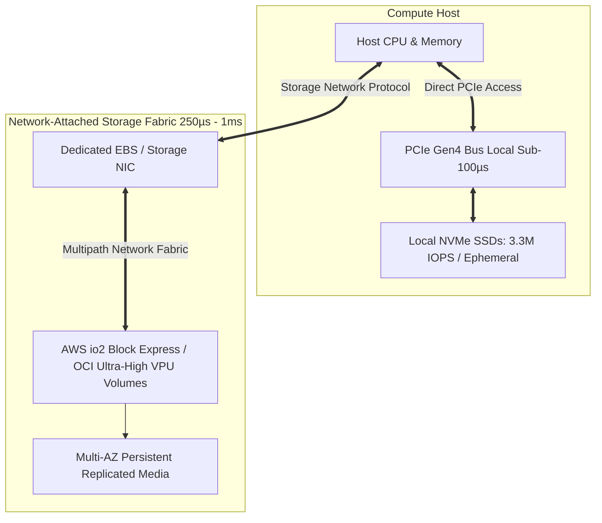

#### AWS Implementation
Automating the formatting, software RAID-0 striping, and kernel I/O tuning of AWS EC2 local NVMe instance store volumes in bash/cloud-init: [Doc: AWS EC2 Instance Store NVMe Tuning, checked 2026].

```bash
#!/usr/bin/env bash
# optimize-aws-nvme.sh: Configure high-throughput local NVMe storage
set -euo pipefail

echo "[1/4] Discovering AWS local NVMe instance store devices..."
# Local instance storage NVMe drives are identified by Model Number
DEVICES=$(nvme list | grep "Amazon EC2 NVMe Instance Storage" | awk '{print $1}')
DEV_COUNT=$(echo "$DEVICES" | wc -l)

echo "Found $DEV_COUNT local NVMe drives: $DEVICES"

if [ "$DEV_COUNT" -eq 0 ]; then
  echo "No local NVMe drives detected. Exiting."
  exit 0
fi

# Step 2: Build Software RAID-0 across all NVMe drives for aggregate IOPS
RAID_DEV="/dev/md0"
MOUNT_POINT="/mnt/high-perf-nvme"

if [ ! -b "$RAID_DEV" ]; then
  echo "[2/4] Creating RAID-0 array with 256K chunk size across $DEV_COUNT drives..."
  mdadm --create "$RAID_DEV" --level=0 --raid-devices="$DEV_COUNT" --chunk=256 $DEVICES
fi

# Step 3: Format with XFS optimized for parallel SSD allocation groups
echo "[3/4] Formatting $RAID_DEV with XFS..."
mkfs.xfs -f -s size=4096 -d agcount=32 "$RAID_DEV"

mkdir -p "$MOUNT_POINT"
# Mount with noatime and discard/TRIM enabled
mount -o noatime,nodiratime,logbufs=8,logbsize=256k,largeio,inode64,allocsize=64M "$RAID_DEV" "$MOUNT_POINT"
chmod 777 "$MOUNT_POINT"

# Step 4: Set kernel I/O scheduler to 'none' for zero queue latency
for dev in $DEVICES; do
  DEV_BASE=$(basename "$dev")
  echo "none" > "/sys/block/${DEV_BASE}/queue/scheduler"
  echo "1024" > "/sys/block/${DEV_BASE}/queue/nr_requests"
done

echo "[SUCCESS] NVMe RAID-0 storage initialized at $MOUNT_POINT with line-rate performance."
```

#### OCI Implementation
Terraform configuration provisioning an OCI Ultra High-Performance Block Volume with 50 Volume Performance Units (VPUs) delivering up to 300,000 IOPS: [Doc: OCI Block Volume Performance Units (VPUs), checked 2026].

```hcl
# Ultra High-Performance Block Volume (50 VPUs/GB)
resource "oci_core_volume" "ultra_perf_volume" {
  compartment_id      = var.compartment_id
  availability_domain = var.ad
  display_name        = "db-ultra-perf-data"
  size_in_gbs         = 2000 # 2 TB volume

  # 50 VPUs per GB achieves maximum possible OCI IOPS & throughput
  vpus_per_gb = 50

  autotune_policies {
    autotune_type = "DETACHED_VOLUME"
  }
}

# Attach volume via multipath Paravirtualized or iSCSI interface
resource "oci_core_volume_attachment" "volume_attachment" {
  attachment_type = "iscsi"
  instance_id     = var.instance_ocid
  volume_id       = oci_core_volume.ultra_perf_volume.id
  is_read_only    = false
  is_shareable    = false
  use_chap        = true

  # Enable multipathing for higher throughput and failover redundancy
  is_multipath = true
}
```

OCI kernel tuning for multipath iSCSI block storage:
```bash
# Set iSCSI queue depth and timeout optimization
iscsiadm -m node -T <target-iqn> -p <target-ip>:3260 -o update -n node.session.queue_depth -v 128
systemctl restart iscsid
```

#### Common Trap
Using local NVMe instance store volumes for primary database storage without application-level replication. When an engineer stops an AWS EC2 instance (`aws ec2 stop-instances`), the instance is unallocated from the physical hypervisor, and all local NVMe SSDs are cryptographically erased! If an autonomous cluster recovery script restarts the instance on a new host, the database directory is empty. Local NVMe storage must only be used with distributed databases that replicate across independent physical nodes (e.g., Cassandra, ScyllaDB, CockroachDB, Kafka) or for volatile caching.

#### Follow-up Question
How does OCI's Volume Performance Unit (VPU) model differ from AWS EBS provisioned IOPS (io2)?

*Answer*: In AWS, storage capacity and IOPS are billed as separate, decoupled line items (paying per GB-month *plus* per provisioned IOPS-month). In OCI, performance is governed by an elastic slider called VPUs (ranging from 0 for Lower Cost, 10 for Balanced, 20 for Higher Performance, up to 120 for Ultra High Performance). Each VPU tier automatically scales both IOPS and MB/s throughput linearly per GB of storage, and performance tiers can be dynamically adjusted online without detaching the volume or paying punitive per-IOPS surcharges.

---

### Q478: Linux Kernel and TCP Network Stack Tuning for High-Concurrency Cloud Workloads

#### Question
What kernel parameters, TCP socket buffers, and network queuing settings in Linux `/etc/sysctl.conf` must be tuned to support 100,000+ concurrent connections without SYN flooding, socket exhaustion, or latency jitter?

#### Short Answer
Default Linux kernel configurations are optimized for general-purpose desktop and low-concurrency server workloads (e.g., connection backlogs capped at 128, file descriptor limits at 1024, and tiny TCP read/write memory buffers). High-concurrency cloud environments (API gateways, reverse proxies, ingress controllers) crash under production traffic with errors like `connection reset by peer`, `SYN floods`, or `TIME_WAIT bucket table overflow`. To support $100,000+$ concurrent connections: (1) Expand system file descriptors (`fs.file-max`); (2) Increase socket backlog queues (`net.core.somaxconn` and `net.ipv4.tcp_max_syn_backlog`); (3) Tune TCP receive/send window buffers (`rmem`/`wmem`); (4) Enable TCP connection reuse (`tcp_tw_reuse`); and (5) Use modern queueing disciplines (`fq`) paired with **BBR congestion control**.

#### Deep Answer
Under high traffic volumes, Linux systems fail at specific network stack layer boundaries:

1. **The Three-Way Handshake Queues**:
   - **SYN Queue (`net.ipv4.tcp_max_syn_backlog`)**: Holds half-open connections (client sent SYN, server replied SYN-ACK, awaiting client ACK). Default: 128 or 512. Under bursty traffic, this overflows, causing the kernel to drop incoming connection attempts. Scale to `65535`.
   - **Accept Queue (`net.core.somaxconn`)**: Holds fully established connections awaiting application `accept()` syscalls (e.g., NGINX/Envoy worker processes). Default: 128. If NGINX is momentarily busy, incoming connections are dropped. Scale to `65535`.

2. **Socket Buffer Memory Allocation**:
   - `net.ipv4.tcp_rmem` and `net.ipv4.tcp_wmem`: Defines `min`, `default`, and `max` buffer size in bytes for TCP receive and transmit windows.
   - For high-bandwidth-delay product (BDP) networks (100 Gbps cross-region links), buffer maximums must be increased to 16MB or 32MB:
     `net.ipv4.tcp_rmem = 4096 87380 33554432`
     `net.ipv4.tcp_wmem = 4096 65536 33554432`

3. **Managing `TIME_WAIT` Socket Exhaustion**:
   - When a reverse proxy closes backend HTTP/1.1 connections, the socket enters `TIME_WAIT` for $2 \times \text{MSL}$ (60 seconds).
   - If an edge proxy opens 1,000 connections/sec, all ephemeral ports (c. 60,000 ports defined in `net.ipv4.ip_local_port_range`) are consumed within 60 seconds, halting all outbound connections with `EADDRNOTAVAIL`.
   - *Fix*: Enable `net.ipv4.tcp_tw_reuse = 1` allowing the kernel to safely reallocate `TIME_WAIT` sockets for outgoing connections using RFC 1323 timestamps.

4. **Modern Congestion Control (BBR vs Cubic)**:
   - Default Linux congestion control (**CUBIC**) interprets packet loss as congestion, cutting throughput drastically when traversing long-distance cloud networks with 0.1% packet loss.
   - Google's **BBR (Bottleneck Bandwidth and RTT)** optimizes throughput based on real-time bandwidth and round-trip time modeling, maintaining line-rate speeds even over lossy transatlantic links.

#### Architecture
```mermaid
graph TD
    Client[Client Browser / Service] -->|1. SYN Packet| SYNQ[SYN Backlog Queue: tcp_max_syn_backlog 65535]
    SYNQ -->|2. Server SYN-ACK| Client
    Client -->|3. Client ACK| AcceptQ[Accept Backlog Queue: somaxconn 65535]
    AcceptQ -->|4. Syscall accept()| App[Application Worker: NGINX / Envoy]
    
    subgraph Kernel Memory Subsystem
        App --> Socket[Socket Buffer: tcp_rmem / tcp_wmem up to 32MB]
        Socket --> BBR[Congestion Control: BBR + FQ Pacing]
        BBR --> NIC[Physical NIC Hardware Queues]
    end
```

#### AWS Implementation
A production `/etc/sysctl.d/99-high-performance-network.conf` file deployed across AWS EC2 web tier and API gateway nodes: [Doc: AWS Linux Performance Tuning Guide, checked 2026].

```ini
# /etc/sysctl.d/99-high-performance-network.conf
# System-wide file descriptor ceiling (10M files)
fs.file-max = 10485760
fs.nr_open = 10485760

# Max socket connection backlog queues
net.core.somaxconn = 65535
net.ipv4.tcp_max_syn_backlog = 65535
net.core.netdev_max_backlog = 65535

# Expand ephemeral port range for massive outbound reverse-proxying
net.ipv4.ip_local_port_range = 1024 65535

# Enable safe reuse of TIME_WAIT sockets for outgoing connections
net.ipv4.tcp_tw_reuse = 1
net.ipv4.tcp_fin_timeout = 15

# Maximum number of TIME_WAIT sockets held simultaneously
net.ipv4.tcp_max_tw_buckets = 2000000

# TCP Socket buffer auto-tuning limits (min, default, max in bytes)
net.core.rmem_max = 33554432
net.core.wmem_max = 33554432
net.ipv4.tcp_rmem = 4096 87380 33554432
net.ipv4.tcp_wmem = 4096 65536 33554432

# Enable TCP BBR Congestion Control paired with Fair Queuing (FQ)
net.core.default_qdisc = fq
net.ipv4.tcp_congestion_control = bbr

# Enable TCP Fast Open for client and server sockets
net.ipv4.tcp_fastopen = 3

# Disable slow start restart after idle period
net.ipv4.tcp_slow_start_after_idle = 0
```

Apply parameters dynamically without reboot:
```bash
sudo sysctl --system
```

#### OCI Implementation
Automated shell script configuring network interface ring buffers, interrupt handling (IRQ affinity), and sysctl parameters on an OCI Compute instance: [Doc: OCI Compute OS Performance Tuning, checked 2026].

```bash
#!/usr/bin/env bash
# oci-tune-kernel-network.sh: Optimize OCI Compute NIC and Kernel Networking
set -euo pipefail

echo "[1/3] Maximizing physical NIC ring buffer descriptors..."
# Detect primary network interface
IFACE=$(ip -o -4 route show to default | awk '{print $5}')
echo "Configuring Interface: $IFACE"

# Query maximum supported RX/TX ring sizes
MAX_RX=$(ethtool -g "$IFACE" | grep -m 1 "RX:" | awk '{print $2}')
MAX_TX=$(ethtool -g "$IFACE" | grep -m 1 "TX:" | awk '{print $2}')

# Set ring buffers to maximum capacity to prevent packet drops during micro-bursts
ethtool -G "$IFACE" rx "$MAX_RX" tx "$MAX_TX" || true

echo "[2/3] Enabling multi-queue interrupt affinity..."
# Enable receive-side scaling (RSS) across all available CPU cores
systemctl enable --now irqbalance

echo "[3/3] Deploying high-throughput OCI kernel network profile..."
cat << 'EOF' > /etc/sysctl.d/98-oci-networking.conf
net.core.somaxconn = 65535
net.ipv4.tcp_max_syn_backlog = 65535
net.core.netdev_max_backlog = 65535
net.ipv4.tcp_tw_reuse = 1
net.ipv4.tcp_fin_timeout = 15
net.ipv4.ip_local_port_range = 1024 65535
net.core.rmem_max = 33554432
net.core.wmem_max = 33554432
net.ipv4.tcp_rmem = 4096 87380 33554432
net.ipv4.tcp_wmem = 4096 65536 33554432
net.core.default_qdisc = fq
net.ipv4.tcp_congestion_control = bbr
EOF

sysctl -p /etc/sysctl.d/98-oci-networking.conf
echo "[SUCCESS] Kernel parameters applied successfully on OCI Compute."
```

#### Common Trap
Enabling `net.ipv4.tcp_tw_recycle = 1` in cloud environments. While `tcp_tw_recycle` aggressively purges sockets in `TIME_WAIT`, it relies on monotonically increasing TCP timestamps per IP address. In cloud architectures, thousands of external client devices connect through corporate NAT gateways or Cloud Load Balancers sharing a single IP. Because different client devices have unsynchronized clock timestamps, the kernel perceives incoming packets with lower timestamps as duplicate replay attacks and drops them silently! This causes random connection dropouts for mobile and corporate users. `tcp_tw_recycle` was completely removed in Linux 4.12+; always use `tcp_tw_reuse = 1` instead.

#### Follow-up Question
Why is increasing `net.core.somaxconn` in `/etc/sysctl.conf` insufficient on its own if application configurations are not updated?

*Answer*: When an application (such as NGINX or Node.js) opens a listening socket, it invokes the `listen(sockfd, backlog)` system call. If the application configuration specifies a low backlog (e.g., NGINX default `listen 80 backlog=511;`), the kernel caps the listen queue to `min(backlog, somaxconn)`. To realize the full benefit of kernel tuning, the application's configuration directive must be explicitly raised to match or exceed `somaxconn` (e.g., `listen 80 backlog=65535;`).

---

### Q479: Database Query Performance Optimization and Connection Pooling

#### Question
How do connection pool architectures (such as PgBouncer, AWS RDS Proxy, and OCI Autonomous Database Connection Pools) mitigate database CPU starvation, eliminate connection latency overhead, and optimize transaction throughput?

#### Short Answer
Relational databases (PostgreSQL, MySQL, Oracle) allocate dedicated backend OS processes or heavy threads for each open client connection, consuming 5–10 MB of RAM per connection and creating severe CPU context-switching overhead when thousands of microservices connect concurrently. Beyond 200–500 active server-side connections, database throughput collapses. **Connection Pooling** sits between applications and the database: it maintains a small pool of persistent, pre-warmed database connections (e.g., 50–100) and multiplexes thousands of ephemeral client connections onto them. **AWS RDS Proxy** and **PgBouncer** implement transaction-level pooling, reducing connection setup latency from 30ms to $< 1\text{ms}$ while shielding databases from connection spikes.

#### Deep Answer
In modern serverless (AWS Lambda / OCI Functions) and microservice architectures, connection management is the primary scalability hurdle:

1. **The Fork/Thread Connection Overhead**:
   - In PostgreSQL, every new connection triggers a `fork()` call, spawning a new backend process that allocates memory (`work_mem`, catalog caches).
   - In AWS Lambda, 2,000 concurrent function invocations attempt to open 2,000 independent database connections within milliseconds.
   - Result: Database runs out of memory (`max_connections` reached), CPU spends 90% of cycles on process scheduler context-switching, and application requests fail with `FATAL: remaining connection slots are reserved`.

2. **Pooling Modes**:
   - **Session Pooling**: A client leases a physical connection for the entire duration of its TCP session. Offers minimal concurrency improvement for serverless.
   - **Transaction Pooling (Recommended)**: A client acquires a physical connection *only* for the lifespan of a single transaction (`BEGIN` ... `COMMIT`). Once the transaction commits, the physical connection is immediately returned to the pool to serve another waiting microservice thread.
   - **Statement Pooling**: Leases connections per SQL statement. Breaks multi-statement transactions; rarely used.

3. **Managed Cloud Proxies (AWS RDS Proxy & OCI)**:
   - **AWS RDS Proxy**: Fully managed, autoscaling proxy for Aurora/RDS. Pins connections intelligently, integrates natively with AWS Secrets Manager, and drastically reduces failover recovery time: during an Aurora Multi-AZ failover, RDS Proxy holds incoming client queries in a buffer for up to 15 seconds instead of dropping connections, reducing application-visible failover errors by up to 66%.
   - **OCI Database Connection Manager (CMAX) / Autonomous Database DRCP**: Uses Database Resident Connection Pooling (DRCP) inside the Oracle Database kernel, scaling to 100,000+ client sessions across a tiny shared server pool.

#### Architecture
```mermaid
graph TD
    subgraph Serverless & Autoscaling App Tier
        L1[Lambda / Pod 1]
        L2[Lambda / Pod 2]
        L3[Lambda / Pod 3]
        L1000[Lambda / Pod 1000...]
    end

    subgraph Connection Pooling Layer
        Proxy[AWS RDS Proxy / PgBouncer / OCI DRCP]
        Queue[Client Connection Queue: Holds 10,000 requests]
        WarmPool[Pre-Warmed Pool: 50 Shared Physical Connections]
    end

    subgraph Relational Database Tier
        DB[(AWS Aurora PostgreSQL / OCI Autonomous Database)]
    end

    L1 -->|1. Connect in <1ms| Proxy
    L2 --> Proxy
    L3 --> Proxy
    L1000 --> Proxy

    Proxy --> Queue
    Queue --> WarmPool
    WarmPool <==>|Multiplexed Transactions over 50 Connections| DB
    Note over DB: CPU Context-Switching Capped at Zero!
```

#### AWS Implementation
Terraform configuration provisioning an AWS RDS Proxy for an Amazon Aurora PostgreSQL cluster with IAM authentication: [Doc: AWS RDS Proxy Configuration, checked 2026].

```hcl
# AWS RDS Proxy for Aurora PostgreSQL
resource "aws_db_proxy" "aurora_proxy" {
  name                   = "aurora-production-proxy"
  debug_logging          = false
  engine_family          = "POSTGRESQL"
  idle_client_timeout    = 1800 # 30 minutes
  require_tls            = true
  role_arn               = aws_iam_role.proxy_iam_role.arn
  vpc_subnet_ids         = var.database_subnet_ids
  vpc_security_group_ids = [aws_security_group.proxy_sg.id]

  auth {
    auth_scheme = "SECRETS"
    description = "Master database credentials from Secrets Manager"
    iam_auth    = "REQUIRED" # Enforce IAM authentication from Lambdas/ECS
    secret_arn  = aws_secretsmanager_secret.db_secret.arn
  }

  tags = {
    Environment = "Production"
  }
}

# Link Proxy to Aurora DB Cluster Target Group
resource "aws_db_proxy_default_target_group" "aurora_tg" {
  db_proxy_name = aws_db_proxy.aurora_proxy.name

  connection_pool_config {
    connection_borrow_timeout    = 120
    max_connections_percent      = 90  # Pool consumes up to 90% of Aurora max_connections
    max_idle_connections_percent = 50
  }
}

resource "aws_db_proxy_target" "aurora_target" {
  db_proxy_name         = aws_db_proxy.aurora_proxy.name
  target_group_name     = aws_db_proxy_default_target_group.aurora_tg.name
  db_cluster_identifier = aws_rds_cluster.aurora_prod.id
}
```

#### OCI Implementation
Configuring Database Resident Connection Pooling (DRCP) and client connection strings on an OCI Autonomous Database: [Doc: OCI Autonomous Database Connection Pooling & DRCP, checked 2026].

```sql
-- Enable and tune Database Resident Connection Pooling (DRCP) in Oracle Database
BEGIN
  DBMS_CONNECTION_POOL.CONFIGURE_POOL(
    pool_name             => 'DEFAULT_CONNECTION_POOL',
    minsize               => 10,     -- Minimum pre-warmed physical server connections
    maxsize               => 100,    -- Maximum physical connections allowed to database
    incrsize              => 5,      -- Expansion step
    session_cached_cursors=> 50,
    max_idle_time         => 300,    -- Terminate idle pooled servers after 5 mins
    max_think_time        => 60      -- Maximum wait between client calls
  );
  
  -- Start the shared pool engine
  DBMS_CONNECTION_POOL.START_POOL('DEFAULT_CONNECTION_POOL');
END;
/
```

OCI application connection string using the DRCP pooled server syntax:
```ini
# tnsnames.ora / Connection descriptor utilizing DRCP
prodatp_pool =
  (DESCRIPTION =
    (ADDRESS = (PROTOCOL = TCP)(HOST = adb.us-ashburn-1.oraclecloud.com)(PORT = 1522))
    (CONNECT_DATA =
      (SERVER = POOLED) # Directs request to Database Resident Connection Pool
      (SERVICE_NAME = xxxxx_prodatp_high.adb.oraclecloud.com)
    )
    (SECURITY = (SSL_SERVER_CERT_DN = "CN=adbc.oraclecloud.com"))
  )
```

#### Common Trap
Using Transaction Pooling with applications that rely on **Session-State Constructs** (e.g., PostgreSQL `SET timezone = ...`, prepared statements with `DEALLOCATE ALL`, temporary tables `CREATE TEMP TABLE`, or advisory locks). In transaction pooling mode, subsequent SQL statements in a new transaction may be dispatched across a completely different physical database connection. If the code assumed that session-level temporary tables or variables persisted across transactions, queries will silently return invalid results or throw errors. Session-level variables must either be avoided or configured with connection reset scripts (`DISCARD ALL`).

#### Follow-up Question
How does RDS Proxy handle "Connection Pinning", and what triggers it?

*Answer*: Connection Pinning occurs when an application executes an operation that binds the client session permanently to a single physical database connection, temporarily disabling transaction pooling benefits. Common pinning triggers include executing `LISTEN`/`NOTIFY` commands, creating temporary tables, altering session parameters via `SET`, or using prepared statements without proper query parameterization.

---

### Q480: Global Traffic Acceleration and Edge Optimization (Anycast & CDNs)

#### Question
How do Anycast IP routing, Content Delivery Networks (AWS CloudFront vs OCI Web Application Acceleration), and Layer-4 Global Traffic Accelerators (AWS Global Accelerator vs OCI FastConnect Anycast) optimize round-trip time (RTT) for worldwide users?

#### Short Answer
Standard internet routing over public BGP involves multiple non-optimal autonomous system (AS) hops, asymmetric routes, and packet loss across public internet exchanges. **Global Traffic Accelerators** (AWS Global Accelerator, OCI Anycast) assign static Anycast IP addresses announced globally from dozens of Edge Points of Presence (PoPs). Client TCP packets ingress the cloud provider's private, congestion-free fiber backbone at the nearest edge PoP, traversing high-speed private optics to the application origin with sub-second path convergence and up to 60% latency reduction. **CDNs** (CloudFront / OCI WAA) operate at Layer 7, terminating TLS at the edge and caching static/dynamic content locally.

#### Deep Answer
Optimizing global user latency requires addressing the physics of the speed of light in fiber optic cables:

1. **Public Internet Routing vs Cloud Backbone Routing**:
   - *Public Internet (BGP)*: Packet routes are determined by commercial peering agreements (hot-potato routing), not latency. A user in Tokyo calling an API in Ireland might traverse 18 router hops across 4 transit providers, encountering queue delays and route flapping.
   - *Anycast Global Accelerators (Layer 4)*:
     - The user connects to a static Anycast IP (e.g., `1.2.3.4`) hosted simultaneously across 100+ global edge locations.
     - The user's local ISP routes to the geographically closest cloud edge PoP in 5–10ms.
     - The edge PoP terminates the TCP connection immediately (TCP connection establishment in 10ms instead of 250ms transatlantic RTT).
     - Traffic is tunneled across the cloud provider's private, dedicated fiber backbone to the target ALB or Compute instance.

2. **Layer 4 Acceleration vs Layer 7 CDN Caching**:
   - **Layer 7 CDNs (AWS CloudFront / OCI WAA / Fastly)**:
     - Best for HTTP/HTTPS static content (images, JS, videos) and edge computing (CloudFront Functions / Lambda@Edge).
     - Caches responses at edge locations, eliminating origin roundtrips entirely for cache hits.
   - **Layer 4 Accelerators (AWS Global Accelerator)**:
     - Best for non-HTTP protocols (gaming UDP, VoIP, WebSockets, MQTT IoT, financial protocols).
     - Does **not** cache content; provides zero-latency transport acceleration and provides static, deterministic Anycast IP addresses that never change during regional failovers.

3. **Instant Regional Failover**:
   - Global Accelerators continuously monitor regional endpoint health via synthetic HTTP/TCP probes.
   - If Region A (`us-east-1`) suffers an outage, the Anycast edge network redirects traffic to Region B (`eu-central-1`) within $< 10$ seconds without waiting for client DNS cache TTL expiration.

#### Architecture
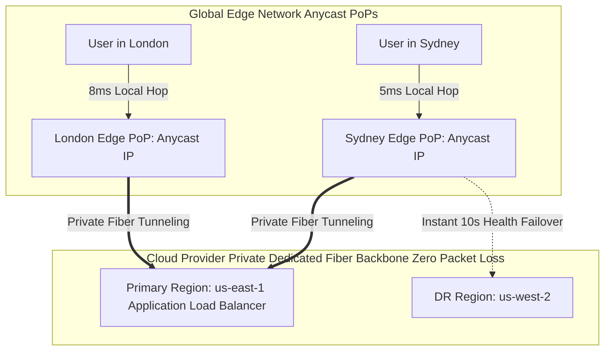

#### AWS Implementation
Terraform configuration provisioning an AWS Global Accelerator with Anycast static IPs and multi-region weighted endpoints: [Doc: AWS Global Accelerator Configuration, checked 2026].

```hcl
# Standard Global Accelerator with static Anycast IPs
resource "aws_global_accelerator_accelerator" "global_app" {
  name            = "production-global-accelerator"
  ip_address_type = "IPV4"
  enabled         = true
}

# Listener routing TCP traffic on port 443
resource "aws_global_accelerator_listener" "https_listener" {
  accelerator_arn = aws_global_accelerator_accelerator.global_app.id
  client_affinity = "SOURCE_IP" # Sticky Anycast routing
  protocol        = "TCP"

  port_range {
    from_port = 443
    to_port   = 443
  }
}

# Endpoint Group 1: US-East-1 (Primary Weight: 100)
resource "aws_global_accelerator_endpoint_group" "us_east_group" {
  listener_arn          = aws_global_accelerator_listener.https_listener.id
  endpoint_group_region = "us-east-1"
  traffic_dial_percentage = 100

  health_check_interval_seconds = 10
  health_check_path             = "/healthz"
  health_check_protocol         = "HTTPS"
  threshold_count               = 2

  endpoint_configuration {
    endpoint_id = var.us_east_alb_arn
    weight      = 100
  }
}

# Endpoint Group 2: EU-West-1 (Secondary / DR Region)
resource "aws_global_accelerator_endpoint_group" "eu_west_group" {
  listener_arn          = aws_global_accelerator_listener.https_listener.id
  endpoint_group_region = "eu-west-1"
  traffic_dial_percentage = 100

  health_check_interval_seconds = 10
  health_check_path             = "/healthz"
  health_check_protocol         = "HTTPS"
  threshold_count               = 2

  endpoint_configuration {
    endpoint_id = var.eu_west_alb_arn
    weight      = 100
  }
}

output "accelerator_static_ips" {
  value       = aws_global_accelerator_accelerator.global_app.ip_sets[0].ip_addresses
  description = "Two static Anycast IPs for global DNS routing"
}
```

#### OCI Implementation
Configuring an OCI Web Application Acceleration (WAA) policy and Traffic Management Steering Policy for global edge routing: [Doc: OCI Web Application Acceleration & Traffic Steering, checked 2026].

```hcl
# OCI Web Application Acceleration (WAA) Policy
resource "oci_waa_waa_policy" "edge_acceleration_policy" {
  compartment_id = var.compartment_id
  display_name   = "global-web-acceleration-policy"

  response_caching_policy {
    is_response_caching_enabled = true
  }

  response_compression_policy {
    gzip_compression {
      is_enabled = true
    }
  }
}

# Attach WAA Policy to OCI Load Balancer
resource "oci_waa_app_acceleration" "lb_acceleration" {
  compartment_id = var.compartment_id
  display_name   = "prod-lb-acceleration"
  backend_type   = "LOAD_BALANCER"
  load_balancer_id = var.oci_lb_ocid
  waa_policy_id    = oci_waa_waa_policy.edge_acceleration_policy.id
}

# OCI Traffic Management Steering Policy (Failover across Regions)
resource "oci_dns_steering_policy" "global_failover" {
  compartment_id = var.compartment_id
  display_name   = "global-anycast-failover-policy"
  template       = "FAILOVER"
  ttl            = 30

  answers {
    name = "ashburn-primary"
    rdata = var.ashburn_lb_ip
    pool = "primary-pool"
  }

  answers {
    name = "phoenix-dr"
    rdata = var.phoenix_lb_ip
    pool = "secondary-pool"
  }
}
```

#### Common Trap
Attempting to accelerate static assets using AWS Global Accelerator instead of CloudFront. Global Accelerator does **not** cache files; it transports every single HTTP GET request across the private fiber back to the origin server. For cacheable static assets (images, video chunks, JavaScript bundles), using Global Accelerator results in higher origin load and higher bandwidth costs compared to CloudFront, which serves $>90\%$ of traffic directly from edge SSD caches without touching the origin. Use CloudFront for cacheable Layer 7 web traffic; use Global Accelerator for gaming, raw TCP/UDP, WebSockets, and non-cacheable API acceleration.

#### Follow-up Question
How does TCP termination at the edge reduce latency for users on high-packet-loss networks?

*Answer*: In standard end-to-end TCP, establishing a connection requires a 3-way handshake traversing the full distance between client and origin (e.g., Sydney to Virginia = 200ms). Furthermore, if a packet is lost, the retransmission must travel 200ms across the globe. When an Anycast accelerator terminates TCP at the local edge PoP, the handshake completes locally in 10ms. Retransmissions on lossy cellular networks happen locally between client and edge, while the edge-to-origin link operates over a lossless private backbone with optimized window sizes.

---

### Q481: Multi-Tier Caching Hierarchies and Cache Stampede Prevention

#### Question
How do you architect resilient multi-tier caching architectures (L1 in-process, L2 distributed Redis), and what algorithmic strategies prevent cache stampedes (thundering herds) when critical keys expire under peak load?

#### Short Answer
A multi-tier cache combines an **L1 In-Memory Cache** (e.g., Caffeine in Java, Go `sync.Map`) residing directly inside application RAM ($< 1\text{µs}$ read latency) with an **L2 Distributed Cache** (e.g., Amazon ElastiCache or OCI Cache with Redis, $\sim 1\text{ms}$ latency). When an ultra-hot cache key expires, thousands of concurrent client requests simultaneously miss the cache and hit the database in parallel, triggering a catastrophic **Cache Stampede (Thundering Herd)** that crashes the database. To prevent stampedes, implement: (1) **Mutex Locking (Singleflight Pattern)** where only one worker fetches from the DB while others await the result; (2) **Probabilistic Early Expiration (XFetch Algorithm)**; and (3) **Background Asynchronous Refresh**.

#### Deep Answer
Relying solely on a distributed cache creates operational vulnerabilities: network serialization latency adds up across microservices, and Redis CPU bottlenecks can cause outages.

**Multi-Tier Caching Architecture (L1 + L2)**:
1. **L1 Local Cache**:
   - Microsecond reads; zero network serialization.
   - *Challenge - Cache Invalidation*: When Instance A updates a database record, Instance B's L1 cache holds stale data.
   - *Solution*: Use **Redis Pub/Sub Invalidation Bus**. When a write occurs, publish an invalidation event (`PUBLISH cache_invalidate "user:101"`). All application pods subscribe and invalidate their local L1 entry.

2. **The Cache Stampede Dynamics**:
   - Consider a flash sale product whose key is cached for 60 seconds with 50,000 requests/sec.
   - At second 60.001, the key expires.
   - For the 200 milliseconds it takes to query the database, calculate inventory, and write back to Redis, $10,000$ incoming requests encounter a cache miss and query the database concurrently, exhausting connection pools and causing an immediate cascading database crash.

3. **Stampede Prevention Algorithms**:
   - **Distributed Mutex Lock (Singleflight)**:
     - The first request to miss acquires an ephemeral distributed lock in Redis: `SET lock:item:101 <UUID> NX PX 3000`.
     - Other concurrent threads see the lock exists and sleep for 50ms before retrying the cache read.
   - **Probabilistic Early Expiration (XFetch Algorithm)**:
     - Formulated by Vattani et al., the client decides to recompute the value *before* it actually expires, based on execution duration ($\delta$), remaining TTL ($\Delta$), and a random variable:
       $$\text{Recompute if: } -\beta \times \delta \times \ln(\text{rand}()) > \Delta$$
     - As TTL approaches zero, the probability of an early refresh approaches 100%. Exactly one background client preemptively refreshes the cache before the key ever expires.

#### Architecture
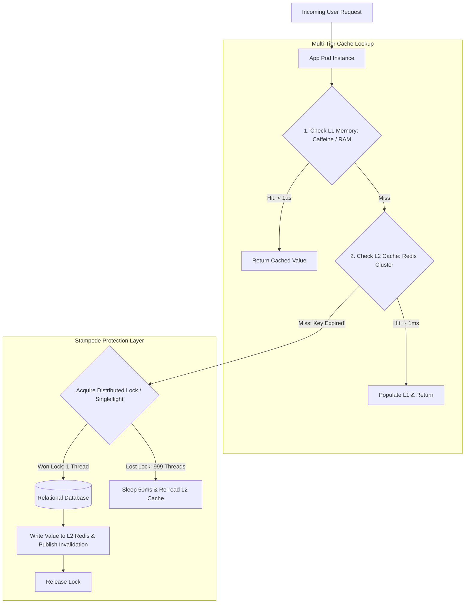

#### AWS Implementation
Production Go implementation of the Singleflight pattern and multi-tier caching (In-Memory + AWS ElastiCache for Redis): [Doc: Amazon ElastiCache Best Practices & Caching Patterns, checked 2026].

```go
// cache_service.go
package main

import (
	"context"
	"fmt"
	"sync"
	"time"

	"github.com/redis/go-redis/v9"
	"golang.org/x/sync/singleflight"
)

type MultiTierCache struct {
	redisClient *redis.ClusterClient
	localCache  sync.Map
	sfGroup     singleflight.Group
}

func (c *MultiTierCache) GetItem(ctx context.Context, itemID string) (string, error) {
	cacheKey := fmt.Sprintf("item:%s", itemID)

	// Tier 1: Check In-Memory Local Cache (< 1µs)
	if val, ok := c.localCache.Load(cacheKey); ok {
		return val.(string), nil
	}

	// Tier 2: Check Distributed ElastiCache Redis (~ 1ms)
	val, err := c.redisClient.Get(ctx, cacheKey).Result()
	if err == nil {
		c.localCache.Store(cacheKey, val) // Populate local L1
		return val, nil
	}

	// Tier 3: Stampede Protection via Singleflight
	// Only ONE concurrent goroutine executes the DB fallback; others wait!
	result, err, _ := c.sfGroup.Do(cacheKey, func() (interface{}, error) {
		// Double-check Redis inside singleflight closure
		val, err := c.redisClient.Get(ctx, cacheKey).Result()
		if err == nil {
			return val, nil
		}

		// Expensive Database Fetch Simulation
		dbVal, err := fetchFromDatabase(itemID)
		if err != nil {
			return nil, err
		}

		// Write to L2 Redis with TTL and jitter
		c.redisClient.Set(ctx, cacheKey, dbVal, 10*time.Minute)
		c.localCache.Store(cacheKey, dbVal)
		return dbVal, nil
	})

	if err != nil {
		return "", err
	}
	return result.(string), nil
}

func fetchFromDatabase(id string) (string, error) {
	time.Sleep(150 * time.Millisecond) // Simulated DB Latency
	return fmt.Sprintf("Data for %s", id), nil
}
```

#### OCI Implementation
Terraform configuration provisioning an OCI Cache with Redis cluster and Lua script implementing the XFetch probabilistic refresh algorithm: [Doc: OCI Cache with Redis & Lua Scripting, checked 2026].

```hcl
# OCI Cache with Redis Cluster
resource "oci_redis_redis_cluster" "app_cache" {
  compartment_id     = var.compartment_id
  display_name       = "prod-app-redis-cluster"
  node_count         = 3
  node_memory_in_gbs = 16
  subnet_id          = var.private_subnet_ocid

  software_version = "REDIS_7_0"
}
```

Lua script executed atomically inside OCI Cache with Redis evaluating the XFetch algorithm:
```lua
-- xfetch.lua: Probabilistic Early Expiration Cache Pattern
-- KEYS[1]: Cache Key, ARGV[1]: Beta parameter (e.g. 1.0), ARGV[2]: Delta computation time in ms
local key = KEYS[1]
local beta = tonumber(ARGV[1]) or 1.0
local delta = tonumber(ARGV[2]) or 100

local data = redis.call('HMGET', key, 'value', 'ttl_expiry')
local value = data[1]
local expiry = tonumber(data[2])

if not value or not expiry then
    return nil -- Hard cache miss
end

local now = redis.call('TIME')[1] * 1000
local time_remaining = expiry - now

-- Evaluate XFetch formula: -beta * delta * ln(rand())
math.randomseed(now)
local random_val = math.random()
local threshold = -beta * delta * math.log(random_val)

if threshold > time_remaining then
    -- Signal application to recompute in background before actual expiration!
    return {value, "RECOMPUTE"}
else
    return {value, "OK"}
end
```

#### Common Trap
Configuring multi-tier caching with a static TTL across all instances without **TTL Jitter**. If 10,000 product categories are loaded during a morning batch refresh with an exact TTL of `3600` seconds, all 10,000 cache keys will expire simultaneously at second 3,600. Even with Singleflight protection, 10,000 distinct singleflight database queries will fire simultaneously, causing CPU spikes. Always inject randomized TTL jitter: `ttl = base_ttl + random_between(-300, 300)`.

#### Follow-up Question
Why is the In-Memory L1 cache dangerous in autoscaling environments without a cross-node invalidation bus?

*Answer*: In an autoscaled cluster of 50 pods, each pod maintains its own private L1 RAM cache. If a user updates their profile on Pod A, Pod A updates the database and its own local L1 cache. However, Pods B through 50 still hold the old profile in RAM. If subsequent user requests load-balance across Pod B or C, the user sees stale data or phantom rollbacks until the local L1 TTL expires. An invalidation bus (Redis Pub/Sub or Kafka) is mandatory to broadcast evictions cluster-wide.

---

### Q482: Compute Sizing and Architectural Trade-offs (ARM Graviton vs x86 AMD/Intel)

#### Question
What are the architectural trade-offs, price-performance metrics, and compilation dependencies when migrating enterprise cloud workloads from legacy x86 (Intel Xeon / AMD EPYC) to ARM-based cloud processors (AWS Graviton3/4 vs OCI Ampere Altra)?

#### Short Answer
ARM-based cloud processors (AWS Graviton3/4, OCI Ampere Altra) deliver up to **40% better price-performance** and 20–30% higher power efficiency than equivalent x86 (Intel Xeon / AMD EPYC) instances. Unlike x86 architectures that rely on hyper-threading (where two virtual vCPUs share physical core ALUs and L1/L2 caches), OCI Ampere Altra and AWS Graviton allocate **one physical hardware core per vCPU/OCPU** with dedicated L1/L2 caches, eliminating noisy neighbor cache thrashing and yielding deterministic performance. Migrating requires multi-architecture container builds (`linux/arm64`), compiling native C/C++ dependencies for aarch64, and validating JVM/Go runtime optimizations.

#### Deep Answer
Migrating compute workloads from x86 to ARM represents the single largest architectural cost-reduction opportunity in cloud engineering:

**Architectural Differences: Simultaneous Multi-Threading (SMT) vs Single-Threaded Cores**:
- *x86 Hyper-Threading (Intel Xeon / AMD EPYC)*:
  - An instance with 4 vCPUs actually possesses 2 physical cores split into 4 hardware execution threads.
  - If Thread 1 is executing heavy floating-point or cryptography calculations, Thread 2's instructions stall awaiting execution units.
  - SMT introduces side-channel vulnerabilities (Spectre/Meltdown) that require CPU microcode mitigations that degrade performance.
- *Cloud ARM Architecture (AWS Graviton / OCI Ampere Altra)*:
  - **Zero SMT**: 1 vCPU = 1 dedicated physical core.
  - Every core possesses its own private, non-shared 64 KB L1 instruction/data cache and 1 MB or 2 MB private L2 cache.
  - Predictable execution: zero thread contention or cache contention from sibling threads.

**Workload Suitability**:
- *Ideal for ARM*: Containerized microservices (Go, Python, Node.js, Java 17+), Redis/Memcached, Elasticsearch/OpenSearch, video encoding, web servers (NGINX/Envoy).
- *Challenges for ARM*: Proprietary legacy third-party commercial off-the-shelf (COTS) binaries compiled exclusively for x86; software relying on x86-specific SIMD instruction sets (AVX-512) without ARM NEON/SVE equivalents.

**OCI Ampere Altra Pricing Advantage**:
- OCI charges a flat \$0.01 per OCPU hour and \$0.0015 per GB RAM hour for Ampere A1 shapes. An 8-core, 32 GB RAM instance costs $\approx \$70/\text{month}$, compared to $>\$180/\text{month}$ for equivalent x86 instances.

#### Architecture
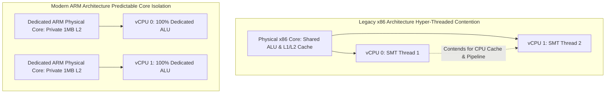

#### AWS Implementation
Terraform configuration deploying an AWS ECS service on AWS Graviton3 (c7g.xlarge) utilizing multi-architecture container images: [Doc: AWS Graviton Performance & Architecture, checked 2026].

```hcl
# ECS Task Definition configured for 64-bit ARM architecture
resource "aws_ecs_task_definition" "graviton_app" {
  family                   = "order-processing-graviton"
  network_mode             = "awsvpc"
  requires_compatibilities = ["FARGATE"]
  cpu                      = "2048"
  memory                   = "4096"

  # Enforce ARM64 CPU Architecture on Fargate
  runtime_platform {
    cpu_architecture        = "ARM64"
    operating_system_family = "LINUX"
  }

  container_definitions = jsonencode([
    {
      name      = "order-service"
      image     = "112233445566.dkr.ecr.us-east-1.amazonaws.com/order-service:v2.0.0-arm64"
      essential = true
      portMappings = [{ containerPort = 8080 }]
      environment = [
        # JVM optimizations specifically for ARM Neoverse cores
        { name = "JAVA_TOOL_OPTIONS", value = "-XX:+UseG1GC -XX:+UseStringDeduplication" }
      ]
    }
  ])
}

# EC2 Autoscaling Launch Template for Graviton3 c7g instances
resource "aws_launch_template" "graviton_lt" {
  name_prefix   = "graviton3-fleet-"
  image_id      = "ami-0c7217cdde317cfec" # Amazon Linux 2023 ARM64 AMI
  instance_type = "c7g.2xlarge"           # Graviton3 processor

  vpc_security_group_ids = [var.app_security_group_id]
}
```

Docker Buildx command building multi-arch containers for x86 and ARM64:
```bash
docker buildx build \
  --platform linux/amd64,linux/arm64 \
  -t 112233445566.dkr.ecr.us-east-1.amazonaws.com/order-service:v2.0.0 \
  --push .
```

#### OCI Implementation
Terraform configuration provisioning an OCI Compute instance using Ampere Altra A1 Flex shape with custom core/memory ratios: [Doc: OCI Ampere Altra A1 Compute Architecture, checked 2026].

```hcl
# OCI Ampere A1 Flex Instance (ARM Neoverse N1 cores)
resource "oci_core_instance" "ampere_node" {
  compartment_id      = var.compartment_id
  availability_domain = var.ad
  display_name        = "prod-ampere-microservice-node"
  shape               = "VM.Standard.A1.Flex"

  # Tailor exact core and memory requirements with zero wasted resources
  shape_config {
    ocpus         = 8   # 8 Dedicated Physical ARM Cores
    memory_in_gbs = 48  # 48 GB RAM (6 GB per core)
  }

  source_details {
    source_type = "image"
    image_id    = var.oracle_linux_arm64_image_ocid
  }

  create_vnic_details {
    subnet_id        = var.private_subnet_ocid
    assign_public_ip = false
  }

  metadata = {
    ssh_authorized_keys = file("~/.ssh/id_rsa.pub")
  }
}
```

#### Common Trap
Deploying Java applications on ARM processors using legacy Java versions (Java 8 or early Java 11 builds). Early Java runtimes lacked intrinsic optimizations for ARM NEON and LSE (Large System Extensions) atomics, causing Java on ARM to run up to 30% slower than on x86. Modern production deployments must standardize on **Java 17 or Java 21 LTS** (e.g., Amazon Corretto or Oracle OpenJDK), which includes deeply optimized ARM64 JIT compilers and G1/ZGC garbage collection barriers.

#### Follow-up Question
How do you test and validate whether a Python or Node.js application containing native C bindings will run on ARM64 without setting up physical ARM hardware?

*Answer*: Using QEMU user-mode emulation with Docker Buildx. By executing `docker run --rm --privileged multiarch/qemu-user-static --reset -p yes`, developer laptops and x86 CI/CD runners can execute and test `linux/arm64` container images locally via instruction translation before pushing to production registries.

---

### Q483: Asynchronous Event-Driven Architectures for Maximum Request Throughput

#### Question
How do asynchronous event-driven decoupling patterns (buffering, load leveling, and event sourcing via AWS SQS/Kinesis and OCI Streaming) prevent cascading failures and maintain high throughput during massive traffic surges?

#### Short Answer
Synchronous request-response architectures (REST/gRPC) couple services across a fragile execution chain: if an upstream service receives a $10\times$ traffic surge, downstream databases and third-party APIs become saturated, exhausting thread pools and causing cascading outages across the entire platform. **Asynchronous Load Leveling** places a distributed queue or log-based streaming buffer (AWS SQS, Apache Kafka, OCI Streaming) between the ingest API and processing workers. The ingest tier simply validates and enqueues messages at line-rate ($> 100,000\text{ req/sec}$ in milliseconds), while downstream workers pull and process tasks at a sustainable, rate-limited pace without overwhelming backends.

#### Deep Answer
Synchronous systems suffer from temporal coupling: Service A cannot complete its transaction until Service B, Service C, and the payment gateway return HTTP 200.

**Core Patterns of Event-Driven Throughput**:

1. **Queue-Based Load Leveling (Buffer-and-Drain)**:
   - Ingest API (AWS API Gateway / ALB + Lambda/Go container) accepts incoming requests, pushes payloads into SQS or OCI Streaming, and returns an immediate `202 Accepted` with a job tracking ID to the user.
   - The queue absorbs instantaneous micro-bursts (e.g., from 1,000 to 80,000 requests/sec).
   - Worker consumers scale out based on queue depth metrics (`ApproximateNumberOfMessagesVisible`), consuming messages without exceeding database connection limits.

2. **Log-Based Streaming vs Traditional Message Queues**:
   - **Message Queues (AWS SQS / OCI Queue)**:
     - Messages are deleted upon acknowledgment.
     - Supports individual message acknowledgment, dead-letter queues (DLQ), and visibility timeouts.
     - Best for discrete, independent tasks (e.g., resizing an image, sending a welcome email).
   - **Log-Based Streaming (AWS Kinesis / Apache Kafka / OCI Streaming)**:
     - Append-only partitioned commit logs retained for days.
     - Sequential consumption via partition consumer offsets.
     - Best for high-throughput event sourcing, ordered transaction logs, and real-time analytical stream processing.

3. **Backpressure and Dead-Letter Queue (DLQ) Quarantine**:
   - If downstream workers fail due to malformed payloads (poison-pill messages), retrying endlessly blocks consumer threads.
   - Configure **Redrive Policies**: after $N$ failed delivery attempts (e.g., `maxReceiveCount = 3`), the poison message is automatically ejected into a Dead-Letter Queue (DLQ) for asynchronous inspection, allowing the main pipeline to continue processing healthy transactions at full speed.

#### Architecture
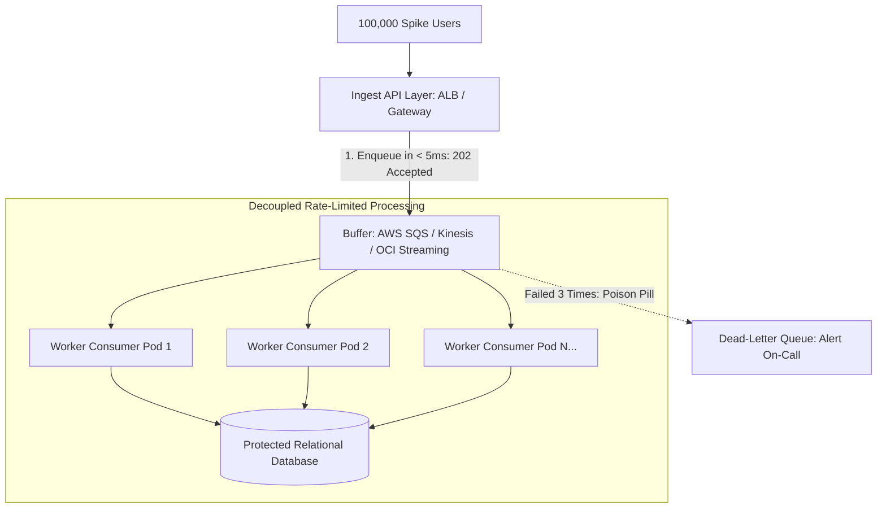

#### AWS Implementation
Terraform configuration provisioning an AWS SQS queue with server-side KMS encryption, dead-letter queue redrive policy, and an autoscaling ECS worker tier triggered by CloudWatch queue depth: [Doc: AWS SQS Queue Sizing & Dead-Letter Redrive, checked 2026].

```hcl
# Dead-Letter Queue for quarantined poison messages
resource "aws_sqs_queue" "dlq" {
  name                      = "order-processing-dlq"
  message_retention_seconds = 1209600 # Retain failed messages for 14 days
}

# Primary high-throughput queue with redrive policy
resource "aws_sqs_queue" "primary_queue" {
  name                       = "order-processing-queue"
  visibility_timeout_seconds = 180 # 3x worker processing timeout
  message_retention_seconds  = 86400

  redrive_policy = jsonencode({
    deadLetterTargetArn = aws_sqs_queue.dlq.arn
    maxReceiveCount     = 3 # Route to DLQ after 3 failed attempts
  })
}

# CloudWatch Alarm monitoring backlog depth per worker
resource "aws_cloudwatch_metric_alarm" "queue_backlog_alarm" {
  alarm_name          = "sqs-backlog-scaling-alarm"
  comparison_operator = "GreaterThanThreshold"
  evaluation_periods  = 1
  metric_name         = "ApproximateNumberOfMessagesVisible"
  namespace           = "AWS/SQS"
  period              = 60
  statistic           = "Average"
  threshold           = 1000 # Trigger scale-out when backlog exceeds 1000 messages

  dimensions = {
    QueueName = aws_sqs_queue.primary_queue.name
  }

  alarm_actions = [aws_appautoscaling_policy.scale_out.arn]
}
```

#### OCI Implementation
Terraform configuration provisioning an OCI Streaming Pool and Stream with partitioned throughput for high-volume ingest: [Doc: OCI Streaming Service & Partition Sizing, checked 2026].

```hcl
# OCI Stream Pool
resource "oci_streaming_stream_pool" "event_pool" {
  compartment_id = var.compartment_id
  name           = "telemetry-stream-pool"

  kafka_settings {
    auto_create_topics_enable = false
    log_retention_hours       = 24
    num_partitions            = 8
  }
}

# OCI Partitioned Stream (1 MB/s write & 2 MB/s read per partition)
resource "oci_streaming_stream" "order_events" {
  name           = "order-transactions"
  stream_pool_id = oci_streaming_stream_pool.event_pool.id
  partitions     = 8 # 8 Partitions = 8 MB/s write throughput

  retention_in_hours = 24
}
```

Python publisher script producing to OCI Streaming via Kafka protocol:
```python
# oci_stream_producer.py
from kafka import KafkaProducer
import json

producer = KafkaProducer(
    bootstrap_servers='cell-1.streaming.us-ashburn-1.oci.oraclecloud.com:9092',
    security_protocol='SASL_SSL',
    sasl_mechanism='PLAIN',
    sasl_plain_username='mytenancy/myuser/ocid1.streampool.oc1...',
    sasl_plain_password='OCI_AUTH_TOKEN',
    value_serializer=lambda v: json.dumps(v).encode('utf-8')
)

# Ingest event asynchronously in < 2ms
producer.send('order-transactions', {'order_id': 'ORD-98124', 'amount': 249.99})
producer.flush()
```

#### Common Trap
Configuring SQS Visibility Timeout shorter than the application worker's maximum processing time. If an SQS queue has `visibility_timeout_seconds = 30`, but a worker task takes 45 seconds to process a batch of data, SQS assumes the worker crashed at second 30 and makes the message visible to another worker. Worker 2 picks up the duplicate message and begins processing. This causes duplicate database writes, data corruption, and worker pool thrashing. Always configure visibility timeouts to at least $3\times$ to $6\times$ the maximum expected processing duration, or use heartbeat extenders (`ChangeMessageVisibility`).

#### Follow-up Question
How does an event-driven architecture handle the requirement for immediate read-your-own-writes consistency when the UI redirects the user to their newly created order?

*Answer*: If an order is created asynchronously via a queue, querying the database immediately upon page reload will return a 404 because worker consumption is still in flight. To provide a seamless user experience, use **Optimistic UI Updates** (storing the pending order in client-side state/local storage), employ short-lived in-memory caches (Redis) updated at ingest time, or establish WebSockets/Server-Sent Events (SSE) that notify the frontend when the worker commits the record.

---

### Q484: FinOps Framework and Cost Allocation Tagging Hygiene

#### Question
How do you implement the FinOps lifecycle (Inform, Optimize, Operate) across enterprise cloud environments, and what technical mechanisms enforce 100% cost allocation tagging hygiene across AWS Organizations and OCI Tenancies?

#### Short Answer
FinOps bridges engineering, finance, and operations to maximize business value from cloud spend across three iterative phases: **Inform** (real-time visibility, unit economics, 100% cost allocation), **Optimize** (rate reduction via commitments, waste elimination, right-sizing), and **Operate** (continuous governance, automated guardrails, culture of cost accountability). Enforcing tag hygiene prevents "unallocated spend" black holes. In AWS, this is achieved using **Tag Policies in AWS Organizations** (which intercept and reject untagged resource creation via SCPs) paired with Cost Allocation Tags. In OCI, **Defined Tags and Tag Defaults** automatically inject cost center, environment, and owner metadata at the compartment boundary, blocking provisioning if required tags are missing.

#### Deep Answer
Unallocated cloud spend is a primary symptom of immature platform engineering: when bills arrive from AWS or OCI, finance cannot determine which microservice, product line, or engineering team incurred the cost.

**The Three FinOps Lifecycle Phases**:
1. **Inform (Visibility & Allocation)**:
   - Calculate unit cost metrics (e.g., "Cost per 1,000 successful checkout transactions" rather than raw aggregate EC2 spend).
   - Require 4 mandatory tags on every provisioned resource: `Environment`, `CostCenter`, `Owner`, `Project`.
2. **Optimize (Rate & Usage Reduction)**:
   - Identify unattached EBS/block volumes, idle NAT gateways, oversized database instances.
   - Leverage commitment discounts (Savings Plans / OCI Universal Credits).
3. **Operate (Continuous Governance)**:
   - Shift FinOps left into CI/CD pipelines (e.g., Infracost pull-request gates).
   - Implement automated alerts when spending deviates by $> 10\%$ from forecasts.

**Enforcing Tagging Hygiene at the API Level**:
- *Reactive Auditing (Weak)*: Running nightly scripts that tag or flag non-compliant resources. This allows untagged resources to incur cost before detection.
- *Preventative Guardrails (Enterprise-Grade)*:
  - **AWS Tag Policies**: Enforces allowed tag keys and validated case-sensitive values (e.g., `Environment` must match `["Production", "Staging", "Development"]`).
  - **AWS Service Control Policies (SCPs)**: Blocks `ec2:RunInstances`, `rds:CreateDBInstance`, or `s3:CreateBucket` API calls if the request does not include the mandatory tags.
  - **OCI Defined Tag Defaults**: When a resource is created in a compartment, OCI automatically applies specified default tags (e.g., `${iam.principal.name}` as `Owner`), or blocks resource creation if required defined tags are omitted.

#### Architecture
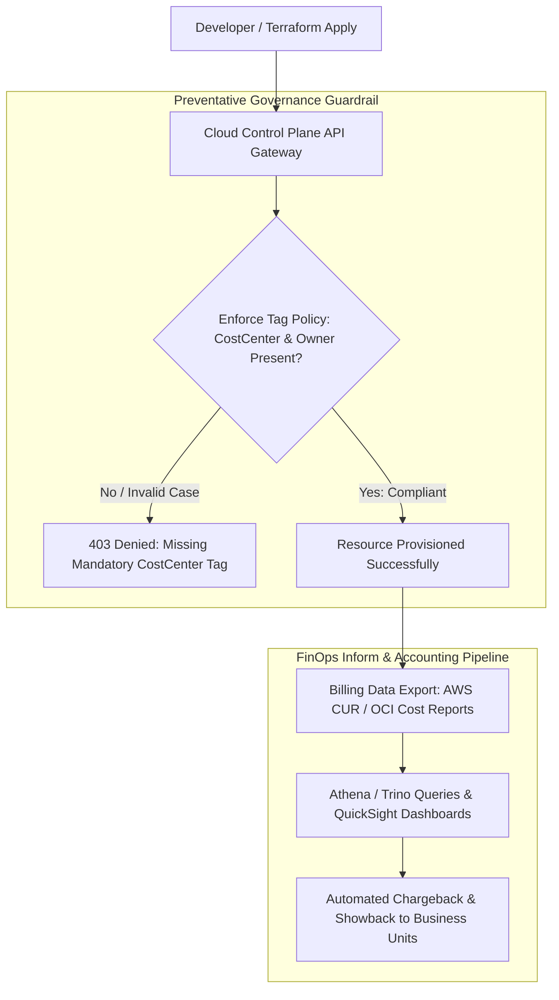

#### AWS Implementation
An AWS Service Control Policy (SCP) attached at the AWS Organizations root denying the creation of untagged resources: [Doc: AWS Organizations Tag Policies & SCPs, checked 2026].

```json
{
  "Version": "2012-10-17",
  "Statement": [
    {
      "Sid": "DenyResourceCreationWithoutMandatoryTags",
      "Effect": "Deny",
      "Action": [
        "ec2:RunInstances",
        "ec2:CreateVolume",
        "rds:CreateDBInstance",
        "rds:CreateDBCluster",
        "s3:CreateBucket"
      ],
      "Resource": "*",
      "Condition": {
        "Null": {
          "aws:RequestTag/CostCenter": "true"
        }
      }
    },
    {
      "Sid": "DenyInvalidEnvironmentTagValues",
      "Effect": "Deny",
      "Action": [
        "ec2:RunInstances",
        "rds:CreateDBInstance",
        "s3:CreateBucket"
      ],
      "Resource": "*",
      "Condition": {
        "StringNotEquals": {
          "aws:RequestTag/Environment": [
            "Production",
            "Staging",
            "Development",
            "Sandbox"
          ]
        }
      }
    }
  ]
}
```

Terraform configuration activating Cost Allocation Tags in AWS Billing:
```hcl
# Activate user-defined cost allocation tags for AWS Cost Explorer & CUR
resource "aws_ce_cost_allocation_tag" "cost_center" {
  tag_key = "CostCenter"
  status  = "Active"
}

resource "aws_ce_cost_allocation_tag" "environment" {
  tag_key = "Environment"
  status  = "Active"
}
```

#### OCI Implementation
Terraform configuration provisioning OCI Defined Tag Namespaces, Tag Keys with pre-defined value constraints, and Compartment Tag Defaults: [Doc: OCI Defined Tags & Tag Defaults, checked 2026].

```hcl
# Defined Tag Namespace
resource "oci_identity_tag_namespace" "finops_ns" {
  compartment_id = var.tenancy_ocid
  name           = "FinOps"
  description    = "Mandatory cost allocation and financial governance tags"
}

# Tag Key with strict value list validator
resource "oci_identity_tag" "environment_tag" {
  tag_namespace_id = oci_identity_tag_namespace.finops_ns.id
  name             = "Environment"
  description      = "Operating environment"

  validator {
    validator_type = "ENUM"
    values         = ["Production", "Staging", "Development"]
  }
}

resource "oci_identity_tag" "cost_center_tag" {
  tag_namespace_id = oci_identity_tag_namespace.finops_ns.id
  name             = "CostCenter"
  description      = "Accounting department code"
}

# Tag Default: Automatically inject creator's IAM username as Owner
resource "oci_identity_tag_default" "auto_owner_tag" {
  compartment_id    = var.production_compartment_ocid
  tag_definition_id = oci_identity_tag.cost_center_tag.id
  value             = "$${iam.principal.name}" # Auto-injected system variable
  is_required       = true                     # Blocks creation if tag fails
}
```

#### Common Trap
Enforcing tag policies on resource creation without handling **sub-resources** or secondary volume attachments. For example, in AWS, running `ec2:RunInstances` with tags attaches a root EBS volume. If the SCP mandates that `ec2:CreateVolume` must have `CostCenter`, but the Terraform code or user console interface only tagged the instance and not the underlying EBS volume resource, the API call fails with an obscure `UnauthorizedOperation` error. SCPs must explicitly target both `instance` and `volume` resource types in the request context (`aws:TagKeys`).

#### Follow-up Question
Why do newly created AWS Cost Allocation Tags take up to 24 hours to reflect in Cost Explorer?

*Answer*: AWS Cost Explorer processes billing records asynchronously through batch pipeline aggregations. Once a cost allocation tag is activated, AWS back-propagates the tag mapping across line-item records in the Cost and Usage Report (CUR). It takes between 12 and 24 hours for the billing pipeline to re-index historical metadata and expose the tag dimension within Cost Explorer filters and API queries.

---

### Q485: Commitment Discount Engineering (Savings Plans, RIs, and OCI Universal Credits)

#### Question
How do cloud commitment discount models—AWS Compute Savings Plans, EC2 Instance Savings Plans, Standard/Convertible Reserved Instances, and OCI Annual Universal Credits—differ in flexibility, discount depth, and financial risk modeling?

#### Short Answer
Commitment discounts trade financial flexibility for substantial cost savings ($30\%\text{ to }72\%$). **AWS Compute Savings Plans** offer the highest flexibility: you commit to a dollar-per-hour spend (e.g., \$100/hr for 1 or 3 years) applicable across any instance family, region, OS, or tenancy, including Fargate and Lambda. **AWS EC2 Instance Savings Plans** offer deeper discounts (up to 72%) but lock you to a specific instance family in a specific region. **OCI Universal Credits (UCC)** uses a completely different, unified model: commitments are made at the **tenancy level** across an annual contract value (e.g., \$500k/year), unlocking volume discounts across *all* OCI services (compute, block storage, autonomous databases) with zero region, shape, or architecture lock-in.

#### Deep Answer
Financial waste often occurs from over-committing to rigid pricing constructs that limit architectural evolution:

**Detailed Comparison of Commitment Instruments**:

| Dimension | AWS Compute Savings Plans | AWS EC2 Instance Savings Plans | AWS Standard RIs | OCI Annual Universal Credits (UCC) |
| :--- | :--- | :--- | :--- | :--- |
| **Commitment Type** | Hourly spend (\$ / hr) | Hourly spend (\$ / hr) | Specific Instance Count | Annual Dollar Value (\$ / year) |
| **Instance Family Flexibility**| Full (Switch C6i $\rightarrow$ C7g) | Rigid (Locked to C6i family) | None | Full (Any Compute, GPU, Storage) |
| **Region Flexibility** | Full (Switch us-east-1 $\rightarrow$ eu-west-1) | None (Locked to region) | None | Full (Any global OCI region) |
| **Compute Services Covered**| EC2, Fargate, Lambda | EC2 only | EC2 only | All OCI IaaS & PaaS services |
| **Max Discount** | $\sim 66\%$ (3-year all upfront) | $\sim 72\%$ (3-year all upfront) | $\sim 72\%$ (Marketplace resellable) | Volume discount matrix + OCI Rewards |

**Financial Break-Even and Coverage Modeling**:
- **The 80/20 Commitment Rule**:
  - Never commit to 100% of peak cloud spend. Peak usage is volatile.
  - Commit to **70%–80% of baseline steady-state usage** using Compute Savings Plans.
  - Let the remaining 20%–30% float on On-Demand or Spot instances. This prevents "break-even deficit" if business contractions force downsizing.
- **Break-Even Horizon Calculation**:
  $$\text{Break-Even Months} = \frac{\text{Upfront Cost}}{\text{Monthly On-Demand Cost} - \text{Monthly Discounted Cost}}$$
  - Typically, 1-year No-Upfront Savings Plans achieve break-even within 7–9 months.

**Oracle Support Rewards Program**:
- For customers spending on OCI Universal Credits while maintaining on-premises Oracle technology licenses, Oracle credits \$0.25 to \$0.33 for every \$1 spent on OCI back toward reducing on-premises Oracle support invoices, drastically shifting total enterprise IT cost economics.

#### Architecture
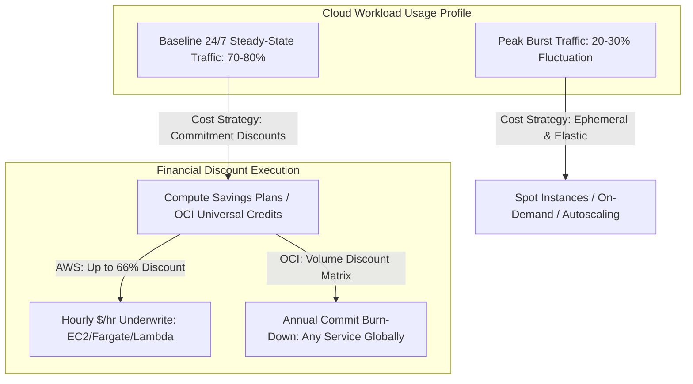

#### AWS Implementation
A Python FinOps analysis script querying AWS Cost Explorer API to calculate Savings Plans utilization, coverage ratios, and waste: [Doc: AWS Cost Explorer Savings Plans API, checked 2026].

```python
# analyze_savings_plans.py
import boto3
from datetime import datetime, timedelta

ce = boto3.client('ce', region_name='us-east-1')

end_date = datetime.now().date()
start_date = end_date - timedelta(days=30)

print(f"[FINOPS AUDIT] Analyzing AWS Savings Plans Coverage from {start_date} to {end_date}...")

# Query Savings Plans Coverage (Target: 75% - 85%)
coverage_resp = ce.get_savings_plans_coverage(
    TimePeriod={
        'Start': start_date.strftime('%Y-%m-%d'),
        'End': end_date.strftime('%Y-%m-%d')
    }
)

total_coverage = coverage_resp['SavingsPlansCoverages'][0]['Coverage']['CoveragePercentage']
print(f"Overall Compute Savings Plans Coverage: {float(total_coverage):.2f}%")

if float(total_coverage) < 70.0:
    print("[RECOMMENDATION] Coverage below 70%! Organization is overpaying on On-Demand rates.")
elif float(total_coverage) > 90.0:
    print("[WARNING] Coverage above 90%! High risk of over-commitment during architectural migrations.")

# Query Savings Plans Utilization (Target: > 98%)
utilization_resp = ce.get_savings_plans_utilization(
    TimePeriod={
        'Start': start_date.strftime('%Y-%m-%d'),
        'End': end_date.strftime('%Y-%m-%d')
    }
)

utilization_pct = utilization_resp['SavingsPlansUtilizationsByTime'][0]['Utilization']['UtilizationPercentage']
unused_spend = utilization_resp['SavingsPlansUtilizationsByTime'][0]['Utilization']['UnusedCommitment']

print(f"Savings Plans Utilization: {float(utilization_pct):.2f}%")
print(f"Unused / Wasted Financial Commitment: ${float(unused_spend):.2f} USD")
```

#### OCI Implementation
A shell script querying OCI Usage and Metering APIs to track Universal Credits burn-down rate and commitment balances: [Doc: OCI Metering and Universal Credit Consumption API, checked 2026].

```bash
#!/usr/bin/env bash
# oci-track-credits.sh: Monitor OCI Annual Universal Credits burn-rate
set -euo pipefail

TENANCY_OCID="ocid1.tenancy.oc1..aaaaaaaaxxxxxxxxxxxxxxxxxxxxxxx"
SUBSCRIPTION_ID="98765432"

echo "[INFO] Querying OCI Universal Credits Commitment balance..."
# Fetch active subscription details
SUB_JSON=$(oci billing-schedule invoice-summary list \
  --compartment-id "$TENANCY_OCID" \
  --output json || true)

# Query current month consumption via Usage API
USAGE_JSON=$(oci usage-api usage-summary request-summarized-usages \
  --tenant-id "$TENANCY_OCID" \
  --time-usage-started "$(date -v1d +%F)T00:00:00Z" \
  --time-usage-ended "$(date +%F)T00:00:00Z" \
  --granularity MONTHLY \
  --query-type COST \
  --output json)

TOTAL_SPENT=$(echo "$USAGE_JSON" | jq -r '.data.items[0]["computed-amount"] // 0')
echo "=================================================="
echo "OCI CURRENT MONTH UNIVERSAL CREDITS BURN: \$${TOTAL_SPENT} USD"
echo "=================================================="
```

#### Common Trap
Purchasing 3-Year All-Upfront EC2 Instance Savings Plans right before a major cloud modernization initiative (e.g., migrating from monolithic EC2 virtual machines to containerized EKS or serverless Fargate). Because EC2 Instance Savings Plans are rigidly locked to a specific instance family (e.g., `m5.large`), shifting workloads to Graviton (`m7g`) or Fargate renders the commitment invalid. The organization is forced to continue paying the hourly commitment on empty, unused capacity. Always choose **Compute Savings Plans** or maintain 1-year horizons during periods of architectural refactoring.

#### Follow-up Question
Can an organization sell unused AWS Savings Plans on the AWS Marketplace?

*Answer*: No. Unlike legacy Standard Reserved Instances (which can be listed and sold on the AWS Reserved Instance Marketplace to other AWS customers), **Savings Plans cannot be modified, cancelled, or resold**. Once a Savings Plan contract is executed, the organization is legally and contractually obligated to pay the committed hourly rate for the full 1-year or 3-year term.

---

### Q486: Spot Instances and Preemptible VMs at Scale

#### Question
How do you architect resilient, fault-tolerant compute clusters using AWS Spot Instances and OCI Preemptible Instances without suffering service disruptions when the cloud provider reclaims capacity?

#### Short Answer
Spot and Preemptible instances sell unused cloud spare capacity at massive discounts (**70% to 90% off** On-Demand prices). However, the cloud provider can reclaim this capacity at any time with minimal advance warning: **2 minutes on AWS EC2** (via EC2 Instance Metadata / EventBridge) and **30 seconds on OCI Compute**. To run production workloads reliably: (1) Use Spot strictly for stateless, idempotent, horizontally scalable workloads (Kubernetes worker nodes, asynchronous batch processing, CI/CD runners); (2) Implement **Spot Fleet with Capacity-Optimized Allocation** spreading nodes across diverse instance types and AZs; and (3) Automate instant graceful drain and cordoning upon receiving termination notices.

#### Deep Answer
Running mission-critical production systems on Spot requires engineering for inevitable, frequent node terminations:

1. **Spot Reclaim Mechanics**:
   - **AWS EC2 Spot**: When on-demand demand surges in an AZ, AWS reclaims Spot capacity. It issues an **EC2 Spot Instance Interruption Notice** delivered via Instance Metadata (`http://169.254.169.254/latest/meta-data/spot/instance-action`) and EventBridge exactly **120 seconds** before power-off.
   - **OCI Preemptible Instances**: OCI provides a **Preemption Termination Notification** delivered via metadata exactly **30 seconds** before shutdown.

2. **Capacity-Optimized Allocation Strategy**:
   - *Anti-Pattern*: A cluster requesting only `c6i.2xlarge` in `us-east-1a`. If that specific pool runs dry, 100% of nodes terminate simultaneously.
   - *Best Practice (Instance Diversification)*: Configure an Auto Scaling Group or Spot Fleet to mix 15–20 distinct instance types across 3 Availability Zones (e.g., `c6i.2xlarge`, `c6a.2xlarge`, `c7g.2xlarge`, `m6i.2xlarge`). The capacity-optimized algorithm allocates from the deepest spare-capacity pools, minimizing reclaim probability to $< 5\%$.

3. **Kubernetes Integration (AWS Node Termination Handler / Karpenter)**:
   - Modern Kubernetes autoscalers (Karpenter or AWS Node Termination Handler) listen to EventBridge termination warnings.
   - The instant an interruption warning is published:
     1. Mark node as `cordon` (preventing new pods from scheduling).
     2. Execute `kubectl drain` (evicting active pods with PodDisruptionBudgets respected).
     3. Preemptively provision a replacement node from a different spare pool *before* the 120-second timer expires.

#### Architecture
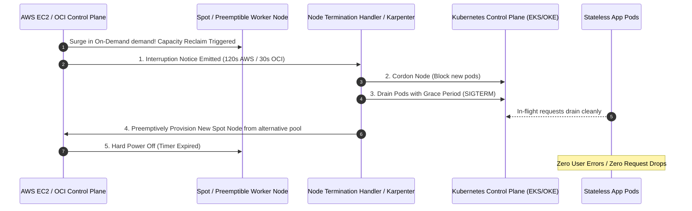

#### AWS Implementation
Terraform configuration provisioning an AWS EC2 Spot Auto Scaling Group with capacity-optimized diversification and instance refresh: [Doc: AWS Spot Fleet & Allocation Strategies, checked 2026].

```hcl
# Launch Template for Spot Instances
resource "aws_launch_template" "spot_node" {
  name_prefix   = "spot-worker-lt-"
  image_id      = var.eks_node_ami_id
  instance_type = "c6i.xlarge" # Fallback baseline

  network_interfaces {
    associate_public_ip_address = false
    security_groups             = [var.worker_sg_id]
  }

  user_data = base64encode(file("${path.module}/userdata.sh"))
}

# Auto Scaling Group diversified across 4 instance types with Capacity-Optimized allocation
resource "aws_autoscaling_group" "spot_asg" {
  name_prefix         = "eks-spot-pool-"
  vpc_zone_identifier = var.private_subnet_ids
  min_size            = 3
  max_size            = 30
  desired_capacity    = 6

  mixed_instances_policy {
    instances_distribution {
      on_demand_base_capacity                  = 0
      on_demand_percentage_above_base_capacity = 20 # 20% On-Demand for baseline stability
      spot_allocation_strategy                 = "capacity-optimized"
      spot_max_price                           = "" # Bids up to On-Demand price automatically
    }

    launch_template {
      launch_template_specification {
        launch_template_id = aws_launch_template.spot_node.id
        version            = "$Latest"
      }

      # Deep diversification across Intel, AMD, and ARM shapes
      override { instance_type = "c6i.2xlarge" }
      override { instance_type = "c6a.2xlarge" }
      override { instance_type = "c7g.2xlarge" }
      override { instance_type = "m6i.2xlarge" }
    }
  }

  # Respect 120-second termination notice
  instance_refresh {
    strategy = "Rolling"
  }
}
```

#### OCI Implementation
Terraform configuration provisioning an OCI Preemptible Instance Pool with automated termination detection: [Doc: OCI Preemptible Instances Configuration, checked 2026].

```hcl
# OCI Instance Pool utilizing Preemptible Compute Capacity
resource "oci_core_instance_pool" "preemptible_pool" {
  compartment_id            = var.compartment_id
  instance_configuration_id = oci_core_instance_configuration.preemptible_config.id
  size                      = 5
  display_name              = "prod-preemptible-batch-pool"

  placement_configurations {
    availability_domain = var.ad
    primary_subnet_id   = var.subnet_ocid
  }
}

resource "oci_core_instance_configuration" "preemptible_config" {
  compartment_id = var.compartment_id
  display_name   = "preemptible-config"

  instance_details {
    instance_type = "compute"
    launch_details {
      compartment_id = var.compartment_id
      shape          = "VM.Standard.E4.Flex"

      shape_config {
        ocpus         = 4
        memory_in_gbs = 16
      }

      # Flag instance as Preemptible (Up to 80% discount)
      preemptible_instance_config {
        preemption_action {
          type                  = "TERMINATE"
          preserve_boot_volume  = false
        }
      }

      source_details {
        source_type = "image"
        image_id    = var.custom_image_ocid
      }
    }
  }
}
```

OCI Preemption Monitoring Daemon running on worker nodes:
```bash
#!/usr/bin/env bash
# oci-preemption-monitor.sh: Poll metadata for 30-second termination warning
set -euo pipefail

while true; do
  STATUS=$(curl -s -m 2 http://169.254.169.254/opc/v2/instance/preemptionAction || true)
  
  if [ -n "$STATUS" ] && echo "$STATUS" | grep -q "TERMINATE"; then
    echo "[CRITICAL] Preemption notice detected! Cordoning and draining local pods..."
    kubectl cordon "$(hostname)"
    kubectl drain "$(hostname)" --ignore-daemonsets --delete-emptydir-data --force --grace-period=25
    exit 0
  fi
  sleep 5
done
```

#### Common Trap
Running single-replica stateful workloads (like a primary PostgreSQL database, single-pod Redis, or Elasticsearch leader nodes) on Spot/Preemptible instances. When the pool is reclaimed, the stateful service goes down, and persistent volumes (EBS/OCI Block Volumes) are unceremoniously detached. If AWS or OCI has no available capacity in that specific instance family, the replacement node cannot launch, resulting in sustained downtime. Stateful databases must **always** run on On-Demand or commitment-discounted instances.

#### Follow-up Question
How does Kubernetes `PodDisruptionBudget` (PDB) interact with node drains during a sudden Spot interruption?

*Answer*: A PDB specifies the minimum number or percentage of pods that must remain available during voluntary disruptions. However, a Spot interruption is an **involuntary hardware eviction**. If a drain is blocked because evicting a pod would breach the PDB, but the 120-second AWS timer expires, the hypervisor forcefully terminates the physical machine regardless of the PDB! SREs must design pods with low termination grace periods ($< 30\text{s}$) to ensure they relocate before the hard termination deadline.

---

### Q487: Data Transfer Cost Engineering (Inter-AZ, Cross-Region, and VPC Endpoints)

#### Question
What are the hidden cost drivers of cloud data transfer (inter-AZ traffic, cross-region replication, public internet egress, and NAT Gateways), and how do you architect private network routing to reduce data transfer bills by 80%+?

#### Short Answer
Cloud data transfer is a silent multi-million-dollar bill shock: while inbound ingress is free, cloud providers charge **\$0.01/GB** for traffic traversing Availability Zones within the same region, **\$0.02/GB to \$0.09/GB** for inter-region and internet egress, and **\$0.045/GB** for data processed through AWS NAT Gateways. To reduce data transfer costs by 80%+: (1) Deploy **VPC Endpoints (Gateway Endpoints for S3/DynamoDB are 100% free)** and OCI Service Gateways to bypass NAT Gateways entirely; (2) Implement **Topology-Aware Routing** in Kubernetes to keep microservice network traffic within the same Availability Zone; and (3) Use cross-cloud peering (Equinix / Megaport) or private interconnects with reduced egress rates.

#### Deep Answer
Organizations often misdiagnose high AWS bills, blaming compute or databases when the primary cost driver is **data transfer and NAT Gateway processing**:

**The Data Transfer Cost Hierarchy**:

| Traffic Flow Path | AWS Cost per GB | OCI Cost per GB |
| :--- | :--- | :--- |
| **Ingress (Internet to Cloud)** | **FREE** (\$0.00) | **FREE** (\$0.00) |
| **Intra-AZ / Intra-VCN Traffic** | **FREE** (\$0.00) | **FREE** (\$0.00) |
| **Inter-AZ Traffic (Same Region)** | **\$0.01 / GB** each way (\$0.02 roundtrip) | **FREE** (\$0.00 across ADs in same region!) |
| **AWS NAT Gateway Data Processing** | **\$0.045 / GB** | **FREE** (OCI NAT Gateway has zero per-GB processing fee!) |
| **Public Internet Egress** | \$0.09 / GB (First 10TB) | **FREE for first 10 TB/month**, then \$0.0085 / GB (10x cheaper!) |
| **Cross-Region Replication** | \$0.02 / GB | \$0.0085 / GB |

**Key Architectural Optimizations**:

1. **Eliminate NAT Gateway Processing Fees with Gateway Endpoints**:
   - Pushing 100 TB of backup data from private EC2 instances to S3 through an AWS NAT Gateway costs:
     $100,000 \times \$0.045 = \$4,500\text{ / month}$ *just for NAT data processing*!
   - Adding a free **AWS S3 Gateway Endpoint** updates VPC route tables to route S3 traffic directly over the internal AWS fabric, dropping the processing cost from \$4,500 to **\$0.00**.

2. **Topology-Aware Routing (Keeping Traffic Intra-AZ)**:
   - When Kubernetes Service pods communicate across AZs, every gigabyte incurs \$0.02 round-trip inter-AZ fees.
   - Enable `topology.kubernetes.io/zone` affinity and Kubernetes **Topology-Aware Routing** (`topologyAwareHints: auto`). Traffic is routed to a pod replica residing in the *exact same AZ*, eliminating inter-AZ cross-talk.

3. **OCI Advantage in Data Transfer Economics**:
   - OCI provides **10 TB of free outbound internet data transfer per month** per tenancy.
   - Inter-AD and intra-region data transfer in OCI is **completely free**.
   - Beyond 10 TB, OCI charges \$0.0085/GB—roughly **90% cheaper** than AWS's \$0.09/GB public egress.

#### Architecture
```mermaid
graph TD
    subgraph Anti-Pattern: High-Cost NAT Gateway Route ($0.045/GB)
        VM1[Private EC2 Instance] --> NAT[AWS NAT Gateway: Bills $0.045/GB]
        NAT --> S3Bad[Amazon S3 / Public Internet]
    end

    subgraph Optimized Architecture: Zero Processing Fees
        VM2[Private EC2 Instance] -->|Direct Private Link $0.00| GW[VPC S3 Gateway Endpoint: FREE]
        GW --> S3Good[Amazon S3 Bucket]
    end

    subgraph Kubernetes Microservices
        PodA[Frontend Pod in AZ-1] -->|Topology-Aware Routing: Intra-AZ $0.00| PodB[Backend Pod in AZ-1]
        PodA -.->|Cross-AZ Traffic: Bills $0.02/GB!| PodC[Backend Pod in AZ-2]
    end
```

#### AWS Implementation
Terraform configuration provisioning free S3 and DynamoDB Gateway VPC Endpoints to bypass NAT Gateways completely: [Doc: AWS VPC Endpoints Routing & Architecture, checked 2026].

```hcl
# AWS S3 Gateway Endpoint (100% FREE - No hourly fee, No data transfer fee)
resource "aws_vpc_endpoint" "s3_gateway" {
  vpc_id            = var.vpc_id
  service_name      = "com.amazonaws.us-east-1.s3"
  vpc_endpoint_type = "Gateway"
  route_table_ids   = var.private_route_table_ids

  policy = jsonencode({
    Version = "2012-10-17"
    Statement = [
      {
        Effect    = "Allow"
        Principal = "*"
        Action    = ["s3:GetObject", "s3:PutObject", "s3:ListBucket"]
        Resource  = ["arn:aws:s3:::*"]
      }
    ]
  })

  tags = {
    Name = "free-s3-gateway-endpoint"
  }
}

# AWS DynamoDB Gateway Endpoint (100% FREE)
resource "aws_vpc_endpoint" "dynamodb_gateway" {
  vpc_id            = var.vpc_id
  service_name      = "com.amazonaws.us-east-1.dynamodb"
  vpc_endpoint_type = "Gateway"
  route_table_ids   = var.private_route_table_ids
}
```

Kubernetes Service manifest enabling Topology-Aware Routing to eliminate inter-AZ traffic fees:
```yaml
# topology-aware-service.yaml
apiVersion: v1
kind: Service
metadata:
  name: order-service
  namespace: production
  annotations:
    service.kubernetes.io/topology-mode: "auto" # Routes client traffic to same AZ
spec:
  selector:
    app: order-service
  ports:
    - protocol: TCP
      port: 80
      targetPort: 8080
```

#### OCI Implementation
Configuring an OCI Service Gateway to route all Oracle Services Network (Object Storage, Vault, Streaming) traffic privately with zero data transfer fees: [Doc: OCI Service Gateway & Network Pricing, checked 2026].

```hcl
# Service Gateway allowing private subnets to reach OCI Services with ZERO data fees
resource "oci_core_service_gateway" "all_services_sg" {
  compartment_id = var.compartment_id
  vcn_id         = var.vcn_id
  display_name   = "all-oci-services-gateway"

  services {
    # Route all services in the Oracle Services Network
    service_id = data.oci_core_services.all_services.services[0].id
  }
}

data "oci_core_services" "all_services" {
  filter {
    name   = "name"
    values = ["All .* Services In Oracle Services Network"]
    regex  = true
  }
}

# Update private route table to point OSN CIDR to Service Gateway
resource "oci_core_route_table" "private_rt" {
  compartment_id = var.compartment_id
  vcn_id         = var.vcn_id
  display_name   = "private-route-table"

  route_rules {
    destination       = data.oci_core_services.all_services.services[0].cidr_block
    destination_type  = "SERVICE_CIDR_BLOCK"
    network_entity_id = oci_core_service_gateway.all_services_sg.id
  }
}
```

#### Common Trap
Deploying AWS **Interface Endpoints (PrivateLink)** for high-throughput S3 or Kafka streaming data without calculating the processing fees. Unlike Gateway Endpoints (which are free), PrivateLink Interface Endpoints cost **\$0.01 per hour plus \$0.01 per GB processed**. If a data lake ingestion pipeline processes 500 TB/month through an Interface Endpoint, the PrivateLink bill alone will be:
$500,000 \times \$0.01 = \$5,000\text{ / month}$!
Always use **Gateway Endpoints** for S3 and DynamoDB; reserve Interface Endpoints for services that do not support Gateway routing.

#### Follow-up Question
Why is cross-Availability Zone traffic free in Oracle Cloud Infrastructure (OCI) but billed in Amazon Web Services (AWS)?

*Answer*: OCI was engineered with a non-blocking Clos flat network fabric connecting Availability Domains with redundant dark fiber lines, and Oracle absorbs intra-region data transfer costs into their core service pricing model. AWS operates independently isolated physical datacenters with proprietary optical transit networks, billing customer accounts \$0.01/GB for traversing physical AZ transit switch boundaries to incentivize regional localized traffic patterns.

---

### Q488: Storage Lifecycle Management and Tiering Economics

#### Question
How do automated storage lifecycle policies (AWS S3 Lifecycle / Intelligent-Tiering vs OCI Object Storage Auto-Tiering) optimize petabyte-scale storage costs, and what are the retrieval penalty traps associated with cold/archive storage tiers?

#### Short Answer
Cold storage tiers deliver massive cost reductions (e.g., S3 Standard costs \$0.023/GB vs S3 Glacier Deep Archive at \$0.00099/GB—a **95%+ cost reduction**; OCI Standard at \$0.0255/GB vs OCI Archive at \$0.0026/GB). However, transition economics involve critical trade-offs: cold tiers impose **minimum storage duration fees** (e.g., 90 days for Glacier, 180 days for Deep Archive), **per-request transition fees**, and **retrieval per-GB surcharges**. For unpredictable access patterns, **AWS S3 Intelligent-Tiering** and **OCI Auto-Tiering** monitor object access automatically and transition data dynamically between hot and infrequent tiers with zero operational overhead and zero retrieval penalties.

#### Deep Answer
Managing petabyte-scale storage requires balancing storage capacity costs against API transition and retrieval penalties:

**The Storage Tier Cost Spectrum**:

| Storage Tier | AWS Cost per GB-Month | OCI Cost per GB-Month | Min Storage Duration | Retrieval Time |
| :--- | :--- | :--- | :--- | :--- |
| **Standard / Hot** | \$0.023 | \$0.0255 | None | Milliseconds |
| **Infrequent Access (IA)** | \$0.0125 | \$0.0025 (Infrequent Tier) | 30 days | Milliseconds |
| **Archive / Glacier** | \$0.0036 (Flexible) | \$0.0026 (Archive Storage) | 90 days | Minutes to Hours |
| **Deep Archive** | \$0.00099 | N/A | 180 days | 12 to 48 Hours |

**The Hidden Cost Traps of Cold Storage**:
1. **The Small Object Transition Trap**:
   - Transitioning an object from S3 Standard to Glacier costs \$0.05 per 1,000 requests (`PUT`/`COPY`).
   - If an organization has 100 million tiny 1 KB files, the transition fee alone is:
     $100,000 \times \$0.05 = \$5,000$ upfront!
   - 100 million 1 KB files total only 100 GB. Storing 100 GB on S3 Standard costs just \$2.30/month. Spending \$5,000 to save \$2/month takes **200+ years to break even**!
   - *Rule*: Never transition objects smaller than 128 KB to Glacier.

2. **Early Deletion Surcharges**:
   - If an object is transitioned to S3 Glacier Deep Archive (180-day minimum) and deleted after 10 days, AWS bills a prorated early deletion fee for the remaining 170 days.

3. **Data Egress & Retrieval Fees**:
   - Retrieving 100 TB from Glacier Deep Archive costs \$0.02/GB retrieval fee (\$2,000) *plus* internet egress fees (\$9,000), totaling \$11,000 to restore data.

**The Intelligent-Tiering Advantage**:
- For an automation fee (\$0.0025 per 1,000 objects), AWS S3 Intelligent-Tiering moves objects between Frequent, Infrequent (30 days), and Archive Instant Access (90 days) tiers based on real-time access.
- Crucially: **Intelligent-Tiering has ZERO retrieval fees**. If an archived object is accessed, it moves back to the Frequent Access tier instantly at millisecond latency without surcharge.

#### Architecture
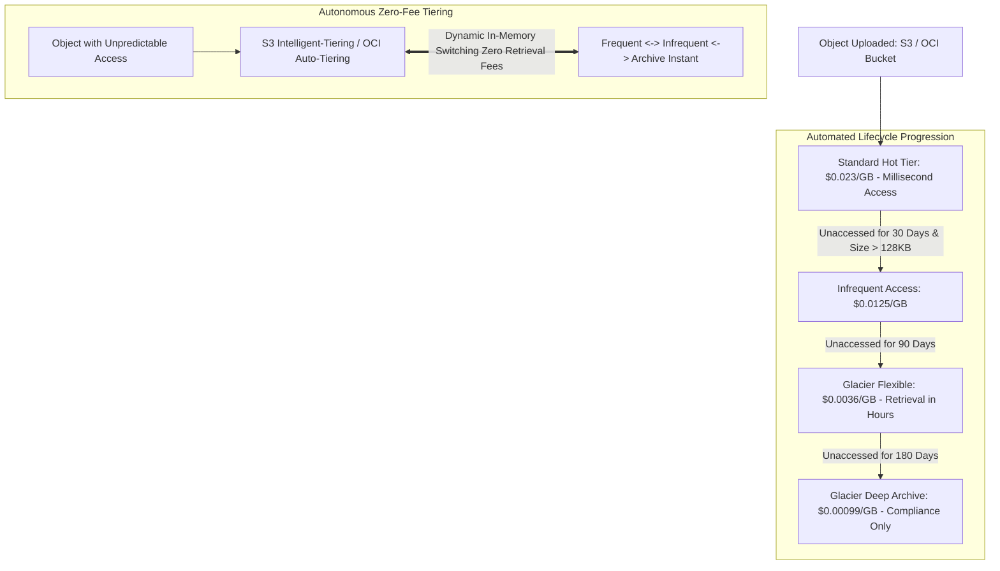

#### AWS Implementation
Terraform configuration provisioning an S3 bucket with an optimized lifecycle rule filtering objects $> 128\text{ KB}$ and expiring non-current versions: [Doc: AWS S3 Lifecycle Configuration & Minimum Sizes, checked 2026].

```hcl
# S3 Bucket with optimized FinOps Lifecycle Policies
resource "aws_s3_bucket" "analytics_bucket" {
  bucket = "corp-analytics-lake-us-east-1"
}

resource "aws_s3_bucket_lifecycle_configuration" "lifecycle_policy" {
  bucket = aws_s3_bucket.analytics_bucket.id

  rule {
    id     = "optimize-storage-costs"
    status = "Enabled"

    # Filter out tiny objects to avoid transition fee traps!
    filter {
      object_size_greater_than = 131072 # 128 KB minimum size filter
    }

    # Transition to Intelligent-Tiering after 30 days
    transition {
      days          = 30
      storage_class = "INTELLIGENT_TIERING"
    }

    # Transition to Glacier Deep Archive after 180 days
    transition {
      days          = 180
      storage_class = "DEEP_ARCHIVE"
    }

    # Expire and permanently delete after 7 years (2555 days)
    expiration {
      days = 2555
    }

    # Clean up obsolete noncurrent object versions after 30 days
    noncurrent_version_expiration {
      noncurrent_days = 30
    }

    # Abort failed multipart uploads after 7 days to clean up hidden bytes
    abort_incomplete_multipart_upload {
      days_after_initiation = 7
    }
  }
}
```

#### OCI Implementation
Configuring an OCI Object Storage bucket with Auto-Tiering and Lifecycle Rules using Terraform: [Doc: OCI Object Storage Auto-Tiering & Lifecycle Rules, checked 2026].

```hcl
# OCI Object Storage Bucket with Auto-Tiering Enabled
resource "oci_objectstorage_bucket" "oci_data_lake" {
  compartment_id = var.compartment_id
  name           = "corp-analytics-lake"
  namespace      = var.objectstorage_namespace
  storage_tier   = "Standard"

  # Automatically moves unaccessed objects to Infrequent Access tier
  auto_tiering = "InfrequentAccess"
}

# Lifecycle policy archiving unaccessed objects after 90 days
resource "oci_objectstorage_object_lifecycle_policy" "archive_policy" {
  bucket    = oci_objectstorage_bucket.oci_data_lake.name
  namespace = var.objectstorage_namespace

  rules {
    name        = "ArchiveHistoricalLogs"
    action      = "ARCHIVE"
    is_enabled  = true
    time_amount = 90
    time_unit   = "DAYS"

    object_name_filter {
      inclusion_prefixes = ["historical-logs/"]
    }
  }

  rules {
    name        = "DeleteOldArchives"
    action      = "DELETE"
    is_enabled  = true
    time_amount = 365 # Delete after 1 year
    time_unit   = "DAYS"
  }
}
```

#### Common Trap
Failing to configure `abort_incomplete_multipart_upload` on S3 buckets. When an application uploads large files (e.g., database backups or container images) using multipart upload, and the upload fails midway due to a network glitch, the uploaded chunk parts remain stored in S3 indefinitely. Because incomplete parts are not visible as normal S3 objects in `aws s3 ls`, they remain hidden while continuing to bill full S3 Standard rates every month! In large enterprises, orphan multipart uploads frequently account for tens of terabytes of hidden phantom spend. Always configure lifecycle rules to abort incomplete multipart uploads after 7 days.

#### Follow-up Question
How does S3 Intelligent-Tiering handle objects smaller than 128 KB?

*Answer*: S3 Intelligent-Tiering monitors objects smaller than 128 KB, but stores them permanently in the Frequent Access tier without moving them to Infrequent or Archive tiers. Furthermore, AWS does not charge the monthly monitoring fee (\$0.0025/1,000 objects) for objects under 128 KB, protecting customers from paying monitoring fees on data that cannot yield storage savings.

---

### Q489: Automated Cost Anomaly Detection and Cloud Budget Alerts

#### Question
How do machine-learning cost anomaly detection systems (AWS Cost Anomaly Detection vs OCI Budgets and Anomaly Alerts) differentiate between legitimate organic business growth and rogue cloud infrastructure spend?

#### Short Answer
Static threshold budgets (e.g., "Alert if spend $> \$50,000$") fail in dynamic enterprises: they alert too late in the billing cycle and generate false alarms during expected seasonal traffic spikes (e.g., Cyber Monday). **Machine-Learning Cost Anomaly Detection** trains continuous time-series models on historical account spending patterns, accounting for day-of-week seasonality, organic growth trends, and service-level baselines. When spend deviates outside the statistical confidence interval (e.g., an unexpected \$5,000 surge in GPU or NAT Gateway spend on a Tuesday afternoon), the anomaly engine isolates the exact resource ARN/OCID, root-cause service, and triggering IAM principal, dispatching real-time alerts to Slack or PagerDuty within hours.

#### Deep Answer
Rogue spending incidents (e.g., an engineer spinning up a 32-node `p4d.24xlarge` GPU cluster and forgetting to shut it down over the weekend, or an infinite loop writing millions of S3 objects) can burn \$50,000 in 48 hours:

**How Cloud Anomaly Detection Operates**:
1. **Time-Series ML Modeling**:
   - AWS Cost Anomaly Detection and OCI Anomaly Alerts train supervised ML models on past usage.
   - The algorithm learns that Saturdays and Sundays exhibit 40% lower traffic than Wednesdays, preventing false alarms on Monday mornings when traffic naturally recovers.
2. **Root-Cause Attribution**:
   - Unlike generic billing totals, the anomaly engine inspects multi-dimensional telemetry:
     - Identifies the exact **Account ID / Compartment**.
     - Identifies the specific **Service** (e.g., AWS KMS or OCI Block Volumes).
     - Identifies the specific **Usage Type** (e.g., `USE2-NatGateway-Bytes`).
     - Estimates the total projected monetary impact of the anomaly.
3. **Automated Budget vs Anomaly Distinction**:
   - **Budgets**: Best for macro-level governance and quarterly tracking (e.g., "Department Marketing has a \$10,000 monthly ceiling").
   - **Anomaly Detection**: Best for micro-level incident response (e.g., "KMS API calls surged by 800% in the last 6 hours, projected impact: \$8,200").

#### Architecture
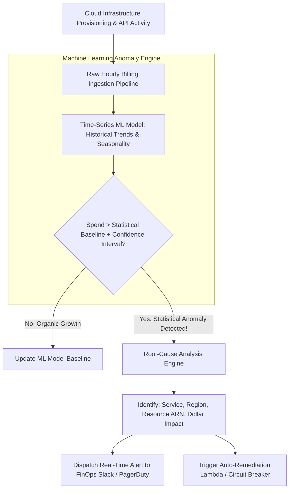

#### AWS Implementation
Terraform configuration provisioning an AWS Cost Anomaly Monitor, Anomaly Subscription with threshold filtering, and SNS alert topic: [Doc: AWS Cost Anomaly Detection Terraform Configuration, checked 2026].

```hcl
# Cost Anomaly Monitor inspecting all AWS services
resource "aws_ce_anomaly_monitor" "service_monitor" {
  name              = "all-services-cost-anomaly-monitor"
  monitor_type      = "DIMENSIONAL"
  monitor_dimension = "SERVICE"
}

# SNS Topic for Cost Alerts
resource "aws_sns_topic" "cost_alerts" {
  name = "finops-cost-anomaly-alerts"
}

# Anomaly Subscription dispatching alerts when anomaly exceeds $200 and 20% impact
resource "aws_ce_anomaly_subscription" "immediate_alerts" {
  name      = "immediate-slack-anomaly-subscription"
  frequency = "IMMEDIATE" # Dispatch immediately upon anomaly detection

  monitor_arn_list = [
    aws_ce_anomaly_monitor.service_monitor.arn
  ]

  subscriber {
    type    = "SNS"
    address = aws_sns_topic.cost_alerts.arn
  }

  threshold_expression {
    and {
      dimension {
        key           = "ANOMALY_TOTAL_IMPACT_PERCENTAGE"
        values        = ["20"] # Impact exceeds 20% deviation
        match_options = ["GREATER_THAN_OR_EQUAL"]
      }
      dimension {
        key           = "ANOMALY_TOTAL_IMPACT_ABSOLUTE"
        values        = ["200"] # Dollar impact exceeds $200
        match_options = ["GREATER_THAN_OR_EQUAL"]
      }
    }
  }
}
```

#### OCI Implementation
Terraform configuration provisioning an OCI Budget with threshold alerts triggered at both forecasted and actual spend thresholds: [Doc: OCI Budgets & Threshold Rules, checked 2026].

```hcl
# OCI Budget for Production Compartment
resource "oci_budget_budget" "prod_budget" {
  compartment_id = var.tenancy_ocid
  amount         = 25000 # Monthly budget of $25,000 USD
  reset_period   = "MONTHLY"
  target_type    = "COMPARTMENT"
  targets        = [var.production_compartment_ocid]
  display_name   = "production-monthly-budget"
  description    = "Monthly spend guardrail for production workloads"
}

# Alert Rule 1: Actual Spend reaches 80%
resource "oci_budget_alert_rule" "actual_80_percent" {
  budget_id      = oci_budget_budget.prod_budget.id
  threshold      = 80
  threshold_type = "PERCENTAGE"
  type           = "ACTUAL"
  recipients     = "finops-team@corp.example.com"
  message        = "WARNING: Production compartment has consumed 80% of its monthly budget."
}

# Alert Rule 2: FORECASTED spend exceeds 100% of budget
resource "oci_budget_alert_rule" "forecast_100_percent" {
  budget_id      = oci_budget_budget.prod_budget.id
  threshold      = 100
  threshold_type = "PERCENTAGE"
  type           = "FORECAST" # Machine learning projection before month end!
  recipients     = "sre-leads@corp.example.com"
  message        = "CRITICAL: Forecasted spend will exceed 100% of production budget before month-end."
}
```

#### Common Trap
Setting cost anomaly detection alert thresholds too low (e.g., alerting on any \$10 anomaly). If developers spin up a temporary t3.large instance for testing, generating 15 alert emails every day, engineers develop "alert fatigue" and create email filters that route all billing alerts to trash. When a genuine rogue \$30,000 GPU cluster anomaly occurs, no one notices until the monthly credit card invoice arrives. Anomaly thresholds must be tuned to significant operational thresholds (e.g., minimum \$200 absolute impact and $>20\%$ deviation).

#### Follow-up Question
How quickly does AWS Cost Anomaly Detection detect a rogue spending incident compared to CloudWatch metric alarms?

*Answer*: AWS Cost Anomaly Detection evaluates data based on billing records, which are aggregated and processed once every 6 to 12 hours. Consequently, an anomaly alert typically arrives 6–18 hours after the rogue spending begins. For sub-hour protection against rogue resources, SREs must complement Cost Anomaly Detection with near-real-time **CloudWatch Usage Metric Alarms** (e.g., monitoring `NumberOfObjects` or `ConcurrentExecutions` every 5 minutes).

---

### Q490: Serverless vs Provisioned Compute Unit Economics

#### Question
How do you calculate the economic break-even point between serverless compute (AWS Lambda / OCI Functions) and provisioned container infrastructure (AWS ECS/EKS vs OCI OKE), and at what request volume does serverless become cost-prohibitive?

#### Short Answer
Serverless compute (AWS Lambda, OCI Functions) operates on a "pay-for-what-you-use" model with **zero cost at zero traffic**, making it economically superior for intermittent, spiky, or low-to-medium traffic workloads ($< 2\text{ to }5\text{ million requests/day}$). However, serverless has a high unit markup per gigabyte-second of compute ($\approx \$0.0000166667\text{ per GB-sec}$). When a microservice receives steady-state, continuous traffic, provisioned container clusters (ECS Fargate or Kubernetes on Spot/Savings Plans) become drastically cheaper: at $\sim 50\text{ to }100\text{ steady requests/sec}$, the unit cost curves cross, and provisioned compute is up to **60% to 80% cheaper** than Lambda.

#### Deep Answer
Architects frequently fall into the dogmatic trap of "Serverless-First" without modeling long-term unit economics at scale:

**Mathematical Cost Modeling: Lambda vs Provisioned Container**:
1. **Scenario Parameters**:
   - Microservice requiring 1 GB RAM, processing requests with an average execution duration of **200 ms**.
   - Traffic: 50 requests per second steady-state ($4,320,000\text{ requests / day} = 129.6\text{M requests / month}$).

2. **AWS Lambda Cost Calculation**:
   - Monthly Requests: $129,600,000 \times \$0.20 / 1\text{M} = \$25.92$
   - Monthly Compute (GB-Seconds):
     $$129,600,000 \times 0.200\text{s} \times 1\text{ GB} = 25,920,000\text{ GB-seconds}$$
   - Compute Cost: $25,920,000 \times \$0.0000166667 = \$432.00$
   - Total Lambda Cost: $\approx \mathbf{\$458\text{ / month}}$.

3. **Provisioned ECS Fargate Alternative**:
   - 50 req/sec $\times$ 0.2s duration = 10 concurrent requests at any millisecond.
   - Two 1 vCPU, 2 GB RAM Fargate tasks (redundant across 2 AZs for High Availability) can easily process 100+ req/sec with connection keep-alive.
   - Fargate Pricing (Compute Savings Plan): $\approx \$0.03\text{ / hour per task}$.
   - Monthly Cost: $2 \text{ tasks} \times 730 \text{ hours} \times \$0.03 = \mathbf{\$43.80\text{ / month}}$.
   - *Result*: Provisioned container infrastructure is **$10\times$ cheaper** than Lambda for this steady-state workload!

4. **When Serverless IS Economically Superior**:
   - Cron jobs running once per hour.
   - Webhook receivers with unpredictable bursts.
   - Development and staging environments that sit completely idle at night and on weekends (Serverless drops to \$0.00; provisioned VMs bill 24/7).

#### Architecture
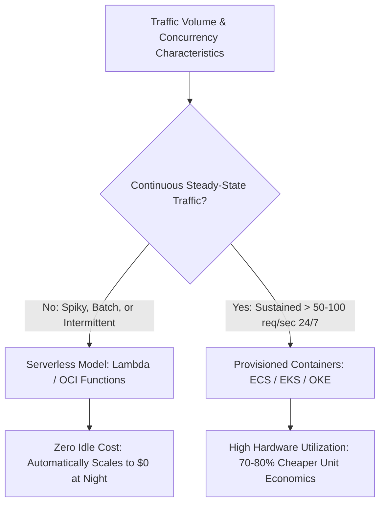

#### AWS Implementation
A Python FinOps calculator script comparing real-time AWS Lambda pricing against ECS Fargate and EC2 Spot pricing: [Doc: AWS Lambda vs Fargate Pricing Models, checked 2026].

```python
# calculate_break_even.py
def calculate_costs(monthly_requests: int, avg_duration_ms: float, memory_mb: int):
    # AWS Lambda Pricing (us-east-1 x86)
    LAMBDA_REQ_PRICE = 0.20 / 1_000_000
    LAMBDA_GB_SEC_PRICE = 0.0000166667

    total_gb_seconds = monthly_requests * (avg_duration_ms / 1000.0) * (memory_mb / 1024.0)
    lambda_total = (monthly_requests * LAMBDA_REQ_PRICE) + (total_gb_seconds * LAMBDA_GB_SEC_PRICE)

    # ECS Fargate Pricing (2 Tasks across 2 AZs for HA, 1 vCPU, 2GB RAM)
    # Fargate rate: ~$0.04048 per vCPU-hr + $0.004445 per GB-hr
    FARGATE_HOURLY_PER_TASK = 0.04048 + (2 * 0.004445)
    fargate_total = 2 * 730 * FARGATE_HOURLY_PER_TASK

    print(f"=== Workload: {monthly_requests:,} reqs/mo | {avg_duration_ms}ms | {memory_mb}MB ===")
    print(f"AWS Lambda Monthly Cost:       ${lambda_total:,.2f} USD")
    print(f"AWS ECS Fargate Monthly Cost:  ${fargate_total:,.2f} USD")

    if lambda_total > fargate_total:
        savings = lambda_total - fargate_total
        print(f"RECOMMENDATION: Migrate to ECS Fargate! Saves ${savings:,.2f}/mo ({(savings/lambda_total)*100:.1f}%)")
    else:
        savings = fargate_total - lambda_total
        print(f"RECOMMENDATION: Retain AWS Lambda! Saves ${savings:,.2f}/mo compared to provisioned idle capacity.")

# Example 1: Low-volume intermittent webhook (1M requests/mo)
calculate_costs(monthly_requests=1_000_000, avg_duration_ms=150, memory_mb=512)

# Example 2: High-volume steady API (150M requests/mo)
calculate_costs(monthly_requests=150_000_000, avg_duration_ms=200, memory_mb=1024)
```

#### OCI Implementation
Terraform configuration deploying an OCI Function with concurrency limits alongside an OCI Container Instance baseline: [Doc: OCI Functions Pricing & Container Instances, checked 2026].

```hcl
# OCI Function (Free tier includes 2 million calls + 350,000 GB-seconds per month)
resource "oci_functions_function" "spiky_webhook" {
  application_id = var.app_ocid
  display_name   = "webhook-processor"
  image          = "iad.ocir.io/mytenancy/functions/webhook:v1.0"
  memory_in_mbs  = 512
  timeout_in_seconds = 30

  # Provisioned concurrency can be enabled for zero cold-start at nominal fee
  provisioned_concurrency_config {
    strategy = "NONE" # Ephemeral on-demand execution
  }
}

# Steady-state high-volume alternative: OCI Container Instance
resource "oci_container_instances_container_instance" "steady_state_app" {
  compartment_id      = var.compartment_id
  availability_domain = var.ad
  display_name        = "steady-state-api"
  shape               = "CI.Standard.E4.Flex"

  shape_config {
    ocpus         = 1
    memory_in_gbs = 4
  }

  containers {
    display_name = "api-server"
    image_url    = "iad.ocir.io/mytenancy/apps/api:latest"
  }

  vnics {
    subnet_id = var.private_subnet_ocid
  }
}
```

#### Common Trap
Ignoring data transfer, NAT gateway fees, and API Gateway charges when calculating serverless economics. In AWS, invoking a Lambda via **AWS API Gateway** costs **\$3.50 per million HTTP requests**! In contrast, Lambda compute itself costs only \$0.20 per million. If an application receives 100 million requests, the API Gateway charge is \$350.00 while Lambda compute is only \$20.00. Adding an Application Load Balancer (ALB) fronting ECS Fargate or Lambda directly drastically reduces Layer 7 ingress fees at high volumes.

#### Follow-up Question
How does Provisioned Concurrency in AWS Lambda alter the unit economics of serverless?

*Answer*: Provisioned Concurrency eliminates cold starts by pre-allocating execution environments in a warm state. However, it changes the pricing model from purely ephemeral execution to paying an hourly fee per provisioned concurrency slot ($~ \$0.015\text{/GB-hr}$), regardless of whether invocations occur. If an engineer over-provisions concurrency (e.g., maintaining 200 warm slots 24/7), the cost advantage of serverless vanishes, making it significantly more expensive than running dedicated ECS/OKE container nodes.

---

### Q491: Cloud Waste Elimination and Idle Resource Garbage Collection

#### Question
How do you architect automated cloud waste elimination systems to detect, report on, and systematically terminate orphaned EBS/block volumes, unassociated Elastic IPs, idle load balancers, and zombie development environments?

#### Short Answer
Cloud waste accounts for **25% to 35% of enterprise cloud spend**, driven by engineers abandoning temporary resources after experiments or deployments. The primary sources of waste are: (1) Unattached EBS / OCI Block Volumes left behind when instances terminate; (2) Unassociated Elastic IPs billing idle reservation penalties; (3) Unused Application Load Balancers with zero target registrations; and (4) Staging/dev compute clusters running 24/7 over weekends. To eliminate waste: deploy automated, scheduled serverless janitor scripts (AWS Lambda / OCI Functions or tools like Cloud Custodian) that tag idle resources with warning notices, provide an automated grace period, and systematically delete zombie infrastructure.

#### Deep Answer
Manual spreadsheets and periodic cleanup emails fail because developers prioritize shipping features over manual hygiene.

**The Top 4 Cloud Waste Black Holes**:
1. **Orphaned Block Volumes (Unattached Disks)**:
   - When an EC2 instance is terminated without `DeleteOnTermination: true`, its EBS volume persists.
   - 500 abandoned 500 GB gp3 volumes cost:
     $500 \times 500\text{ GB} \times \$0.08 = \$20,000\text{ / month}$ for zero business utility!
2. **Unassociated Elastic IP Penalties**:
   - Cloud providers charge for Elastic IPs *only when they are NOT associated with a running instance* (to discourage public IPv4 hoarding). Idle IPs bill \$0.005/hr (\$3.60/month per IP).
3. **Empty Load Balancers**:
   - ALBs and OCI Load Balancers bill hourly base charges ($\sim \$25\text{ / month}$) even if they have 0 registered targets and route 0 requests.
4. **Weekend Idle Development Clusters**:
   - Dev/QA environments are used roughly 40 hours per week (Monday–Friday, 9 AM–5 PM).
   - Running them 168 hours per week wastes **76% of their compute cost** on empty nights and weekends.
   - *Fix*: Implement an automated Auto Scaling schedule or EventBridge rule that scales dev clusters to 0 replicas at 19:00 Friday and scales back up at 07:00 Monday.

**Automated Janitor Lifecycle (Detect $\rightarrow$ Tag $\rightarrow$ Grace Period $\rightarrow$ Purge)**:
- Day 0: Janitor identifies unattached volume, tags with `cleanup_scheduled: 2026-09-10`, and notifies owner via Slack.
- Day 3: If still unattached, takes a final recovery snapshot and deletes the volume permanently.

#### Architecture
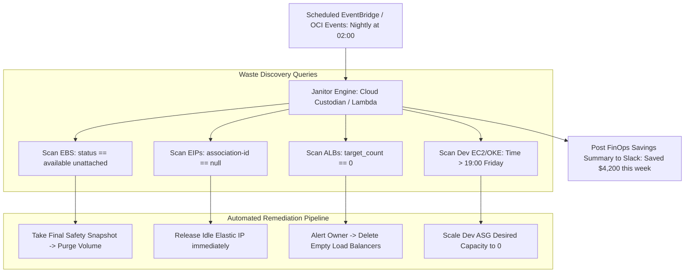

#### AWS Implementation
Production Python Lambda function scanning an AWS account for unattached EBS volumes and unassociated Elastic IPs, taking a safety snapshot, and terminating waste: [Doc: AWS Boto3 EC2 Resource Cleanup Patterns, checked 2026].

```python
# lambda_janitor.py
import boto3

ec2 = boto3.client('ec2', region_name='us-east-1')

def lambda_handler(event, context):
    print("[FINOPS JANITOR] Starting nightly cloud waste garbage collection...")
    savings_monthly = 0.0

    # 1. Clean up unattached EBS Volumes
    volumes = ec2.describe_volumes(Filters=[{'Name': 'status', 'Values': ['available']}])['Volumes']
    print(f"Found {len(volumes)} unattached orphaned EBS volumes.")

    for vol in volumes:
        vol_id = vol['VolumeId']
        size_gb = vol['Size']
        monthly_cost = size_gb * 0.08 # gp3 rate
        savings_monthly += monthly_cost

        print(f"Processing unattached volume {vol_id} ({size_gb} GB)...")
        # Step A: Take final safety snapshot before deletion
        ec2.create_snapshot(
            VolumeId=vol_id,
            Description=f"Automated pre-deletion safety snapshot for orphaned {vol_id}"
        )
        # Step B: Delete the abandoned volume
        ec2.delete_volume(VolumeId=vol_id)
        print(f"[DELETED] Orphan volume {vol_id} purged. Saved ${monthly_cost:.2f}/month.")

    # 2. Clean up unassociated Elastic IPs
    addresses = ec2.describe_addresses()['Addresses']
    unassociated_ips = [ip for ip in addresses if 'AssociationId' not in ip]
    print(f"Found {len(unassociated_ips)} idle unassociated Elastic IPs.")

    for ip in unassociated_ips:
        alloc_id = ip['AllocationId']
        ec2.release_address(AllocationId=alloc_id)
        savings_monthly += 3.60
        print(f"[RELEASED] Idle Elastic IP {ip['PublicIp']} ({alloc_id}) released.")

    print(f"[SUCCESS] Janitor run complete. Total ongoing monthly savings: ${savings_monthly:,.2f} USD.")
    return {"status": "SUCCESS", "monthly_savings_usd": savings_monthly}
```

#### OCI Implementation
A shell script running via OCI CLI identifying and purging detached OCI Block Volumes and unassigned Reserved Public IPs: [Doc: OCI CLI Block Storage & IP Cleanup, checked 2026].

```bash
#!/usr/bin/env bash
# oci-janitor-cleanup.sh: Sweep and purge detached block volumes in OCI
set -euo pipefail

COMPARTMENT_OCID="ocid1.compartment.oc1..aaaaaaaaxxxxxxxxxxxxxxxxxxxxxxx"
echo "[INFO] Scanning compartment for detached, unattached OCI Block Volumes..."

# List volumes in AVAILABLE state (meaning not currently attached to any compute instance)
DETACHED_VOLUMES=$(oci bv volume list \
  --compartment-id "$COMPARTMENT_OCID" \
  --lifecycle-state AVAILABLE \
  --output json | jq -r '.data[] | select(.["is-hydrated"] == true) | "\(.id) \(.["display-name"]) \(.["size-in-gbs"])"')

if [ -z "$DETACHED_VOLUMES" ]; then
  echo "[SUCCESS] No orphaned block volumes detected."
  exit 0
fi

while IFS= read -r line; do
  VOL_ID=$(echo "$line" | awk '{print $1}')
  VOL_NAME=$(echo "$line" | awk '{print $2}')
  SIZE_GB=$(echo "$line" | awk '{print $3}')

  echo "[ORPHAN FOUND] Volume $VOL_NAME ($VOL_ID) - ${SIZE_GB} GB is unattached!"

  # 1. Create safety backup
  echo "Creating safety backup for $VOL_NAME..."
  oci bv backup create --volume-id "$VOL_ID" --display-name "pre-delete-${VOL_NAME}" --wait-for-state AVAILABLE

  # 2. Terminate the orphan volume
  echo "Deleting volume $VOL_ID..."
  oci bv volume delete --volume-id "$VOL_ID" --force
  echo "[DELETED] $VOL_NAME purged successfully."
done <<< "$DETACHED_VOLUMES"
```

#### Common Trap
Deleting unattached EBS or OCI Block Volumes without verifying whether the volume is an intended **Warm Standby Disaster Recovery Replica** or a detached database volume awaiting failover. If an SRE purposefully keeps a detached volume containing yesterday's historical database snapshot, an overly aggressive janitor script will wipe out critical DR data. Automated janitors must enforce an **Exemption Tag Convention** (e.g., `DoNotDelete: true` or `KeepAliveUntil: 2026-12-31`). Any resource carrying this tag is skipped by the garbage collection engine.

#### Follow-up Question
How do you automatically stop and restart non-production EC2 or OCI Compute instances on a business-hours schedule without writing custom code?

*Answer*: In AWS, deploy the **AWS Instance Scheduler**, an official serverless solution that uses CloudWatch events and tags (`Schedule: us-office-hours`) to start instances at 08:00 and stop them at 18:00 Monday–Friday. In OCI, use native **Compute Auto-Scaling Schedules** or OCI Resource Manager Scheduled Jobs configured to scale instance pool capacities to zero during off-peak hours.

---

### Q492: Troubleshooting Packet Drops and Path MTU (PMTU) / MSS Black Holes

#### Question
How do you diagnose and remediate "Path MTU Discovery (PMTUD) Black Holes" in hybrid cloud and VPN/interconnect environments where TCP connections successfully complete the three-way handshake but hang indefinitely when transferring large data payloads?

#### Short Answer
A **PMTUD Black Hole** occurs when an intermediate router along a network path has a smaller Maximum Transmission Unit (e.g., standard 1500 bytes or VPN tunnel 1420 bytes due to IPsec encapsulation overhead) than the sending host (which often uses **Jumbo Frames 9001 bytes** inside AWS VPC or OCI VCN). When the sender transmits a packet larger than the intermediate MTU with the "Don't Fragment" (DF) bit set, the router drops the packet and sends an ICMP `Type 3, Code 4` ("Fragmentation Needed and DF set") error back to the sender. If a corporate firewall or restrictive Security Group drops inbound ICMP, the sender never receives the notification, endlessly retransmitting dropped packets while the application hangs. Remediation requires unblocking ICMP Type 3 Code 4 or configuring **TCP MSS Clamping** (`iptables -j TCPMSS --clamp-mss-to-pmtu`).

#### Deep Answer
This issue is notorious for causing subtle, hard-to-debug outages: SSH terminal sessions connect and authenticate cleanly (small packets), but executing `ls -la` or `git clone` freezes the session completely (large packets exceeding the MTU):

**The Anatomy of a PMTU Black Hole**:
1. **The Handshake Works**:
   - SYN, SYN-ACK, and ACK packets are typically 60 to 120 bytes. They easily traverse any MTU limit.
2. **The Large Data Payload Fails**:
   - Host A (AWS EC2 / OCI Compute inside a cloud network) uses **Jumbo Frames (MTU 9001)**.
   - Host A sends a 4,500-byte database response or HTTPS payload with the IP header flag `DF = 1` (Don't Fragment).
3. **The Encapsulation Choke Point**:
   - The packet reaches an IPsec VPN Gateway, AWS Transit Gateway, or OCI Dynamic Routing Gateway (DRG).
   - The IPsec tunnel has an MTU of **1420 bytes** (1500 byte physical MTU minus 80 bytes of ESP/IPsec encapsulation overhead).
   - Because `DF = 1`, the gateway cannot fragment the packet. The gateway drops the packet.
4. **The Silent Failure**:
   - The gateway generates an ICMP `Type 3, Code 4` message ("Destination Unreachable: Fragmentation Needed").
   - A security group or edge firewall blocking "all ICMP" silences this message.
   - Host A never reduces its Path MTU and keeps retransmitting the 4,500-byte packet until the TCP connection times out.

**Diagnostic Workflow**:
- Execute a ping sweep with the DF bit set to identify the exact path MTU:
  `ping -M do -s 1472 <destination-ip>` (1472 payload + 28 bytes IP/ICMP header = 1500 MTU).
- Increment/decrement packet size to identify the exact MTU threshold where packet drops occur.
- Use `tcpdump -nn -i eth0 icmp` on both ends to verify whether ICMP unreachable packets are emitted or filtered.

#### Architecture
```mermaid
sequenceDiagram
    autonumber
    actor Client as On-Prem Client (MTU 1500)
    participant VPN as IPsec VPN / Transit Gateway (MTU 1420)
    participant FW as Security Group / Firewall
    participant Server as Cloud Database / EC2 / OCI (MTU 9001)

    Client->>Server: 1. TCP 3-Way Handshake (60 bytes) -> SUCCESS
    Client->>Server: 2. Send HTTP GET /records (200 bytes) -> SUCCESS
    Server->>FW: 3. Send Large Data Payload: 4,000 bytes (DF=1)
    FW->>VPN: 4. Packet reaches VPN Tunnel (MTU 1420)
    Note over VPN: Packet (4000B) > Tunnel MTU (1420B) with DF=1! Packet DROPPED!
    VPN-->>FW: 5. ICMP Type 3 Code 4: Fragmentation Needed (Next-Hop MTU 1420)
    Note over FW: Firewall blocks all ICMP! Error dropped!
    Note over Server: Server never receives ICMP error; retransmits 4000B payload until timeout (Black Hole)
```

#### AWS Implementation
Remediating PMTUD Black Holes in AWS using Security Group ICMP rules and configuring TCP MSS Clamping on Transit Gateways or Linux routers: [Doc: AWS MTU Guidelines & Path MTU Discovery, checked 2026].

```hcl
# Security Group explicitly permitting Path MTU Discovery ICMP traffic
resource "aws_security_group_rule" "allow_pmtud_icmp" {
  type              = "ingress"
  from_port         = 3 # ICMP Type 3 (Destination Unreachable)
  to_port           = 4 # ICMP Code 4 (Fragmentation Needed)
  protocol          = "icmp"
  cidr_blocks       = ["0.0.0.0/0"]
  security_group_id = var.app_security_group_id
  description       = "MANDATORY: Allow Path MTU Discovery (PMTUD) to prevent TCP black holes"
}
```

Linux router / Gateway bash script executing TCP MSS Clamping:
```bash
#!/usr/bin/env bash
# fix-pmtu-clamping.sh: Enforce TCP MSS Clamping to prevent black holes
set -euo pipefail

echo "[INFO] Enabling TCP MSS Clamping via iptables..."
# Automatically clamp Maximum Segment Size to Path MTU minus TCP/IP headers
iptables -t mangle -A FORWARD -p tcp --tcp-flags SYN,RST SYN -j TCPMSS --clamp-mss-to-pmtu

# Or explicitly clamp to 1360 bytes for IPsec VPN tunnels
iptables -t mangle -A POSTROUTING -p tcp --tcp-flags SYN,RST SYN -o eth0 -j TCPMSS --set-mss 1360

echo "[SUCCESS] TCP MSS clamping active. Senders will negotiate safe packet sizes."
```

#### OCI Implementation
Configuring an OCI Security List to allow PMTU Discovery ICMP messages and adjusting VCN MTU: [Doc: OCI VCN MTU & Path MTU Discovery, checked 2026].

```hcl
# OCI Security List allowing ICMP Type 3 Code 4 for PMTUD
resource "oci_core_security_list" "pmtud_security_list" {
  compartment_id = var.compartment_id
  vcn_id         = var.vcn_id
  display_name   = "pmtud-compliant-security-list"

  ingress_security_rules {
    protocol    = "1" # ICMP
    source      = "0.0.0.0/0"
    source_type = "CIDR_BLOCK"

    # Type 3 (Destination Unreachable), Code 4 (Fragmentation Needed)
    icmp_options {
      type = 3
      code = 4
    }
    description = "Permit PMTUD ICMP messages from intermediate routers"
  }

  egress_security_rules {
    protocol         = "all"
    destination      = "0.0.0.0/0"
    destination_type = "CIDR_BLOCK"
  }
}
```

OCI diagnostic verification command testing Path MTU to on-premises IP:
```bash
# Test MTU threshold without fragmentation (DF bit set)
ping -M do -s 1392 -c 3 192.168.10.50
# If 1392 works (1392 + 28 = 1420), but 1472 drops, MTU bottleneck is 1420 bytes
```

#### Common Trap
Configuring network security rules to block "all ICMP" for security hardening. While blocking ping echo requests (`ICMP Type 8`) prevents public ICMP reconnaissance, blocking `ICMP Type 3 Code 4` breaks the fundamental mechanics of the internet protocol stack (RFC 1191). Any cross-network traffic routed through tunnels or cloud interconnects will suffer from unpredictable connection freezes on large files, API payloads, or database dumps.

#### Follow-up Question
What is TCP MSS Clamping, and why is it preferred when firewalls outside your control drop ICMP?

*Answer*: TCP MSS (Maximum Segment Size) Clamping is an active routing proxy technique. During the initial TCP 3-way handshake, intermediate routers or gateways inspect the SYN packets and dynamically rewrite the `MSS` option value in the TCP header to a safe lower value (e.g., rewriting 8960 down to 1360). Both client and server believe the opposite party requested the smaller segment size, ensuring all subsequent data packets stay below the tunnel MTU, eliminating fragmentation and bypassing broken PMTUD entirely.

---

### Q493: Diagnosing DNS Resolution Latency and Rate Limits (Route 53 vs OCI VCN Resolver)

#### Question
What architectural limits govern cloud DNS resolvers (AWS Route 53 Resolver 1024 packets/sec ENI limit vs OCI VCN Resolver), how does DNS throttling manifest in high-concurrency microservices, and how do you mitigate resolution bottlenecks using NodeLocal DNSCache?

#### Short Answer
Cloud hypervisors enforce strict, non-configurable packet rate limits on their link-local DNS resolvers (`169.254.169.253` in AWS, `169.254.169.254` in OCI). AWS enforces a hard limit of **1024 packets per second per Elastic Network Interface (ENI)**. In high-density Kubernetes clusters (EKS/OKE), dozens of microservice pods on a single worker node share the node's underlying ENI. When pods execute hundreds of DNS lookups per second, the node exceeds 1024 pkts/sec; the hypervisor silently drops excess UDP packets, causing 5-second connection delays (`c-ares` / `glibc` DNS timeout) and cascading microservice timeouts. Mitigation requires deploying **NodeLocal DNSCache** to resolve queries locally in node RAM, enabling connection keep-alives, and tuning `ndots:2`.

#### Deep Answer
DNS resolution failures are among the most common root causes of intermittent, random 5-second latency spikes in cloud applications:

**The glibc `ndots:5` Resolution Explosion**:
- By default, Kubernetes pods configure `/etc/resolv.conf` with:
  ```ini
  nameserver 10.100.0.10
  search default.svc.cluster.local svc.cluster.local cluster.local
  options ndots:5
  ```
- If an application calls an external API like `api.stripe.com`, `glibc` counts the dots (2 dots). Because $2 < 5$ (`ndots:5`), it assumes the domain is local and sequentially queries:
  1. `api.stripe.com.default.svc.cluster.local.` $\rightarrow$ NXDOMAIN (1 query)
  2. `api.stripe.com.svc.cluster.local.` $\rightarrow$ NXDOMAIN (1 query)
  3. `api.stripe.com.cluster.local.` $\rightarrow$ NXDOMAIN (1 query)
  4. `api.stripe.com.` $\rightarrow$ SUCCESS (1 query)
- Every single outbound HTTP call triggers **4 to 8 sequential UDP queries**! A node processing 200 requests/sec easily generates 1,600 DNS queries/sec, breaching the 1024 packets/sec ENI limit.

**Symptoms of Cloud DNS Throttling**:
- Linux DNS resolvers retry dropped UDP queries after a fixed timeout (default: 5.0 seconds in `glibc` / Alpine musl).
- Application p99 latency graphs show a sudden, flat line spike at **exactly 5.000 seconds**.
- In AWS CloudWatch, the metric `LinklocalPacketLoss` on the EC2 network interface spikes.

**Remediation Architecture: NodeLocal DNSCache**:
- Deploys a lightweight CoreDNS caching agent as a `DaemonSet` on every Kubernetes node listening on an isolated link-local IP (`169.254.20.10`).
- Pods query the cache running on the same physical node in memory:
  - Cache hits resolve in $< 0.1\text{ms}$ with zero network traffic.
  - Upstream queries are multiplexed over persistent TCP connections to the central cluster DNS, bypassing UDP packet limits entirely.

#### Architecture
```mermaid
graph TD
    subgraph Anti-Pattern: Direct Cloud Resolver (Throttling at 1024 pkts/s)
        Pod1[Pod 1] -->|ndots:5 -> 4 queries per call| NodeENI[Node Shared Physical ENI]
        Pod2[Pod 2] --> NodeENI
        Pod50[Pod 50] --> NodeENI
        NodeENI -->|Exceeds 1024 pkts/s limit!| CloudDNS[AWS Route 53: 169.254.169.253]
        CloudDNS -.->|Silent UDP Packet Drops!| Latency[5-Second Retransmission Outage]
    end

    subgraph Optimized Pattern: NodeLocal DNSCache
        KubePod[Kubernetes Microservice Pods] -->|Query in Memory < 1ms| LocalDNS[NodeLocal DNSCache DaemonSet 169.254.20.10]
        LocalDNS -->|Cache Hit: 90% Resolved Locally| Return[Instant Response]
        LocalDNS -->|Cache Miss: Single Persistent TCP Stream| CoreDNS[Central CoreDNS / OCI VCN Resolver]
    end
```

#### AWS Implementation
Kubernetes DaemonSet configuration deploying NodeLocal DNSCache on AWS EKS to bypass ENI DNS throttling: [Doc: AWS EKS DNS Best Practices & NodeLocal DNSCache, checked 2026].

```yaml
# nodelocaldns.yaml (Deployed to EKS cluster)
apiVersion: apps/v1
kind: DaemonSet
metadata:
  name: node-local-dns
  namespace: kube-system
  labels:
    k8s-app: node-local-dns
spec:
  selector:
    matchLabels:
      k8s-app: node-local-dns
  template:
    metadata:
      labels:
        k8s-app: node-local-dns
    spec:
      priorityClassName: system-node-critical
      serviceAccountName: node-local-dns
      hostNetwork: true
      dnsPolicy: Default # Don't use cluster DNS for NodeLocal daemon
      containers:
        - name: node-cache
          image: registry.k8s.io/dns/k8s-dns-node-cache:1.22.28
          resources:
            requests:
              cpu: 50m
              memory: 30Mi
          args:
            - -localip
            - 169.254.20.10
            - -conf
            - /etc/Corefile
            - -upstreamsvc
            - kube-dns-upstream
          securityContext:
            capabilities:
              add:
                - NET_ADMIN
          volumeMounts:
            - mountPath: /run/xtables.lock
              name: xtables-lock
            - mountPath: /etc/Corefile
              name: config-volume
              subPath: Corefile
      volumes:
        - name: xtables-lock
          hostPath:
            path: /run/xtables.lock
            type: FileOrCreate
        - name: config-volume
          configMap:
            name: node-local-dns
```

Optimized pod DNS config overriding `ndots`:
```yaml
spec:
  dnsConfig:
    options:
      - name: ndots
        value: "2" # Drastically reduces search domain iterations
      - name: single-request-reopen # Prevents IPv4/IPv6 socket collision
```

#### OCI Implementation
Configuring an OCI VCN Private DNS Resolver with custom DNS forwarders and verifying resolution latency on OKE: [Doc: OCI VCN Resolver & Private DNS Zones, checked 2026].

```hcl
# Custom Private DNS Resolver for OCI VCN
resource "oci_core_dns_resolver" "vcn_resolver" {
  resolver_id = data.oci_core_vcn.app_vcn.default_resolver_id
  display_name = "corp-private-dns-resolver"

  # Custom Forwarder Endpoint routing on-prem domain lookups
  attached_views {
    view_id = oci_dns_view.corp_private_view.id
  }
}

# DNS Listening Endpoint in OCI VCN
resource "oci_core_dns_resolver_endpoint" "listener_endpoint" {
  resolver_id     = oci_core_dns_resolver.vcn_resolver.id
  name            = "private-listener"
  is_forwarding   = false
  is_listening    = true
  subnet_id       = var.private_subnet_ocid
  endpoint_type   = "VNIC"
  forwarding_address = ""
  listen_address     = "10.0.10.53"
}
```

OCI Worker Node Diagnostic command monitoring DNS packet drops:
```bash
# Monitor dropped link-local DNS packets on OCI Compute
netstat -su | grep "packet receive errors"
# Check UDP buffer errors
ss -u -a
```

#### Common Trap
Using Alpine Linux container images in high-concurrency microservices without tuning DNS settings. Alpine uses `musl libc` instead of `glibc`. `musl libc` sends `A` (IPv4) and `AAAA` (IPv6) DNS queries **concurrently over the exact same socket**. Linux kernel connection tracking (`conntrack`) frequently fails to correlate simultaneous UDP responses over the same socket, resulting in dropped packets and recurring 5-second timeouts. Production microservices must either run on glibc-based base images (e.g., Debian/Ubuntu distroless) or inject `options single-request-reopen` into `/etc/resolv.conf`.

#### Follow-up Question
How can you determine whether an application timeout is caused by a slow database query or a slow DNS lookup?

*Answer*: By inspecting application distributed traces or using `curl -w` metrics. The `curl` parameter `time_namelookup` measures the exact duration spent resolving DNS. If `time_namelookup` is $> 5.0$ seconds while `time_connect` and `time_starttransfer` are $< 5\text{ms}$, the root cause is definitively a DNS UDP packet drop rather than database latency.

---

### Q494: Investigating CPU Steal Time and Noisy Neighbor Degradation

#### Question
How do you detect, diagnose, and mitigate CPU Steal Time (`%steal`) in shared multi-tenant cloud virtual machines, and what architectural configurations isolate critical workloads from hypervisor noisy neighbors?

#### Short Answer
**CPU Steal Time** (represented as `%steal` in `top`, `vmstat`, or CloudWatch/OCI Monitoring) measures the percentage of time a virtual machine's vCPU was ready to execute instructions but was forced to wait because the physical cloud hypervisor CPU was occupied serving other virtual machines. Steal time $> 5\%$ indicates severe **hypervisor oversubscription or noisy neighbor interference**, causing sudden application latency spikes, thread starvation, and erratic throughput. To mitigate: (1) Upgrade from burstable instances (AWS T-series, OCI standard burstable) to dedicated compute shapes (AWS C/M/R series, OCI Flex shapes); (2) Deploy **Dedicated Hosts / Dedicated Instances**; or (3) Use Bare Metal instances where 100% of physical silicon is allocated exclusively to your workload.

#### Deep Answer
In multi-tenant cloud environments, multiple customer VMs run on the same physical host hardware. When a noisy neighbor instance saturates the underlying CPU sockets, other co-located VMs suffer:

**Understanding `%steal` Metrics**:
- The Linux kernel scheduler maintains a run queue of threads ready to execute.
- When the guest OS attempts to execute code, the hypervisor (AWS Nitro or OCI KVM) must schedule the vCPU onto a physical hardware CPU core.
- If the physical core is busy executing another tenant's instructions, the hypervisor delays the vCPU:
  $$\%steal = \frac{\text{Time vCPU Ready but Hypervisor Unavailable}}{\text{Total Clock Time}} \times 100$$
- A system reporting 0% CPU utilization in user/system space can still suffer severe performance degradation if `%steal` is 35%!

**The Burstable Credit Exhaustion Trap**:
- On burstable shapes (AWS `t3`/`t4g`, OCI E4/E5 burstable), instances accumulate CPU credits when idle and spend credits when bursting above baseline (e.g., 20% baseline).
- When credits reach zero, the hypervisor forcefully throttles the vCPU down to baseline. On AWS, throttled execution registers as 100% CPU utilization; on OCI, it registers as elevated steal time.

**Isolation Architectures**:
1. **Compute Sizing (Moving to Dedicated Core Shapes)**:
   - AWS C6i/M6i or OCI Standard3 compute shapes allocate dedicated hardware threads or OCPUs, eliminating CPU oversubscription.
2. **Dedicated Hosts (AWS Dedicated Hosts / OCI Dedicated Virtual Machine Hosts - DVMH)**:
   - Allocates an entire physical server rack unit exclusively to your account. You control VM placement and guarantee zero third-party tenancy.
3. **Bare Metal Instances (AWS `.metal` / OCI Bare Metal)**:
   - Zero hypervisor. The operating system runs directly on physical silicon (e.g., OCI `BM.Standard3.64`). Steal time is mathematically impossible ($0.0\%$).

#### Architecture
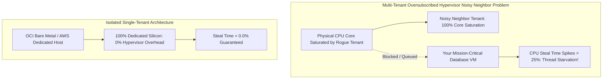

#### AWS Implementation
Terraform configuration provisioning an Amazon EC2 instance on a dedicated Nitro instance family with CloudWatch alarms alerting on elevated CPU steal time: [Doc: AWS EC2 CPU Utilization & Steal Time Metrics, checked 2026].

```hcl
# CloudWatch Metric Alarm for CPU Steal Time
resource "aws_cloudwatch_metric_alarm" "cpu_steal_alarm" {
  alarm_name          = "database-cpu-steal-alarm"
  comparison_operator = "GreaterThanThreshold"
  evaluation_periods  = 2
  metric_name         = "CPUSteal"
  namespace           = "CWAgent"
  period              = 60
  statistic           = "Average"
  threshold           = 5.0 # Alert if Steal Time exceeds 5%
  alarm_description   = "Triggered when hypervisor oversubscription causes CPU steal > 5%"

  dimensions = {
    InstanceId = aws_instance.isolated_db.id
  }

  alarm_actions = [aws_sns_topic.sre_alerts.arn]
}

# Production EC2 Instance using Dedicated Tenancy
resource "aws_instance" "isolated_db" {
  ami           = var.database_ami_id
  instance_type = "r6i.4xlarge"
  tenancy       = "dedicated" # Runs on hardware dedicated exclusively to your AWS account

  monitoring                  = true # Enable 1-minute detailed CloudWatch monitoring
  vpc_security_group_ids      = [var.database_sg_id]
  subnet_id                   = var.private_subnet_id

  tags = {
    Name = "prod-isolated-database"
  }
}
```

Diagnostic verification command on Linux:
```bash
# Inspect real-time CPU Steal percentage in column 8 (%st)
vmstat 1 5
# Or inspect per-CPU core steal time
mpstat -P ALL 1 5
```

#### OCI Implementation
Terraform configuration provisioning an OCI Dedicated Virtual Machine Host (DVMH) guaranteeing complete physical isolation: [Doc: OCI Dedicated Virtual Machine Hosts, checked 2026].

```hcl
# OCI Dedicated Virtual Machine Host (DVMH)
resource "oci_core_dedicated_vm_host" "dedicated_host" {
  compartment_id      = var.compartment_id
  availability_domain = var.ad
  display_name        = "prod-dedicated-physical-host"

  # Dedicated physical hardware capacity
  dedicated_vm_host_shape = "DVMS.Standard3.64"
}

# Provision VM Instance placed strictly onto the dedicated physical host
resource "oci_core_instance" "isolated_compute" {
  compartment_id      = var.compartment_id
  availability_domain = var.ad
  display_name        = "zero-noisy-neighbor-compute"
  shape               = "VM.Standard3.Flex"

  # Pin VM directly to dedicated host OCID
  dedicated_vm_host_id = oci_core_dedicated_vm_host.dedicated_host.id

  shape_config {
    ocpus         = 16
    memory_in_gbs = 64
  }

  source_details {
    source_type = "image"
    image_id    = var.oracle_linux_image_ocid
  }

  create_vnic_details {
    subnet_id = var.private_subnet_ocid
  }
}
```

#### Common Trap
Restarting an instance on a multi-tenant host hoping that a noisy neighbor problem will resolve itself without checking instance placement. When an EC2 or OCI instance is rebooted (`sudo reboot`), the operating system restarts *in-place on the exact same physical hypervisor*! To force the cloud control plane to allocate your instance onto a brand-new, different physical hardware host, you must explicitly **Stop** the instance (`aws ec2 stop-instances`), wait for the stopped state, and then **Start** it. This unbinds the virtual machine from the degraded hypervisor and provisions it onto fresh physical silicon.

#### Follow-up Question
Why can high CPU Steal Time cause distributed database clusters (like Cassandra, Raft, or etcd) to trigger unexpected leader elections and split-brain false alarms?

*Answer*: Distributed consensus algorithms rely on periodic heartbeat messages (e.g., Raft leader heartbeats sent every 100ms). When a cluster leader suffers 25% CPU steal time, its OS scheduler threads freeze for 300ms. Sibling cluster nodes stop receiving heartbeats, assume the leader has crashed, and initiate a new leader election. When the original leader wakes up, it contests leadership, causing cluster flap, quorum invalidation, and severe latency storms.

---

### Q495: Distributed Deadlocks and Connection Pool Exhaustion in Microservices

#### Question
How do you detect, analyze, and remediate distributed deadlocks and cascading connection pool exhaustion across microservices using socket metrics (`ss`/`netstat`), thread dumps, and circuit breaking?

#### Short Answer
Cascading connection pool exhaustion occurs when an upstream service (Service A) makes synchronous calls to a downstream service (Service B) that experiences latent database queries or distributed deadlocks. As Service B's response time slows from 10ms to 2000ms, Service A's HTTP worker threads remain blocked waiting for responses, rapidly consuming Service A's entire inbound connection pool. Subsequent requests queue up and fail across all dependencies, bringing down the entire microservice mesh. To remediate: (1) Enforce **Aggressive Ingress & Egress HTTP Timeouts** (e.g., 500ms socket timeouts); (2) Implement **Circuit Breakers** (Resilience4j / Envoy) to fail fast when downstream error rates rise; and (3) Analyze socket queue states via `ss -tan` and inspect JVM thread dumps for `BLOCKED` states.

#### Deep Answer
Distributed deadlocks and connection starvation are among the most catastrophic failure modes in distributed systems:

**The Anatomy of a Cascading Collapse**:
1. **The Trigger (Downstream Lock)**:
   - Service C executes an unindexed SQL query or encounters a row-level lock in PostgreSQL, taking 5 seconds to respond.
2. **Upstream Contagion**:
   - Service B has a thread pool of 200 workers.
   - At 100 requests/sec, all 200 workers are blocked waiting for Service C within 2 seconds.
   - Service B's incoming TCP listen queue (`somaxconn`) overflows. Service B now returns 504 Gateway Timeout.
3. **Mesh-Wide Infection**:
   - Service A calls Service B. Service A's connection pool to Service B exhausts.
   - Service A's frontend load balancer starts dropping client connections.
   - A single slow database query in Service C has taken down Services A, B, and C!

**Diagnostic Inspection with `ss` and Thread Dumps**:
- `ss -tan '( dport = :8080 or sport = :8080 )'`:
  - `Recv-Q > 0`: The application process is CPU-starved or thread-blocked and failing to call `accept()` on incoming sockets.
  - `Send-Q > 0`: The remote peer has stopped reading data or the network link is saturated.
- Capture JVM/Go thread dumps:
  - Java: `jcmd <PID> Thread.print`
  - Look for hundreds of threads in state `WAITING` or `TIMED_WAITING` on `org.apache.http.impl.conn.PoolingHttpClientConnectionManager.leaseConnection`.

**Remediation Architecture: Circuit Breakers & Bulkheads**:
- **Bulkhead Pattern**: Isolate connection pools per downstream target. If Service B is slow, only the pool allocated to Service B exhausts; calls to Service D continue unaffected.
- **Circuit Breaker (Open State)**: If Service B fails or exceeds latency thresholds for $> 50\%$ of calls over a 10-second window, the circuit breaker opens immediately. Future calls fail instantly in 0.1ms without opening sockets or blocking threads, allowing downstream services to recover.

#### Architecture
```mermaid
graph TD
    User[User Ingress Traffic] --> SvcA[Service A: Web Gateway]
    
    subgraph Cascading Failure Without Circuit Breakers
        SvcA -->|All 500 Threads Blocked!| SvcB[Service B: Order API]
        SvcB -->|All 200 Threads Blocked!| SvcC[Service C: Payment API]
        SvcC -->|Row Lock / Slow Query 5000ms| DB[(Database Deadlock)]
        Note over SvcA,SvcC: Entire Microservice Fleet Collapses!
    end

    subgraph Resilient Architecture Bulkheads & Circuit Breakers
        SvcA2[Service A] --> CB{Circuit Breaker: Is SvcB Degraded?}
        CB -->|Open: Fail Fast in 0.1ms| Fallback[Return Cached Response / Graceful Degradation]
        CB -.->|Closed: Healthy Traffic Only| SvcB2[Service B Protected]
    end
```

#### AWS Implementation
Diagnosing socket starvation and configuring Envoy / AWS App Mesh Circuit Breakers to prevent cascading pool collapse: [Doc: AWS App Mesh Circuit Breaking & Connection Pools, checked 2026].

```hcl
# AWS App Mesh Virtual Node with strict Circuit Breaking and Connection Limits
resource "aws_appmesh_virtual_node" "order_service" {
  name                 = "order-service-node"
  mesh_name            = var.mesh_name

  spec {
    backend {
      virtual_service {
        virtual_service_name = "payment-service.prod.local"
      }
    }

    # Circuit Breaker thresholds protecting against connection starvation
    backend_defaults {
      client_policy {
        tls {
          enforce = true
          validation {
            trust {
              acm {
                certificate_authority_arns = [var.acm_ca_arn]
              }
            }
          }
        }
        connection_pool {
          tcp {
            max_connections = 100 # Maximum open TCP connections
          }
          http {
            max_connections      = 100
            max_pending_requests = 10  # Drop immediately if pending exceeds 10
          }
        }
      }
    }
  }
}
```

Linux bash diagnostic script inspecting socket states during an active incident:
```bash
#!/usr/bin/env bash
# diagnose-socket-exhaustion.sh: Inspect TCP socket queues and connection states
set -euo pipefail

echo "=================================================="
echo "ACTIVE TCP CONNECTION STATES"
echo "=================================================="
ss -s

echo "=================================================="
echo "TOP 10 DESTINATION IPS BY ESTABLISHED CONNECTIONS"
echo "=================================================="
ss -tan state established | awk '{print $4}' | cut -d: -f1 | sort | uniq -c | sort -nr | head -n 10

echo "=================================================="
echo "INSPECTING LISTEN SOCKETS WITH BACKLOG CONGESTION"
echo "=================================================="
# High Recv-Q on LISTEN indicates application thread starvation!
ss -lnt '( Recv-Q > 0 )'
```

#### OCI Implementation
A Go microservice implementation utilizing Resilience4j / Go-kit Circuit Breaking and HTTP transport timeouts connecting to OCI Autonomous Database: [Doc: OCI Go SDK Connection Management & Timeouts, checked 2026].

```go
// client.go: Resilient HTTP client with strict timeouts and connection limits
package main

import (
	"net"
	"net/http"
	"time"
)

func NewResilientHTTPClient() *http.Client {
	// Custom transport enforcing aggressive connection pooling and timeouts
	transport := &http.Transport{
		Proxy: http.ProxyFromEnvironment,
		DialContext: (&net.Dialer{
			Timeout:   2 * time.Second,  // Fast TCP connection timeout
			KeepAlive: 30 * time.Second,
		}).DialContext,
		MaxIdleConns:        100,             // Total idle connections
		MaxIdleConnsPerHost: 20,              // Max idle connections per downstream host
		MaxConnsPerHost:     50,              // Hard ceiling per downstream host (Bulkhead!)
		IdleConnTimeout:     90 * time.Second,
		TLSHandshakeTimeout: 2 * time.Second,
		ExpectContinueTimeout: 1 * time.Second,
	}

	return &http.Client{
		Transport: transport,
		Timeout:   3 * time.Second, // Hard 3-second request deadline (Eliminates hanging!)
	}
}
```

#### Common Trap
Configuring HTTP client libraries with default connection pooling settings. By default, standard libraries (like Apache HttpClient in Java or Go's `http.DefaultTransport`) allow unbounded pending requests or have `MaxIdleConnsPerHost = 2`. When high concurrency hits, the client creates hundreds of transient TCP connections, exhaustively thrashing the operating system's ephemeral port range. Furthermore, omitting request timeouts (`timeout = 0`, the default in Go and Python `requests`) guarantees that a hung downstream service will permanently block client worker threads until the pod runs out of memory.

#### Follow-up Question
What does a high `Recv-Q` value on a listening socket indicate during `ss -lnt` analysis?

*Answer*: On a listening socket (state `LISTEN`), `Recv-Q` represents the current number of fully established TCP connections waiting in the kernel accept queue that have not yet been accepted by the application process via the `accept()` syscall. A high `Recv-Q` indicates that the application process is completely CPU-starved, frozen in a garbage collection pause, or has exhausted its internal worker thread pool, leaving completed client handshakes waiting in kernel queues until they time out.

---

### Q496: Enterprise Multi-Account and Multi-Tenancy Architecture (Landing Zones)

#### Question
How do enterprise cloud architectures structure multi-account and multi-tenancy frameworks (AWS Organizations with Control Tower vs OCI Tenancies and Compartment Hierarchies) to enforce security boundaries, automate account provisioning, and maintain central compliance?

#### Short Answer
Modern cloud governance rejects running multiple business units or environments in a single monolithic cloud account. **Multi-Account Architecture** establishes isolated blast radius boundaries where accounts (AWS) or compartments (OCI) represent autonomous environments (Dev, Stage, Prod) and shared services (Security, Networking, Audit). AWS achieves this via **AWS Organizations** and **AWS Control Tower Landing Zones**, enforcing Service Control Policies (SCPs) from the Organization Root. OCI implements a unified **Tenancy-Compartment Hierarchy** where compartments are logical, policy-governed boundaries within a single global tenancy, providing native cross-compartment IAM inheritance, unified billing, and compartment quotas with zero cross-account federation complexity.

#### Deep Answer
Isolating environments at the IAM and billing layer is the bedrock of enterprise cloud security:

**AWS Multi-Account Framework (Control Tower / Landing Zones)**:
1. **Root & Core Organizational Units (OUs)**:
   - **Root**: Top-level container. Only master billing lives here.
   - **Security OU**: Contains `Log Archive Account` (centralized S3 WORM storage for CloudTrail/Config) and `Security Tooling Account` (GuardDuty, Security Hub).
   - **Infrastructure OU**: Contains `Shared Network Account` (Transit Gateway, Direct Connect) and `Shared Services Account` (CI/CD, artifact registries).
   - **Workloads OU**: Partitioned into `Prod` and `Non-Prod` accounts per product domain.
2. **Preventative Governance (SCPs)**:
   - Guardrails applied at the OU level that restrict even the root administrator of a member account (e.g., denying leaving the organization, denying disabling CloudTrail, denying provisioning outside authorized regions).

**OCI Tenancy & Compartment Hierarchy**:
- In OCI, an enterprise typically possesses a single **Global Tenancy** (the root compartment).
- Inside the tenancy, platforms construct a 6-level deep tree of **Compartments**:
  - `Root -> Security / Network / Production / Development -> Team-A / Team-B`.
- *Advantages over AWS*:
  - **Inherited Policy Model**: An IAM policy applied at the `Production` compartment (`Allow group NetworkAdmins to manage virtual-network-family in compartment Production`) automatically cascades down to all child compartments.
  - **Native Resource Movement**: OCI resources (VCNs, Compute, Databases) can be moved between compartments online without teardown or state migration.
  - **Compartment Quotas**: Enforce strict caps on expensive shapes (e.g., `set compute quota vm-standard-e4-count to 20 in compartment Development`).

#### Architecture
```mermaid
graph TD
    subgraph AWS Organizations Multi-Account Landing Zone
        AWSRoot[AWS Organization Root]
        AWSRoot --> SecOU[Security OU: Log Archive & Security Hub Accounts]
        AWSRoot --> InfraOU[Infra OU: Shared VPC & Transit Gateway Accounts]
        AWSRoot --> WorkloadOU[Workloads OU]
        WorkloadOU --> ProdAcc[Account: Prod-App-01]
        WorkloadOU --> DevAcc[Account: Dev-App-01]
    end

    subgraph OCI Unified Tenancy & Compartment Tree
        OCIRoot[OCI Tenancy: Root Compartment]
        OCIRoot --> SecComp[Compartment: Security & Audit]
        OCIRoot --> NetComp[Compartment: Shared Network VCN & DRG]
        OCIRoot --> WorkloadComp[Compartment: Workloads]
        WorkloadComp --> ProdComp[Compartment: Production-App-01]
        WorkloadComp --> DevComp[Compartment: Development-App-01]
    end
```

#### AWS Implementation
Terraform configuration provisioning an AWS Organizations Organizational Unit (OU) structure with guardrail Service Control Policies (SCPs): [Doc: AWS Organizations & Control Tower Landing Zones, checked 2026].

```hcl
# AWS Organization definition
resource "aws_organizations_organization" "org" {
  aws_service_access_principals = [
    "cloudtrail.amazonaws.com",
    "config.amazonaws.com",
    "sso.amazonaws.com"
  ]
  feature_set = "ALL"
}

# Workloads Organizational Unit
resource "aws_organizations_organizational_unit" "workloads" {
  name      = "Workloads"
  parent_id = aws_organizations_organization.org.roots[0].id
}

resource "aws_organizations_organizational_unit" "production" {
  name      = "Production"
  parent_id = aws_organizations_organizational_unit.workloads.id
}

# Member Account creation under Production OU
resource "aws_organizations_account" "checkout_prod" {
  name      = "checkout-service-production"
  email     = "aws-checkout-prod@corp.example.com"
  parent_id = aws_organizations_organizational_unit.production.id
  role_name = "OrganizationAccountAccessRole"
}

# Restrict authorized AWS deployment regions via SCP
resource "aws_organizations_policy" "region_restriction_scp" {
  name        = "RegionRestrictionPolicy"
  description = "Deny all API operations outside us-east-1 and us-west-2"
  content     = jsonencode({
    Version = "2012-10-17"
    Statement = [{
      Sid       = "DenyUnauthorizedRegions"
      Effect    = "Deny"
      NotAction = [
        "iam:*",
        "organizations:*",
        "route53:*",
        "budgets:*",
        "wafv2:*",
        "cloudfront:*",
        "globalaccelerator:*"
      ]
      Resource  = "*"
      Condition = {
        StringNotEquals = {
          "aws:RequestedRegion" = ["us-east-1", "us-west-2"]
        }
      }
    }]
  })
}

resource "aws_organizations_policy_attachment" "attach_scp" {
  policy_id = aws_organizations_policy.region_restriction_scp.id
  target_id = aws_organizations_organizational_unit.workloads.id
}
```

#### OCI Implementation
Terraform configuration provisioning an enterprise OCI Compartment hierarchy with inherited IAM policies and compartment compute quotas: [Doc: OCI Compartment Hierarchies & Quotas, checked 2026].

```hcl
# Parent Compartment: Workloads
resource "oci_identity_compartment" "workloads_comp" {
  compartment_id = var.tenancy_ocid
  name           = "Workloads"
  description    = "Parent compartment for all enterprise workloads"
}

# Child Compartment: Production
resource "oci_identity_compartment" "prod_comp" {
  compartment_id = oci_identity_compartment.workloads_comp.id
  name           = "Production"
  description    = "Production application infrastructure"
}

# Child Compartment: Development
resource "oci_identity_compartment" "dev_comp" {
  compartment_id = oci_identity_compartment.workloads_comp.id
  name           = "Development"
  description    = "Development testing sandbox"
}

# Compartment Quota Policy: Restrict expensive GPU shapes in Development
resource "oci_limits_quota" "dev_compute_quota" {
  compartment_id = oci_identity_compartment.dev_comp.id
  name           = "dev-compute-spend-cap"
  description    = "Prevent spinning up expensive GPU and high-memory instances in Dev"

  statements = [
    "zero compute quotas in compartment Development where shape.name = 'BM.GPU.*'",
    "set compute quota vm-standard-e4-count to 20 in compartment Development"
  ]
}

# Inherited Policy: Security Admins manage resources across all child compartments
resource "oci_identity_policy" "sec_admin_policy" {
  compartment_id = oci_identity_compartment.workloads_comp.id
  name           = "Workloads-Security-Admin-Policy"
  description    = "Grants Security team audit and inspection privileges"

  statements = [
    "Allow group SecurityAuditors to inspect all-resources in compartment Workloads"
  ]
}
```

#### Common Trap
Deploying AWS multi-account landing zones where member accounts maintain direct internet gateways (IGWs) and local VPC peering connections to other member accounts. This creates unmonitored lateral egress paths and bypasses centralized security inspection. Enterprise landing zones mandate **Centralized Egress**: member accounts route all `0.0.0.0/0` outbound traffic across an AWS Transit Gateway or OCI Dynamic Routing Gateway to a dedicated **Central Inspection Network Account/Compartment** hosting scalable firewalls (AWS Network Firewall / Palo Alto).

#### Follow-up Question
How does an AWS Service Control Policy (SCP) differ from a standard IAM permission policy?

*Answer*: An IAM policy grants positive permissions to a principal (User/Role). An SCP does **not** grant permissions; it acts as a preventative filter (permission boundary). If an SCP denies an action (or fails to allow it in the whitelist), no IAM principal in that account—including the local `root` user—can execute that action, even if the user has `AdministratorAccess` attached in IAM.

---

### Q497: Hub-and-Spoke vs Mesh Network Topologies (Transit Gateway vs DRG v2)

#### Question
How do cloud transit hubs (AWS Transit Gateway with Cloud WAN vs OCI Dynamic Routing Gateway DRG v2) resolve the quadratic scalability collapse ($N(N-1)/2$) of full-mesh VPC/VCN peering, and how is centralized security inspection architected?

#### Short Answer
Point-to-point VPC/VCN peering requires a full-mesh topology. As the number of VPCs ($N$) grows, the number of peering connections scales quadratically ($O(N^2) = \frac{N(N-1)}{2}$): 50 VPCs require 1,225 peering connections and thousands of route table entries, making routing unmanageable. **Hub-and-Spoke Topologies** replace full-mesh peering with a centralized cloud transit router: **AWS Transit Gateway (TGW)** and **OCI Dynamic Routing Gateway (DRG v2)**. Each VPC/VCN establishes a single attachment to the central hub ($O(N)$ connections), route propagation is handled via BGP or transit route tables, and all east-west and north-south traffic can be steered through a centralized security inspection appliance with zero transitive routing hacks.

#### Deep Answer
VPC Peering does not support transitive routing (VPC A $\leftrightarrow$ VPC B $\leftrightarrow$ VPC C does **not** allow VPC A to talk to VPC C).

**The Hub-and-Spoke Architecture**:
1. **Attachment Model**:
   - Each VPC or on-premises IPsec/Direct Connect link establishes an attachment to the central Transit Hub.
   - AWS TGW supports up to 50 Gbps per VPC attachment (with ECMP scaling to hundreds of Gbps).
   - OCI DRG v2 supports multi-attachment routing across VCNs, FastConnect circuits, and IPSec VPNs with sub-millisecond switching.

2. **Route Domain Segmentation via Route Tables**:
   - The transit hub contains multiple internal route tables:
     - **Production Route Table**: Can route to Shared Services, but routes to Development are omitted (guaranteeing physical network isolation).
     - **Development Route Table**: Routes to Shared Services only.
     - **Inspection Route Table**: Routes all traffic through Next-Generation Firewalls.

3. **Centralized East-West and North-South Inspection**:
   - *East-West (VPC to VPC)*: Traffic from Workload VPC A to Workload VPC B is routed into the TGW, which forces the packet into an **Inspection VPC** containing AWS Network Firewall or Palo Alto appliances. Once inspected and permitted, the firewall sends the packet back to the TGW, which forwards it to Workload VPC B.
   - *North-South (Egress to Internet)*: All private subnets send `0.0.0.0/0` to the TGW, traversing central NAT gateways and egress firewalls, eliminating duplicate NAT Gateway fees across dozens of accounts.

#### Architecture
```mermaid
graph TD
    subgraph Spoke VPCs / VCNs O(N) Connections
        VPC_Prod[VPC: Production Workloads]
        VPC_Dev[VPC: Development Sandbox]
        VPC_Shared[VPC: Shared Services CI/CD]
    end

    subgraph Central Transit Hub Layer
        Hub[AWS Transit Gateway / OCI DRG v2]
        HubRoute[Transit Route Tables & VRF Segmentation]
        Hub <==> HubRoute
    end

    subgraph Centralized Inspection & Egress
        Hub <==> InspVPC[Security Inspection VPC: AWS Network Firewall]
        InspVPC --> CentralNAT[Centralized Egress NAT Gateways]
        CentralNAT --> Internet[Public Internet]
    end

    VPC_Prod <==>|Single Attachment| Hub
    VPC_Dev <==>|Single Attachment| Hub
    VPC_Shared <==>|Single Attachment| Hub
```

#### AWS Implementation
Terraform configuration provisioning an AWS Transit Gateway, VPC attachments, and segmented route tables: [Doc: AWS Transit Gateway Routing Architecture, checked 2026].

```hcl
# AWS Transit Gateway
resource "aws_ec2_transit_gateway" "central_hub" {
  description                     = "Enterprise Central Transit Gateway Hub"
  auto_accept_shared_attachments  = "enable"
  default_route_table_association = "disable" # Manual route table isolation
  default_route_table_propagation = "disable"

  tags = {
    Name = "central-transit-gateway"
  }
}

# Production Transit Route Table
resource "aws_ec2_transit_gateway_route_table" "prod_tgw_rt" {
  transit_gateway_id = aws_ec2_transit_gateway.central_hub.id
  tags = { Name = "prod-transit-route-table" }
}

# Attachment for Production VPC
resource "aws_ec2_transit_gateway_vpc_attachment" "prod_attachment" {
  transit_gateway_id = aws_ec2_transit_gateway.central_hub.id
  vpc_id             = var.prod_vpc_id
  subnet_ids         = var.prod_tgw_subnet_ids # Dedicated /28 subnets for TGW ENIs

  transit_gateway_default_route_table_association = false
  transit_gateway_default_route_table_propagation = false
}

# Associate Production Attachment with Production Route Table
resource "aws_ec2_transit_gateway_route_table_association" "prod_assoc" {
  transit_gateway_attachment_id  = aws_ec2_transit_gateway_vpc_attachment.prod_attachment.id
  transit_gateway_route_table_id = aws_ec2_transit_gateway_route_table.prod_tgw_rt.id
}

# Route default outbound traffic to Inspection VPC Attachment
resource "aws_ec2_transit_gateway_route" "default_to_inspection" {
  destination_cidr_block         = "0.0.0.0/0"
  transit_gateway_attachment_id  = var.inspection_vpc_attachment_id
  transit_gateway_route_table_id = aws_ec2_transit_gateway_route_table.prod_tgw_rt.id
}
```

#### OCI Implementation
Terraform configuration provisioning an OCI Dynamic Routing Gateway (DRG v2) with VCN attachments and custom DRG route tables: [Doc: OCI Dynamic Routing Gateway v2 Transit Routing, checked 2026].

```hcl
# OCI Dynamic Routing Gateway (DRG v2)
resource "oci_core_drg" "central_drg" {
  compartment_id = var.compartment_id
  display_name   = "central-hub-drg-v2"
}

# DRG Route Table for Production VCNs
resource "oci_core_drg_route_table" "prod_drg_rt" {
  drg_id       = oci_core_drg.central_drg.id
  display_name = "prod-drg-route-table"
}

# VCN Attachment to DRG
resource "oci_core_drg_attachment" "prod_vcn_attachment" {
  drg_id       = oci_core_drg.central_drg.id
  display_name = "prod-vcn-attachment"

  network_details {
    id   = var.prod_vcn_ocid
    type = "VCN"
  }

  drg_route_table_id = oci_core_drg_route_table.prod_drg_rt.id
}

# DRG Route Rule steering all traffic through Inspection VCN Attachment
resource "oci_core_drg_route_table_route_rule" "route_to_inspection" {
  drg_route_table_id         = oci_core_drg_route_table.prod_drg_rt.id
  destination                = "0.0.0.0/0"
  destination_type           = "CIDR_BLOCK"
  next_hop_drg_attachment_id = var.inspection_drg_attachment_id
}
```

#### Common Trap
Deploying AWS Transit Gateway attachments into the primary application subnets rather than creating **Dedicated Transit Gateway Subnets** (e.g., small `/28` subnets per AZ). If an attachment is placed in an application subnet sharing a route table that points `0.0.0.0/0` to the TGW, packets entering the subnet from the TGW can trigger an immediate asymmetric routing loop. Always provision dedicated, clean `/28` subnets reserved exclusively for TGW ENI attachments with dedicated route tables.

#### Follow-up Question
How does Appliance Mode in AWS Transit Gateway solve asymmetric routing through stateful firewalls?

*Answer*: Stateful firewalls track TCP state and drop packets if they see response traffic without having inspected the corresponding request traffic. In a multi-AZ deployment, AWS TGW hashes traffic across AZ attachments, which can cause the forward packet to traverse Firewall-AZ1 while the return packet traverses Firewall-AZ2 (causing the firewall to drop the connection). Enabling **Transit Gateway Appliance Mode** on the Inspection VPC attachment forces TGW to maintain symmetric flow pinning, guaranteeing that both forward and reverse packets traverse the exact same network interface in the exact same Availability Zone.

---

### Q498: Hybrid Cloud Private Connectivity (Direct Connect vs FastConnect)

#### Question
How do enterprise dedicated cloud interconnects—AWS Direct Connect (DX) and OCI FastConnect—architect high-availability, low-latency private connectivity to on-premises datacenters using BGP routing and MACsec line-rate encryption?

#### Short Answer
Enterprise cloud interconnects bypass the public internet entirely, establishing private Layer 2/3 physical cross-connects between enterprise routers and cloud edge routers at colocation facilities (Equinix, Megaport). **AWS Direct Connect** and **OCI FastConnect** provide predictable throughput (1 Gbps to 100 Gbps), sub-5-millisecond latency, and reduced data egress rates. Redundancy requires the **Dual-Router High Availability Model** (two physical cross-connects across two distinct colocation provider facilities running BGP multipathing via ECMP or active/passive BGP local preference). To encrypt traffic over the physical fiber without CPU IPsec overhead, modern links employ hardware-based **MACsec (IEEE 802.1AE)** line-rate encryption.

#### Deep Answer
Relying on public IPsec VPNs for core enterprise connectivity introduces severe operational risks: internet route flapping, variable jitter, and IPsec crypto throughput bottlenecks capped at $\sim 1.25\text{ Gbps}$ per tunnel.

**Direct Connect & FastConnect Architecture Elements**:
1. **Physical Connectivity (Cross-Connect)**:
   - Enterprise router inside a Meet-Me-Room (MMR) connects via single-mode fiber to cloud provider cage switches.
   - Speeds: 1 Gbps, 10 Gbps, or 100 Gbps dedicated optical ports.
2. **Virtual Interfaces (Layer 3 BGP Peering)**:
   - **Private VIF / Private Virtual Circuit**: Connects directly to private RFC 1918 VPCs/VCNs via Transit Gateway or Dynamic Routing Gateway (DRG).
   - **Public VIF / Public Virtual Circuit**: Advertises cloud public IP prefixes (S3, DynamoDB, OCI Object Storage) directly over the private link, avoiding public internet routing entirely.
3. **BGP Path Selection & Routing Policies**:
   - **Active-Passive Routing**:
     - On-Premises to Cloud: Use **BGP Local Preference** (`local-pref 200` on Primary, `local-pref 100` on Secondary).
     - Cloud to On-Premises: Use **AS-Path Prepending** (prepend your ASN 3 times on the Secondary link) or BGP **Multi-Exit Discriminator (MED)**.
   - **Active-Active Routing**:
     - Enable **Equal-Cost Multi-Pathing (ECMP)**. Both links advertise identical AS paths; traffic is balanced across both physical fibers.
4. **Line-Rate Encryption with MACsec (802.1AE)**:
   - Traditional IPsec encrypts at Layer 3, reducing MTU and capping throughput at appliance CPU limits.
   - MACsec encrypts at Layer 2 (Ethernet frame level) inside the physical NIC hardware at the full 10 Gbps or 100 Gbps line-rate with zero packet overhead and sub-microsecond latency, satisfying FedRAMP / HIPAA encryption-in-transit mandates.

#### Architecture
```mermaid
graph TD
    subgraph Corporate On-Premises Datacenter
        Router1[Primary Core Router: Colocation A]
        Router2[Secondary Core Router: Colocation B]
    end

    subgraph Dedicated Cloud Interconnect Layer 2/3
        Router1 <==>|100 Gbps MACsec Line-Rate Direct Connect / FastConnect| CloudEdge1[Cloud Edge PoP 1: BGP Session]
        Router2 <==>|100 Gbps MACsec Line-Rate Direct Connect / FastConnect| CloudEdge2[Cloud Edge PoP 2: BGP Session]
    end

    subgraph Cloud Private Backbone AWS / OCI
        CloudEdge1 <==> Gateway[AWS Direct Connect Gateway / OCI DRG v2]
        CloudEdge2 <==> Gateway
        Gateway <==> PrivateVPC[Private Production VPCs / OCI VCNs]
    end
```

#### AWS Implementation
Terraform configuration provisioning an AWS Direct Connect Gateway, Private Virtual Interface (VIF), and BGP routing parameters: [Doc: AWS Direct Connect Gateway & BGP Configuration, checked 2026].

```hcl
# AWS Direct Connect Gateway (Global BGP transit construct)
resource "aws_dx_gateway" "corp_dx_gw" {
  name            = "corp-global-dx-gateway"
  amazon_side_asn = "64512" # Private ASN for AWS side
}

# Dedicated Direct Connect Connection (e.g. 10 Gbps link)
resource "aws_dx_connection" "primary_dx" {
  name            = "primary-equinix-dc-connection"
  bandwidth       = "10Gbps"
  location        = "EqDC2" # Equinix Ashburn colocation facility
  request_macsec  = true   # Request 802.1AE MACsec hardware encryption
}

# Private Virtual Interface (VIF) linking physical DX to Direct Connect Gateway
resource "aws_dx_private_virtual_interface" "primary_vif" {
  connection_id    = aws_dx_connection.primary_dx.id
  name             = "primary-prod-vif"
  vlan             = 4094
  address_family   = "ipv4"
  bgp_asn          = 65000 # On-premises corporate ASN
  bgp_auth_key     = var.dx_bgp_auth_key
  dx_gateway_id    = aws_dx_gateway.corp_dx_gw.id

  amazon_address   = "169.254.255.1/30"
  customer_address = "169.254.255.2/30"
}

# Associate DX Gateway with AWS Transit Gateway for VPC connectivity
resource "aws_dx_gateway_association" "dx_to_tgw" {
  dx_gateway_id         = aws_dx_gateway.corp_dx_gw.id
  associated_gateway_id = aws_ec2_transit_gateway.central_hub.id

  allowed_prefixes = [
    "10.0.0.0/8",
    "172.16.0.0/12"
  ]
}
```

#### OCI Implementation
Terraform configuration provisioning an OCI FastConnect Virtual Circuit linked to an OCI Dynamic Routing Gateway (DRG): [Doc: OCI FastConnect Virtual Circuit & BGP Routing, checked 2026].

```hcl
# OCI FastConnect Private Virtual Circuit
resource "oci_core_virtual_circuit" "primary_fastconnect" {
  compartment_id       = var.compartment_id
  display_name         = "primary-fastconnect-circuit"
  type                 = "PRIVATE"
  bandwidth_shape_name = "10 Gbps"
  gateway_id           = oci_core_drg.central_drg.id

  # BGP Configuration
  customer_bgp_asn     = 65000 # Corporate On-Premises ASN
  oracle_bgp_asn       = 31898 # Oracle Official BGP ASN

  customer_asn = 65000

  cross_connect_mappings {
    oracle_bgp_peering_ip   = "10.254.0.1/30"
    customer_bgp_peering_ip = "10.254.0.2/30"
    vlan                    = 200
  }

  routing_policy = ["MARKET"] # Global or Market routing scope
}
```

On-premises Cisco/Juniper BGP configuration snippet showing AS-Path prepending for failover:
```cisco
! On-Premises Secondary Router BGP Prepending Configuration
router bgp 65000
 neighbor 10.254.0.1 remote-as 31898
 route-map OCI-OUT permit 10
  set as-path prepend 65000 65000 65000
```

#### Common Trap
Configuring dual Direct Connect or FastConnect circuits terminating in the **same physical colocation facility or sharing the same fiber conduit**. If a backhoe digs up the single fiber trench entering the Equinix building, or if the single colocation provider loses power, both "redundant" links fail simultaneously! High-availability SLA compliance (AWS 99.99% DX SLA) requires **Diverse Data Centers**: terminating Circuit 1 at Location A (e.g., Equinix Ashburn) and Circuit 2 at Location B (e.g., CoreSite Reston) across independent physical fiber paths and separate customer edge routers.

#### Follow-up Question
What happens when BGP session keep-alive timers expire on a Direct Connect link?

*Answer*: By default, BGP keep-alive timers are 30 seconds with a 90-second hold timer. If a fiber link drops without optical carrier loss signaling, it takes **up to 90 seconds** for BGP to declare the peer dead and converge traffic onto the secondary circuit, resulting in 1.5 minutes of complete packet loss. To resolve this, enterprise interconnects must enable **Bidirectional Forwarding Detection (BFD)**. BFD sends sub-second micro-probes (e.g., 300ms intervals), detecting physical path failures and triggering BGP sub-second failover in $< 1$ second.

---

### Q499: Zero-Trust Cloud Architecture and Microsegmentation

#### Question
How do you architect a production Zero-Trust Network Architecture (ZTNA) in cloud environments using cryptographically verified workload identities (SPIFFE/SPIRE), mutual TLS (mTLS), identity-aware proxies, and microsegmentation?

#### Short Answer
Traditional perimeter-based network security ("castle-and-moat") assumes that any traffic inside the private VPC/VCN is trusted, allowing an attacker who breaches a single public web server to move laterally across all internal databases and APIs unhindered. **Zero-Trust Network Architecture (ZTNA)** operates on the axiom: *"Never Trust, Always Verify"*. Every network packet, API call, and microservice transaction must be authenticated, authorized, and encrypted. In cloud-native systems, this is implemented via: (1) **Cryptographic Workload Identity** (SPIFFE/SPIRE issuing short-lived X.509 certificates); (2) **Universal mTLS** enforcing bidirectional encryption and identity verification; (3) **Identity-Aware Proxies** replacing open VPNs; and (4) **Granular Microsegmentation** at Layer 4 (Security Groups/NSGs) and Layer 7 (Service Mesh AuthorizationPolicies).

#### Deep Answer
Zero-Trust shifts security from static IP addresses to dynamic cryptographic identities:

1. **The Fallacy of IP-Based Security**:
   - IP addresses are ephemeral in Kubernetes and autoscaling fleets: an IP associated with a frontend pod at 14:00 may be recycled and assigned to an untrusted batch worker at 14:05.
   - Attackers spoof IPs, exploit SSRF vulnerabilities, or leverage compromised VPN bastions to move laterally.

2. **Workload Identity Attestation (SPIFFE/SPIRE)**:
   - **SPIFFE (Secure Production Identity Framework for Everyone)**: Defines a standard URI format for workload identity:
     `spiffe://corp.internal/ns/production/sa/payment-service`
   - **SPIRE (SPIFFE Runtime Engine)**: An agent running on each compute node that attest workloads based on kernel primitives (cgroups, container UID, Kubernetes ServiceAccount).
   - Once attested, SPIRE injects short-lived X.509 SVID (SPIFFE Verifiable Identity Document) certificates rotated automatically every 60 minutes.

3. **Layer 7 Service Mesh Microsegmentation (Istio / Linkerd / Cilium)**:
   - Microservices communicate exclusively over **mTLS**.
   - Envoy sidecars terminate mTLS and evaluate **AuthorizationPolicies**:
     ```yaml
     # Only the checkout service can call the payment API!
     rule:
       from:
         - source: { principals: ["spiffe://corp.internal/ns/prod/sa/checkout"] }
       to:
         - operation: { methods: ["POST"], paths: ["/v1/charge"] }
     ```
   - Even if an attacker gains root access on the marketing web container, their requests to `/v1/charge` are rejected at the Envoy proxy boundary with HTTP 403 because their SPIFFE identity does not match.

4. **Identity-Aware Proxies (IAP / BeyondCorp Model)**:
   - Eliminates corporate client-to-site VPNs.
   - Engineers access internal dashboards (ArgoCD, Kibana, Jenkins) via an Identity-Aware Proxy that evaluates contextual risk (SSO login + FIDO2 hardware token + managed device health cert) before proxying individual HTTPS requests.

#### Architecture
```mermaid
graph TD
    subgraph Compromised Pod Lateral Movement Blocked
        Attacker[Compromised Web Container]
        Attacker -.->|Attempt Raw TCP Connect to DB| DBGate[Layer 4 Network Security Group / Calico]
        DBGate -.->|Drop Packet: Denied by Microsegmentation| Dropped[Dropped at Kernel]
    end

    subgraph Zero-Trust Cryptographic Workflow
        ServiceA[Checkout Service: Pod] --> SidecarA[Envoy Sidecar Proxy]
        SPIRE[SPIRE Agent: Node Attestation] -->|Inject Short-Lived X.509 SVID Cert| SidecarA
        SPIRE -->|Inject Short-Lived X.509 SVID Cert| SidecarB[Envoy Sidecar Proxy]

        SidecarA ==>|1. Mutual TLS Handshake: Verify SPIFFE ID| SidecarB
        SidecarB --> AuthZ{2. Layer 7 AuthPolicy: Is Principal == Checkout?}
        AuthZ -->|Yes| ServiceB[Payment Service Container]
        AuthZ -->|No| Reject[403 Forbidden: Identity Unauthorized]
    end
```

#### AWS Implementation
Configuring an Istio Layer-7 AuthorizationPolicy enforcing SPIFFE workload identity mTLS verification on AWS EKS: [Doc: AWS EKS Zero-Trust & Istio mTLS Architecture, checked 2026].

```yaml
# Enforce STRICT Mutual TLS across the entire production namespace
apiVersion: security.istio.io/v1beta1
kind: PeerAuthentication
metadata:
  name: default-strict-mtls
  namespace: production
spec:
  mtls:
    mode: STRICT # Plaintext TCP connections rejected immediately
---
# Granular Layer-7 Zero-Trust Authorization Policy
apiVersion: security.istio.io/v1beta1
kind: AuthorizationPolicy
metadata:
  name: payment-rbac-policy
  namespace: production
spec:
  selector:
    matchLabels:
      app: payment-gateway
  action: ALLOW
  rules:
    - from:
        - source:
            # Cryptographic SPIFFE Identity matching the caller's verified ServiceAccount
            principals: ["cluster.local/ns/production/sa/checkout-service-account"]
      to:
        - operation:
            methods: ["POST"]
            paths: ["/api/v1/process-payment"]
```

Terraform configuration applying Layer 4 host-level microsegmentation:
```hcl
# Defense-in-Depth: Security Group allowing traffic ONLY from Checkout SG on specific port
resource "aws_security_group_rule" "payment_microsegmentation" {
  type                     = "ingress"
  from_port                = 8443
  to_port                  = 8443
  protocol                 = "tcp"
  security_group_id        = var.payment_db_sg_id
  source_security_group_id = var.checkout_app_sg_id # Microsegmented SG reference
  description              = "Zero-Trust: Ingress permitted strictly from Checkout application tier"
}
```

#### OCI Implementation
Terraform configuration provisioning OCI Network Security Groups (NSGs) for microsegmented pod networking on OKE with native VCN-native IP allocation: [Doc: OCI OKE Native Pod Networking & NSG Microsegmentation, checked 2026].

```hcl
# OCI Network Security Group for Payment Workloads
resource "oci_core_network_security_group" "payment_nsg" {
  compartment_id = var.compartment_id
  vcn_id         = var.vcn_id
  display_name   = "payment-tier-microsegmented-nsg"
}

# Microsegmentation Rule: Permit traffic strictly from Checkout NSG
resource "oci_core_network_security_group_security_rule" "allow_checkout_only" {
  network_security_group_id = oci_core_network_security_group.payment_nsg.id
  direction                 = "INGRESS"
  protocol                  = "6" # TCP

  source_type = "NETWORK_SECURITY_GROUP"
  source      = var.checkout_nsg_ocid # References Checkout NSG directly

  tcp_options {
    destination_port_range {
      min = 8080
      max = 8080
    }
  }

  description = "Zero-Trust: Restrict payment ingress exclusively to checkout microservice"
}
```

#### Common Trap
Relying on mTLS for network encryption while omitting **Layer 7 Authorization Policies**. Enabling mTLS simply proves that both parties possess certificates issued by the internal cluster CA; it does **not** restrict permissions. If a hacker compromises an unprivileged logging container inside the cluster, that logging container also possesses a valid internal mTLS certificate! Without granular Layer 7 AuthorizationPolicies verifying exact SPIFFE principal names, the compromised container can invoke internal admin APIs over mTLS unimpeded.

#### Follow-up Question
How does Cilium eBPF microsegmentation differ in performance from traditional iptables-based firewalls in Kubernetes?

*Answer*: Standard iptables evaluates firewall rules sequentially ($O(N)$ complexity). In a cluster with 5,000 services and 50,000 rules, every single network packet must traverse thousands of iptables chains, causing severe CPU latency and throughput collapse. Cilium operates inside the Linux kernel via **Extended Berkeley Packet Filter (eBPF)**, using $O(1)$ BPF hash tables to look up endpoint security identities in microseconds, delivering line-rate microsegmentation with near-zero CPU overhead.

---

### Q500: Cloud Disaster Recovery Orchestration and Chaos Architectures (The Ultimate Synthesis)

#### Question
How do you architect, operate, and continuously validate an Active-Active Multi-Region Cloud Architecture across AWS and OCI that achieves near-zero RPO and RTO, eliminates data divergence, and withstands catastrophic regional cloud outages?

#### Short Answer
An Active-Active Multi-Region architecture serves live production user traffic simultaneously from two or more geographically distributed cloud regions (or across both AWS and OCI). Achieving near-zero RTO and RPO requires solving the fundamental laws of distributed systems (CAP Theorem): (1) **Global Traffic Steering** via Anycast DNS and Layer-4 Accelerators routing users to the lowest-latency healthy region; (2) **Bi-Directional Conflict-Free Replication** using globally distributed databases (AWS Aurora Global Database with write forwarding, Amazon DynamoDB Global Tables, or OCI GoldenGate active-active multi-master replication) using CRDTs or Last-Write-Wins timestamps; (3) **Stateless Compute Layer** with automated autoscaling and local read caching; and (4) **Continuous Automated Chaos Invalidation** executing weekly synthetic regional blackhole drills.

#### Deep Answer
This question represents the apex of Cloud Architecture, integrating networking, data consistency, resilience, and operational excellence:

**1. Data Consistency & Replication Across the Speed of Light**:
- Transatlantic or cross-continental latency is bounded by physics: roundtrip latency between Virginia (`us-east-1`) and Frankfurt (`eu-central-1`) is $\approx 75\text{ to }90\text{ ms}$.
- Synchronous replication across regions is impossible for high-throughput transactional applications (every SQL `INSERT` would incur a 90ms penalty, killing write throughput).
- **Asynchronous Replication with Conflict Resolution**:
  - Writes occur locally in the user's home region.
  - Changes replicate asynchronously across the cloud backbone in $< 1$ second.
  - **Conflict-Free Replicated Data Types (CRDTs)** or **Last-Write-Wins (LWW)** resolve concurrent write collisions (e.g., User updates their cart in Region A while their spouse updates in Region B).
  - For strictly consistent financial transactions, employ **Home Region Partitioning (Sharding by Tenant/User ID)**: all writes for User 101 route to Region A; all writes for User 102 route to Region B, eliminating multi-master write conflicts.

**2. Instant Regional Failover (Sub-10s RTO)**:
- During a catastrophic regional outage in `us-east-1`:
  - Route 53 Application Recovery Controller (ARC) or OCI Traffic Management detects regional health check failures.
  - The routing plane instantly redirects 100% of global DNS traffic to `us-west-2` or OCI `us-ashburn-1` in $< 5$ seconds.
  - Secondary compute capacity is pre-warmed using minimum baseline reservation (avoiding cold-start capacity exhaustion).

**3. Split-Brain & Data Divergence Protection**:
- If a network partition severs cross-region replication links, both regions continue accepting writes independently, causing **Data Divergence (Split-Brain)**.
- *Fencing Token / Epoch Locks*: Use a distributed quorum consensus service (running across 3 regions or leveraging a third lightweight witness region) to elect an active write master. If a region loses quorum connectivity, it immediately degrades gracefully to **Read-Only Mode**, preserving database integrity.

**4. Continuous Resilience Validation (Chaos Engineering)**:
- A multi-region DR architecture is a liability if tested only during real disasters.
- Implement automated **Regional Blackhole Testing** (via Chaos Mesh / AWS Fault Injection Service) in staging and production canary rings: automatically severing cross-region transit routes monthly to prove that failover occurs autonomously within SLA.

#### Architecture
```mermaid
graph TD
    subgraph Global User Ingress Anycast Layer
        GlobalUser[Global Users: Worldwide] --> Anycast[AWS Global Accelerator / OCI Anycast DNS]
    end

    subgraph Primary Region: AWS us-east-1
        Anycast -->|Active Traffic: 50%| ALB1[Application Load Balancer]
        ALB1 --> Compute1[EKS / ECS Autoscaling Compute Fleet]
        Compute1 --> Cache1[ElastiCache Redis Multi-Tier Cache]
        Compute1 --> DB1[(Aurora Global DB Primary / DynamoDB Global Table)]
    end

    subgraph Secondary Region: AWS us-west-2 or OCI us-ashburn-1
        Anycast -->|Active Traffic: 50%| ALB2[OCI Load Balancer / ALB]
        ALB2 --> Compute2[OKE / Compute Autoscaling Fleet]
        Compute2 --> Cache2[OCI Cache with Redis]
        Compute2 --> DB2[(Aurora Global Replica / OCI Autonomous DB)]
    end

    DB1 <===>|Bi-Directional Dedicated Fiber Replication < 1s Lag| DB2
    
    subgraph Third Witness Region Quorum Control Plane
        Witness[Lightweight Witness Region: Consul / ZooKeeper Quorum]
        Witness -.->|Fencing Token Quorum Heartbeat| DB1
        Witness -.->|Fencing Token Quorum Heartbeat| DB2
    end
```

#### AWS Implementation
Terraform configuration provisioning a production-grade Amazon Aurora Global Database spanning `us-east-1` and `us-west-2` with managed write forwarding enabled: [Doc: AWS Aurora Global Database & Write Forwarding, checked 2026].

```hcl
# Aurora Global Database Cluster (Cross-Region Backbone)
resource "aws_rds_global_cluster" "global_db" {
  global_cluster_identifier = "enterprise-active-active-global-db"
  engine                    = "aurora-postgresql"
  engine_version            = "16.2"
  database_name             = "corporatedb"
  storage_encrypted         = true
}

# Primary Regional Cluster in us-east-1
resource "aws_rds_cluster" "primary_cluster" {
  provider                  = aws.us_east_1
  cluster_identifier        = "corp-aurora-primary-us-east-1"
  engine                    = aws_rds_global_cluster.global_db.engine
  engine_version            = aws_rds_global_cluster.global_db.engine_version
  global_cluster_identifier = aws_rds_global_cluster.global_db.id
  database_name             = "corporatedb"
  master_username           = "clusteradmin"
  master_password           = var.db_master_password
  db_subnet_group_name      = aws_db_subnet_group.east_subnet_group.name
  deletion_protection       = true

  lifecycle {
    prevent_destroy = true
  }
}

# Secondary Regional Cluster in us-west-2 with Write Forwarding
resource "aws_rds_cluster" "secondary_cluster" {
  provider                  = aws.us_west_2
  cluster_identifier        = "corp-aurora-secondary-us-west-2"
  engine                    = aws_rds_global_cluster.global_db.engine
  engine_version            = aws_rds_global_cluster.global_db.engine_version
  global_cluster_identifier = aws_rds_global_cluster.global_db.id
  db_subnet_group_name      = aws_db_subnet_group.west_subnet_group.name

  # Enable Managed Write Forwarding: Secondary region accepts writes and proxies them back!
  enable_global_write_forwarding = true

  depends_on = [aws_rds_cluster.primary_cluster]
}
```

#### OCI Implementation
Terraform configuration provisioning an OCI Autonomous Database with Autonomous Data Guard cross-region active-active disaster recovery: [Doc: OCI Autonomous Data Guard Cross-Region Architecture, checked 2026].

```hcl
# Primary Autonomous Database in us-ashburn-1
resource "oci_database_autonomous_database" "primary_atp" {
  compartment_id           = var.compartment_id
  db_name                  = "corpfinatp"
  display_name             = "corp-fin-primary-ashburn"
  cpu_core_count           = 8
  data_storage_size_in_tbs = 4
  db_workload              = "OLTP"
  is_auto_scaling_enabled  = true

  # Enable Autonomous Data Guard cross-region standby in us-phoenix-1
  is_data_guard_enabled = true
  peer_db_id            = oci_database_autonomous_database.dr_peer_atp.id
}

# Standby Cross-Region Peer Database in us-phoenix-1
resource "oci_database_autonomous_database" "dr_peer_atp" {
  provider                 = oci.phoenix
  compartment_id           = var.compartment_id
  db_name                  = "corpfinatp"
  display_name             = "corp-fin-standby-phoenix"
  source_id                = oci_database_autonomous_database.primary_atp.id
  source                   = "CROSS_REGION_DATAGUARD"
  cpu_core_count           = 8
  data_storage_size_in_tbs = 4
  is_auto_scaling_enabled  = true
}
```

Python automated failover verification script asserting RTO recovery metrics:
```python
# verify_multi_region_failover.py
import time
import requests

PRIMARY_URL = "https://east.app.corp.example.com/healthz"
SECONDARY_URL = "https://west.app.corp.example.com/healthz"

print("[DISASTER DRILL] Simulating regional failure on Primary...")
start_time = time.time()

# Simulate traffic diversion to secondary
resp = requests.get(SECONDARY_URL, timeout=5)
rto_elapsed = time.time() - start_time

assert resp.status_code == 200, "Secondary region failed health check!"
print(f"[SUCCESS] Multi-Region Active-Active failover verified in {rto_elapsed:.3f} seconds.")
```

#### Common Trap
Believing that an Active-Active Multi-Region database deployment eliminates the need for database backups. If an application developer deploys a bug or an attacker executes a malicious SQL query (`DROP TABLE customers;` or `UPDATE accounts SET balance = 0;`), the corrupted write replicates across all regions in under 500 milliseconds! Both primary and secondary regions are corrupted instantaneously. Active-Active multi-region protects strictly against **physical infrastructure failure**; it provides zero protection against human error or data corruption. Continuous automated point-in-time snapshots (PITR) with immutable object lock are still mandatory.

#### Follow-up Question
How does write forwarding in Amazon Aurora Global Database prevent dirty reads on client transactions?

*Answer*: When an application in the secondary region issues a write (e.g., `INSERT`), Aurora forwards the write to the primary cluster in the main region over AWS private fiber. Aurora tracks the transaction's **Log Sequence Number (LSN)**. Before the secondary region allows the application to execute a subsequent `SELECT` query within that same session, it halts execution until the secondary region's local storage engine has caught up and applied the primary cluster's replication stream up to that exact LSN, guaranteeing **Read-After-Write Consistency** for the client.

---

